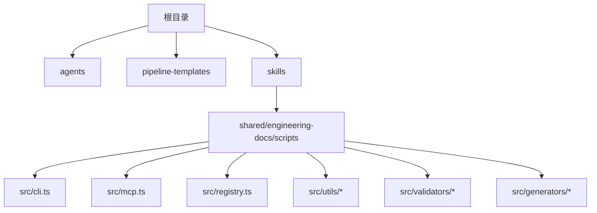
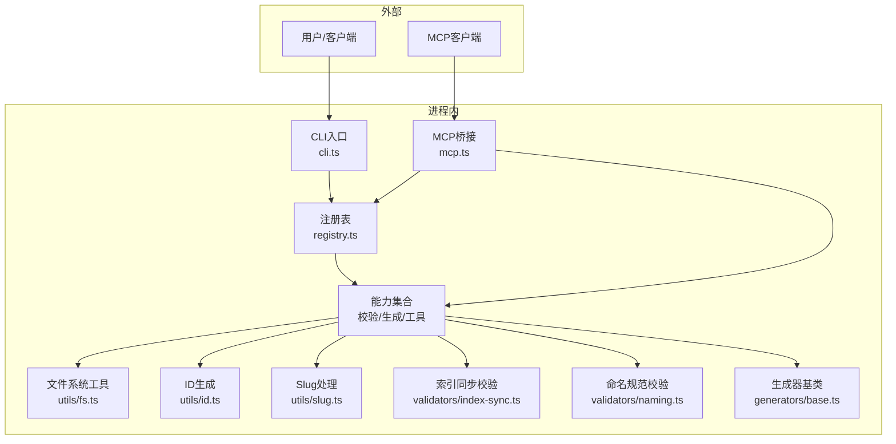
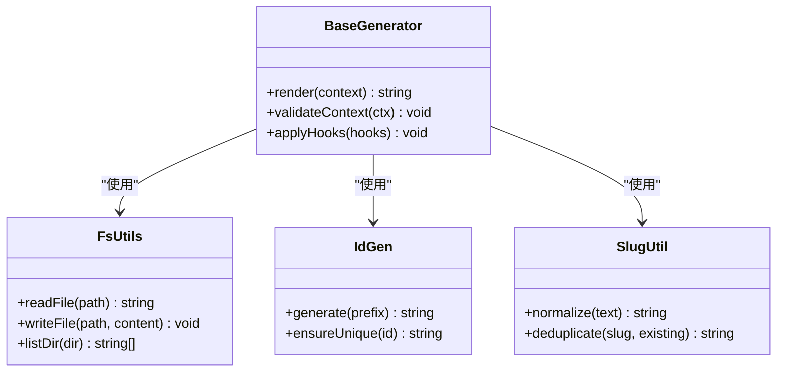
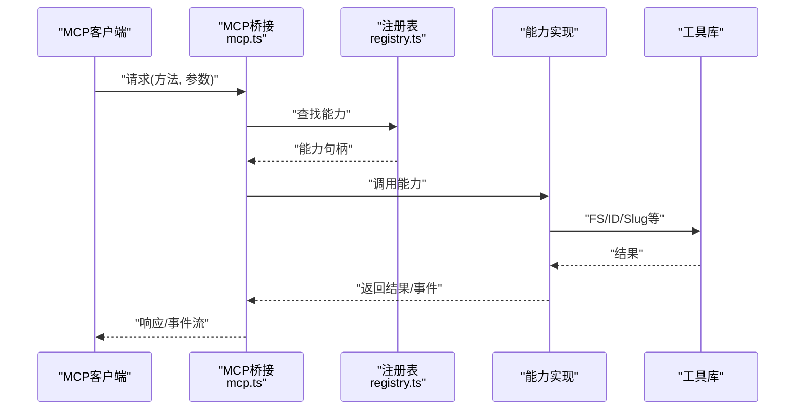
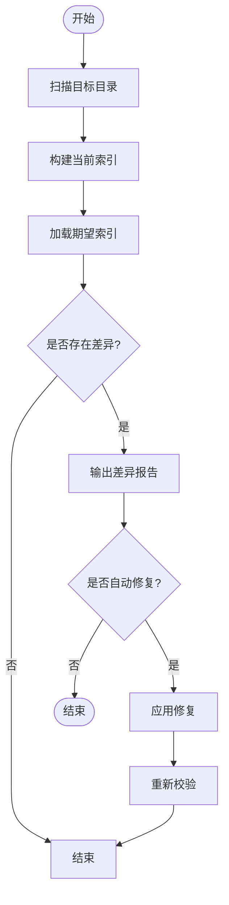
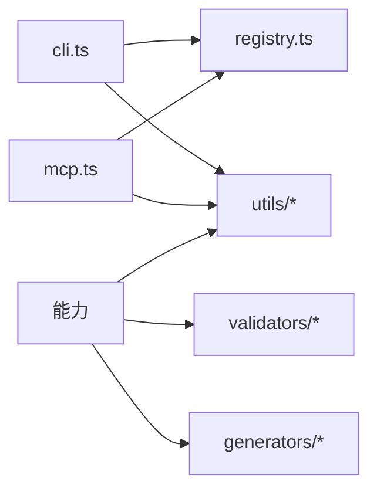

# API参考文档

<cite>
**本文引用的文件**   
- [CLAUDE.MD](file://CLAUDE.MD)
- [AGENTS.md](file://AGENTS.md)
- [AGENT-SKILL-MATRIX.md](file://AGENT-SKILL-MATRIX.md)
- [dir-graph.yaml](file://dir-graph.yaml)
- [pipeline-templates/README.md](file://pipeline-templates/README.md)
- [skills/shared/engineering-docs/scripts/src/cli.ts](file://skills/shared/engineering-docs/scripts/src/cli.ts)
- [skills/shared/engineering-docs/scripts/src/mcp.ts](file://skills/shared/engineering-docs/scripts/src/mcp.ts)
- [skills/shared/engineering-docs/scripts/src/registry.ts](file://skills/shared/engineering-docs/scripts/src/registry.ts)
- [skills/shared/engineering-docs/scripts/src/utils/fs.ts](file://skills/shared/engineering-docs/scripts/src/utils/fs.ts)
- [skills/shared/engineering-docs/scripts/src/utils/id.ts](file://skills/shared/engineering-docs/scripts/src/utils/id.ts)
- [skills/shared/engineering-docs/scripts/src/utils/slug.ts](file://skills/shared/engineering-docs/scripts/src/utils/slug.ts)
- [skills/shared/engineering-docs/scripts/src/validators/index-sync.ts](file://skills/shared/engineering-docs/scripts/src/validators/index-sync.ts)
- [skills/shared/engineering-docs/scripts/src/validators/naming.ts](file://skills/shared/engineering-docs/scripts/src/validators/naming.ts)
- [skills/shared/engineering-docs/scripts/src/generators/base.ts](file://skills/shared/engineering-docs/scripts/src/generators/base.ts)
- [skills/shared/engineering-docs/scripts/package.json](file://skills/shared/engineering-docs/scripts/package.json)
</cite>

## 目录
1. [简介](#简介)
2. [项目结构](#项目结构)
3. [核心组件](#核心组件)
4. [架构总览](#架构总览)
5. [详细组件分析](#详细组件分析)
6. [依赖关系分析](#依赖关系分析)
7. [性能考虑](#性能考虑)
8. [故障排查指南](#故障排查指南)
9. [结论](#结论)
10. [附录](#附录)

## 简介
本API参考文档面向MCP服务器、CLI工具与内部工具模块，提供端到端的技术说明。内容覆盖：
- MCP服务器的连接建立、消息格式、事件类型与实时交互模式
- CLI工具的命令与参数（文件操作、文档验证、模板生成等）
- 内部工具模块的API接口（文件系统、ID生成、slug处理等）
- 请求/响应示例、错误处理策略与认证方法
- 协议特定的调试与监控方法
- 性能优化建议与最佳实践
- API版本兼容性与迁移指南

## 项目结构
仓库采用“技能+脚本”的组织方式：
- skills：按领域划分的技能定义与配套资源
- pipeline-templates：流水线模板配置
- agents：智能体相关说明与矩阵
- shared/engineering-docs/scripts：工程文档相关的可执行脚本与工具库（包含CLI入口、MCP桥接、注册表、校验器、生成器与通用工具）

图表来源
- [dir-graph.yaml](file://dir-graph.yaml)
- [skills/shared/engineering-docs/scripts/src/cli.ts](file://skills/shared/engineering-docs/scripts/src/cli.ts)
- [skills/shared/engineering-docs/scripts/src/mcp.ts](file://skills/shared/engineering-docs/scripts/src/mcp.ts)
- [skills/shared/engineering-docs/scripts/src/registry.ts](file://skills/shared/engineering-docs/scripts/src/registry.ts)

章节来源
- [dir-graph.yaml](file://dir-graph.yaml)
- [CLAUDE.MD](file://CLAUDE.MD)
- [AGENTS.md](file://AGENTS.md)
- [AGENT-SKILL-MATRIX.md](file://AGENT-SKILL-MATRIX.md)
- [pipeline-templates/README.md](file://pipeline-templates/README.md)

## 核心组件
- CLI入口：负责解析命令行参数、路由到具体子命令、输出结果与错误信息
- MCP桥接：实现MCP协议的消息收发、会话管理与事件推送
- 注册表：维护命令/能力/资源的注册与发现机制
- 工具库：文件系统、ID生成、slug处理等通用能力
- 校验器：索引同步、命名规范等一致性检查
- 生成器：基于模板生成文档或代码骨架

章节来源
- [skills/shared/engineering-docs/scripts/src/cli.ts](file://skills/shared/engineering-docs/scripts/src/cli.ts)
- [skills/shared/engineering-docs/scripts/src/mcp.ts](file://skills/shared/engineering-docs/scripts/src/mcp.ts)
- [skills/shared/engineering-docs/scripts/src/registry.ts](file://skills/shared/engineering-docs/scripts/src/registry.ts)
- [skills/shared/engineering-docs/scripts/src/utils/fs.ts](file://skills/shared/engineering-docs/scripts/src/utils/fs.ts)
- [skills/shared/engineering-docs/scripts/src/utils/id.ts](file://skills/shared/engineering-docs/scripts/src/utils/id.ts)
- [skills/shared/engineering-docs/scripts/src/utils/slug.ts](file://skills/shared/engineering-docs/scripts/src/utils/slug.ts)
- [skills/shared/engineering-docs/scripts/src/validators/index-sync.ts](file://skills/shared/engineering-docs/scripts/src/validators/index-sync.ts)
- [skills/shared/engineering-docs/scripts/src/validators/naming.ts](file://skills/shared/engineering-docs/scripts/src/validators/naming.ts)
- [skills/shared/engineering-docs/scripts/src/generators/base.ts](file://skills/shared/engineering-docs/scripts/src/generators/base.ts)

## 架构总览
整体由CLI驱动，通过注册表调度具体能力；MCP桥接将外部调用转换为内部命令/工具调用，并支持事件流回传。

图表来源
- [skills/shared/engineering-docs/scripts/src/cli.ts](file://skills/shared/engineering-docs/scripts/src/cli.ts)
- [skills/shared/engineering-docs/scripts/src/mcp.ts](file://skills/shared/engineering-docs/scripts/src/mcp.ts)
- [skills/shared/engineering-docs/scripts/src/registry.ts](file://skills/shared/engineering-docs/scripts/src/registry.ts)
- [skills/shared/engineering-docs/scripts/src/utils/fs.ts](file://skills/shared/engineering-docs/scripts/src/utils/fs.ts)
- [skills/shared/engineering-docs/scripts/src/utils/id.ts](file://skills/shared/engineering-docs/scripts/src/utils/id.ts)
- [skills/shared/engineering-docs/scripts/src/utils/slug.ts](file://skills/shared/engineering-docs/scripts/src/utils/slug.ts)
- [skills/shared/engineering-docs/scripts/src/validators/index-sync.ts](file://skills/shared/engineering-docs/scripts/src/validators/index-sync.ts)
- [skills/shared/engineering-docs/scripts/src/validators/naming.ts](file://skills/shared/engineering-docs/scripts/src/validators/naming.ts)
- [skills/shared/engineering-docs/scripts/src/generators/base.ts](file://skills/shared/engineering-docs/scripts/src/generators/base.ts)

## 详细组件分析

### CLI工具
- 职责
  - 解析命令行参数与子命令
  - 路由到注册表中的能力
  - 统一输出与错误码
- 典型子命令（概念性）
  - 文件操作：读取/写入/遍历/复制/删除
  - 文档验证：索引同步、命名规范、元数据校验
  - 模板生成：基于模板生成PRD/SDD/PLAN/TASK等文档骨架
- 参数约定（概念性）
  - 全局选项：--verbose/--quiet/--config
  - 子命令选项：--input/--output/--template/--dry-run
- 错误处理
  - 标准化错误对象与退出码
  - 结构化日志输出（可选）

章节来源
- [skills/shared/engineering-docs/scripts/src/cli.ts](file://skills/shared/engineering-docs/scripts/src/cli.ts)
- [skills/shared/engineering-docs/scripts/package.json](file://skills/shared/engineering-docs/scripts/package.json)

### MCP服务器（桥接层）
- 职责
  - 接收MCP请求（如调用命令/工具/资源）
  - 转发至注册表与对应能力
  - 返回标准响应与事件流
- 连接建立
  - 启动监听（stdio或HTTP，取决于部署）
  - 握手与能力协商
- 消息格式（概念性）
  - 请求：{id, method, params}
  - 响应：{id, result|error}
  - 事件：{type, payload}
- 事件类型（概念性）
  - 进度更新、日志输出、完成通知、错误告警
- 实时交互
  - 长连接/流式返回
  - 心跳与超时控制

章节来源
- [skills/shared/engineering-docs/scripts/src/mcp.ts](file://skills/shared/engineering-docs/scripts/src/mcp.ts)
- [skills/shared/engineering-docs/scripts/src/registry.ts](file://skills/shared/engineering-docs/scripts/src/registry.ts)

### 注册表（能力发现与调度）
- 职责
  - 注册/注销命令与工具
  - 查找与分发调用
  - 维护元数据（描述、参数、权限）
- 设计要点
  - 低耦合：能力以插件形式接入
  - 可扩展：新增命令无需修改核心逻辑

章节来源
- [skills/shared/engineering-docs/scripts/src/registry.ts](file://skills/shared/engineering-docs/scripts/src/registry.ts)

### 工具库（文件系统、ID、Slug）
- 文件系统
  - 安全路径解析、读写封装、批量操作
- ID生成
  - 唯一性保证、前缀/后缀规则、冲突检测
- Slug处理
  - 规范化、去重、编码策略

章节来源
- [skills/shared/engineering-docs/scripts/src/utils/fs.ts](file://skills/shared/engineering-docs/scripts/src/utils/fs.ts)
- [skills/shared/engineering-docs/scripts/src/utils/id.ts](file://skills/shared/engineering-docs/scripts/src/utils/id.ts)
- [skills/shared/engineering-docs/scripts/src/utils/slug.ts](file://skills/shared/engineering-docs/scripts/src/utils/slug.ts)

### 校验器（索引同步、命名规范）
- 索引同步
  - 扫描目录、对比索引、修复不一致
- 命名规范
  - 文件名/目录名/字段命名规则校验

章节来源
- [skills/shared/engineering-docs/scripts/src/validators/index-sync.ts](file://skills/shared/engineering-docs/scripts/src/validators/index-sync.ts)
- [skills/shared/engineering-docs/scripts/src/validators/naming.ts](file://skills/shared/engineering-docs/scripts/src/validators/naming.ts)

### 生成器（模板引擎）
- 基类
  - 渲染上下文、变量替换、钩子扩展
- 模板
  - PRD/SDD/PLAN/TASK等模板位于templates目录

章节来源
- [skills/shared/engineering-docs/scripts/src/generators/base.ts](file://skills/shared/engineering-docs/scripts/src/generators/base.ts)

#### 类图（生成器与工具）

图表来源
- [skills/shared/engineering-docs/scripts/src/generators/base.ts](file://skills/shared/engineering-docs/scripts/src/generators/base.ts)
- [skills/shared/engineering-docs/scripts/src/utils/fs.ts](file://skills/shared/engineering-docs/scripts/src/utils/fs.ts)
- [skills/shared/engineering-docs/scripts/src/utils/id.ts](file://skills/shared/engineering-docs/scripts/src/utils/id.ts)
- [skills/shared/engineering-docs/scripts/src/utils/slug.ts](file://skills/shared/engineering-docs/scripts/src/utils/slug.ts)

#### 序列图（MCP调用流程）

图表来源
- [skills/shared/engineering-docs/scripts/src/mcp.ts](file://skills/shared/engineering-docs/scripts/src/mcp.ts)
- [skills/shared/engineering-docs/scripts/src/registry.ts](file://skills/shared/engineering-docs/scripts/src/registry.ts)
- [skills/shared/engineering-docs/scripts/src/utils/fs.ts](file://skills/shared/engineering-docs/scripts/src/utils/fs.ts)
- [skills/shared/engineering-docs/scripts/src/utils/id.ts](file://skills/shared/engineering-docs/scripts/src/utils/id.ts)
- [skills/shared/engineering-docs/scripts/src/utils/slug.ts](file://skills/shared/engineering-docs/scripts/src/utils/slug.ts)

#### 流程图（索引同步校验）

图表来源
- [skills/shared/engineering-docs/scripts/src/validators/index-sync.ts](file://skills/shared/engineering-docs/scripts/src/validators/index-sync.ts)

## 依赖关系分析
- 内部依赖
  - CLI依赖注册表与工具库
  - MCP桥接依赖注册表与能力
  - 能力依赖工具库与校验器/生成器
- 外部依赖
  - Node.js运行时与包管理器（见package.json）
  - 文件系统I/O、网络栈（MCP传输）

图表来源
- [skills/shared/engineering-docs/scripts/src/cli.ts](file://skills/shared/engineering-docs/scripts/src/cli.ts)
- [skills/shared/engineering-docs/scripts/src/mcp.ts](file://skills/shared/engineering-docs/scripts/src/mcp.ts)
- [skills/shared/engineering-docs/scripts/src/registry.ts](file://skills/shared/engineering-docs/scripts/src/registry.ts)
- [skills/shared/engineering-docs/scripts/src/utils/fs.ts](file://skills/shared/engineering-docs/scripts/src/utils/fs.ts)
- [skills/shared/engineering-docs/scripts/src/utils/id.ts](file://skills/shared/engineering-docs/scripts/src/utils/id.ts)
- [skills/shared/engineering-docs/scripts/src/utils/slug.ts](file://skills/shared/engineering-docs/scripts/src/utils/slug.ts)
- [skills/shared/engineering-docs/scripts/src/validators/index-sync.ts](file://skills/shared/engineering-docs/scripts/src/validators/index-sync.ts)
- [skills/shared/engineering-docs/scripts/src/validators/naming.ts](file://skills/shared/engineering-docs/scripts/src/validators/naming.ts)
- [skills/shared/engineering-docs/scripts/src/generators/base.ts](file://skills/shared/engineering-docs/scripts/src/generators/base.ts)
- [skills/shared/engineering-docs/scripts/package.json](file://skills/shared/engineering-docs/scripts/package.json)

章节来源
- [skills/shared/engineering-docs/scripts/package.json](file://skills/shared/engineering-docs/scripts/package.json)

## 性能考虑
- I/O优化
  - 批量读写、避免重复扫描、缓存热点索引
- 并发控制
  - 限制并行度、背压与重试退避
- 内存管理
  - 流式处理大文件、及时释放引用
- 序列化开销
  - 精简消息体、按需字段
- 监控与可观测性
  - 关键路径耗时埋点、错误率与延迟指标

[本节为通用指导，不直接分析具体文件]

## 故障排查指南
- 常见问题定位
  - 路径与权限：确认工作目录与读写权限
  - 模板缺失：检查模板路径与变量映射
  - 命名冲突：查看slug去重与ID唯一性策略
- 日志与调试
  - 启用详细日志、捕获异常堆栈
  - 对MCP请求进行抓包与回放
- 恢复策略
  - 幂等设计、断点续跑、回滚方案

章节来源
- [skills/shared/engineering-docs/scripts/src/validators/index-sync.ts](file://skills/shared/engineering-docs/scripts/src/validators/index-sync.ts)
- [skills/shared/engineering-docs/scripts/src/validators/naming.ts](file://skills/shared/engineering-docs/scripts/src/validators/naming.ts)
- [skills/shared/engineering-docs/scripts/src/utils/id.ts](file://skills/shared/engineering-docs/scripts/src/utils/id.ts)
- [skills/shared/engineering-docs/scripts/src/utils/slug.ts](file://skills/shared/engineering-docs/scripts/src/utils/slug.ts)

## 结论
本参考文档梳理了MCP服务器、CLI与内部工具模块的职责边界与交互方式，提供了从连接建立到事件处理的完整视图，并给出性能优化与排障建议。建议在集成时优先关注注册表的扩展点与MCP消息契约，确保能力与协议的稳定演进。

[本节为总结性内容，不直接分析具体文件]

## 附录

### 认证与安全
- 认证方法（概念性）
  - 环境变量注入令牌、证书双向TLS、网关鉴权
- 授权模型（概念性）
  - 基于角色的访问控制、最小权限原则
- 敏感信息保护
  - 不在日志中输出密钥、脱敏展示

[本节为通用指导，不直接分析具体文件]

### 版本兼容性与迁移指南
- 兼容性策略
  - 语义化版本、向后兼容变更、弃用周期
- 迁移步骤（概念性）
  - 升级依赖、更新配置、运行校验器、回归测试
- 回滚方案
  - 保留旧版本二进制与配置快照

[本节为通用指导，不直接分析具体文件]

### 请求/响应示例（概念性）
- CLI
  - 输入：子命令与参数
  - 输出：结构化结果或错误码
- MCP
  - 请求：{id, method, params}
  - 响应：{id, result|error}
  - 事件：{type, payload}

[本节为通用指导，不直接分析具体文件]