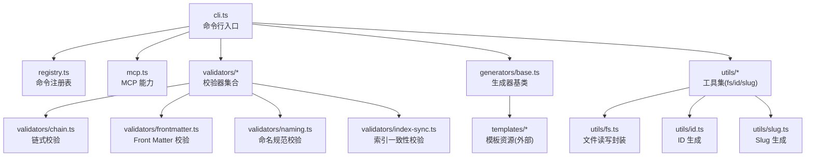
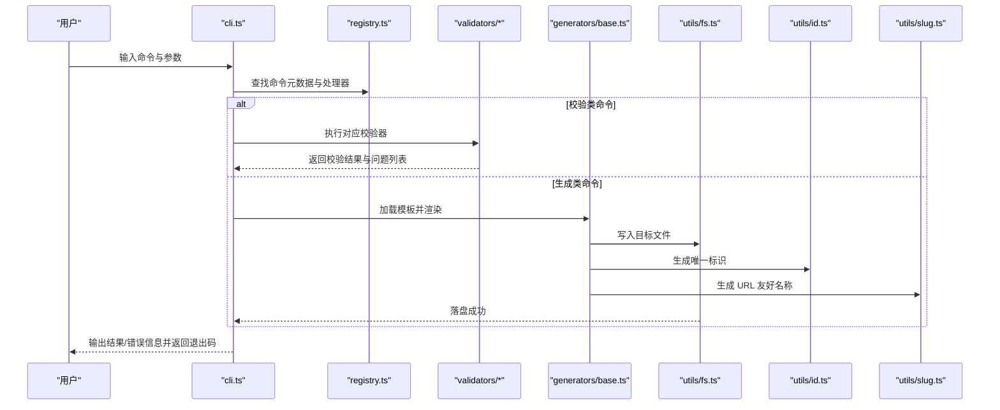
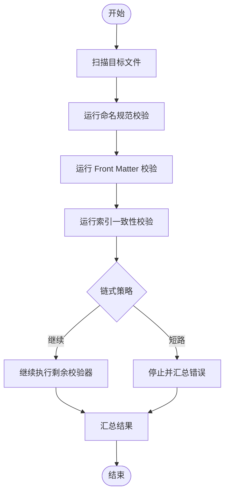
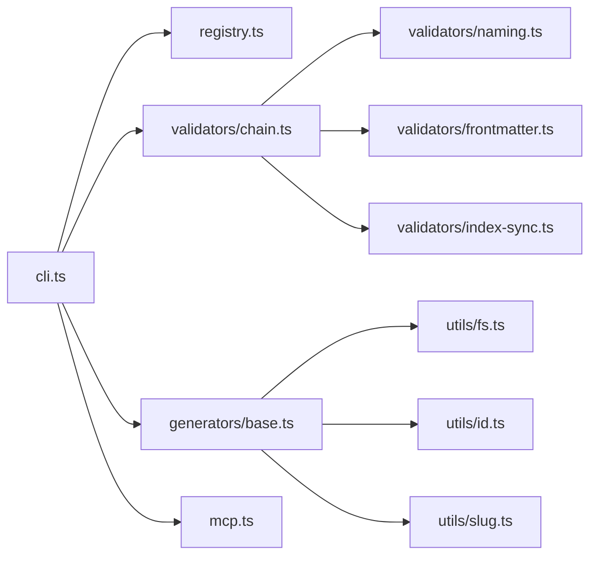

# CLI命令参考

<cite>
**本文引用的文件**   
- [cli.ts](file://skills/shared/engineering-docs/scripts/src/cli.ts)
- [registry.ts](file://skills/shared/engineering-docs/scripts/src/registry.ts)
- [mcp.ts](file://skills/shared/engineering-docs/scripts/src/mcp.ts)
- [validators/index-sync.ts](file://skills/shared/engineering-docs/scripts/src/validators/index-sync.ts)
- [validators/frontmatter.ts](file://skills/shared/engineering-docs/scripts/src/validators/frontmatter.ts)
- [validators/naming.ts](file://skills/shared/engineering-docs/scripts/src/validators/naming.ts)
- [validators/chain.ts](file://skills/shared/engineering-docs/scripts/src/validators/chain.ts)
- [generators/base.ts](file://skills/shared/engineering-docs/scripts/src/generators/base.ts)
- [utils/fs.ts](file://skills/shared/engineering-docs/scripts/src/utils/fs.ts)
- [utils/id.ts](file://skills/shared/engineering-docs/scripts/src/utils/id.ts)
- [utils/slug.ts](file://skills/shared/engineering-docs/scripts/src/utils/slug.ts)
- [package.json](file://skills/shared/engineering-docs/scripts/package.json)
</cite>

## 目录
1. [简介](#简介)
2. [项目结构](#项目结构)
3. [核心组件](#核心组件)
4. [架构总览](#架构总览)
5. [详细组件分析](#详细组件分析)
6. [依赖关系分析](#依赖关系分析)
7. [性能与可扩展性](#性能与可扩展性)
8. [故障排查指南](#故障排查指南)
9. [结论](#结论)
10. [附录](#附录)

## 简介
本参考文档面向使用工程化文档工具链的开发者与工程师，系统化梳理并说明该仓库中提供的命令行工具（CLI）能力。内容覆盖：
- 文档验证：校验命名规范、Front Matter 字段、索引一致性等
- 模板生成：基于模板快速创建文档骨架
- 文件操作：批量读取、写入、路径解析等基础能力
- ID 生成：稳定、可复现的标识符生成
- 执行流程、输出格式与错误处理机制
- 常见使用场景的最佳实践与自动化脚本模式

本参考旨在帮助读者快速上手、高效集成到工作流与 CI/CD 流水线中。

## 项目结构
该 CLI 位于 skills/shared/engineering-docs/scripts 子项目中，采用 TypeScript 实现，模块化组织清晰：
- cli.ts：命令行入口与命令路由
- registry.ts：命令注册表与元数据管理
- mcp.ts：MCP 协议相关能力（如适用）
- validators/*：各类校验器（命名、Front Matter、索引同步、链式组合）
- generators/base.ts：模板与生成器基类
- utils/*：通用工具（文件系统、ID、Slug）
- package.json：包定义与脚本入口

图表来源
- [cli.ts](file://skills/shared/engineering-docs/scripts/src/cli.ts)
- [registry.ts](file://skills/shared/engineering-docs/scripts/src/registry.ts)
- [mcp.ts](file://skills/shared/engineering-docs/scripts/src/mcp.ts)
- [validators/index-sync.ts](file://skills/shared/engineering-docs/scripts/src/validators/index-sync.ts)
- [validators/frontmatter.ts](file://skills/shared/engineering-docs/scripts/src/validators/frontmatter.ts)
- [validators/naming.ts](file://skills/shared/engineering-docs/scripts/src/validators/naming.ts)
- [validators/chain.ts](file://skills/shared/engineering-docs/scripts/src/validators/chain.ts)
- [generators/base.ts](file://skills/shared/engineering-docs/scripts/src/generators/base.ts)
- [utils/fs.ts](file://skills/shared/engineering-docs/scripts/src/utils/fs.ts)
- [utils/id.ts](file://skills/shared/engineering-docs/scripts/src/utils/id.ts)
- [utils/slug.ts](file://skills/shared/engineering-docs/scripts/src/utils/slug.ts)

章节来源
- [cli.ts](file://skills/shared/engineering-docs/scripts/src/cli.ts)
- [package.json](file://skills/shared/engineering-docs/scripts/package.json)

## 核心组件
- 命令入口与路由（cli.ts）
  - 负责解析命令行参数、分发到具体命令处理器、统一错误捕获与退出码
- 命令注册表（registry.ts）
  - 集中维护命令元数据、别名、描述、参数定义与执行函数
- MCP 能力（mcp.ts）
  - 提供与 MCP 协议相关的交互能力（若启用）
- 校验器模块（validators/*）
  - naming.ts：命名规范校验
  - frontmatter.ts：Front Matter 字段校验
  - index-sync.ts：索引文件与文档一致性校验
  - chain.ts：将多个校验器组合为链式校验
- 生成器模块（generators/base.ts）
  - 提供模板渲染与文件落盘的基础能力
- 工具模块（utils/*）
  - fs.ts：文件读写、目录遍历、路径规范化
  - id.ts：稳定 ID 生成
  - slug.ts：URL 友好的 Slug 生成

章节来源
- [cli.ts](file://skills/shared/engineering-docs/scripts/src/cli.ts)
- [registry.ts](file://skills/shared/engineering-docs/scripts/src/registry.ts)
- [mcp.ts](file://skills/shared/engineering-docs/scripts/src/mcp.ts)
- [validators/chain.ts](file://skills/shared/engineering-docs/scripts/src/validators/chain.ts)
- [validators/frontmatter.ts](file://skills/shared/engineering-docs/scripts/src/validators/frontmatter.ts)
- [validators/naming.ts](file://skills/shared/engineering-docs/scripts/src/validators/naming.ts)
- [validators/index-sync.ts](file://skills/shared/engineering-docs/scripts/src/validators/index-sync.ts)
- [generators/base.ts](file://skills/shared/engineering-docs/scripts/src/generators/base.ts)
- [utils/fs.ts](file://skills/shared/engineering-docs/scripts/src/utils/fs.ts)
- [utils/id.ts](file://skills/shared/engineering-docs/scripts/src/utils/id.ts)
- [utils/slug.ts](file://skills/shared/engineering-docs/scripts/src/utils/slug.ts)

## 架构总览
下图展示了 CLI 从入口到各功能模块的调用关系与数据流向。

图表来源
- [cli.ts](file://skills/shared/engineering-docs/scripts/src/cli.ts)
- [registry.ts](file://skills/shared/engineering-docs/scripts/src/registry.ts)
- [validators/chain.ts](file://skills/shared/engineering-docs/scripts/src/validators/chain.ts)
- [validators/frontmatter.ts](file://skills/shared/engineering-docs/scripts/src/validators/frontmatter.ts)
- [validators/naming.ts](file://skills/shared/engineering-docs/scripts/src/validators/naming.ts)
- [validators/index-sync.ts](file://skills/shared/engineering-docs/scripts/src/validators/index-sync.ts)
- [generators/base.ts](file://skills/shared/engineering-docs/scripts/src/generators/base.ts)
- [utils/fs.ts](file://skills/shared/engineering-docs/scripts/src/utils/fs.ts)
- [utils/id.ts](file://skills/shared/engineering-docs/scripts/src/utils/id.ts)
- [utils/slug.ts](file://skills/shared/engineering-docs/scripts/src/utils/slug.ts)

## 详细组件分析

### 命令入口与路由（cli.ts）
- 职责
  - 解析命令行参数与选项
  - 根据命令名在注册表中查找处理器
  - 统一异常捕获、日志输出与退出码设置
- 关键行为
  - 支持 --help/-h 显示帮助
  - 支持 --verbose/-v 输出详细日志
  - 对未识别命令给出提示与可用命令列表
- 典型流程
  - 启动 -> 解析参数 -> 路由到处理器 -> 执行业务逻辑 -> 输出结果 -> 退出

章节来源
- [cli.ts](file://skills/shared/engineering-docs/scripts/src/cli.ts)

### 命令注册表（registry.ts）
- 职责
  - 集中声明所有命令的名称、别名、描述、参数定义与执行函数引用
  - 提供按名称或别名查询命令的能力
- 设计要点
  - 命令元数据与实现解耦，便于扩展与维护
  - 参数定义包含类型、默认值、是否必填、帮助文本等

章节来源
- [registry.ts](file://skills/shared/engineering-docs/scripts/src/registry.ts)

### 校验器模块（validators/*）
- naming.ts：命名规范校验
  - 检查文件名、目录结构与命名约定是否符合团队规范
- frontmatter.ts：Front Matter 校验
  - 校验 YAML 头部字段是否存在、类型是否正确、枚举值是否合法
- index-sync.ts：索引一致性校验
  - 对比索引文件与实际文档集合，发现缺失或冗余条目
- chain.ts：链式校验
  - 将多个校验器串联执行，汇总错误与警告，支持短路或继续策略

图表来源
- [validators/naming.ts](file://skills/shared/engineering-docs/scripts/src/validators/naming.ts)
- [validators/frontmatter.ts](file://skills/shared/engineering-docs/scripts/src/validators/frontmatter.ts)
- [validators/index-sync.ts](file://skills/shared/engineering-docs/scripts/src/validators/index-sync.ts)
- [validators/chain.ts](file://skills/shared/engineering-docs/scripts/src/validators/chain.ts)

章节来源
- [validators/naming.ts](file://skills/shared/engineering-docs/scripts/src/validators/naming.ts)
- [validators/frontmatter.ts](file://skills/shared/engineering-docs/scripts/src/validators/frontmatter.ts)
- [validators/index-sync.ts](file://skills/shared/engineering-docs/scripts/src/validators/index-sync.ts)
- [validators/chain.ts](file://skills/shared/engineering-docs/scripts/src/validators/chain.ts)

### 生成器模块（generators/base.ts）
- 职责
  - 提供模板渲染与文件落盘的通用能力
  - 支持变量替换、条件渲染与批量生成
- 关键能力
  - 模板加载与缓存
  - 上下文数据注入
  - 输出路径计算与冲突检测
  - 幂等生成（避免重复覆盖）

章节来源
- [generators/base.ts](file://skills/shared/engineering-docs/scripts/src/generators/base.ts)

### 工具模块（utils/*）
- fs.ts：文件系统封装
  - 安全读取/写入、目录遍历、路径规范化、权限检查
- id.ts：ID 生成
  - 提供稳定、可复现的标识符生成策略（如基于种子或哈希）
- slug.ts：Slug 生成
  - 生成 URL 友好的短名称，处理特殊字符与去重

章节来源
- [utils/fs.ts](file://skills/shared/engineering-docs/scripts/src/utils/fs.ts)
- [utils/id.ts](file://skills/shared/engineering-docs/scripts/src/utils/id.ts)
- [utils/slug.ts](file://skills/shared/engineering-docs/scripts/src/utils/slug.ts)

### MCP 能力（mcp.ts）
- 职责
  - 提供与 MCP 协议相关的交互能力（如适用）
- 使用建议
  - 仅在需要与 MCP 服务交互时启用
  - 注意网络超时与重试策略

章节来源
- [mcp.ts](file://skills/shared/engineering-docs/scripts/src/mcp.ts)

## 依赖关系分析
- 内部依赖
  - cli.ts 依赖 registry.ts 进行命令解析与分发
  - 校验器之间通过 chain.ts 组合
  - 生成器依赖 utils/fs.ts 进行文件 IO，依赖 utils/id.ts 与 utils/slug.ts 生成标识
- 外部依赖
  - 包定义与脚本入口由 package.json 管理

图表来源
- [cli.ts](file://skills/shared/engineering-docs/scripts/src/cli.ts)
- [registry.ts](file://skills/shared/engineering-docs/scripts/src/registry.ts)
- [validators/chain.ts](file://skills/shared/engineering-docs/scripts/src/validators/chain.ts)
- [validators/naming.ts](file://skills/shared/engineering-docs/scripts/src/validators/naming.ts)
- [validators/frontmatter.ts](file://skills/shared/engineering-docs/scripts/src/validators/frontmatter.ts)
- [validators/index-sync.ts](file://skills/shared/engineering-docs/scripts/src/validators/index-sync.ts)
- [generators/base.ts](file://skills/shared/engineering-docs/scripts/src/generators/base.ts)
- [utils/fs.ts](file://skills/shared/engineering-docs/scripts/src/utils/fs.ts)
- [utils/id.ts](file://skills/shared/engineering-docs/scripts/src/utils/id.ts)
- [utils/slug.ts](file://skills/shared/engineering-docs/scripts/src/utils/slug.ts)
- [mcp.ts](file://skills/shared/engineering-docs/scripts/src/mcp.ts)

章节来源
- [package.json](file://skills/shared/engineering-docs/scripts/package.json)

## 性能与可扩展性
- 批量操作
  - 优先使用并行扫描与批处理写入，减少磁盘 I/O 次数
  - 对大目录使用惰性加载与增量校验
- 校验优化
  - 使用链式校验器的短路策略尽早失败
  - 缓存已解析的 Front Matter 与索引映射
- 生成器优化
  - 模板预编译与缓存
  - 冲突检测与幂等写入避免重复开销
- 可扩展性
  - 新增命令仅需在注册表中声明并在处理器中实现
  - 新增校验器遵循统一接口并通过链式组合接入

[本节为通用指导，不直接分析具体文件]

## 故障排查指南
- 常见问题
  - 命令未找到：检查命令名与别名是否在注册表中正确声明
  - 参数解析失败：核对参数定义的类型与默认值，确认传入值符合约束
  - 校验失败：查看校验器输出的问题清单，逐项修复命名、Front Matter 或索引不一致
  - 生成失败：检查模板路径、变量注入与目标目录权限
- 诊断步骤
  - 启用详细日志（--verbose）定位错误堆栈
  - 缩小范围：仅对单个文件或目录执行，逐步扩大
  - 隔离依赖：禁用 MCP 能力以排除网络因素
- 恢复建议
  - 回滚最近变更，确认回归
  - 清理临时文件与缓存，重新执行
  - 更新依赖版本，确保兼容性

章节来源
- [cli.ts](file://skills/shared/engineering-docs/scripts/src/cli.ts)
- [validators/chain.ts](file://skills/shared/engineering-docs/scripts/src/validators/chain.ts)
- [generators/base.ts](file://skills/shared/engineering-docs/scripts/src/generators/base.ts)
- [utils/fs.ts](file://skills/shared/engineering-docs/scripts/src/utils/fs.ts)

## 结论
本 CLI 通过清晰的模块化设计与统一的命令注册机制，提供了文档验证、模板生成、文件操作与 ID 生成等核心能力。借助链式校验与生成器基类，系统具备良好的可扩展性与稳定性。建议在团队内建立标准命令用法与自动化脚本，以提升协作效率与质量保障水平。

[本节为总结性内容，不直接分析具体文件]

## 附录
- 环境变量配置
  - 当前代码库未发现显式的环境变量定义；如需扩展，可在工具模块中统一读取与校验
- 最佳实践
  - 在 CI 中集成校验命令，确保提交前通过命名与 Front Matter 校验
  - 使用生成器批量初始化新文档，保持结构一致
  - 对长任务启用详细日志，便于问题定位
- 自动化脚本模式
  - 将常用命令封装为 shell 或 bat 脚本，统一参数与环境
  - 结合包管理器脚本（scripts）实现一键执行

[本节为概念性内容，不直接分析具体文件]