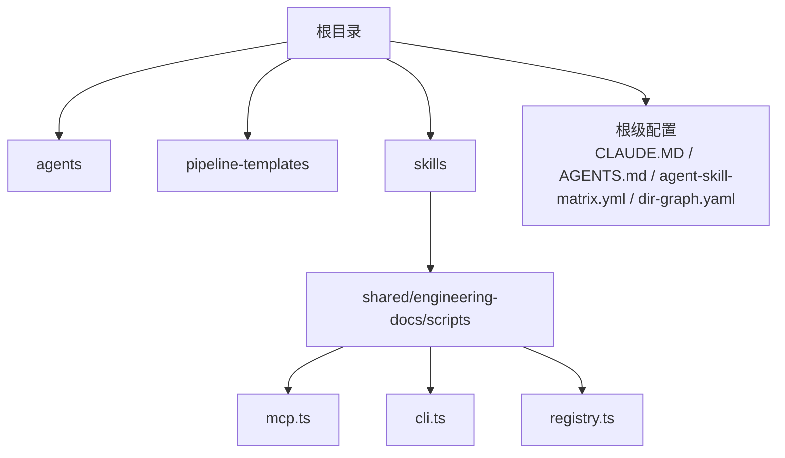
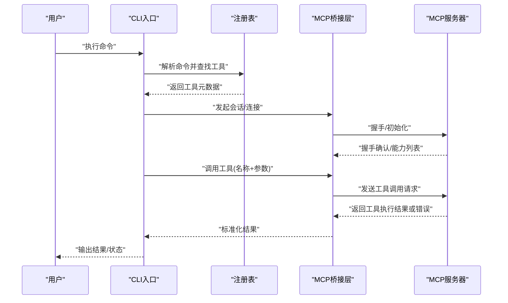
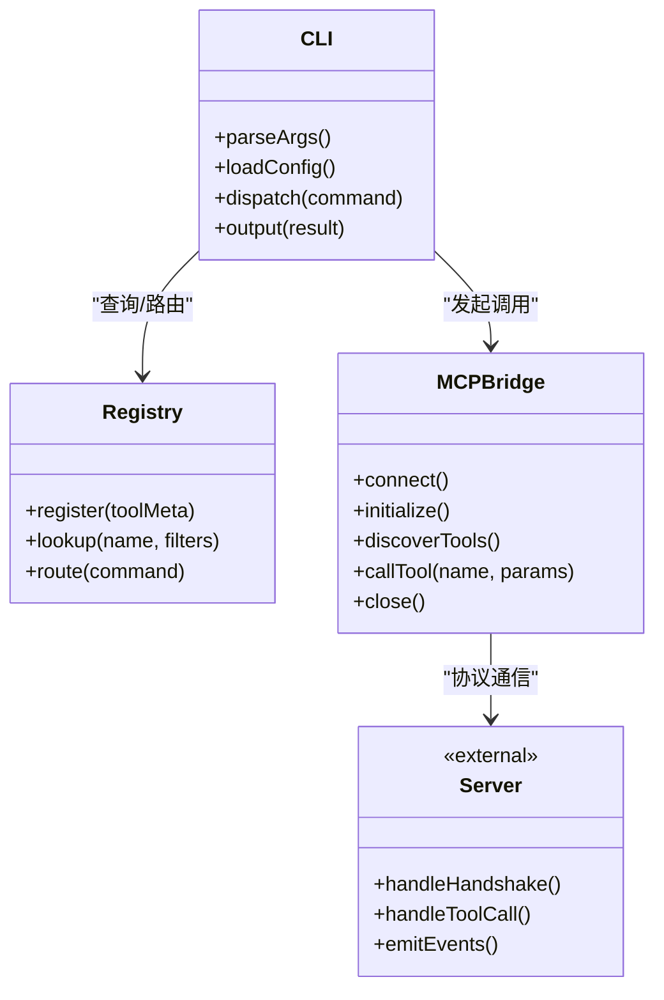
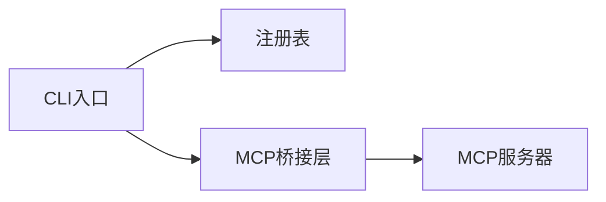

# MCP服务器API

<cite>
**本文引用的文件**   
- [CLAUDE.MD](file://CLAUDE.MD)
- [AGENT-SKILL-MATRIX.md](file://AGENT-SKILL-MATRIX.md)
- [AGENTS.md](file://AGENTS.md)
- [agent-skill-matrix.yml](file://agent-skill-matrix.yml)
- [dir-graph.yaml](file://dir-graph.yaml)
- [pipeline-templates/README.md](file://pipeline-templates/README.md)
- [skills/shared/engineering-docs/scripts/src/mcp.ts](file://skills/shared/engineering-docs/scripts/src/mcp.ts)
- [skills/shared/engineering-docs/scripts/src/cli.ts](file://skills/shared/engineering-docs/scripts/src/cli.ts)
- [skills/shared/engineering-docs/scripts/src/registry.ts](file://skills/shared/engineering-docs/scripts/src/registry.ts)
</cite>

## 目录
1. [简介](#简介)
2. [项目结构](#项目结构)
3. [核心组件](#核心组件)
4. [架构总览](#架构总览)
5. [详细组件分析](#详细组件分析)
6. [依赖关系分析](#依赖关系分析)
7. [性能考虑](#性能考虑)
8. [故障排查指南](#故障排查指南)
9. [结论](#结论)
10. [附录](#附录)

## 简介
本技术文档面向MCP（Model Context Protocol）服务器的API设计与实现，目标是提供端到端的技术说明：包括连接建立、会话管理、工具调用与结果返回的完整流程；每个API方法的参数类型、返回值结构与错误码定义；请求响应示例（成功与失败场景）；认证机制、权限控制与安全性考量；实时事件处理、错误恢复策略与性能优化建议；版本兼容性与迁移指南。

本项目仓库以“技能/智能体”编排为主，同时包含一个用于工程文档脚本的MCP客户端/集成模块，位于 skills/shared/engineering-docs/scripts 下。该模块提供了与MCP交互的关键入口点（CLI、注册表、MCP桥接），可作为理解MCP协议在本项目中的落地方式的重要参考。

## 项目结构
仓库采用按领域与能力划分的组织方式：
- agents：智能体角色与职责说明
- pipeline-templates：流水线模板与配置
- skills：按业务域组织的技能集合，其中 shared/engineering-docs/scripts 包含MCP相关脚本实现
- 根级配置文件：描述智能体矩阵、目录结构图等

图表来源
- [dir-graph.yaml](file://dir-graph.yaml)
- [CLAUDE.MD](file://CLAUDE.MD)
- [AGENTS.md](file://AGENTS.md)
- [agent-skill-matrix.yml](file://agent-skill-matrix.yml)

章节来源
- [CLAUDE.MD](file://CLAUDE.MD)
- [AGENTS.md](file://AGENTS.md)
- [agent-skill-matrix.yml](file://agent-skill-matrix.yml)
- [dir-graph.yaml](file://dir-graph.yaml)

## 核心组件
围绕MCP协议在本项目的落地，核心组件包括：
- CLI入口：负责解析命令行参数、初始化上下文、调度MCP交互流程
- MCP桥接层：封装与MCP服务器之间的消息收发、会话生命周期管理、工具发现与调用
- 注册表：维护可用工具/技能的元数据与路由映射，支持动态扩展
- 工程文档脚本生态：基于上述组件完成文档生成、校验、模板渲染等任务

这些组件共同构成“命令驱动的工具调用”工作流：CLI接收指令，通过注册表定位目标工具，经由MCP桥接层与MCP服务器通信，执行工具并回传结果。

章节来源
- [skills/shared/engineering-docs/scripts/src/cli.ts](file://skills/shared/engineering-docs/scripts/src/cli.ts)
- [skills/shared/engineering-docs/scripts/src/mcp.ts](file://skills/shared/engineering-docs/scripts/src/mcp.ts)
- [skills/shared/engineering-docs/scripts/src/registry.ts](file://skills/shared/engineering-docs/scripts/src/registry.ts)

## 架构总览
下图展示了从CLI到MCP服务器的整体交互流程，涵盖连接建立、会话管理、工具调用与结果返回。

图表来源
- [skills/shared/engineering-docs/scripts/src/cli.ts](file://skills/shared/engineering-docs/scripts/src/cli.ts)
- [skills/shared/engineering-docs/scripts/src/mcp.ts](file://skills/shared/engineering-docs/scripts/src/mcp.ts)
- [skills/shared/engineering-docs/scripts/src/registry.ts](file://skills/shared/engineering-docs/scripts/src/registry.ts)

## 详细组件分析

### CLI入口（命令解析与调度）
- 职责
  - 解析命令行参数与环境变量
  - 加载配置与上下文
  - 根据命令选择对应工具或子流程
  - 协调注册表与MCP桥接层完成调用
- 关键流程
  - 启动阶段：初始化日志、读取配置、构建上下文
  - 命令分发：将具体命令映射到工具或子流程
  - 结果输出：格式化并打印结果，设置退出码
- 错误处理
  - 参数校验失败：返回明确错误信息并提示用法
  - 工具未找到：提示可用工具列表
  - 网络/协议错误：重试策略与降级输出

章节来源
- [skills/shared/engineering-docs/scripts/src/cli.ts](file://skills/shared/engineering-docs/scripts/src/cli.ts)

### MCP桥接层（协议适配与会话管理）
- 职责
  - 管理与MCP服务器的连接与会话生命周期
  - 封装协议消息的序列化/反序列化
  - 统一工具调用的请求/响应模型
  - 处理实时事件（如进度、通知）
- 关键流程
  - 连接建立：握手、协商能力、建立会话ID
  - 工具发现：获取工具清单与元数据
  - 工具调用：发送调用请求，等待结果或流式事件
  - 会话关闭：清理资源、释放连接
- 错误处理
  - 连接异常：指数退避重试、熔断与告警
  - 协议不匹配：版本协商失败时给出兼容性提示
  - 超时与中断：可取消的任务与优雅退出

章节来源
- [skills/shared/engineering-docs/scripts/src/mcp.ts](file://skills/shared/engineering-docs/scripts/src/mcp.ts)

### 注册表（工具元数据与路由）
- 职责
  - 维护工具/技能的注册信息与路由规则
  - 提供按名称、标签、版本的查询接口
  - 支持动态加载与热更新
- 关键流程
  - 注册：扫描并登记工具元数据
  - 查询：按条件检索工具
  - 路由：将命令映射到具体工具实现
- 错误处理
  - 重复注册：冲突检测与覆盖策略
  - 无效元数据：格式校验与修复建议

章节来源
- [skills/shared/engineering-docs/scripts/src/registry.ts](file://skills/shared/engineering-docs/scripts/src/registry.ts)

### 类图（代码结构示意）

图表来源
- [skills/shared/engineering-docs/scripts/src/cli.ts](file://skills/shared/engineering-docs/scripts/src/cli.ts)
- [skills/shared/engineering-docs/scripts/src/registry.ts](file://skills/shared/engineering-docs/scripts/src/registry.ts)
- [skills/shared/engineering-docs/scripts/src/mcp.ts](file://skills/shared/engineering-docs/scripts/src/mcp.ts)

## 依赖关系分析
- 内部依赖
  - CLI依赖注册表进行命令到工具的映射
  - CLI依赖MCP桥接层进行协议通信
  - MCP桥接层依赖底层网络/传输库（由运行时环境提供）
- 外部依赖
  - MCP服务器：遵循MCP协议的远程服务
  - 配置与环境：环境变量、配置文件
- 潜在循环依赖
  - 当前设计为单向依赖（CLI→注册表/MCP桥接层），无循环依赖迹象

图表来源
- [skills/shared/engineering-docs/scripts/src/cli.ts](file://skills/shared/engineering-docs/scripts/src/cli.ts)
- [skills/shared/engineering-docs/scripts/src/registry.ts](file://skills/shared/engineering-docs/scripts/src/registry.ts)
- [skills/shared/engineering-docs/scripts/src/mcp.ts](file://skills/shared/engineering-docs/scripts/src/mcp.ts)

章节来源
- [skills/shared/engineering-docs/scripts/src/cli.ts](file://skills/shared/engineering-docs/scripts/src/cli.ts)
- [skills/shared/engineering-docs/scripts/src/registry.ts](file://skills/shared/engineering-docs/scripts/src/registry.ts)
- [skills/shared/engineering-docs/scripts/src/mcp.ts](file://skills/shared/engineering-docs/scripts/src/mcp.ts)

## 性能考虑
- 连接复用：保持长连接以减少握手开销
- 批量调用：合并多个工具调用以降低网络往返
- 缓存策略：对工具元数据与常用结果进行本地缓存
- 并发控制：限制并发调用数，避免服务端过载
- 超时与重试：合理设置超时时间，使用指数退避重试
- 流式处理：对长时间运行的任务采用事件流推送，提升用户体验

[本节为通用指导，无需特定文件引用]

## 故障排查指南
- 常见问题
  - 连接失败：检查网络连通性、代理配置、证书有效性
  - 握手失败：核对MCP版本兼容性、能力协商是否满足
  - 工具未找到：确认注册表是否正确加载、工具命名是否一致
  - 调用超时：调整超时阈值、检查服务端负载与队列长度
- 诊断步骤
  - 启用详细日志：记录握手、请求、响应与错误堆栈
  - 最小化复现：剥离无关依赖，聚焦问题链路
  - 断点调试：在CLI、注册表、MCP桥接层关键路径插入断点
  - 抓包分析：捕获网络报文，验证协议字段是否符合规范
- 恢复策略
  - 自动重试：对瞬态错误进行有限次重试
  - 降级模式：在不可用时返回缓存或默认结果
  - 优雅退出：确保资源释放与状态一致性

章节来源
- [skills/shared/engineering-docs/scripts/src/cli.ts](file://skills/shared/engineering-docs/scripts/src/cli.ts)
- [skills/shared/engineering-docs/scripts/src/mcp.ts](file://skills/shared/engineering-docs/scripts/src/mcp.ts)

## 结论
本项目通过CLI、注册表与MCP桥接层的协作，实现了与MCP服务器的稳定交互。整体架构清晰、职责分离良好，具备可扩展性与可维护性。建议在后续迭代中完善认证与权限控制、增强错误恢复与监控能力，并持续优化性能与用户体验。

[本节为总结性内容，无需特定文件引用]

## 附录

### API方法与消息格式（概念性说明）
- 连接建立
  - 请求：握手消息（包含客户端能力、版本信息）
  - 响应：握手确认（包含服务端能力、会话ID）
- 会话管理
  - 创建会话：携带上下文与偏好设置
  - 更新会话：增量变更与状态同步
  - 销毁会话：显式释放资源
- 工具调用
  - 请求：工具名称、参数、可选上下文
  - 响应：执行结果、状态码、附加元数据
- 实时事件
  - 事件类型：进度、通知、错误
  - 事件载荷：结构化数据，便于前端展示与处理

[本节为概念性说明，无需特定文件引用]

### 认证机制与权限控制（概念性说明）
- 认证方式
  - Token鉴权：在握手或请求头中携带令牌
  - 证书双向认证：适用于高安全场景
- 授权模型
  - 基于角色的访问控制（RBAC）
  - 基于资源的细粒度权限
- 安全最佳实践
  - 最小权限原则
  - 密钥轮换与过期策略
  - 审计日志与合规要求

[本节为概念性说明，无需特定文件引用]

### 版本兼容性与迁移指南（概念性说明）
- 版本协商
  - 客户端与服务端在握手阶段交换支持的协议版本
  - 不兼容时返回明确的错误码与升级建议
- 迁移策略
  - 向后兼容：保留旧版字段，逐步弃用
  - 灰度发布：分批升级，观察指标与反馈
  - 回滚方案：快速恢复到上一稳定版本

[本节为概念性说明，无需特定文件引用]