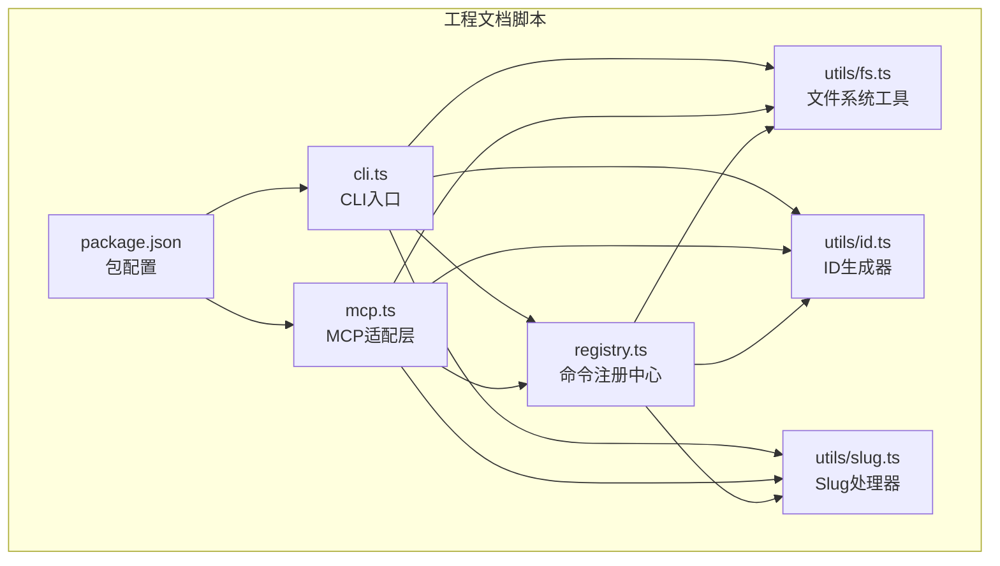
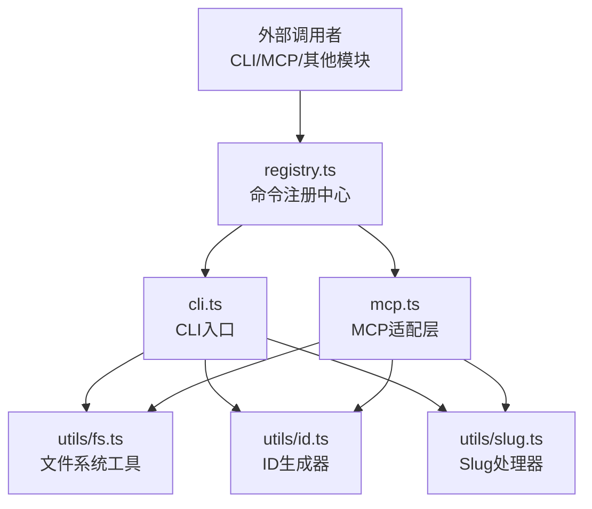
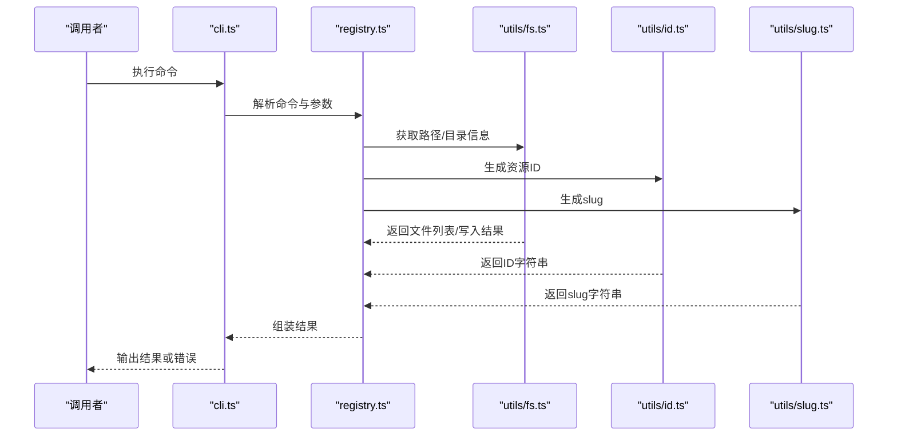
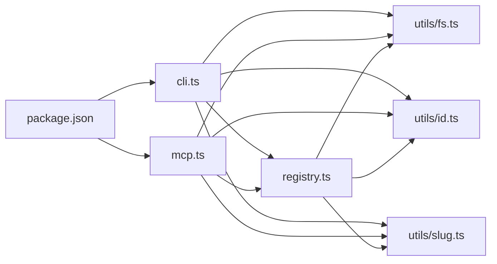

# 内部工具API

<cite>
**本文引用的文件**   
- [fs.ts](file://skills/shared/engineering-docs/scripts/src/utils/fs.ts)
- [id.ts](file://skills/shared/engineering-docs/scripts/src/utils/id.ts)
- [slug.ts](file://skills/shared/engineering-docs/scripts/src/utils/slug.ts)
- [cli.ts](file://skills/shared/engineering-docs/scripts/src/cli.ts)
- [mcp.ts](file://skills/shared/engineering-docs/scripts/src/mcp.ts)
- [registry.ts](file://skills/shared/engineering-docs/scripts/src/registry.ts)
- [package.json](file://skills/shared/engineering-docs/scripts/package.json)
</cite>

## 目录
1. [简介](#简介)
2. [项目结构](#项目结构)
3. [核心组件](#核心组件)
4. [架构总览](#架构总览)
5. [详细组件分析](#详细组件分析)
6. [依赖关系分析](#依赖关系分析)
7. [性能考量](#性能考量)
8. [故障排查指南](#故障排查指南)
9. [结论](#结论)
10. [附录](#附录)

## 简介
本技术文档面向内部工具模块API，聚焦以下三类核心工具函数：
- 文件系统操作工具：提供路径解析、相对路径计算、目录遍历与文件读写等能力。
- ID生成器：提供稳定、可读的ID生成策略，支持前缀、时间戳、随机后缀等组合。
- Slug处理器：将自然语言或标题文本转换为URL友好的短标识符（slug），具备大小写归一化、特殊字符处理与冲突消解能力。

文档目标包括：
- 明确每个工具的输入参数、返回值类型与业务逻辑。
- 提供完整使用示例与集成模式。
- 说明工具之间的依赖关系与组合使用方法。
- 记录性能特性、限制条件与最佳实践。
- 给出扩展点与自定义开发指南。

## 项目结构
该工具集位于工程文档脚本子项目中，采用TypeScript实现，主要包含：
- utils：通用工具库（文件系统、ID、Slug）
- cli：命令行入口与命令注册
- mcp：MCP协议适配层（可选）
- registry：命令/能力注册中心
- package.json：包元数据与依赖声明

图表来源
- [cli.ts](file://skills/shared/engineering-docs/scripts/src/cli.ts)
- [mcp.ts](file://skills/shared/engineering-docs/scripts/src/mcp.ts)
- [registry.ts](file://skills/shared/engineering-docs/scripts/src/registry.ts)
- [fs.ts](file://skills/shared/engineering-docs/scripts/src/utils/fs.ts)
- [id.ts](file://skills/shared/engineering-docs/scripts/src/utils/id.ts)
- [slug.ts](file://skills/shared/engineering-docs/scripts/src/utils/slug.ts)
- [package.json](file://skills/shared/engineering-docs/scripts/package.json)

章节来源
- [package.json](file://skills/shared/engineering-docs/scripts/package.json)

## 核心组件
本节概述三大工具的职责边界与协作方式：
- 文件系统工具（fs.ts）：封装跨平台路径处理、目录扫描、文件读取/写入、相对路径计算等基础能力，为上层CLI/MCP/注册中心提供稳定的I/O抽象。
- ID生成器（id.ts）：提供可配置的ID生成策略，确保唯一性与可读性，常用于资源命名、索引键、日志追踪等场景。
- Slug处理器（slug.ts）：将人类可读的标题或名称转换为安全、稳定的URL片段，支持去重与长度控制。

章节来源
- [fs.ts](file://skills/shared/engineering-docs/scripts/src/utils/fs.ts)
- [id.ts](file://skills/shared/engineering-docs/scripts/src/utils/id.ts)
- [slug.ts](file://skills/shared/engineering-docs/scripts/src/utils/slug.ts)

## 架构总览
整体架构以“工具库 + 接入层”的方式组织：
- 工具库层：utils/fs.ts、utils/id.ts、utils/slug.ts
- 接入层：cli.ts（命令行）、mcp.ts（MCP协议）、registry.ts（命令注册）
- 包管理：package.json定义依赖与入口

图表来源
- [cli.ts](file://skills/shared/engineering-docs/scripts/src/cli.ts)
- [mcp.ts](file://skills/shared/engineering-docs/scripts/src/mcp.ts)
- [registry.ts](file://skills/shared/engineering-docs/scripts/src/registry.ts)
- [fs.ts](file://skills/shared/engineering-docs/scripts/src/utils/fs.ts)
- [id.ts](file://skills/shared/engineering-docs/scripts/src/utils/id.ts)
- [slug.ts](file://skills/shared/engineering-docs/scripts/src/utils/slug.ts)

## 详细组件分析

### 文件系统工具（utils/fs.ts）
职责与能力
- 路径解析与规范化：统一路径分隔符、解析相对/绝对路径、拼接与归一化。
- 目录遍历：递归/非递归列出目录内容，支持过滤规则。
- 文件读写：文本与二进制读取/写入，原子写入与临时文件清理。
- 相对路径计算：基于当前工作目录或基准目录计算相对路径。
- 存在性与权限检查：判断文件/目录是否存在、是否可读写。

典型接口规范（概念描述）
- 路径解析
  - 输入：原始路径字符串、基准目录（可选）
  - 输出：标准化后的路径对象（含绝对路径、文件名、扩展名、父目录等）
  - 行为：自动处理Windows与Unix风格分隔符；去除多余分隔符；解析相对路径到绝对路径
- 目录遍历
  - 输入：根目录路径、选项（是否递归、过滤器）
  - 输出：匹配的文件/目录路径列表
  - 行为：按深度优先或广度优先遍历；支持忽略隐藏文件与特定后缀
- 文件读写
  - 输入：目标路径、内容、选项（编码、覆盖策略）
  - 输出：写入结果（成功标志、写入字节数、错误信息）
  - 行为：先写入临时文件再原子替换，避免部分写入导致的数据损坏
- 相对路径计算
  - 输入：源路径、基准路径
  - 输出：相对路径字符串
  - 行为：考虑不同盘符与挂载点；返回空字符串表示相同路径

错误处理
- 不存在路径：抛出明确的“路径不存在”异常，附带建议修复提示
- 权限不足：抛出“权限拒绝”异常，记录系统错误码
- I/O失败：捕获底层错误并包装为领域异常，保留堆栈用于调试

性能特性
- 大目录遍历：建议使用流式读取与惰性枚举，避免一次性加载全部条目
- 批量写入：合并小文件写入，减少系统调用次数
- 缓存：对频繁访问的路径解析结果进行短期缓存，降低重复计算

限制条件
- 不支持符号链接的深层解析（默认不跟随）
- 超大文件读取需分块处理，避免内存溢出
- 跨平台差异：某些文件系统特性不可用（如硬链接、扩展属性）

最佳实践
- 始终使用标准化路径对象，避免字符串拼接
- 在写入时使用原子操作，保证一致性
- 对路径输入进行白名单校验，防止路径穿越攻击

章节来源
- [fs.ts](file://skills/shared/engineering-docs/scripts/src/utils/fs.ts)

### ID生成器（utils/id.ts）
职责与能力
- 唯一性保障：结合时间戳、进程ID、随机数与序列号，确保高并发下的唯一性
- 可读性：支持前缀与分段格式，便于人工识别与检索
- 可配置：允许调整长度、字符集、排序友好度等参数

典型接口规范（概念描述）
- 生成ID
  - 输入：选项（前缀、长度、字符集、是否包含时间戳）
  - 输出：生成的ID字符串
  - 行为：根据选项组合各段；若启用时间戳则保证单调递增；若启用随机后缀则增加碰撞难度
- 验证ID
  - 输入：待验证的ID字符串、期望格式
  - 输出：布尔值或结构化结果（是否有效、解析出的各段）
  - 行为：正则校验、长度检查、字符集校验

错误处理
- 非法选项：抛出“无效参数”异常，提示合法范围
- 生成失败：捕获底层随机源或时间源异常，重试或降级策略

性能特性
- 无锁设计：通过进程内计数器与时间戳避免全局锁竞争
- 低开销：避免不必要的字符串拼接与正则匹配

限制条件
- 严格唯一性依赖于时间源与随机源质量
- 超长ID可能影响数据库索引与网络传输效率

最佳实践
- 为不同业务域设置不同前缀，便于隔离与审计
- 在分布式环境下，结合节点ID或区域ID进一步降低冲突概率
- 对外暴露的ID应避免泄露敏感信息（如精确时间）

章节来源
- [id.ts](file://skills/shared/engineering-docs/scripts/src/utils/id.ts)

### Slug处理器（utils/slug.ts）
职责与能力
- 文本清洗：移除HTML标签、转义特殊字符、统一空白符
- 规范化：大小写归一化、Unicode归一化、多语言字符映射
- 生成：生成URL友好的slug，支持长度截断与连字符替换
- 冲突消解：当slug已存在时追加序号或随机后缀

典型接口规范（概念描述）
- 生成slug
  - 输入：原始文本、选项（最大长度、分隔符、是否去重）
  - 输出：slug字符串
  - 行为：清洗→规范化→分段→连接→可选去重
- 去重处理
  - 输入：候选slug、已有slug集合
  - 输出：最终slug
  - 行为：追加“-1”、“-2”等序号或随机后缀，直到唯一

错误处理
- 空输入：返回空slug或抛出“空输入”异常，由调用方决定
- 过长文本：自动截断并提示，避免性能问题

性能特性
- 单次处理复杂度近似线性于输入长度
- 去重阶段可使用哈希表快速查找，避免全量比较

限制条件
- 极端多语言字符映射可能丢失语义
- 超长slug会影响SEO与存储成本

最佳实践
- 在生成前进行用户输入校验与长度限制
- 对高频slug进行缓存，减少重复计算
- 在导出或分享时提供人类可读的备用标题

章节来源
- [slug.ts](file://skills/shared/engineering-docs/scripts/src/utils/slug.ts)

### 集成与组合使用
常见组合模式
- CLI命令：通过cli.ts注册命令，调用fs.ts进行文件操作，使用id.ts生成资源ID，使用slug.ts生成文件名或URL片段
- MCP服务：通过mcp.ts暴露能力，内部复用工具库完成文档生成、校验与回写
- 注册中心：registry.ts集中管理命令与工具依赖，便于扩展与维护

图表来源
- [cli.ts](file://skills/shared/engineering-docs/scripts/src/cli.ts)
- [registry.ts](file://skills/shared/engineering-docs/scripts/src/registry.ts)
- [fs.ts](file://skills/shared/engineering-docs/scripts/src/utils/fs.ts)
- [id.ts](file://skills/shared/engineering-docs/scripts/src/utils/id.ts)
- [slug.ts](file://skills/shared/engineering-docs/scripts/src/utils/slug.ts)

章节来源
- [cli.ts](file://skills/shared/engineering-docs/scripts/src/cli.ts)
- [registry.ts](file://skills/shared/engineering-docs/scripts/src/registry.ts)

## 依赖关系分析
- 直接依赖
  - cli.ts 依赖 registry.ts、fs.ts、id.ts、slug.ts
  - mcp.ts 依赖 registry.ts、fs.ts、id.ts、slug.ts
  - registry.ts 依赖 fs.ts、id.ts、slug.ts
- 间接依赖
  - 包配置 package.json 定义运行时依赖与入口脚本
- 潜在循环依赖
  - 当前结构清晰，utils层不反向依赖cli/mcp/registry，避免循环

图表来源
- [package.json](file://skills/shared/engineering-docs/scripts/package.json)
- [cli.ts](file://skills/shared/engineering-docs/scripts/src/cli.ts)
- [mcp.ts](file://skills/shared/engineering-docs/scripts/src/mcp.ts)
- [registry.ts](file://skills/shared/engineering-docs/scripts/src/registry.ts)
- [fs.ts](file://skills/shared/engineering-docs/scripts/src/utils/fs.ts)
- [id.ts](file://skills/shared/engineering-docs/scripts/src/utils/id.ts)
- [slug.ts](file://skills/shared/engineering-docs/scripts/src/utils/slug.ts)

章节来源
- [package.json](file://skills/shared/engineering-docs/scripts/package.json)
- [cli.ts](file://skills/shared/engineering-docs/scripts/src/cli.ts)
- [mcp.ts](file://skills/shared/engineering-docs/scripts/src/mcp.ts)
- [registry.ts](file://skills/shared/engineering-docs/scripts/src/registry.ts)

## 性能考量
- 文件系统操作
  - 使用流式API处理大文件，避免一次性加载到内存
  - 批量IO合并，减少系统调用开销
  - 对路径解析结果进行短期缓存，降低重复计算
- ID生成
  - 避免全局锁，使用进程内计数器与时间戳
  - 合理选择字符集与长度，平衡可读性与存储成本
- Slug处理
  - 预处理文本长度上限，避免长文本导致的性能退化
  - 去重阶段使用哈希表，提升查找效率

[本节为通用指导，无需具体文件引用]

## 故障排查指南
常见问题与定位方法
- 路径不存在
  - 现象：命令执行时报错路径无效
  - 排查：确认基准目录与工作目录；打印规范化后的绝对路径
  - 修复：修正路径或创建缺失目录
- 权限不足
  - 现象：写入失败或无法列举目录
  - 排查：检查文件系统权限与运行环境用户
  - 修复：提升权限或以管理员身份运行
- ID冲突
  - 现象：生成ID重复导致业务异常
  - 排查：检查时间源与随机源；确认并发模型
  - 修复：引入节点ID或区域ID；增大随机后缀长度
- Slug过长或非法
  - 现象：生成的slug不符合预期或被截断
  - 排查：检查输入文本长度与字符集
  - 修复：增加前置清洗与长度限制

章节来源
- [fs.ts](file://skills/shared/engineering-docs/scripts/src/utils/fs.ts)
- [id.ts](file://skills/shared/engineering-docs/scripts/src/utils/id.ts)
- [slug.ts](file://skills/shared/engineering-docs/scripts/src/utils/slug.ts)

## 结论
本工具模块以清晰的职责划分与稳定的接口设计，为CLI与MCP层提供了可靠的文件系统操作、ID生成与Slug处理能力。通过合理的依赖管理与扩展点设计，团队可在保持向后兼容的前提下持续演进。建议在集成过程中遵循最佳实践，关注性能与安全性，并结合业务需求定制策略。

[本节为总结性内容，无需具体文件引用]

## 附录
- 扩展点
  - 新增命令：在registry.ts中注册新命令，并在cli.ts或mcp.ts中绑定入口
  - 自定义ID策略：在id.ts中扩展生成器工厂，支持新的前缀与字符集
  - 自定义Slug规则：在slug.ts中注入清洗与映射插件，适配多语言场景
- 集成示例（概念流程）
  - 从CLI触发命令 → 解析参数 → 调用fs.ts读取模板 → 使用id.ts生成资源ID → 使用slug.ts生成文件名 → 写入目标目录 → 返回结果
- 参考文件
  - [cli.ts](file://skills/shared/engineering-docs/scripts/src/cli.ts)
  - [mcp.ts](file://skills/shared/engineering-docs/scripts/src/mcp.ts)
  - [registry.ts](file://skills/shared/engineering-docs/scripts/src/registry.ts)
  - [fs.ts](file://skills/shared/engineering-docs/scripts/src/utils/fs.ts)
  - [id.ts](file://skills/shared/engineering-docs/scripts/src/utils/id.ts)
  - [slug.ts](file://skills/shared/engineering-docs/scripts/src/utils/slug.ts)
  - [package.json](file://skills/shared/engineering-docs/scripts/package.json)