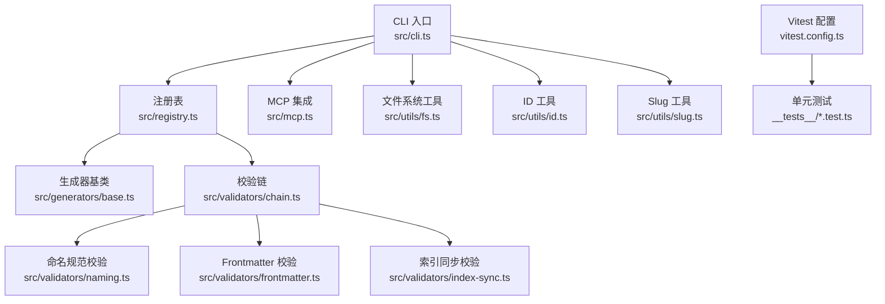
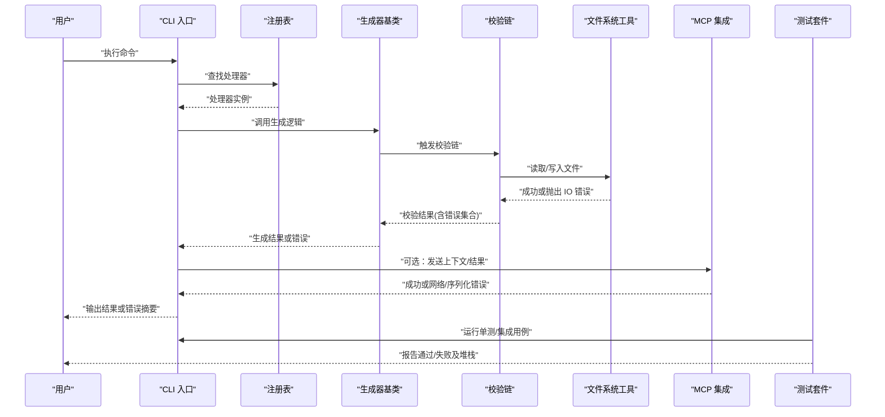
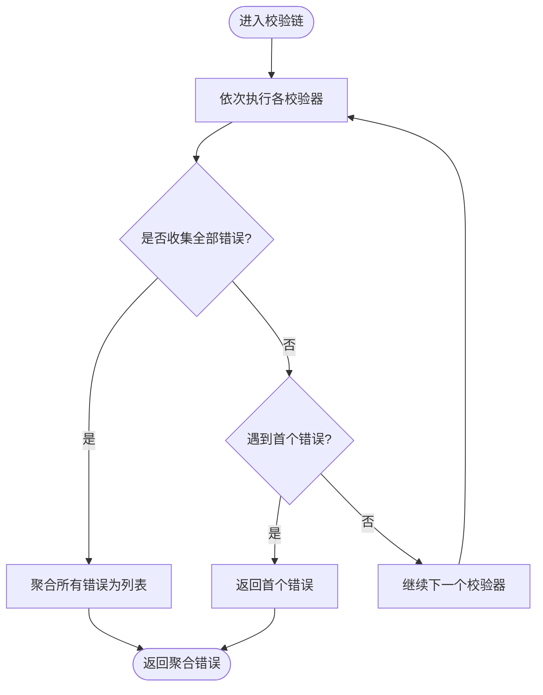
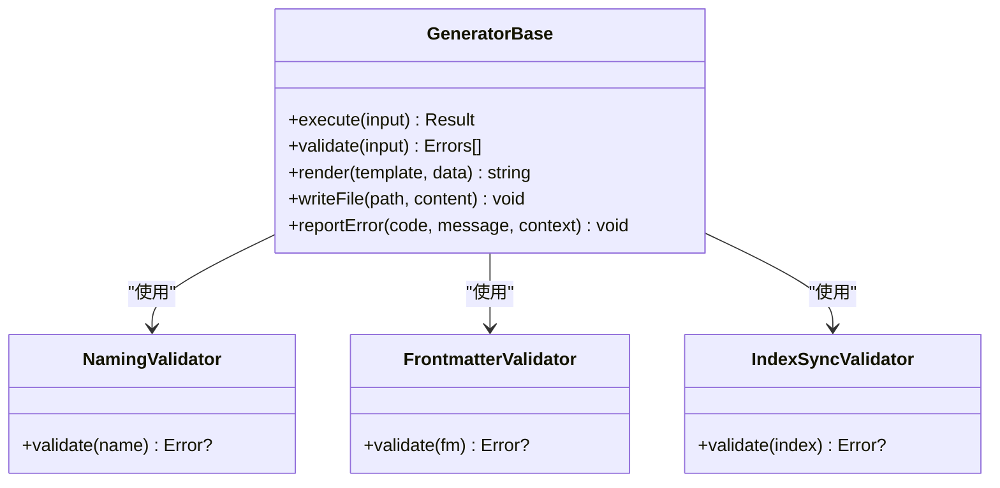
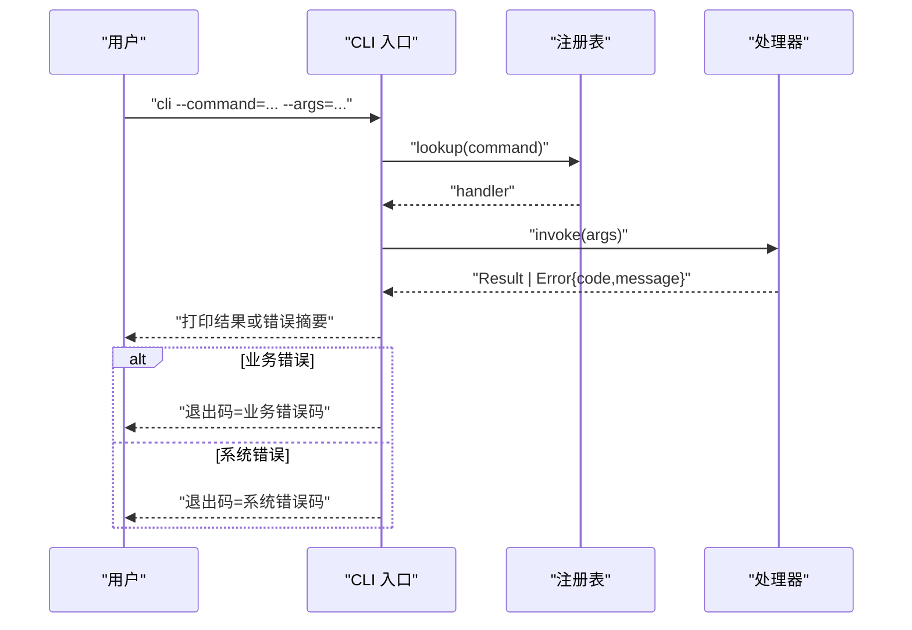
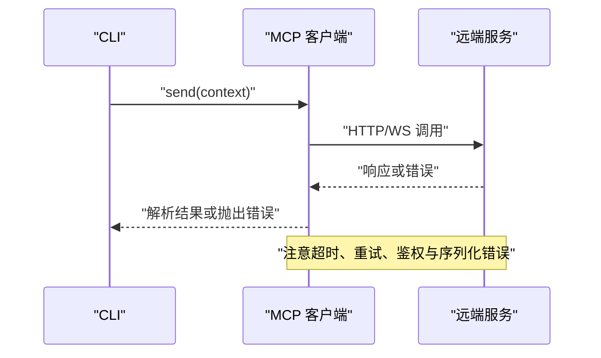
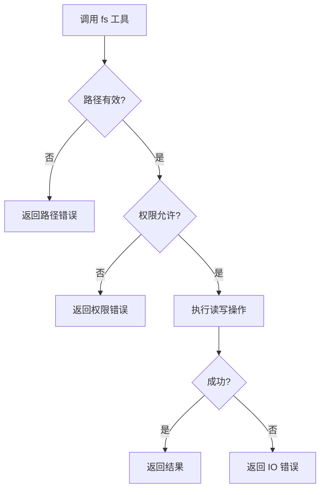
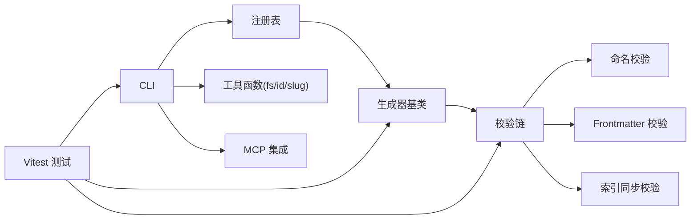

# 错误处理与调试

<cite>
**本文引用的文件**   
- [CLAUDE.MD](file://CLAUDE.MD)
- [.gitignore](file://.gitignore)
- [pipeline-templates/README.md](file://pipeline-templates/README.md)
- [skills/shared/engineering-docs/scripts/package.json](file://skills/shared/engineering-docs/scripts/package.json)
- [skills/shared/engineering-docs/scripts/tsconfig.json](file://skills/shared/engineering-docs/scripts/tsconfig.json)
- [skills/shared/engineering-docs/scripts/vitest.config.ts](file://skills/shared/engineering-docs/scripts/vitest.config.ts)
- [skills/shared/engineering-docs/scripts/src/cli.ts](file://skills/shared/engineering-docs/scripts/src/cli.ts)
- [skills/shared/engineering-docs/scripts/src/mcp.ts](file://skills/shared/engineering-docs/scripts/src/mcp.ts)
- [skills/shared/engineering-docs/scripts/src/registry.ts](file://skills/shared/engineering-docs/scripts/src/registry.ts)
- [skills/shared/engineering-docs/scripts/src/utils/fs.ts](file://skills/shared/engineering-docs/scripts/src/utils/fs.ts)
- [skills/shared/engineering-docs/scripts/src/utils/id.ts](file://skills/shared/engineering-docs/scripts/src/utils/id.ts)
- [skills/shared/engineering-docs/scripts/src/utils/slug.ts](file://skills/shared/engineering-docs/scripts/src/utils/slug.ts)
- [skills/shared/engineering-docs/scripts/src/generators/base.ts](file://skills/shared/engineering-docs/scripts/src/generators/base.ts)
- [skills/shared/engineering-docs/scripts/src/validators/index-sync.ts](file://skills/shared/engineering-docs/scripts/src/validators/index-sync.ts)
- [skills/shared/engineering-docs/scripts/src/validators/naming.ts](file://skills/shared/engineering-docs/scripts/src/validators/naming.ts)
- [skills/shared/engineering-docs/scripts/src/validators/frontmatter.ts](file://skills/shared/engineering-docs/scripts/src/validators/frontmatter.ts)
- [skills/shared/engineering-docs/scripts/src/validators/chain.ts](file://skills/shared/engineering-docs/scripts/src/validators/chain.ts)
- [skills/shared/engineering-docs/scripts/src/__tests__/chain.test.ts](file://skills/shared/engineering-docs/scripts/src/__tests__/chain.test.ts)
- [skills/shared/engineering-docs/scripts/src/__tests__/generators.test.ts](file://skills/shared/engineering-docs/scripts/src/__tests__/generators.test.ts)
- [skills/shared/engineering-docs/scripts/src/__tests__/validators.test.ts](file://skills/shared/engineering-docs/scripts/src/__tests__/validators.test.ts)
</cite>

## 目录
1. [简介](#简介)
2. [项目结构](#项目结构)
3. [核心组件](#核心组件)
4. [架构总览](#架构总览)
5. [详细组件分析](#详细组件分析)
6. [依赖关系分析](#依赖关系分析)
7. [性能考虑](#性能考虑)
8. [故障排除指南](#故障排除指南)
9. [结论](#结论)
10. [附录](#附录)

## 简介
本指南聚焦于“错误处理与调试”主题，围绕工程文档脚本子项目的错误类型、错误码定义、异常处理策略、调试工具（日志、测试、诊断）、常见错误解决方案、测试框架配置与使用、监控指标与告警建议以及生产环境调试最佳实践进行系统化说明。目标是帮助开发者快速定位问题、稳定运行并持续改进质量。

## 项目结构
该仓库包含多个技能模板与工程文档脚本。与错误处理和调试直接相关的代码集中在：
- skills/shared/engineering-docs/scripts：基于 TypeScript 的 CLI 与验证器/生成器工具集，包含单元测试与测试配置。
- pipeline-templates：流水线模板，用于编排任务执行流程。
- CLAUDE.MD：项目级约定与使用说明。
- .gitignore：忽略规则，影响构建产物与敏感信息。

图表来源
- [skills/shared/engineering-docs/scripts/src/cli.ts](file://skills/shared/engineering-docs/scripts/src/cli.ts)
- [skills/shared/engineering-docs/scripts/src/registry.ts](file://skills/shared/engineering-docs/scripts/src/registry.ts)
- [skills/shared/engineering-docs/scripts/src/mcp.ts](file://skills/shared/engineering-docs/scripts/src/mcp.ts)
- [skills/shared/engineering-docs/scripts/src/generators/base.ts](file://skills/shared/engineering-docs/scripts/src/generators/base.ts)
- [skills/shared/engineering-docs/scripts/src/validators/chain.ts](file://skills/shared/engineering-docs/scripts/src/validators/chain.ts)
- [skills/shared/engineering-docs/scripts/src/validators/naming.ts](file://skills/shared/engineering-docs/scripts/src/validators/naming.ts)
- [skills/shared/engineering-docs/scripts/src/validators/frontmatter.ts](file://skills/shared/engineering-docs/scripts/src/validators/frontmatter.ts)
- [skills/shared/engineering-docs/scripts/src/validators/index-sync.ts](file://skills/shared/engineering-docs/scripts/src/validators/index-sync.ts)
- [skills/shared/engineering-docs/scripts/src/utils/fs.ts](file://skills/shared/engineering-docs/scripts/src/utils/fs.ts)
- [skills/shared/engineering-docs/scripts/src/utils/id.ts](file://skills/shared/engineering-docs/scripts/src/utils/id.ts)
- [skills/shared/engineering-docs/scripts/src/utils/slug.ts](file://skills/shared/engineering-docs/scripts/src/utils/slug.ts)
- [skills/shared/engineering-docs/scripts/vitest.config.ts](file://skills/shared/engineering-docs/scripts/vitest.config.ts)
- [skills/shared/engineering-docs/scripts/src/__tests__/chain.test.ts](file://skills/shared/engineering-docs/scripts/src/__tests__/chain.test.ts)
- [skills/shared/engineering-docs/scripts/src/__tests__/generators.test.ts](file://skills/shared/engineering-docs/scripts/src/__tests__/generators.test.ts)
- [skills/shared/engineering-docs/scripts/src/__tests__/validators.test.ts](file://skills/shared/engineering-docs/scripts/src/__tests__/validators.test.ts)

章节来源
- [CLAUDE.MD](file://CLAUDE.MD)
- [.gitignore](file://.gitignore)
- [pipeline-templates/README.md](file://pipeline-templates/README.md)
- [skills/shared/engineering-docs/scripts/package.json](file://skills/shared/engineering-docs/scripts/package.json)
- [skills/shared/engineering-docs/scripts/tsconfig.json](file://skills/shared/engineering-docs/scripts/tsconfig.json)
- [skills/shared/engineering-docs/scripts/vitest.config.ts](file://skills/shared/engineering-docs/scripts/vitest.config.ts)

## 核心组件
- CLI 入口：负责解析命令参数、调度注册表中的处理器、输出结果与错误信息。
- 注册表：集中管理命令与处理器映射，便于扩展与维护。
- MCP 集成：提供与外部模型上下文协议交互的能力，可能涉及网络调用与序列化错误。
- 生成器基类：封装通用生成逻辑，统一错误上报与日志记录点。
- 校验链：组合多个校验器，支持短路或全量失败聚合，返回结构化错误集合。
- 工具函数：文件系统、ID 生成、Slug 转换等基础能力，需对 IO 与边界输入做健壮性处理。
- 测试套件：基于 Vitest 的单元测试，覆盖校验链、生成器与校验器行为。

章节来源
- [skills/shared/engineering-docs/scripts/src/cli.ts](file://skills/shared/engineering-docs/scripts/src/cli.ts)
- [skills/shared/engineering-docs/scripts/src/registry.ts](file://skills/shared/engineering-docs/scripts/src/registry.ts)
- [skills/shared/engineering-docs/scripts/src/mcp.ts](file://skills/shared/engineering-docs/scripts/src/mcp.ts)
- [skills/shared/engineering-docs/scripts/src/generators/base.ts](file://skills/shared/engineering-docs/scripts/src/generators/base.ts)
- [skills/shared/engineering-docs/scripts/src/validators/chain.ts](file://skills/shared/engineering-docs/scripts/src/validators/chain.ts)
- [skills/shared/engineering-docs/scripts/src/utils/fs.ts](file://skills/shared/engineering-docs/scripts/src/utils/fs.ts)
- [skills/shared/engineering-docs/scripts/src/utils/id.ts](file://skills/shared/engineering-docs/scripts/src/utils/id.ts)
- [skills/shared/engineering-docs/scripts/src/utils/slug.ts](file://skills/shared/engineering-docs/scripts/src/utils/slug.ts)
- [skills/shared/engineering-docs/scripts/src/__tests__/chain.test.ts](file://skills/shared/engineering-docs/scripts/src/__tests__/chain.test.ts)
- [skills/shared/engineering-docs/scripts/src/__tests__/generators.test.ts](file://skills/shared/engineering-docs/scripts/src/__tests__/generators.test.ts)
- [skills/shared/engineering-docs/scripts/src/__tests__/validators.test.ts](file://skills/shared/engineering-docs/scripts/src/__tests__/validators.test.ts)

## 架构总览
下图展示了从 CLI 到各模块的错误传播路径与关键断点，包括校验链聚合、IO 异常捕获、MCP 调用异常与测试反馈闭环。

图表来源
- [skills/shared/engineering-docs/scripts/src/cli.ts](file://skills/shared/engineering-docs/scripts/src/cli.ts)
- [skills/shared/engineering-docs/scripts/src/registry.ts](file://skills/shared/engineering-docs/scripts/src/registry.ts)
- [skills/shared/engineering-docs/scripts/src/generators/base.ts](file://skills/shared/engineering-docs/scripts/src/generators/base.ts)
- [skills/shared/engineering-docs/scripts/src/validators/chain.ts](file://skills/shared/engineering-docs/scripts/src/validators/chain.ts)
- [skills/shared/engineering-docs/scripts/src/utils/fs.ts](file://skills/shared/engineering-docs/scripts/src/utils/fs.ts)
- [skills/shared/engineering-docs/scripts/src/mcp.ts](file://skills/shared/engineering-docs/scripts/src/mcp.ts)
- [skills/shared/engineering-docs/scripts/src/__tests__/chain.test.ts](file://skills/shared/engineering-docs/scripts/src/__tests__/chain.test.ts)
- [skills/shared/engineering-docs/scripts/src/__tests__/generators.test.ts](file://skills/shared/engineering-docs/scripts/src/__tests__/generators.test.ts)
- [skills/shared/engineering-docs/scripts/src/__tests__/validators.test.ts](file://skills/shared/engineering-docs/scripts/src/__tests__/validators.test.ts)

## 详细组件分析

### 校验链与错误聚合
校验链将多个独立校验器组合，支持短路或全量收集错误，最终返回结构化错误集合，便于上层统一呈现与重试策略。

图表来源
- [skills/shared/engineering-docs/scripts/src/validators/chain.ts](file://skills/shared/engineering-docs/scripts/src/validators/chain.ts)
- [skills/shared/engineering-docs/scripts/src/validators/naming.ts](file://skills/shared/engineering-docs/scripts/src/validators/naming.ts)
- [skills/shared/engineering-docs/scripts/src/validators/frontmatter.ts](file://skills/shared/engineering-docs/scripts/src/validators/frontmatter.ts)
- [skills/shared/engineering-docs/scripts/src/validators/index-sync.ts](file://skills/shared/engineering-docs/scripts/src/validators/index-sync.ts)

章节来源
- [skills/shared/engineering-docs/scripts/src/validators/chain.ts](file://skills/shared/engineering-docs/scripts/src/validators/chain.ts)
- [skills/shared/engineering-docs/scripts/src/validators/naming.ts](file://skills/shared/engineering-docs/scripts/src/validators/naming.ts)
- [skills/shared/engineering-docs/scripts/src/validators/frontmatter.ts](file://skills/shared/engineering-docs/scripts/src/validators/frontmatter.ts)
- [skills/shared/engineering-docs/scripts/src/validators/index-sync.ts](file://skills/shared/engineering-docs/scripts/src/validators/index-sync.ts)

### 生成器与异常上报
生成器基类封装通用流程，如输入校验、模板渲染、文件落盘与错误上报。建议在关键步骤设置可观测点（耗时、状态码、错误码），以便追踪与告警。

图表来源
- [skills/shared/engineering-docs/scripts/src/generators/base.ts](file://skills/shared/engineering-docs/scripts/src/generators/base.ts)
- [skills/shared/engineering-docs/scripts/src/validators/naming.ts](file://skills/shared/engineering-docs/scripts/src/validators/naming.ts)
- [skills/shared/engineering-docs/scripts/src/validators/frontmatter.ts](file://skills/shared/engineering-docs/scripts/src/validators/frontmatter.ts)
- [skills/shared/engineering-docs/scripts/src/validators/index-sync.ts](file://skills/shared/engineering-docs/scripts/src/validators/index-sync.ts)

章节来源
- [skills/shared/engineering-docs/scripts/src/generators/base.ts](file://skills/shared/engineering-docs/scripts/src/generators/base.ts)

### CLI 与注册表：错误传播与退出码
CLI 负责解析参数、调用注册表处理器、捕获异常并输出人类可读的错误信息。建议：
- 区分业务错误与系统错误，采用不同退出码。
- 在注册表中为每个处理器定义错误码前缀，便于分类统计。
- 对未捕获异常进行兜底处理，避免进程崩溃。

图表来源
- [skills/shared/engineering-docs/scripts/src/cli.ts](file://skills/shared/engineering-docs/scripts/src/cli.ts)
- [skills/shared/engineering-docs/scripts/src/registry.ts](file://skills/shared/engineering-docs/scripts/src/registry.ts)

章节来源
- [skills/shared/engineering-docs/scripts/src/cli.ts](file://skills/shared/engineering-docs/scripts/src/cli.ts)
- [skills/shared/engineering-docs/scripts/src/registry.ts](file://skills/shared/engineering-docs/scripts/src/registry.ts)

### MCP 集成：网络与序列化错误
MCP 集成可能涉及远程调用与数据序列化。应关注：
- 连接超时、重试与退避策略。
- 请求/响应格式校验，失败时返回明确错误码。
- 敏感信息脱敏与错误日志分级。

图表来源
- [skills/shared/engineering-docs/scripts/src/mcp.ts](file://skills/shared/engineering-docs/scripts/src/mcp.ts)

章节来源
- [skills/shared/engineering-docs/scripts/src/mcp.ts](file://skills/shared/engineering-docs/scripts/src/mcp.ts)

### 工具函数：IO 与边界条件
文件系统工具需对权限、路径不存在、并发写入等情况进行处理；ID 与 Slug 工具需保证唯一性与合法性。

图表来源
- [skills/shared/engineering-docs/scripts/src/utils/fs.ts](file://skills/shared/engineering-docs/scripts/src/utils/fs.ts)
- [skills/shared/engineering-docs/scripts/src/utils/id.ts](file://skills/shared/engineering-docs/scripts/src/utils/id.ts)
- [skills/shared/engineering-docs/scripts/src/utils/slug.ts](file://skills/shared/engineering-docs/scripts/src/utils/slug.ts)

章节来源
- [skills/shared/engineering-docs/scripts/src/utils/fs.ts](file://skills/shared/engineering-docs/scripts/src/utils/fs.ts)
- [skills/shared/engineering-docs/scripts/src/utils/id.ts](file://skills/shared/engineering-docs/scripts/src/utils/id.ts)
- [skills/shared/engineering-docs/scripts/src/utils/slug.ts](file://skills/shared/engineering-docs/scripts/src/utils/slug.ts)

### 测试框架：Vitest 配置与用例组织
- 配置文件：位于 scripts 根目录，定义测试运行器、覆盖率与匹配规则。
- 用例组织：按功能域划分，分别覆盖校验链、生成器与校验器。
- 推荐实践：
  - 为每个公共方法编写正向与负向用例。
  - 使用 Mock 隔离外部依赖（文件系统、网络）。
  - 在 CI 中运行测试并生成覆盖率报告。

章节来源
- [skills/shared/engineering-docs/scripts/vitest.config.ts](file://skills/shared/engineering-docs/scripts/vitest.config.ts)
- [skills/shared/engineering-docs/scripts/src/__tests__/chain.test.ts](file://skills/shared/engineering-docs/scripts/src/__tests__/chain.test.ts)
- [skills/shared/engineering-docs/scripts/src/__tests__/generators.test.ts](file://skills/shared/engineering-docs/scripts/src/__tests__/generators.test.ts)
- [skills/shared/engineering-docs/scripts/src/__tests__/validators.test.ts](file://skills/shared/engineering-docs/scripts/src/__tests__/validators.test.ts)

## 依赖关系分析
- 内部依赖：CLI 依赖注册表与工具函数；生成器依赖校验链；校验链依赖具体校验器；MCP 作为可选扩展。
- 外部依赖：Node.js 运行时、文件系统 API、网络库（若启用 MCP）、测试框架 Vitest。
- 潜在循环：应避免在工具函数中反向引入高层模块；确保校验器无副作用或副作用可控。

图表来源
- [skills/shared/engineering-docs/scripts/src/cli.ts](file://skills/shared/engineering-docs/scripts/src/cli.ts)
- [skills/shared/engineering-docs/scripts/src/registry.ts](file://skills/shared/engineering-docs/scripts/src/registry.ts)
- [skills/shared/engineering-docs/scripts/src/generators/base.ts](file://skills/shared/engineering-docs/scripts/src/generators/base.ts)
- [skills/shared/engineering-docs/scripts/src/validators/chain.ts](file://skills/shared/engineering-docs/scripts/src/validators/chain.ts)
- [skills/shared/engineering-docs/scripts/src/validators/naming.ts](file://skills/shared/engineering-docs/scripts/src/validators/naming.ts)
- [skills/shared/engineering-docs/scripts/src/validators/frontmatter.ts](file://skills/shared/engineering-docs/scripts/src/validators/frontmatter.ts)
- [skills/shared/engineering-docs/scripts/src/validators/index-sync.ts](file://skills/shared/engineering-docs/scripts/src/validators/index-sync.ts)
- [skills/shared/engineering-docs/scripts/src/utils/fs.ts](file://skills/shared/engineering-docs/scripts/src/utils/fs.ts)
- [skills/shared/engineering-docs/scripts/src/utils/id.ts](file://skills/shared/engineering-docs/scripts/src/utils/id.ts)
- [skills/shared/engineering-docs/scripts/src/utils/slug.ts](file://skills/shared/engineering-docs/scripts/src/utils/slug.ts)
- [skills/shared/engineering-docs/scripts/src/mcp.ts](file://skills/shared/engineering-docs/scripts/src/mcp.ts)
- [skills/shared/engineering-docs/scripts/vitest.config.ts](file://skills/shared/engineering-docs/scripts/vitest.config.ts)

章节来源
- [skills/shared/engineering-docs/scripts/package.json](file://skills/shared/engineering-docs/scripts/package.json)
- [skills/shared/engineering-docs/scripts/tsconfig.json](file://skills/shared/engineering-docs/scripts/tsconfig.json)

## 性能考虑
- 校验链优化：对大文件或大量文件时，考虑并行校验与短路策略结合，减少不必要的 IO。
- 生成器缓存：对模板渲染结果进行缓存，避免重复计算。
- MCP 调用：实现指数退避重试与熔断，降低远端抖动影响。
- 资源清理：确保文件句柄与网络连接及时释放，避免泄漏。

[本节为通用指导，不直接分析具体文件]

## 故障排除指南
- 常见问题与解决思路
  - 路径或权限错误：检查目标目录存在性与读写权限，确认工作目录正确。
  - 命名冲突或非法字符：依据命名校验器提示修正文件名或内容。
  - Frontmatter 缺失或格式错误：根据校验器返回的错误集合逐项修复。
  - 索引不一致：运行索引同步校验，自动修复或手动对齐。
  - MCP 调用失败：检查网络连通性、鉴权信息与超时配置，必要时降级处理。
- 调试技巧
  - 开启详细日志：在关键路径增加日志级别，输出错误码与上下文。
  - 最小化复现：剥离无关依赖，构造最小用例定位问题。
  - 单测驱动：为新发现的缺陷补充回归用例，防止复发。
  - 覆盖率分析：识别未覆盖分支，补充测试提升稳定性。

章节来源
- [skills/shared/engineering-docs/scripts/src/validators/chain.ts](file://skills/shared/engineering-docs/scripts/src/validators/chain.ts)
- [skills/shared/engineering-docs/scripts/src/validators/naming.ts](file://skills/shared/engineering-docs/scripts/src/validators/naming.ts)
- [skills/shared/engineering-docs/scripts/src/validators/frontmatter.ts](file://skills/shared/engineering-docs/scripts/src/validators/frontmatter.ts)
- [skills/shared/engineering-docs/scripts/src/validators/index-sync.ts](file://skills/shared/engineering-docs/scripts/src/validators/index-sync.ts)
- [skills/shared/engineering-docs/scripts/src/utils/fs.ts](file://skills/shared/engineering-docs/scripts/src/utils/fs.ts)
- [skills/shared/engineering-docs/scripts/src/mcp.ts](file://skills/shared/engineering-docs/scripts/src/mcp.ts)

## 结论
通过统一的错误码体系、结构化的错误聚合、完善的测试覆盖与清晰的调试路径，可以显著提升工程文档脚本的稳定性与可维护性。建议在生产环境中结合监控指标与告警策略，形成“检测—定位—修复—回归”的闭环。

[本节为总结性内容，不直接分析具体文件]

## 附录
- 环境变量与配置
  - 日志级别：通过环境变量控制输出详细程度。
  - 超时与重试：为 MCP 调用配置合理的超时与重试次数。
  - 忽略规则：利用 .gitignore 避免提交构建产物与敏感信息。
- 流水线集成
  - 在流水线模板中集成校验与生成步骤，失败即阻断合并。
  - 在 CI 中运行测试与覆盖率检查，确保质量门禁。

章节来源
- [.gitignore](file://.gitignore)
- [pipeline-templates/README.md](file://pipeline-templates/README.md)
- [CLAUDE.MD](file://CLAUDE.MD)