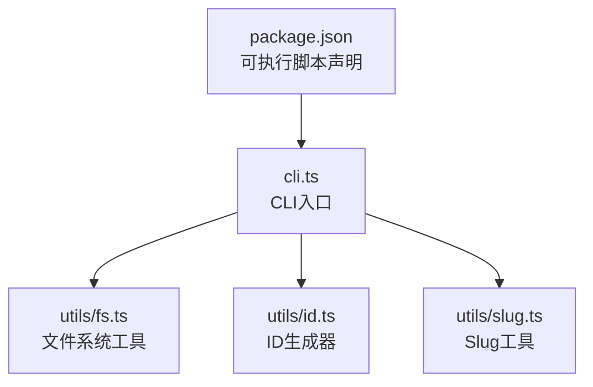
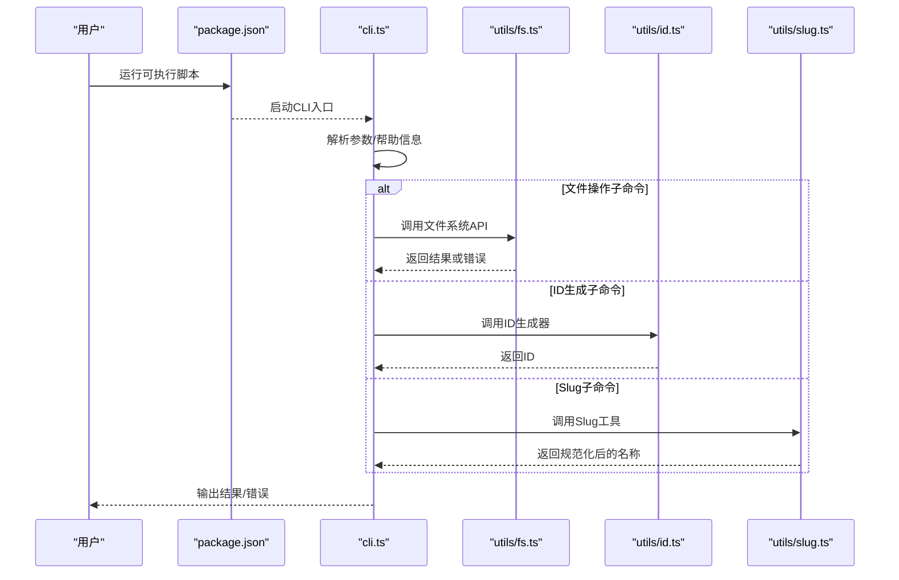
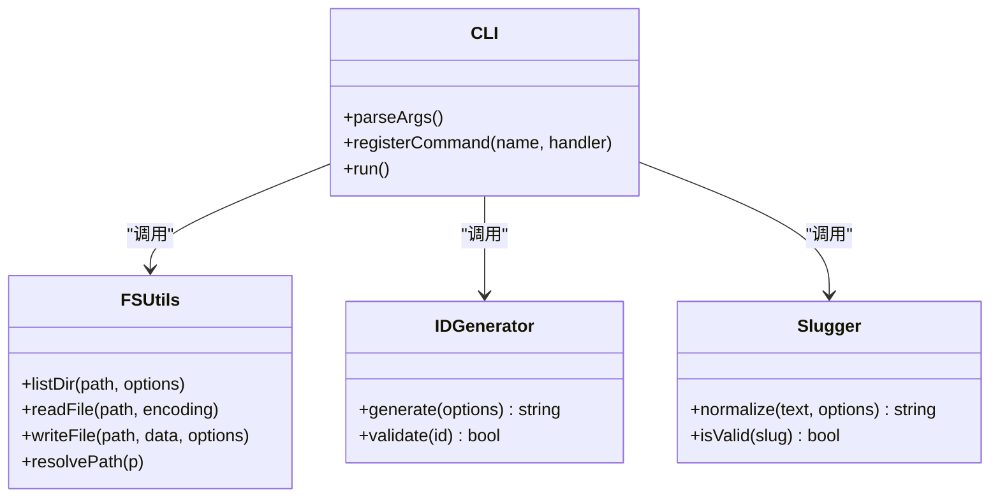
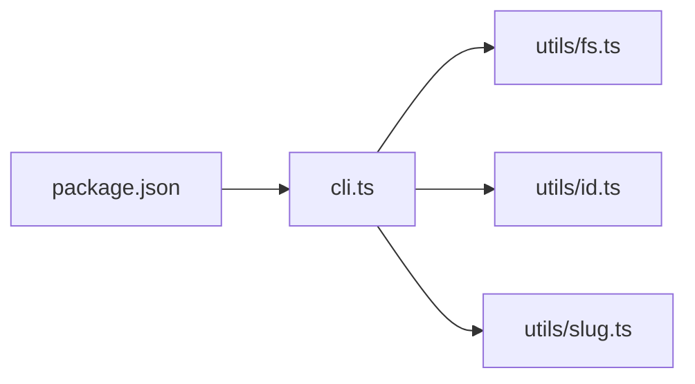

# CLI命令行工具

<cite>
**本文引用的文件**   
- [cli.ts](file://skills/shared/engineering-docs/scripts/src/cli.ts)
- [fs.ts](file://skills/shared/engineering-docs/scripts/src/utils/fs.ts)
- [id.ts](file://skills/shared/engineering-docs/scripts/src/utils/id.ts)
- [slug.ts](file://skills/shared/engineering-docs/scripts/src/utils/slug.ts)
- [package.json](file://skills/shared/engineering-docs/scripts/package.json)
</cite>

## 目录
1. [简介](#简介)
2. [项目结构](#项目结构)
3. [核心组件](#核心组件)
4. [架构总览](#架构总览)
5. [详细组件分析](#详细组件分析)
6. [依赖关系分析](#依赖关系分析)
7. [性能考虑](#性能考虑)
8. [故障排查指南](#故障排查指南)
9. [结论](#结论)
10. [附录：命令参考手册](#附录命令参考手册)

## 简介
本仓库包含一个面向工程文档与规范化的CLI命令行工具，提供以下能力：
- 文件系统遍历、读写与路径管理
- ID生成器（可配置）
- Slug工具（名称规范化）
- 统一的CLI入口与子命令组织

该工具以TypeScript实现，位于 skills/shared/engineering-docs/scripts 目录下，通过 package.json 暴露可执行脚本。

## 项目结构
CLI相关源码集中在 scripts 目录中，采用“入口+工具库”的清晰分层：
- cli.ts：CLI入口，负责解析参数、路由到具体子命令
- utils/fs.ts：文件系统操作封装（遍历、读写、路径处理等）
- utils/id.ts：ID生成器实现与配置
- utils/slug.ts：Slug/名称规范化算法
- package.json：定义可执行脚本与依赖

图表来源
- [cli.ts](file://skills/shared/engineering-docs/scripts/src/cli.ts)
- [fs.ts](file://skills/shared/engineering-docs/scripts/src/utils/fs.ts)
- [id.ts](file://skills/shared/engineering-docs/scripts/src/utils/id.ts)
- [slug.ts](file://skills/shared/engineering-docs/scripts/src/utils/slug.ts)
- [package.json](file://skills/shared/engineering-docs/scripts/package.json)

章节来源
- [cli.ts](file://skills/shared/engineering-docs/scripts/src/cli.ts)
- [fs.ts](file://skills/shared/engineering-docs/scripts/src/utils/fs.ts)
- [id.ts](file://skills/shared/engineering-docs/scripts/src/utils/id.ts)
- [slug.ts](file://skills/shared/engineering-docs/scripts/src/utils/slug.ts)
- [package.json](file://skills/shared/engineering-docs/scripts/package.json)

## 核心组件
- CLI入口（cli.ts）
  - 职责：解析命令行参数、注册子命令、分发执行、统一错误输出
  - 关键点：支持全局选项（如 --help）、子命令命名空间、参数校验与提示
- 文件系统工具（utils/fs.ts）
  - 职责：目录遍历、文件读取/写入、路径拼接与标准化、权限与存在性检查
  - 关键点：对相对/绝对路径的统一处理、递归遍历控制、异常包装
- ID生成器（utils/id.ts）
  - 职责：生成唯一标识符，支持多种策略（时间戳、随机、前缀等）
  - 关键点：可配置种子/前缀、冲突避免策略、输出格式
- Slug工具（utils/slug.ts）
  - 职责：将任意名称规范化为URL友好的slug
  - 关键点：大小写转换、特殊字符清理、分隔符替换、长度限制

章节来源
- [cli.ts](file://skills/shared/engineering-docs/scripts/src/cli.ts)
- [fs.ts](file://skills/shared/engineering-docs/scripts/src/utils/fs.ts)
- [id.ts](file://skills/shared/engineering-docs/scripts/src/utils/id.ts)
- [slug.ts](file://skills/shared/engineering-docs/scripts/src/utils/slug.ts)

## 架构总览
整体采用“CLI入口 + 工具库”的轻量架构，便于扩展新子命令与复用通用能力。

图表来源
- [package.json](file://skills/shared/engineering-docs/scripts/package.json)
- [cli.ts](file://skills/shared/engineering-docs/scripts/src/cli.ts)
- [fs.ts](file://skills/shared/engineering-docs/scripts/src/utils/fs.ts)
- [id.ts](file://skills/shared/engineering-docs/scripts/src/utils/id.ts)
- [slug.ts](file://skills/shared/engineering-docs/scripts/src/utils/slug.ts)

## 详细组件分析

### CLI入口（cli.ts）
- 设计要点
  - 参数解析：支持全局选项与子命令级选项
  - 路由分发：根据子命令名选择对应处理器
  - 错误处理：捕获并格式化错误，提供友好提示
- 扩展建议
  - 新增子命令时，在入口注册处理器并绑定参数
  - 使用统一的日志与错误码，便于后续诊断

章节来源
- [cli.ts](file://skills/shared/engineering-docs/scripts/src/cli.ts)

### 文件系统工具（utils/fs.ts）
- 功能范围
  - 遍历：列出目录、递归扫描、过滤规则
  - 读写：文本/二进制读取与写入、追加模式
  - 路径：拼接、归一化、相对/绝对转换、存在性判断
- 复杂度与性能
  - 遍历通常为 O(n)，n为节点数；大目录建议启用过滤与分页
  - 读写遵循Node.js流式模型，注意背压与内存占用
- 最佳实践
  - 始终进行路径归一化与存在性检查
  - 对异常进行包装并附带上下文路径

章节来源
- [fs.ts](file://skills/shared/engineering-docs/scripts/src/utils/fs.ts)

### ID生成器（utils/id.ts）
- 算法与配置
  - 策略：时间戳+随机、UUID风格、自定义前缀
  - 配置项：前缀、长度、分隔符、是否去重
- 输出格式
  - 默认小写、仅字母数字与分隔符
  - 可选固定长度与填充策略
- 并发与冲突
  - 基于时间与随机源降低冲突概率
  - 可选去重检测与重试机制

章节来源
- [id.ts](file://skills/shared/engineering-docs/scripts/src/utils/id.ts)

### Slug工具（utils/slug.ts）
- 规范化流程
  - 转小写、移除多余空白、替换非法字符为分隔符
  - 合并连续分隔符、裁剪长度、去除首尾分隔符
- 语言与编码
  - 支持Unicode字符集，保留常见语言字符
  - 对多字节字符进行安全处理
- 可配置项
  - 分隔符、最大长度、是否保留数字、是否保留连字符

章节来源
- [slug.ts](file://skills/shared/engineering-docs/scripts/src/utils/slug.ts)

### 类图（代码结构示意）

图表来源
- [cli.ts](file://skills/shared/engineering-docs/scripts/src/cli.ts)
- [fs.ts](file://skills/shared/engineering-docs/scripts/src/utils/fs.ts)
- [id.ts](file://skills/shared/engineering-docs/scripts/src/utils/id.ts)
- [slug.ts](file://skills/shared/engineering-docs/scripts/src/utils/slug.ts)

## 依赖关系分析
- 内部依赖
  - cli.ts 依赖 fs.ts、id.ts、slug.ts
- 外部依赖
  - 由 package.json 声明的可执行脚本驱动运行时环境
- 耦合与内聚
  - CLI作为编排层，工具库高内聚低耦合，便于独立测试与复用

图表来源
- [package.json](file://skills/shared/engineering-docs/scripts/package.json)
- [cli.ts](file://skills/shared/engineering-docs/scripts/src/cli.ts)
- [fs.ts](file://skills/shared/engineering-docs/scripts/src/utils/fs.ts)
- [id.ts](file://skills/shared/engineering-docs/scripts/src/utils/id.ts)
- [slug.ts](file://skills/shared/engineering-docs/scripts/src/utils/slug.ts)

章节来源
- [package.json](file://skills/shared/engineering-docs/scripts/package.json)
- [cli.ts](file://skills/shared/engineering-docs/scripts/src/cli.ts)

## 性能考虑
- 大目录遍历
  - 使用过滤条件减少IO次数
  - 分块处理与流式输出避免一次性加载
- 文件读写
  - 优先使用流式API处理大文件
  - 合理设置缓冲区与超时
- ID生成
  - 批量生成时复用配置对象，减少重复初始化开销
- Slug处理
  - 批量文本处理时缓存正则与映射表

[本节为通用指导，不直接分析具体文件]

## 故障排查指南
- 常见问题
  - 路径不存在或无权限：检查输入路径与当前进程权限
  - 参数缺失或类型错误：查看帮助信息与参数校验提示
  - 生成ID冲突：调整策略或开启去重检测
  - Slug非法字符：确认规范化选项与目标平台兼容性
- 定位方法
  - 启用详细日志（如有）
  - 逐步缩小问题范围（最小复现用例）
  - 检查中间产物（临时文件、日志）

章节来源
- [cli.ts](file://skills/shared/engineering-docs/scripts/src/cli.ts)
- [fs.ts](file://skills/shared/engineering-docs/scripts/src/utils/fs.ts)
- [id.ts](file://skills/shared/engineering-docs/scripts/src/utils/id.ts)
- [slug.ts](file://skills/shared/engineering-docs/scripts/src/utils/slug.ts)

## 结论
本CLI工具以简洁清晰的架构提供文件操作、ID生成与Slug规范化三大核心能力。通过模块化设计与可扩展的CLI入口，能够快速集成新的子命令与工具函数，满足工程文档与自动化场景的需求。

[本节为总结性内容，不直接分析具体文件]

## 附录：命令参考手册

### 安装与运行
- 通过包管理器安装依赖后，使用 package.json 中定义的可执行脚本运行CLI
- 首次运行可通过 --help 查看可用命令与全局选项

章节来源
- [package.json](file://skills/shared/engineering-docs/scripts/package.json)

### 全局选项
- --help：显示帮助信息
- --version：显示版本信息
- --verbose：输出更详细的日志（若实现）

章节来源
- [cli.ts](file://skills/shared/engineering-docs/scripts/src/cli.ts)

### 子命令概览
- 文件操作
  - 常用能力：列出目录、递归遍历、读取/写入文件、路径归一化
  - 典型参数：路径、递归开关、过滤器、编码、覆盖模式
- ID生成
  - 常用能力：生成唯一ID、批量生成、带前缀
  - 典型参数：策略、长度、分隔符、前缀、去重
- Slug工具
  - 常用能力：名称规范化、批量处理、校验
  - 典型参数：分隔符、最大长度、保留数字、保留连字符

章节来源
- [cli.ts](file://skills/shared/engineering-docs/scripts/src/cli.ts)
- [fs.ts](file://skills/shared/engineering-docs/scripts/src/utils/fs.ts)
- [id.ts](file://skills/shared/engineering-docs/scripts/src/utils/id.ts)
- [slug.ts](file://skills/shared/engineering-docs/scripts/src/utils/slug.ts)

### 配置文件与环境变量
- 配置文件
  - 若存在配置文件，通常用于持久化默认参数与策略
  - 优先级：命令行参数 > 配置文件 > 内置默认值
- 环境变量
  - 可通过环境变量覆盖部分配置（如日志级别、工作目录）
  - 建议在CI环境中使用环境变量注入敏感或动态值

章节来源
- [cli.ts](file://skills/shared/engineering-docs/scripts/src/cli.ts)

### 实战示例与最佳实践
- 文件遍历与导出清单
  - 使用递归遍历指定目录，结合过滤器只输出特定后缀的文件
  - 将结果输出到标准输出或文件，便于后续处理
- 批量生成ID并写入索引
  - 批量生成ID并附加前缀，确保唯一性与可读性
  - 将ID与元数据写入JSON或CSV，供其他工具消费
- 名称规范化与一致性检查
  - 对文件名或标题进行Slug化处理，保证跨平台兼容
  - 对已有命名进行批量校验与修复

章节来源
- [fs.ts](file://skills/shared/engineering-docs/scripts/src/utils/fs.ts)
- [id.ts](file://skills/shared/engineering-docs/scripts/src/utils/id.ts)
- [slug.ts](file://skills/shared/engineering-docs/scripts/src/utils/slug.ts)