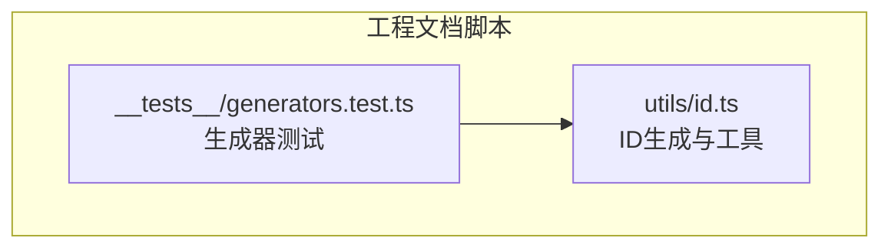
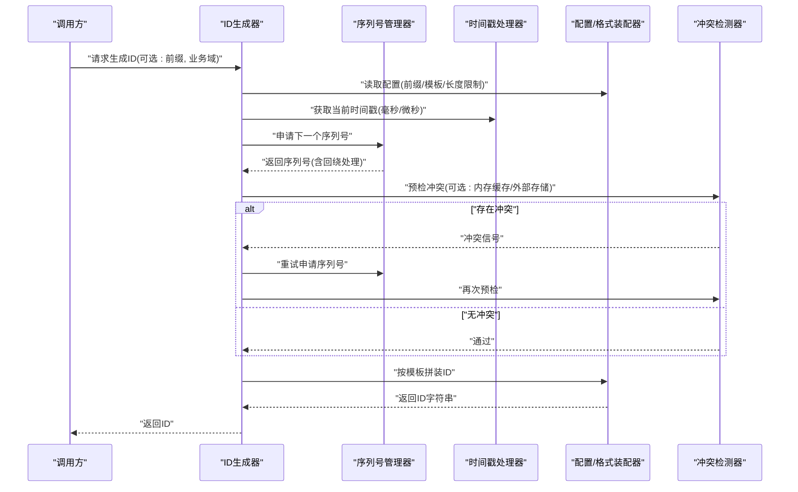
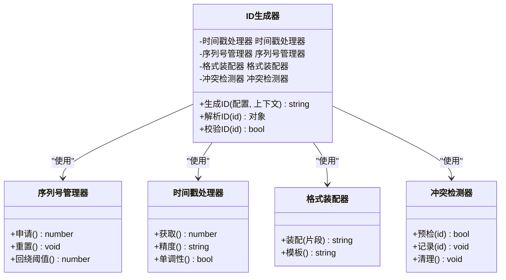
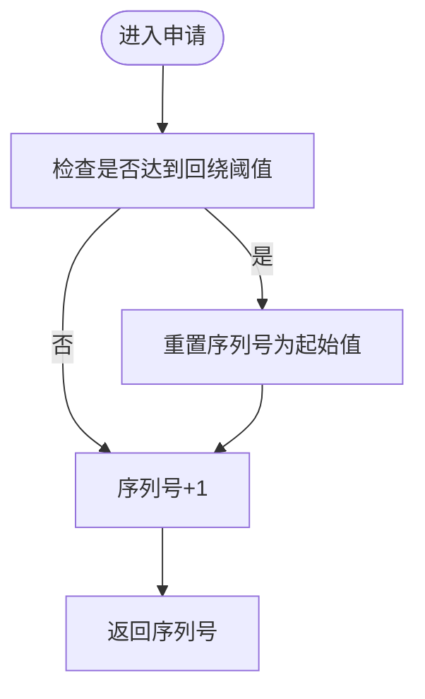
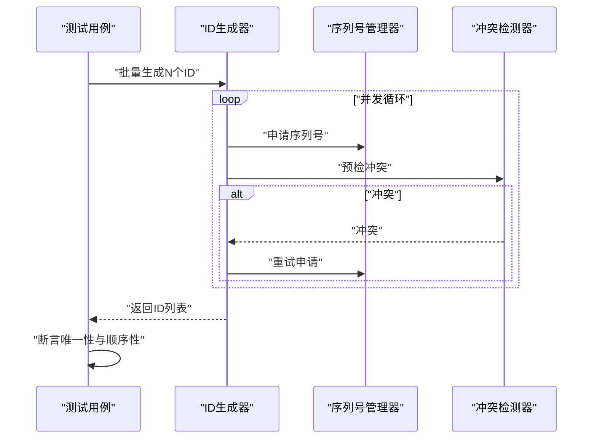
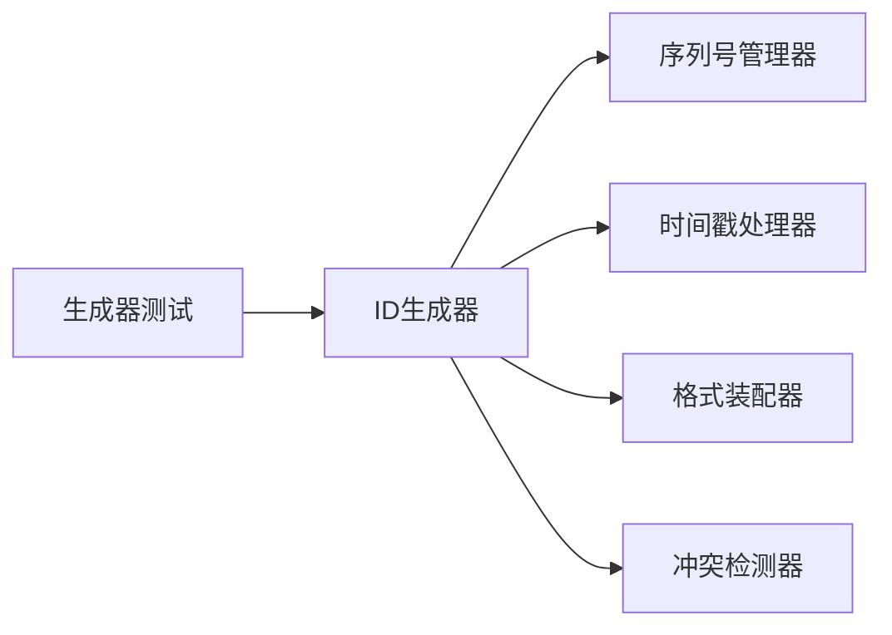

# ID生成器

<cite>
**本文引用的文件**   
- [id.ts](file://skills/shared/engineering-docs/scripts/src/utils/id.ts)
- [generators.test.ts](file://skills/shared/engineering-docs/scripts/src/__tests__/generators.test.ts)
</cite>

## 目录
1. [简介](#简介)
2. [项目结构](#项目结构)
3. [核心组件](#核心组件)
4. [架构总览](#架构总览)
5. [详细组件分析](#详细组件分析)
6. [依赖分析](#依赖分析)
7. [性能考虑](#性能考虑)
8. [故障排查指南](#故障排查指南)
9. [结论](#结论)
10. [附录](#附录)

## 简介
本技术文档围绕工程文档脚本工具中的ID生成能力，系统化阐述其算法原理、唯一性保证机制与性能优化策略。文档同时覆盖不同ID格式的生成规则（前缀配置、序列号管理、时间戳处理）、配置选项说明与扩展方式，并给出冲突检测与处理的实现细节以及在多业务场景下的策略选择与最佳实践建议。

## 项目结构
该仓库为工程化文档与技能编排的集合，其中ID生成相关逻辑位于“共享工程文档脚本”子模块中，主要包含：
- 工具层：提供ID生成与辅助方法
- 测试层：对生成器进行行为验证

图表来源
- [id.ts](file://skills/shared/engineering-docs/scripts/src/utils/id.ts)
- [generators.test.ts](file://skills/shared/engineering-docs/scripts/src/__tests__/generators.test.ts)

章节来源
- [id.ts](file://skills/shared/engineering-docs/scripts/src/utils/id.ts)
- [generators.test.ts](file://skills/shared/engineering-docs/scripts/src/__tests__/generators.test.ts)

## 核心组件
- ID生成器：负责按规则拼接前缀、时间戳、序列号等片段，输出稳定且可排序的ID字符串。
- 序列号管理器：维护当前序列号状态，支持递增、回绕与并发安全。
- 时间戳处理器：统一时间源与精度控制，确保跨进程/实例的时间单调性与一致性。
- 格式装配器：将各片段按既定模板组装成最终ID，并提供校验与解析能力。
- 冲突检测器：在生成后或落库前进行重复检查，必要时触发重试或降级策略。

章节来源
- [id.ts](file://skills/shared/engineering-docs/scripts/src/utils/id.ts)
- [generators.test.ts](file://skills/shared/engineering-docs/scripts/src/__tests__/generators.test.ts)

## 架构总览
下图展示了ID生成的端到端流程：从调用入口到片段拼装、序列号推进、时间戳获取、冲突检测与最终返回。

图表来源
- [id.ts](file://skills/shared/engineering-docs/scripts/src/utils/id.ts)
- [generators.test.ts](file://skills/shared/engineering-docs/scripts/src/__tests__/generators.test.ts)

## 详细组件分析

### 组件A：ID生成器（类/模块）
- 职责
  - 接收配置与上下文参数，协调时间戳、序列号与模板装配。
  - 暴露统一的生成接口，屏蔽内部复杂度。
- 关键方法
  - 生成主流程：组合时间戳、序列号与前缀，执行冲突检测与重试。
  - 解析与校验：对已生成ID进行合法性校验与字段拆解。
- 设计要点
  - 单例/工厂模式：避免重复初始化配置与资源。
  - 可插拔：允许自定义时间源、序列号策略与冲突检测后端。

图表来源
- [id.ts](file://skills/shared/engineering-docs/scripts/src/utils/id.ts)

章节来源
- [id.ts](file://skills/shared/engineering-docs/scripts/src/utils/id.ts)

### 组件B：序列号管理器
- 职责
  - 维护当前序列号，支持原子递增与回绕保护。
- 关键特性
  - 线程/进程安全：基于锁或原子操作保证并发安全。
  - 回绕策略：达到阈值后自动回绕并携带时间片标识，避免长期运行导致的碰撞。
- 复杂度
  - 申请操作：O(1)
  - 空间占用：O(1)

图表来源
- [id.ts](file://skills/shared/engineering-docs/scripts/src/utils/id.ts)

章节来源
- [id.ts](file://skills/shared/engineering-docs/scripts/src/utils/id.ts)

### 组件C：时间戳处理器
- 职责
  - 提供统一时间源，支持毫秒/微秒精度，保证单调递增。
- 关键特性
  - 单调时钟：防止系统时间回拨导致ID乱序。
  - 精度可配：根据业务需求选择合适的时间粒度。
- 复杂度
  - 获取时间戳：O(1)

章节来源
- [id.ts](file://skills/shared/engineering-docs/scripts/src/utils/id.ts)

### 组件D：格式装配器
- 职责
  - 将前缀、时间戳、序列号等片段按模板拼装为最终ID。
- 关键特性
  - 模板化：支持多种ID格式（如短ID、可读ID、带业务域ID）。
  - 校验：生成后对长度、字符集、分隔符等进行校验。
- 复杂度
  - 装配：O(n)，n为片段总长度

章节来源
- [id.ts](file://skills/shared/engineering-docs/scripts/src/utils/id.ts)

### 组件E：冲突检测器
- 职责
  - 在生成后或落库前检测ID是否重复，必要时触发重试或降级。
- 关键特性
  - 多级检测：内存缓存快速判断 + 外部存储兜底。
  - 去重窗口：按时间窗口或批次范围进行去重，降低开销。
- 复杂度
  - 预检：近似O(1)（缓存命中）或O(log n)/O(1)（外部存储索引）

章节来源
- [id.ts](file://skills/shared/engineering-docs/scripts/src/utils/id.ts)

### 组件F：测试与验证（生成器测试）
- 职责
  - 验证ID生成的唯一性、稳定性、边界条件与异常路径。
- 关键用例
  - 并发生成：多线程/多进程并发下仍保持唯一。
  - 时间回拨：模拟系统时间回拨，验证单调性与顺序性。
  - 序列号回绕：长时间运行后的回绕行为与碰撞概率评估。
  - 冲突重试：当检测到冲突时，重试次数与退避策略。

图表来源
- [generators.test.ts](file://skills/shared/engineering-docs/scripts/src/__tests__/generators.test.ts)

章节来源
- [generators.test.ts](file://skills/shared/engineering-docs/scripts/src/__tests__/generators.test.ts)

## 依赖分析
- 内部依赖
  - ID生成器依赖序列号管理器、时间戳处理器、格式装配器与冲突检测器。
  - 测试用例依赖ID生成器以驱动行为验证。
- 外部依赖
  - 操作系统时钟与并发原语（锁/原子操作）。
  - 可选的外部存储（用于持久化冲突检测或全局序列号）。

图表来源
- [id.ts](file://skills/shared/engineering-docs/scripts/src/utils/id.ts)
- [generators.test.ts](file://skills/shared/engineering-docs/scripts/src/__tests__/generators.test.ts)

章节来源
- [id.ts](file://skills/shared/engineering-docs/scripts/src/utils/id.ts)
- [generators.test.ts](file://skills/shared/engineering-docs/scripts/src/__tests__/generators.test.ts)

## 性能考虑
- 时间戳精度选择
  - 毫秒级：适用于大多数场景，兼顾可读性与性能。
  - 微秒级：在高吞吐或严格时序要求场景下提升区分度。
- 序列号策略
  - 单机内自增：低延迟、高吞吐；需配合时间片避免跨实例碰撞。
  - 分布式序列号：结合雪花/数据库/Redis等方案，牺牲少量延迟换取强一致。
- 冲突检测成本
  - 优先使用内存缓存做快速预检，减少外部IO。
  - 设置合理的去重窗口与过期策略，平衡命中率与内存占用。
- 并发模型
  - 使用无锁队列或原子变量提升并发性能。
  - 合理批量化生成，减少函数调用与同步开销。

[本节为通用性能指导，不直接分析具体文件]

## 故障排查指南
- 常见问题
  - ID重复：检查序列号回绕阈值与时间片是否足够大；确认冲突检测是否生效。
  - 时间回拨：启用单调时钟或引入时间补偿逻辑。
  - 性能抖动：定位冲突检测外部IO瓶颈，调整缓存大小与超时。
- 诊断步骤
  - 开启生成日志（包含时间戳、序列号、前缀、最终ID）。
  - 统计冲突率与重试次数，评估是否需要扩大序列号位宽或提高时间精度。
  - 对比不同并发度下的吞吐与P99延迟，识别热点路径。

章节来源
- [generators.test.ts](file://skills/shared/engineering-docs/scripts/src/__tests__/generators.test.ts)

## 结论
本ID生成器通过时间戳、序列号与前缀的组合，结合严格的冲突检测与回绕策略，在保证唯一性与有序性的前提下实现了高性能与可扩展性。通过模块化设计与可插拔组件，能够灵活适配不同业务场景与部署环境。建议在大规模分布式环境中采用更稳健的全局序列号方案，并在生产环境持续监控冲突率与时序异常。

[本节为总结性内容，不直接分析具体文件]

## 附录

### 配置选项说明
- 前缀
  - 作用：标识业务域或产品线，便于检索与隔离。
  - 约束：固定长度、字符集限制、不可为空。
- 时间戳
  - 精度：毫秒/微秒可配。
  - 单调性：建议使用单调时钟或时间补偿。
- 序列号
  - 位宽：根据预期QPS与时间窗口计算。
  - 回绕阈值：避免长期运行导致的碰撞。
- 模板
  - 格式：支持多种模板（短ID、可读ID、带分隔符等）。
  - 校验：生成后对长度与字符集进行校验。

章节来源
- [id.ts](file://skills/shared/engineering-docs/scripts/src/utils/id.ts)

### 自定义扩展方法
- 自定义时间源：替换默认时间戳处理器，接入外部时间服务或校准时钟。
- 自定义序列号策略：实现分布式序列号或分片自增。
- 自定义冲突检测后端：对接Redis、数据库或消息队列进行去重。
- 自定义模板装配器：扩展新的ID格式与校验规则。

章节来源
- [id.ts](file://skills/shared/engineering-docs/scripts/src/utils/id.ts)

### 不同业务场景的策略选择与最佳实践
- 高吞吐订单系统
  - 推荐：微秒级时间戳 + 长位宽序列号 + 内存缓存冲突检测。
  - 目标：低延迟、高吞吐、弱一致可接受。
- 审计与合规场景
  - 推荐：毫秒级时间戳 + 明确前缀 + 外部存储冲突检测。
  - 目标：强一致、可追溯、可审计。
- 多租户SaaS
  - 推荐：租户ID作为前缀 + 独立序列号空间 + 分片存储。
  - 目标：隔离性、可扩展、易治理。

[本节为概念性指导，不直接分析具体文件]