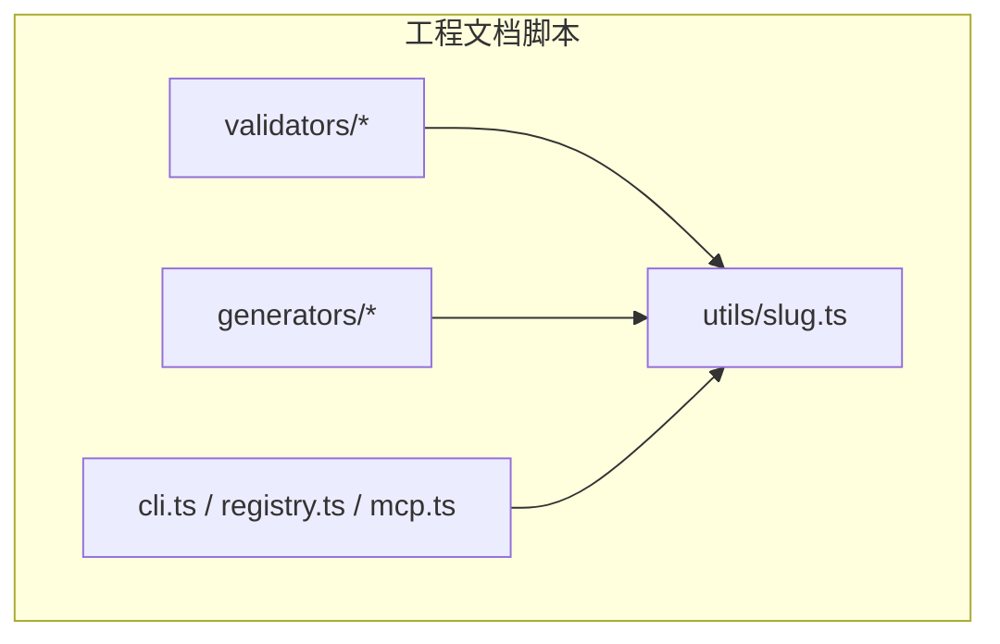
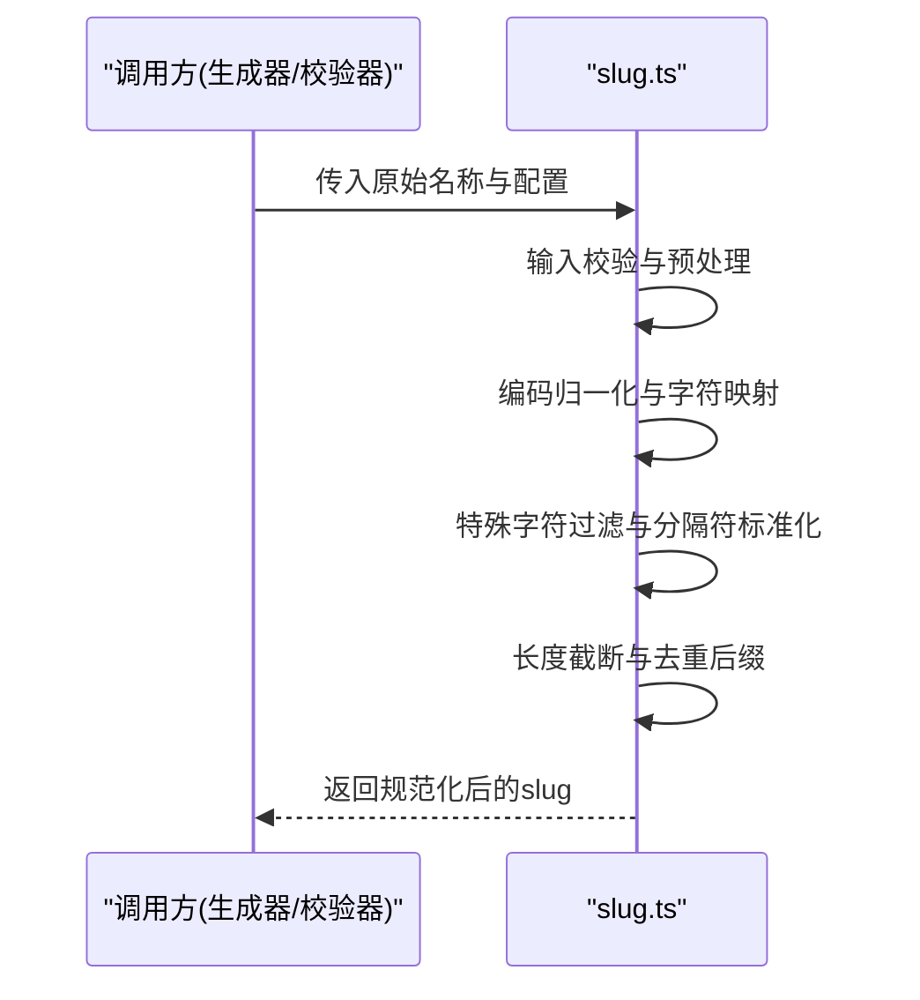
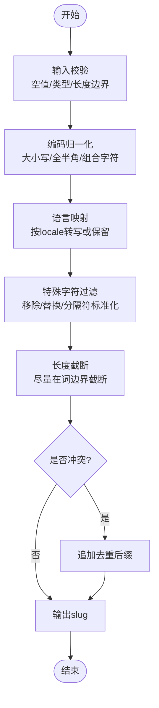
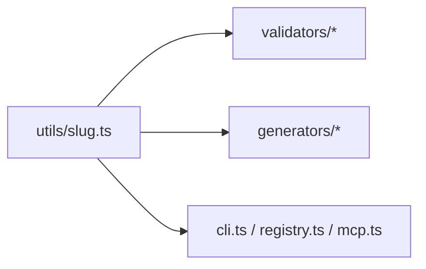

# Slug工具

<cite>
**本文引用的文件**   
- [slug.ts](file://skills/shared/engineering-docs/scripts/src/utils/slug.ts)
</cite>

## 目录
1. [简介](#简介)
2. [项目结构](#项目结构)
3. [核心组件](#核心组件)
4. [架构总览](#架构总览)
5. [详细组件分析](#详细组件分析)
6. [依赖分析](#依赖分析)
7. [性能考虑](#性能考虑)
8. [故障排查指南](#故障排查指南)
9. [结论](#结论)
10. [附录](#附录) 

## 简介
本技术文档围绕仓库中的Slug工具，系统化阐述名称规范化算法与实现细节，包括字符编码处理、特殊字符过滤、长度限制、国际化支持、API接口说明（输入验证、输出格式化、自定义规则配置）、唯一性检查与冲突解决机制，以及在实际场景（URL生成、文件名处理）中的应用方法。文档旨在帮助开发者快速理解并正确使用该工具，同时为后续扩展与维护提供清晰的技术参考。

## 项目结构
Slug工具位于工程脚本子模块中，属于“工程文档”能力的一部分，主要职责是为文档与资源生成安全的、可读的、可复用的短标识符（slug）。其位置与上下文如下：
- 路径：skills/shared/engineering-docs/scripts/src/utils/slug.ts
- 所属模块：scripts/src/utils（通用工具集）
- 使用方：同模块下的生成器、校验器等组件通过相对路径导入使用

图表来源
- [slug.ts](file://skills/shared/engineering-docs/scripts/src/utils/slug.ts)

章节来源
- [slug.ts](file://skills/shared/engineering-docs/scripts/src/utils/slug.ts)

## 核心组件
- slug 生成函数
  - 功能：将任意人类可读的名称转换为仅包含安全字符的短标识符，用于URL片段、文件名等场景。
  - 关键行为：
    - 统一大小写与空白处理
    - 字符编码归一化（如全角/半角、组合字符）
    - 特殊字符过滤与替换（标点、符号、不可见字符等）
    - 多语言映射（如中文拼音或保留原字符的安全策略）
    - 长度截断与去重后缀
    - 分隔符标准化（连字符或下划线）
- 可选配置项
  - locale：语言环境（影响字符映射与转写策略）
  - maxLen：最大长度限制
  - separator：分隔符选择（如“-”或“_”）
  - allowCJK：是否允许直接保留中日韩字符（默认关闭，建议开启时谨慎使用）
  - uniqueSuffix：冲突时的后缀策略（如追加序号）
- 辅助工具
  - 输入校验：空值、非法字符、长度边界
  - 输出格式化：去除首尾分隔符、压缩连续分隔符

章节来源
- [slug.ts](file://skills/shared/engineering-docs/scripts/src/utils/slug.ts)

## 架构总览
从调用视角看，Slug工具作为纯函数式工具被上层模块复用，不持有外部状态，保证幂等与可测试性。

图表来源
- [slug.ts](file://skills/shared/engineering-docs/scripts/src/utils/slug.ts)

## 详细组件分析

### 名称规范化算法
- 字符编码处理
  - 统一Unicode形式（NFC/NFD），避免组合字符导致的不稳定匹配
  - 全角/半角转换，确保跨平台一致性
- 特殊字符过滤
  - 移除或替换标点、控制字符、不可见字符
  - 将空格与常见分隔符统一为指定分隔符
- 长度限制
  - 按maxLen进行截断，优先在单词边界处断开，避免破坏可读性
  - 若无法在边界截断，则直接截断并附加去重后缀
- 国际化支持
  - 根据locale选择映射表（如拉丁语系转小写、阿拉伯语/希伯来语方向性处理、中日韩字符转写或保留策略）
  - 对非ASCII字符提供可配置的保留或转写开关
- 唯一性与冲突解决
  - 在给定上下文中检测重复，必要时追加序号后缀（如“-1”、“-2”）
  - 支持用户自定义冲突策略（例如前缀/后缀模板）

图表来源
- [slug.ts](file://skills/shared/engineering-docs/scripts/src/utils/slug.ts)

章节来源
- [slug.ts](file://skills/shared/engineering-docs/scripts/src/utils/slug.ts)

### API接口说明
- 函数签名（概念描述）
  - generateSlug(input, options?) -> string
- 参数定义
  - input: string | null | undefined
    - 必填；可为空字符串或null/undefined（由内部校验处理）
  - options?: object
    - locale?: string
      - 默认值：常用语言环境（如“zh-CN”或“en-US”）
      - 作用：决定字符映射与转写策略
    - maxLen?: number
      - 默认值：合理上限（如64）
      - 作用：限制输出长度
    - separator?: "-" | "_"
      - 默认值："-"
      - 作用：分隔符风格
    - allowCJK?: boolean
      - 默认值：false
      - 作用：是否允许直接保留中日韩字符
    - uniqueSuffix?: boolean | string
      - 默认值：true
      - 作用：冲突时是否自动追加后缀，或自定义后缀模板
- 返回值
  - string：规范化后的slug
- 异常与错误
  - 输入为空且未提供回退策略时抛出错误
  - 非法选项（如负数maxLen）抛出错误
  - 不支持的locale提示降级策略
- 示例用法（概念）
  - URL片段：generateSlug("产品需求文档 v2.0", { locale: "zh-CN", maxLen: 40 })
  - 文件名：generateSlug("报告_2024-Q3.pdf", { separator: "_", maxLen: 60 })

章节来源
- [slug.ts](file://skills/shared/engineering-docs/scripts/src/utils/slug.ts)

### 不同语言环境下的生成规则与国际化
- 拉丁语系（en、fr、de等）
  - 小写化、变音符号归一化、连字符标准化
- 中文（zh）
  - 可选择转写为拼音或保留汉字（需结合allowCJK与系统兼容性评估）
- 阿拉伯语/希伯来语
  - 注意双向文本渲染问题，建议在存储层强制小写与ASCII化
- 其他语言
  - 通过locale映射表扩展，缺失时回退到通用ASCII化策略

章节来源
- [slug.ts](file://skills/shared/engineering-docs/scripts/src/utils/slug.ts)

### 唯一性检查与冲突解决机制
- 检测范围
  - 单实例内缓存集合：在同一进程生命周期内维护已生成slug集合
  - 外部上下文注入：由调用方传入已有slug列表，进行全局唯一性判断
- 冲突策略
  - 自动追加序号后缀（-1、-2...）
  - 自定义后缀模板（如基于时间戳或哈希）
- 复杂度
  - 单次插入/查询O(1)，整体线性于输入数量
- 并发与持久化
  - 当前实现为无状态工具，如需分布式唯一性，应在上层服务层引入外部存储与原子操作

章节来源
- [slug.ts](file://skills/shared/engineering-docs/scripts/src/utils/slug.ts)

### 实际应用场景
- URL生成
  - 将标题或路径段规范化为URL安全片段
  - 建议设置合理的maxLen与separator，保持可读性与SEO友好
- 文件名处理
  - 将用户输入的文件名规范化为文件系统兼容名称
  - 建议禁用CJK保留，避免跨平台兼容性问题
- 标签与分类
  - 将自然语言标签转为稳定键名，便于索引与聚合

章节来源
- [slug.ts](file://skills/shared/engineering-docs/scripts/src/utils/slug.ts)

## 依赖分析
- 内部依赖
  - 无外部运行时依赖，纯函数实现，便于单元测试与集成测试
- 使用方
  - 生成器与校验器模块通过相对路径导入，形成松耦合的工具调用关系
- 潜在风险
  - 若未来引入外部库（如拼音转写），需关注包体积与平台差异

图表来源
- [slug.ts](file://skills/shared/engineering-docs/scripts/src/utils/slug.ts)

章节来源
- [slug.ts](file://skills/shared/engineering-docs/scripts/src/utils/slug.ts)

## 性能考虑
- 时间复杂度
  - 单次生成O(n)，n为输入字符串长度
- 空间复杂度
  - O(n)用于中间结果与映射表
- 优化建议
  - 批量生成时复用locale映射表
  - 长文本优先在词边界截断，减少二次处理
  - 避免频繁创建新对象，尽量原地变换

[本节为通用性能指导，无需特定文件引用]

## 故障排查指南
- 常见问题
  - 输出为空：检查输入是否为空或未提供回退策略
  - 乱码或不可见字符：确认编码归一化步骤是否生效
  - 超长slug：调整maxLen或在调用方进行二次截断
  - 冲突重复：启用uniqueSuffix或在上层维护唯一性集合
- 定位方法
  - 打印中间态（归一化后、过滤后、截断后）以定位问题阶段
  - 针对locale切换验证映射表覆盖度

章节来源
- [slug.ts](file://skills/shared/engineering-docs/scripts/src/utils/slug.ts)

## 结论
Slug工具以纯函数方式提供稳定、可配置、可扩展的名称规范化能力，满足URL与文件名等场景的安全性与可读性要求。通过明确的输入校验、编码归一化、特殊字符过滤、长度限制与冲突解决机制，能够在多语言环境下保持一致的输出质量。建议在业务层按需注入上下文以实现全局唯一性，并在需要时扩展locale映射表以覆盖更多语言。

[本节为总结性内容，无需特定文件引用]

## 附录
- 术语
  - slug：仅包含安全字符的短标识符，常用于URL片段与文件名
  - locale：语言环境，影响字符映射与转写策略
  - 归一化：将不同表示形式的字符统一到标准形式
- 最佳实践
  - 始终设置maxLen以避免过长标识符
  - 在文件名场景中禁用CJK保留
  - 在URL场景中优先使用连字符分隔符
  - 在批量生成时复用配置与映射表

[本节为补充信息，无需特定文件引用]