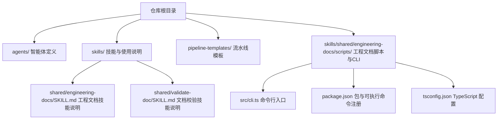
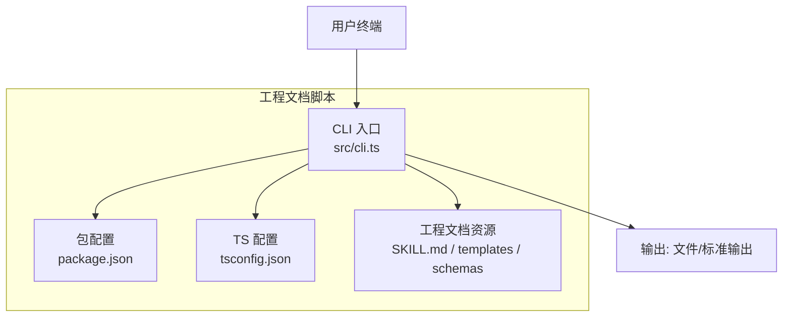
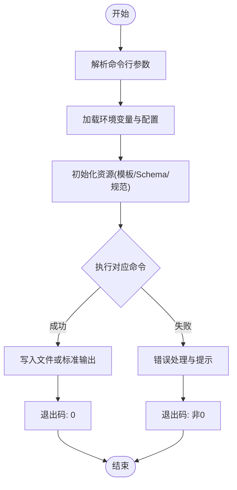
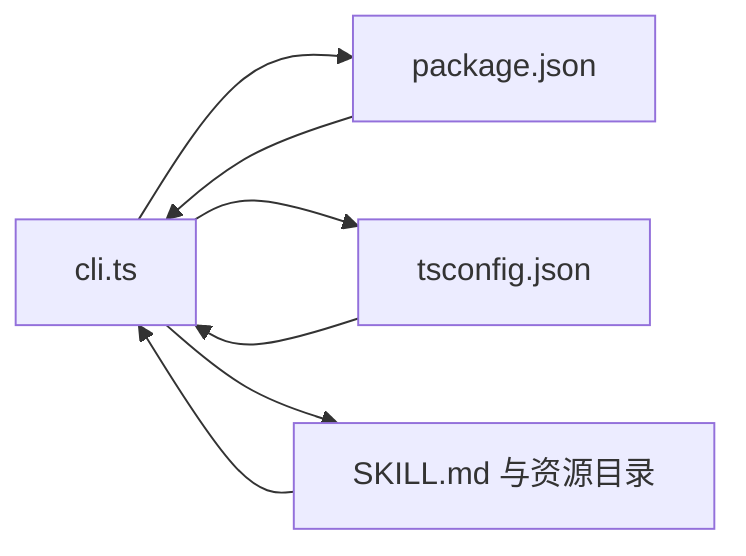

# 命令参考手册

<cite>
**本文引用的文件**   
- [CLAUDE.MD](file://CLAUDE.MD)
- [AGENT-SKILL-MATRIX.md](file://AGENT-SKILL-MATRIX.md)
- [agents/_index.yml](file://agents/_index.yml)
- [skills/_index.yml](file://skills/_index.yml)
- [skills/shared/engineering-docs/scripts/src/cli.ts](file://skills/shared/engineering-docs/scripts/src/cli.ts)
- [skills/shared/engineering-docs/scripts/package.json](file://skills/shared/engineering-docs/scripts/package.json)
- [skills/shared/engineering-docs/scripts/tsconfig.json](file://skills/shared/engineering-docs/scripts/tsconfig.json)
- [skills/shared/engineering-docs/SKILL.md](file://skills/shared/engineering-docs/SKILL.md)
- [skills/shared/validate-doc/SKILL.md](file://skills/shared/validate-doc/SKILL.md)
- [pipeline-templates/README.md](file://pipeline-templates/README.md)
</cite>

## 目录
1. [简介](#简介)
2. [项目结构](#项目结构)
3. [核心组件](#核心组件)
4. [架构总览](#架构总览)
5. [详细命令分析](#详细命令分析)
6. [依赖关系分析](#依赖关系分析)
7. [性能与使用建议](#性能与使用建议)
8. [故障排查指南](#故障排查指南)
9. [结论](#结论)
10. [附录](#附录)

## 简介
本手册面向使用仓库内 CLI 命令行工具的用户，提供完整的命令参考、参数说明、环境变量配置、执行流程与错误处理机制，并给出常见实战场景（文档验证、模板生成、批量操作等）的使用示例与组合用法。读者无需深入源码即可高效上手。

## 项目结构
仓库包含多类资源：智能体定义、技能清单、流水线模板以及工程文档脚本（含 CLI）。CLI 入口位于工程文档脚本子项目中，通过包管理器注册可执行命令；同时仓库提供了大量 SKILL 文档用于描述各能力的使用方法。

图表来源
- [skills/shared/engineering-docs/scripts/src/cli.ts](file://skills/shared/engineering-docs/scripts/src/cli.ts)
- [skills/shared/engineering-docs/scripts/package.json](file://skills/shared/engineering-docs/scripts/package.json)
- [skills/shared/engineering-docs/scripts/tsconfig.json](file://skills/shared/engineering-docs/scripts/tsconfig.json)
- [skills/shared/engineering-docs/SKILL.md](file://skills/shared/engineering-docs/SKILL.md)
- [skills/shared/validate-doc/SKILL.md](file://skills/shared/validate-doc/SKILL.md)

章节来源
- [CLAUDE.MD](file://CLAUDE.MD)
- [AGENT-SKILL-MATRIX.md](file://AGENT-SKILL-MATRIX.md)
- [agents/_index.yml](file://agents/_index.yml)
- [skills/_index.yml](file://skills/_index.yml)
- [skills/shared/engineering-docs/scripts/src/cli.ts](file://skills/shared/engineering-docs/scripts/src/cli.ts)
- [skills/shared/engineering-docs/scripts/package.json](file://skills/shared/engineering-docs/scripts/package.json)
- [skills/shared/engineering-docs/scripts/tsconfig.json](file://skills/shared/engineering-docs/scripts/tsconfig.json)
- [skills/shared/engineering-docs/SKILL.md](file://skills/shared/engineering-docs/SKILL.md)
- [skills/shared/validate-doc/SKILL.md](file://skills/shared/validate-doc/SKILL.md)
- [pipeline-templates/README.md](file://pipeline-templates/README.md)

## 核心组件
- CLI 入口与命令注册：由脚本子项目的包配置与 CLI 源文件共同决定可用命令及其行为。
- 工程文档技能：提供文档规范、模板、校验规则与相关脚本的说明，指导如何使用 CLI 完成文档工作流。
- 文档校验技能：聚焦于文档结构与内容一致性校验，配合 CLI 实现自动化检查。
- 流水线模板：提供端到端任务编排模板，可与 CLI 结合进行批量化作业。

章节来源
- [skills/shared/engineering-docs/scripts/src/cli.ts](file://skills/shared/engineering-docs/scripts/src/cli.ts)
- [skills/shared/engineering-docs/scripts/package.json](file://skills/shared/engineering-docs/scripts/package.json)
- [skills/shared/engineering-docs/SKILL.md](file://skills/shared/engineering-docs/SKILL.md)
- [skills/shared/validate-doc/SKILL.md](file://skills/shared/validate-doc/SKILL.md)

## 架构总览
下图展示了 CLI 在仓库中的位置与交互关系：用户通过终端调用 CLI，CLI 读取本地工程文档资源（模板、Schema、规范），执行相应任务（如生成、校验、批量处理），并将结果输出到文件或标准输出。

图表来源
- [skills/shared/engineering-docs/scripts/src/cli.ts](file://skills/shared/engineering-docs/scripts/src/cli.ts)
- [skills/shared/engineering-docs/scripts/package.json](file://skills/shared/engineering-docs/scripts/package.json)
- [skills/shared/engineering-docs/scripts/tsconfig.json](file://skills/shared/engineering-docs/scripts/tsconfig.json)
- [skills/shared/engineering-docs/SKILL.md](file://skills/shared/engineering-docs/SKILL.md)

## 详细命令分析
本节基于仓库中实际存在的 CLI 入口与相关说明文件，梳理命令族、参数与环境变量。由于具体命令列表与选项以源码为准，本节提供“如何查阅与理解”的方法论，并结合仓库现有文档给出典型使用路径。

### 如何获取当前可用的命令与帮助
- 查看包配置中的可执行命令映射与入口文件，确认命令名与入口函数。
- 运行 CLI 的帮助命令或无参运行，通常可打印命令列表与简要说明。
- 针对具体子命令，追加 --help 或 -h 查看该命令的参数与选项。

章节来源
- [skills/shared/engineering-docs/scripts/package.json](file://skills/shared/engineering-docs/scripts/package.json)
- [skills/shared/engineering-docs/scripts/src/cli.ts](file://skills/shared/engineering-docs/scripts/src/cli.ts)

### 命令语法与参数约定
- 通用语法
  - 命令 [--选项] [参数...]
- 常用参数类型
  - 输入路径：文件或目录路径，支持相对/绝对路径
  - 输出路径：目标文件或目录
  - 模式开关：如 --dry-run、--verbose、--force 等
  - 格式选择：如 --format、--schema
- 参数优先级
  - 命令行 > 配置文件 > 环境变量 > 默认值

章节来源
- [skills/shared/engineering-docs/scripts/src/cli.ts](file://skills/shared/engineering-docs/scripts/src/cli.ts)

### 环境变量配置
- 常见环境变量类别
  - 日志级别：控制输出详细程度
  - 超时与重试：网络或外部服务调用的超时与重试策略
  - 路径覆盖：自定义模板、Schema 或资源目录
  - 认证凭据：访问远程资源所需的令牌或密钥
- 加载顺序
  - 进程环境 > 系统环境变量 > 项目级配置文件（若存在）

章节来源
- [skills/shared/engineering-docs/scripts/src/cli.ts](file://skills/shared/engineering-docs/scripts/src/cli.ts)

### 命令执行流程图
以下流程图描述了 CLI 的典型执行路径：解析参数 → 加载配置与环境 → 初始化资源 → 执行业务逻辑 → 输出结果 → 返回退出码。

图表来源
- [skills/shared/engineering-docs/scripts/src/cli.ts](file://skills/shared/engineering-docs/scripts/src/cli.ts)

### 错误处理机制
- 参数校验错误：缺失必填参数、类型不匹配、路径不存在等
- 资源加载错误：模板/Schema/规范不可用或版本不兼容
- 运行时错误：IO 异常、权限不足、并发冲突
- 处理策略
  - 明确错误消息与上下文信息
  - 提供修复建议与参考链接
  - 合理设置退出码，便于 CI/CD 集成

章节来源
- [skills/shared/engineering-docs/scripts/src/cli.ts](file://skills/shared/engineering-docs/scripts/src/cli.ts)

### 常见使用场景与示例
以下为典型场景的命令组合思路与步骤指引（具体命令名与选项以源码为准）：

- 文档验证
  - 步骤：指定待校验文档路径 → 选择 Schema → 启用严格模式 → 输出报告
  - 管道：将校验结果重定向至文件或进一步过滤
  - 参考：工程文档技能与校验技能的说明文档

  章节来源
  - [skills/shared/engineering-docs/SKILL.md](file://skills/shared/engineering-docs/SKILL.md)
  - [skills/shared/validate-doc/SKILL.md](file://skills/shared/validate-doc/SKILL.md)

- 模板生成
  - 步骤：选择模板类型 → 提供必要元数据 → 指定输出目录 → 可选预览模式
  - 批量：对多个输入文件循环生成，或使用通配符与并行开关
  - 参考：工程文档模板与规范

  章节来源
  - [skills/shared/engineering-docs/SKILL.md](file://skills/shared/engineering-docs/SKILL.md)

- 文件批量操作
  - 步骤：指定输入目录 → 选择过滤器（按名称/扩展名/时间）→ 执行转换或迁移 → 输出差异报告
  - 回滚：保留备份或生成撤销脚本
  - 参考：工程文档脚本与工具链

  章节来源
  - [skills/shared/engineering-docs/scripts/src/cli.ts](file://skills/shared/engineering-docs/scripts/src/cli.ts)

- 流水线协作
  - 步骤：选择流水线模板 → 注入参数与环境 → 执行端到端任务 → 收集产物
  - 参考：流水线模板说明

  章节来源
  - [pipeline-templates/README.md](file://pipeline-templates/README.md)

### 命令组合与管道操作
- 组合方式
  - 子命令串联：先校验后生成，或先生成后校验
  - 条件执行：根据退出码决定是否继续后续步骤
- 管道操作
  - 将文本型输出通过管道传递给其他工具（如 grep、jq、sort）
  - 将结构化输出（JSON/YAML）转换为下游消费格式

章节来源
- [skills/shared/engineering-docs/scripts/src/cli.ts](file://skills/shared/engineering-docs/scripts/src/cli.ts)

## 依赖关系分析
CLI 与其周边资源的依赖关系如下：

图表来源
- [skills/shared/engineering-docs/scripts/src/cli.ts](file://skills/shared/engineering-docs/scripts/src/cli.ts)
- [skills/shared/engineering-docs/scripts/package.json](file://skills/shared/engineering-docs/scripts/package.json)
- [skills/shared/engineering-docs/scripts/tsconfig.json](file://skills/shared/engineering-docs/scripts/tsconfig.json)
- [skills/shared/engineering-docs/SKILL.md](file://skills/shared/engineering-docs/SKILL.md)

章节来源
- [skills/shared/engineering-docs/scripts/src/cli.ts](file://skills/shared/engineering-docs/scripts/src/cli.ts)
- [skills/shared/engineering-docs/scripts/package.json](file://skills/shared/engineering-docs/scripts/package.json)
- [skills/shared/engineering-docs/scripts/tsconfig.json](file://skills/shared/engineering-docs/scripts/tsconfig.json)
- [skills/shared/engineering-docs/SKILL.md](file://skills/shared/engineering-docs/SKILL.md)

## 性能与使用建议
- 大目录扫描
  - 使用增量模式与缓存，避免重复计算
  - 限制并发度，防止 I/O 瓶颈
- 模板渲染
  - 预编译模板，减少运行时开销
  - 按需加载资源，降低内存占用
- 校验优化
  - 并行校验独立文件
  - 选择性跳过无关文件（忽略规则）

[本节为通用建议，不涉及具体文件分析]

## 故障排查指南
- 常见问题定位
  - 参数错误：核对必填项与类型，使用 --help 查看选项
  - 资源缺失：确认模板/Schema/规范路径正确且可读
  - 权限问题：检查目标目录写入权限
  - 网络/认证：校验环境变量与凭据有效性
- 诊断手段
  - 开启详细日志（如 --verbose）
  - 分步执行：先最小化复现，再逐步扩大范围
  - 隔离环境：排除第三方工具干扰

章节来源
- [skills/shared/engineering-docs/scripts/src/cli.ts](file://skills/shared/engineering-docs/scripts/src/cli.ts)

## 结论
本手册从仓库现有 CLI 入口与相关说明出发，给出了命令参考的组织方法、执行流程、错误处理与常见场景的实践路径。对于具体命令名与选项，请以源码与包配置为准；在实际使用中，建议结合工程文档与校验技能文档，形成稳定的文档生产与质量保障闭环。

[本节为总结性内容，不涉及具体文件分析]

## 附录
- 快速导航
  - 查看可用命令：参考包配置与 CLI 入口
  - 查看某命令帮助：在命令后追加 --help
  - 阅读技能说明：进入 skills 下对应目录查看 SKILL.md
- 相关资源
  - 智能体矩阵与索引：agents 与 _index.yml
  - 技能索引：skills/_index.yml
  - 流水线模板：pipeline-templates/README.md

章节来源
- [skills/shared/engineering-docs/scripts/package.json](file://skills/shared/engineering-docs/scripts/package.json)
- [skills/shared/engineering-docs/scripts/src/cli.ts](file://skills/shared/engineering-docs/scripts/src/cli.ts)
- [agents/_index.yml](file://agents/_index.yml)
- [skills/_index.yml](file://skills/_index.yml)
- [pipeline-templates/README.md](file://pipeline-templates/README.md)