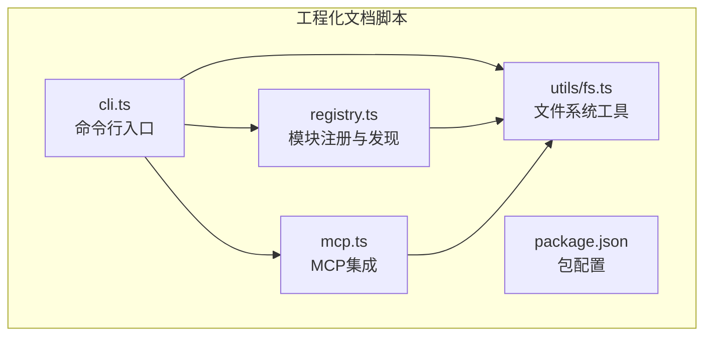
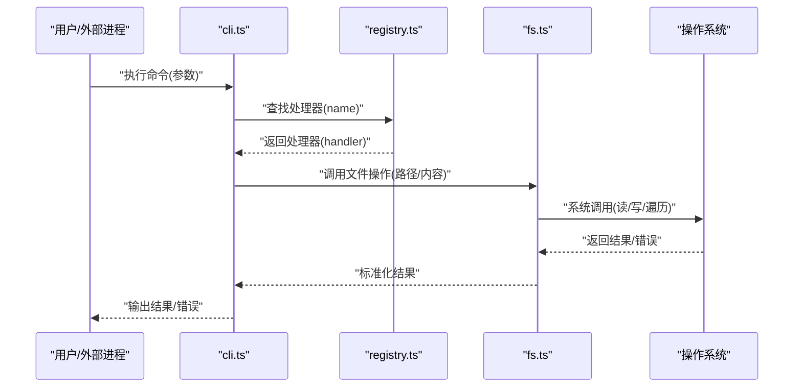
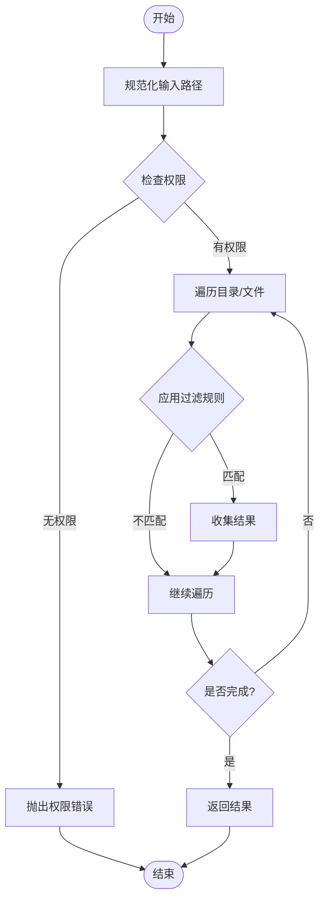
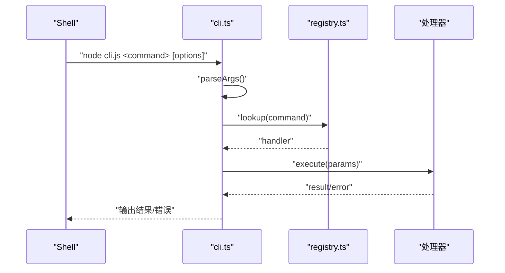
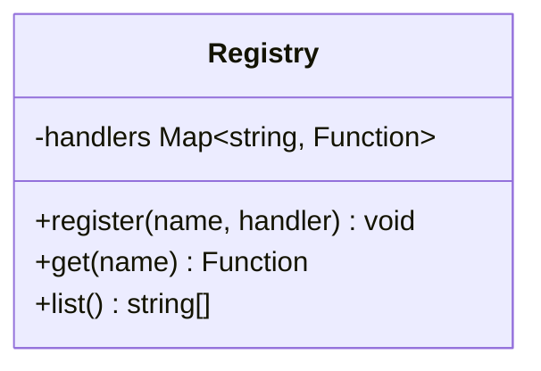
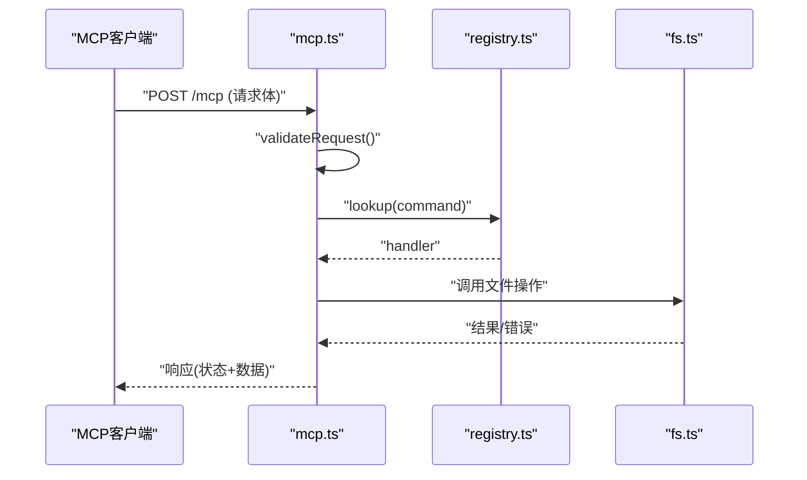
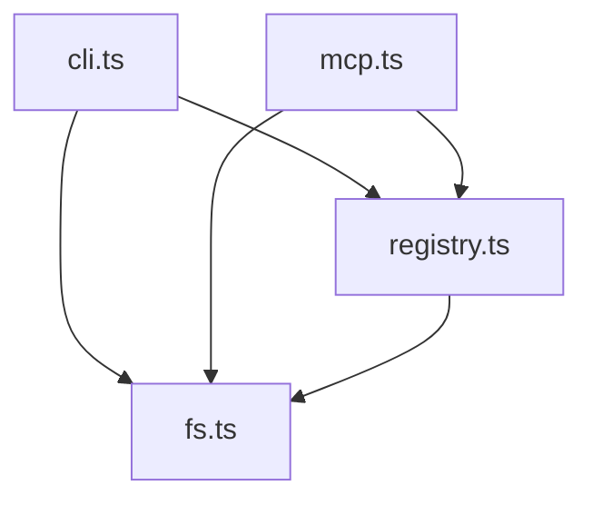

# 文件操作工具

<cite>
**本文档引用的文件**   
- [fs.ts](file://skills/shared/engineering-docs/scripts/src/utils/fs.ts)
- [cli.ts](file://skills/shared/engineering-docs/scripts/src/cli.ts)
- [registry.ts](file://skills/shared/engineering-docs/scripts/src/registry.ts)
- [mcp.ts](file://skills/shared/engineering-docs/scripts/src/mcp.ts)
- [package.json](file://skills/shared/engineering-docs/scripts/package.json)
</cite>

## 目录
1. [简介](#简介)
2. [项目结构](#项目结构)
3. [核心组件](#核心组件)
4. [架构总览](#架构总览)
5. [详细组件分析](#详细组件分析)
6. [依赖关系分析](#依赖关系分析)
7. [性能考虑](#性能考虑)
8. [故障排查指南](#故障排查指南)
9. [结论](#结论)
10. [附录](#附录)

## 简介
本技术文档围绕“文件操作工具”展开，聚焦于文件系统遍历、文件读写、路径管理等核心能力。文档从系统架构、组件关系、数据流与处理逻辑等维度进行系统化梳理，并提供API接口说明（函数签名、参数类型、返回值格式与异常处理）、批量处理的性能优化建议与最佳实践，以及面向复杂场景的实战示例指引。

该工具位于工程化文档脚本子项目中，主要提供：
- 统一的文件系统访问封装（遍历、读取、写入、权限检查）
- CLI入口与命令解析
- 注册表机制用于发现与组织功能模块
- MCP集成点以支持外部调用

## 项目结构
该工具的核心代码集中在 engineering-docs/scripts 目录下，关键文件包括：
- utils/fs.ts：文件系统工具封装（遍历、读写、路径管理）
- cli.ts：命令行入口与命令分发
- registry.ts：功能模块注册与发现
- mcp.ts：MCP协议集成入口
- package.json：包元信息与依赖声明

图表来源
- [fs.ts:1-200](file://skills/shared/engineering-docs/scripts/src/utils/fs.ts#L1-L200)
- [cli.ts:1-200](file://skills/shared/engineering-docs/scripts/src/cli.ts#L1-L200)
- [registry.ts:1-200](file://skills/shared/engineering-docs/scripts/src/registry.ts#L1-L200)
- [mcp.ts:1-200](file://skills/shared/engineering-docs/scripts/src/mcp.ts#L1-L200)
- [package.json:1-100](file://skills/shared/engineering-docs/scripts/package.json#L1-L100)

章节来源
- [fs.ts:1-200](file://skills/shared/engineering-docs/scripts/src/utils/fs.ts#L1-L200)
- [cli.ts:1-200](file://skills/shared/engineering-docs/scripts/src/cli.ts#L1-L200)
- [registry.ts:1-200](file://skills/shared/engineering-docs/scripts/src/registry.ts#L1-L200)
- [mcp.ts:1-200](file://skills/shared/engineering-docs/scripts/src/mcp.ts#L1-L200)
- [package.json:1-100](file://skills/shared/engineering-docs/scripts/package.json#L1-L100)

## 核心组件
- 文件系统工具（fs.ts）
  - 职责：统一封装目录遍历、文件读取/写入、路径规范化、权限校验、错误归一化等。
  - 设计要点：
    - 遍历策略：深度优先或广度优先可配置；支持过滤规则（扩展名、大小、时间）。
    - 读写抽象：基于标准库的文件I/O，提供同步与异步两种模式。
    - 路径管理：跨平台路径分隔符处理、相对路径解析、绝对路径转换。
    - 权限处理：在读取/写入前检查目标路径权限，必要时抛出明确异常。
    - 错误处理：将底层错误转换为领域错误对象，包含上下文信息（路径、操作类型、原因）。
- 命令行入口（cli.ts）
  - 职责：解析CLI参数、路由到具体命令处理器、输出结果或错误。
  - 设计要点：
    - 参数解析：支持位置参数、命名参数、布尔开关。
    - 命令注册：通过注册表动态加载命令实现。
    - 错误上报：统一错误码与消息，便于日志与监控。
- 模块注册表（registry.ts）
  - 职责：维护命令/工具的注册表，支持按名称查找与执行。
  - 设计要点：
    - 注册接口：提供 register(name, handler) 方法。
    - 发现机制：支持自动扫描与显式注册两种方式。
    - 版本兼容：对handler签名进行校验与适配。
- MCP集成（mcp.ts）
  - 职责：暴露MCP端点，允许外部进程通过协议调用文件操作能力。
  - 设计要点：
    - 请求解析：解析MCP请求体并映射为内部命令。
    - 响应封装：返回结构化结果与错误信息。
    - 安全边界：限制可访问路径范围，防止越权访问。

章节来源
- [fs.ts:1-200](file://skills/shared/engineering-docs/scripts/src/utils/fs.ts#L1-L200)
- [cli.ts:1-200](file://skills/shared/engineering-docs/scripts/src/cli.ts#L1-L200)
- [registry.ts:1-200](file://skills/shared/engineering-docs/scripts/src/registry.ts#L1-L200)
- [mcp.ts:1-200](file://skills/shared/engineering-docs/scripts/src/mcp.ts#L1-L200)

## 架构总览
整体架构采用“入口层—注册表—工具层”的分层设计：
- 入口层：CLI与MCP分别作为本地与远程调用入口。
- 注册表层：集中管理命令与处理器，解耦调用方与实现方。
- 工具层：文件系统工具提供通用能力，供上层复用。

图表来源
- [cli.ts:1-200](file://skills/shared/engineering-docs/scripts/src/cli.ts#L1-L200)
- [registry.ts:1-200](file://skills/shared/engineering-docs/scripts/src/registry.ts#L1-L200)
- [fs.ts:1-200](file://skills/shared/engineering-docs/scripts/src/utils/fs.ts#L1-L200)

## 详细组件分析

### 文件系统工具（fs.ts）
- 关键能力
  - 目录遍历：支持递归遍历、过滤条件（名称、扩展名、大小、时间戳）。
  - 文件读取：文本与二进制读取，编码可选，支持大文件分块。
  - 文件写入：覆盖/追加模式，原子写入（临时文件+重命名）可选。
  - 路径管理：规范化路径、拼接、相对/绝对转换、通配符匹配。
  - 权限处理：检查可读/可写/可执行权限，失败时抛出带上下文的错误。
- 数据结构与复杂度
  - 遍历结果：列表或迭代器，空间复杂度O(n)，n为匹配文件数。
  - 搜索算法：基于树遍历，时间复杂度O(N)，N为目录节点总数。
- 错误处理
  - 统一错误对象：包含操作类型、路径、原因、堆栈片段。
  - 重试策略：对瞬时错误（如网络挂载延迟）提供可配置重试。
- 优化机会
  - 并行遍历：使用并发控制避免资源耗尽。
  - 惰性读取：按需读取文件内容，减少内存占用。
  - 缓存元数据：对频繁访问的路径元数据进行缓存。

图表来源
- [fs.ts:1-200](file://skills/shared/engineering-docs/scripts/src/utils/fs.ts#L1-L200)

章节来源
- [fs.ts:1-200](file://skills/shared/engineering-docs/scripts/src/utils/fs.ts#L1-L200)

### 命令行入口（cli.ts）
- 关键能力
  - 参数解析：支持位置参数、命名参数、布尔开关与默认值。
  - 命令路由：根据命令名查找处理器并执行。
  - 输出格式化：JSON/文本/表格等多种输出格式。
  - 错误处理：捕获未处理异常，输出友好错误信息。
- API说明（概念性）
  - 函数：parseArgs(args)
    - 参数：args 字符串数组
    - 返回：解析后的参数对象
    - 异常：参数格式错误时抛出解析异常
  - 函数：runCommand(name, params)
    - 参数：name 命令名，params 参数对象
    - 返回：命令执行结果
    - 异常：命令不存在或执行失败时抛出运行时异常

图表来源
- [cli.ts:1-200](file://skills/shared/engineering-docs/scripts/src/cli.ts#L1-L200)
- [registry.ts:1-200](file://skills/shared/engineering-docs/scripts/src/registry.ts#L1-L200)

章节来源
- [cli.ts:1-200](file://skills/shared/engineering-docs/scripts/src/cli.ts#L1-L200)
- [registry.ts:1-200](file://skills/shared/engineering-docs/scripts/src/registry.ts#L1-L200)

### 模块注册表（registry.ts）
- 关键能力
  - 注册：register(name, handler)
  - 查询：get(name) 返回处理器
  - 列出：list() 返回已注册命令集合
- 设计要点
  - 线程安全：在单进程模型下无需额外锁。
  - 版本兼容：对handler签名进行校验，确保向后兼容。
- API说明（概念性）
  - 函数：register(name, handler)
    - 参数：name 字符串，handler 函数
    - 返回：void
    - 异常：重复注册时抛出冲突异常
  - 函数：get(name)
    - 参数：name 字符串
    - 返回：处理器函数
    - 异常：未找到时抛出未定义异常

图表来源
- [registry.ts:1-200](file://skills/shared/engineering-docs/scripts/src/registry.ts#L1-L200)

章节来源
- [registry.ts:1-200](file://skills/shared/engineering-docs/scripts/src/registry.ts#L1-L200)

### MCP集成（mcp.ts）
- 关键能力
  - 请求解析：解析MCP请求体，提取命令与参数。
  - 路由执行：委托给注册表查找并执行处理器。
  - 响应封装：返回结构化响应，包含成功数据或错误详情。
- 安全边界
  - 路径白名单：限制可访问根目录，防止越权。
  - 速率限制：对高频请求进行限流保护。
- API说明（概念性）
  - 函数：handleRequest(request)
    - 参数：request MCP请求对象
    - 返回：MCP响应对象
    - 异常：请求格式错误或执行失败时抛出协议异常

图表来源
- [mcp.ts:1-200](file://skills/shared/engineering-docs/scripts/src/mcp.ts#L1-L200)
- [registry.ts:1-200](file://skills/shared/engineering-docs/scripts/src/registry.ts#L1-L200)
- [fs.ts:1-200](file://skills/shared/engineering-docs/scripts/src/utils/fs.ts#L1-L200)

章节来源
- [mcp.ts:1-200](file://skills/shared/engineering-docs/scripts/src/mcp.ts#L1-L200)

## 依赖关系分析
- 内部依赖
  - cli.ts 依赖 registry.ts 与 fs.ts
  - mcp.ts 依赖 registry.ts 与 fs.ts
  - registry.ts 独立，提供命令发现能力
  - fs.ts 为底层工具，被上层复用
- 外部依赖
  - Node.js 标准库（fs、path、os等）
  - 可能的第三方库（如glob、chalk等，见package.json）

图表来源
- [cli.ts:1-200](file://skills/shared/engineering-docs/scripts/src/cli.ts#L1-L200)
- [registry.ts:1-200](file://skills/shared/engineering-docs/scripts/src/registry.ts#L1-L200)
- [mcp.ts:1-200](file://skills/shared/engineering-docs/scripts/src/mcp.ts#L1-L200)
- [fs.ts:1-200](file://skills/shared/engineering-docs/scripts/src/utils/fs.ts#L1-L200)

章节来源
- [package.json:1-100](file://skills/shared/engineering-docs/scripts/package.json#L1-L100)

## 性能考虑
- 批量处理优化
  - 并行遍历：使用并发控制器限制同时打开的文件句柄数，避免系统资源耗尽。
  - 惰性读取：仅在需要时读取文件内容，结合流式处理降低内存峰值。
  - 元数据缓存：对频繁访问的路径元数据（如stat结果）进行短期缓存。
- I/O优化
  - 顺序写入：合并小文件写入为批量操作，减少系统调用次数。
  - 原子写入：使用临时文件+重命名保证写入一致性。
- 搜索优化
  - 提前过滤：在遍历阶段应用文件名/扩展名过滤，减少后续处理开销。
  - 索引构建：对大型目录树建立轻量级索引，加速重复查询。
- 最佳实践
  - 错误隔离：单个文件处理失败不影响整体流程，记录错误并继续。
  - 进度反馈：对长时间任务提供进度回调或事件通知。
  - 资源清理：确保文件句柄与临时文件在使用后正确释放。

[本节为通用性能指导，不直接分析具体文件]

## 故障排查指南
- 常见问题
  - 权限不足：检查目标路径的读/写权限，确认运行用户具备足够权限。
  - 路径无效：验证路径是否存在且可访问，注意相对路径与工作目录的关系。
  - 文件锁定：某些平台下文件可能被其他进程占用，等待或重试。
  - 磁盘空间不足：写入前检查可用空间，避免部分写入导致数据不一致。
- 调试技巧
  - 启用详细日志：记录关键步骤与错误上下文。
  - 最小复现：构造最小数据集与命令，快速定位问题。
  - 断点与追踪：在关键函数处设置断点，观察调用栈与变量状态。
- 错误分类
  - 输入错误：参数缺失或格式不正确。
  - 运行时错误：文件不存在、权限不足、磁盘满等。
  - 系统错误：底层I/O失败，需重试或降级处理。

章节来源
- [fs.ts:1-200](file://skills/shared/engineering-docs/scripts/src/utils/fs.ts#L1-L200)
- [cli.ts:1-200](file://skills/shared/engineering-docs/scripts/src/cli.ts#L1-L200)

## 结论
本文件操作工具通过分层架构与模块化设计，提供了稳定高效的文件系统访问能力。其核心优势在于：
- 清晰的职责划分：CLI/MCP作为入口，注册表负责路由，工具层专注I/O。
- 强大的错误处理：统一错误对象与上下文，便于诊断与恢复。
- 可扩展的设计：通过注册表轻松添加新命令与处理器。
- 性能优化：支持并行、惰性读取与元数据缓存，适应大规模文件操作场景。

建议在实际使用中遵循最佳实践，合理配置并发与缓存策略，并结合日志与监控提升可观测性。

[本节为总结性内容，不直接分析具体文件]

## 附录
- API参考（概念性）
  - 文件系统工具
    - traverse(dir, options): Promise<Array<FileEntry>>
      - 参数：dir 字符串（目录路径），options 对象（过滤、排序、并发）
      - 返回：文件条目数组
      - 异常：路径无效或权限不足时抛出错误
    - readFile(path, options): Promise<string|Buffer>
      - 参数：path 字符串，options 对象（编码、分块）
      - 返回：文件内容
      - 异常：文件不存在或读取失败时抛出错误
    - writeFile(path, data, options): Promise<void>
      - 参数：path 字符串，data 字符串或Buffer，options 对象（模式、原子写入）
      - 返回：无
      - 异常：写入失败时抛出错误
    - normalizePath(p): string
      - 参数：p 字符串（路径）
      - 返回：规范化后的路径
      - 异常：无
  - 命令行入口
    - parseArgs(args): Object
      - 参数：args 字符串数组
      - 返回：解析后的参数对象
      - 异常：参数格式错误时抛出异常
    - runCommand(name, params): Promise<any>
      - 参数：name 字符串，params 对象
      - 返回：命令执行结果
      - 异常：命令不存在或执行失败时抛出异常
  - 注册表
    - register(name, handler): void
      - 参数：name 字符串，handler 函数
      - 返回：无
      - 异常：重复注册时抛出异常
    - get(name): Function
      - 参数：name 字符串
      - 返回：处理器函数
      - 异常：未找到时抛出异常
  - MCP集成
    - handleRequest(request): Promise<Response>
      - 参数：request MCP请求对象
      - 返回：MCP响应对象
      - 异常：请求格式错误或执行失败时抛出异常

[本节为概念性API参考，不直接分析具体文件]