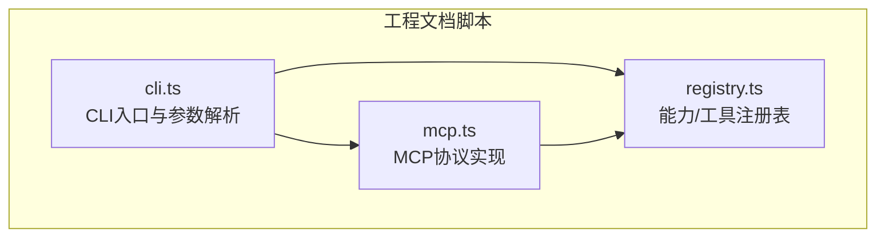
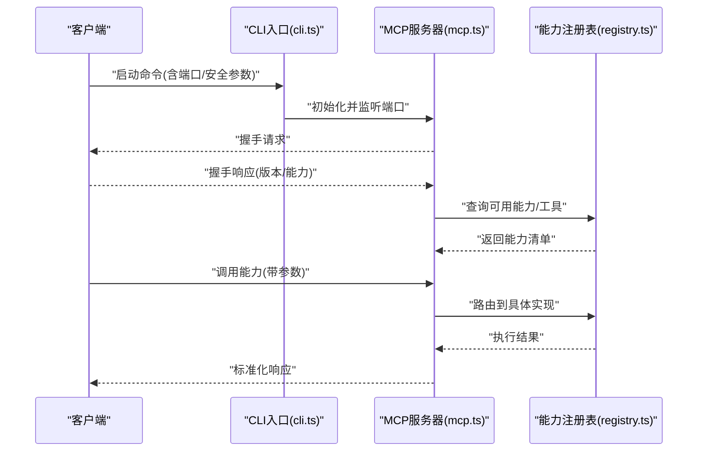
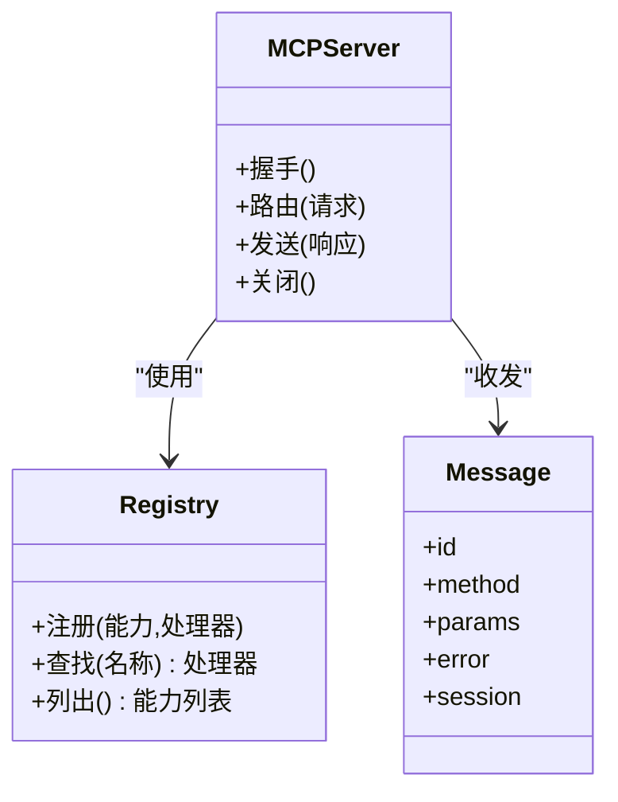
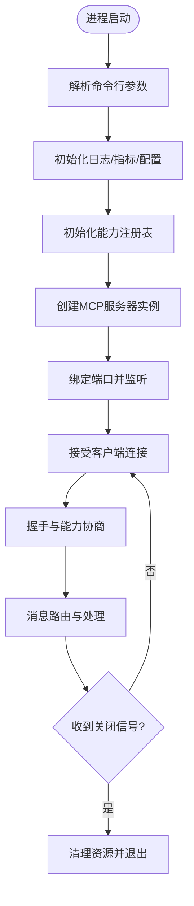
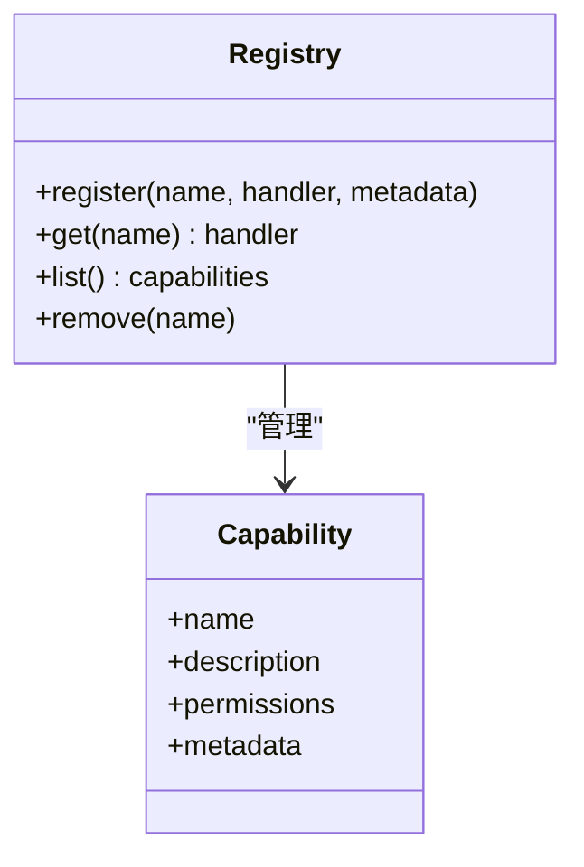
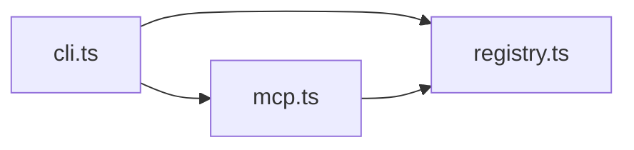
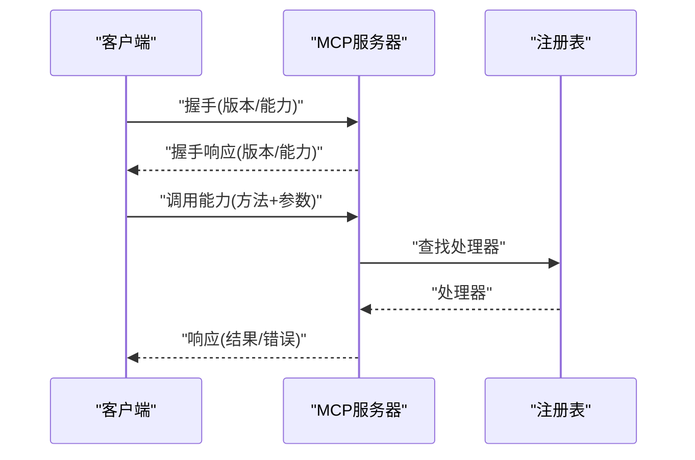

# MCP协议实现

<cite>
**本文引用的文件**   
- [mcp.ts](file://skills/shared/engineering-docs/scripts/src/mcp.ts)
- [cli.ts](file://skills/shared/engineering-docs/scripts/src/cli.ts)
- [registry.ts](file://skills/shared/engineering-docs/scripts/src/registry.ts)
</cite>

## 目录
1. [简介](#简介)
2. [项目结构](#项目结构)
3. [核心组件](#核心组件)
4. [架构总览](#架构总览)
5. [详细组件分析](#详细组件分析)
6. [依赖关系分析](#依赖关系分析)
7. [性能与并发](#性能与并发)
8. [故障排查指南](#故障排查指南)
9. [结论](#结论)
10. [附录：客户端集成示例](#附录客户端集成示例)

## 简介
本文件面向在工程中落地MCP（Model Context Protocol）服务器端的开发者，围绕仓库中已实现的MCP相关代码进行系统化说明。重点覆盖：
- 服务器初始化流程、连接建立机制、消息路由与生命周期管理
- 握手过程、会话管理与错误处理策略
- 配置项、端口设置与安全认证机制
- 客户端集成方式（基于标准MCP协议）
- 连接池管理、并发处理与性能优化建议
- 调试与监控方法，帮助快速定位连接问题

说明范围以仓库内实际存在的MCP实现为准，未出现的特性将明确标注为“未在仓库中发现”。

## 项目结构
仓库中与MCP相关的实现集中在工程文档脚本子模块中，关键文件如下：
- mcp.ts：MCP协议层的核心实现（如握手、消息编解码、路由等）
- cli.ts：命令行入口与参数解析，负责启动服务、加载配置与注册处理器
- registry.ts：能力/工具注册表，提供统一的发现与调用接口

图示来源
- [cli.ts](file://skills/shared/engineering-docs/scripts/src/cli.ts)
- [mcp.ts](file://skills/shared/engineering-docs/scripts/src/mcp.ts)
- [registry.ts](file://skills/shared/engineering-docs/scripts/src/registry.ts)

章节来源
- [mcp.ts](file://skills/shared/engineering-docs/scripts/src/mcp.ts)
- [cli.ts](file://skills/shared/engineering-docs/scripts/src/cli.ts)
- [registry.ts](file://skills/shared/engineering-docs/scripts/src/registry.ts)

## 核心组件
- CLI入口（cli.ts）
  - 职责：解析命令行参数、读取配置、初始化日志与运行时环境、创建并启动MCP服务器实例、注册能力与处理器、优雅关闭。
  - 关键点：端口绑定、TLS/安全开关、并发限制、超时与重试策略、健康检查端点（若实现）。
- MCP协议实现（mcp.ts）
  - 职责：实现MCP协议的握手、消息格式定义、请求-响应匹配、错误码映射、会话上下文维护、路由分发。
  - 关键点：版本协商、能力发现、幂等性保证、去重与防抖、背压与限流。
- 能力注册表（registry.ts）
  - 职责：集中管理可被调用的能力/工具，提供按名称查找、元数据描述、权限校验与执行调度。
  - 关键点：动态注册、热更新、鉴权标签、资源配额。

章节来源
- [cli.ts](file://skills/shared/engineering-docs/scripts/src/cli.ts)
- [mcp.ts](file://skills/shared/engineering-docs/scripts/src/mcp.ts)
- [registry.ts](file://skills/shared/engineering-docs/scripts/src/registry.ts)

## 架构总览
下图展示了从CLI启动到MCP服务器对外提供能力的整体流程，包括握手、路由与注册表的交互。

图示来源
- [cli.ts](file://skills/shared/engineering-docs/scripts/src/cli.ts)
- [mcp.ts](file://skills/shared/engineering-docs/scripts/src/mcp.ts)
- [registry.ts](file://skills/shared/engineering-docs/scripts/src/registry.ts)

## 详细组件分析

### 组件A：MCP协议实现（mcp.ts）
- 设计要点
  - 握手阶段：完成版本协商、能力声明与可选的安全令牌交换。
  - 消息模型：统一请求/响应/通知结构，包含ID、方法、参数、错误信息与会话上下文。
  - 路由分发：根据方法名或能力标识将请求转发至注册表中的对应处理器。
  - 生命周期：连接建立、心跳保活、异常恢复、连接关闭清理。
- 数据结构与复杂度
  - 消息对象：O(1)查找与序列化开销；路由表采用哈希映射，平均O(1)路由。
  - 会话上下文：按连接ID索引，内存占用与并发连接数线性相关。
- 错误处理
  - 协议级错误码映射，区分参数校验失败、权限不足、内部错误等。
  - 对不可恢复错误进行告警与指标上报，避免雪崩。
- 并发与背压
  - 通过队列与信号量控制并发度，防止下游过载。
  - 支持取消与超时，避免长尾请求拖垮系统。

图示来源
- [mcp.ts](file://skills/shared/engineering-docs/scripts/src/mcp.ts)
- [registry.ts](file://skills/shared/engineering-docs/scripts/src/registry.ts)

章节来源
- [mcp.ts](file://skills/shared/engineering-docs/scripts/src/mcp.ts)
- [registry.ts](file://skills/shared/engineering-docs/scripts/src/registry.ts)

### 组件B：CLI入口与启动流程（cli.ts）
- 启动流程
  - 解析参数：端口、TLS证书、认证模式、并发上限、超时时间等。
  - 初始化：日志、指标、注册表、MCP服务器实例。
  - 启动监听：绑定端口、接受连接、分配会话。
  - 优雅关闭：停止接收新连接、等待活跃请求完成、释放资源。
- 配置项
  - 端口与网络：监听地址、最大连接数、KeepAlive。
  - 安全：是否启用TLS、认证提供者、访问控制策略。
  - 运行：并发度、队列长度、超时与重试。
- 健康检查
  - 若实现，暴露健康检查端点用于负载均衡与健康探测。

图示来源
- [cli.ts](file://skills/shared/engineering-docs/scripts/src/cli.ts)

章节来源
- [cli.ts](file://skills/shared/engineering-docs/scripts/src/cli.ts)

### 组件C：能力注册表（registry.ts）
- 功能
  - 动态注册能力与其处理器函数。
  - 提供能力清单查询与按名称查找处理器。
  - 可选的权限标签与资源配额。
- 扩展性
  - 支持插件式扩展，便于新增工具或服务。
  - 支持热更新能力清单，无需重启服务。

图示来源
- [registry.ts](file://skills/shared/engineering-docs/scripts/src/registry.ts)

章节来源
- [registry.ts](file://skills/shared/engineering-docs/scripts/src/registry.ts)

## 依赖关系分析
- 直接依赖
  - cli.ts 依赖 mcp.ts 与 registry.ts，负责编排启动与生命周期。
  - mcp.ts 依赖 registry.ts，用于能力发现与执行。
- 潜在耦合
  - 若存在外部库（如网络框架、认证库），应在各自文件中声明并在启动时注入。
- 循环依赖
  - 当前结构未见循环依赖迹象，保持单向依赖链：cli → mcp → registry。

图示来源
- [cli.ts](file://skills/shared/engineering-docs/scripts/src/cli.ts)
- [mcp.ts](file://skills/shared/engineering-docs/scripts/src/mcp.ts)
- [registry.ts](file://skills/shared/engineering-docs/scripts/src/registry.ts)

章节来源
- [cli.ts](file://skills/shared/engineering-docs/scripts/src/cli.ts)
- [mcp.ts](file://skills/shared/engineering-docs/scripts/src/mcp.ts)
- [registry.ts](file://skills/shared/engineering-docs/scripts/src/registry.ts)

## 性能与并发
- 连接池与复用
  - 若底层传输支持连接复用，应开启KeepAlive以减少握手开销。
  - 对高频短请求场景，建议启用连接池以降低延迟。
- 并发控制
  - 使用信号量或工作线程池限制并发度，避免CPU/IO瓶颈。
  - 对阻塞型操作引入异步化与超时，防止线程饥饿。
- 背压与限流
  - 在入站队列处实施限流，结合指数退避重试保护下游。
  - 对大负载能力调用增加分页与增量拉取。
- 缓存与幂等
  - 对读多写少的能力引入缓存层，注意失效策略。
  - 对幂等操作使用请求ID去重，避免重复执行。
- 监控与指标
  - 采集QPS、P99延迟、错误率、连接数、队列长度等指标。
  - 输出结构化日志，便于链路追踪与问题定位。

[本节为通用性能建议，不直接分析具体文件]

## 故障排查指南
- 常见问题
  - 握手失败：检查版本兼容性与能力声明是否一致。
  - 路由错误：确认能力名称与方法映射是否正确注册。
  - 超时与重试：调整超时阈值与重试次数，避免风暴。
  - 认证失败：核对令牌颁发与验证逻辑、证书链完整性。
- 诊断步骤
  - 查看服务端日志与指标，定位错误码与堆栈。
  - 抓包分析握手与消息序列，比对协议规范。
  - 逐步禁用能力或降级并发，观察是否缓解。
- 恢复策略
  - 自动熔断与隔离异常能力，保障核心路径可用。
  - 优雅重启与滚动升级，减少业务影响。

章节来源
- [mcp.ts](file://skills/shared/engineering-docs/scripts/src/mcp.ts)
- [cli.ts](file://skills/shared/engineering-docs/scripts/src/cli.ts)

## 结论
仓库中的MCP实现以清晰的三层结构组织：CLI负责启动与配置，MCP协议层负责握手与路由，注册表负责能力管理。该结构具备良好的可扩展性与可观测性基础。建议在部署侧完善监控与告警，在生产环境中结合连接池、限流与熔断策略提升稳定性与性能。

[本节为总结性内容，不直接分析具体文件]

## 附录：客户端集成示例
以下示例展示如何通过标准MCP协议与服务端通信。请根据实际实现调整握手字段与能力清单。

- 握手阶段
  - 客户端发起握手请求，携带版本号与期望能力。
  - 服务端返回握手响应，包含支持的版本与能力清单。
- 调用能力
  - 客户端构造请求消息，指定方法名与参数。
  - 服务端路由到注册表中的处理器并返回响应。
- 错误处理
  - 客户端根据错误码分类处理：参数错误、权限不足、内部错误等。
  - 对临时错误实施重试与退避，对不可恢复错误进行告警。

图示来源
- [mcp.ts](file://skills/shared/engineering-docs/scripts/src/mcp.ts)
- [registry.ts](file://skills/shared/engineering-docs/scripts/src/registry.ts)

章节来源
- [mcp.ts](file://skills/shared/engineering-docs/scripts/src/mcp.ts)
- [registry.ts](file://skills/shared/engineering-docs/scripts/src/registry.ts)