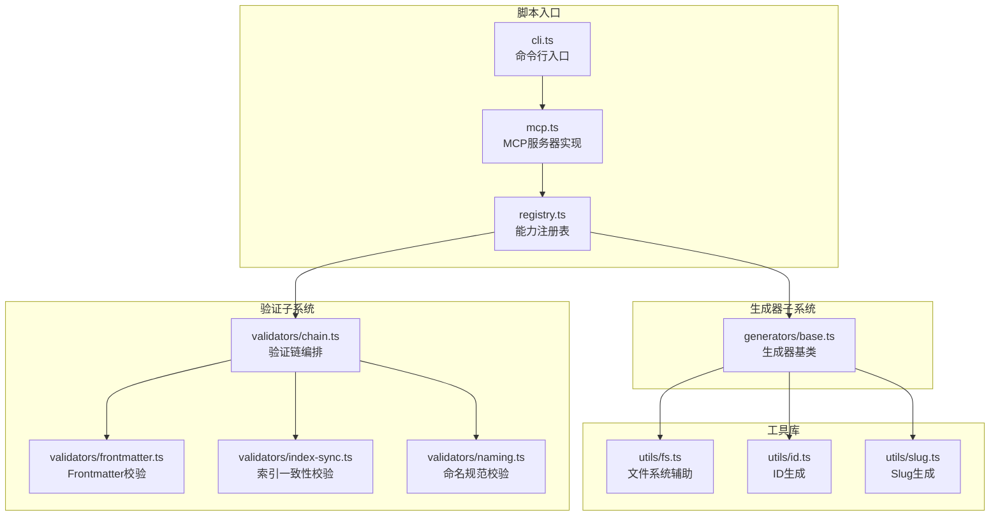
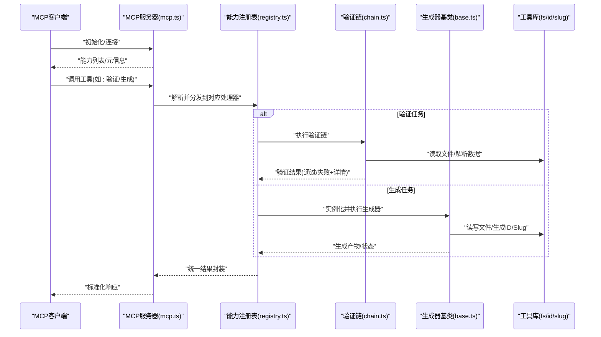
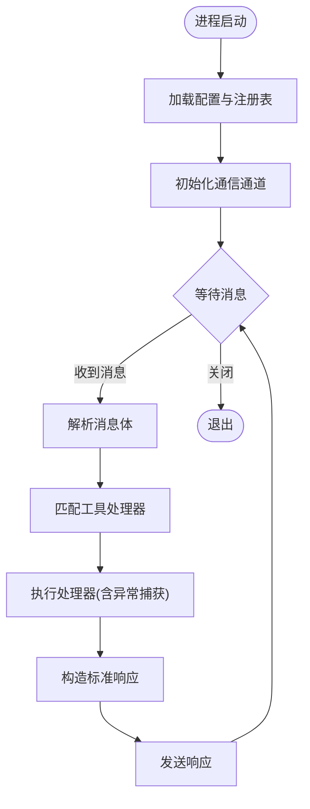
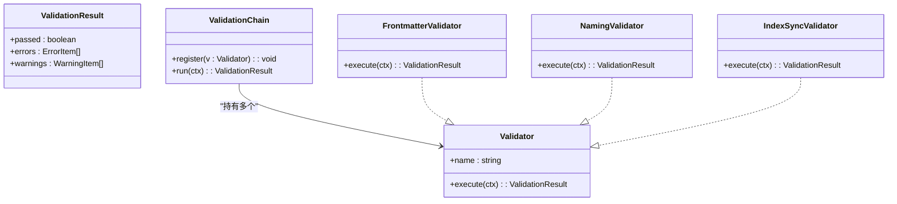
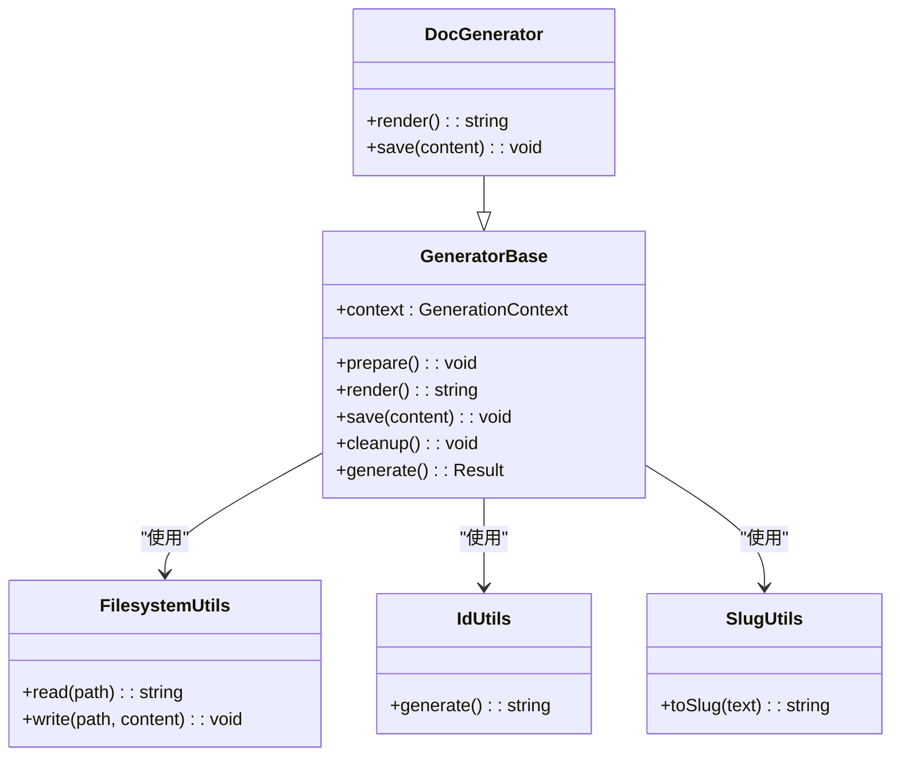
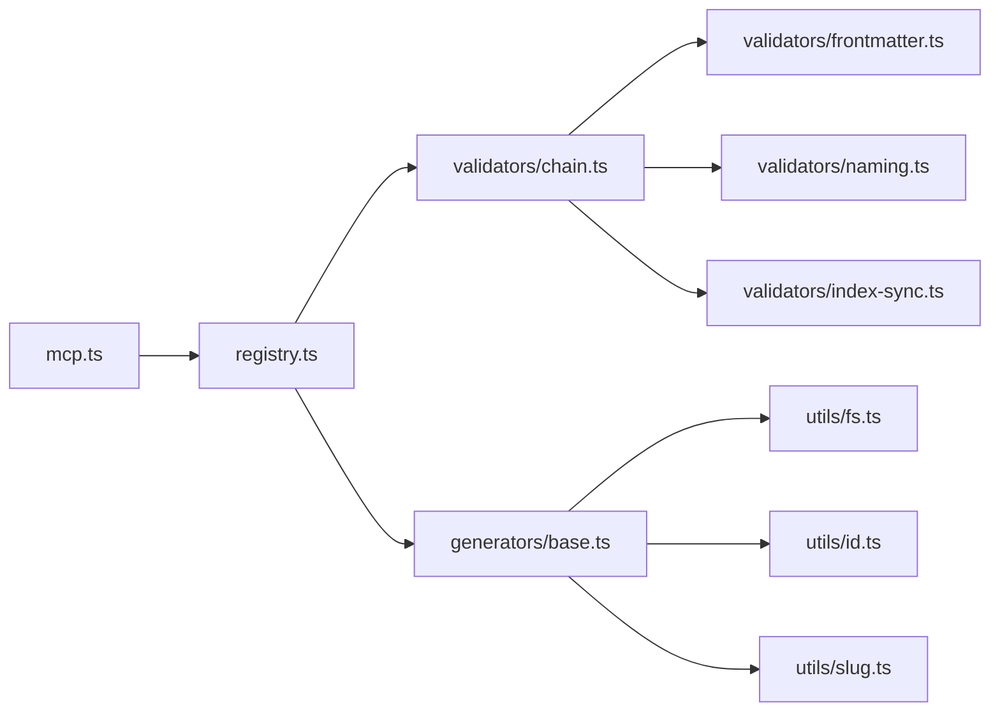

# MCP服务器接口

<cite>
**本文引用的文件**   
- [mcp.ts](file://skills/shared/engineering-docs/scripts/src/mcp.ts)
- [cli.ts](file://skills/shared/engineering-docs/scripts/src/cli.ts)
- [registry.ts](file://skills/shared/engineering-docs/scripts/src/registry.ts)
- [chain.ts](file://skills/shared/engineering-docs/scripts/src/validators/chain.ts)
- [frontmatter.ts](file://skills/shared/engineering-docs/scripts/src/validators/frontmatter.ts)
- [index-sync.ts](file://skills/shared/engineering-docs/scripts/src/validators/index-sync.ts)
- [naming.ts](file://skills/shared/engineering-docs/scripts/src/validators/naming.ts)
- [base.ts](file://skills/shared/engineering-docs/scripts/src/generators/base.ts)
- [fs.ts](file://skills/shared/engineering-docs/scripts/src/utils/fs.ts)
- [id.ts](file://skills/shared/engineering-docs/scripts/src/utils/id.ts)
- [slug.ts](file://skills/shared/engineering-docs/scripts/src/utils/slug.ts)
- [package.json](file://skills/shared/engineering-docs/scripts/package.json)
</cite>

## 目录
1. [简介](#简介)
2. [项目结构](#项目结构)
3. [核心组件](#核心组件)
4. [架构总览](#架构总览)
5. [详细组件分析](#详细组件分析)
6. [依赖关系分析](#依赖关系分析)
7. [性能考虑](#性能考虑)
8. [故障排查指南](#故障排查指南)
9. [结论](#结论)
10. [附录](#附录)

## 简介
本文件面向工程文档工具中的MCP（Model Context Protocol）服务器实现，系统性说明以下方面：
- MCP协议在工程文档工具中的应用与落地：服务器初始化、连接管理、消息处理机制。
- 验证链系统的API接口：验证规则定义、执行流程、错误处理。
- 生成器基类的设计模式与扩展机制：如何自定义文档生成逻辑。
- MCP客户端集成指南：连接配置、请求格式、响应处理、调试方法。
- 实际代码示例与集成模式：以“代码片段路径”形式定位到仓库中的具体实现位置，便于快速查阅与复用。

## 项目结构
该工程文档工具位于 skills/shared/engineering-docs/scripts 目录下，采用“功能分层 + 模块内聚”的组织方式：
- 入口与协议层：CLI 启动、MCP 服务器实现、能力注册表。
- 验证子系统：验证链编排与各独立验证器。
- 生成器子系统：基于基类的可插拔文档生成器。
- 工具库：文件系统、ID与Slug生成等通用能力。

图表来源
- [cli.ts](file://skills/shared/engineering-docs/scripts/src/cli.ts)
- [mcp.ts](file://skills/shared/engineering-docs/scripts/src/mcp.ts)
- [registry.ts](file://skills/shared/engineering-docs/scripts/src/registry.ts)
- [chain.ts](file://skills/shared/engineering-docs/scripts/src/validators/chain.ts)
- [frontmatter.ts](file://skills/shared/engineering-docs/scripts/src/validators/frontmatter.ts)
- [index-sync.ts](file://skills/shared/engineering-docs/scripts/src/validators/index-sync.ts)
- [naming.ts](file://skills/shared/engineering-docs/scripts/src/validators/naming.ts)
- [base.ts](file://skills/shared/engineering-docs/scripts/src/generators/base.ts)
- [fs.ts](file://skills/shared/engineering-docs/scripts/src/utils/fs.ts)
- [id.ts](file://skills/shared/engineering-docs/scripts/src/utils/id.ts)
- [slug.ts](file://skills/shared/engineering-docs/scripts/src/utils/slug.ts)

章节来源
- [cli.ts](file://skills/shared/engineering-docs/scripts/src/cli.ts)
- [mcp.ts](file://skills/shared/engineering-docs/scripts/src/mcp.ts)
- [registry.ts](file://skills/shared/engineering-docs/scripts/src/registry.ts)
- [chain.ts](file://skills/shared/engineering-docs/scripts/src/validators/chain.ts)
- [frontmatter.ts](file://skills/shared/engineering-docs/scripts/src/validators/frontmatter.ts)
- [index-sync.ts](file://skills/shared/engineering-docs/scripts/src/validators/index-sync.ts)
- [naming.ts](file://skills/shared/engineering-docs/scripts/src/validators/naming.ts)
- [base.ts](file://skills/shared/engineering-docs/scripts/src/generators/base.ts)
- [fs.ts](file://skills/shared/engineering-docs/scripts/src/utils/fs.ts)
- [id.ts](file://skills/shared/engineering-docs/scripts/src/utils/id.ts)
- [slug.ts](file://skills/shared/engineering-docs/scripts/src/utils/slug.ts)

## 核心组件
本节聚焦三大核心组件的职责与交互：
- MCP服务器：负责协议握手、能力发现、请求路由与响应返回。
- 验证链系统：将多个验证器按顺序组合，统一执行并汇总结果。
- 生成器基类：提供统一的生成生命周期与上下文，支持子类扩展。

章节来源
- [mcp.ts](file://skills/shared/engineering-docs/scripts/src/mcp.ts)
- [chain.ts](file://skills/shared/engineering-docs/scripts/src/validators/chain.ts)
- [base.ts](file://skills/shared/engineering-docs/scripts/src/generators/base.ts)

## 架构总览
下图展示了从客户端发起请求到服务端处理、调用验证链与生成器的整体流程。

图表来源
- [mcp.ts](file://skills/shared/engineering-docs/scripts/src/mcp.ts)
- [registry.ts](file://skills/shared/engineering-docs/scripts/src/registry.ts)
- [chain.ts](file://skills/shared/engineering-docs/scripts/src/validators/chain.ts)
- [base.ts](file://skills/shared/engineering-docs/scripts/src/generators/base.ts)
- [fs.ts](file://skills/shared/engineering-docs/scripts/src/utils/fs.ts)
- [id.ts](file://skills/shared/engineering-docs/scripts/src/utils/id.ts)
- [slug.ts](file://skills/shared/engineering-docs/scripts/src/utils/slug.ts)

## 详细组件分析

### MCP服务器实现（初始化、连接管理与消息处理）
- 初始化流程
  - 加载配置与能力注册表，完成服务元信息与工具清单的构建。
  - 建立通信通道（例如标准输入输出或IPC），进入事件循环等待消息。
- 连接管理
  - 维护会话上下文（如工作目录、权限、缓存）。
  - 支持能力发现与动态更新（新增/移除工具后刷新清单）。
- 消息处理
  - 解析入站消息，匹配目标工具名与参数。
  - 调用注册表中的处理器，捕获异常并转换为标准错误响应。
  - 对耗时操作进行超时控制与进度上报（若协议支持）。

图表来源
- [mcp.ts](file://skills/shared/engineering-docs/scripts/src/mcp.ts)
- [registry.ts](file://skills/shared/engineering-docs/scripts/src/registry.ts)

章节来源
- [mcp.ts](file://skills/shared/engineering-docs/scripts/src/mcp.ts)
- [registry.ts](file://skills/shared/engineering-docs/scripts/src/registry.ts)

### 验证链系统（API、执行流程与错误处理）
- API概览
  - 定义验证器：每个验证器暴露统一的输入/输出契约（输入为文档上下文，输出为通过/失败及诊断信息）。
  - 注册验证器：向验证链注册器添加规则，支持优先级与短路策略。
  - 执行验证：传入待验证文档集合，依次执行各规则，汇总结果。
- 执行流程
  - 预检查：基础字段存在性、类型与必填项。
  - 规则执行：按注册顺序执行，遇到失败可立即终止或继续收集全部错误。
  - 结果聚合：合并各规则的诊断信息，形成最终报告。
- 错误处理
  - 结构化错误对象：包含规则标识、级别（警告/错误）、消息与定位信息。
  - 容错策略：单个规则异常不影响其他规则执行；记录堆栈用于调试。

图表来源
- [chain.ts](file://skills/shared/engineering-docs/scripts/src/validators/chain.ts)
- [frontmatter.ts](file://skills/shared/engineering-docs/scripts/src/validators/frontmatter.ts)
- [naming.ts](file://skills/shared/engineering-docs/scripts/src/validators/naming.ts)
- [index-sync.ts](file://skills/shared/engineering-docs/scripts/src/validators/index-sync.ts)

章节来源
- [chain.ts](file://skills/shared/engineering-docs/scripts/src/validators/chain.ts)
- [frontmatter.ts](file://skills/shared/engineering-docs/scripts/src/validators/frontmatter.ts)
- [naming.ts](file://skills/shared/engineering-docs/scripts/src/validators/naming.ts)
- [index-sync.ts](file://skills/shared/engineering-docs/scripts/src/validators/index-sync.ts)

### 生成器基类（设计模式与扩展机制）
- 设计模式
  - 模板方法：基类定义生成生命周期（准备→渲染→落盘→清理），子类仅覆盖特定钩子。
  - 上下文注入：统一注入工作目录、模板变量、工具函数与日志接口。
- 扩展机制
  - 自定义渲染：重写渲染钩子，使用模板引擎或字符串拼接生成内容。
  - 自定义落盘：重写保存钩子，支持多格式输出与增量写入。
  - 插件式工具：通过工具库访问文件系统、生成ID/Slug等能力。
- 典型用法
  - 继承基类，实现必要钩子。
  - 在注册表中声明新生成器，供MCP服务器调度。

图表来源
- [base.ts](file://skills/shared/engineering-docs/scripts/src/generators/base.ts)
- [fs.ts](file://skills/shared/engineering-docs/scripts/src/utils/fs.ts)
- [id.ts](file://skills/shared/engineering-docs/scripts/src/utils/id.ts)
- [slug.ts](file://skills/shared/engineering-docs/scripts/src/utils/slug.ts)

章节来源
- [base.ts](file://skills/shared/engineering-docs/scripts/src/generators/base.ts)
- [fs.ts](file://skills/shared/engineering-docs/scripts/src/utils/fs.ts)
- [id.ts](file://skills/shared/engineering-docs/scripts/src/utils/id.ts)
- [slug.ts](file://skills/shared/engineering-docs/scripts/src/utils/slug.ts)

### 能力注册表（工具发现与路由）
- 职责
  - 集中管理所有可用工具（验证、生成、查询等）及其元信息。
  - 提供按名称查找处理器、参数校验与默认值填充。
- 扩展点
  - 新增工具时，仅需在注册表中登记处理器与描述，无需修改核心路由。
  - 支持条件启用（根据环境或配置开关）。

章节来源
- [registry.ts](file://skills/shared/engineering-docs/scripts/src/registry.ts)

## 依赖关系分析
- 模块耦合
  - MCP服务器强依赖注册表；注册表依赖验证链与生成器基类。
  - 验证链依赖具体验证器；生成器基类依赖工具库。
- 外部依赖
  - 文件系统I/O、JSON/YAML解析、日志与调试输出。
- 潜在风险
  - 循环依赖需避免（当前分层清晰，未见环）。
  - 全局状态应最小化，尽量通过上下文传递。

图表来源
- [mcp.ts](file://skills/shared/engineering-docs/scripts/src/mcp.ts)
- [registry.ts](file://skills/shared/engineering-docs/scripts/src/registry.ts)
- [chain.ts](file://skills/shared/engineering-docs/scripts/src/validators/chain.ts)
- [frontmatter.ts](file://skills/shared/engineering-docs/scripts/src/validators/frontmatter.ts)
- [naming.ts](file://skills/shared/engineering-docs/scripts/src/validators/naming.ts)
- [index-sync.ts](file://skills/shared/engineering-docs/scripts/src/validators/index-sync.ts)
- [base.ts](file://skills/shared/engineering-docs/scripts/src/generators/base.ts)
- [fs.ts](file://skills/shared/engineering-docs/scripts/src/utils/fs.ts)
- [id.ts](file://skills/shared/engineering-docs/scripts/src/utils/id.ts)
- [slug.ts](file://skills/shared/engineering-docs/scripts/src/utils/slug.ts)

章节来源
- [mcp.ts](file://skills/shared/engineering-docs/scripts/src/mcp.ts)
- [registry.ts](file://skills/shared/engineering-docs/scripts/src/registry.ts)
- [chain.ts](file://skills/shared/engineering-docs/scripts/src/validators/chain.ts)
- [base.ts](file://skills/shared/engineering-docs/scripts/src/generators/base.ts)

## 性能考虑
- I/O优化
  - 批量读取与写入，减少磁盘往返。
  - 按需懒加载大模板与资源。
- 计算优化
  - 验证规则短路策略：遇到致命错误提前终止，降低无谓计算。
  - 生成器缓存：相同上下文的多次生成命中缓存。
- 并发与超时
  - 对长耗时任务设置超时与取消信号。
  - 合理限制并发度，避免I/O风暴。

[本节为通用指导，不直接分析具体文件]

## 故障排查指南
- 常见问题
  - 连接失败：检查通信通道初始化与端口/管道可用性。
  - 能力未找到：确认注册表是否成功加载与工具名拼写。
  - 验证失败：查看验证结果中的错误项与定位信息。
  - 生成失败：检查模板变量缺失、文件权限与路径有效性。
- 调试建议
  - 开启详细日志，记录消息收发与关键步骤。
  - 使用最小复现用例隔离问题。
  - 针对验证器与生成器增加断点与中间态输出。

章节来源
- [mcp.ts](file://skills/shared/engineering-docs/scripts/src/mcp.ts)
- [chain.ts](file://skills/shared/engineering-docs/scripts/src/validators/chain.ts)
- [base.ts](file://skills/shared/engineering-docs/scripts/src/generators/base.ts)

## 结论
本方案将MCP协议与工程文档工具深度结合，通过清晰的模块化设计与可扩展的验证链、生成器体系，实现了高内聚、低耦合的服务端能力。配合完善的错误处理与调试手段，能够快速集成到各类MCP客户端生态中，提升文档生产与质量保障效率。

[本节为总结性内容，不直接分析具体文件]

## 附录

### MCP客户端集成指南
- 连接配置
  - 选择传输层（标准输入输出、HTTP、WebSocket等），配置服务端地址或命令。
  - 设置超时、重试与最大并发等参数。
- 请求格式
  - 遵循MCP消息规范，携带工具名、参数与上下文。
  - 对于验证任务，传入文档路径或内容；对于生成任务，传入模板与变量。
- 响应处理
  - 解析标准响应体，区分成功与错误分支。
  - 对验证结果进行可视化展示与导出。
- 错误处理与调试
  - 捕获网络与协议层异常，记录上下文以便复现。
  - 使用日志与追踪ID关联一次调用的完整链路。

章节来源
- [mcp.ts](file://skills/shared/engineering-docs/scripts/src/mcp.ts)
- [registry.ts](file://skills/shared/engineering-docs/scripts/src/registry.ts)

### 实际代码示例与集成模式（以“代码片段路径”定位）
- 服务器初始化与能力发现
  - 参考：[mcp.ts](file://skills/shared/engineering-docs/scripts/src/mcp.ts)、[registry.ts](file://skills/shared/engineering-docs/scripts/src/registry.ts)
- 验证链执行与结果聚合
  - 参考：[chain.ts](file://skills/shared/engineering-docs/scripts/src/validators/chain.ts)、[frontmatter.ts](file://skills/shared/engineering-docs/scripts/src/validators/frontmatter.ts)、[naming.ts](file://skills/shared/engineering-docs/scripts/src/validators/naming.ts)、[index-sync.ts](file://skills/shared/engineering-docs/scripts/src/validators/index-sync.ts)
- 生成器扩展与自定义
  - 参考：[base.ts](file://skills/shared/engineering-docs/scripts/src/generators/base.ts)、[fs.ts](file://skills/shared/engineering-docs/scripts/src/utils/fs.ts)、[id.ts](file://skills/shared/engineering-docs/scripts/src/utils/id.ts)、[slug.ts](file://skills/shared/engineering-docs/scripts/src/utils/slug.ts)
- 命令行入口与打包
  - 参考：[cli.ts](file://skills/shared/engineering-docs/scripts/src/cli.ts)、[package.json](file://skills/shared/engineering-docs/scripts/package.json)

[本节为导航性内容，不直接分析具体文件]