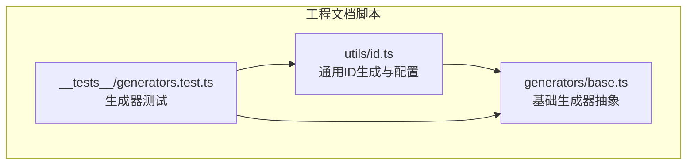
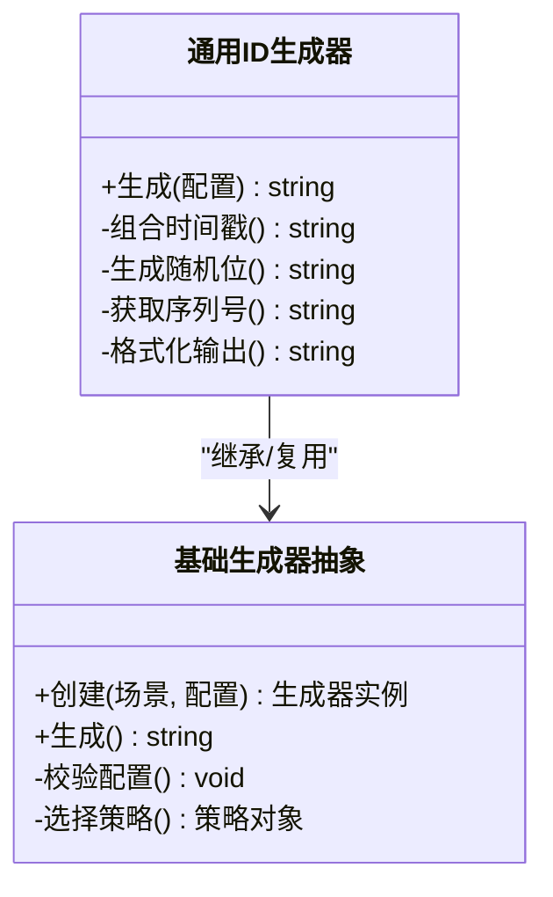
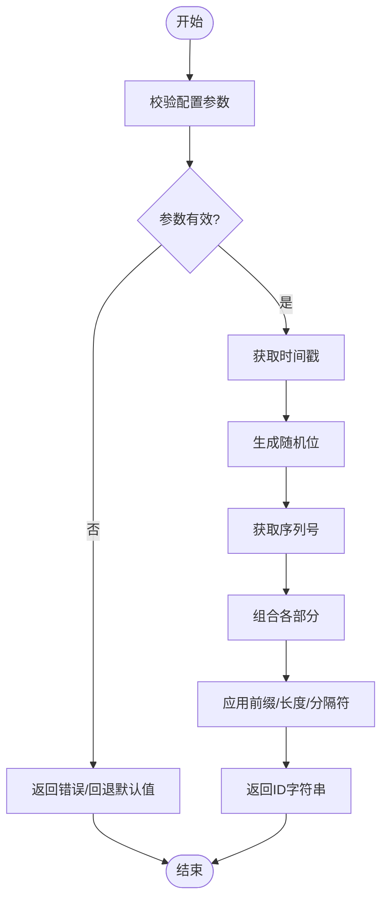
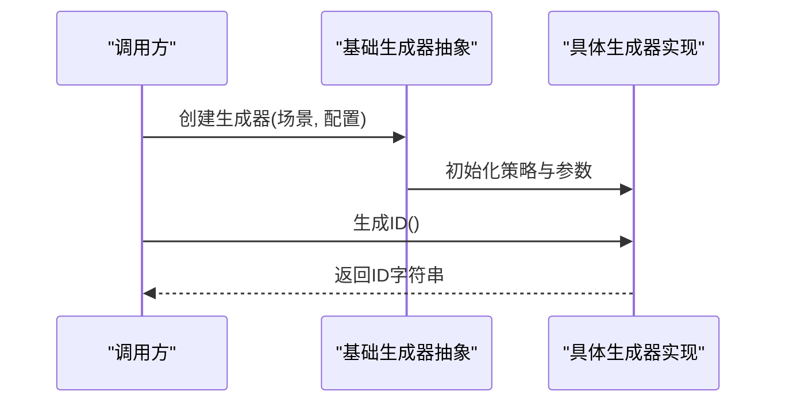
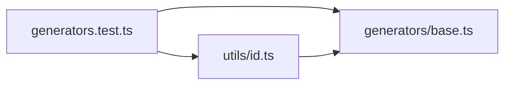

# ID生成器

<cite>
**本文引用的文件**   
- [id.ts](file://skills/shared/engineering-docs/scripts/src/utils/id.ts)
- [generators.test.ts](file://skills/shared/engineering-docs/scripts/src/__tests__/generators.test.ts)
- [base.ts](file://skills/shared/engineering-docs/scripts/src/generators/base.ts)
</cite>

## 目录
1. [简介](#简介)
2. [项目结构](#项目结构)
3. [核心组件](#核心组件)
4. [架构总览](#架构总览)
5. [详细组件分析](#详细组件分析)
6. [依赖关系分析](#依赖关系分析)
7. [性能考虑](#性能考虑)
8. [故障排查指南](#故障排查指南)
9. [结论](#结论)
10. [附录](#附录) 

## 简介
本模块提供一套可配置、可扩展的ID生成能力，支持时间戳组合、随机数与序列号机制，满足文档ID、任务ID、版本ID等场景化需求。其设计目标包括：
- 唯一性与冲突避免：在单机与分布式环境下保证全局唯一
- 时间有序性：生成的ID具备单调递增或近似单调特性，便于排序与索引
- 可读性与可维护性：通过前缀、分隔符与长度控制提升可读性
- 向后兼容：在演进过程中保持对既有ID格式的兼容

## 项目结构
该ID生成器位于工程文档脚本工具中，核心实现集中在utils与generators两个目录：
- utils/id.ts：提供通用ID生成能力与配置项
- generators/base.ts：定义基础生成器抽象与扩展点
- __tests__/generators.test.ts：覆盖主要生成路径与边界用例

图表来源
- [id.ts](file://skills/shared/engineering-docs/scripts/src/utils/id.ts)
- [base.ts](file://skills/shared/engineering-docs/scripts/src/generators/base.ts)
- [generators.test.ts](file://skills/shared/engineering-docs/scripts/src/__tests__/generators.test.ts)

章节来源
- [id.ts](file://skills/shared/engineering-docs/scripts/src/utils/id.ts)
- [base.ts](file://skills/shared/engineering-docs/scripts/src/generators/base.ts)
- [generators.test.ts](file://skills/shared/engineering-docs/scripts/src/__tests__/generators.test.ts)

## 核心组件
- 通用ID生成器（utils/id.ts）
  - 职责：封装时间戳、随机数、序列号的组合策略；暴露统一的生成接口；提供前缀、长度、分隔符等配置
  - 关键能力：
    - 时间戳组合：基于当前时间或传入时间，确保时间有序
    - 随机数生成：在必要时引入随机位，降低碰撞概率
    - 序列号管理：在同一时间窗口内使用自增序列，保证严格单调
    - 格式配置：支持自定义前缀、固定长度补齐、分隔符插入
- 基础生成器抽象（generators/base.ts）
  - 职责：定义生成器的统一接口与默认行为，便于扩展专用生成器（如文档ID、任务ID、版本ID）
  - 关键能力：
    - 工厂/注册模式：集中管理不同业务场景的生成器实例
    - 策略注入：允许为不同场景注入不同的时间/随机/序列策略
    - 校验与回退：对输入参数进行校验，并提供合理的默认值与回退逻辑

章节来源
- [id.ts](file://skills/shared/engineering-docs/scripts/src/utils/id.ts)
- [base.ts](file://skills/shared/engineering-docs/scripts/src/generators/base.ts)

## 架构总览
下图展示了通用ID生成器与基础生成器抽象之间的关系，以及测试如何驱动生成流程。

图表来源
- [id.ts](file://skills/shared/engineering-docs/scripts/src/utils/id.ts)
- [base.ts](file://skills/shared/engineering-docs/scripts/src/generators/base.ts)

## 详细组件分析

### 通用ID生成器（utils/id.ts）
- 算法要点
  - 时间戳组合：优先使用高精度时间戳，必要时降级到秒级时间戳，保证跨进程/节点的时间有序
  - 随机数生成：在时间相同的情况下引入随机位，降低并发下的碰撞概率
  - 序列号管理：同一毫秒内使用原子自增序列，确保严格单调递增
  - 格式配置：
    - 前缀：用于区分业务域（如“DOC”、“TASK”、“VER”）
    - 长度控制：固定长度补齐，便于存储与展示
    - 分隔符：在可读性要求高的场景插入分隔符（如“-”）
- 冲突避免策略
  - 分布式唯一性：结合节点标识或分区号，避免多机并发冲突
  - 时间排序特性：时间高位在前，保证按生成顺序可排序
- 错误处理
  - 参数校验：对前缀、长度、分隔符等进行合法性检查
  - 回退策略：当序列号溢出时自动升级时间精度或引入额外随机位

图表来源
- [id.ts](file://skills/shared/engineering-docs/scripts/src/utils/id.ts)

章节来源
- [id.ts](file://skills/shared/engineering-docs/scripts/src/utils/id.ts)

### 基础生成器抽象（generators/base.ts）
- 设计模式
  - 工厂方法：根据场景名称创建对应生成器实例
  - 策略模式：为不同场景注入不同的时间/随机/序列策略
- 扩展点
  - 新增专用生成器：通过注册表添加新场景（如“PLAN”、“RELEASE”）
  - 自定义策略：替换时间源、随机源或序列源以满足特殊需求
- 兼容性
  - 向后兼容：旧版ID格式可通过解析器识别并映射到新策略
  - 渐进迁移：支持双写与灰度切换，逐步淘汰旧格式

图表来源
- [base.ts](file://skills/shared/engineering-docs/scripts/src/generators/base.ts)

章节来源
- [base.ts](file://skills/shared/engineering-docs/scripts/src/generators/base.ts)

### 测试与验证（__tests__/generators.test.ts）
- 测试范围
  - 基本生成路径：验证时间戳、随机位、序列号的组合结果
  - 边界条件：时间回拨、序列号溢出、并发冲突
  - 配置项：前缀、长度、分隔符的正确应用
- 断言要点
  - 唯一性：多次生成不重复
  - 有序性：按生成顺序可比较
  - 可读性：符合预期的格式与分隔符

章节来源
- [generators.test.ts](file://skills/shared/engineering-docs/scripts/src/__tests__/generators.test.ts)

## 依赖关系分析
- 内部依赖
  - 通用ID生成器依赖基础生成器抽象提供的工厂与策略能力
  - 测试用例同时依赖两者以覆盖端到端流程
- 外部依赖
  - 时间源：系统时钟或高精度计时器
  - 随机源：安全随机数生成器
  - 序列源：内存自增或持久化计数器（可选）

图表来源
- [id.ts](file://skills/shared/engineering-docs/scripts/src/utils/id.ts)
- [base.ts](file://skills/shared/engineering-docs/scripts/src/generators/base.ts)
- [generators.test.ts](file://skills/shared/engineering-docs/scripts/src/__tests__/generators.test.ts)

章节来源
- [id.ts](file://skills/shared/engineering-docs/scripts/src/utils/id.ts)
- [base.ts](file://skills/shared/engineering-docs/scripts/src/generators/base.ts)
- [generators.test.ts](file://skills/shared/engineering-docs/scripts/src/__tests__/generators.test.ts)

## 性能考虑
- 时间戳获取：尽量使用高精度计时器，减少系统调用开销
- 随机数生成：在高并发下注意随机源的线程安全与性能
- 序列号管理：内存自增最快，持久化计数需权衡一致性与吞吐
- 格式化输出：批量生成时可缓存格式化模板，减少字符串拼接成本
- 基准建议：在不同并发度与时间粒度下进行压测，观察CPU与内存占用

[本节为通用指导，无需代码来源]

## 故障排查指南
- 常见问题
  - 时间回拨导致无序：启用时间回拨检测与补偿策略
  - 序列号溢出：自动升级时间精度或引入额外随机位
  - 前缀/长度配置错误：增加参数校验与默认回退
- 诊断步骤
  - 开启详细日志：记录时间戳、随机位、序列号与最终ID
  - 复现路径：使用测试用例覆盖边界条件
  - 回归验证：确认修复后不影响既有格式与兼容性

章节来源
- [generators.test.ts](file://skills/shared/engineering-docs/scripts/src/__tests__/generators.test.ts)

## 结论
本ID生成器通过时间戳、随机数与序列号的协同工作，提供了高可用、强一致、易扩展的唯一标识生成方案。其模块化设计与清晰的扩展点使得在不同业务场景中快速落地成为可能，同时兼顾了可读性与向后兼容性。

[本节为总结性内容，无需代码来源]

## 附录

### API参考（概念性说明）
- 通用生成函数
  - 输入参数：时间戳（可选）、随机位长度（可选）、序列号起始值（可选）、前缀（可选）、目标长度（可选）、分隔符（可选）
  - 输出格式：前缀+时间片段+随机片段+序列片段，按配置插入分隔符与补齐长度
  - 使用示例：参见测试用例中的典型调用路径
- 专用生成器
  - 文档ID：前缀“DOC”，强调可读性与时间有序
  - 任务ID：前缀“TASK”，适合短ID与高并发场景
  - 版本ID：前缀“VER”，支持语义化版本映射

[本节为概念性API说明，无需代码来源]

### 扩展自定义生成器
- 步骤
  - 在基础生成器抽象中注册新场景
  - 实现特定策略（时间/随机/序列）
  - 编写单元测试覆盖生成路径与边界条件
- 注意事项
  - 保持与前缀与长度策略的一致性
  - 确保分布式环境下的唯一性与有序性

[本节为扩展指导，无需代码来源]