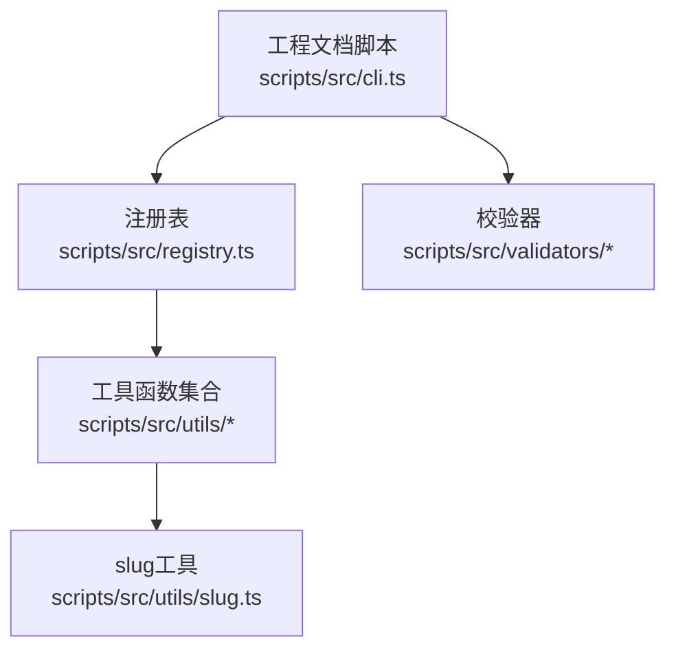
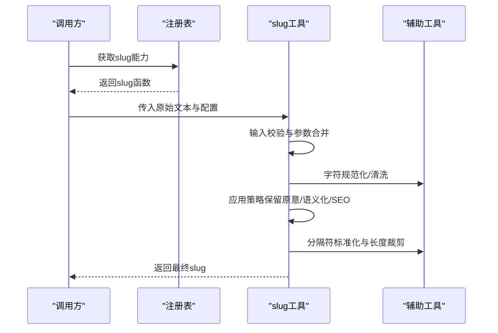
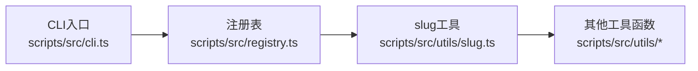

# Slug工具

<cite>
**本文引用的文件**   
- [slug.ts](file://skills/shared/engineering-docs/scripts/src/utils/slug.ts)
</cite>

## 目录
1. [简介](#简介)
2. [项目结构](#项目结构)
3. [核心组件](#核心组件)
4. [架构总览](#架构总览)
5. [详细组件分析](#详细组件分析)
6. [依赖分析](#依赖分析)
7. [性能考虑](#性能考虑)
8. [故障排查指南](#故障排查指南)
9. [结论](#结论)
10. [附录](#附录)

## 简介
本文件为“Slug工具”模块的使用文档，聚焦于将任意文本转换为URL友好的字符串（slug）。内容涵盖：
- 中文转拼音、特殊字符过滤与空格处理规则
- 字符编码处理机制（Unicode支持、ASCII安全转换、多语言字符映射）
- 国际化支持（多语言slug生成、本地化规则与区域设置适配）
- 不同slug生成策略（保留原意、语义化优化、SEO友好）
- API参考（输入验证、配置选项、输出格式）
- 唯一性保证与冲突解决策略
- 批量处理与性能优化技巧

## 项目结构
该仓库包含工程化脚本工具集，其中slug实现位于工程文档脚本的utils目录下。整体结构如下：
- 工程文档脚本入口与注册表
- 工具函数集合（含slug）
- 校验器与CLI工具

图表来源
- [cli.ts](file://skills/shared/engineering-docs/scripts/src/cli.ts)
- [registry.ts](file://skills/shared/engineering-docs/scripts/src/registry.ts)
- [slug.ts](file://skills/shared/engineering-docs/scripts/src/utils/slug.ts)

章节来源
- [slug.ts](file://skills/shared/engineering-docs/scripts/src/utils/slug.ts)
- [cli.ts](file://skills/shared/engineering-docs/scripts/src/cli.ts)
- [registry.ts](file://skills/shared/engineering-docs/scripts/src/registry.ts)

## 核心组件
- slug工具模块提供将自然语言或富文本转换为URL安全片段的能力，包括：
  - 字符规范化与清洗
  - 多语言到ASCII的安全映射
  - 分隔符标准化与长度控制
  - 可选的拼音转换（针对中文等场景）
  - 可插拔的策略与本地化规则

章节来源
- [slug.ts](file://skills/shared/engineering-docs/scripts/src/utils/slug.ts)

## 架构总览
从调用方视角看，slug工具通常被上层逻辑通过统一注册表或直接导入使用；其内部遵循“输入校验 → 预处理 → 策略转换 → 后处理 → 输出”的流水线。

图表来源
- [slug.ts](file://skills/shared/engineering-docs/scripts/src/utils/slug.ts)
- [registry.ts](file://skills/shared/engineering-docs/scripts/src/registry.ts)

## 详细组件分析

### 功能特性与规则
- 中文转拼音
  - 目标：将中文字符映射为可读的拉丁字母序列，便于搜索引擎索引与跨语言访问。
  - 适用场景：文章标题、分类名、标签等需要英文URL的场景。
- 特殊字符过滤
  - 目标：移除或替换对URL不安全的字符（如标点、空白、控制字符等），确保生成的slug在浏览器与服务端均能稳定解析。
- 空格处理规则
  - 目标：将连续空白归一化为单一分隔符，并去除首尾空白，避免空段与冗余分隔符。

章节来源
- [slug.ts](file://skills/shared/engineering-docs/scripts/src/utils/slug.ts)

### 字符编码与国际化
- Unicode支持
  - 以Unicode码点为单位进行规范化，确保组合字符、全半角、上下标等得到正确处理。
- ASCII安全转换
  - 将非ASCII字符映射为ASCII等价或近似形式，必要时回退为占位符或忽略，保证最终结果仅包含URL安全字符。
- 多语言字符映射
  - 针对不同语言提供映射表或规则，例如西里尔文、阿拉伯文、希腊文等的常见等价映射。
- 本地化与区域设置
  - 根据区域设置调整大小写、连字符与下划线偏好、数字与单位符号的处理方式。

章节来源
- [slug.ts](file://skills/shared/engineering-docs/scripts/src/utils/slug.ts)

### 生成策略
- 保留原意
  - 尽量保持原文的可读性与语义，适合用户可见的友好链接。
- 语义化优化
  - 去除停用词、合并同义词、优先保留关键词，提升可读性与检索效果。
- SEO友好
  - 控制长度、限制分隔符、避免歧义字符，提高搜索引擎抓取与展示质量。

章节来源
- [slug.ts](file://skills/shared/engineering-docs/scripts/src/utils/slug.ts)

### API参考
以下为API层面的通用约定（具体字段以源码为准）：
- 函数签名
  - 输入：原始文本（字符串）、配置对象（可选）
  - 输出：slug字符串
- 配置项（示例）
  - locale：区域设置，影响大小写与映射规则
  - strategy：生成策略（保留原意/语义化/SEO）
  - separator：分隔符（如“-”、“_”）
  - max_length：最大长度，超出时按策略裁剪
  - allow_unicode：是否允许保留部分Unicode字符（默认关闭）
  - transliterate：是否启用拼音/音译（默认开启）
- 输入验证
  - 空值与类型检查
  - 非法字符与边界长度校验
  - 配置项白名单与默认值合并
- 输出格式
  - 仅包含小写字母、数字与指定分隔符
  - 无首尾分隔符，无连续重复分隔符
  - 长度受max_length约束

章节来源
- [slug.ts](file://skills/shared/engineering-docs/scripts/src/utils/slug.ts)

### 唯一性与冲突解决
- 唯一性保证
  - 在给定上下文（如命名空间、前缀）内保证唯一，避免重复slug导致路由冲突。
- 冲突解决策略
  - 追加序号后缀（如“-1”、“-2”）
  - 基于时间戳或随机短码去重
  - 结合业务ID进行二次区分
- 建议
  - 对外暴露的slug应持久化存储，避免运行时动态拼接造成不一致

章节来源
- [slug.ts](file://skills/shared/engineering-docs/scripts/src/utils/slug.ts)

### 批量处理与性能优化
- 批量处理
  - 提供批量接口或循环封装，支持并发度控制与错误隔离
- 性能优化
  - 预计算映射表与缓存常用转换结果
  - 流式处理长文本，避免一次性复制大字符串
  - 合理设置max_length以减少后续处理开销
  - 复用正则表达式与分隔符规则实例

章节来源
- [slug.ts](file://skills/shared/engineering-docs/scripts/src/utils/slug.ts)

## 依赖分析
slug工具作为工具函数被上层模块引用，依赖关系清晰且低耦合。

图表来源
- [cli.ts](file://skills/shared/engineering-docs/scripts/src/cli.ts)
- [registry.ts](file://skills/shared/engineering-docs/scripts/src/registry.ts)
- [slug.ts](file://skills/shared/engineering-docs/scripts/src/utils/slug.ts)

章节来源
- [cli.ts](file://skills/shared/engineering-docs/scripts/src/cli.ts)
- [registry.ts](file://skills/shared/engineering-docs/scripts/src/registry.ts)
- [slug.ts](file://skills/shared/engineering-docs/scripts/src/utils/slug.ts)

## 性能考虑
- 避免不必要的字符串拷贝，尽量原地修改或使用视图
- 对高频字符映射采用查表法而非多次正则匹配
- 对超长输入提前截断，减少后续处理成本
- 在批量场景中使用队列与并发上限控制，防止内存峰值过高

[本节为通用指导，无需代码来源]

## 故障排查指南
- 常见问题
  - 生成结果为空：检查输入是否为空或仅包含不可见字符
  - 出现非法字符：确认allow_unicode与transliterate配置是否正确
  - 长度超限：调整max_length或更换更短的strategy
  - 重复slug：启用冲突解决策略或在业务层增加命名空间
- 定位方法
  - 打印中间态（规范化后、映射后、分隔符处理后）
  - 记录locale与strategy组合，复现问题
  - 对异常输入构造最小用例，逐步缩小范围

章节来源
- [slug.ts](file://skills/shared/engineering-docs/scripts/src/utils/slug.ts)

## 结论
Slug工具通过统一的输入校验、灵活的策略与本地化规则，提供了稳定、可配置的URL友好字符串生成能力。配合唯一性保障与批量处理优化，可在多种业务场景中高效落地。

[本节为总结，无需代码来源]

## 附录
- 术语
  - slug：URL友好的短标识符，通常由小写字母、数字与分隔符组成
  - 拼音：将汉字转换为拉丁字母表示的过程
  - 本地化：根据区域设置调整行为与显示
- 最佳实践
  - 对外暴露的slug应持久化，避免运行时变化
  - 在创建资源时即生成slug，并在更新时尽量避免变更
  - 对关键路径添加单元测试，覆盖多语言与边界情况

[本节为补充信息，无需代码来源]