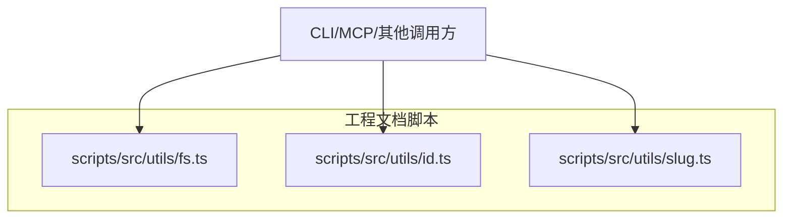
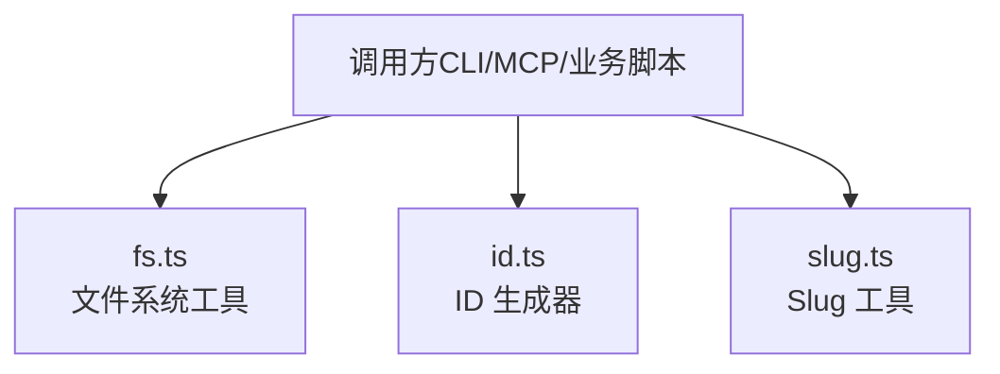
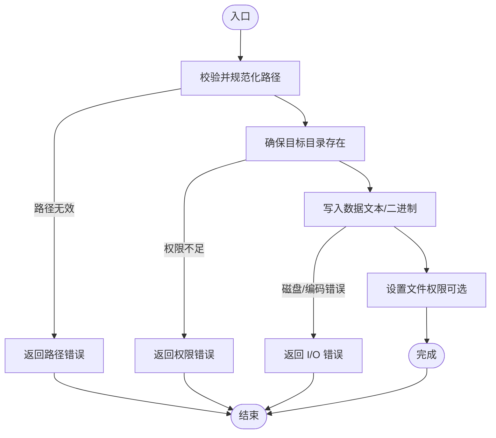
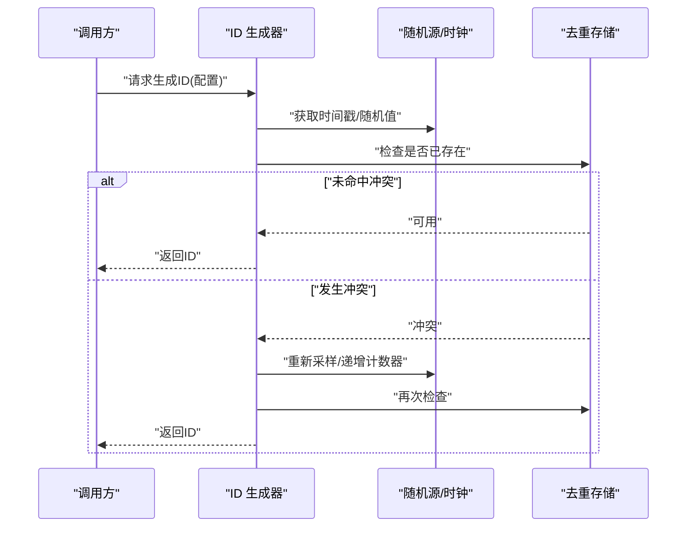
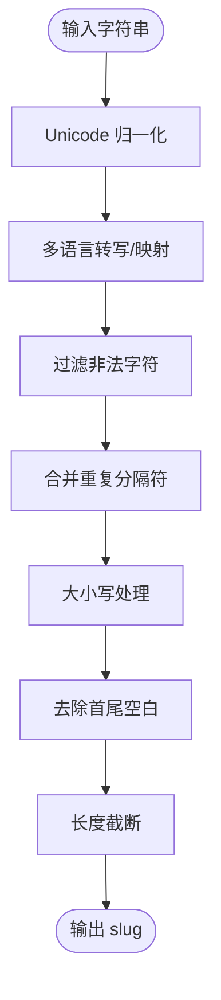
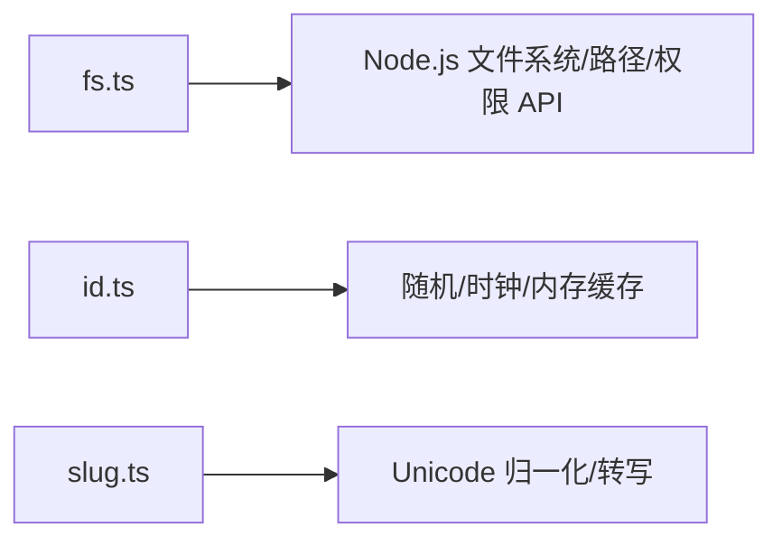

# 工具函数库

<cite>
**本文引用的文件**   
- [fs.ts](file://skills/shared/engineering-docs/scripts/src/utils/fs.ts)
- [id.ts](file://skills/shared/engineering-docs/scripts/src/utils/id.ts)
- [slug.ts](file://skills/shared/engineering-docs/scripts/src/utils/slug.ts)
</cite>

## 目录
1. [简介](#简介)
2. [项目结构](#项目结构)
3. [核心组件](#核心组件)
4. [架构总览](#架构总览)
5. [详细组件分析](#详细组件分析)
6. [依赖关系分析](#依赖关系分析)
7. [性能考虑](#性能考虑)
8. [故障排查指南](#故障排查指南)
9. [结论](#结论)
10. [附录：API 参考](#附录api-参考)

## 简介
本仓库包含一组工程文档脚本工具，聚焦于三类通用能力：
- 文件系统操作：文件读写、目录遍历、路径解析与权限管理
- ID 生成器：唯一标识符生成算法、格式配置与冲突避免策略
- Slug 工具：URL 友好字符串转换、字符编码处理与国际化支持

这些工具以 TypeScript 实现，位于 scripts 子模块的 utils 目录中，便于在 CLI 或 MCP 等上层应用中复用。

## 项目结构
与工具函数库直接相关的源码位于以下路径：
- 文件系统工具：utils/fs.ts
- ID 生成器：utils/id.ts
- Slug 工具：utils/slug.ts

图表来源
- [fs.ts](file://skills/shared/engineering-docs/scripts/src/utils/fs.ts)
- [id.ts](file://skills/shared/engineering-docs/scripts/src/utils/id.ts)
- [slug.ts](file://skills/shared/engineering-docs/scripts/src/utils/slug.ts)

章节来源
- [fs.ts](file://skills/shared/engineering-docs/scripts/src/utils/fs.ts)
- [id.ts](file://skills/shared/engineering-docs/scripts/src/utils/id.ts)
- [slug.ts](file://skills/shared/engineering-docs/scripts/src/utils/slug.ts)

## 核心组件
- 文件系统工具（fs）
  - 职责：封装常用 I/O 操作，提供跨平台一致的路径与权限行为
  - 典型能力：读取/写入文本与二进制、安全地创建目录、递归遍历目录、规范化路径、检查存在性与权限
- ID 生成器（id）
  - 职责：生成全局唯一标识符，支持多种格式与可配置选项
  - 典型能力：基于时间戳+随机数/计数器、短ID压缩、前缀/分隔符配置、碰撞检测与重试
- Slug 工具（slug）
  - 职责：将任意输入转换为 URL 友好的 slug 字符串
  - 典型能力：Unicode 归一化、多语言转写、非法字符过滤、大小写与分隔符统一、长度限制

章节来源
- [fs.ts](file://skills/shared/engineering-docs/scripts/src/utils/fs.ts)
- [id.ts](file://skills/shared/engineering-docs/scripts/src/utils/id.ts)
- [slug.ts](file://skills/shared/engineering-docs/scripts/src/utils/slug.ts)

## 架构总览
三个工具相互独立，遵循“单一职责”原则，通过清晰的函数式 API 暴露能力，便于组合使用。

图表来源
- [fs.ts](file://skills/shared/engineering-docs/scripts/src/utils/fs.ts)
- [id.ts](file://skills/shared/engineering-docs/scripts/src/utils/id.ts)
- [slug.ts](file://skills/shared/engineering-docs/scripts/src/utils/slug.ts)

## 详细组件分析

### 文件系统工具（fs.ts）
- 设计要点
  - 统一错误语义：对不存在、无权限、I/O 失败等场景返回结构化错误信息
  - 路径规范化：自动处理相对/绝对路径、斜杠差异与符号链接
  - 批量能力：提供按模式匹配与并发度控制的目录遍历接口
- 关键流程（示例：安全写入文件）

图表来源
- [fs.ts](file://skills/shared/engineering-docs/scripts/src/utils/fs.ts)

章节来源
- [fs.ts](file://skills/shared/engineering-docs/scripts/src/utils/fs.ts)

### ID 生成器（id.ts）
- 设计要点
  - 唯一性保障：结合时间戳、进程/线程标识、随机数与可选单调计数器
  - 格式可配：支持短ID、UUID、雪花风格等；可配置前缀、分隔符、长度上限
  - 冲突避免：内置去重缓存与重试机制，必要时回退到更长表示
- 关键流程（示例：生成短ID）

图表来源
- [id.ts](file://skills/shared/engineering-docs/scripts/src/utils/id.ts)

章节来源
- [id.ts](file://skills/shared/engineering-docs/scripts/src/utils/id.ts)

### Slug 工具（slug.ts）
- 设计要点
  - 国际化：基于 Unicode 归一化与常见语言的转写规则，保留可读性
  - 健壮性：过滤非法字符、合并重复分隔符、控制长度与首尾空白
  - 可定制：允许自定义映射表、分隔符、大小写策略与最大长度
- 关键流程（示例：中文标题转 slug）

图表来源
- [slug.ts](file://skills/shared/engineering-docs/scripts/src/utils/slug.ts)

章节来源
- [slug.ts](file://skills/shared/engineering-docs/scripts/src/utils/slug.ts)

## 依赖关系分析
三个工具彼此解耦，各自仅依赖标准库或最小第三方库，降低耦合风险。

图表来源
- [fs.ts](file://skills/shared/engineering-docs/scripts/src/utils/fs.ts)
- [id.ts](file://skills/shared/engineering-docs/scripts/src/utils/id.ts)
- [slug.ts](file://skills/shared/engineering-docs/scripts/src/utils/slug.ts)

章节来源
- [fs.ts](file://skills/shared/engineering-docs/scripts/src/utils/fs.ts)
- [id.ts](file://skills/shared/engineering-docs/scripts/src/utils/id.ts)
- [slug.ts](file://skills/shared/engineering-docs/scripts/src/utils/slug.ts)

## 性能考虑
- 文件系统
  - 大文件写入建议分块与流式处理，减少内存峰值
  - 目录遍历可按需分页/限制深度，避免一次性加载全量
  - 批量操作时合理设置并发度，平衡吞吐与系统负载
- ID 生成器
  - 高并发下优先使用带计数器的单调序列，降低冲突概率
  - 去重存储采用哈希索引，保证 O(1) 查询
- Slug 工具
  - 长文本预处理时尽量复用正则与映射表，避免重复构建
  - 批量转换时启用并行，但注意 CPU 密集型任务的限流

[本节为通用指导，不直接分析具体文件]

## 故障排查指南
- 文件系统
  - 常见问题：路径不存在、权限不足、编码不一致、磁盘空间不足
  - 定位方法：捕获并打印结构化错误对象，记录入参路径与模式
  - 修复建议：先 ensureDir，再写入；显式指定编码；检查用户/组权限位
- ID 生成器
  - 常见问题：冲突率异常升高、单调溢出、序列化丢失
  - 定位方法：开启调试日志，记录每次生成的候选值与最终结果
  - 修复建议：增大随机熵源、增加重试上限、持久化单调计数器
- Slug 工具
  - 常见问题：特殊字符丢失、长度被过度截断、不同平台输出不一致
  - 定位方法：对比输入与中间步骤（归一化/转写/过滤）的结果
  - 修复建议：扩展映射表、调整长度阈值、固定 Unicode 版本

章节来源
- [fs.ts](file://skills/shared/engineering-docs/scripts/src/utils/fs.ts)
- [id.ts](file://skills/shared/engineering-docs/scripts/src/utils/id.ts)
- [slug.ts](file://skills/shared/engineering-docs/scripts/src/utils/slug.ts)

## 结论
该工具函数库围绕“文件系统、ID 生成、Slug 转换”三大主题提供稳定、可组合的 API。通过统一的错误语义与可配置项，可在 CLI、MCP 与服务端脚本中高效复用。建议在生产环境结合监控与日志，持续优化并发与资源占用。

[本节为总结性内容，不直接分析具体文件]

## 附录：API 参考

### 文件系统工具（fs.ts）
- 文件读取
  - 参数：路径、编码/类型、选项（如是否追加元信息）
  - 返回：文件内容（文本/二进制）或错误对象
  - 示例：读取配置文件、读取图片二进制
- 文件写入
  - 参数：路径、内容、编码/类型、权限掩码、是否原子写入
  - 返回：成功标志或错误对象
  - 示例：生成报告、备份快照
- 目录遍历
  - 参数：根路径、匹配模式、深度限制、并发度
  - 返回：文件/目录列表或错误对象
  - 示例：扫描模板目录、收集变更清单
- 路径解析
  - 参数：原始路径、基准目录
  - 返回：规范化后的绝对路径
  - 示例：拼接资源路径、校验相对路径合法性
- 权限管理
  - 参数：路径、权限位、所有者/组（平台相关）
  - 返回：成功标志或错误对象
  - 示例：设置只读、回收临时文件权限

章节来源
- [fs.ts](file://skills/shared/engineering-docs/scripts/src/utils/fs.ts)

### ID 生成器（id.ts）
- 生成短ID
  - 参数：前缀、长度、基数、去重策略
  - 返回：短ID 或错误对象
  - 示例：任务编号、会话标识
- 生成 UUID
  - 参数：版本、命名空间（可选）
  - 返回：UUID 字符串
  - 示例：分布式主键、事件追踪
- 生成雪花风格ID
  - 参数：机器ID、数据中心ID、时间偏移
  - 返回：数值型ID
  - 示例：数据库自增替代、消息队列路由键
- 冲突避免
  - 策略：去重缓存、单调递增、指数退避重试
  - 配置：最大重试次数、冲突阈值、回退方案

章节来源
- [id.ts](file://skills/shared/engineering-docs/scripts/src/utils/id.ts)

### Slug 工具（slug.ts）
- 基础转换
  - 参数：输入字符串、分隔符、大小写策略
  - 返回：slug 字符串
  - 示例：文章标题转 URL 片段
- 国际化支持
  - 参数：目标语言映射、Unicode 版本
  - 返回：slug 字符串
  - 示例：中日韩文转拼音/罗马音
- 高级选项
  - 参数：最大长度、白名单字符集、自定义映射表
  - 返回：slug 字符串
  - 示例：企业内网标签、SEO 友好别名

章节来源
- [slug.ts](file://skills/shared/engineering-docs/scripts/src/utils/slug.ts)

### 组合使用模式与批量处理技巧
- 组合模式
  - “Slug + 路径”：用 slug 作为文件名或目录名，配合 fs 写入
  - “ID + 文件”：以 ID 命名产物，便于溯源与去重
  - “遍历 + 生成”：批量扫描目录，为每个条目生成 ID 并落盘
- 批量处理
  - 使用目录遍历接口获取待处理集合
  - 对每条记录执行“slug 转换 → ID 生成 → 文件写入”流水线
  - 控制并发度与重试策略，记录失败项以便后续补偿

章节来源
- [fs.ts](file://skills/shared/engineering-docs/scripts/src/utils/fs.ts)
- [id.ts](file://skills/shared/engineering-docs/scripts/src/utils/id.ts)
- [slug.ts](file://skills/shared/engineering-docs/scripts/src/utils/slug.ts)