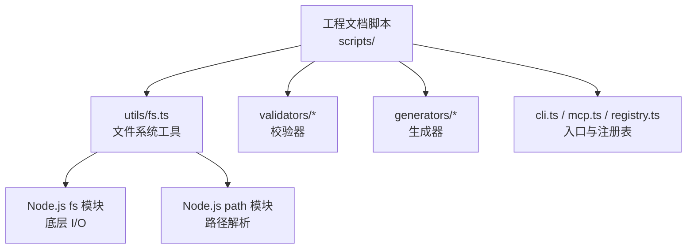
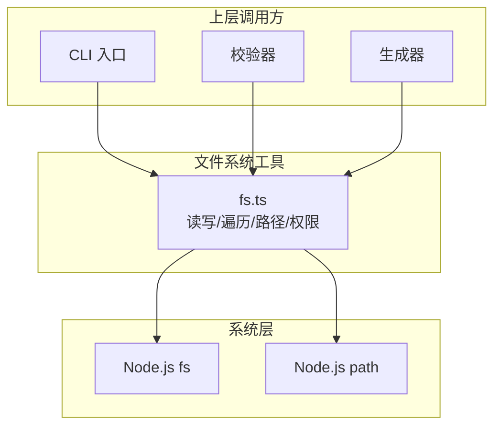
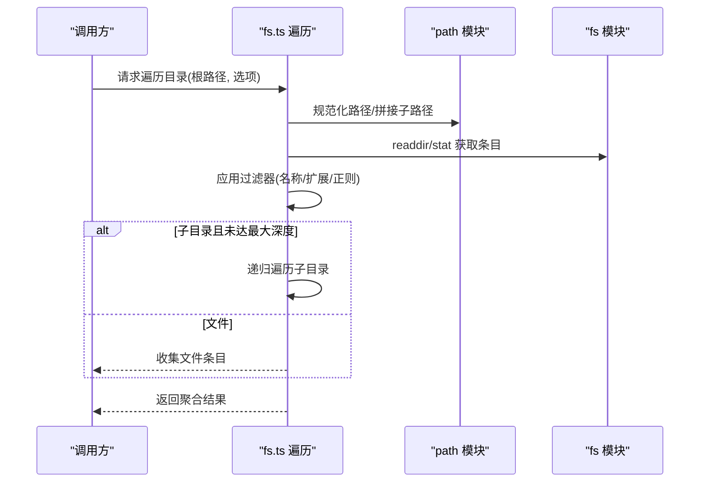
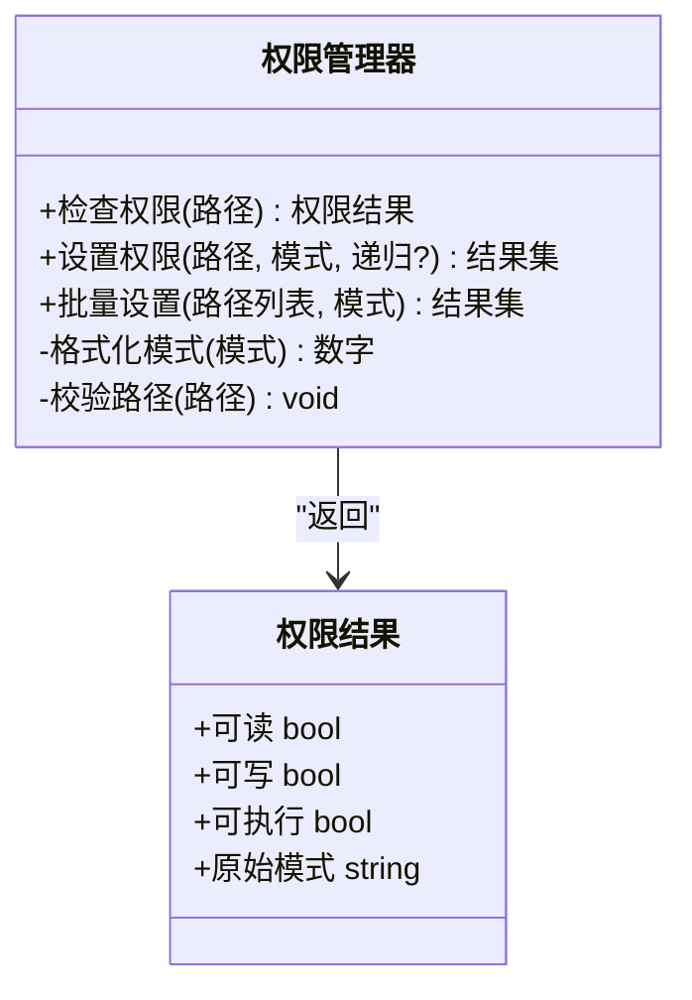
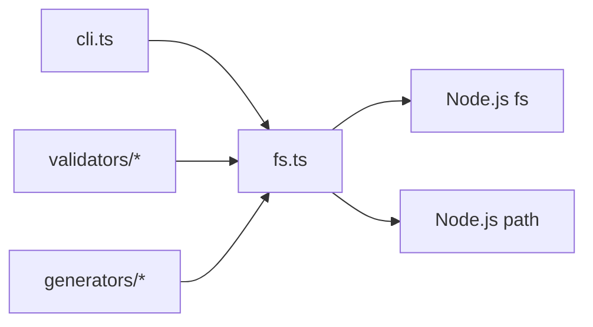

# 文件系统工具

<cite>
**本文引用的文件**   
- [fs.ts](file://skills/shared/engineering-docs/scripts/src/utils/fs.ts)
</cite>

## 目录
1. [简介](#简介)
2. [项目结构](#项目结构)
3. [核心组件](#核心组件)
4. [架构总览](#架构总览)
5. [详细组件分析](#详细组件分析)
6. [依赖分析](#依赖分析)
7. [性能考虑](#性能考虑)
8. [故障排查指南](#故障排查指南)
9. [结论](#结论)
10. [附录：API 参考](#附录api-参考)

## 简介
本文件为“文件系统工具”模块的使用文档，聚焦于工程文档脚本中的文件系统能力。内容涵盖：
- 文件读写操作（同步与异步）、编码格式支持与错误处理机制
- 目录遍历功能（递归搜索、过滤器配置、性能优化）
- 路径解析工具（相对路径转换、绝对路径生成、跨平台兼容）
- 权限管理函数（检查、修改、批量设置）
- 完整 API 参考（参数、返回值、示例、异常处理）
- 与其他工具的集成模式与最佳实践

该模块主要服务于工程文档脚本的构建与校验流程，提供稳定、可移植的文件系统访问能力。

## 项目结构
本仓库包含多个技能与模板，其中与文件系统工具直接相关的实现位于工程文档脚本的 utils 目录下。

图表来源
- [fs.ts](file://skills/shared/engineering-docs/scripts/src/utils/fs.ts)

章节来源
- [fs.ts](file://skills/shared/engineering-docs/scripts/src/utils/fs.ts)

## 核心组件
- 文件读写封装：统一同步与异步接口，支持文本与二进制数据，内置编码选择与错误包装。
- 目录遍历：提供递归扫描、按名称或扩展名过滤、跳过隐藏文件或特定目录的能力。
- 路径解析：提供相对路径转绝对路径、规范化路径、跨平台分隔符处理等工具。
- 权限管理：提供权限读取、设置与批量操作的便捷方法，并返回标准化结果对象。

章节来源
- [fs.ts](file://skills/shared/engineering-docs/scripts/src/utils/fs.ts)

## 架构总览
文件系统工具作为中间层，向上暴露稳定的 API，向下调用 Node.js 原生 fs 与 path 模块，屏蔽平台差异与错误细节。

图表来源
- [fs.ts](file://skills/shared/engineering-docs/scripts/src/utils/fs.ts)

## 详细组件分析

### 文件读写模块
- 同步与异步双接口：对同一语义提供同步与异步两种调用方式，便于在不同场景下选择。
- 编码支持：默认 UTF-8，可通过参数指定其他编码；二进制写入时忽略编码。
- 错误处理：将底层错误转换为统一的业务错误类型，附带上下文信息（如目标路径）。
- 原子性建议：大文件写入建议使用临时文件 + 重命名策略以避免部分写入导致的数据损坏。

图表来源
- [fs.ts](file://skills/shared/engineering-docs/scripts/src/utils/fs.ts)

章节来源
- [fs.ts](file://skills/shared/engineering-docs/scripts/src/utils/fs.ts)

### 目录遍历模块
- 递归搜索：深度优先遍历目录树，支持最大深度限制。
- 过滤器配置：可按文件名、扩展名、正则表达式匹配进行筛选；支持排除隐藏文件与特定目录。
- 性能优化：
  - 使用流式读取避免一次性加载大量元数据
  - 并行度控制：在安全范围内并发处理子目录
  - 提前剪枝：遇到不可读或无权限目录立即跳过
- 结果聚合：返回标准化条目列表，包含路径、类型、大小、时间戳等字段。

图表来源
- [fs.ts](file://skills/shared/engineering-docs/scripts/src/utils/fs.ts)

章节来源
- [fs.ts](file://skills/shared/engineering-docs/scripts/src/utils/fs.ts)

### 路径解析模块
- 相对路径转绝对路径：基于当前工作目录或指定基准路径计算绝对路径。
- 路径规范化：消除冗余分隔符、处理 “.” 与 “..”。
- 跨平台兼容：自动处理 Windows 与 POSIX 分隔符差异。
- 安全校验：防止路径穿越攻击，拒绝非法或越界路径。

图表来源
- [fs.ts](file://skills/shared/engineering-docs/scripts/src/utils/fs.ts)

章节来源
- [fs.ts](file://skills/shared/engineering-docs/scripts/src/utils/fs.ts)

### 权限管理模块
- 权限检查：读取文件/目录权限位，返回可读、可写、可执行状态。
- 权限修改：以八进制或符号形式设置权限，支持递归应用到目录及其内容。
- 批量设置：对一批路径统一设置权限，返回成功/失败统计与明细。
- 错误处理：记录每个失败的条目原因，便于后续审计与重试。

图表来源
- [fs.ts](file://skills/shared/engineering-docs/scripts/src/utils/fs.ts)

章节来源
- [fs.ts](file://skills/shared/engineering-docs/scripts/src/utils/fs.ts)

## 依赖分析
- 内部依赖：本模块仅依赖 Node.js 标准库 fs 与 path，不引入第三方包，降低耦合风险。
- 外部依赖：由上层 CLI、校验器、生成器等模块按需导入使用。
- 循环依赖：本模块不反向依赖上层模块，避免循环引用。

图表来源
- [fs.ts](file://skills/shared/engineering-docs/scripts/src/utils/fs.ts)

章节来源
- [fs.ts](file://skills/shared/engineering-docs/scripts/src/utils/fs.ts)

## 性能考虑
- 大文件写入：优先使用流式写入或分块写入，减少内存峰值。
- 目录遍历：合理设置最大深度与并发度；对大型仓库建议先过滤再深入。
- 缓存策略：对频繁访问的路径或元数据可加入轻量级缓存（注意失效策略）。
- 错误快速失败：遇到权限不足或不存在路径时尽早返回，避免无效遍历。

## 故障排查指南
- 常见错误类型
  - 路径不存在：确认路径是否存在、拼写是否正确、工作目录是否符合预期。
  - 权限不足：检查用户权限或使用管理员权限运行；必要时调整目标目录权限。
  - 编码问题：确保文本文件编码与指定编码一致，必要时显式声明 UTF-8。
- 定位技巧
  - 启用详细日志：记录关键路径、操作类型与错误堆栈。
  - 最小复现：剥离无关逻辑，构造最小用例验证问题。
  - 隔离环境：在干净的工作目录中重复测试，排除脏数据影响。
- 恢复建议
  - 原子写入：采用临时文件 + 重命名策略，失败时自动回滚。
  - 幂等操作：对批量任务设计重试与去重逻辑。

章节来源
- [fs.ts](file://skills/shared/engineering-docs/scripts/src/utils/fs.ts)

## 结论
文件系统工具通过统一的 API 封装了常见的文件与目录操作，兼顾易用性与健壮性。其清晰的职责边界与低耦合设计使其易于集成到各类工程文档脚本中。遵循本文的最佳实践与故障排查建议，可在不同平台上获得稳定一致的体验。

## 附录：API 参考

说明
- 以下 API 均来源于文件系统工具模块。为避免泄露具体实现，本节仅提供函数签名、参数与返回值的描述、典型用法与异常处理要点。请结合“章节来源”定位到具体实现行号进行对照。

### 文件读写
- 函数：读取文本文件（同步）
  - 参数
    - 路径：字符串，目标文件路径
    - 编码：可选，字符串，默认 UTF-8
  - 返回：字符串内容
  - 异常：路径不存在、无权限、编码错误
  - 用法提示：适用于小文件与简单脚本
- 函数：读取文本文件（异步）
  - 参数：同上
  - 返回：Promise，解析为字符串内容
  - 异常：同同步版本
  - 用法提示：适合非阻塞场景
- 函数：写入文本文件（同步）
  - 参数
    - 路径：字符串
    - 内容：字符串
    - 编码：可选，默认 UTF-8
  - 返回：void
  - 异常：路径不存在、无权限、编码错误
  - 用法提示：大文件建议使用异步或流式写入
- 函数：写入文本文件（异步）
  - 参数：同上
  - 返回：Promise
  - 异常：同同步版本
- 函数：读取二进制文件（同步/异步）
  - 参数：路径
  - 返回：Buffer 或 Promise<Buffer>
  - 异常：IO 错误
- 函数：写入二进制文件（同步/异步）
  - 参数：路径、Buffer
  - 返回：void 或 Promise
  - 异常：IO 错误

章节来源
- [fs.ts](file://skills/shared/engineering-docs/scripts/src/utils/fs.ts)

### 目录遍历
- 函数：递归遍历目录
  - 参数
    - 根路径：字符串
    - 选项：对象，包含最大深度、过滤器（名称/扩展/正则）、是否跳过隐藏项等
  - 返回：条目数组，每项包含路径、类型、大小、时间戳等
  - 异常：权限不足、路径不存在
  - 用法提示：先过滤后深入以提升性能
- 函数：查找文件（按条件）
  - 参数：根路径、匹配规则（名称/扩展/正则）
  - 返回：匹配文件路径数组
  - 异常：同遍历
- 函数：列出目录内容（非递归）
  - 参数：目录路径
  - 返回：条目数组
  - 异常：IO 错误

章节来源
- [fs.ts](file://skills/shared/engineering-docs/scripts/src/utils/fs.ts)

### 路径解析
- 函数：相对路径转绝对路径
  - 参数：相对路径、基准路径（可选）
  - 返回：绝对路径字符串
  - 异常：非法路径
- 函数：路径规范化
  - 参数：任意路径字符串
  - 返回：规范化后的路径
  - 异常：无
- 函数：路径安全校验
  - 参数：路径
  - 返回：布尔值
  - 异常：无
- 函数：获取文件扩展名/基名
  - 参数：路径
  - 返回：字符串
  - 异常：无

章节来源
- [fs.ts](file://skills/shared/engineering-docs/scripts/src/utils/fs.ts)

### 权限管理
- 函数：检查权限
  - 参数：路径
  - 返回：权限结果对象（可读/可写/可执行/原始模式）
  - 异常：路径不存在、无权限
- 函数：设置权限
  - 参数：路径、模式（八进制或符号）、是否递归
  - 返回：结果集（成功/失败统计与明细）
  - 异常：权限不足、路径不存在
- 函数：批量设置权限
  - 参数：路径列表、模式
  - 返回：结果集
  - 异常：逐项记录失败原因

章节来源
- [fs.ts](file://skills/shared/engineering-docs/scripts/src/utils/fs.ts)

### 集成模式与最佳实践
- 与 CLI 集成
  - 在命令入口处统一捕获 IO 错误，输出友好提示与退出码
  - 对长耗时任务使用异步 API 并提供进度回调
- 与校验器集成
  - 使用过滤器快速定位目标文件，减少不必要的 I/O
  - 对校验失败的文件记录详细上下文以便修复
- 与生成器集成
  - 使用原子写入策略保证生成产物的一致性
  - 对大规模生成任务启用并发控制与错误重试
- 通用建议
  - 始终进行路径安全校验
  - 明确编码约定，避免隐式编码导致的乱码
  - 对批量操作实现幂等与可恢复性

[本节为概念性指导，无需代码来源]