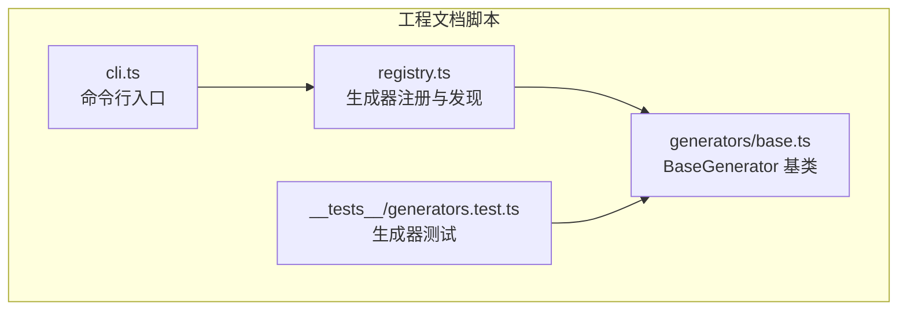
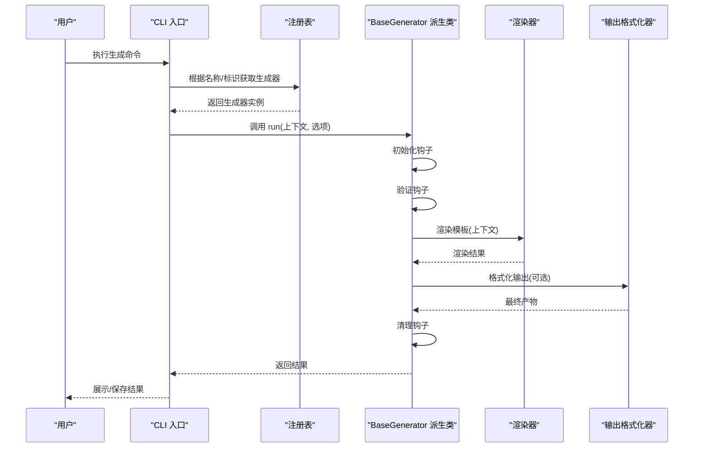
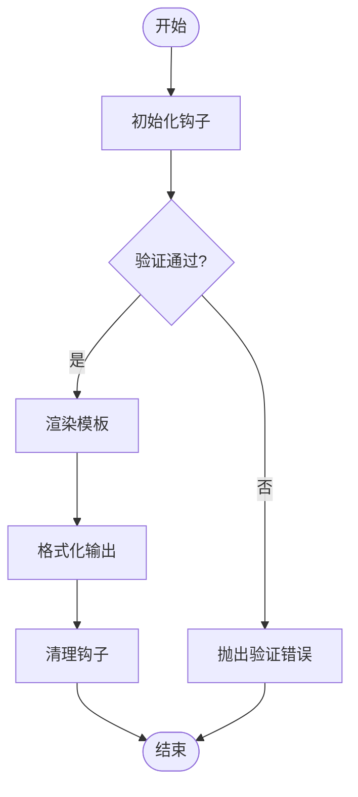
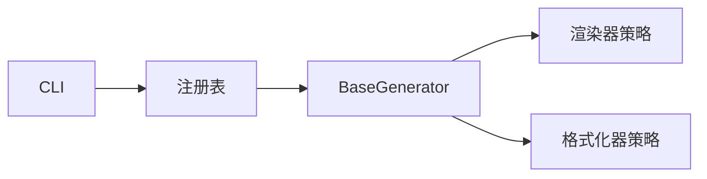

# 生成器基类

<cite>
**本文引用的文件**   
- [base.ts](file://skills/shared/engineering-docs/scripts/src/generators/base.ts)
- [generators.test.ts](file://skills/shared/engineering-docs/scripts/src/__tests__/generators.test.ts)
- [cli.ts](file://skills/shared/engineering-docs/scripts/src/cli.ts)
- [registry.ts](file://skills/shared/engineering-docs/scripts/src/registry.ts)
</cite>

## 目录
1. [简介](#简介)
2. [项目结构](#项目结构)
3. [核心组件](#核心组件)
4. [架构总览](#架构总览)
5. [详细组件分析](#详细组件分析)
6. [依赖关系分析](#依赖关系分析)
7. [性能考虑](#性能考虑)
8. [故障排查指南](#故障排查指南)
9. [结论](#结论)
10. [附录](#附录)

## 简介
本文件面向需要扩展或自定义文档生成器的开发者，围绕生成器基类 BaseGenerator 的设计模式与核心能力进行系统化说明。内容涵盖模板渲染引擎、数据绑定机制、输出格式化策略；继承与重写方法（如 render）；生命周期钩子（初始化、验证、清理）；错误处理与调试技巧；以及性能优化建议与最佳实践。读者可据此快速构建符合工程规范的自定义生成器类型。

## 项目结构
本项目采用“脚本工具 + 技能模板”的组织方式，生成器相关代码位于 engineering-docs/scripts 目录下：
- 生成器基类与通用逻辑集中在 generators/base.ts
- 单元测试覆盖生成器行为与边界条件，位于 __tests__/generators.test.ts
- CLI 入口负责命令解析与调度，位于 cli.ts
- 注册表用于发现与加载生成器实现，位于 registry.ts

图表来源
- [cli.ts](file://skills/shared/engineering-docs/scripts/src/cli.ts)
- [registry.ts](file://skills/shared/engineering-docs/scripts/src/registry.ts)
- [base.ts](file://skills/shared/engineering-docs/scripts/src/generators/base.ts)
- [generators.test.ts](file://skills/shared/engineering-docs/scripts/src/__tests__/generators.test.ts)

章节来源
- [base.ts](file://skills/shared/engineering-docs/scripts/src/generators/base.ts)
- [generators.test.ts](file://skills/shared/engineering-docs/scripts/src/__tests__/generators.test.ts)
- [cli.ts](file://skills/shared/engineering-docs/scripts/src/cli.ts)
- [registry.ts](file://skills/shared/engineering-docs/scripts/src/registry.ts)

## 核心组件
- BaseGenerator 基类
  - 提供统一的生成器抽象：上下文装配、模板渲染、结果校验、输出格式化、生命周期钩子等。
  - 通过可插拔的渲染器与格式化器，支持多种模板语言与输出目标。
  - 暴露标准化的生命周期钩子，便于在初始化、验证、清理阶段注入自定义逻辑。
- 生成器注册表
  - 集中管理生成器实例的创建、查找与执行，屏蔽具体实现差异。
- CLI 集成
  - 将用户命令映射到具体生成器，并传递参数与上下文。
- 测试套件
  - 对基类行为与关键路径进行断言，确保扩展稳定性。

章节来源
- [base.ts](file://skills/shared/engineering-docs/scripts/src/generators/base.ts)
- [registry.ts](file://skills/shared/engineering-docs/scripts/src/registry.ts)
- [cli.ts](file://skills/shared/engineering-docs/scripts/src/cli.ts)
- [generators.test.ts](file://skills/shared/engineering-docs/scripts/src/__tests__/generators.test.ts)

## 架构总览
下图展示了从 CLI 调用到生成器执行的端到端流程，包括注册表分发、基类生命周期与渲染输出。

图表来源
- [cli.ts](file://skills/shared/engineering-docs/scripts/src/cli.ts)
- [registry.ts](file://skills/shared/engineering-docs/scripts/src/registry.ts)
- [base.ts](file://skills/shared/engineering-docs/scripts/src/generators/base.ts)

## 详细组件分析

### BaseGenerator 基类设计
- 设计模式
  - 模板方法模式：定义生成流程骨架（初始化→验证→渲染→格式化→清理），子类仅定制关键步骤。
  - 策略模式：渲染器与格式化器作为策略注入，便于替换不同实现。
  - 工厂/注册表模式：由注册表统一创建与获取生成器实例。
- 核心职责
  - 上下文装配：合并默认配置、环境变量与用户输入。
  - 模板渲染：调用渲染器将上下文转换为中间表示或直接文本。
  - 输出格式化：按目标格式（如 Markdown、JSON、YAML 等）进行二次加工。
  - 生命周期钩子：提供可扩展点，供子类注入前置校验、后置处理与资源清理。
- 关键接口约定（概念性描述）
  - 初始化钩子：用于准备资源、加载配置、建立连接等。
  - 验证钩子：用于校验上下文完整性、参数合法性与依赖可用性。
  - 渲染方法：由子类重写，实现具体模板渲染逻辑。
  - 清理钩子：释放资源、关闭连接、清理临时文件等。

章节来源
- [base.ts](file://skills/shared/engineering-docs/scripts/src/generators/base.ts)

#### 类图（基于实际源码的结构化示意）

```mermaid
classDiagram
class BaseGenerator {
+initialize() void
+validate(context) void
+render(context) any
+format(result) string
+cleanup() void
+run(context, options) any
}
class CustomGenerator {
+render(context) any
+validate(context) void
+cleanup() void
}
class Registry {
+register(name, generator) void
+get(name) BaseGenerator
+execute(name, context, options) any
}
class CLI {
+parse(args) any
+dispatch(command, args) any
}
CustomGenerator --|> BaseGenerator : "继承"
Registry --> BaseGenerator : "管理实例"
CLI --> Registry : "调用"
```

图表来源
- [base.ts](file://skills/shared/engineering-docs/scripts/src/generators/base.ts)
- [registry.ts](file://skills/shared/engineering-docs/scripts/src/registry.ts)
- [cli.ts](file://skills/shared/engineering-docs/scripts/src/cli.ts)

### 模板渲染引擎与数据绑定
- 渲染引擎
  - 通过渲染器策略将上下文数据绑定到模板，支持变量插值、循环、条件分支等常见能力。
  - 渲染器可被替换为不同实现，以适配多模板语言或后端服务。
- 数据绑定机制
  - 上下文对象作为唯一数据源，包含模板所需的所有字段与嵌套结构。
  - 支持默认值合并、缺失字段回退与类型转换，保证渲染稳定性。
- 输出格式化策略
  - 在渲染后对结果进行二次加工，如缩进、编码、头部元信息添加等。
  - 可根据目标输出格式选择不同格式化器。

章节来源
- [base.ts](file://skills/shared/engineering-docs/scripts/src/generators/base.ts)

### 继承与扩展：如何创建自定义生成器
- 继承基类
  - 新建一个类继承 BaseGenerator，按需重写以下方法：
    - render：实现具体的模板渲染逻辑。
    - validate：补充业务特定的上下文校验规则。
    - cleanup：释放特定资源或执行收尾工作。
- 注册与使用
  - 将自定义生成器注册到注册表中，以便 CLI 或其他模块通过名称获取与执行。
- 示例指引（不展示代码内容）
  - 参考测试用例中对生成器行为的断言与用法，了解上下文结构与返回值约定。
  - 参考注册表的使用方式，完成自定义生成器的注册与调用。

章节来源
- [base.ts](file://skills/shared/engineering-docs/scripts/src/generators/base.ts)
- [registry.ts](file://skills/shared/engineering-docs/scripts/src/registry.ts)
- [generators.test.ts](file://skills/shared/engineering-docs/scripts/src/__tests__/generators.test.ts)

### 生命周期钩子详解
- 初始化阶段
  - 用途：加载配置、预热缓存、建立外部依赖连接。
  - 异常处理：若初始化失败，应抛出明确错误，阻止后续流程。
- 验证阶段
  - 用途：校验上下文必填项、数据类型、取值范围与业务约束。
  - 异常处理：对非法输入给出清晰的错误消息，便于定位问题。
- 渲染阶段
  - 用途：子类重写，将上下文绑定到模板并产出中间结果。
  - 异常处理：捕获模板解析与渲染过程中的异常，包装为统一错误类型。
- 清理阶段
  - 用途：关闭连接、删除临时文件、释放内存占用。
  - 异常处理：即使清理失败也不应影响主流程结果，但需记录日志。

图表来源
- [base.ts](file://skills/shared/engineering-docs/scripts/src/generators/base.ts)

章节来源
- [base.ts](file://skills/shared/engineering-docs/scripts/src/generators/base.ts)

### 错误处理机制与调试技巧
- 错误分类
  - 配置错误：缺少必要配置或配置值非法。
  - 上下文错误：上下文数据不完整或类型不符。
  - 渲染错误：模板语法错误或渲染器不可用。
  - 输出错误：格式化失败或写入目标不可写。
- 处理策略
  - 在验证阶段尽早失败，避免无效计算。
  - 在渲染阶段捕获并包装异常，附带上下文快照以便复现。
  - 在清理阶段确保幂等与健壮性，防止资源泄漏。
- 调试技巧
  - 启用详细日志，记录关键阶段的输入输出摘要。
  - 在测试中模拟渲染器与格式化器，隔离外部依赖。
  - 使用最小上下文复现问题，逐步缩小范围。

章节来源
- [base.ts](file://skills/shared/engineering-docs/scripts/src/generators/base.ts)
- [generators.test.ts](file://skills/shared/engineering-docs/scripts/src/__tests__/generators.test.ts)

## 依赖关系分析
- 组件耦合
  - CLI 依赖注册表，注册表依赖生成器基类与具体实现。
  - 生成器基类依赖渲染器与格式化器策略，保持松耦合。
- 外部依赖
  - 文件系统、网络请求、模板库等通过策略注入，便于替换与测试。
- 潜在循环依赖
  - 通过注册表解耦 CLI 与具体生成器，避免直接相互引用。

图表来源
- [cli.ts](file://skills/shared/engineering-docs/scripts/src/cli.ts)
- [registry.ts](file://skills/shared/engineering-docs/scripts/src/registry.ts)
- [base.ts](file://skills/shared/engineering-docs/scripts/src/generators/base.ts)

章节来源
- [cli.ts](file://skills/shared/engineering-docs/scripts/src/cli.ts)
- [registry.ts](file://skills/shared/engineering-docs/scripts/src/registry.ts)
- [base.ts](file://skills/shared/engineering-docs/scripts/src/generators/base.ts)

## 性能考虑
- 渲染优化
  - 复用渲染器实例，避免重复初始化。
  - 对大模板进行分块渲染与流式输出，降低峰值内存。
- 上下文优化
  - 延迟加载大型上下文字段，按需填充。
  - 缓存常用模板解析结果，减少重复开销。
- I/O 优化
  - 批量写入输出文件，减少系统调用次数。
  - 使用缓冲与压缩策略，提升磁盘与网络传输效率。
- 并发控制
  - 对独立任务进行有限并发处理，避免资源争用。
  - 合理设置超时与重试策略，提高鲁棒性。

[本节为通用性能指导，无需列出具体文件来源]

## 故障排查指南
- 常见问题
  - 模板变量未定义：检查上下文是否完整，确认默认值与回退逻辑。
  - 渲染器不可用：确认渲染器已正确注入且版本兼容。
  - 输出格式异常：检查格式化器配置与目标编码。
- 定位步骤
  - 开启详细日志，查看各阶段输入输出摘要。
  - 使用最小上下文复现问题，逐步增加复杂度。
  - 在测试中替换渲染器与格式化器，隔离外部依赖。
- 恢复措施
  - 修正上下文数据或模板语法。
  - 更新或降级渲染器/格式化器版本。
  - 调整资源配置与并发限制。

章节来源
- [base.ts](file://skills/shared/engineering-docs/scripts/src/generators/base.ts)
- [generators.test.ts](file://skills/shared/engineering-docs/scripts/src/__tests__/generators.test.ts)

## 结论
BaseGenerator 通过模板方法与策略模式，提供了稳定、可扩展的生成器框架。借助生命周期钩子与注册表机制，开发者可以便捷地实现自定义生成器，并在初始化、验证、渲染、清理等阶段注入业务逻辑。遵循本文的最佳实践与性能建议，可显著提升生成器的可维护性与运行效率。

[本节为总结性内容，无需列出具体文件来源]

## 附录
- 快速上手清单
  - 继承 BaseGenerator 并重写 render、validate、cleanup。
  - 将自定义生成器注册到注册表。
  - 通过 CLI 或 API 调用生成器，传入上下文与选项。
  - 编写单元测试覆盖关键路径与异常场景。
- 参考实现与测试
  - 参考测试用例中的用法与断言，理解上下文结构与返回值约定。
  - 参考注册表的使用方式，完成自定义生成器的注册与调用。

章节来源
- [base.ts](file://skills/shared/engineering-docs/scripts/src/generators/base.ts)
- [registry.ts](file://skills/shared/engineering-docs/scripts/src/registry.ts)
- [generators.test.ts](file://skills/shared/engineering-docs/scripts/src/__tests__/generators.test.ts)