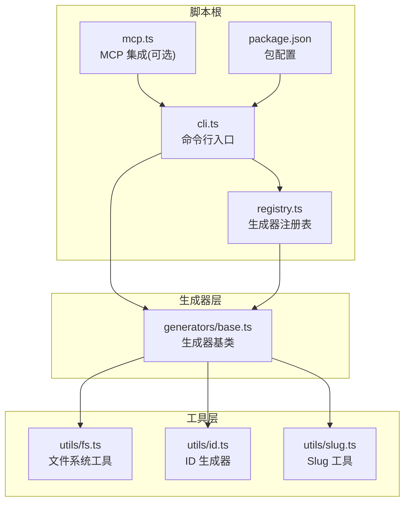
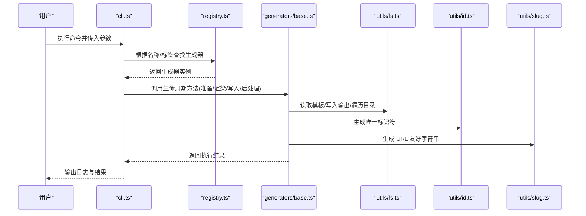
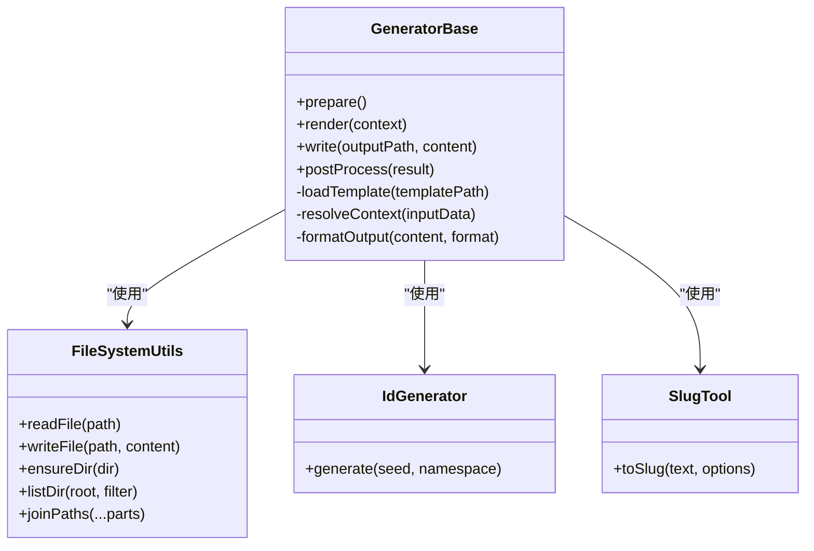
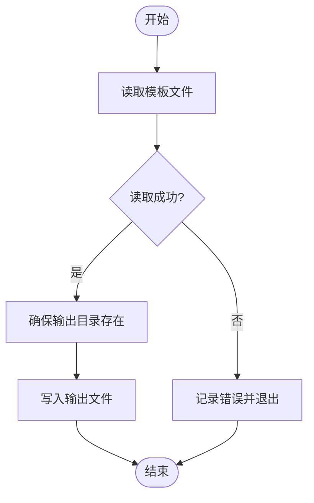
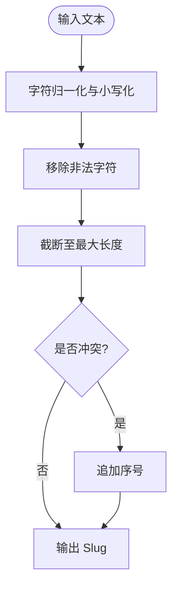
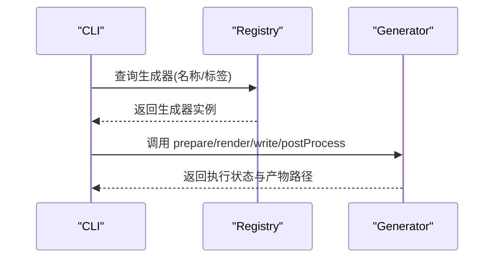
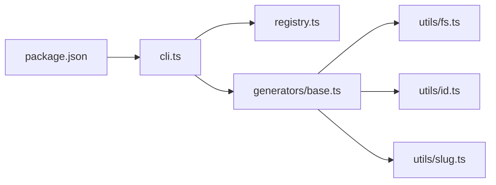

# 生成器框架

<cite>
**本文引用的文件**   
- [base.ts](file://skills/shared/engineering-docs/scripts/src/generators/base.ts)
- [fs.ts](file://skills/shared/engineering-docs/scripts/src/utils/fs.ts)
- [id.ts](file://skills/shared/engineering-docs/scripts/src/utils/id.ts)
- [slug.ts](file://skills/shared/engineering-docs/scripts/src/utils/slug.ts)
- [cli.ts](file://skills/shared/engineering-docs/scripts/src/cli.ts)
- [registry.ts](file://skills/shared/engineering-docs/scripts/src/registry.ts)
- [mcp.ts](file://skills/shared/engineering-docs/scripts/src/mcp.ts)
- [package.json](file://skills/shared/engineering-docs/scripts/package.json)
</cite>

## 目录
1. [简介](#简介)
2. [项目结构](#项目结构)
3. [核心组件](#核心组件)
4. [架构总览](#架构总览)
5. [详细组件分析](#详细组件分析)
6. [依赖关系分析](#依赖关系分析)
7. [性能考虑](#性能考虑)
8. [故障排查指南](#故障排查指南)
9. [结论](#结论)
10. [附录](#附录)

## 简介
本文件面向“工程文档脚本”子项目中的生成器框架，提供从基类设计、模板渲染与数据绑定、输出格式化，到文件系统工具集、ID 生成器与 slug 工具的完整开发文档。同时给出自定义生成器的实现指南、批量处理模式与性能优化建议，帮助开发者快速构建特定类型的文档生成器。

## 项目结构
该生成器框架位于 skills/shared/engineering-docs/scripts 目录下，采用 TypeScript 实现，主要模块包括：
- 生成器基类与扩展点：定义统一的生成流程、模板加载与渲染、数据绑定与输出路径策略
- 工具集：文件系统读写、路径操作、目录遍历；唯一标识符生成；URL 友好字符串转换
- 运行时入口：CLI 命令解析与执行、MCP 集成（可选）
- 注册表：生成器类型与实现的注册与发现机制
- 包配置：依赖与脚本入口

图表来源
- [cli.ts:1-200](file://skills/shared/engineering-docs/scripts/src/cli.ts#L1-L200)
- [registry.ts:1-200](file://skills/shared/engineering-docs/scripts/src/registry.ts#L1-L200)
- [base.ts:1-200](file://skills/shared/engineering-docs/scripts/src/generators/base.ts#L1-L200)
- [fs.ts:1-200](file://skills/shared/engineering-docs/scripts/src/utils/fs.ts#L1-L200)
- [id.ts:1-200](file://skills/shared/engineering-docs/scripts/src/utils/id.ts#L1-L200)
- [slug.ts:1-200](file://skills/shared/engineering-docs/scripts/src/utils/slug.ts#L1-L200)
- [mcp.ts:1-200](file://skills/shared/engineering-docs/scripts/src/mcp.ts#L1-L200)
- [package.json:1-200](file://skills/shared/engineering-docs/scripts/package.json#L1-L200)

章节来源
- [cli.ts:1-200](file://skills/shared/engineering-docs/scripts/src/cli.ts#L1-L200)
- [registry.ts:1-200](file://skills/shared/engineering-docs/scripts/src/registry.ts#L1-L200)
- [base.ts:1-200](file://skills/shared/engineering-docs/scripts/src/generators/base.ts#L1-L200)
- [fs.ts:1-200](file://skills/shared/engineering-docs/scripts/src/utils/fs.ts#L1-L200)
- [id.ts:1-200](file://skills/shared/engineering-docs/scripts/src/utils/id.ts#L1-L200)
- [slug.ts:1-200](file://skills/shared/engineering-docs/scripts/src/utils/slug.ts#L1-L200)
- [mcp.ts:1-200](file://skills/shared/engineering-docs/scripts/src/mcp.ts#L1-L200)
- [package.json:1-200](file://skills/shared/engineering-docs/scripts/package.json#L1-L200)

## 核心组件
- 生成器基类：统一生命周期方法（准备、渲染、写入、后处理），提供模板加载、上下文组装、输出路径计算等通用能力
- 文件系统工具集：封装安全的路径拼接、目录创建、文件读写、递归遍历与过滤
- ID 生成器：提供稳定且可复现的唯一标识符生成策略（支持种子与命名空间）
- Slug 工具：将任意文本转换为 URL 友好的小写短串，支持语言字符归一化与去重
- 注册表：集中管理生成器类型与实现，便于按名称或标签动态选择
- CLI/MCP 入口：对外暴露命令与接口，驱动生成器执行

章节来源
- [base.ts:1-200](file://skills/shared/engineering-docs/scripts/src/generators/base.ts#L1-L200)
- [fs.ts:1-200](file://skills/shared/engineering-docs/scripts/src/utils/fs.ts#L1-L200)
- [id.ts:1-200](file://skills/shared/engineering-docs/scripts/src/utils/id.ts#L1-L200)
- [slug.ts:1-200](file://skills/shared/engineering-docs/scripts/src/utils/slug.ts#L1-L200)
- [registry.ts:1-200](file://skills/shared/engineering-docs/scripts/src/registry.ts#L1-L200)
- [cli.ts:1-200](file://skills/shared/engineering-docs/scripts/src/cli.ts#L1-L200)
- [mcp.ts:1-200](file://skills/shared/engineering-docs/scripts/src/mcp.ts#L1-L200)

## 架构总览
下图展示了从 CLI 调用到具体生成器执行的端到端流程，以及各组件之间的依赖关系。

图表来源
- [cli.ts:1-200](file://skills/shared/engineering-docs/scripts/src/cli.ts#L1-L200)
- [registry.ts:1-200](file://skills/shared/engineering-docs/scripts/src/registry.ts#L1-L200)
- [base.ts:1-200](file://skills/shared/engineering-docs/scripts/src/generators/base.ts#L1-L200)
- [fs.ts:1-200](file://skills/shared/engineering-docs/scripts/src/utils/fs.ts#L1-L200)
- [id.ts:1-200](file://skills/shared/engineering-docs/scripts/src/utils/id.ts#L1-L200)
- [slug.ts:1-200](file://skills/shared/engineering-docs/scripts/src/utils/slug.ts#L1-L200)

## 详细组件分析

### 生成器基类与扩展机制
- 生命周期钩子
  - 准备阶段：校验输入、解析配置、初始化上下文
  - 渲染阶段：加载模板、注入数据、执行渲染逻辑
  - 写入阶段：计算输出路径、确保目录存在、持久化内容
  - 后处理阶段：生成元数据、更新索引、触发回调
- 模板渲染与数据绑定
  - 模板来源：支持本地模板文件或内联模板
  - 数据绑定：通过上下文对象进行键值绑定，支持嵌套结构与函数式插值
  - 输出格式化：支持多种格式（如 Markdown、YAML、JSON），可按需选择
- 扩展点
  - 覆盖生命周期方法以定制行为
  - 注册自定义模板引擎或格式化器
  - 注入额外工具函数到渲染上下文

图表来源
- [base.ts:1-200](file://skills/shared/engineering-docs/scripts/src/generators/base.ts#L1-L200)
- [fs.ts:1-200](file://skills/shared/engineering-docs/scripts/src/utils/fs.ts#L1-L200)
- [id.ts:1-200](file://skills/shared/engineering-docs/scripts/src/utils/id.ts#L1-L200)
- [slug.ts:1-200](file://skills/shared/engineering-docs/scripts/src/utils/slug.ts#L1-L200)

章节来源
- [base.ts:1-200](file://skills/shared/engineering-docs/scripts/src/generators/base.ts#L1-L200)

### 文件系统工具集
- 功能概览
  - 安全路径拼接：避免路径穿越与非法字符
  - 目录创建：递归创建缺失的父目录
  - 文件读写：支持文本与二进制，错误隔离与重试
  - 目录遍历：深度优先/广度优先，支持过滤器与忽略规则
- 典型用法
  - 在生成器中读取模板文件并写入目标目录
  - 批量扫描源目录并按规则生成对应产物
  - 清理旧产物后再重新生成

图表来源
- [fs.ts:1-200](file://skills/shared/engineering-docs/scripts/src/utils/fs.ts#L1-L200)
- [base.ts:1-200](file://skills/shared/engineering-docs/scripts/src/generators/base.ts#L1-L200)

章节来源
- [fs.ts:1-200](file://skills/shared/engineering-docs/scripts/src/utils/fs.ts#L1-L200)

### ID 生成器与 Slug 工具
- ID 生成器
  - 支持基于种子与命名空间的确定性生成，便于测试与可重复构建
  - 提供人类可读前缀与随机后缀组合策略
- Slug 工具
  - 将多语言文本规范化为小写短串，去除特殊字符，保留连字符
  - 支持长度限制与冲突自动追加序号

图表来源
- [slug.ts:1-200](file://skills/shared/engineering-docs/scripts/src/utils/slug.ts#L1-L200)
- [id.ts:1-200](file://skills/shared/engineering-docs/scripts/src/utils/id.ts#L1-L200)

章节来源
- [id.ts:1-200](file://skills/shared/engineering-docs/scripts/src/utils/id.ts#L1-L200)
- [slug.ts:1-200](file://skills/shared/engineering-docs/scripts/src/utils/slug.ts#L1-L200)

### 注册表与运行入口
- 注册表
  - 集中维护生成器类型与实现映射
  - 支持按名称、标签或版本筛选
- CLI 入口
  - 解析命令行参数与环境变量
  - 调度注册表获取生成器并执行生命周期
- MCP 集成（可选）
  - 提供远程调用能力，便于与其他系统协作

图表来源
- [registry.ts:1-200](file://skills/shared/engineering-docs/scripts/src/registry.ts#L1-L200)
- [cli.ts:1-200](file://skills/shared/engineering-docs/scripts/src/cli.ts#L1-L200)
- [base.ts:1-200](file://skills/shared/engineering-docs/scripts/src/generators/base.ts#L1-L200)

章节来源
- [registry.ts:1-200](file://skills/shared/engineering-docs/scripts/src/registry.ts#L1-L200)
- [cli.ts:1-200](file://skills/shared/engineering-docs/scripts/src/cli.ts#L1-L200)
- [mcp.ts:1-200](file://skills/shared/engineering-docs/scripts/src/mcp.ts#L1-L200)

## 依赖关系分析
- 内部依赖
  - CLI 依赖注册表与生成器基类
  - 生成器基类依赖文件系统工具、ID 生成器与 Slug 工具
- 外部依赖
  - 包配置声明了运行时所需库（如模板引擎、CLI 框架等）

图表来源
- [cli.ts:1-200](file://skills/shared/engineering-docs/scripts/src/cli.ts#L1-L200)
- [registry.ts:1-200](file://skills/shared/engineering-docs/scripts/src/registry.ts#L1-L200)
- [base.ts:1-200](file://skills/shared/engineering-docs/scripts/src/generators/base.ts#L1-L200)
- [fs.ts:1-200](file://skills/shared/engineering-docs/scripts/src/utils/fs.ts#L1-L200)
- [id.ts:1-200](file://skills/shared/engineering-docs/scripts/src/utils/id.ts#L1-L200)
- [slug.ts:1-200](file://skills/shared/engineering-docs/scripts/src/utils/slug.ts#L1-L200)
- [package.json:1-200](file://skills/shared/engineering-docs/scripts/package.json#L1-L200)

章节来源
- [package.json:1-200](file://skills/shared/engineering-docs/scripts/package.json#L1-L200)

## 性能考虑
- I/O 优化
  - 批量写入时合并目录创建与文件写入，减少系统调用次数
  - 对大模板使用流式处理，降低内存峰值
- 并发控制
  - 使用有限并发队列处理批量任务，避免资源耗尽
  - 对 CPU 密集型渲染步骤进行分片与缓存
- 缓存策略
  - 对模板解析结果与中间上下文进行缓存，避免重复计算
  - 对只读数据（如字典、常量）进行一次性加载
- 错误恢复
  - 单个任务失败不影响整体批处理，记录错误并继续
  - 提供重试与回滚机制，保障一致性

[本节为通用指导，不直接分析具体文件]

## 故障排查指南
- 常见问题
  - 模板未找到：检查模板路径与权限，确认模板已正确放置
  - 输出目录无权限：确保目标路径存在并可写
  - ID 冲突：调整命名空间或种子，启用自动去重策略
  - Slug 过长：设置最大长度与截断策略
- 诊断手段
  - 开启详细日志，记录关键步骤与异常堆栈
  - 使用最小复现用例定位问题
  - 对批量任务增加进度与失败统计

章节来源
- [cli.ts:1-200](file://skills/shared/engineering-docs/scripts/src/cli.ts#L1-L200)
- [base.ts:1-200](file://skills/shared/engineering-docs/scripts/src/generators/base.ts#L1-L200)

## 结论
本框架通过清晰的基类抽象与工具解耦，提供了可扩展的生成器体系。借助文件系统工具、ID 生成器与 Slug 工具，开发者可以快速构建稳定的文档生成器。配合注册表与 CLI/MCP 入口，可实现灵活的编排与集成。在生产环境中，建议结合并发控制、缓存与错误恢复策略，以获得更好的性能与可靠性。

[本节为总结性内容，不直接分析具体文件]

## 附录
- 自定义生成器开发指南
  - 继承生成器基类，按需覆盖生命周期方法
  - 在准备阶段完成输入校验与上下文组装
  - 在渲染阶段加载模板并注入数据，必要时扩展上下文函数
  - 在写入阶段计算输出路径并确保目录存在
  - 在后处理阶段生成元数据、更新索引或触发回调
- 批量处理模式
  - 使用注册表获取多个生成器实例，按批次执行
  - 对每个任务独立捕获异常，汇总报告
  - 提供进度回调与中断信号，便于监控与控制
- 实际示例参考
  - 参考现有生成器实现，了解模板与数据绑定的最佳实践
  - 使用 ID 与 Slug 工具保证产物命名的一致性与可读性

章节来源
- [base.ts:1-200](file://skills/shared/engineering-docs/scripts/src/generators/base.ts#L1-L200)
- [registry.ts:1-200](file://skills/shared/engineering-docs/scripts/src/registry.ts#L1-L200)
- [cli.ts:1-200](file://skills/shared/engineering-docs/scripts/src/cli.ts#L1-L200)
- [id.ts:1-200](file://skills/shared/engineering-docs/scripts/src/utils/id.ts#L1-L200)
- [slug.ts:1-200](file://skills/shared/engineering-docs/scripts/src/utils/slug.ts#L1-L200)