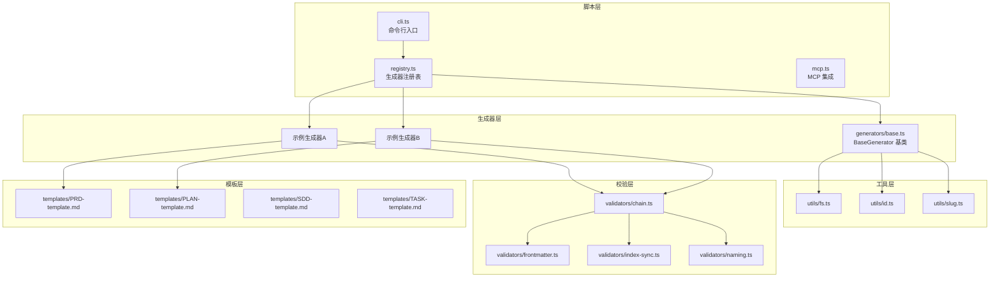
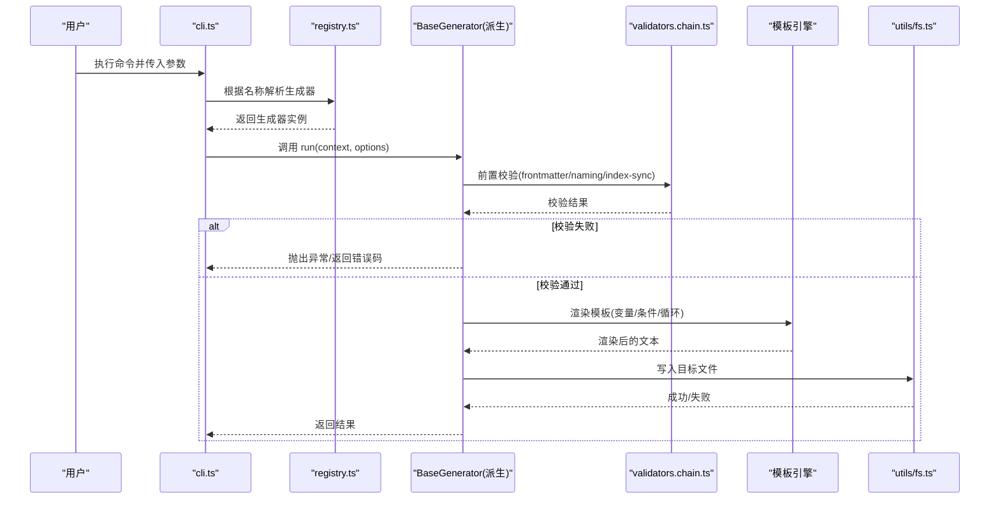
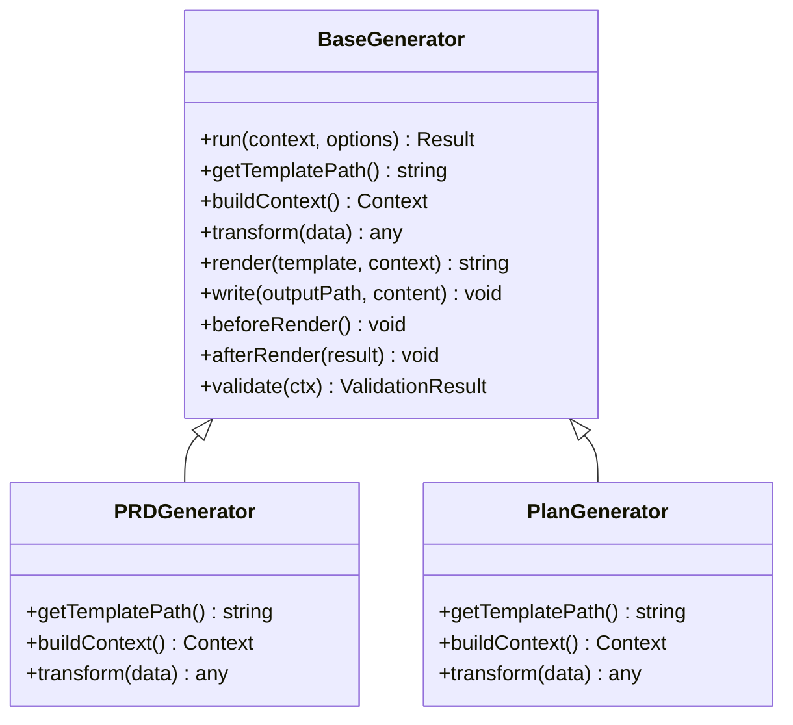
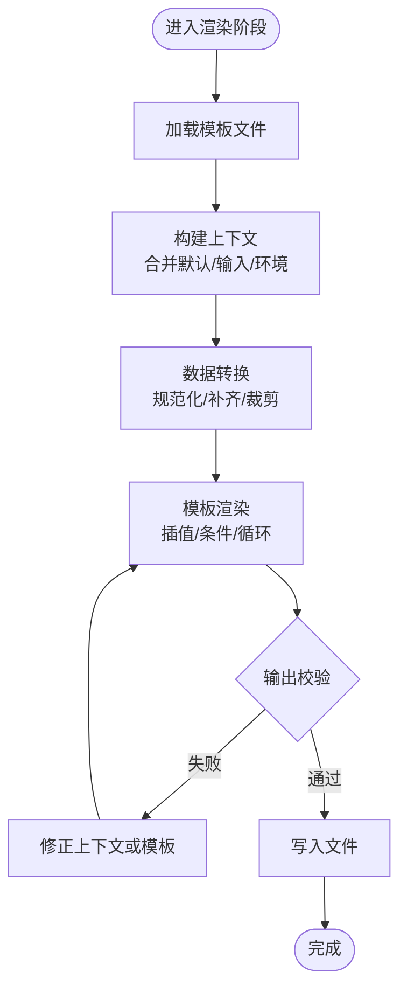
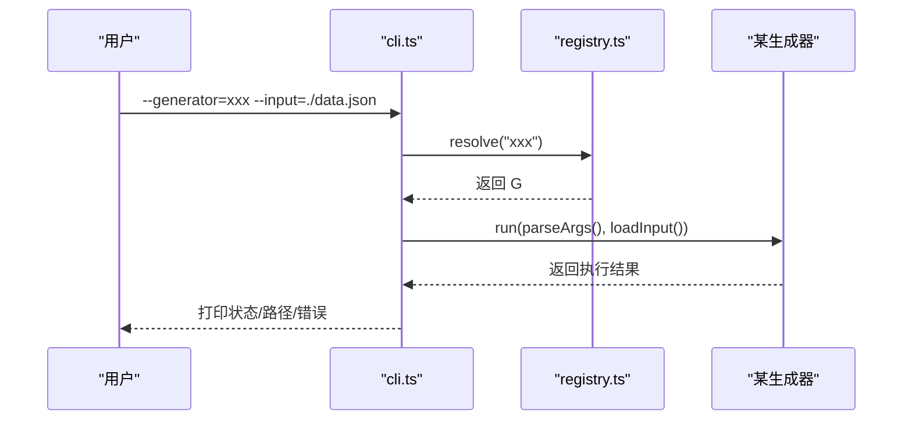
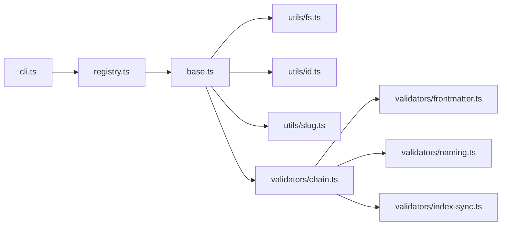

# 自定义生成器开发

<cite>
**本文引用的文件**   
- [base.ts](file://skills/shared/engineering-docs/scripts/src/generators/base.ts)
- [cli.ts](file://skills/shared/engineering-docs/scripts/src/cli.ts)
- [registry.ts](file://skills/shared/engineering-docs/scripts/src/registry.ts)
- [mcp.ts](file://skills/shared/engineering-docs/scripts/src/mcp.ts)
- [fs.ts](file://skills/shared/engineering-docs/scripts/src/utils/fs.ts)
- [id.ts](file://skills/shared/engineering-docs/scripts/src/utils/id.ts)
- [slug.ts](file://skills/shared/engineering-docs/scripts/src/utils/slug.ts)
- [chain.ts](file://skills/shared/engineering-docs/scripts/src/validators/chain.ts)
- [frontmatter.ts](file://skills/shared/engineering-docs/scripts/src/validators/frontmatter.ts)
- [index-sync.ts](file://skills/shared/engineering-docs/scripts/src/validators/index-sync.ts)
- [naming.ts](file://skills/shared/engineering-docs/scripts/src/validators/naming.ts)
- [package.json](file://skills/shared/engineering-docs/scripts/package.json)
- [tsconfig.json](file://skills/shared/engineering-docs/scripts/tsconfig.json)
- [vitest.config.ts](file://skills/shared/engineering-docs/scripts/vitest.config.ts)
- [generators.test.ts](file://skills/shared/engineering-docs/scripts/src/__tests__/generators.test.ts)
- [PRD-template.md](file://skills/shared/engineering-docs/templates/PRD-template.md)
- [PLAN-template.md](file://skills/shared/engineering-docs/templates/PLAN-template.md)
- [SDD-template.md](file://skills/shared/engineering-docs/templates/SDD-template.md)
- [TASK-template.md](file://skills/shared/engineering-docs/templates/TASK-template.md)
</cite>

## 目录
1. [简介](#简介)
2. [项目结构](#项目结构)
3. [核心组件](#核心组件)
4. [架构总览](#架构总览)
5. [详细组件分析](#详细组件分析)
6. [依赖关系分析](#依赖关系分析)
7. [性能考虑](#性能考虑)
8. [故障排查指南](#故障排查指南)
9. [结论](#结论)
10. [附录](#附录)

## 简介
本指南面向希望基于 BaseGenerator 类构建特定类型文档生成器的开发者。内容涵盖：
- 项目结构与依赖管理
- 配置选项与注册机制
- 模板引擎使用（变量插值、条件渲染、循环处理）
- 复杂数据结构处理模式（嵌套对象、数组操作、数据转换）
- 完整开发流程（需求分析到测试部署）
- 案例研究（不同类型生成器实现方式）
- 调试技巧与常见问题
- 性能调优与最佳实践

## 项目结构
工程位于 skills/shared/engineering-docs/scripts，采用“脚本工具 + 模板 + 校验”的模块化组织方式：
- src/generators：生成器基类与具体生成器实现
- src/utils：文件系统、ID、Slug 等通用工具
- src/validators：链式校验、前置元信息、索引同步、命名规范等
- templates：Markdown/YAML 模板
- package.json/tsconfig.json/vitest.config.ts：依赖、编译与测试配置
- cli.ts/registry.ts/mcp.ts：命令行入口、生成器注册、MCP 集成

图表来源
- [cli.ts](file://skills/shared/engineering-docs/scripts/src/cli.ts)
- [registry.ts](file://skills/shared/engineering-docs/scripts/src/registry.ts)
- [base.ts](file://skills/shared/engineering-docs/scripts/src/generators/base.ts)
- [fs.ts](file://skills/shared/engineering-docs/scripts/src/utils/fs.ts)
- [id.ts](file://skills/shared/engineering-docs/scripts/src/utils/id.ts)
- [slug.ts](file://skills/shared/engineering-docs/scripts/src/utils/slug.ts)
- [chain.ts](file://skills/shared/engineering-docs/scripts/src/validators/chain.ts)
- [frontmatter.ts](file://skills/shared/engineering-docs/scripts/src/validators/frontmatter.ts)
- [index-sync.ts](file://skills/shared/engineering-docs/scripts/src/validators/index-sync.ts)
- [naming.ts](file://skills/shared/engineering-docs/scripts/src/validators/naming.ts)
- [PRD-template.md](file://skills/shared/engineering-docs/templates/PRD-template.md)
- [PLAN-template.md](file://skills/shared/engineering-docs/templates/PLAN-template.md)
- [SDD-template.md](file://skills/shared/engineering-docs/templates/SDD-template.md)
- [TASK-template.md](file://skills/shared/engineering-docs/templates/TASK-template.md)

章节来源
- [package.json](file://skills/shared/engineering-docs/scripts/package.json)
- [tsconfig.json](file://skills/shared/engineering-docs/scripts/tsconfig.json)
- [vitest.config.ts](file://skills/shared/engineering-docs/scripts/vitest.config.ts)

## 核心组件
- BaseGenerator：提供统一的生成器生命周期、上下文注入、模板渲染、输出路径解析、错误处理与日志记录能力。
- 注册表 registry：集中管理生成器实例，支持按名称查找与批量执行。
- 校验链 validators.chain：将多个校验器组合为链式调用，便于在生成前后进行一致性检查。
- 工具 utils：文件系统读写、ID 生成、Slug 规范化等。
- 模板 templates：以 Markdown/YAML 为载体，通过变量插值、条件块与循环指令驱动内容生成。

章节来源
- [base.ts](file://skills/shared/engineering-docs/scripts/src/generators/base.ts)
- [registry.ts](file://skills/shared/engineering-docs/scripts/src/registry.ts)
- [chain.ts](file://skills/shared/engineering-docs/scripts/src/validators/chain.ts)
- [fs.ts](file://skills/shared/engineering-docs/scripts/src/utils/fs.ts)
- [id.ts](file://skills/shared/engineering-docs/scripts/src/utils/id.ts)
- [slug.ts](file://skills/shared/engineering-docs/scripts/src/utils/slug.ts)

## 架构总览
下图展示了从 CLI 触发到模板渲染落盘的端到端流程，以及校验链在关键节点的介入位置。

图表来源
- [cli.ts](file://skills/shared/engineering-docs/scripts/src/cli.ts)
- [registry.ts](file://skills/shared/engineering-docs/scripts/src/registry.ts)
- [base.ts](file://skills/shared/engineering-docs/scripts/src/generators/base.ts)
- [chain.ts](file://skills/shared/engineering-docs/scripts/src/validators/chain.ts)
- [fs.ts](file://skills/shared/engineering-docs/scripts/src/utils/fs.ts)

## 详细组件分析

### BaseGenerator 基类设计
- 职责边界
  - 统一生命周期：初始化上下文、加载模板、渲染、落盘、后置处理。
  - 上下文注入：合并默认配置、环境变量、运行时参数。
  - 模板渲染：支持变量插值、条件渲染、循环遍历。
  - 输出控制：路径解析、文件名生成、目录创建、幂等覆盖策略。
  - 错误处理：结构化错误、可恢复异常、诊断信息收集。
  - 扩展点：beforeRender、afterRender、validate、transformData 等钩子。

- 关键抽象
  - getTemplatePath()：定位模板文件。
  - buildContext()：组装渲染上下文。
  - transform(data)：数据清洗与转换。
  - render(template, context)：调用模板引擎渲染。
  - write(outputPath, content)：持久化输出。

图表来源
- [base.ts](file://skills/shared/engineering-docs/scripts/src/generators/base.ts)
- [PRD-template.md](file://skills/shared/engineering-docs/templates/PRD-template.md)
- [PLAN-template.md](file://skills/shared/engineering-docs/templates/PLAN-template.md)

章节来源
- [base.ts](file://skills/shared/engineering-docs/scripts/src/generators/base.ts)

### 模板引擎使用指南
- 变量插值
  - 在模板中使用占位符引用上下文中的字段。
  - 建议对缺失字段设置默认值或空串，避免渲染中断。
- 条件渲染
  - 使用条件块包裹可选段落，依据上下文布尔值或枚举分支显示不同内容。
- 循环处理
  - 对数组型上下文进行遍历，逐项渲染列表项或表格行。
- 数据转换
  - 在生成器中预处理数据，确保模板侧只消费稳定结构。

图表来源
- [base.ts](file://skills/shared/engineering-docs/scripts/src/generators/base.ts)
- [PRD-template.md](file://skills/shared/engineering-docs/templates/PRD-template.md)
- [PLAN-template.md](file://skills/shared/engineering-docs/templates/PLAN-template.md)
- [SDD-template.md](file://skills/shared/engineering-docs/templates/SDD-template.md)
- [TASK-template.md](file://skills/shared/engineering-docs/templates/TASK-template.md)

章节来源
- [PRD-template.md](file://skills/shared/engineering-docs/templates/PRD-template.md)
- [PLAN-template.md](file://skills/shared/engineering-docs/templates/PLAN-template.md)
- [SDD-template.md](file://skills/shared/engineering-docs/templates/SDD-template.md)
- [TASK-template.md](file://skills/shared/engineering-docs/templates/TASK-template.md)

### 复杂数据结构处理模式
- 嵌套对象
  - 在 transform 中将深层属性扁平化或抽取为视图模型，降低模板复杂度。
- 数组操作
  - 过滤、排序、分页、分组后再交给模板渲染，提升可读性与性能。
- 数据转换
  - 统一日期、金额、枚举映射；对敏感字段脱敏；对空值归一化。
- 校验联动
  - 结合 validators.chain 在转换后再次校验，保证下游一致性。

章节来源
- [base.ts](file://skills/shared/engineering-docs/scripts/src/generators/base.ts)
- [chain.ts](file://skills/shared/engineering-docs/scripts/src/validators/chain.ts)

### 校验链与一致性保障
- chain.ts 将 frontmatter、naming、index-sync 等校验器串联，形成“前置-渲染-后置”的全链路校验。
- 典型用法
  - 前置：校验输入 schema、命名规范、索引一致性。
  - 后置：校验输出文件存在、内容非空、必要字段齐全。

图表来源
- [chain.ts](file://skills/shared/engineering-docs/scripts/src/validators/chain.ts)
- [frontmatter.ts](file://skills/shared/engineering-docs/scripts/src/validators/frontmatter.ts)
- [naming.ts](file://skills/shared/engineering-docs/scripts/src/validators/naming.ts)
- [index-sync.ts](file://skills/shared/engineering-docs/scripts/src/validators/index-sync.ts)

章节来源
- [chain.ts](file://skills/shared/engineering-docs/scripts/src/validators/chain.ts)
- [frontmatter.ts](file://skills/shared/engineering-docs/scripts/src/validators/frontmatter.ts)
- [naming.ts](file://skills/shared/engineering-docs/scripts/src/validators/naming.ts)
- [index-sync.ts](file://skills/shared/engineering-docs/scripts/src/validators/index-sync.ts)

### 命令行与注册表
- cli.ts 负责解析参数、选择生成器、传递上下文并打印结果。
- registry.ts 维护生成器映射，支持新增生成器时仅做注册即可被 CLI 发现。

图表来源
- [cli.ts](file://skills/shared/engineering-docs/scripts/src/cli.ts)
- [registry.ts](file://skills/shared/engineering-docs/scripts/src/registry.ts)

章节来源
- [cli.ts](file://skills/shared/engineering-docs/scripts/src/cli.ts)
- [registry.ts](file://skills/shared/engineering-docs/scripts/src/registry.ts)

### 工具模块
- fs.ts：安全读写、路径拼接、目录创建、幂等覆盖。
- id.ts：生成稳定唯一标识，用于文件名或资源键。
- slug.ts：将标题或名称转换为 URL 友好的 Slug。

章节来源
- [fs.ts](file://skills/shared/engineering-docs/scripts/src/utils/fs.ts)
- [id.ts](file://skills/shared/engineering-docs/scripts/src/utils/id.ts)
- [slug.ts](file://skills/shared/engineering-docs/scripts/src/utils/slug.ts)

### 测试与验证
- vitest.config.ts 配置测试运行环境与断言库。
- generators.test.ts 针对生成器行为编写用例，覆盖正常路径、边界条件与错误场景。

章节来源
- [vitest.config.ts](file://skills/shared/engineering-docs/scripts/vitest.config.ts)
- [generators.test.ts](file://skills/shared/engineering-docs/scripts/src/__tests__/generators.test.ts)

## 依赖关系分析
- 内部依赖
  - cli.ts 依赖 registry.ts 与生成器实现。
  - 生成器依赖 base.ts 提供的通用能力。
  - 校验链依赖各独立校验器。
  - 工具模块被生成器与校验器复用。
- 外部依赖
  - 由 package.json 声明，包含 TypeScript 编译、测试框架与可能的模板引擎库。
  - tsconfig.json 定义编译目标与模块解析策略。

图表来源
- [cli.ts](file://skills/shared/engineering-docs/scripts/src/cli.ts)
- [registry.ts](file://skills/shared/engineering-docs/scripts/src/registry.ts)
- [base.ts](file://skills/shared/engineering-docs/scripts/src/generators/base.ts)
- [fs.ts](file://skills/shared/engineering-docs/scripts/src/utils/fs.ts)
- [id.ts](file://skills/shared/engineering-docs/scripts/src/utils/id.ts)
- [slug.ts](file://skills/shared/engineering-docs/scripts/src/utils/slug.ts)
- [chain.ts](file://skills/shared/engineering-docs/scripts/src/validators/chain.ts)
- [frontmatter.ts](file://skills/shared/engineering-docs/scripts/src/validators/frontmatter.ts)
- [naming.ts](file://skills/shared/engineering-docs/scripts/src/validators/naming.ts)
- [index-sync.ts](file://skills/shared/engineering-docs/scripts/src/validators/index-sync.ts)

章节来源
- [package.json](file://skills/shared/engineering-docs/scripts/package.json)
- [tsconfig.json](file://skills/shared/engineering-docs/scripts/tsconfig.json)

## 性能考虑
- 模板渲染
  - 减少模板内计算，尽量在 transform 阶段完成数据准备。
  - 对大数组进行分页或抽样预览，避免一次性渲染过多节点。
- I/O 优化
  - 批量写入前缓存路径与内容，减少重复 IO。
  - 使用原子写入策略，避免中间态文件污染。
- 内存占用
  - 流式处理超大输入，避免全量加载。
  - 及时释放临时对象与闭包引用。
- 并发控制
  - 并行生成多文件时限制并发度，防止磁盘与 CPU 争用。
- 缓存策略
  - 对不变模板与公共数据进行缓存，缩短冷启动时间。

[本节为通用指导，不直接分析具体文件]

## 故障排查指南
- 常见错误
  - 模板变量缺失：检查 buildContext 是否补齐默认值。
  - 命名冲突：确认 naming 校验规则与 slug 生成逻辑。
  - 索引不一致：运行 index-sync 校验并修复索引文件。
  - 权限问题：确认输出目录可写与路径合法。
- 调试技巧
  - 启用详细日志，记录上下文快照与渲染前后差异。
  - 使用最小复现数据集快速定位问题。
  - 分步执行：先跑校验链，再单独渲染，最后落盘。
- 回归测试
  - 在 generators.test.ts 中补充失败用例，确保修复有效。

章节来源
- [chain.ts](file://skills/shared/engineering-docs/scripts/src/validators/chain.ts)
- [naming.ts](file://skills/shared/engineering-docs/scripts/src/validators/naming.ts)
- [index-sync.ts](file://skills/shared/engineering-docs/scripts/src/validators/index-sync.ts)
- [generators.test.ts](file://skills/shared/engineering-docs/scripts/src/__tests__/generators.test.ts)

## 结论
通过 BaseGenerator 的统一抽象与校验链的强约束，开发者可以快速构建稳定、可测试、易维护的文档生成器。配合清晰的模板约定与工具链，能够显著提升产出质量与交付效率。

[本节为总结性内容，不直接分析具体文件]

## 附录

### 从零到一：开发流程清单
- 需求分析
  - 明确输入数据结构、输出格式与业务约束。
- 设计与建模
  - 定义上下文模型、模板骨架与校验规则。
- 实现
  - 继承 BaseGenerator，实现模板路径、上下文构建与数据转换。
  - 在模板中应用插值、条件与循环。
- 测试
  - 编写单元测试与集成用例，覆盖边界与异常。
- 发布
  - 更新 registry 注册新生成器，完善 CLI 帮助与错误提示。
- 运维
  - 监控错误率与耗时，持续优化模板与数据处理逻辑。

[本节为流程说明，不直接分析具体文件]

### 案例研究

#### 案例一：PRD 文档生成器
- 目标：根据产品需求数据生成 PRD 文档。
- 关键点
  - 模板：PRD-template.md
  - 校验：frontmatter 必填字段、命名规范、索引同步
  - 数据：模块、特性、验收标准等嵌套结构
- 步骤
  - 继承 BaseGenerator，指定 PRD 模板路径。
  - 在 transform 中聚合模块与特性，生成视图模型。
  - 在模板中循环渲染特性列表与验收条目。
  - 通过 chain 校验后落盘。

章节来源
- [base.ts](file://skills/shared/engineering-docs/scripts/src/generators/base.ts)
- [PRD-template.md](file://skills/shared/engineering-docs/templates/PRD-template.md)
- [chain.ts](file://skills/shared/engineering-docs/scripts/src/validators/chain.ts)
- [frontmatter.ts](file://skills/shared/engineering-docs/scripts/src/validators/frontmatter.ts)
- [naming.ts](file://skills/shared/engineering-docs/scripts/src/validators/naming.ts)
- [index-sync.ts](file://skills/shared/engineering-docs/scripts/src/validators/index-sync.ts)

#### 案例二：技术方案 SDD 生成器
- 目标：根据架构与设计数据生成 SDD。
- 关键点
  - 模板：SDD-template.md
  - 校验：模块接口、依赖关系、命名规范
  - 数据：子系统、接口、数据模型等
- 步骤
  - 继承 BaseGenerator，绑定 SDD 模板。
  - 在 transform 中规范化接口签名与依赖图。
  - 在模板中条件渲染可选章节（如性能指标）。
  - 通过 chain 校验并输出。

章节来源
- [base.ts](file://skills/shared/engineering-docs/scripts/src/generators/base.ts)
- [SDD-template.md](file://skills/shared/engineering-docs/templates/SDD-template.md)
- [chain.ts](file://skills/shared/engineering-docs/scripts/src/validators/chain.ts)

#### 案例三：任务拆解 TASK 生成器
- 目标：将需求拆分为可执行任务清单。
- 关键点
  - 模板：TASK-template.md
  - 校验：任务粒度、优先级、负责人
  - 数据：需求项、子任务、里程碑
- 步骤
  - 继承 BaseGenerator，绑定 TASK 模板。
  - 在 transform 中拆分任务、计算依赖与排期。
  - 在模板中循环渲染任务表与里程碑。
  - 通过 chain 校验并输出。

章节来源
- [base.ts](file://skills/shared/engineering-docs/scripts/src/generators/base.ts)
- [TASK-template.md](file://skills/shared/engineering-docs/templates/TASK-template.md)
- [chain.ts](file://skills/shared/engineering-docs/scripts/src/validators/chain.ts)