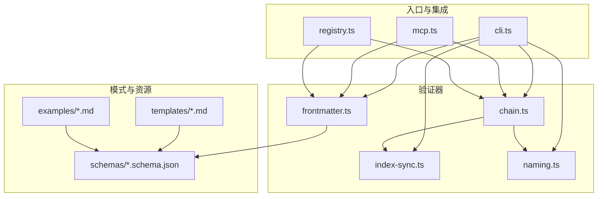
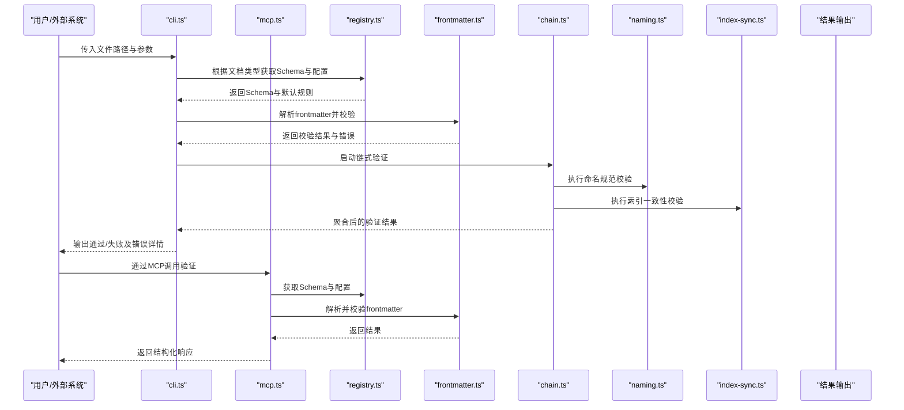
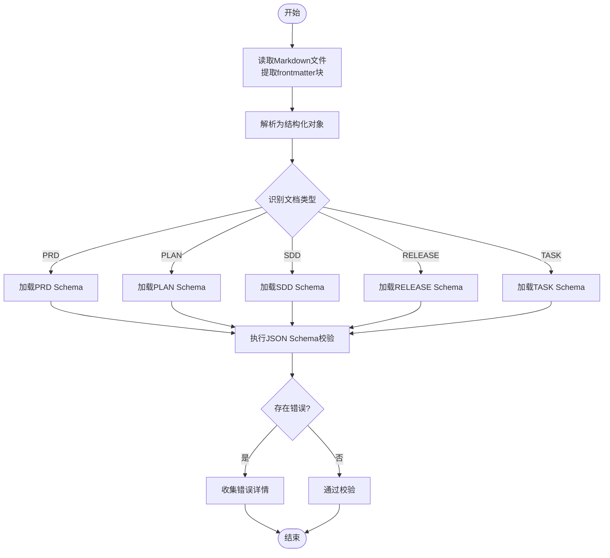
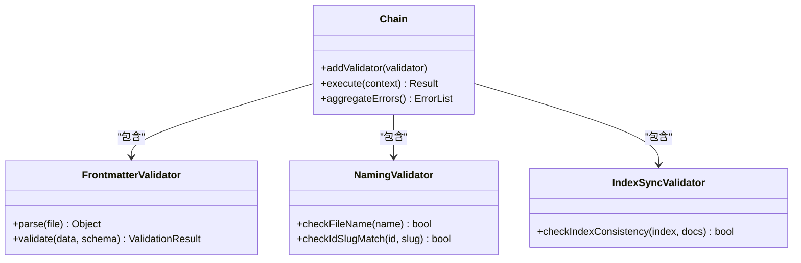
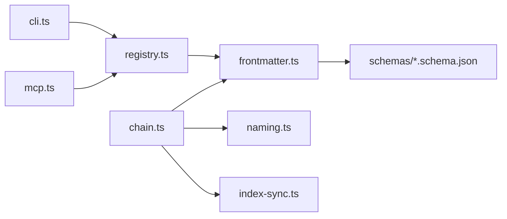

# Frontmatter验证器

<cite>
**本文引用的文件**   
- [frontmatter.ts](file://skills/shared/engineering-docs/scripts/src/validators/frontmatter.ts)
- [chain.ts](file://skills/shared/engineering-docs/scripts/src/validators/chain.ts)
- [index-sync.ts](file://skills/shared/engineering-docs/scripts/src/validators/index-sync.ts)
- [naming.ts](file://skills/shared/engineering-docs/scripts/src/validators/naming.ts)
- [cli.ts](file://skills/shared/engineering-docs/scripts/src/cli.ts)
- [mcp.ts](file://skills/shared/engineering-docs/scripts/src/mcp.ts)
- [registry.ts](file://skills/shared/engineering-docs/scripts/src/registry.ts)
- [prism.schema.json](file://skills/shared/engineering-docs/scripts/schemas/prism.schema.json)
- [plan.schema.json](file://skills/shared/engineering-docs/scripts/schemas/plan.schema.json)
- [prd.schema.json](file://skills/shared/engineering-docs/scripts/schemas/prd.schema.json)
- [sdd.schema.json](file://skills/shared/engineering-docs/scripts/schemas/sdd.schema.json)
- [release.schema.json](file://skills/shared/engineering-docs/scripts/schemas/release.schema.json)
- [task.schema.json](file://skills/shared/engineering-docs/scripts/schemas/task.schema.json)
- [common-defs.schema.json](file://skills/shared/engineering-docs/scripts/schemas/common-defs.schema.json)
- [form.schema.json](file://skills/shared/engineering-docs/scripts/schemas/form.schema.json)
- [module.schema.json](file://skills/shared/engineering-docs/scripts/schemas/module.schema.json)
- [PRD-template.md](file://skills/shared/engineering-docs/scripts/templates/PRD-template.md)
- [PLAN-template.md](file://skills/shared/engineering-docs/scripts/templates/PLAN-template.md)
- [SDD-template.md](file://skills/shared/engineering-docs/scripts/templates/SDD-template.md)
- [RELEASE-template.md](file://skills/shared/engineering-docs/scripts/templates/RELEASE-template.md)
- [TASK-template.md](file://skills/shared/engineering-docs/scripts/templates/TASK-template.md)
- [PRD-001-sample-login.md](file://skills/shared/engineering-docs/scripts/examples/PRD-001-sample-login.md)
- [PLAN-v1.0-001-sample-mvp.md](file://skills/shared/engineering-docs/scripts/examples/PLAN-v1.0-001-sample-mvp.md)
- [README.md](file://skills/shared/engineering-docs/scripts/README.md)
</cite>

## 目录
1. [简介](#简介)
2. [项目结构](#项目结构)
3. [核心组件](#核心组件)
4. [架构总览](#架构总览)
5. [详细组件分析](#详细组件分析)
6. [依赖关系分析](#依赖关系分析)
7. [性能考虑](#性能考虑)
8. [故障排查指南](#故障排查指南)
9. [结论](#结论)
10. [附录](#附录)

## 简介
本文件为Frontmatter验证器的功能文档，聚焦于工程文档的元数据（frontmatter）校验能力。内容涵盖：
- 元数据验证规则：必需字段、数据类型与格式校验逻辑
- 支持的文档类型及其特定要求：PRD、PLAN、SDD、RELEASE、TASK等
- 配置选项与扩展点：自定义验证规则与错误处理机制
- 使用示例：如何对不同文档类型进行frontmatter验证
- 常见错误诊断与修复建议

该验证器基于JSON Schema对frontmatter进行强类型校验，并通过链式验证器组合命名规范、索引一致性等跨文档约束，提供CLI与MCP两种调用方式。

## 项目结构
与Frontmatter验证相关的代码位于engineering-docs脚本子项目中，主要包含：
- 验证器实现：frontmatter.ts、chain.ts、index-sync.ts、naming.ts
- 入口与集成：cli.ts、mcp.ts、registry.ts
- 模式定义：schemas/*.schema.json
- 模板与示例：templates/*、examples/*

图表来源
- [frontmatter.ts](file://skills/shared/engineering-docs/scripts/src/validators/frontmatter.ts)
- [chain.ts](file://skills/shared/engineering-docs/scripts/src/validators/chain.ts)
- [index-sync.ts](file://skills/shared/engineering-docs/scripts/src/validators/index-sync.ts)
- [naming.ts](file://skills/shared/engineering-docs/scripts/src/validators/naming.ts)
- [cli.ts](file://skills/shared/engineering-docs/scripts/src/cli.ts)
- [mcp.ts](file://skills/shared/engineering-docs/scripts/src/mcp.ts)
- [registry.ts](file://skills/shared/engineering-docs/scripts/src/registry.ts)
- [prism.schema.json](file://skills/shared/engineering-docs/scripts/schemas/prism.schema.json)
- [plan.schema.json](file://skills/shared/engineering-docs/scripts/schemas/plan.schema.json)
- [prd.schema.json](file://skills/shared/engineering-docs/scripts/schemas/prd.schema.json)
- [sdd.schema.json](file://skills/shared/engineering-docs/scripts/schemas/sdd.schema.json)
- [release.schema.json](file://skills/shared/engineering-docs/scripts/schemas/release.schema.json)
- [task.schema.json](file://skills/shared/engineering-docs/scripts/schemas/task.schema.json)
- [common-defs.schema.json](file://skills/shared/engineering-docs/scripts/schemas/common-defs.schema.json)
- [form.schema.json](file://skills/shared/engineering-docs/scripts/schemas/form.schema.json)
- [module.schema.json](file://skills/shared/engineering-docs/scripts/schemas/module.schema.json)
- [PRD-template.md](file://skills/shared/engineering-docs/scripts/templates/PRD-template.md)
- [PLAN-template.md](file://skills/shared/engineering-docs/scripts/templates/PLAN-template.md)
- [SDD-template.md](file://skills/shared/engineering-docs/scripts/templates/SDD-template.md)
- [RELEASE-template.md](file://skills/shared/engineering-docs/scripts/templates/RELEASE-template.md)
- [TASK-template.md](file://skills/shared/engineering-docs/scripts/templates/TASK-template.md)
- [PRD-001-sample-login.md](file://skills/shared/engineering-docs/scripts/examples/PRD-001-sample-login.md)
- [PLAN-v1.0-001-sample-mvp.md](file://skills/shared/engineering-docs/scripts/examples/PLAN-v1.0-001-sample-mvp.md)

章节来源
- [README.md](file://skills/shared/engineering-docs/scripts/README.md)

## 核心组件
- frontmatter.ts：负责解析Markdown文件的frontmatter块，加载并应用对应文档类型的JSON Schema进行强类型校验，返回结构化结果与错误列表。
- chain.ts：将多个验证步骤串联执行，支持短路或继续策略，聚合错误信息，便于统一报告。
- index-sync.ts：校验文档索引与正文的一致性（如ID、标题、路径等），作为跨文档约束的一部分。
- naming.ts：校验文件名与frontmatter中标识符（如id、slug）是否符合命名约定。
- cli.ts：命令行入口，接收文件路径、文档类型、是否严格模式等参数，输出验证结果。
- mcp.ts：MCP协议入口，暴露验证能力供外部工具调用。
- registry.ts：注册表，集中管理不同文档类型与其Schema映射、默认配置与扩展点。

章节来源
- [frontmatter.ts](file://skills/shared/engineering-docs/scripts/src/validators/frontmatter.ts)
- [chain.ts](file://skills/shared/engineering-docs/scripts/src/validators/chain.ts)
- [index-sync.ts](file://skills/shared/engineering-docs/scripts/src/validators/index-sync.ts)
- [naming.ts](file://skills/shared/engineering-docs/scripts/src/validators/naming.ts)
- [cli.ts](file://skills/shared/engineering-docs/scripts/src/cli.ts)
- [mcp.ts](file://skills/shared/engineering-docs/scripts/src/mcp.ts)
- [registry.ts](file://skills/shared/engineering-docs/scripts/src/registry.ts)

## 架构总览
下图展示了从输入到输出的整体流程：CLI/MCP触发，Registry选择Schema，Frontmatter解析与校验，Chain串联命名与索引校验，最终汇总结果。

图表来源
- [cli.ts](file://skills/shared/engineering-docs/scripts/src/cli.ts)
- [mcp.ts](file://skills/shared/engineering-docs/scripts/src/mcp.ts)
- [registry.ts](file://skills/shared/engineering-docs/scripts/src/registry.ts)
- [frontmatter.ts](file://skills/shared/engineering-docs/scripts/src/validators/frontmatter.ts)
- [chain.ts](file://skills/shared/engineering-docs/scripts/src/validators/chain.ts)
- [naming.ts](file://skills/shared/engineering-docs/scripts/src/validators/naming.ts)
- [index-sync.ts](file://skills/shared/engineering-docs/scripts/src/validators/index-sync.ts)

## 详细组件分析

### 元数据验证规则与数据类型检查
- 解析与加载：读取Markdown文件头部的frontmatter块，将其解析为结构化对象。
- Schema驱动校验：根据文档类型（如PRD、PLAN、SDD、RELEASE、TASK）选择对应的JSON Schema，进行必填字段、类型、枚举值、范围、格式等校验。
- 错误聚合：收集所有违反规则的字段路径与错误消息，便于定位与修复。
- 可扩展性：通过注册表新增文档类型与Schema，无需修改核心校验逻辑。

图表来源
- [frontmatter.ts](file://skills/shared/engineering-docs/scripts/src/validators/frontmatter.ts)
- [prism.schema.json](file://skills/shared/engineering-docs/scripts/schemas/prism.schema.json)
- [plan.schema.json](file://skills/shared/engineering-docs/scripts/schemas/plan.schema.json)
- [prd.schema.json](file://skills/shared/engineering-docs/scripts/schemas/prd.schema.json)
- [sdd.schema.json](file://skills/shared/engineering-docs/scripts/schemas/sdd.schema.json)
- [release.schema.json](file://skills/shared/engineering-docs/scripts/schemas/release.schema.json)
- [task.schema.json](file://skills/shared/engineering-docs/scripts/schemas/task.schema.json)

章节来源
- [frontmatter.ts](file://skills/shared/engineering-docs/scripts/src/validators/frontmatter.ts)
- [prism.schema.json](file://skills/shared/engineering-docs/scripts/schemas/prism.schema.json)
- [plan.schema.json](file://skills/shared/engineering-docs/scripts/schemas/plan.schema.json)
- [prd.schema.json](file://skills/shared/engineering-docs/scripts/schemas/prd.schema.json)
- [sdd.schema.json](file://skills/shared/engineering-docs/scripts/schemas/sdd.schema.json)
- [release.schema.json](file://skills/shared/engineering-docs/scripts/schemas/release.schema.json)
- [task.schema.json](file://skills/shared/engineering-docs/scripts/schemas/task.schema.json)

### 支持的文档类型与特定要求
- PRD（产品需求文档）：需满足PRD Schema定义的字段集合与约束，通常包括需求描述、目标用户、验收标准等。
- PLAN（计划文档）：需满足PLAN Schema，包含里程碑、任务分解、时间线等字段。
- SDD（系统设计文档）：需满足SDD Schema，包含架构概述、模块划分、接口设计等字段。
- RELEASE（发布说明）：需满足RELEASE Schema，包含版本信息、变更摘要、兼容性说明等字段。
- TASK（任务单）：需满足TASK Schema，包含任务标题、负责人、优先级、状态等字段。

各文档类型的模板与示例可参考以下文件，用于对照frontmatter结构与字段含义：
- 模板：[PRD-template.md](file://skills/shared/engineering-docs/scripts/templates/PRD-template.md)、[PLAN-template.md](file://skills/shared/engineering-docs/scripts/templates/PLAN-template.md)、[SDD-template.md](file://skills/shared/engineering-docs/scripts/templates/SDD-template.md)、[RELEASE-template.md](file://skills/shared/engineering-docs/scripts/templates/RELEASE-template.md)、[TASK-template.md](file://skills/shared/engineering-docs/scripts/templates/TASK-template.md)
- 示例：[PRD-001-sample-login.md](file://skills/shared/engineering-docs/scripts/examples/PRD-001-sample-login.md)、[PLAN-v1.0-001-sample-mvp.md](file://skills/shared/engineering-docs/scripts/examples/PLAN-v1.0-001-sample-mvp.md)

章节来源
- [PRD-template.md](file://skills/shared/engineering-docs/scripts/templates/PRD-template.md)
- [PLAN-template.md](file://skills/shared/engineering-docs/scripts/templates/PLAN-template.md)
- [SDD-template.md](file://skills/shared/engineering-docs/scripts/templates/SDD-template.md)
- [RELEASE-template.md](file://skills/shared/engineering-docs/scripts/templates/RELEASE-template.md)
- [TASK-template.md](file://skills/shared/engineering-docs/scripts/templates/TASK-template.md)
- [PRD-001-sample-login.md](file://skills/shared/engineering-docs/scripts/examples/PRD-001-sample-login.md)
- [PLAN-v1.0-001-sample-mvp.md](file://skills/shared/engineering-docs/scripts/examples/PLAN-v1.0-001-sample-mvp.md)

### 链式验证与跨文档约束
- Chain：将frontmatter校验、命名规范校验、索引一致性校验串联执行，支持顺序控制与错误聚合。
- Naming：确保文件名与frontmatter中的标识符（如id、slug）符合命名约定，避免不一致导致的检索与链接问题。
- Index-Sync：校验文档索引与正文之间的关联关系，保证引用完整性与一致性。

图表来源
- [chain.ts](file://skills/shared/engineering-docs/scripts/src/validators/chain.ts)
- [frontmatter.ts](file://skills/shared/engineering-docs/scripts/src/validators/frontmatter.ts)
- [naming.ts](file://skills/shared/engineering-docs/scripts/src/validators/naming.ts)
- [index-sync.ts](file://skills/shared/engineering-docs/scripts/src/validators/index-sync.ts)

章节来源
- [chain.ts](file://skills/shared/engineering-docs/scripts/src/validators/chain.ts)
- [naming.ts](file://skills/shared/engineering-docs/scripts/src/validators/naming.ts)
- [index-sync.ts](file://skills/shared/engineering-docs/scripts/src/validators/index-sync.ts)

### 配置选项与扩展点
- 注册表（Registry）：集中管理文档类型与Schema映射、默认配置项与扩展点，便于新增文档类型与自定义规则。
- 自定义验证规则：可通过注册表添加新的验证步骤，并在Chain中注册执行顺序。
- 错误处理机制：统一收集错误信息，支持按严重级别分类与格式化输出，便于在CLI与MCP中呈现。

章节来源
- [registry.ts](file://skills/shared/engineering-docs/scripts/src/registry.ts)
- [chain.ts](file://skills/shared/engineering-docs/scripts/src/validators/chain.ts)

### 使用示例与常见错误诊断

#### 使用示例
- 命令行验证：通过CLI传入文件路径与文档类型，执行frontmatter校验与链式验证，查看输出结果。
- MCP调用：通过MCP接口调用验证服务，传入文档内容与类型，获取结构化响应。

章节来源
- [cli.ts](file://skills/shared/engineering-docs/scripts/src/cli.ts)
- [mcp.ts](file://skills/shared/engineering-docs/scripts/src/mcp.ts)

#### 常见错误与修复建议
- 缺失必填字段：根据错误消息定位字段路径，补充必要信息。
- 类型不匹配：检查字段值类型是否符合Schema定义（字符串、数字、布尔、枚举等）。
- 格式不符合：修正日期、URL、邮箱等格式，确保与Schema格式约束一致。
- 命名不一致：调整文件名或frontmatter中的id/slug，使其符合命名约定。
- 索引不一致：更新索引条目以匹配正文内容，确保引用完整。

章节来源
- [frontmatter.ts](file://skills/shared/engineering-docs/scripts/src/validators/frontmatter.ts)
- [naming.ts](file://skills/shared/engineering-docs/scripts/src/validators/naming.ts)
- [index-sync.ts](file://skills/shared/engineering-docs/scripts/src/validators/index-sync.ts)

## 依赖关系分析
- 内部依赖：
  - CLI与MCP依赖Registry获取Schema与配置
  - FrontmatterValidator依赖Schema文件进行强类型校验
  - Chain组合FrontmatterValidator、NamingValidator、IndexSyncValidator
- 外部依赖：
  - JSON Schema解析与校验库（由运行时环境提供）
  - Markdown解析库（用于提取frontmatter块）

图表来源
- [cli.ts](file://skills/shared/engineering-docs/scripts/src/cli.ts)
- [mcp.ts](file://skills/shared/engineering-docs/scripts/src/mcp.ts)
- [registry.ts](file://skills/shared/engineering-docs/scripts/src/registry.ts)
- [frontmatter.ts](file://skills/shared/engineering-docs/scripts/src/validators/frontmatter.ts)
- [chain.ts](file://skills/shared/engineering-docs/scripts/src/validators/chain.ts)
- [naming.ts](file://skills/shared/engineering-docs/scripts/src/validators/naming.ts)
- [index-sync.ts](file://skills/shared/engineering-docs/scripts/src/validators/index-sync.ts)
- [prism.schema.json](file://skills/shared/engineering-docs/scripts/schemas/prism.schema.json)
- [plan.schema.json](file://skills/shared/engineering-docs/scripts/schemas/plan.schema.json)
- [prd.schema.json](file://skills/shared/engineering-docs/scripts/schemas/prd.schema.json)
- [sdd.schema.json](file://skills/shared/engineering-docs/scripts/schemas/sdd.schema.json)
- [release.schema.json](file://skills/shared/engineering-docs/scripts/schemas/release.schema.json)
- [task.schema.json](file://skills/shared/engineering-docs/scripts/schemas/task.schema.json)
- [common-defs.schema.json](file://skills/shared/engineering-docs/scripts/schemas/common-defs.schema.json)
- [form.schema.json](file://skills/shared/engineering-docs/scripts/schemas/form.schema.json)
- [module.schema.json](file://skills/shared/engineering-docs/scripts/schemas/module.schema.json)

章节来源
- [cli.ts](file://skills/shared/engineering-docs/scripts/src/cli.ts)
- [mcp.ts](file://skills/shared/engineering-docs/scripts/src/mcp.ts)
- [registry.ts](file://skills/shared/engineering-docs/scripts/src/registry.ts)
- [frontmatter.ts](file://skills/shared/engineering-docs/scripts/src/validators/frontmatter.ts)
- [chain.ts](file://skills/shared/engineering-docs/scripts/src/validators/chain.ts)
- [naming.ts](file://skills/shared/engineering-docs/scripts/src/validators/naming.ts)
- [index-sync.ts](file://skills/shared/engineering-docs/scripts/src/validators/index-sync.ts)

## 性能考虑
- 批量验证：对大量文档进行验证时，建议并行处理以提升吞吐，同时注意I/O与内存占用。
- Schema缓存：对常用Schema进行缓存，减少重复加载开销。
- 增量校验：仅对变更文件执行验证，降低不必要的计算成本。
- 错误聚合优化：在Chain阶段合并错误信息，避免多次遍历与重复解析。

## 故障排查指南
- 确认文档类型识别正确：若类型识别错误，可能导致加载错误的Schema，从而产生误报。
- 检查frontmatter语法：确保frontmatter块语法正确，无多余字符或缺失分隔符。
- 核对字段路径：根据错误消息中的字段路径快速定位问题位置。
- 验证命名与索引：若命名或索引校验失败，优先修复这些基础问题后再进行其他校验。

章节来源
- [frontmatter.ts](file://skills/shared/engineering-docs/scripts/src/validators/frontmatter.ts)
- [chain.ts](file://skills/shared/engineering-docs/scripts/src/validators/chain.ts)
- [naming.ts](file://skills/shared/engineering-docs/scripts/src/validators/naming.ts)
- [index-sync.ts](file://skills/shared/engineering-docs/scripts/src/validators/index-sync.ts)

## 结论
Frontmatter验证器通过JSON Schema驱动的强类型校验与链式验证机制，为工程文档提供了可靠的元数据质量保证。其模块化设计与注册表扩展点使得新增文档类型与自定义规则变得简单直观。结合CLI与MCP两种调用方式，验证器能够无缝集成到现有工作流中，提升文档质量与协作效率。

## 附录
- 相关模板与示例文件可用于对照frontmatter结构与字段含义，帮助快速上手与排错。
- 如需新增文档类型，建议在注册表中添加新类型映射，并提供对应的Schema与模板。