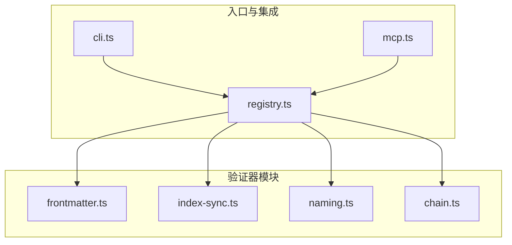
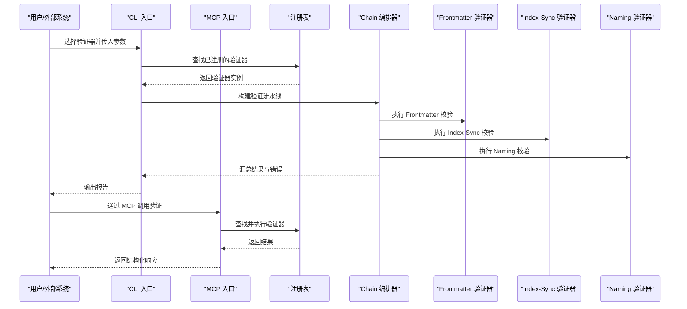
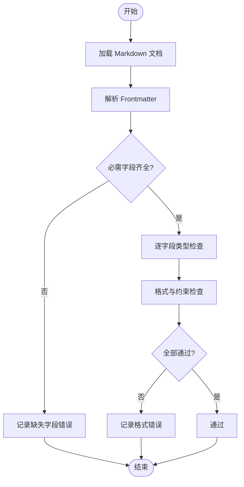
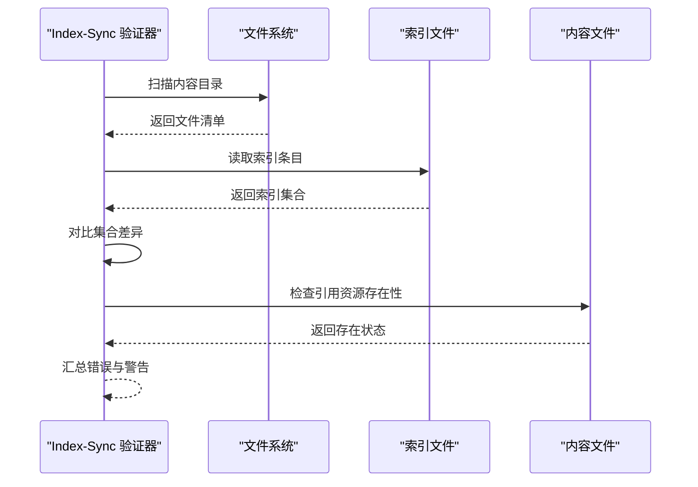
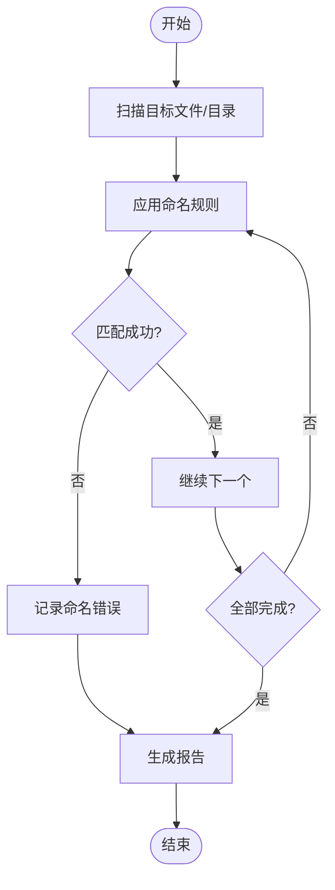
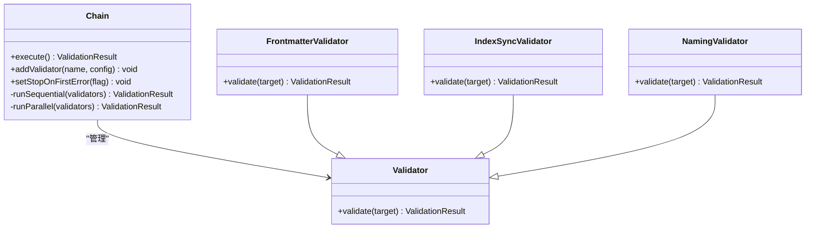
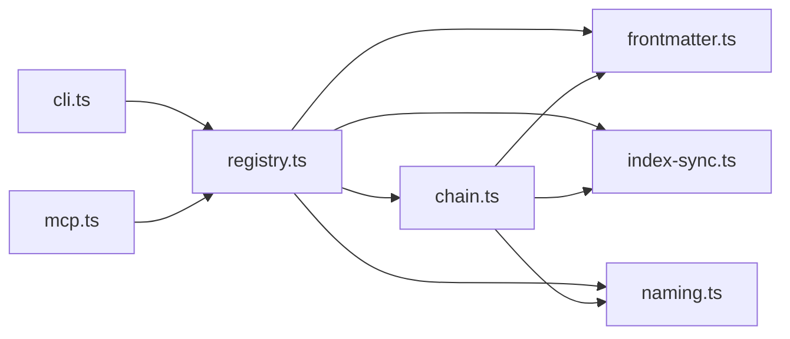

# 内置验证器详解

<cite>
**本文引用的文件**   
- [frontmatter.ts](file://skills/shared/engineering-docs/scripts/src/validators/frontmatter.ts)
- [index-sync.ts](file://skills/shared/engineering-docs/scripts/src/validators/index-sync.ts)
- [naming.ts](file://skills/shared/engineering-docs/scripts/src/validators/naming.ts)
- [chain.ts](file://skills/shared/engineering-docs/scripts/src/validators/chain.ts)
- [cli.ts](file://skills/shared/engineering-docs/scripts/src/cli.ts)
- [mcp.ts](file://skills/shared/engineering-docs/scripts/src/mcp.ts)
- [registry.ts](file://skills/shared/engineering-docs/scripts/src/registry.ts)
- [SKILL.md](file://skills/shared/engineering-docs/SKILL.md)
</cite>

## 目录
1. [简介](#简介)
2. [项目结构](#项目结构)
3. [核心组件](#核心组件)
4. [架构总览](#架构总览)
5. [详细组件分析](#详细组件分析)
6. [依赖关系分析](#依赖关系分析)
7. [性能考虑](#性能考虑)
8. [故障排查指南](#故障排查指南)
9. [结论](#结论)
10. [附录](#附录)

## 简介
本文件面向工程文档工具链中的“内置验证器”，聚焦以下三类验证能力：
- frontmatter 验证器：对 Markdown 文件的元数据（frontmatter）进行字段存在性、数据类型与格式校验。
- index-sync 验证器：检查索引文件与内容文件之间的关联一致性与引用完整性。
- naming 验证器：基于命名规范与路径规则，校验文件名与路径是否符合约定。

文档将提供每个验证器的配置选项、使用示例、常见错误处理方案，并结合实际项目给出最佳实践建议。

## 项目结构
验证器位于工程文档脚本子项目中，采用模块化组织方式：
- validators：包含 frontmatter、index-sync、naming 三个独立验证器以及 chain 编排器。
- cli：命令行入口，负责参数解析与调用验证器。
- mcp：MCP 集成入口，暴露验证能力给外部系统。
- registry：注册表，集中管理验证器发现与执行。
- SKILL.md：技能说明，描述如何使用验证器。

图表来源
- [cli.ts](file://skills/shared/engineering-docs/scripts/src/cli.ts)
- [mcp.ts](file://skills/shared/engineering-docs/scripts/src/mcp.ts)
- [registry.ts](file://skills/shared/engineering-docs/scripts/src/registry.ts)
- [frontmatter.ts](file://skills/shared/engineering-docs/scripts/src/validators/frontmatter.ts)
- [index-sync.ts](file://skills/shared/engineering-docs/scripts/src/validators/index-sync.ts)
- [naming.ts](file://skills/shared/engineering-docs/scripts/src/validators/naming.ts)
- [chain.ts](file://skills/shared/engineering-docs/scripts/src/validators/chain.ts)

章节来源
- [SKILL.md](file://skills/shared/engineering-docs/SKILL.md)

## 核心组件
- frontmatter 验证器
  - 职责：校验 Markdown 的 frontmatter 是否存在必需字段、类型是否正确、值是否满足格式约束。
  - 典型规则：必需字段列表、字段类型（字符串、布尔、枚举等）、正则或范围约束、默认值策略。
- index-sync 验证器
  - 职责：确保索引文件（如 _index.yml 或 README）与内容文件一一对应，且内部引用完整无悬空链接。
  - 典型规则：文件集合一致性、相对路径可达性、重复条目检测、缺失条目提示。
- naming 验证器
  - 职责：依据命名规范与路径规则校验文件名与目录结构。
  - 典型规则：前缀/后缀约定、分隔符、大小写、层级深度、白名单/黑名单模式。
- chain 编排器
  - 职责：按顺序或条件组合多个验证器，统一收集错误并输出报告。
- 入口与集成
  - cli：命令行接口，支持选择验证器、指定目标目录、输出格式等。
  - mcp：对外暴露验证能力，供 MCP 客户端调用。
  - registry：集中注册与发现验证器，便于扩展与维护。

章节来源
- [frontmatter.ts](file://skills/shared/engineering-docs/scripts/src/validators/frontmatter.ts)
- [index-sync.ts](file://skills/shared/engineering-docs/scripts/src/validators/index-sync.ts)
- [naming.ts](file://skills/shared/engineering-docs/scripts/src/validators/naming.ts)
- [chain.ts](file://skills/shared/engineering-docs/scripts/src/validators/chain.ts)
- [cli.ts](file://skills/shared/engineering-docs/scripts/src/cli.ts)
- [mcp.ts](file://skills/shared/engineering-docs/scripts/src/mcp.ts)
- [registry.ts](file://skills/shared/engineering-docs/scripts/src/registry.ts)

## 架构总览
下图展示了从 CLI/MCP 到具体验证器的调用流程，以及 chain 如何串联多个验证器。

图表来源
- [cli.ts](file://skills/shared/engineering-docs/scripts/src/cli.ts)
- [mcp.ts](file://skills/shared/engineering-docs/scripts/src/mcp.ts)
- [registry.ts](file://skills/shared/engineering-docs/scripts/src/registry.ts)
- [chain.ts](file://skills/shared/engineering-docs/scripts/src/validators/chain.ts)
- [frontmatter.ts](file://skills/shared/engineering-docs/scripts/src/validators/frontmatter.ts)
- [index-sync.ts](file://skills/shared/engineering-docs/scripts/src/validators/index-sync.ts)
- [naming.ts](file://skills/shared/engineering-docs/scripts/src/validators/naming.ts)

## 详细组件分析

### Frontmatter 验证器
- 功能要点
  - 必需字段：定义一组必须存在的键名，缺失则报错。
  - 数据类型：对字段值进行类型检查（如字符串、布尔、数字、枚举）。
  - 格式要求：支持正则表达式、取值范围、长度限制等约束。
  - 默认值策略：可选地提供默认值以简化必填项。
- 配置选项（概念性）
  - schema：字段定义集合，包含 type、required、pattern、enum、min/max 等。
  - strict：是否严格模式，开启后未声明字段将被视为错误。
  - allowEmpty：是否允许空文档。
  - reportMode：错误报告粒度（文件级/字段级）。
- 使用示例（概念性）
  - 在文档生成或提交前运行，指定目标目录与 schema 配置文件。
  - 结合 CI 流水线，失败时阻断合并。
- 常见错误与处理
  - 缺少必需字段：补充字段或调整 schema。
  - 类型不匹配：修正值为期望类型。
  - 格式不符合：调整值以满足 pattern 或范围。
  - 未声明字段：关闭 strict 或在 schema 中新增字段。

图表来源
- [frontmatter.ts](file://skills/shared/engineering-docs/scripts/src/validators/frontmatter.ts)

章节来源
- [frontmatter.ts](file://skills/shared/engineering-docs/scripts/src/validators/frontmatter.ts)

### Index-Sync 验证器
- 功能要点
  - 文件关联：索引文件（如 _index.yml）需列出所有相关内容文件。
  - 引用完整性：内容文件中引用的资源（图片、子文档等）必须存在。
  - 一致性：索引与实际文件集合保持一致，避免多余或缺失条目。
- 配置选项（概念性）
  - indexPaths：索引文件路径集合。
  - contentDirs：内容扫描目录。
  - allowedExtensions：允许的内容文件扩展名。
  - ignorePatterns：忽略的文件/目录模式。
  - strictRefs：是否严格检查所有引用。
- 使用示例（概念性）
  - 在项目根目录运行，自动发现索引与内容文件。
  - 在 PR 检查中启用，阻止不一致变更。
- 常见错误与处理
  - 索引缺失条目：更新索引或调整扫描范围。
  - 多余条目：清理索引或排除无关文件。
  - 引用失效：修复链接或移动资源至正确位置。
  - 权限问题：确认读取权限与路径可见性。

图表来源
- [index-sync.ts](file://skills/shared/engineering-docs/scripts/src/validators/index-sync.ts)

章节来源
- [index-sync.ts](file://skills/shared/engineering-docs/scripts/src/validators/index-sync.ts)

### Naming 验证器
- 功能要点
  - 命名约定：文件名遵循前缀/后缀、分隔符、大小写等规则。
  - 路径规则：目录层级、命名空间、保留字限制。
  - 模式匹配：支持正则或白名单/黑名单模式。
- 配置选项（概念性）
  - rules：命名规则集合，包含 pattern、message、severity。
  - pathRules：路径规则，如最大深度、禁止字符。
  - scope：作用域（仅文件名/含路径）。
  - failFast：遇到首个错误即停止。
- 使用示例（概念性）
  - 在代码审查阶段运行，快速反馈命名问题。
  - 与编辑器插件集成，实时提示。
- 常见错误与处理
  - 违反命名模式：重命名为符合规则的格式。
  - 路径过深：重构目录结构。
  - 使用保留字：替换为合法名称。
  - 大小写不一致：统一大小写风格。

图表来源
- [naming.ts](file://skills/shared/engineering-docs/scripts/src/validators/naming.ts)

章节来源
- [naming.ts](file://skills/shared/engineering-docs/scripts/src/validators/naming.ts)

### Chain 编排器
- 功能要点
  - 顺序执行：按配置顺序依次运行各验证器。
  - 错误聚合：汇总所有验证器的错误与警告。
  - 条件执行：根据前置结果决定是否继续后续验证器。
- 配置选项（概念性）
  - validators：待执行的验证器列表及参数。
  - stopOnFirstError：是否在首个错误后停止。
  - parallel：是否并行执行（注意副作用与资源竞争）。
- 使用示例（概念性）
  - 在 CI 中一次性运行所有验证器，统一报告。
  - 针对特定分支或标签选择性执行。
- 常见错误与处理
  - 验证器缺失：检查注册表与依赖。
  - 参数错误：核对配置结构与类型。
  - 超时：增加超时阈值或优化验证逻辑。

图表来源
- [chain.ts](file://skills/shared/engineering-docs/scripts/src/validators/chain.ts)
- [frontmatter.ts](file://skills/shared/engineering-docs/scripts/src/validators/frontmatter.ts)
- [index-sync.ts](file://skills/shared/engineering-docs/scripts/src/validators/index-sync.ts)
- [naming.ts](file://skills/shared/engineering-docs/scripts/src/validators/naming.ts)

章节来源
- [chain.ts](file://skills/shared/engineering-docs/scripts/src/validators/chain.ts)

### 入口与集成（CLI/MCP/Registry）
- CLI
  - 提供命令参数选择验证器、指定目标路径、输出格式（文本/JSON）。
  - 支持批量运行与结果汇总。
- MCP
  - 暴露远程调用接口，便于外部系统集成。
  - 返回结构化结果，便于自动化处理。
- Registry
  - 集中注册验证器，支持动态发现与扩展。
  - 维护版本兼容性与依赖注入。

章节来源
- [cli.ts](file://skills/shared/engineering-docs/scripts/src/cli.ts)
- [mcp.ts](file://skills/shared/engineering-docs/scripts/src/mcp.ts)
- [registry.ts](file://skills/shared/engineering-docs/scripts/src/registry.ts)

## 依赖关系分析
- 组件耦合
  - CLI/MCP 依赖 Registry 进行验证器发现。
  - Chain 依赖各具体验证器实现。
  - 验证器之间保持低耦合，通过统一接口交互。
- 外部依赖
  - 文件系统访问用于扫描与读取。
  - YAML/JSON 解析用于配置与索引。
  - 正则引擎用于模式匹配。
- 潜在循环依赖
  - 当前设计避免循环导入，验证器独立于入口模块。

图表来源
- [cli.ts](file://skills/shared/engineering-docs/scripts/src/cli.ts)
- [mcp.ts](file://skills/shared/engineering-docs/scripts/src/mcp.ts)
- [registry.ts](file://skills/shared/engineering-docs/scripts/src/registry.ts)
- [frontmatter.ts](file://skills/shared/engineering-docs/scripts/src/validators/frontmatter.ts)
- [index-sync.ts](file://skills/shared/engineering-docs/scripts/src/validators/index-sync.ts)
- [naming.ts](file://skills/shared/engineering-docs/scripts/src/validators/naming.ts)
- [chain.ts](file://skills/shared/engineering-docs/scripts/src/validators/chain.ts)

章节来源
- [cli.ts](file://skills/shared/engineering-docs/scripts/src/cli.ts)
- [mcp.ts](file://skills/shared/engineering-docs/scripts/src/mcp.ts)
- [registry.ts](file://skills/shared/engineering-docs/scripts/src/registry.ts)

## 性能考虑
- 文件扫描优化
  - 使用增量扫描与缓存机制减少重复 IO。
  - 合理设置 ignorePatterns 避免不必要遍历。
- 并行执行
  - 对于 I/O 密集型验证器可考虑并行，但需注意共享资源竞争。
- 内存占用
  - 流式处理大文件，避免一次性加载全部内容。
- 超时与重试
  - 为耗时操作设置合理超时与重试策略。

[本节为通用指导，无需源码引用]

## 故障排查指南
- 常见问题定位
  - 验证器未找到：检查注册表与依赖安装。
  - 配置错误：核对 schema 与规则语法。
  - 权限不足：确认读取权限与路径可见性。
  - 路径错误：检查相对/绝对路径与符号链接。
- 日志与调试
  - 启用详细日志输出，定位具体失败点。
  - 使用最小复现用例隔离问题。
- 恢复建议
  - 回滚最近变更，逐步引入新规则。
  - 分阶段启用严格模式，降低冲击。

章节来源
- [cli.ts](file://skills/shared/engineering-docs/scripts/src/cli.ts)
- [mcp.ts](file://skills/shared/engineering-docs/scripts/src/mcp.ts)
- [registry.ts](file://skills/shared/engineering-docs/scripts/src/registry.ts)

## 结论
内置验证器为工程文档提供了强有力的质量保障：
- frontmatter 确保元数据规范与一致性。
- index-sync 保证索引与内容的同步与引用完整。
- naming 统一命名与路径约定，提升可读性与可维护性。
通过 chain 编排与 CLI/MCP 集成，可在本地与 CI 环境中高效落地。建议结合团队规范逐步启用严格模式，并持续优化规则与性能。

[本节为总结，无需源码引用]

## 附录
- 最佳实践建议
  - 在仓库根目录提供统一的验证配置，便于复用。
  - 将验证步骤纳入 PR 检查，防止不合格变更合入。
  - 定期回顾与更新规则，适应项目演进。
- 参考技能说明
  - 参见工程文档技能说明，了解如何在实践中使用验证器。

章节来源
- [SKILL.md](file://skills/shared/engineering-docs/SKILL.md)