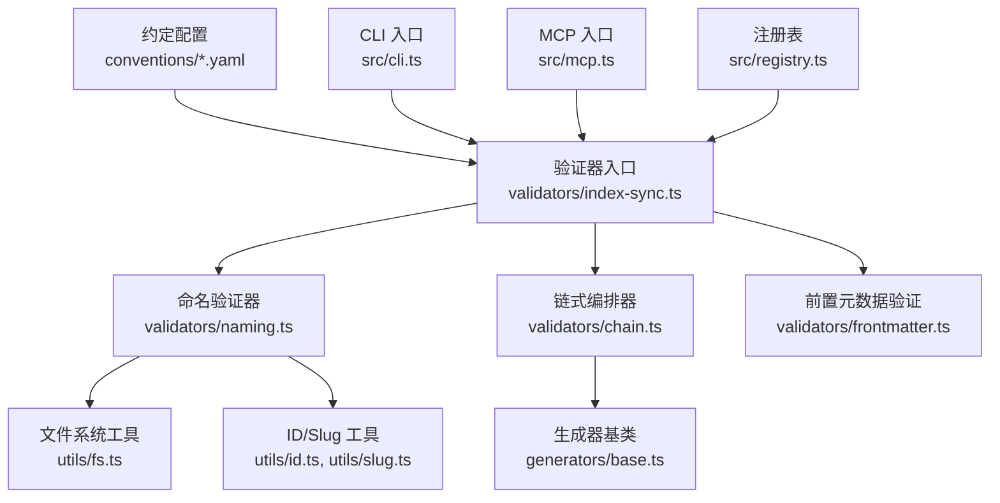
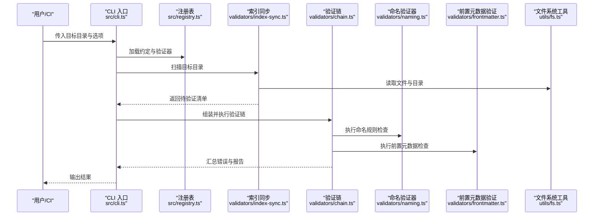
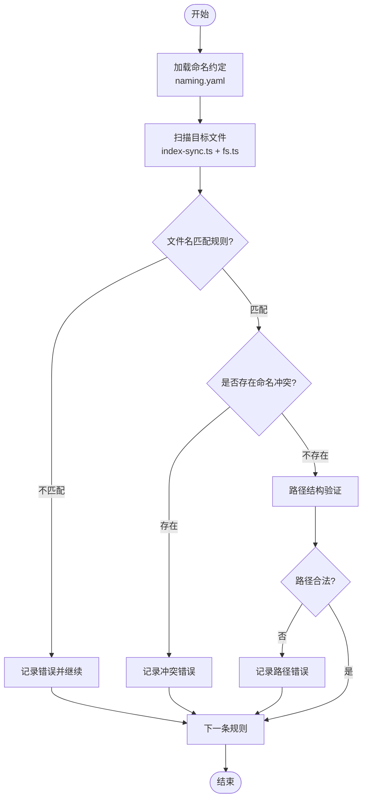
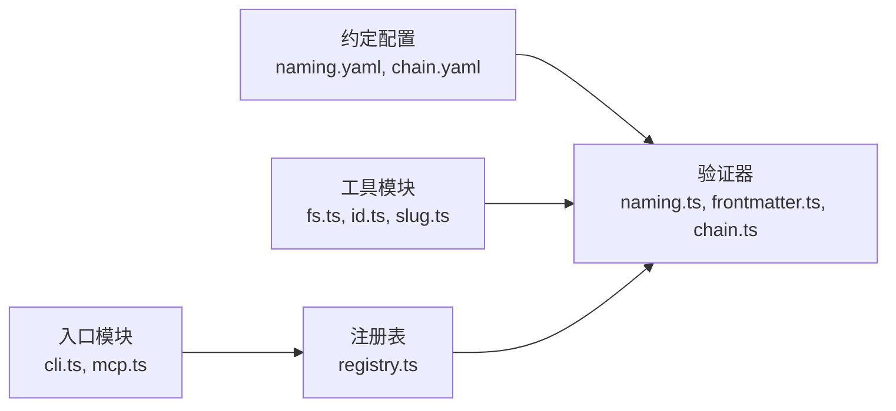

# 命名规范验证器

<cite>
**本文引用的文件**   
- [naming.yaml](file://skills/shared/engineering-docs/conventions/naming.yaml)
- [chain.yaml](file://skills/shared/engineering-docs/conventions/chain.yaml)
- [naming.ts](file://skills/shared/engineering-docs/scripts/src/validators/naming.ts)
- [chain.ts](file://skills/shared/engineering-docs/scripts/src/validators/chain.ts)
- [index-sync.ts](file://skills/shared/engineering-docs/scripts/src/validators/index-sync.ts)
- [frontmatter.ts](file://skills/shared/engineering-docs/scripts/src/validators/frontmatter.ts)
- [cli.ts](file://skills/shared/engineering-docs/scripts/src/cli.ts)
- [mcp.ts](file://skills/shared/engineering-docs/scripts/src/mcp.ts)
- [registry.ts](file://skills/shared/engineering-docs/scripts/src/registry.ts)
- [fs.ts](file://skills/shared/engineering-docs/scripts/src/utils/fs.ts)
- [id.ts](file://skills/shared/engineering-docs/scripts/src/utils/id.ts)
- [slug.ts](file://skills/shared/engineering-docs/scripts/src/utils/slug.ts)
- [base.ts](file://skills/shared/engineering-docs/scripts/src/generators/base.ts)
- [README.md](file://skills/shared/engineering-docs/scripts/README.md)
- [package.json](file://skills/shared/engineering-docs/scripts/package.json)
- [tsconfig.json](file://skills/shared/engineering-docs/scripts/tsconfig.json)
- [vitest.config.ts](file://skills/shared/engineering-docs/scripts/vitest.config.ts)
- [chain.test.ts](file://skills/shared/engineering-docs/scripts/src/__tests__/chain.test.ts)
- [generators.test.ts](file://skills/shared/engineering-docs/scripts/src/__tests__/generators.test.ts)
- [validators.test.ts](file://skills/shared/engineering-docs/scripts/src/__tests__/validators.test.ts)
</cite>

## 目录
1. [简介](#简介)
2. [项目结构](#项目结构)
3. [核心组件](#核心组件)
4. [架构总览](#架构总览)
5. [详细组件分析](#详细组件分析)
6. [依赖关系分析](#依赖关系分析)
7. [性能考虑](#性能考虑)
8. [故障排查指南](#故障排查指南)
9. [结论](#结论)
10. [附录](#附录)

## 简介
本文件为“命名规范验证器”的实现文档，聚焦于工程文档与脚本工具中的命名约定检查能力。内容涵盖：
- 文件名模式匹配规则与路径结构校验
- 命名冲突检测机制
- 支持的命名模板与自定义规则配置
- 正则表达式模式与错误消息定制
- 实际项目中的配置与应用案例
- 常见违规错误与修复建议

该验证器以配置文件驱动（YAML）为核心，结合 TypeScript 实现的可插拔验证链，提供 CLI 与 MCP 两种运行方式，便于在本地、CI 或 Agent 工作流中集成。

## 项目结构
与命名规范验证相关的代码与配置主要位于以下位置：
- 约定定义：conventions 目录下的 YAML 文件
- 验证器实现：scripts/src/validators 目录
- 辅助工具：scripts/src/utils 目录
- 生成器基础：scripts/src/generators 目录
- 入口与编排：scripts/src/cli.ts、scripts/src/mcp.ts、scripts/src/registry.ts
- 测试用例：scripts/src/__tests__ 目录
- 构建与运行：scripts/package.json、scripts/tsconfig.json、scripts/vitest.config.ts

图表来源
- [naming.yaml](file://skills/shared/engineering-docs/conventions/naming.yaml)
- [chain.yaml](file://skills/shared/engineering-docs/conventions/chain.yaml)
- [index-sync.ts](file://skills/shared/engineering-docs/scripts/src/validators/index-sync.ts)
- [naming.ts](file://skills/shared/engineering-docs/scripts/src/validators/naming.ts)
- [chain.ts](file://skills/shared/engineering-docs/scripts/src/validators/chain.ts)
- [frontmatter.ts](file://skills/shared/engineering-docs/scripts/src/validators/frontmatter.ts)
- [fs.ts](file://skills/shared/engineering-docs/scripts/src/utils/fs.ts)
- [id.ts](file://skills/shared/engineering-docs/scripts/src/utils/id.ts)
- [slug.ts](file://skills/shared/engineering-docs/scripts/src/utils/slug.ts)
- [base.ts](file://skills/shared/engineering-docs/scripts/src/generators/base.ts)
- [cli.ts](file://skills/shared/engineering-docs/scripts/src/cli.ts)
- [mcp.ts](file://skills/shared/engineering-docs/scripts/src/mcp.ts)
- [registry.ts](file://skills/shared/engineering-docs/scripts/src/registry.ts)

章节来源
- [naming.yaml](file://skills/shared/engineering-docs/conventions/naming.yaml)
- [chain.yaml](file://skills/shared/engineering-docs/conventions/chain.yaml)
- [index-sync.ts](file://skills/shared/engineering-docs/scripts/src/validators/index-sync.ts)
- [naming.ts](file://skills/shared/engineering-docs/scripts/src/validators/naming.ts)
- [chain.ts](file://skills/shared/engineering-docs/scripts/src/validators/chain.ts)
- [frontmatter.ts](file://skills/shared/engineering-docs/scripts/src/validators/frontmatter.ts)
- [cli.ts](file://skills/shared/engineering-docs/scripts/src/cli.ts)
- [mcp.ts](file://skills/shared/engineering-docs/scripts/src/mcp.ts)
- [registry.ts](file://skills/shared/engineering-docs/scripts/src/registry.ts)
- [fs.ts](file://skills/shared/engineering-docs/scripts/src/utils/fs.ts)
- [id.ts](file://skills/shared/engineering-docs/scripts/src/utils/id.ts)
- [slug.ts](file://skills/shared/engineering-docs/scripts/src/utils/slug.ts)
- [base.ts](file://skills/shared/engineering-docs/scripts/src/generators/base.ts)
- [package.json](file://skills/shared/engineering-docs/scripts/package.json)
- [tsconfig.json](file://skills/shared/engineering-docs/scripts/tsconfig.json)
- [vitest.config.ts](file://skills/shared/engineering-docs/scripts/vitest.config.ts)

## 核心组件
- 约定配置层
  - naming.yaml：定义命名模板、正则模式、作用域与错误消息等
  - chain.yaml：定义验证链的加载顺序与组合策略
- 验证器实现层
  - index-sync.ts：扫描目标目录并触发验证流程
  - naming.ts：基于约定的文件名与路径规则进行匹配与冲突检测
  - frontmatter.ts：校验文档前置元数据（如 ID、标题等）
  - chain.ts：将多个验证器串联执行，支持短路或汇总错误
- 工具与基础设施
  - fs.ts：文件与目录遍历、相对路径计算
  - id.ts / slug.ts：ID 生成与 Slug 规范化
  - base.ts：生成器基类，用于从模板生成符合规范的名称
- 运行入口
  - cli.ts：命令行接口，接收参数并调用验证器
  - mcp.ts：MCP 协议入口，供外部系统调用
  - registry.ts：注册与发现验证器与约定配置

章节来源
- [naming.yaml](file://skills/shared/engineering-docs/conventions/naming.yaml)
- [chain.yaml](file://skills/shared/engineering-docs/conventions/chain.yaml)
- [index-sync.ts](file://skills/shared/engineering-docs/scripts/src/validators/index-sync.ts)
- [naming.ts](file://skills/shared/engineering-docs/scripts/src/validators/naming.ts)
- [frontmatter.ts](file://skills/shared/engineering-docs/scripts/src/validators/frontmatter.ts)
- [chain.ts](file://skills/shared/engineering-docs/scripts/src/validators/chain.ts)
- [fs.ts](file://skills/shared/engineering-docs/scripts/src/utils/fs.ts)
- [id.ts](file://skills/shared/engineering-docs/scripts/src/utils/id.ts)
- [slug.ts](file://skills/shared/engineering-docs/scripts/src/utils/slug.ts)
- [base.ts](file://skills/shared/engineering-docs/scripts/src/generators/base.ts)
- [cli.ts](file://skills/shared/engineering-docs/scripts/src/cli.ts)
- [mcp.ts](file://skills/shared/engineering-docs/scripts/src/mcp.ts)
- [registry.ts](file://skills/shared/engineering-docs/scripts/src/registry.ts)

## 架构总览
命名规范验证器的整体架构采用“配置驱动 + 可插拔验证链”的模式：
- 配置层：通过 YAML 声明式定义命名模板、正则模式、作用域与错误消息
- 执行层：CLI/MCP 作为入口，解析参数后加载约定与验证链
- 验证层：按链顺序执行各验证器，收集并输出结果
- 工具层：提供文件系统、ID/Slug 等通用能力

图表来源
- [cli.ts](file://skills/shared/engineering-docs/scripts/src/cli.ts)
- [registry.ts](file://skills/shared/engineering-docs/scripts/src/registry.ts)
- [index-sync.ts](file://skills/shared/engineering-docs/scripts/src/validators/index-sync.ts)
- [chain.ts](file://skills/shared/engineering-docs/scripts/src/validators/chain.ts)
- [naming.ts](file://skills/shared/engineering-docs/scripts/src/validators/naming.ts)
- [frontmatter.ts](file://skills/shared/engineering-docs/scripts/src/validators/frontmatter.ts)
- [fs.ts](file://skills/shared/engineering-docs/scripts/src/utils/fs.ts)

## 详细组件分析

### 约定配置：命名模板与规则
- naming.yaml
  - 定义命名模板与正则模式，用于匹配文件名与路径片段
  - 支持按作用域（scope）限定规则适用范围
  - 支持自定义错误消息，便于团队统一提示风格
- chain.yaml
  - 定义验证链的执行顺序与组合策略
  - 支持启用/禁用特定验证器，以及错误聚合策略

章节来源
- [naming.yaml](file://skills/shared/engineering-docs/conventions/naming.yaml)
- [chain.yaml](file://skills/shared/engineering-docs/conventions/chain.yaml)

### 命名验证器：文件名模式匹配与冲突检测
- naming.ts
  - 基于 naming.yaml 的规则，对文件名与路径片段进行正则匹配
  - 检测命名冲突：同一作用域内重复或非法的名称组合
  - 支持路径结构验证：根据约定约束目录层级与命名片段
  - 错误消息来自约定配置，可按场景定制

图表来源
- [naming.ts](file://skills/shared/engineering-docs/scripts/src/validators/naming.ts)
- [index-sync.ts](file://skills/shared/engineering-docs/scripts/src/validators/index-sync.ts)
- [fs.ts](file://skills/shared/engineering-docs/scripts/src/utils/fs.ts)
- [naming.yaml](file://skills/shared/engineering-docs/conventions/naming.yaml)

章节来源
- [naming.ts](file://skills/shared/engineering-docs/scripts/src/validators/naming.ts)
- [index-sync.ts](file://skills/shared/engineering-docs/scripts/src/validators/index-sync.ts)
- [fs.ts](file://skills/shared/engineering-docs/scripts/src/utils/fs.ts)
- [naming.yaml](file://skills/shared/engineering-docs/conventions/naming.yaml)

### 前置元数据验证：文档字段一致性
- frontmatter.ts
  - 校验文档前置元数据（如 ID、标题、版本等）是否符合约定
  - 与命名验证器协同，确保文档内容与命名一致

章节来源
- [frontmatter.ts](file://skills/shared/engineering-docs/scripts/src/validators/frontmatter.ts)

### 验证链编排：多验证器串联与错误聚合
- chain.ts
  - 将命名验证器、前置元数据验证器等串联执行
  - 支持短路模式与错误汇总模式
  - 依据 chain.yaml 的配置决定执行顺序与策略

章节来源
- [chain.ts](file://skills/shared/engineering-docs/scripts/src/validators/chain.ts)
- [chain.yaml](file://skills/shared/engineering-docs/conventions/chain.yaml)

### 入口与运行方式：CLI 与 MCP
- cli.ts
  - 提供命令行参数解析与执行流程控制
  - 支持指定目标目录、过滤条件与输出格式
- mcp.ts
  - 暴露 MCP 协议接口，供外部系统或 Agent 调用
- registry.ts
  - 负责约定与验证器的注册与发现

章节来源
- [cli.ts](file://skills/shared/engineering-docs/scripts/src/cli.ts)
- [mcp.ts](file://skills/shared/engineering-docs/scripts/src/mcp.ts)
- [registry.ts](file://skills/shared/engineering-docs/scripts/src/registry.ts)

### 工具与生成器：ID/Slug 与模板生成
- fs.ts
  - 提供文件与目录遍历、路径归一化等能力
- id.ts / slug.ts
  - 提供 ID 生成与 Slug 规范化，保证命名唯一性与可读性
- base.ts
  - 生成器基类，用于从模板生成符合规范的名称与结构

章节来源
- [fs.ts](file://skills/shared/engineering-docs/scripts/src/utils/fs.ts)
- [id.ts](file://skills/shared/engineering-docs/scripts/src/utils/id.ts)
- [slug.ts](file://skills/shared/engineering-docs/scripts/src/utils/slug.ts)
- [base.ts](file://skills/shared/engineering-docs/scripts/src/generators/base.ts)

## 依赖关系分析
- 模块耦合
  - 验证器强依赖约定配置（naming.yaml、chain.yaml）
  - 验证器弱依赖工具模块（fs.ts、id.ts、slug.ts）
  - 入口模块（cli.ts、mcp.ts）通过注册表（registry.ts）动态加载
- 外部依赖
  - Node.js 运行时与 TypeScript 编译产物
  - 可选的包管理器（pnpm/npm/yarn）与测试框架（Vitest）

图表来源
- [naming.yaml](file://skills/shared/engineering-docs/conventions/naming.yaml)
- [chain.yaml](file://skills/shared/engineering-docs/conventions/chain.yaml)
- [naming.ts](file://skills/shared/engineering-docs/scripts/src/validators/naming.ts)
- [frontmatter.ts](file://skills/shared/engineering-docs/scripts/src/validators/frontmatter.ts)
- [chain.ts](file://skills/shared/engineering-docs/scripts/src/validators/chain.ts)
- [fs.ts](file://skills/shared/engineering-docs/scripts/src/utils/fs.ts)
- [id.ts](file://skills/shared/engineering-docs/scripts/src/utils/id.ts)
- [slug.ts](file://skills/shared/engineering-docs/scripts/src/utils/slug.ts)
- [cli.ts](file://skills/shared/engineering-docs/scripts/src/cli.ts)
- [mcp.ts](file://skills/shared/engineering-docs/scripts/src/mcp.ts)
- [registry.ts](file://skills/shared/engineering-docs/scripts/src/registry.ts)

章节来源
- [naming.yaml](file://skills/shared/engineering-docs/conventions/naming.yaml)
- [chain.yaml](file://skills/shared/engineering-docs/conventions/chain.yaml)
- [naming.ts](file://skills/shared/engineering-docs/scripts/src/validators/naming.ts)
- [frontmatter.ts](file://skills/shared/engineering-docs/scripts/src/validators/frontmatter.ts)
- [chain.ts](file://skills/shared/engineering-docs/scripts/src/validators/chain.ts)
- [fs.ts](file://skills/shared/engineering-docs/scripts/src/utils/fs.ts)
- [id.ts](file://skills/shared/engineering-docs/scripts/src/utils/id.ts)
- [slug.ts](file://skills/shared/engineering-docs/scripts/src/utils/slug.ts)
- [cli.ts](file://skills/shared/engineering-docs/scripts/src/cli.ts)
- [mcp.ts](file://skills/shared/engineering-docs/scripts/src/mcp.ts)
- [registry.ts](file://skills/shared/engineering-docs/scripts/src/registry.ts)

## 性能考虑
- 文件扫描优化
  - 使用增量扫描与缓存策略减少重复 IO
  - 合理设置忽略列表，避免扫描无关目录
- 正则匹配优化
  - 预编译正则表达式，避免重复创建开销
  - 将高频规则置于验证链前端，尽早失败
- 并行与批处理
  - 对独立文件的验证任务进行并发处理
  - 批量聚合错误信息，减少输出开销

[本节为通用指导，无需具体文件引用]

## 故障排查指南
- 常见问题
  - 规则未生效：检查 naming.yaml 的作用域与路径范围是否覆盖目标文件
  - 冲突误报：确认 ID/Slug 生成逻辑与命名模板的一致性
  - 路径校验失败：核对 chain.yaml 的验证顺序与路径约束
- 定位方法
  - 使用 CLI 的详细日志输出定位具体规则与文件
  - 通过单元测试（validators.test.ts、chain.test.ts）复现问题
- 修复建议
  - 调整命名模板或正则模式，使其与实际文件命名一致
  - 修正文档前置元数据，确保与文件名和路径结构一致
  - 更新 chain.yaml 以调整验证顺序与错误聚合策略

章节来源
- [validators.test.ts](file://skills/shared/engineering-docs/scripts/src/__tests__/validators.test.ts)
- [chain.test.ts](file://skills/shared/engineering-docs/scripts/src/__tests__/chain.test.ts)
- [naming.yaml](file://skills/shared/engineering-docs/conventions/naming.yaml)
- [chain.yaml](file://skills/shared/engineering-docs/conventions/chain.yaml)
- [cli.ts](file://skills/shared/engineering-docs/scripts/src/cli.ts)

## 结论
命名规范验证器通过“配置驱动 + 可插拔验证链”的方式，提供了灵活且可扩展的文件命名约定检查能力。借助 YAML 约定与 TypeScript 实现，团队可在不同场景下快速定义与落地命名规范，并通过 CLI 与 MCP 无缝集成到开发与 CI 流程中。建议持续完善约定配置与测试用例，以确保规范的一致性与可维护性。

[本节为总结性内容，无需具体文件引用]

## 附录
- 安装与运行
  - 参考 scripts/README.md 了解基本用法
  - 使用 package.json 中的脚本命令进行构建与测试
- 测试
  - 使用 Vitest 运行单元测试，覆盖验证器与生成器逻辑
- 扩展
  - 通过 registry.ts 注册新的验证器与约定
  - 在 naming.yaml 中新增命名模板与错误消息

章节来源
- [README.md](file://skills/shared/engineering-docs/scripts/README.md)
- [package.json](file://skills/shared/engineering-docs/scripts/package.json)
- [vitest.config.ts](file://skills/shared/engineering-docs/scripts/vitest.config.ts)
- [generators.test.ts](file://skills/shared/engineering-docs/scripts/src/__tests__/generators.test.ts)
- [registry.ts](file://skills/shared/engineering-docs/scripts/src/registry.ts)
- [naming.yaml](file://skills/shared/engineering-docs/conventions/naming.yaml)