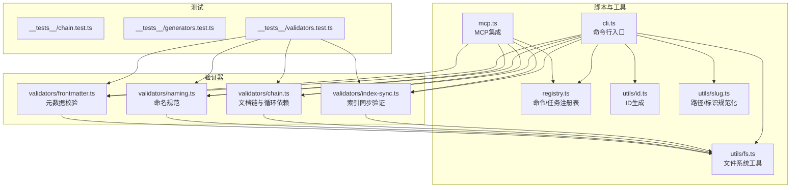
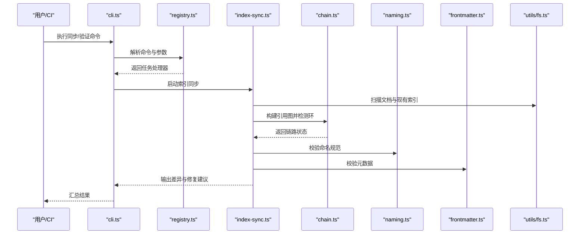
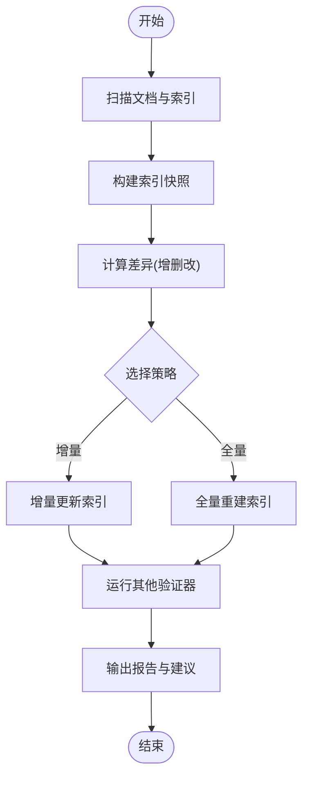
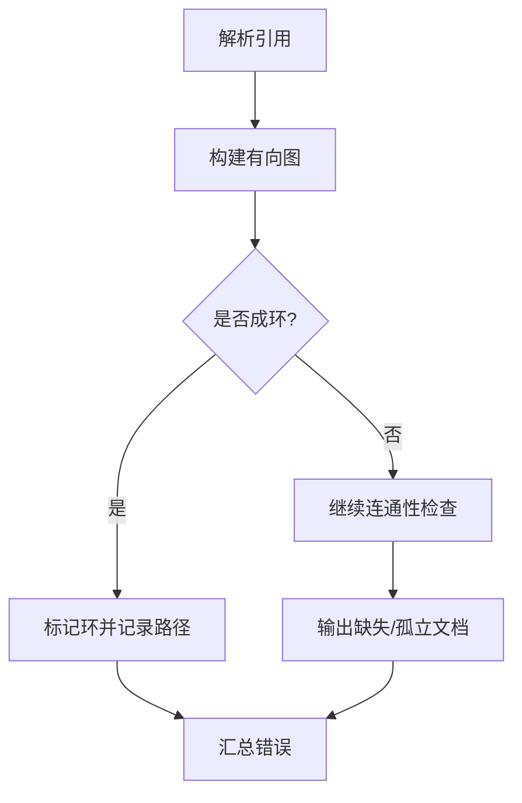
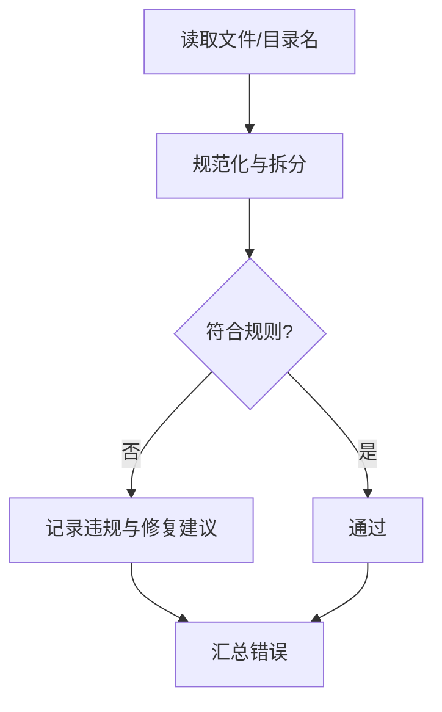
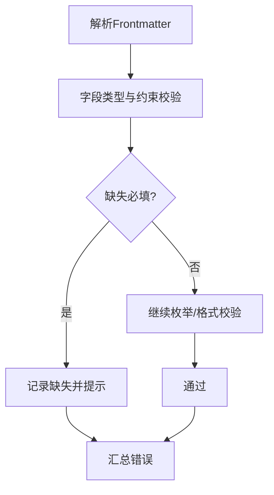
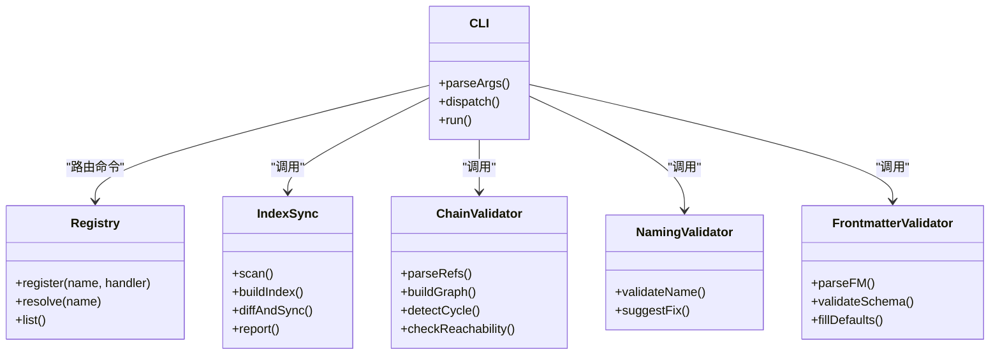
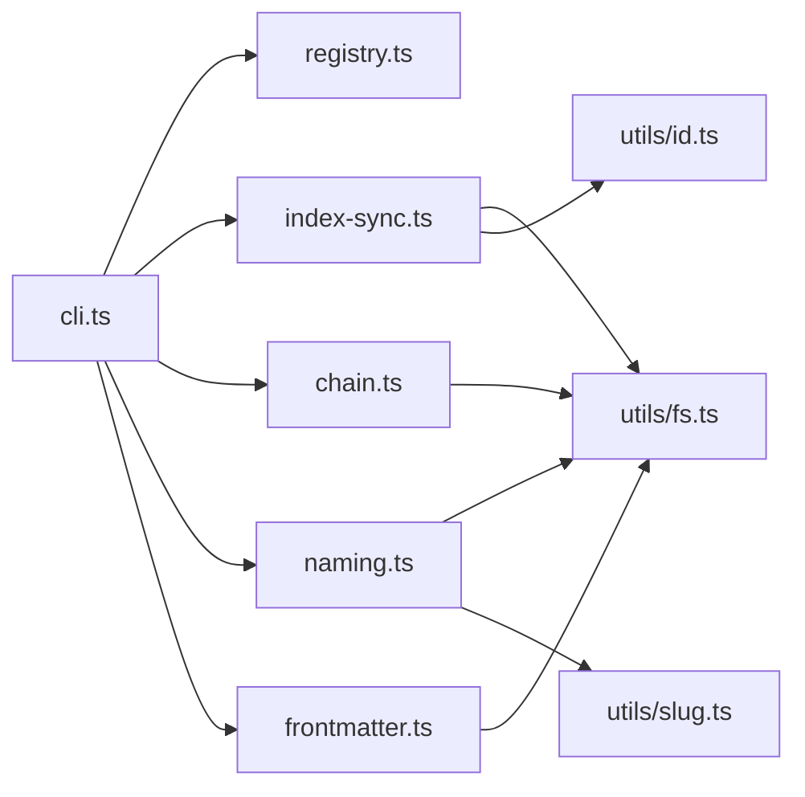

# 索引同步验证器

<cite>
**本文引用的文件**   
- [index-sync.ts](file://skills/shared/engineering-docs/scripts/src/validators/index-sync.ts)
- [chain.ts](file://skills/shared/engineering-docs/scripts/src/validators/chain.ts)
- [naming.ts](file://skills/shared/engineering-docs/scripts/src/validators/naming.ts)
- [frontmatter.ts](file://skills/shared/engineering-docs/scripts/src/validators/frontmatter.ts)
- [cli.ts](file://skills/shared/engineering-docs/scripts/src/cli.ts)
- [mcp.ts](file://skills/shared/engineering-docs/scripts/src/mcp.ts)
- [registry.ts](file://skills/shared/engineering-docs/scripts/src/registry.ts)
- [fs.ts](file://skills/shared/engineering-docs/scripts/src/utils/fs.ts)
- [id.ts](file://skills/shared/engineering-docs/scripts/src/utils/id.ts)
- [slug.ts](file://skills/shared/engineering-docs/scripts/src/utils/slug.ts)
- [package.json](file://skills/shared/engineering-docs/scripts/package.json)
- [tsconfig.json](file://skills/shared/engineering-docs/scripts/tsconfig.json)
- [vitest.config.ts](file://skills/shared/engineering-docs/scripts/vitest.config.ts)
- [chain.test.ts](file://skills/shared/engineering-docs/scripts/src/__tests__/chain.test.ts)
- [generators.test.ts](file://skills/shared/engineering-docs/scripts/src/__tests__/generators.test.ts)
- [validators.test.ts](file://skills/shared/engineering-docs/scripts/src/__tests__/validators.test.ts)
</cite>

## 目录
1. [简介](#简介)
2. [项目结构](#项目结构)
3. [核心组件](#核心组件)
4. [架构总览](#架构总览)
5. [详细组件分析](#详细组件分析)
6. [依赖关系分析](#依赖关系分析)
7. [性能考虑](#性能考虑)
8. [故障排查指南](#故障排查指南)
9. [结论](#结论)
10. [附录](#附录)

## 简介
本技术文档围绕“索引同步验证器”展开，聚焦以下目标：
- 文件关联关系检查机制：文档链验证、引用完整性检查与循环依赖检测。
- 索引文件的生成与维护逻辑：自动索引更新与手动同步操作。
- 配置参数说明：验证规则定制与异常处理策略。
- 实战场景：复杂文档结构的验证方法与常见索引同步问题的解决方案。

该能力位于工程化文档工具集中，通过脚本与测试用例提供可复用的校验与同步流程，支持命令行与MCP集成方式。

## 项目结构
本项目采用按职责划分的模块化结构，核心代码集中在 scripts 子目录中，包含验证器、CLI入口、MCP集成、注册表、工具函数与单元测试等。

图表来源
- [cli.ts](file://skills/shared/engineering-docs/scripts/src/cli.ts)
- [mcp.ts](file://skills/shared/engineering-docs/scripts/src/mcp.ts)
- [registry.ts](file://skills/shared/engineering-docs/scripts/src/registry.ts)
- [index-sync.ts](file://skills/shared/engineering-docs/scripts/src/validators/index-sync.ts)
- [chain.ts](file://skills/shared/engineering-docs/scripts/src/validators/chain.ts)
- [naming.ts](file://skills/shared/engineering-docs/scripts/src/validators/naming.ts)
- [frontmatter.ts](file://skills/shared/engineering-docs/scripts/src/validators/frontmatter.ts)
- [fs.ts](file://skills/shared/engineering-docs/scripts/src/utils/fs.ts)
- [id.ts](file://skills/shared/engineering-docs/scripts/src/utils/id.ts)
- [slug.ts](file://skills/shared/engineering-docs/scripts/src/utils/slug.ts)
- [chain.test.ts](file://skills/shared/engineering-docs/scripts/src/__tests__/chain.test.ts)
- [generators.test.ts](file://skills/shared/engineering-docs/scripts/src/__tests__/generators.test.ts)
- [validators.test.ts](file://skills/shared/engineering-docs/scripts/src/__tests__/validators.test.ts)

章节来源
- [package.json](file://skills/shared/engineering-docs/scripts/package.json)
- [tsconfig.json](file://skills/shared/engineering-docs/scripts/tsconfig.json)
- [vitest.config.ts](file://skills/shared/engineering-docs/scripts/vitest.config.ts)

## 核心组件
- 索引同步验证器（index-sync）：负责扫描文档集合、构建索引、对比差异并执行增量或全量同步，确保索引与源文档一致。
- 文档链与循环依赖（chain）：解析文档间的引用关系，构建有向图，进行连通性、可达性与环检测，保障文档链路完整且无环。
- 命名规范（naming）：对文件名、目录名、标识符进行一致性校验，避免非法字符与冲突。
- 前端元数据（frontmatter）：校验文档头部字段类型、必填项与约束，保证结构化信息正确。
- CLI与MCP：提供命令行与MCP两种调用入口，统一调度验证与同步任务。
- 注册表（registry）：集中管理命令/任务定义与路由，便于扩展。
- 工具库（fs/id/slug）：封装文件系统遍历、ID生成与路径/标识规范化等通用能力。

章节来源
- [index-sync.ts](file://skills/shared/engineering-docs/scripts/src/validators/index-sync.ts)
- [chain.ts](file://skills/shared/engineering-docs/scripts/src/validators/chain.ts)
- [naming.ts](file://skills/shared/engineering-docs/scripts/src/validators/naming.ts)
- [frontmatter.ts](file://skills/shared/engineering-docs/scripts/src/validators/frontmatter.ts)
- [cli.ts](file://skills/shared/engineering-docs/scripts/src/cli.ts)
- [mcp.ts](file://skills/shared/engineering-docs/scripts/src/mcp.ts)
- [registry.ts](file://skills/shared/engineering-docs/scripts/src/registry.ts)
- [fs.ts](file://skills/shared/engineering-docs/scripts/src/utils/fs.ts)
- [id.ts](file://skills/shared/engineering-docs/scripts/src/utils/id.ts)
- [slug.ts](file://skills/shared/engineering-docs/scripts/src/utils/slug.ts)

## 架构总览
系统以“验证+同步”为核心闭环：CLI/MCP接收指令，经注册表分发到具体验证器；验证器读取文档与索引，执行规则校验与差异计算；必要时触发索引重建或增量更新；最终输出结果与错误报告。

图表来源
- [cli.ts](file://skills/shared/engineering-docs/scripts/src/cli.ts)
- [registry.ts](file://skills/shared/engineering-docs/scripts/src/registry.ts)
- [index-sync.ts](file://skills/shared/engineering-docs/scripts/src/validators/index-sync.ts)
- [chain.ts](file://skills/shared/engineering-docs/scripts/src/validators/chain.ts)
- [naming.ts](file://skills/shared/engineering-docs/scripts/src/validators/naming.ts)
- [frontmatter.ts](file://skills/shared/engineering-docs/scripts/src/validators/frontmatter.ts)
- [fs.ts](file://skills/shared/engineering-docs/scripts/src/utils/fs.ts)

## 详细组件分析

### 索引同步验证器（index-sync）
职责与流程
- 扫描文档：基于约定目录与扩展名收集待验证文档集合。
- 构建索引：为每个文档生成唯一标识、路径映射、元数据摘要与引用列表。
- 差异计算：对比当前索引与磁盘状态，识别新增、删除、重命名与内容变更。
- 同步策略：支持全量重建与增量更新；在检测到破坏性变更时回退至全量。
- 结果输出：生成变更清单、修复建议与失败原因定位。

关键实现要点
- 使用文件系统工具进行高效遍历与缓存，减少重复IO。
- 对大仓库采用分块与并发控制，避免内存峰值过高。
- 对索引版本与格式进行向后兼容处理，确保平滑升级。

图表来源
- [index-sync.ts](file://skills/shared/engineering-docs/scripts/src/validators/index-sync.ts)
- [fs.ts](file://skills/shared/engineering-docs/scripts/src/utils/fs.ts)

章节来源
- [index-sync.ts](file://skills/shared/engineering-docs/scripts/src/validators/index-sync.ts)
- [fs.ts](file://skills/shared/engineering-docs/scripts/src/utils/fs.ts)

### 文档链与循环依赖（chain）
职责与流程
- 引用解析：从文档内容与元数据中提取对外部文档的引用。
- 图构建：将文档作为节点、引用作为边，构建有向图。
- 连通性检查：确保所有被引用的文档存在且可达。
- 环检测：检测是否存在循环依赖，防止死锁与无限递归。
- 报告输出：给出缺失引用、孤立文档与环的具体位置。

图表来源
- [chain.ts](file://skills/shared/engineering-docs/scripts/src/validators/chain.ts)
- [fs.ts](file://skills/shared/engineering-docs/scripts/src/utils/fs.ts)

章节来源
- [chain.ts](file://skills/shared/engineering-docs/scripts/src/validators/chain.ts)
- [chain.test.ts](file://skills/shared/engineering-docs/scripts/src/__tests__/chain.test.ts)

### 命名规范（naming）
职责与流程
- 校验文件名、目录名是否符合约定（大小写、分隔符、特殊字符）。
- 校验标识符唯一性，避免冲突。
- 提供修复建议（如自动规范化 slug）。

图表来源
- [naming.ts](file://skills/shared/engineering-docs/scripts/src/validators/naming.ts)
- [slug.ts](file://skills/shared/engineering-docs/scripts/src/utils/slug.ts)

章节来源
- [naming.ts](file://skills/shared/engineering-docs/scripts/src/validators/naming.ts)
- [slug.ts](file://skills/shared/engineering-docs/scripts/src/utils/slug.ts)

### 前端元数据（frontmatter）
职责与流程
- 解析文档头部字段，校验类型、必填项与取值范围。
- 对枚举值、日期格式、URL等进行约束检查。
- 提供默认值填充与不合规字段的修复建议。

图表来源
- [frontmatter.ts](file://skills/shared/engineering-docs/scripts/src/validators/frontmatter.ts)

章节来源
- [frontmatter.ts](file://skills/shared/engineering-docs/scripts/src/validators/frontmatter.ts)

### CLI与MCP集成
- CLI：提供同步、验证、报告等命令，支持参数注入与输出格式化。
- MCP：暴露远程调用接口，便于外部系统集成与自动化流水线。
- 注册表：统一管理命令定义、参数解析与处理器路由。

图表来源
- [cli.ts](file://skills/shared/engineering-docs/scripts/src/cli.ts)
- [registry.ts](file://skills/shared/engineering-docs/scripts/src/registry.ts)
- [index-sync.ts](file://skills/shared/engineering-docs/scripts/src/validators/index-sync.ts)
- [chain.ts](file://skills/shared/engineering-docs/scripts/src/validators/chain.ts)
- [naming.ts](file://skills/shared/engineering-docs/scripts/src/validators/naming.ts)
- [frontmatter.ts](file://skills/shared/engineering-docs/scripts/src/validators/frontmatter.ts)

章节来源
- [cli.ts](file://skills/shared/engineering-docs/scripts/src/cli.ts)
- [mcp.ts](file://skills/shared/engineering-docs/scripts/src/mcp.ts)
- [registry.ts](file://skills/shared/engineering-docs/scripts/src/registry.ts)

## 依赖关系分析
- 模块内聚与耦合
  - 验证器层（index-sync、chain、naming、frontmatter）相对独立，主要依赖文件系统工具与ID/Slug工具。
  - CLI与MCP作为入口层，依赖注册表进行命令分发，再调用各验证器。
- 外部依赖
  - 包管理与构建配置由 package.json 与 tsconfig.json 管理。
  - 测试框架与断言由 vitest.config.ts 驱动。
- 潜在循环依赖
  - 验证器之间应避免直接相互导入，统一通过CLI/注册表编排，降低耦合风险。

图表来源
- [cli.ts](file://skills/shared/engineering-docs/scripts/src/cli.ts)
- [registry.ts](file://skills/shared/engineering-docs/scripts/src/registry.ts)
- [index-sync.ts](file://skills/shared/engineering-docs/scripts/src/validators/index-sync.ts)
- [chain.ts](file://skills/shared/engineering-docs/scripts/src/validators/chain.ts)
- [naming.ts](file://skills/shared/engineering-docs/scripts/src/validators/naming.ts)
- [frontmatter.ts](file://skills/shared/engineering-docs/scripts/src/validators/frontmatter.ts)
- [fs.ts](file://skills/shared/engineering-docs/scripts/src/utils/fs.ts)
- [id.ts](file://skills/shared/engineering-docs/scripts/src/utils/id.ts)
- [slug.ts](file://skills/shared/engineering-docs/scripts/src/utils/slug.ts)

章节来源
- [package.json](file://skills/shared/engineering-docs/scripts/package.json)
- [tsconfig.json](file://skills/shared/engineering-docs/scripts/tsconfig.json)
- [vitest.config.ts](file://skills/shared/engineering-docs/scripts/vitest.config.ts)

## 性能考虑
- 扫描与缓存
  - 对目录树进行一次性扫描并缓存，避免重复IO。
  - 对大仓库启用分块与并发限制，平衡吞吐与内存占用。
- 增量更新
  - 基于文件时间戳与内容哈希判断变更，仅处理受影响部分。
  - 对破坏性变更（如目录结构调整）自动降级为全量重建。
- 图算法优化
  - 环检测采用深度优先搜索与着色法，时间复杂度近似O(V+E)。
  - 对大规模引用图进行分层与剪枝，减少无效遍历。
- I/O与序列化
  - 索引文件采用流式读写与压缩存储，降低磁盘压力。
  - 对频繁访问的元数据进行内存缓存，注意生命周期管理。

[本节为通用性能指导，无需特定文件来源]

## 故障排查指南
常见问题与定位方法
- 索引不同步
  - 现象：索引与磁盘不一致，出现大量“新增/删除”条目。
  - 排查：确认是否有外部进程修改了文档结构；检查增量策略是否被破坏性变更触发；查看日志中的差异清单。
  - 解决：执行全量重建；清理临时索引文件；调整并发与缓存策略。
- 循环依赖
  - 现象：链验证失败，报告环路径。
  - 排查：根据环路径定位具体文档；检查引用是否正确指向目标文档；必要时引入中间抽象文档解耦。
  - 解决：重构引用关系；添加间接层；在模板中强制单向依赖。
- 命名冲突
  - 现象：命名规范校验失败，提示冲突或非法字符。
  - 排查：检查文件名与目录名的大小写与分隔符；确认slug生成规则。
  - 解决：遵循命名约定；使用自动化工具批量修正。
- 元数据缺失或不合法
  - 现象：frontmatter校验失败，提示必填字段缺失或类型错误。
  - 排查：对照schema检查字段；确认枚举值与日期格式。
  - 解决：补充缺失字段；修正格式；利用默认值填充功能。

章节来源
- [validators.test.ts](file://skills/shared/engineering-docs/scripts/src/__tests__/validators.test.ts)
- [chain.test.ts](file://skills/shared/engineering-docs/scripts/src/__tests__/chain.test.ts)
- [generators.test.ts](file://skills/shared/engineering-docs/scripts/src/__tests__/generators.test.ts)

## 结论
索引同步验证器通过“扫描—构建—差异—同步—验证”的闭环，确保文档索引与源内容保持一致，同时保障文档链的完整性与无环性。结合命名规范与元数据校验，形成完整的工程化文档质量保障体系。建议在CI中集成该工具，配合增量策略与报告输出，持续提升文档协作效率与可靠性。

[本节为总结性内容，无需特定文件来源]

## 附录
- 配置与扩展
  - 通过注册表扩展新验证器与命令，保持入口层稳定。
  - 在CLI参数中注入自定义规则与异常处理策略，适配不同团队规范。
- 测试与回归
  - 使用单元测试覆盖关键路径（链检测、命名、元数据），确保变更安全。
  - 针对复杂文档结构编写端到端用例，模拟真实场景。

[本节为概念性内容，无需特定文件来源]