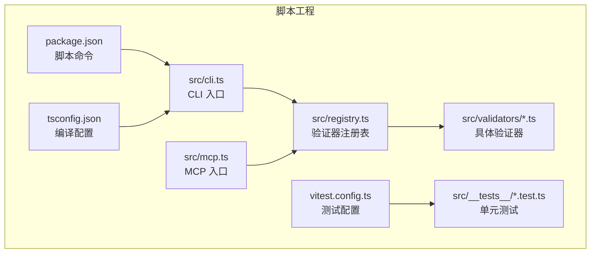
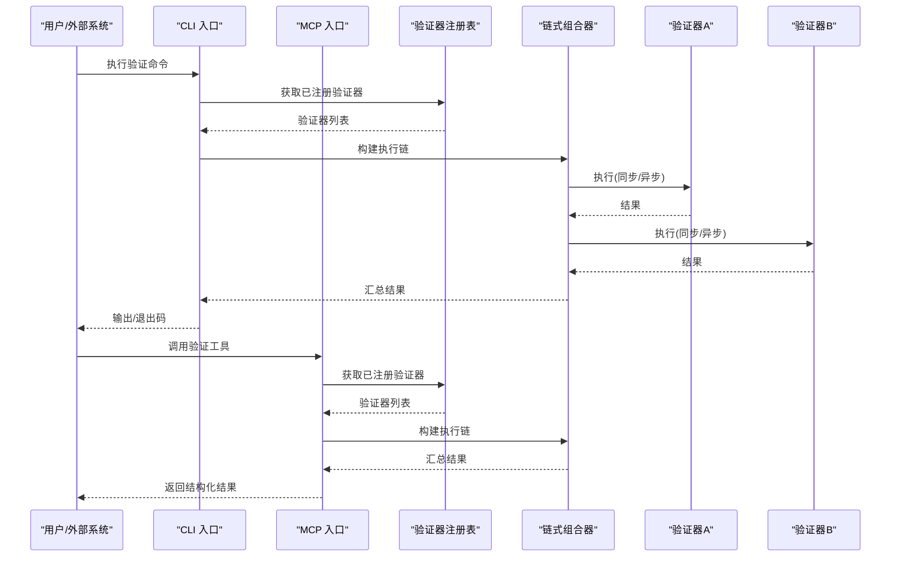
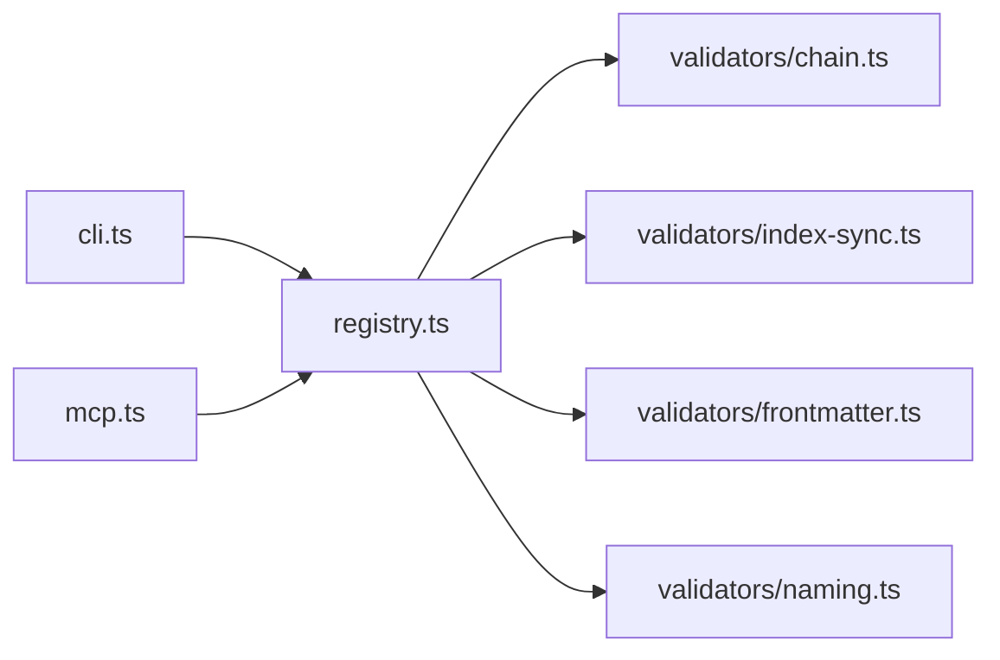

# 自定义验证器开发

<cite>
**本文引用的文件**   
- [scripts/src/validators/index-sync.ts](file://skills/shared/engineering-docs/scripts/src/validators/index-sync.ts)
- [scripts/src/validators/frontmatter.ts](file://skills/shared/engineering-docs/scripts/src/validators/frontmatter.ts)
- [scripts/src/validators/naming.ts](file://skills/shared/engineering-docs/scripts/src/validators/naming.ts)
- [scripts/src/validators/chain.ts](file://skills/shared/engineering-docs/scripts/src/validators/chain.ts)
- [scripts/src/cli.ts](file://skills/shared/engineering-docs/scripts/src/cli.ts)
- [scripts/src/registry.ts](file://skills/shared/engineering-docs/scripts/src/registry.ts)
- [scripts/src/mcp.ts](file://skills/shared/engineering-docs/scripts/src/mcp.ts)
- [scripts/package.json](file://skills/shared/engineering-docs/scripts/package.json)
- [scripts/tsconfig.json](file://skills/shared/engineering-docs/scripts/tsconfig.json)
- [scripts/vitest.config.ts](file://skills/shared/engineering-docs/scripts/vitest.config.ts)
- [scripts/src/__tests__/validators.test.ts](file://skills/shared/engineering-docs/scripts/src/__tests__/validators.test.ts)
</cite>

## 目录
1. [简介](#简介)
2. [项目结构](#项目结构)
3. [核心组件](#核心组件)
4. [架构总览](#架构总览)
5. [详细组件分析](#详细组件分析)
6. [依赖关系分析](#依赖关系分析)
7. [性能考虑](#性能考虑)
8. [故障排查指南](#故障排查指南)
9. [结论](#结论)
10. [附录](#附录)

## 简介
本指南面向需要扩展或实现“工程文档校验”能力的开发者，聚焦于在现有脚本工程中新增自定义验证器的完整流程。内容涵盖：
- 验证器接口规范与实现模板（同步/异步）
- 验证上下文对象的使用（文件信息、配置参数、工具函数）
- 错误处理与报告机制（错误类型定义、消息格式化）
- 调试与测试方法（单元测试、CLI 集成、MCP 集成）
- 多个实际示例（命名规则、Frontmatter 校验、链式组合等）

该指南基于仓库中 scripts 子工程的验证器实现进行提炼，确保读者可直接落地到代码库中。

## 项目结构
scripts 子工程位于 skills/shared/engineering-docs/scripts，采用 TypeScript + Vitest 的验证器框架，提供 CLI 与 MCP 两种运行入口。关键目录与职责如下：
- src/validators：验证器实现与组合逻辑
- src/cli.ts：命令行入口，负责解析参数并执行验证
- src/registry.ts：验证器注册表，集中管理已注册的验证器
- src/mcp.ts：MCP 服务入口，将验证能力暴露为可调用工具
- package.json：脚本命令与依赖声明
- tsconfig.json：编译配置
- vitest.config.ts：测试配置
- src/__tests__：单元测试用例

图表来源
- [scripts/src/cli.ts](file://skills/shared/engineering-docs/scripts/src/cli.ts)
- [scripts/src/registry.ts](file://skills/shared/engineering-docs/scripts/src/registry.ts)
- [scripts/src/mcp.ts](file://skills/shared/engineering-docs/scripts/src/mcp.ts)
- [scripts/package.json](file://skills/shared/engineering-docs/scripts/package.json)
- [scripts/vitest.config.ts](file://skills/shared/engineering-docs/scripts/vitest.config.ts)
- [scripts/tsconfig.json](file://skills/shared/engineering-docs/scripts/tsconfig.json)

章节来源
- [scripts/src/cli.ts](file://skills/shared/engineering-docs/scripts/src/cli.ts)
- [scripts/src/registry.ts](file://skills/shared/engineering-docs/scripts/src/registry.ts)
- [scripts/src/mcp.ts](file://skills/shared/engineering-docs/scripts/src/mcp.ts)
- [scripts/package.json](file://skills/shared/engineering-docs/scripts/package.json)
- [scripts/vitest.config.ts](file://skills/shared/engineering-docs/scripts/vitest.config.ts)
- [scripts/tsconfig.json](file://skills/shared/engineering-docs/scripts/tsconfig.json)

## 核心组件
- 验证器注册表（Registry）
  - 作用：集中管理所有已注册的验证器，支持按名称查找与批量执行。
  - 关键点：注册 API、获取列表、执行单个/全部验证器。
- CLI 入口
  - 作用：解析命令行参数（目标路径、过滤器、输出格式等），加载注册表并触发验证。
  - 关键点：参数校验、结果汇总、退出码控制。
- MCP 入口
  - 作用：将验证能力以 MCP 工具形式对外暴露，供外部系统调用。
  - 关键点：工具定义、参数映射、结果序列化。
- 验证器实现
  - 同步验证器：直接返回验证结果集合。
  - 异步验证器：返回 Promise，适合 I/O 密集型或并发场景。
- 链式组合器
  - 作用：将多个验证器串联执行，支持短路、聚合错误、顺序控制。
- 测试套件
  - 使用 Vitest 编写单测，覆盖边界条件与异常路径。

章节来源
- [scripts/src/registry.ts](file://skills/shared/engineering-docs/scripts/src/registry.ts)
- [scripts/src/cli.ts](file://skills/shared/engineering-docs/scripts/src/cli.ts)
- [scripts/src/mcp.ts](file://skills/shared/engineering-docs/scripts/src/mcp.ts)
- [scripts/src/validators/chain.ts](file://skills/shared/engineering-docs/scripts/src/validators/chain.ts)
- [scripts/src/__tests__/validators.test.ts](file://skills/shared/engineering-docs/scripts/src/__tests__/validators.test.ts)

## 架构总览
下图展示了从 CLI/MCP 到验证器执行的端到端流程，以及注册表与链式组合器的协作方式。

图表来源
- [scripts/src/cli.ts](file://skills/shared/engineering-docs/scripts/src/cli.ts)
- [scripts/src/mcp.ts](file://skills/shared/engineering-docs/scripts/src/mcp.ts)
- [scripts/src/registry.ts](file://skills/shared/engineering-docs/scripts/src/registry.ts)
- [scripts/src/validators/chain.ts](file://skills/shared/engineering-docs/scripts/src/validators/chain.ts)

## 详细组件分析

### 验证器接口规范与实现模板
- 通用接口要点
  - 输入：上下文对象（包含文件信息、配置参数、工具函数）
  - 输出：验证结果集合（成功/失败项，附带错误信息与定位）
  - 同步模式：直接返回结果数组
  - 异步模式：返回 Promise，便于并发与 I/O 操作
- 上下文对象建议字段
  - 文件信息：路径、相对路径、文件名、扩展名、元数据
  - 配置参数：来自 CLI 或配置文件的全局/局部设置
  - 工具函数：文件系统访问、正则匹配、日志记录、时间统计等
- 错误与报告
  - 错误类型：语法错误、语义错误、业务规则错误、I/O 错误等
  - 消息格式化：统一前缀、级别、位置信息、建议修复提示
- 实现模板（概念性说明）
  - 同步模板：接收上下文，遍历目标文件，逐条校验，收集结果并返回
  - 异步模板：接收上下文，使用并发策略（如 Promise.all）执行多任务，聚合结果

章节来源
- [scripts/src/validators/index-sync.ts](file://skills/shared/engineering-docs/scripts/src/validators/index-sync.ts)
- [scripts/src/validators/frontmatter.ts](file://skills/shared/engineering-docs/scripts/src/validators/frontmatter.ts)
- [scripts/src/validators/naming.ts](file://skills/shared/engineering-docs/scripts/src/validators/naming.ts)
- [scripts/src/validators/chain.ts](file://skills/shared/engineering-docs/scripts/src/validators/chain.ts)

### 同步验证器示例：index 文件一致性检查
- 目标：确保指定目录下 index 文件的结构与命名符合约定
- 步骤概览
  - 读取目录与文件列表
  - 对比预期结构与实际结构
  - 生成差异报告与修复建议
- 复杂度与优化
  - 时间复杂度：O(n)，n 为目标文件数量
  - 空间复杂度：O(k)，k 为差异条目数
  - 优化点：增量扫描、缓存目录快照

章节来源
- [scripts/src/validators/index-sync.ts](file://skills/shared/engineering-docs/scripts/src/validators/index-sync.ts)

### 异步验证器示例：Frontmatter 校验
- 目标：校验文档 Frontmatter 的必填字段、类型与取值范围
- 步骤概览
  - 并行读取多个文档
  - 解析 YAML/JSON Frontmatter
  - 应用规则集进行校验
  - 汇总错误并按文件分组
- 并发与错误隔离
  - 使用并发策略提升吞吐
  - 单个文件错误不影响其他文件校验

章节来源
- [scripts/src/validators/frontmatter.ts](file://skills/shared/engineering-docs/scripts/src/validators/frontmatter.ts)

### 同步验证器示例：命名规则校验
- 目标：对文件或目录命名进行规范化检查（大小写、分隔符、长度等）
- 步骤概览
  - 提取命名片段
  - 应用正则与业务规则
  - 输出不合规项与建议修正
- 可扩展性
  - 通过配置注入规则集，支持不同团队约定

章节来源
- [scripts/src/validators/naming.ts](file://skills/shared/engineering-docs/scripts/src/validators/naming.ts)

### 链式组合器：多验证器编排
- 功能
  - 将多个验证器串联执行，支持短路、聚合错误、顺序控制
  - 统一错误收集与结果合并
- 适用场景
  - 复杂流水线：先做基础规则，再做业务规则
  - 选择性执行：根据配置启用部分验证器

章节来源
- [scripts/src/validators/chain.ts](file://skills/shared/engineering-docs/scripts/src/validators/chain.ts)

### CLI 入口：参数解析与执行
- 功能
  - 解析目标路径、过滤条件、输出格式
  - 加载注册表并执行验证
  - 控制退出码与日志级别
- 集成点
  - 与注册表交互获取验证器
  - 与链式组合器协作编排执行

章节来源
- [scripts/src/cli.ts](file://skills/shared/engineering-docs/scripts/src/cli.ts)

### MCP 入口：工具化暴露
- 功能
  - 将验证能力封装为 MCP 工具
  - 参数映射与结果序列化
  - 错误上报与状态反馈
- 集成点
  - 与注册表交互
  - 与链式组合器协作

章节来源
- [scripts/src/mcp.ts](file://skills/shared/engineering-docs/scripts/src/mcp.ts)

### 注册表：验证器管理
- 功能
  - 注册/注销验证器
  - 按名称检索
  - 批量执行与结果聚合
- 设计要点
  - 高内聚低耦合：验证器仅关注自身规则
  - 可扩展：新增验证器无需修改核心逻辑

章节来源
- [scripts/src/registry.ts](file://skills/shared/engineering-docs/scripts/src/registry.ts)

### 测试套件：单元测试与断言
- 工具
  - Vitest 作为测试运行器
  - 断言库用于结果比对
- 实践
  - 针对每个验证器编写正向与反向用例
  - 模拟上下文与 I/O，避免真实文件系统依赖
  - 覆盖边界条件与异常路径

章节来源
- [scripts/src/__tests__/validators.test.ts](file://skills/shared/engineering-docs/scripts/src/__tests__/validators.test.ts)
- [scripts/vitest.config.ts](file://skills/shared/engineering-docs/scripts/vitest.config.ts)

## 依赖关系分析
- 模块间依赖
  - CLI 与 MCP 均依赖注册表
  - 注册表依赖各验证器实现
  - 链式组合器依赖注册表与验证器
- 外部依赖
  - 文件系统访问（Node.js fs）
  - YAML/JSON 解析（如 js-yaml、jsonc-parser）
  - 测试运行时（Vitest）

图表来源
- [scripts/src/cli.ts](file://skills/shared/engineering-docs/scripts/src/cli.ts)
- [scripts/src/mcp.ts](file://skills/shared/engineering-docs/scripts/src/mcp.ts)
- [scripts/src/registry.ts](file://skills/shared/engineering-docs/scripts/src/registry.ts)
- [scripts/src/validators/chain.ts](file://skills/shared/engineering-docs/scripts/src/validators/chain.ts)
- [scripts/src/validators/index-sync.ts](file://skills/shared/engineering-docs/scripts/src/validators/index-sync.ts)
- [scripts/src/validators/frontmatter.ts](file://skills/shared/engineering-docs/scripts/src/validators/frontmatter.ts)
- [scripts/src/validators/naming.ts](file://skills/shared/engineering-docs/scripts/src/validators/naming.ts)

章节来源
- [scripts/src/cli.ts](file://skills/shared/engineering-docs/scripts/src/cli.ts)
- [scripts/src/mcp.ts](file://skills/shared/engineering-docs/scripts/src/mcp.ts)
- [scripts/src/registry.ts](file://skills/shared/engineering-docs/scripts/src/registry.ts)
- [scripts/src/validators/chain.ts](file://skills/shared/engineering-docs/scripts/src/validators/chain.ts)
- [scripts/src/validators/index-sync.ts](file://skills/shared/engineering-docs/scripts/src/validators/index-sync.ts)
- [scripts/src/validators/frontmatter.ts](file://skills/shared/engineering-docs/scripts/src/validators/frontmatter.ts)
- [scripts/src/validators/naming.ts](file://skills/shared/engineering-docs/scripts/src/validators/naming.ts)

## 性能考虑
- 并发策略
  - 对 I/O 密集场景使用 Promise.all 或有限并发队列
  - 合理设置并发度以避免资源争用
- 增量校验
  - 缓存目录快照与文件哈希，仅校验变更文件
- 结果聚合
  - 流式输出与分批汇总，降低内存峰值
- 错误隔离
  - 单个验证器失败不应阻塞整体流程

[本节为通用指导，不涉及具体文件分析]

## 故障排查指南
- 常见问题
  - 验证器未注册：检查注册表初始化与导入路径
  - 上下文缺失：确认 CLI/MCP 传入的参数是否完整
  - 并发异常：捕获并记录单个任务错误，继续执行其余任务
  - 输出格式不一致：统一结果结构，确保消费者可解析
- 调试技巧
  - 增加日志级别与上下文快照
  - 使用最小复现用例快速定位问题
  - 借助 Vitest 的断言与堆栈信息

章节来源
- [scripts/src/cli.ts](file://skills/shared/engineering-docs/scripts/src/cli.ts)
- [scripts/src/mcp.ts](file://skills/shared/engineering-docs/scripts/src/mcp.ts)
- [scripts/src/registry.ts](file://skills/shared/engineering-docs/scripts/src/registry.ts)
- [scripts/src/__tests__/validators.test.ts](file://skills/shared/engineering-docs/scripts/src/__tests__/validators.test.ts)

## 结论
通过在注册表中集中管理验证器，并以链式组合器编排执行，本项目提供了可扩展、易维护的自定义验证器体系。开发者可基于同步/异步模板快速实现新规则，结合 CLI 与 MCP 双入口满足本地与远程调用需求。配合完善的测试套件与调试手段，能够高效保障验证质量与交付效率。

[本节为总结性内容，不涉及具体文件分析]

## 附录
- 安装与运行
  - 使用 package.json 中的脚本命令启动 CLI 或 MCP
  - 配置 tsconfig.json 与 vitest.config.ts 以适配开发与测试环境
- 最佳实践
  - 单一职责：每个验证器只关注一类规则
  - 可配置化：通过上下文注入规则参数
  - 可观测性：统一日志与指标采集
  - 可测试性：为每个验证器编写充分用例

章节来源
- [scripts/package.json](file://skills/shared/engineering-docs/scripts/package.json)
- [scripts/tsconfig.json](file://skills/shared/engineering-docs/scripts/tsconfig.json)
- [scripts/vitest.config.ts](file://skills/shared/engineering-docs/scripts/vitest.config.ts)