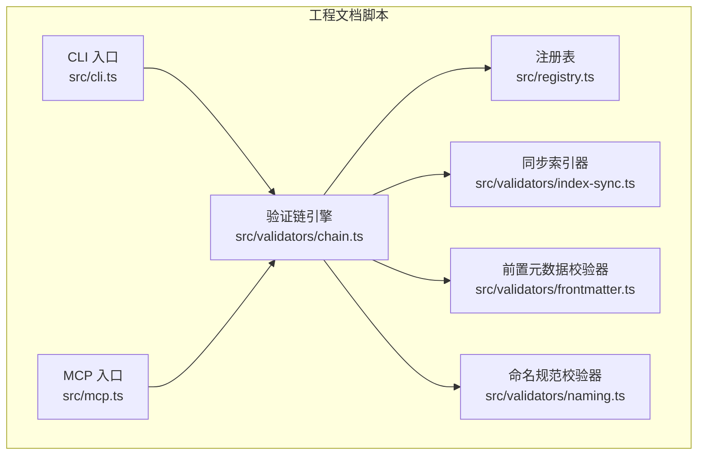
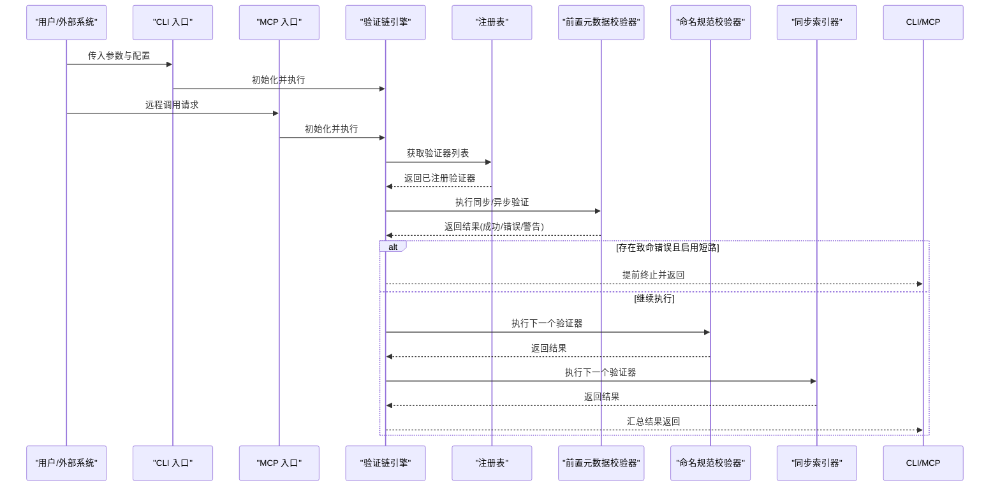
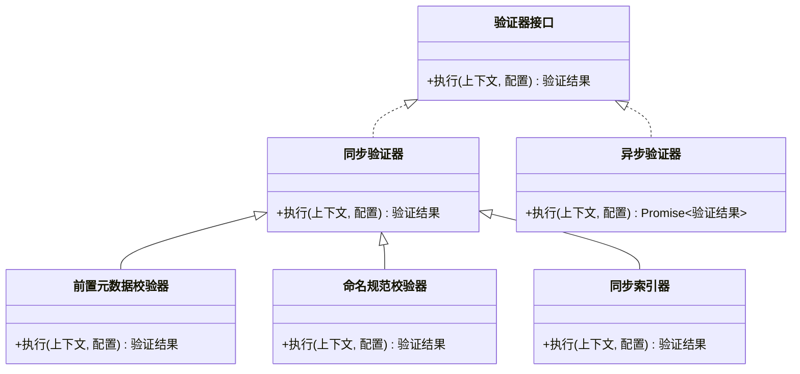
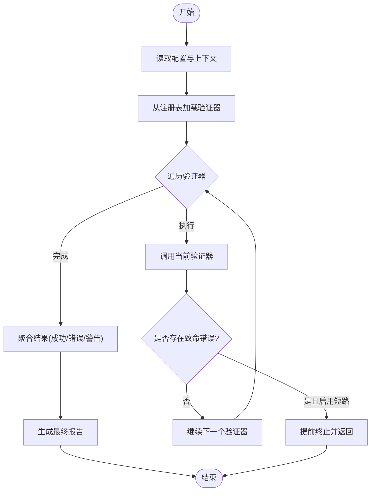
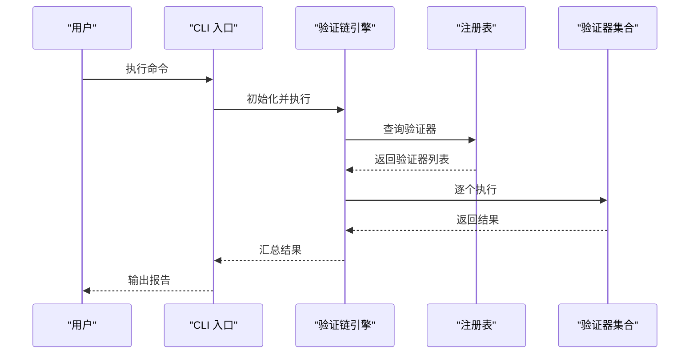
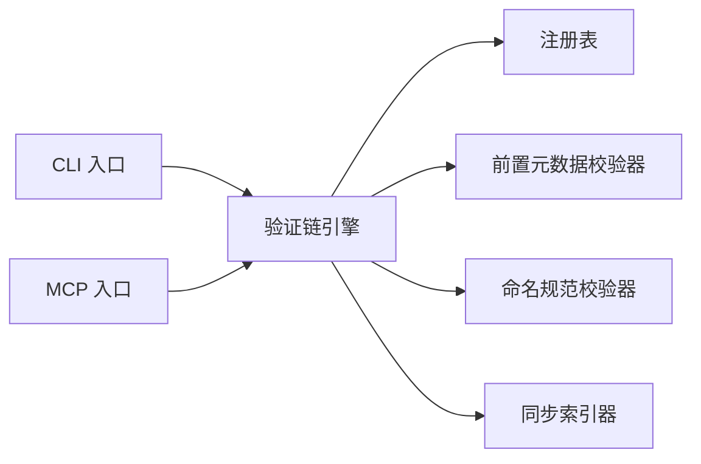

# 验证链核心机制

<cite>
**本文引用的文件**   
- [chain.ts](file://skills/shared/engineering-docs/scripts/src/validators/chain.ts)
- [index-sync.ts](file://skills/shared/engineering-docs/scripts/src/validators/index-sync.ts)
- [frontmatter.ts](file://skills/shared/engineering-docs/scripts/src/validators/frontmatter.ts)
- [naming.ts](file://skills/shared/engineering-docs/scripts/src/validators/naming.ts)
- [cli.ts](file://skills/shared/engineering-docs/scripts/src/cli.ts)
- [registry.ts](file://skills/shared/engineering-docs/scripts/src/registry.ts)
- [mcp.ts](file://skills/shared/engineering-docs/scripts/src/mcp.ts)
- [package.json](file://skills/shared/engineering-docs/scripts/package.json)
</cite>

## 目录
1. [简介](#简介)
2. [项目结构](#项目结构)
3. [核心组件](#核心组件)
4. [架构总览](#架构总览)
5. [详细组件分析](#详细组件分析)
6. [依赖关系分析](#依赖关系分析)
7. [性能考虑](#性能考虑)
8. [故障排查指南](#故障排查指南)
9. [结论](#结论)
10. [附录](#附录)

## 简介
本技术文档围绕“验证链”的核心机制展开，聚焦于以下目标：
- 解释验证器的注册机制与链式执行流程
- 阐述错误传播策略与结果数据结构（成功、错误、警告）
- 定义同步与异步验证器接口及实现方式
- 说明验证链的配置选项与执行参数
- 提供构建与管理验证链的完整示例路径，覆盖复杂场景

该机制位于工程文档脚本子项目中，主要实现在 validators 目录下，并通过 CLI 和 MCP 入口进行调用。

## 项目结构
与验证链相关的代码集中在 engineering-docs/scripts 子项目中，关键目录与职责如下：
- src/validators: 验证器实现与链式执行引擎
- src/cli.ts: 命令行入口，负责解析参数并触发验证链执行
- src/registry.ts: 全局注册表，用于管理验证器实例
- src/mcp.ts: MCP 协议入口，暴露远程可调用能力
- package.json: 依赖与脚本配置

图表来源
- [cli.ts](file://skills/shared/engineering-docs/scripts/src/cli.ts)
- [mcp.ts](file://skills/shared/engineering-docs/scripts/src/mcp.ts)
- [registry.ts](file://skills/shared/engineering-docs/scripts/src/registry.ts)
- [chain.ts](file://skills/shared/engineering-docs/scripts/src/validators/chain.ts)
- [index-sync.ts](file://skills/shared/engineering-docs/scripts/src/validators/index-sync.ts)
- [frontmatter.ts](file://skills/shared/engineering-docs/scripts/src/validators/frontmatter.ts)
- [naming.ts](file://skills/shared/engineering-docs/scripts/src/validators/naming.ts)

章节来源
- [package.json](file://skills/shared/engineering-docs/scripts/package.json)

## 核心组件
- 验证器接口
  - 同步验证器：接收上下文与配置，返回验证结果对象
  - 异步验证器：以 Promise 形式返回验证结果对象
- 验证结果数据结构
  - 成功状态：布尔或枚举表示通过与否
  - 错误信息：结构化错误列表，包含消息、位置、严重级别等
  - 警告处理：可选的警告列表，不影响整体通过但需记录
- 验证链引擎
  - 负责按序执行多个验证器
  - 支持短路失败与继续执行两种模式
  - 聚合各阶段结果，统一输出
- 注册表
  - 集中管理已注册的验证器实例
  - 提供按名称查找与批量执行能力
- 入口层
  - CLI：解析命令行参数，加载配置，触发执行
  - MCP：对外暴露远程调用能力，适配外部系统

章节来源
- [chain.ts](file://skills/shared/engineering-docs/scripts/src/validators/chain.ts)
- [index-sync.ts](file://skills/shared/engineering-docs/scripts/src/validators/index-sync.ts)
- [frontmatter.ts](file://skills/shared/engineering-docs/scripts/src/validators/frontmatter.ts)
- [naming.ts](file://skills/shared/engineering-docs/scripts/src/validators/naming.ts)
- [registry.ts](file://skills/shared/engineering-docs/scripts/src/registry.ts)
- [cli.ts](file://skills/shared/engineering-docs/scripts/src/cli.ts)
- [mcp.ts](file://skills/shared/engineering-docs/scripts/src/mcp.ts)

## 架构总览
验证链的整体架构由“入口层—链式引擎—验证器—注册表”构成。入口层负责参数解析与调度；链式引擎协调执行顺序、错误传播与结果聚合；验证器实现具体规则；注册表提供发现与复用。

图表来源
- [cli.ts](file://skills/shared/engineering-docs/scripts/src/cli.ts)
- [mcp.ts](file://skills/shared/engineering-docs/scripts/src/mcp.ts)
- [chain.ts](file://skills/shared/engineering-docs/scripts/src/validators/chain.ts)
- [registry.ts](file://skills/shared/engineering-docs/scripts/src/registry.ts)
- [frontmatter.ts](file://skills/shared/engineering-docs/scripts/src/validators/frontmatter.ts)
- [naming.ts](file://skills/shared/engineering-docs/scripts/src/validators/naming.ts)
- [index-sync.ts](file://skills/shared/engineering-docs/scripts/src/validators/index-sync.ts)

## 详细组件分析

### 验证器接口与实现
- 接口设计
  - 同步验证器：直接返回结果对象
  - 异步验证器：返回 Promise，便于执行 I/O 或耗时操作
- 典型实现
  - 前置元数据校验器：检查文档前导元数据的完整性与格式
  - 命名规范校验器：依据命名约定对文件或资源进行一致性检查
  - 同步索引器：遍历并生成索引，确保引用一致性与可达性

图表来源
- [frontmatter.ts](file://skills/shared/engineering-docs/scripts/src/validators/frontmatter.ts)
- [naming.ts](file://skills/shared/engineering-docs/scripts/src/validators/naming.ts)
- [index-sync.ts](file://skills/shared/engineering-docs/scripts/src/validators/index-sync.ts)

章节来源
- [frontmatter.ts](file://skills/shared/engineering-docs/scripts/src/validators/frontmatter.ts)
- [naming.ts](file://skills/shared/engineering-docs/scripts/src/validators/naming.ts)
- [index-sync.ts](file://skills/shared/engineering-docs/scripts/src/validators/index-sync.ts)

### 验证链引擎与执行流程
- 执行流程要点
  - 初始化：根据配置选择要执行的验证器集合
  - 顺序执行：按注册顺序依次调用每个验证器
  - 错误传播：遇到致命错误时可选择短路终止或继续收集所有问题
  - 结果聚合：合并成功、错误与警告，形成最终报告
- 配置项与参数
  - 验证器清单：指定需要执行的验证器名称或类型
  - 严格模式：是否将警告视为失败
  - 并行度：控制并发执行数量（若支持）
  - 上下文注入：为验证器提供共享数据（如根路径、过滤条件）

图表来源
- [chain.ts](file://skills/shared/engineering-docs/scripts/src/validators/chain.ts)
- [registry.ts](file://skills/shared/engineering-docs/scripts/src/registry.ts)

章节来源
- [chain.ts](file://skills/shared/engineering-docs/scripts/src/validators/chain.ts)
- [registry.ts](file://skills/shared/engineering-docs/scripts/src/registry.ts)

### 入口层：CLI 与 MCP
- CLI 入口
  - 解析命令行参数（如目标路径、验证器选择、严格模式）
  - 初始化上下文与配置
  - 调用验证链引擎并输出结果
- MCP 入口
  - 接收远程调用请求
  - 映射到本地验证链执行
  - 返回标准化响应

图表来源
- [cli.ts](file://skills/shared/engineering-docs/scripts/src/cli.ts)
- [chain.ts](file://skills/shared/engineering-docs/scripts/src/validators/chain.ts)
- [registry.ts](file://skills/shared/engineering-docs/scripts/src/registry.ts)

章节来源
- [cli.ts](file://skills/shared/engineering-docs/scripts/src/cli.ts)
- [mcp.ts](file://skills/shared/engineering-docs/scripts/src/mcp.ts)

## 依赖关系分析
- 模块耦合
  - 入口层依赖链式引擎与注册表
  - 链式引擎依赖注册表与各验证器实现
  - 验证器之间尽量保持低耦合，通过上下文传递共享数据
- 外部依赖
  - 文件系统访问（用于扫描与索引）
  - JSON/YAML 解析（用于元数据与配置）
  - 日志与调试工具（用于诊断与排错）

图表来源
- [cli.ts](file://skills/shared/engineering-docs/scripts/src/cli.ts)
- [mcp.ts](file://skills/shared/engineering-docs/scripts/src/mcp.ts)
- [chain.ts](file://skills/shared/engineering-docs/scripts/src/validators/chain.ts)
- [registry.ts](file://skills/shared/engineering-docs/scripts/src/registry.ts)
- [frontmatter.ts](file://skills/shared/engineering-docs/scripts/src/validators/frontmatter.ts)
- [naming.ts](file://skills/shared/engineering-docs/scripts/src/validators/naming.ts)
- [index-sync.ts](file://skills/shared/engineering-docs/scripts/src/validators/index-sync.ts)

章节来源
- [package.json](file://skills/shared/engineering-docs/scripts/package.json)

## 性能考虑
- 避免重复 I/O：在上下文中缓存文件内容或索引结果，减少重复读取
- 合理并行：对无副作用的验证器采用有限并行，提升吞吐
- 短路优化：在严格模式下尽早终止，降低不必要的计算
- 增量验证：基于变更范围选择性执行相关验证器，提高响应速度

[本节为通用指导，不直接分析具体文件]

## 故障排查指南
- 常见问题定位
  - 验证器未注册：检查注册表初始化与加载逻辑
  - 参数缺失：确认 CLI 参数与配置项是否完整
  - 权限不足：检查文件系统访问权限
  - 超时与异常：查看日志与堆栈，定位具体验证器
- 建议的诊断步骤
  - 启用详细日志，观察执行顺序与中间结果
  - 使用最小化配置复现问题，逐步扩大范围
  - 隔离单个验证器单独执行，判断是否为特定规则导致

章节来源
- [cli.ts](file://skills/shared/engineering-docs/scripts/src/cli.ts)
- [chain.ts](file://skills/shared/engineering-docs/scripts/src/validators/chain.ts)
- [registry.ts](file://skills/shared/engineering-docs/scripts/src/registry.ts)

## 结论
验证链通过清晰的接口设计与统一的执行引擎，实现了可扩展、可组合的验证体系。借助注册表与入口层的解耦，系统具备良好的可维护性与扩展性。配合合理的配置与错误传播策略，可在保证质量的同时兼顾性能与用户体验。

[本节为总结性内容，不直接分析具体文件]

## 附录
- 构建与管理验证链的示例路径
  - 初始化与执行：参考 CLI 入口与链式引擎的实现路径
  - 注册自定义验证器：参考注册表的使用方式
  - 复杂场景处理：结合前置元数据校验、命名规范与索引器组合使用

章节来源
- [cli.ts](file://skills/shared/engineering-docs/scripts/src/cli.ts)
- [chain.ts](file://skills/shared/engineering-docs/scripts/src/validators/chain.ts)
- [registry.ts](file://skills/shared/engineering-docs/scripts/src/registry.ts)
- [frontmatter.ts](file://skills/shared/engineering-docs/scripts/src/validators/frontmatter.ts)
- [naming.ts](file://skills/shared/engineering-docs/scripts/src/validators/naming.ts)
- [index-sync.ts](file://skills/shared/engineering-docs/scripts/src/validators/index-sync.ts)