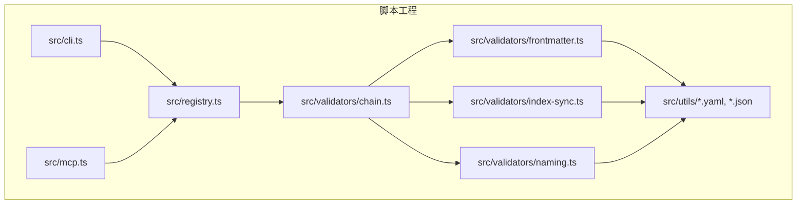
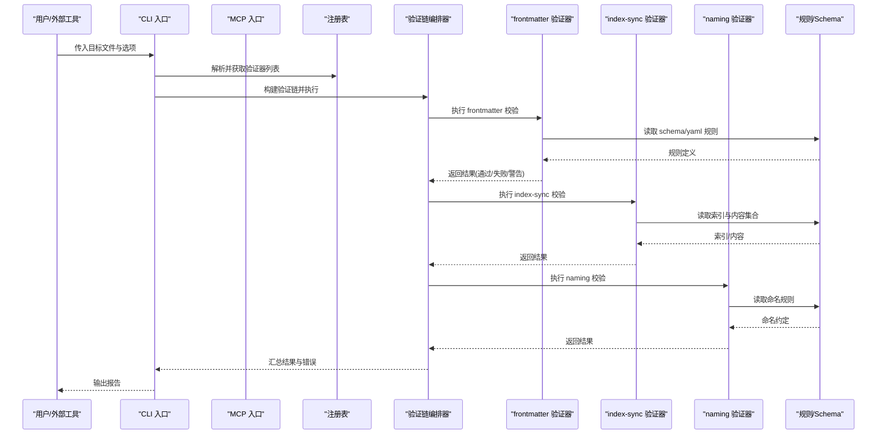
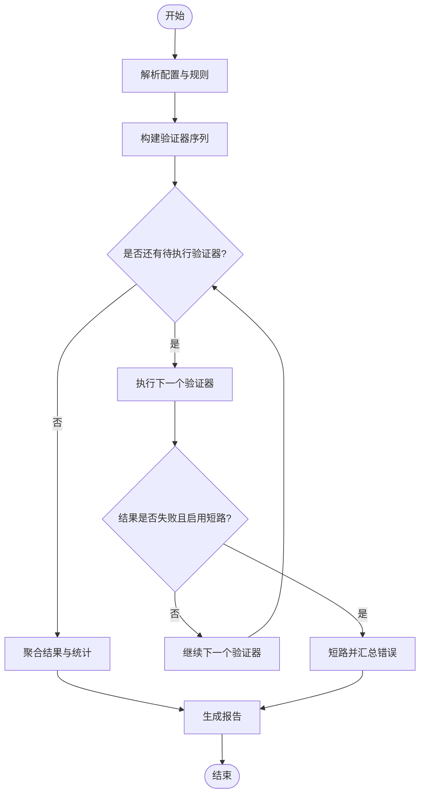
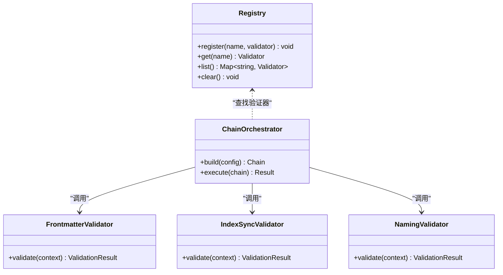
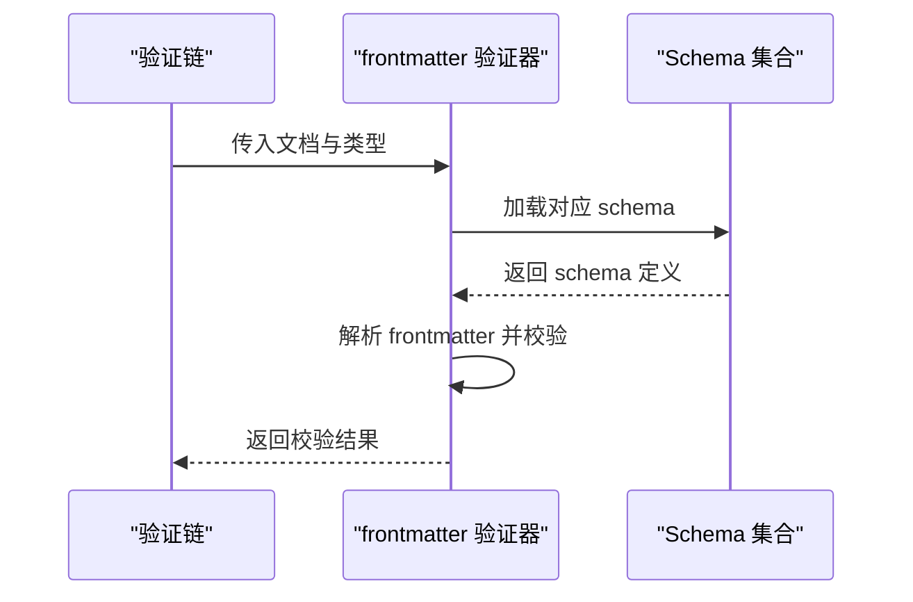
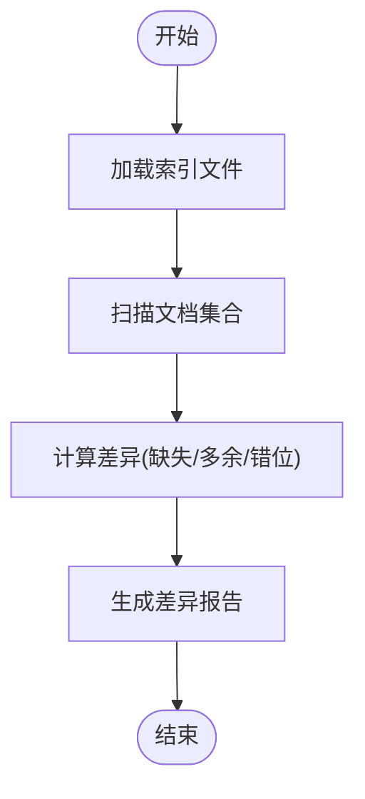
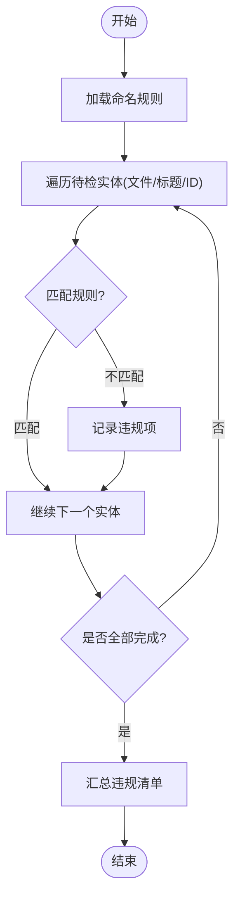
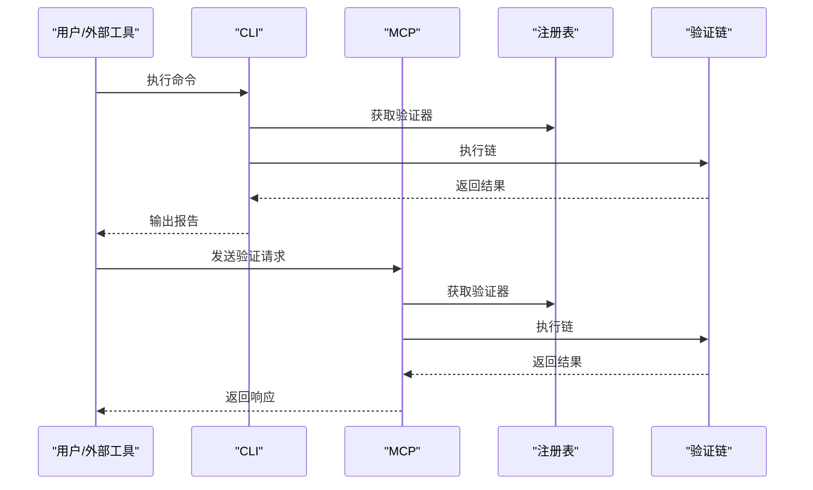
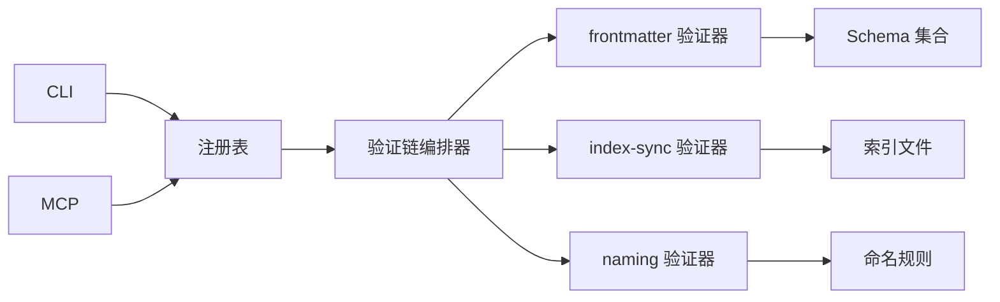

# 验证链系统

<cite>
**本文引用的文件**   
- [chain.ts](file://skills/shared/engineering-docs/scripts/src/validators/chain.ts)
- [frontmatter.ts](file://skills/shared/engineering-docs/scripts/src/validators/frontmatter.ts)
- [index-sync.ts](file://skills/shared/engineering-docs/scripts/src/validators/index-sync.ts)
- [naming.ts](file://skills/shared/engineering-docs/scripts/src/validators/naming.ts)
- [registry.ts](file://skills/shared/engineering-docs/scripts/src/registry.ts)
- [cli.ts](file://skills/shared/engineering-docs/scripts/src/cli.ts)
- [mcp.ts](file://skills/shared/engineering-docs/scripts/src/mcp.ts)
- [doc-chain.yaml](file://skills/shared/engineering-docs/scripts/src/utils/doc-chain.yaml)
- [naming.yaml](file://skills/shared/engineering-docs/scripts/src/utils/naming.yaml)
- [common-defs.schema.json](file://skills/shared/engineering-docs/scripts/src/utils/common-defs.schema.json)
- [prd.schema.json](file://skills/shared/engineering-docs/scripts/src/utils/prd.schema.json)
- [plan.schema.json](file://skills/shared/engineering-docs/scripts/src/utils/plan.schema.json)
- [sdd.schema.json](file://skills/shared/engineering-docs/scripts/src/utils/sdd.schema.json)
- [task.schema.json](file://skills/shared/engineering-docs/scripts/src/utils/task.schema.json)
- [release.schema.json](file://skills/shared/engineering-docs/scripts/src/utils/release.schema.json)
- [form.schema.json](file://skills/shared/engineering-docs/scripts/src/utils/form.schema.json)
- [module.schema.json](file://skills/shared/engineering-docs/scripts/src/utils/module.schema.json)
- [package.json](file://skills/shared/engineering-docs/scripts/package.json)
</cite>

## 目录
1. [简介](#简介)
2. [项目结构](#项目结构)
3. [核心组件](#核心组件)
4. [架构总览](#架构总览)
5. [详细组件分析](#详细组件分析)
6. [依赖关系分析](#依赖关系分析)
7. [性能与可扩展性](#性能与可扩展性)
8. [故障排查指南](#故障排查指南)
9. [结论](#结论)
10. [附录：API参考与最佳实践](#附录api参考与最佳实践)

## 简介
本仓库包含一套“文档工程化”的验证链系统，用于对工程文档进行结构化校验。其核心能力包括：
- 验证器注册与发现：集中管理验证器，支持按名称或类型动态加载。
- 链式执行：将多个验证器串联为一条验证链，顺序执行并聚合结果。
- 错误传播与短路：在配置下支持失败即停（短路）或继续执行后续验证器。
- 内置验证器：frontmatter（文档头部元数据）、index-sync（索引一致性）、naming（命名规范）。
- 规则与模式：通过 YAML/JSON Schema 定义规则，实现可配置的强约束。
- 集成入口：CLI 与 MCP 两种调用方式，便于本地运行与工具集成。

该文档面向开发者与使用者，提供从设计到落地的完整说明，帮助快速构建复杂验证规则、组合多验证器，并给出错误处理与性能优化建议。

## 项目结构
验证链系统位于 engineering-docs/scripts 子项目中，关键路径如下：
- 验证器实现：src/validators/*.ts
- 注册表与入口：src/registry.ts、src/cli.ts、src/mcp.ts
- 规则与模式：src/utils/*.yaml、*.json
- 测试与示例：src/__tests__/*

图表来源
- [chain.ts:1-200](file://skills/shared/engineering-docs/scripts/src/validators/chain.ts#L1-L200)
- [frontmatter.ts:1-200](file://skills/shared/engineering-docs/scripts/src/validators/frontmatter.ts#L1-L200)
- [index-sync.ts:1-200](file://skills/shared/engineering-docs/scripts/src/validators/index-sync.ts#L1-L200)
- [naming.ts:1-200](file://skills/shared/engineering-docs/scripts/src/validators/naming.ts#L1-L200)
- [registry.ts:1-200](file://skills/shared/engineering-docs/scripts/src/registry.ts#L1-L200)
- [cli.ts:1-200](file://skills/shared/engineering-docs/scripts/src/cli.ts#L1-L200)
- [mcp.ts:1-200](file://skills/shared/engineering-docs/scripts/src/mcp.ts#L1-L200)
- [doc-chain.yaml:1-200](file://skills/shared/engineering-docs/scripts/src/utils/doc-chain.yaml#L1-L200)
- [naming.yaml:1-200](file://skills/shared/engineering-docs/scripts/src/utils/naming.yaml#L1-L200)
- [common-defs.schema.json:1-200](file://skills/shared/engineering-docs/scripts/src/utils/common-defs.schema.json#L1-L200)
- [prd.schema.json:1-200](file://skills/shared/engineering-docs/scripts/src/utils/prd.schema.json#L1-L200)
- [plan.schema.json:1-200](file://skills/shared/engineering-docs/scripts/src/utils/plan.schema.json#L1-L200)
- [sdd.schema.json:1-200](file://skills/shared/engineering-docs/scripts/src/utils/sdd.schema.json#L1-L200)
- [task.schema.json:1-200](file://skills/shared/engineering-docs/scripts/src/utils/task.schema.json#L1-L200)
- [release.schema.json:1-200](file://skills/shared/engineering-docs/scripts/src/utils/release.schema.json#L1-L200)
- [form.schema.json:1-200](file://skills/shared/engineering-docs/scripts/src/utils/form.schema.json#L1-L200)
- [module.schema.json:1-200](file://skills/shared/engineering-docs/scripts/src/utils/module.schema.json#L1-L200)

章节来源
- [package.json:1-200](file://skills/shared/engineering-docs/scripts/package.json#L1-L200)

## 核心组件
- 验证器接口与契约
  - 每个验证器需暴露统一的执行函数，接收上下文参数（如目标文件、规则集等），返回标准化结果对象。
  - 结果对象包含状态、消息、详情等字段，用于统一上报与展示。
- 验证链编排器
  - 负责按序执行多个验证器，支持短路策略、并发控制、结果聚合与错误传播。
- 注册表
  - 维护验证器名称到实现的映射，支持按需加载与覆盖注册。
- 规则与模式
  - frontmatter 使用 JSON Schema 校验文档头部；naming 使用 YAML 规则匹配文件名/标题等；index-sync 基于索引文件与内容集合的一致性检查。
- 入口与集成
  - CLI 提供命令行参数驱动验证；MCP 提供进程间通信接口供外部工具调用。

章节来源
- [chain.ts:1-200](file://skills/shared/engineering-docs/scripts/src/validators/chain.ts#L1-L200)
- [registry.ts:1-200](file://skills/shared/engineering-docs/scripts/src/registry.ts#L1-L200)
- [frontmatter.ts:1-200](file://skills/shared/engineering-docs/scripts/src/validators/frontmatter.ts#L1-L200)
- [index-sync.ts:1-200](file://skills/shared/engineering-docs/scripts/src/validators/index-sync.ts#L1-L200)
- [naming.ts:1-200](file://skills/shared/engineering-docs/scripts/src/validators/naming.ts#L1-L200)
- [cli.ts:1-200](file://skills/shared/engineering-docs/scripts/src/cli.ts#L1-L200)
- [mcp.ts:1-200](file://skills/shared/engineering-docs/scripts/src/mcp.ts#L1-L200)

## 架构总览
下图展示了从入口到验证器的整体调用流程与数据流向。

图表来源
- [cli.ts:1-200](file://skills/shared/engineering-docs/scripts/src/cli.ts#L1-L200)
- [mcp.ts:1-200](file://skills/shared/engineering-docs/scripts/src/mcp.ts#L1-L200)
- [registry.ts:1-200](file://skills/shared/engineering-docs/scripts/src/registry.ts#L1-L200)
- [chain.ts:1-200](file://skills/shared/engineering-docs/scripts/src/validators/chain.ts#L1-L200)
- [frontmatter.ts:1-200](file://skills/shared/engineering-docs/scripts/src/validators/frontmatter.ts#L1-L200)
- [index-sync.ts:1-200](file://skills/shared/engineering-docs/scripts/src/validators/index-sync.ts#L1-L200)
- [naming.ts:1-200](file://skills/shared/engineering-docs/scripts/src/validators/naming.ts#L1-L200)
- [doc-chain.yaml:1-200](file://skills/shared/engineering-docs/scripts/src/utils/doc-chain.yaml#L1-L200)
- [naming.yaml:1-200](file://skills/shared/engineering-docs/scripts/src/utils/naming.yaml#L1-L200)
- [common-defs.schema.json:1-200](file://skills/shared/engineering-docs/scripts/src/utils/common-defs.schema.json#L1-L200)
- [prd.schema.json:1-200](file://skills/shared/engineering-docs/scripts/src/utils/prd.schema.json#L1-L200)
- [plan.schema.json:1-200](file://skills/shared/engineering-docs/scripts/src/utils/plan.schema.json#L1-L200)
- [sdd.schema.json:1-200](file://skills/shared/engineering-docs/scripts/src/utils/sdd.schema.json#L1-L200)
- [task.schema.json:1-200](file://skills/shared/engineering-docs/scripts/src/utils/task.schema.json#L1-L200)
- [release.schema.json:1-200](file://skills/shared/engineering-docs/scripts/src/utils/release.schema.json#L1-L200)
- [form.schema.json:1-200](file://skills/shared/engineering-docs/scripts/src/utils/form.schema.json#L1-L200)
- [module.schema.json:1-200](file://skills/shared/engineering-docs/scripts/src/utils/module.schema.json#L1-L200)

## 详细组件分析

### 验证链编排器（Chain Orchestrator）
- 职责
  - 根据配置组装验证器序列，支持短路策略与并发度控制。
  - 收集各验证器结果，生成最终报告。
  - 统一错误包装与传播，保证上层能清晰定位问题。
- 关键行为
  - 初始化阶段：解析配置、加载规则、注册验证器。
  - 执行阶段：按序或并行执行，遇到短路条件立即终止并返回。
  - 收尾阶段：汇总统计、格式化输出、记录日志。
- 复杂度与性能
  - 时间复杂度近似 O(N)（N 为验证器数量），可通过并发提升吞吐。
  - I/O 密集场景建议限制并发度，避免资源争用。

图表来源
- [chain.ts:1-200](file://skills/shared/engineering-docs/scripts/src/validators/chain.ts#L1-L200)

章节来源
- [chain.ts:1-200](file://skills/shared/engineering-docs/scripts/src/validators/chain.ts#L1-L200)

### 注册表（Registry）
- 职责
  - 维护验证器名称到实现的映射，支持覆盖与批量注册。
  - 提供按名称查找与按类型过滤的能力。
- 关键行为
  - 注册：添加或替换已有验证器。
  - 查询：根据名称或标签获取验证器实例。
  - 清理：释放资源或重置状态。
- 扩展点
  - 插件式加载：可从配置文件或模块中自动发现并注册。

图表来源
- [registry.ts:1-200](file://skills/shared/engineering-docs/scripts/src/registry.ts#L1-L200)
- [chain.ts:1-200](file://skills/shared/engineering-docs/scripts/src/validators/chain.ts#L1-L200)
- [frontmatter.ts:1-200](file://skills/shared/engineering-docs/scripts/src/validators/frontmatter.ts#L1-L200)
- [index-sync.ts:1-200](file://skills/shared/engineering-docs/scripts/src/validators/index-sync.ts#L1-L200)
- [naming.ts:1-200](file://skills/shared/engineering-docs/scripts/src/validators/naming.ts#L1-L200)

章节来源
- [registry.ts:1-200](file://skills/shared/engineering-docs/scripts/src/registry.ts#L1-L200)

### 内置验证器：frontmatter（文档头部元数据）
- 功能
  - 校验文档 frontmatter 字段是否符合对应类型的 JSON Schema。
  - 支持公共定义引用与自定义扩展。
- 输入
  - 文档内容与类型标识（如 PRD、PLAN、SDD 等）。
- 输出
  - 验证结果：通过/失败/警告，附带具体错误位置与提示。
- 规则来源
  - common-defs.schema.json、prd.schema.json、plan.schema.json、sdd.schema.json、task.schema.json、release.schema.json、form.schema.json、module.schema.json。

图表来源
- [frontmatter.ts:1-200](file://skills/shared/engineering-docs/scripts/src/validators/frontmatter.ts#L1-L200)
- [common-defs.schema.json:1-200](file://skills/shared/engineering-docs/scripts/src/utils/common-defs.schema.json#L1-L200)
- [prd.schema.json:1-200](file://skills/shared/engineering-docs/scripts/src/utils/prd.schema.json#L1-L200)
- [plan.schema.json:1-200](file://skills/shared/engineering-docs/scripts/src/utils/plan.schema.json#L1-L200)
- [sdd.schema.json:1-200](file://skills/shared/engineering-docs/scripts/src/utils/sdd.schema.json#L1-L200)
- [task.schema.json:1-200](file://skills/shared/engineering-docs/scripts/src/utils/task.schema.json#L1-L200)
- [release.schema.json:1-200](file://skills/shared/engineering-docs/scripts/src/utils/release.schema.json#L1-L200)
- [form.schema.json:1-200](file://skills/shared/engineering-docs/scripts/src/utils/form.schema.json#L1-L200)
- [module.schema.json:1-200](file://skills/shared/engineering-docs/scripts/src/utils/module.schema.json#L1-L200)

章节来源
- [frontmatter.ts:1-200](file://skills/shared/engineering-docs/scripts/src/validators/frontmatter.ts#L1-L200)

### 内置验证器：index-sync（索引一致性）
- 功能
  - 确保索引文件与实际文档集合一致，检测缺失、多余或错位的条目。
- 输入
  - 索引文件路径、文档根目录、匹配规则。
- 输出
  - 差异清单与修复建议。
- 典型场景
  - 新增或删除文档后未更新索引；重命名导致索引失效。

图表来源
- [index-sync.ts:1-200](file://skills/shared/engineering-docs/scripts/src/validators/index-sync.ts#L1-L200)

章节来源
- [index-sync.ts:1-200](file://skills/shared/engineering-docs/scripts/src/validators/index-sync.ts#L1-L200)

### 内置验证器：naming（命名规范）
- 功能
  - 依据命名规则校验文件名、标题、ID 等是否符合约定。
- 输入
  - 命名规则 YAML（如 naming.yaml）。
- 输出
  - 违规项清单与修正建议。
- 规则来源
  - naming.yaml 中的正则表达式、前缀/后缀、长度限制等。

图表来源
- [naming.ts:1-200](file://skills/shared/engineering-docs/scripts/src/validators/naming.ts#L1-L200)
- [naming.yaml:1-200](file://skills/shared/engineering-docs/scripts/src/utils/naming.yaml#L1-L200)

章节来源
- [naming.ts:1-200](file://skills/shared/engineering-docs/scripts/src/validators/naming.ts#L1-L200)

### 入口与集成（CLI/MCP）
- CLI
  - 提供命令行参数以指定目标文件、规则集、输出格式等。
  - 内部调用注册表与验证链编排器，最终输出报告。
- MCP
  - 提供进程间通信接口，允许外部工具以请求/响应方式触发验证。
  - 适合嵌入到编辑器、CI 流水线或自动化平台。

图表来源
- [cli.ts:1-200](file://skills/shared/engineering-docs/scripts/src/cli.ts#L1-L200)
- [mcp.ts:1-200](file://skills/shared/engineering-docs/scripts/src/mcp.ts#L1-L200)
- [registry.ts:1-200](file://skills/shared/engineering-docs/scripts/src/registry.ts#L1-L200)
- [chain.ts:1-200](file://skills/shared/engineering-docs/scripts/src/validators/chain.ts#L1-L200)

章节来源
- [cli.ts:1-200](file://skills/shared/engineering-docs/scripts/src/cli.ts#L1-L200)
- [mcp.ts:1-200](file://skills/shared/engineering-docs/scripts/src/mcp.ts#L1-L200)

## 依赖关系分析
- 组件耦合
  - 验证链编排器依赖注册表与具体验证器实现。
  - 验证器依赖规则与模式文件（YAML/JSON Schema）。
  - 入口层（CLI/MCP）仅依赖注册表与编排器，保持低耦合。
- 外部依赖
  - JSON Schema 校验库、YAML 解析库、文件系统访问等。
- 潜在循环依赖
  - 当前结构无直接循环；若引入动态加载需确保延迟绑定。

图表来源
- [cli.ts:1-200](file://skills/shared/engineering-docs/scripts/src/cli.ts#L1-L200)
- [mcp.ts:1-200](file://skills/shared/engineering-docs/scripts/src/mcp.ts#L1-L200)
- [registry.ts:1-200](file://skills/shared/engineering-docs/scripts/src/registry.ts#L1-L200)
- [chain.ts:1-200](file://skills/shared/engineering-docs/scripts/src/validators/chain.ts#L1-L200)
- [frontmatter.ts:1-200](file://skills/shared/engineering-docs/scripts/src/validators/frontmatter.ts#L1-L200)
- [index-sync.ts:1-200](file://skills/shared/engineering-docs/scripts/src/validators/index-sync.ts#L1-L200)
- [naming.ts:1-200](file://skills/shared/engineering-docs/scripts/src/validators/naming.ts#L1-L200)

章节来源
- [package.json:1-200](file://skills/shared/engineering-docs/scripts/package.json#L1-L200)

## 性能与可扩展性
- 并发与短路
  - 对于 I/O 密集型验证器（如 index-sync），合理设置并发度可显著提升吞吐。
  - 启用短路可在首个严重错误时快速失败，减少不必要开销。
- 规则缓存
  - 对频繁使用的 Schema/YAML 规则进行内存缓存，降低重复解析成本。
- 增量校验
  - 针对大型文档集，优先校验变更文件，结合索引做增量扫描。
- 可扩展性
  - 通过注册表动态加载新验证器，无需修改核心编排逻辑。
  - 规则与实现解耦，便于团队独立演进。

[本节为通用指导，不涉及具体文件分析]

## 故障排查指南
- 常见问题
  - 验证器未注册：确认名称正确且已调用注册接口。
  - 规则文件缺失或路径错误：检查 YAML/JSON Schema 路径与权限。
  - 短路导致后续验证器未执行：调整短路策略或定位首个失败原因。
  - 并发过高引发资源争用：降低并发度或增加超时。
- 诊断步骤
  - 开启详细日志，查看每个验证器的输入与输出。
  - 单独运行单个验证器以隔离问题。
  - 使用最小复现用例验证规则有效性。
- 错误处理最佳实践
  - 统一错误对象结构，包含代码、消息、位置与建议。
  - 区分致命错误与非致命警告，便于分级处理。
  - 在入口层捕获异常并转换为友好报告。

章节来源
- [chain.ts:1-200](file://skills/shared/engineering-docs/scripts/src/validators/chain.ts#L1-L200)
- [registry.ts:1-200](file://skills/shared/engineering-docs/scripts/src/registry.ts#L1-L200)
- [cli.ts:1-200](file://skills/shared/engineering-docs/scripts/src/cli.ts#L1-L200)
- [mcp.ts:1-200](file://skills/shared/engineering-docs/scripts/src/mcp.ts#L1-L200)

## 结论
验证链系统通过清晰的组件划分与统一的接口契约，实现了高内聚、低耦合的文档校验体系。内置验证器覆盖了常见需求，配合 YAML/JSON Schema 的规则定义，能够快速适配不同文档类型与团队规范。通过 CLI/MCP 双入口，既满足本地开发体验，也便于集成到自动化流程。建议在大规模文档工程中采用并发与短路策略，并结合增量校验与规则缓存以提升性能。

[本节为总结性内容，不涉及具体文件分析]

## 附录：API参考与最佳实践

### 验证器接口定义
- 方法签名
  - validate(context): ValidationResult
- 上下文参数
  - target: 目标文件或目录
  - rules: 规则集（YAML/Schema）
  - options: 可选配置（如并发、短路、日志级别）
- 返回值
  - status: "pass" | "fail" | "warn"
  - message: 人类可读的消息
  - details: 结构化详情（如字段路径、期望值、实际值）
  - suggestions: 修复建议（可选）

章节来源
- [chain.ts:1-200](file://skills/shared/engineering-docs/scripts/src/validators/chain.ts#L1-L200)
- [registry.ts:1-200](file://skills/shared/engineering-docs/scripts/src/registry.ts#L1-L200)

### 异步处理与错误报告机制
- 异步支持
  - 验证器可实现为异步函数，编排器按配置串行或并行调度。
- 错误传播
  - 统一包装错误对象，保留堆栈与上下文信息。
  - 短路模式下，首个致命错误将中断后续执行并返回。
- 报告格式
  - 汇总所有验证器的结果，按严重级别排序，提供可操作的修复建议。

章节来源
- [chain.ts:1-200](file://skills/shared/engineering-docs/scripts/src/validators/chain.ts#L1-L200)
- [cli.ts:1-200](file://skills/shared/engineering-docs/scripts/src/cli.ts#L1-L200)
- [mcp.ts:1-200](file://skills/shared/engineering-docs/scripts/src/mcp.ts#L1-L200)

### 自定义验证器开发指南
- 步骤
  - 实现 validate(context) 方法，遵循统一接口。
  - 在注册表中注册验证器名称与实现。
  - 编写规则文件（YAML/Schema）并在验证器中加载。
  - 在验证链配置中添加该验证器。
- 示例路径
  - 参考现有验证器实现与规则文件组织方式。

章节来源
- [frontmatter.ts:1-200](file://skills/shared/engineering-docs/scripts/src/validators/frontmatter.ts#L1-L200)
- [index-sync.ts:1-200](file://skills/shared/engineering-docs/scripts/src/validators/index-sync.ts#L1-L200)
- [naming.ts:1-200](file://skills/shared/engineering-docs/scripts/src/validators/naming.ts#L1-L200)
- [registry.ts:1-200](file://skills/shared/engineering-docs/scripts/src/registry.ts#L1-L200)

### 构建复杂规则与组合验证器
- 组合策略
  - 将基础验证器（如 naming）与业务验证器（如 frontmatter）组合，形成端到端校验。
  - 使用 doc-chain.yaml 定义执行顺序与短路策略。
- 示例路径
  - 参考 doc-chain.yaml 的配置结构与命名规则。

章节来源
- [doc-chain.yaml:1-200](file://skills/shared/engineering-docs/scripts/src/utils/doc-chain.yaml#L1-L200)
- [naming.yaml:1-200](file://skills/shared/engineering-docs/scripts/src/utils/naming.yaml#L1-L200)

### 验证结果数据结构与错误处理最佳实践
- 数据结构
  - 统一结果对象包含状态、消息、详情与建议。
- 最佳实践
  - 明确区分致命错误与警告，便于分级处理。
  - 提供可操作的建议与链接，缩短排障时间。
  - 在入口层捕获异常并转换为友好报告。

章节来源
- [chain.ts:1-200](file://skills/shared/engineering-docs/scripts/src/validators/chain.ts#L1-L200)
- [cli.ts:1-200](file://skills/shared/engineering-docs/scripts/src/cli.ts#L1-L200)
- [mcp.ts:1-200](file://skills/shared/engineering-docs/scripts/src/mcp.ts#L1-L200)