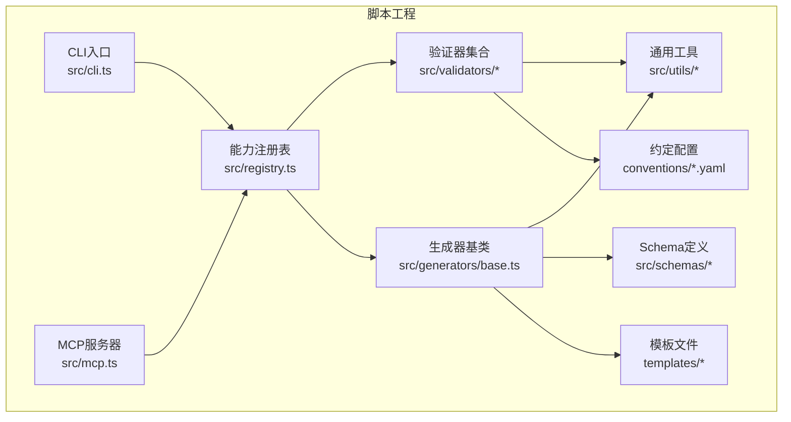
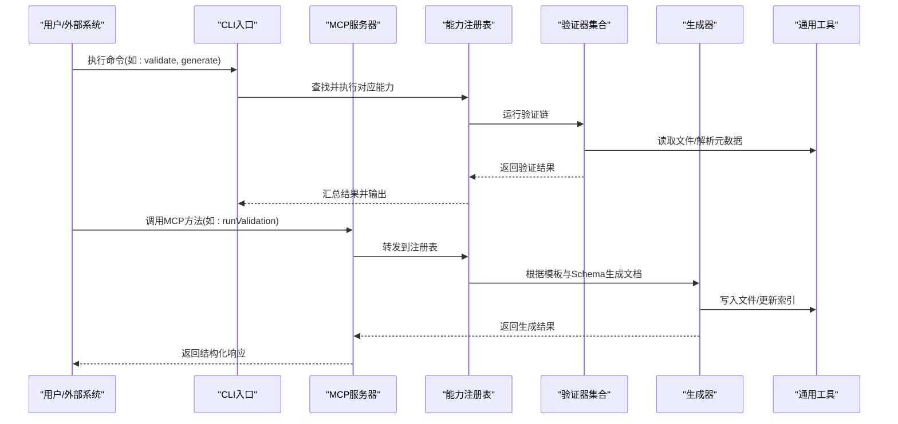
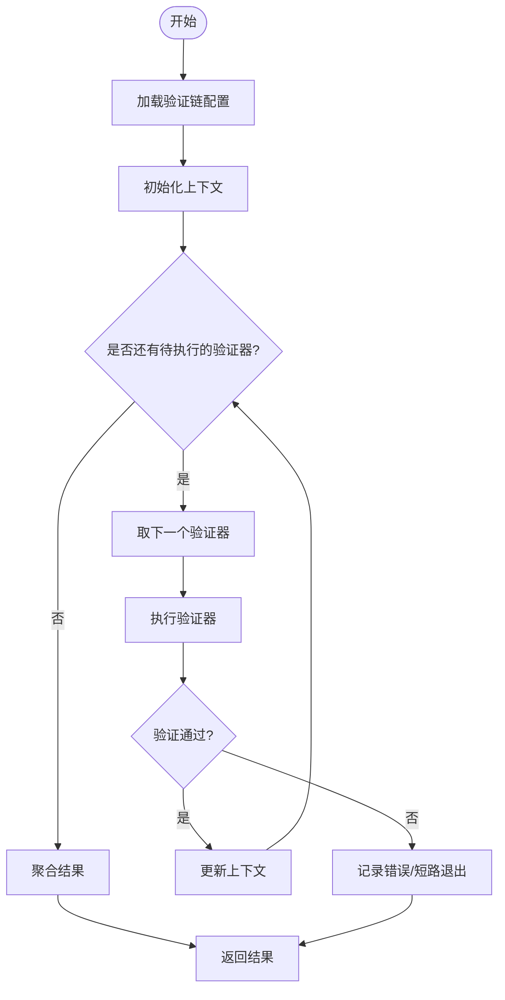
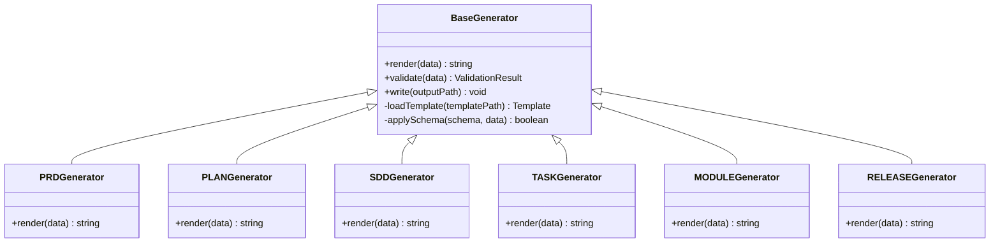
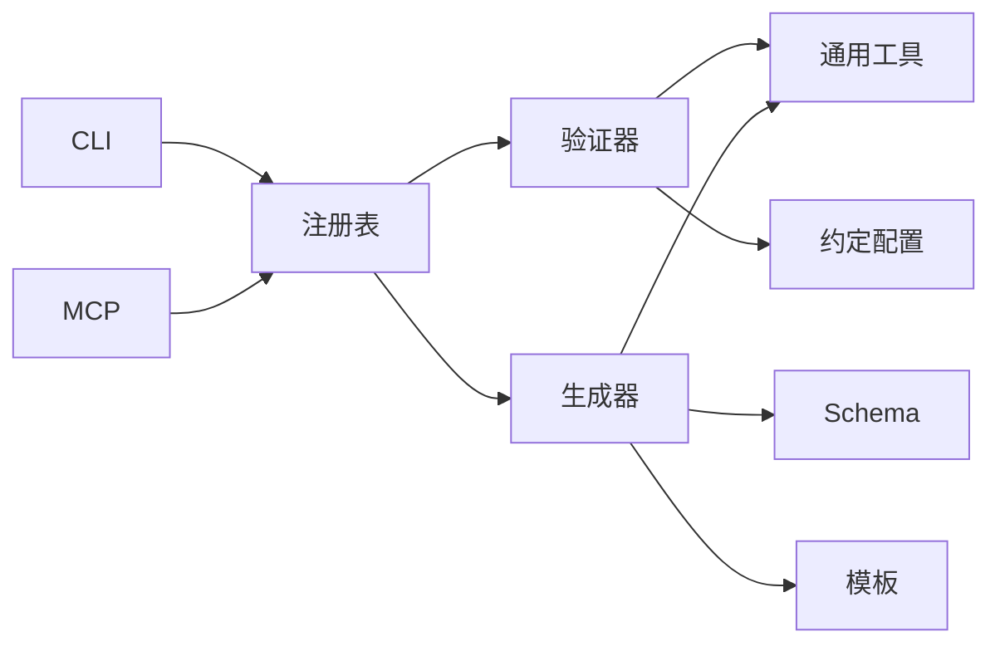

# 共享工具与模板

<cite>
**本文引用的文件**   
- [cli.ts](file://skills/shared/engineering-docs/scripts/src/cli.ts)
- [mcp.ts](file://skills/shared/engineering-docs/scripts/src/mcp.ts)
- [registry.ts](file://skills/shared/engineering-docs/scripts/src/registry.ts)
- [chain.ts](file://skills/shared/engineering-docs/scripts/src/validators/chain.ts)
- [frontmatter.ts](file://skills/shared/engineering-docs/scripts/src/validators/frontmatter.ts)
- [index-sync.ts](file://skills/shared/engineering-docs/scripts/src/validators/index-sync.ts)
- [naming.ts](file://skills/shared/engineering-docs/scripts/src/validators/naming.ts)
- [fs.ts](file://skills/shared/engineering-docs/scripts/src/utils/fs.ts)
- [id.ts](file://skills/shared/engineering-docs/scripts/src/utils/id.ts)
- [slug.ts](file://skills/shared/engineering-docs/scripts/src/utils/slug.ts)
- [generators/base.ts](file://skills/shared/engineering-docs/scripts/src/generators/base.ts)
- [package.json](file://skills/shared/engineering-docs/scripts/package.json)
- [tsconfig.json](file://skills/shared/engineering-docs/scripts/tsconfig.json)
- [vitest.config.ts](file://skills/shared/engineering-docs/scripts/vitest.config.ts)
- [doc-chain.yaml](file://skills/shared/engineering-docs/scripts/src/conventions/doc-chain.yaml)
- [naming.yaml](file://skills/shared/engineering-docs/scripts/src/conventions/naming.yaml)
- [PRD-template.md](file://skills/shared/engineering-docs/scripts/templates/PRD-template.md)
- [PLAN-template.md](file://skills/shared/engineering-docs/scripts/templates/PLAN-template.md)
- [SDD-template.md](file://skills/shared/engineering-docs/scripts/templates/SDD-template.md)
- [TASK-template.md](file://skills/shared/engineering-docs/scripts/templates/TASK-template.md)
- [MODULE-template.md](file://skills/shared/engineering-docs/scripts/templates/MODULE-template.md)
- [RELEASE-template.md](file://skills/shared/engineering-docs/scripts/templates/RELEASE-template.md)
- [OpenAPI-template.yaml](file://skills/shared/engineering-docs/scripts/templates/OpenAPI-template.yaml)
- [form.schema.json](file://skills/shared/engineering-docs/scripts/src/schemas/form.schema.json)
- [plan.schema.json](file://skills/shared/engineering-docs/scripts/src/schemas/plan.schema.json)
- [prd.schema.json](file://skills/shared/engineering-docs/scripts/src/schemas/prd.schema.json)
- [sdd.schema.json](file://skills/shared/engineering-docs/scripts/src/schemas/sdd.schema.json)
- [task.schema.json](file://skills/shared/engineering-docs/scripts/src/schemas/task.schema.json)
- [module.schema.json](file://skills/shared/engineering-docs/scripts/src/schemas/module.schema.json)
- [release.schema.json](file://skills/shared/engineering-docs/scripts/src/schemas/release.schema.json)
- [common-defs.schema.json](file://skills/shared/engineering-docs/scripts/src/schemas/common-defs.schema.json)
- [SKILL.md](file://skills/shared/engineering-docs/SKILL.md)
</cite>

## 目录
1. [简介](#简介)
2. [项目结构](#项目结构)
3. [核心组件](#核心组件)
4. [架构总览](#架构总览)
5. [详细组件分析](#详细组件分析)
6. [依赖关系分析](#依赖关系分析)
7. [性能考虑](#性能考虑)
8. [故障排查指南](#故障排查指南)
9. [结论](#结论)
10. [附录](#附录)

## 简介
本仓库提供工程文档工具链的共享工具与模板，覆盖命令行工具、MCP服务器接口、文档生成器与验证器。其目标是通过统一的约定、可组合的验证链与可扩展的生成器，为产品、研发、质量等角色提供一致的文档体验与自动化能力。

主要能力包括：
- CLI命令行入口：统一调度验证、生成、同步等操作
- MCP服务器接口：对外暴露结构化能力，便于AI或外部系统集成
- 文档生成器：基于模板与Schema驱动生成标准化文档
- 验证链系统：将命名规范、Frontmatter校验、索引一致性等规则组合执行
- 通用工具库：文件系统操作、ID生成、Slug处理等

## 项目结构
该工具链位于 skills/shared/engineering-docs/scripts 目录下，采用“功能域+分层”的组织方式：
- src/cli.ts：CLI入口，解析参数并调用注册表
- src/mcp.ts：MCP服务器实现，暴露能力供外部调用
- src/registry.ts：能力注册中心，集中管理验证器与生成器
- src/validators/*：验证器集合（命名、Frontmatter、索引同步等）
- src/generators/*：生成器基类与扩展点
- src/utils/*：通用工具（文件、ID、Slug）
- src/schemas/*：JSON Schema定义，约束文档结构
- conventions/*.yaml：约定配置（命名、文档链）
- templates/*：Markdown/YAML模板
- package.json/tsconfig.json/vitest.config.ts：构建与测试配置

图表来源
- [cli.ts](file://skills/shared/engineering-docs/scripts/src/cli.ts)
- [mcp.ts](file://skills/shared/engineering-docs/scripts/src/mcp.ts)
- [registry.ts](file://skills/shared/engineering-docs/scripts/src/registry.ts)
- [chain.ts](file://skills/shared/engineering-docs/scripts/src/validators/chain.ts)
- [base.ts](file://skills/shared/engineering-docs/scripts/src/generators/base.ts)
- [fs.ts](file://skills/shared/engineering-docs/scripts/src/utils/fs.ts)
- [id.ts](file://skills/shared/engineering-docs/scripts/src/utils/id.ts)
- [slug.ts](file://skills/shared/engineering-docs/scripts/src/utils/slug.ts)
- [form.schema.json](file://skills/shared/engineering-docs/scripts/src/schemas/form.schema.json)
- [plan.schema.json](file://skills/shared/engineering-docs/scripts/src/schemas/plan.schema.json)
- [prd.schema.json](file://skills/shared/engineering-docs/scripts/src/schemas/prd.schema.json)
- [sdd.schema.json](file://skills/shared/engineering-docs/scripts/src/schemas/sdd.schema.json)
- [task.schema.json](file://skills/shared/engineering-docs/scripts/src/schemas/task.schema.json)
- [module.schema.json](file://skills/shared/engineering-docs/scripts/src/schemas/module.schema.json)
- [release.schema.json](file://skills/shared/engineering-docs/scripts/src/schemas/release.schema.json)
- [common-defs.schema.json](file://skills/shared/engineering-docs/scripts/src/schemas/common-defs.schema.json)
- [doc-chain.yaml](file://skills/shared/engineering-docs/scripts/src/conventions/doc-chain.yaml)
- [naming.yaml](file://skills/shared/engineering-docs/scripts/src/conventions/naming.yaml)
- [PRD-template.md](file://skills/shared/engineering-docs/scripts/templates/PRD-template.md)
- [PLAN-template.md](file://skills/shared/engineering-docs/scripts/templates/PLAN-template.md)
- [SDD-template.md](file://skills/shared/engineering-docs/scripts/templates/SDD-template.md)
- [TASK-template.md](file://skills/shared/engineering-docs/scripts/templates/TASK-template.md)
- [MODULE-template.md](file://skills/shared/engineering-docs/scripts/templates/MODULE-template.md)
- [RELEASE-template.md](file://skills/shared/engineering-docs/scripts/templates/RELEASE-template.md)
- [OpenAPI-template.yaml](file://skills/shared/engineering-docs/scripts/templates/OpenAPI-template.yaml)

章节来源
- [cli.ts](file://skills/shared/engineering-docs/scripts/src/cli.ts)
- [mcp.ts](file://skills/shared/engineering-docs/scripts/src/mcp.ts)
- [registry.ts](file://skills/shared/engineering-docs/scripts/src/registry.ts)
- [package.json](file://skills/shared/engineering-docs/scripts/package.json)
- [tsconfig.json](file://skills/shared/engineering-docs/scripts/tsconfig.json)
- [vitest.config.ts](file://skills/shared/engineering-docs/scripts/vitest.config.ts)

## 核心组件
- CLI命令行工具
  - 职责：解析命令与参数，路由到注册表中的具体能力；输出结果或错误信息
  - 关键点：支持批量处理、静默模式、日志级别控制
- MCP服务器接口
  - 职责：以MCP协议暴露能力，供外部系统或AI代理调用
  - 关键点：方法注册、参数校验、错误码映射
- 能力注册表
  - 职责：集中注册验证器与生成器，提供按名称查找与执行的能力
  - 关键点：生命周期钩子、依赖注入、版本兼容
- 验证链系统
  - 职责：将多个验证器串联执行，支持短路、并行与自定义错误聚合
  - 关键点：链式编排、上下文传递、失败恢复策略
- 生成器框架
  - 职责：基于模板与Schema生成文档，支持变量替换、条件渲染、多格式输出
  - 关键点：模板引擎抽象、数据绑定、增量更新
- 通用工具
  - 文件操作：安全读写、路径规范化、递归遍历
  - ID生成：稳定且可排序的唯一标识
  - Slug工具：标题转URL友好片段，支持去重与长度限制

章节来源
- [cli.ts](file://skills/shared/engineering-docs/scripts/src/cli.ts)
- [mcp.ts](file://skills/shared/engineering-docs/scripts/src/mcp.ts)
- [registry.ts](file://skills/shared/engineering-docs/scripts/src/registry.ts)
- [chain.ts](file://skills/shared/engineering-docs/scripts/src/validators/chain.ts)
- [base.ts](file://skills/shared/engineering-docs/scripts/src/generators/base.ts)
- [fs.ts](file://skills/shared/engineering-docs/scripts/src/utils/fs.ts)
- [id.ts](file://skills/shared/engineering-docs/scripts/src/utils/id.ts)
- [slug.ts](file://skills/shared/engineering-docs/scripts/src/utils/slug.ts)

## 架构总览
整体架构围绕“注册表”为中心，CLI与MCP作为两个入口，分别面向人类与机器消费者。验证器与生成器通过注册表统一管理，工具库提供底层能力支撑。

图表来源
- [cli.ts](file://skills/shared/engineering-docs/scripts/src/cli.ts)
- [mcp.ts](file://skills/shared/engineering-docs/scripts/src/mcp.ts)
- [registry.ts](file://skills/shared/engineering-docs/scripts/src/registry.ts)
- [chain.ts](file://skills/shared/engineering-docs/scripts/src/validators/chain.ts)
- [base.ts](file://skills/shared/engineering-docs/scripts/src/generators/base.ts)
- [fs.ts](file://skills/shared/engineering-docs/scripts/src/utils/fs.ts)

## 详细组件分析

### 验证链系统
验证链负责将多个验证器按顺序或并行执行，支持短路、错误聚合与上下文传递。典型流程如下：

图表来源
- [chain.ts](file://skills/shared/engineering-docs/scripts/src/validators/chain.ts)
- [frontmatter.ts](file://skills/shared/engineering-docs/scripts/src/validators/frontmatter.ts)
- [index-sync.ts](file://skills/shared/engineering-docs/scripts/src/validators/index-sync.ts)
- [naming.ts](file://skills/shared/engineering-docs/scripts/src/validators/naming.ts)
- [doc-chain.yaml](file://skills/shared/engineering-docs/scripts/src/conventions/doc-chain.yaml)
- [naming.yaml](file://skills/shared/engineering-docs/scripts/src/conventions/naming.yaml)

章节来源
- [chain.ts](file://skills/shared/engineering-docs/scripts/src/validators/chain.ts)
- [frontmatter.ts](file://skills/shared/engineering-docs/scripts/src/validators/frontmatter.ts)
- [index-sync.ts](file://skills/shared/engineering-docs/scripts/src/validators/index-sync.ts)
- [naming.ts](file://skills/shared/engineering-docs/scripts/src/validators/naming.ts)
- [doc-chain.yaml](file://skills/shared/engineering-docs/scripts/src/conventions/doc-chain.yaml)
- [naming.yaml](file://skills/shared/engineering-docs/scripts/src/conventions/naming.yaml)

### 生成器框架
生成器基于模板与Schema驱动，支持变量替换、条件渲染与多格式输出。其核心类与方法关系如下：

图表来源
- [base.ts](file://skills/shared/engineering-docs/scripts/src/generators/base.ts)
- [PRD-template.md](file://skills/shared/engineering-docs/scripts/templates/PRD-template.md)
- [PLAN-template.md](file://skills/shared/engineering-docs/scripts/templates/PLAN-template.md)
- [SDD-template.md](file://skills/shared/engineering-docs/scripts/templates/SDD-template.md)
- [TASK-template.md](file://skills/shared/engineering-docs/scripts/templates/TASK-template.md)
- [MODULE-template.md](file://skills/shared/engineering-docs/scripts/templates/MODULE-template.md)
- [RELEASE-template.md](file://skills/shared/engineering-docs/scripts/templates/RELEASE-template.md)
- [OpenAPI-template.yaml](file://skills/shared/engineering-docs/scripts/templates/OpenAPI-template.yaml)

章节来源
- [base.ts](file://skills/shared/engineering-docs/scripts/src/generators/base.ts)
- [PRD-template.md](file://skills/shared/engineering-docs/scripts/templates/PRD-template.md)
- [PLAN-template.md](file://skills/shared/engineering-docs/scripts/templates/PLAN-template.md)
- [SDD-template.md](file://skills/shared/engineering-docs/scripts/templates/SDD-template.md)
- [TASK-template.md](file://skills/shared/engineering-docs/scripts/templates/TASK-template.md)
- [MODULE-template.md](file://skills/shared/engineering-docs/scripts/templates/MODULE-template.md)
- [RELEASE-template.md](file://skills/shared/engineering-docs/scripts/templates/RELEASE-template.md)
- [OpenAPI-template.yaml](file://skills/shared/engineering-docs/scripts/templates/OpenAPI-template.yaml)

### 通用工具模块
- 文件操作工具
  - 提供安全读写、路径规范化、递归遍历、差异对比等功能
  - 用于验证器读取源文件、生成器写入目标文件
- ID生成器
  - 生成稳定、可读、可排序的唯一标识
  - 适用于文档编号、任务ID等场景
- Slug工具
  - 将标题转换为URL友好的片段，支持去重与长度限制
  - 用于生成稳定的链接与文件名

章节来源
- [fs.ts](file://skills/shared/engineering-docs/scripts/src/utils/fs.ts)
- [id.ts](file://skills/shared/engineering-docs/scripts/src/utils/id.ts)
- [slug.ts](file://skills/shared/engineering-docs/scripts/src/utils/slug.ts)

### CLI与MCP集成
- CLI
  - 命令示例：validate、generate、sync
  - 参数：输入路径、输出路径、配置文件、日志级别
- MCP
  - 方法示例：runValidation、generateDoc、listTemplates
  - 请求/响应：结构化JSON，包含状态、错误信息与结果引用

章节来源
- [cli.ts](file://skills/shared/engineering-docs/scripts/src/cli.ts)
- [mcp.ts](file://skills/shared/engineering-docs/scripts/src/mcp.ts)

## 依赖关系分析
内部依赖清晰，遵循单一职责与低耦合原则：
- CLI与MCP仅依赖注册表，不直接依赖具体验证器/生成器
- 验证器与生成器依赖通用工具与约定配置
- Schema与模板由生成器消费，验证器可参考约定配置进行规则校验

图表来源
- [cli.ts](file://skills/shared/engineering-docs/scripts/src/cli.ts)
- [mcp.ts](file://skills/shared/engineering-docs/scripts/src/mcp.ts)
- [registry.ts](file://skills/shared/engineering-docs/scripts/src/registry.ts)
- [chain.ts](file://skills/shared/engineering-docs/scripts/src/validators/chain.ts)
- [base.ts](file://skills/shared/engineering-docs/scripts/src/generators/base.ts)
- [fs.ts](file://skills/shared/engineering-docs/scripts/src/utils/fs.ts)
- [id.ts](file://skills/shared/engineering-docs/scripts/src/utils/id.ts)
- [slug.ts](file://skills/shared/engineering-docs/scripts/src/utils/slug.ts)
- [form.schema.json](file://skills/shared/engineering-docs/scripts/src/schemas/form.schema.json)
- [plan.schema.json](file://skills/shared/engineering-docs/scripts/src/schemas/plan.schema.json)
- [prd.schema.json](file://skills/shared/engineering-docs/scripts/src/schemas/prd.schema.json)
- [sdd.schema.json](file://skills/shared/engineering-docs/scripts/src/schemas/sdd.schema.json)
- [task.schema.json](file://skills/shared/engineering-docs/scripts/src/schemas/task.schema.json)
- [module.schema.json](file://skills/shared/engineering-docs/scripts/src/schemas/module.schema.json)
- [release.schema.json](file://skills/shared/engineering-docs/scripts/src/schemas/release.schema.json)
- [common-defs.schema.json](file://skills/shared/engineering-docs/scripts/src/schemas/common-defs.schema.json)
- [doc-chain.yaml](file://skills/shared/engineering-docs/scripts/src/conventions/doc-chain.yaml)
- [naming.yaml](file://skills/shared/engineering-docs/scripts/src/conventions/naming.yaml)

章节来源
- [registry.ts](file://skills/shared/engineering-docs/scripts/src/registry.ts)
- [package.json](file://skills/shared/engineering-docs/scripts/package.json)
- [tsconfig.json](file://skills/shared/engineering-docs/scripts/tsconfig.json)

## 性能考虑
- 验证链并行化：对无依赖的验证器可并行执行，缩短总体耗时
- 增量生成：基于文件时间戳与内容哈希判断是否需要重新生成
- 缓存策略：对Schema解析、模板编译结果进行内存缓存
- I/O优化：批量读写、流式处理大文件，避免一次性加载

[本节为通用指导，无需特定文件来源]

## 故障排查指南
常见问题与定位步骤：
- 验证失败
  - 检查命名约定与Frontmatter字段是否符合Schema
  - 查看验证链错误聚合结果，定位首个失败的验证器
- 生成异常
  - 确认模板与Schema匹配，变量名一致
  - 检查输出路径权限与磁盘空间
- 索引不同步
  - 使用索引同步验证器修复缺失或冗余条目
- 日志与调试
  - 提高日志级别，关注关键节点输入输出
  - 使用最小复现用例隔离问题

章节来源
- [chain.ts](file://skills/shared/engineering-docs/scripts/src/validators/chain.ts)
- [frontmatter.ts](file://skills/shared/engineering-docs/scripts/src/validators/frontmatter.ts)
- [index-sync.ts](file://skills/shared/engineering-docs/scripts/src/validators/index-sync.ts)
- [naming.ts](file://skills/shared/engineering-docs/scripts/src/validators/naming.ts)

## 结论
本工具链通过注册表统一调度、验证链组合与生成器模板化，实现了工程文档的标准化与自动化。开发者可通过扩展验证器与生成器快速适配新需求，同时借助通用工具与约定配置保障一致性与可维护性。

[本节为总结性内容，无需特定文件来源]

## 附录

### 安装与配置
- 安装依赖
  - 在项目根目录执行包管理器安装命令
- 构建与测试
  - 使用TypeScript编译器构建
  - 使用Vitest运行单元测试
- 环境变量与配置
  - 通过配置文件指定模板路径、Schema位置、输出目录等

章节来源
- [package.json](file://skills/shared/engineering-docs/scripts/package.json)
- [tsconfig.json](file://skills/shared/engineering-docs/scripts/tsconfig.json)
- [vitest.config.ts](file://skills/shared/engineering-docs/scripts/vitest.config.ts)

### API接口与扩展机制
- 自定义验证规则
  - 实现验证器接口，注册到注册表
  - 在验证链中引入新规则
- 自定义生成器
  - 继承生成器基类，实现渲染逻辑
  - 关联模板与Schema，注册到注册表
- 集成模式
  - CLI：本地脚本与CI流水线集成
  - MCP：外部系统与AI代理调用

章节来源
- [registry.ts](file://skills/shared/engineering-docs/scripts/src/registry.ts)
- [chain.ts](file://skills/shared/engineering-docs/scripts/src/validators/chain.ts)
- [base.ts](file://skills/shared/engineering-docs/scripts/src/generators/base.ts)

### 测试策略
- 单元测试
  - 针对验证器与生成器的边界条件与异常路径
- 集成测试
  - 端到端验证CLI与MCP能力
- 快照测试
  - 确保模板与Schema变更后的输出稳定性

章节来源
- [vitest.config.ts](file://skills/shared/engineering-docs/scripts/vitest.config.ts)

### 与其他系统的集成
- CI/CD
  - 在流水线中执行验证与生成，阻断不符合规范的提交
- AI代理
  - 通过MCP接口让代理自动创建与校验文档
- 代码仓库
  - 结合Git钩子在提交前触发轻量验证

章节来源
- [mcp.ts](file://skills/shared/engineering-docs/scripts/src/mcp.ts)
- [cli.ts](file://skills/shared/engineering-docs/scripts/src/cli.ts)

### 开发环境搭建
- Node.js与包管理器
- TypeScript编译与类型检查
- Vitest测试运行器
- IDE插件：语法高亮、格式化、Lint

章节来源
- [package.json](file://skills/shared/engineering-docs/scripts/package.json)
- [tsconfig.json](file://skills/shared/engineering-docs/scripts/tsconfig.json)
- [vitest.config.ts](file://skills/shared/engineering-docs/scripts/vitest.config.ts)

### 使用示例与最佳实践
- 使用CLI执行验证与生成
- 在MCP中调用能力进行自动化
- 编写自定义验证器与生成器
- 组织模板与Schema，保持命名与结构一致

章节来源
- [SKILL.md](file://skills/shared/engineering-docs/SKILL.md)
- [PRD-template.md](file://skills/shared/engineering-docs/scripts/templates/PRD-template.md)
- [PLAN-template.md](file://skills/shared/engineering-docs/scripts/templates/PLAN-template.md)
- [SDD-template.md](file://skills/shared/engineering-docs/scripts/templates/SDD-template.md)
- [TASK-template.md](file://skills/shared/engineering-docs/scripts/templates/TASK-template.md)
- [MODULE-template.md](file://skills/shared/engineering-docs/scripts/templates/MODULE-template.md)
- [RELEASE-template.md](file://skills/shared/engineering-docs/scripts/templates/RELEASE-template.md)
- [OpenAPI-template.yaml](file://skills/shared/engineering-docs/scripts/templates/OpenAPI-template.yaml)
- [form.schema.json](file://skills/shared/engineering-docs/scripts/src/schemas/form.schema.json)
- [plan.schema.json](file://skills/shared/engineering-docs/scripts/src/schemas/plan.schema.json)
- [prd.schema.json](file://skills/shared/engineering-docs/scripts/src/schemas/prd.schema.json)
- [sdd.schema.json](file://skills/shared/engineering-docs/scripts/src/schemas/sdd.schema.json)
- [task.schema.json](file://skills/shared/engineering-docs/scripts/src/schemas/task.schema.json)
- [module.schema.json](file://skills/shared/engineering-docs/scripts/src/schemas/module.schema.json)
- [release.schema.json](file://skills/shared/engineering-docs/scripts/src/schemas/release.schema.json)
- [common-defs.schema.json](file://skills/shared/engineering-docs/scripts/src/schemas/common-defs.schema.json)