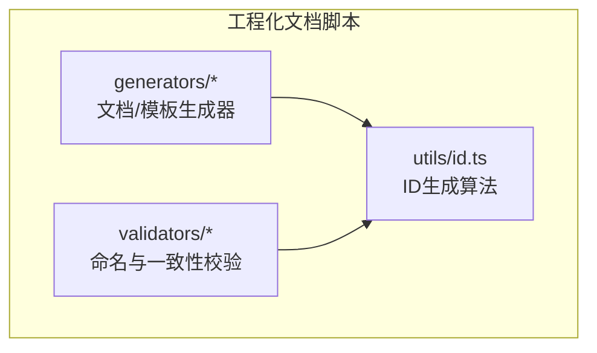
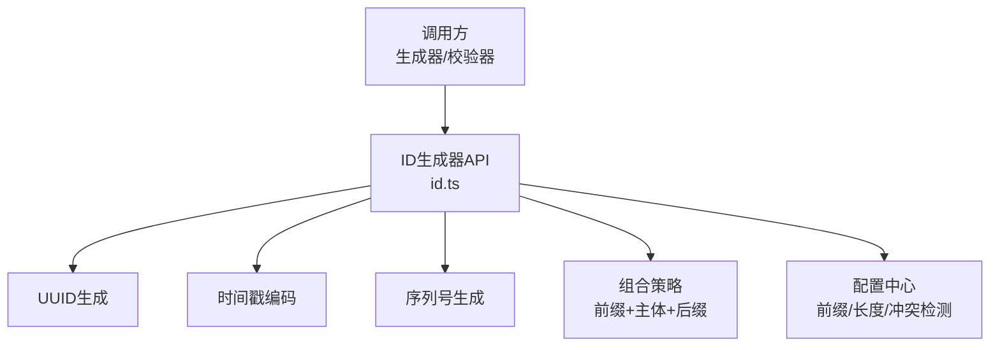
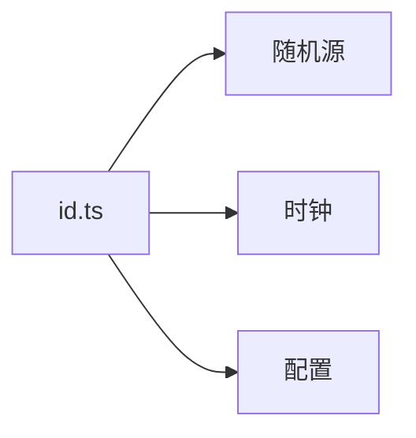

# ID生成器

<cite>
**本文引用的文件**   
- [id.ts](file://skills/shared/engineering-docs/scripts/src/utils/id.ts)
</cite>

## 目录
1. [简介](#简介)
2. [项目结构](#项目结构)
3. [核心组件](#核心组件)
4. [架构总览](#架构总览)
5. [详细组件分析](#详细组件分析)
6. [依赖分析](#依赖分析)
7. [性能考虑](#性能考虑)
8. [故障排查指南](#故障排查指南)
9. [结论](#结论)
10. [附录](#附录)

## 简介
本章节面向需要在文档命名、版本控制等场景中使用唯一标识符的读者，提供ID生成器的API与实现说明。重点覆盖：
- UUID生成、序列号生成、时间戳编码等核心能力
- 不同ID格式的组合策略（版本号、业务前缀、随机后缀）
- 配置项说明（自定义前缀、长度限制、冲突检测）
- 使用示例（文档命名、版本控制）
- 性能与扩展机制

## 项目结构
本项目中ID生成相关逻辑位于工程化文档脚本工具集内，具体路径为：
- skills/shared/engineering-docs/scripts/src/utils/id.ts

该模块作为通用工具被上层生成器或校验器引用，用于在文档/任务/计划等实体上生成稳定且可读的ID。

图表来源
- [id.ts](file://skills/shared/engineering-docs/scripts/src/utils/id.ts)

章节来源
- [id.ts](file://skills/shared/engineering-docs/scripts/src/utils/id.ts)

## 核心组件
本节聚焦ID生成器的关键能力与接口约定，帮助快速上手并理解其设计边界。

- 主要职责
  - 生成全局唯一的UUID
  - 生成可排序的时间戳编码片段
  - 生成单调递增的序列号片段
  - 组合多种片段形成业务友好的ID格式
  - 支持可选的前缀、长度约束与冲突检测

- 典型输出格式
  - 纯UUID：适合系统内部主键
  - 带前缀的短ID：便于人类阅读与检索
  - 含时间戳/序列号的ID：便于按时间或顺序定位

- 配置项概览
  - 前缀：允许为不同业务域设置固定前缀
  - 长度限制：对最终ID进行裁剪或填充以满足存储/展示要求
  - 冲突检测：在必要时检查已存在ID并回退重试
  - 种子/随机源：可注入随机源以增强测试可控性

章节来源
- [id.ts](file://skills/shared/engineering-docs/scripts/src/utils/id.ts)

## 架构总览
下图展示了ID生成器在工程化文档脚本中的位置与调用关系。

图表来源
- [id.ts](file://skills/shared/engineering-docs/scripts/src/utils/id.ts)

## 详细组件分析

### UUID生成
- 目标
  - 提供标准、不可预测的全局唯一标识
- 关键点
  - 使用安全随机源
  - 遵循常见UUID变体规范
  - 避免本地状态污染
- 适用场景
  - 系统内部主键、跨进程/跨机器唯一性保证

章节来源
- [id.ts](file://skills/shared/engineering-docs/scripts/src/utils/id.ts)

### 时间戳编码
- 目标
  - 将时间信息编码进ID，使ID具备一定的时间有序性
- 关键点
  - 选择合适的时间精度（毫秒/微秒）
  - 采用紧凑编码减少长度
  - 注意时区与基准时间
- 适用场景
  - 需要按时间排序或快速定位的ID

章节来源
- [id.ts](file://skills/shared/engineering-docs/scripts/src/utils/id.ts)

### 序列号生成
- 目标
  - 在同一时间窗口内提供单调递增的区分度
- 关键点
  - 线程/进程安全的计数器
  - 可重置或分片以避免碰撞
  - 与时间戳结合提升整体唯一性
- 适用场景
  - 批量生成、高并发下保持局部有序

章节来源
- [id.ts](file://skills/shared/engineering-docs/scripts/src/utils/id.ts)

### 组合策略（前缀 + 主体 + 后缀）
- 目标
  - 将多段信息拼接成易读、稳定的业务ID
- 关键点
  - 前缀：业务域/类型标识
  - 主体：时间戳/序列号/UUID片段
  - 后缀：随机或校验位，降低碰撞概率
- 规则建议
  - 固定字段在前，可变字段在后
  - 控制总长度，满足下游系统限制
  - 保留可读性与可解析性

章节来源
- [id.ts](file://skills/shared/engineering-docs/scripts/src/utils/id.ts)

### 配置选项
- 自定义前缀
  - 作用：为不同模块/文档类型添加固定前缀
  - 影响：改变ID语义与排序特性
- 长度限制
  - 作用：确保ID不超过存储/索引/展示上限
  - 策略：截断尾部或缩短随机部分
- 冲突检测
  - 作用：在写入前检查是否重复
  - 策略：记录已用ID集合，发生冲突则重新生成
- 随机源注入
  - 作用：便于单元测试与确定性输出
  - 策略：通过参数或环境变量切换

章节来源
- [id.ts](file://skills/shared/engineering-docs/scripts/src/utils/id.ts)

### 使用示例（文档命名、版本控制）
- 文档命名
  - 使用“前缀+日期/序号”的ID，便于归档与检索
  - 示例思路：PRD-YYYYMMDD-NNN
- 版本控制
  - 使用“前缀+时间戳+短随机”的ID，便于分支/标签管理
  - 示例思路：REL-YYYYMMDDHHmmss-XX

章节来源
- [id.ts](file://skills/shared/engineering-docs/scripts/src/utils/id.ts)

### 错误处理与边界情况
- 输入校验
  - 前缀合法性、长度范围、字符集限制
- 冲突处理
  - 达到最大重试次数时的失败策略
- 资源清理
  - 计数器/缓存的生命周期管理

章节来源
- [id.ts](file://skills/shared/engineering-docs/scripts/src/utils/id.ts)

## 依赖分析
- 内部依赖
  - 无外部库强依赖，核心逻辑集中在单一工具文件中
- 外部依赖
  - 语言运行时提供的随机数与时钟API
- 耦合关系
  - 低耦合：仅暴露简洁API供上层调用
  - 高内聚：所有ID生成相关逻辑集中管理

图表来源
- [id.ts](file://skills/shared/engineering-docs/scripts/src/utils/id.ts)

章节来源
- [id.ts](file://skills/shared/engineering-docs/scripts/src/utils/id.ts)

## 性能考虑
- 生成成本
  - UUID生成开销较低；时间戳/序列号几乎零开销
- 并发安全
  - 序列号需保证原子递增，避免锁竞争热点
- 内存占用
  - 冲突检测集合应设置上限或采用LRU策略
- I/O影响
  - 冲突检测尽量避免磁盘I/O，优先内存结构

[本节为通用指导，不直接分析具体文件]

## 故障排查指南
- 常见问题
  - ID重复：检查冲突检测开关与重试上限
  - 长度超限：调整长度限制或缩短随机部分
  - 前缀非法：校验前缀字符集与长度
- 诊断步骤
  - 打印生成的原始片段（时间戳/序列号/随机）
  - 查看配置项是否被覆盖
  - 确认随机源与时钟源是否可用

章节来源
- [id.ts](file://skills/shared/engineering-docs/scripts/src/utils/id.ts)

## 结论
ID生成器以模块化方式封装了UUID、时间戳、序列号与组合策略，并提供灵活配置与冲突检测，适用于文档命名、版本控制等多种场景。建议在业务侧明确前缀规范与长度约束，并在高并发环境下关注序列号与冲突检测的性能表现。

[本节为总结性内容，不直接分析具体文件]

## 附录
- 术语
  - UUID：通用唯一识别码
  - 时间戳编码：将时间信息压缩到有限位数
  - 序列号：单调递增的区分标识
- 最佳实践
  - 统一前缀规范
  - 合理设置长度限制
  - 开启冲突检测并设定重试上限
  - 在测试中注入随机源以获得确定性结果

[本节为补充说明，不直接分析具体文件]