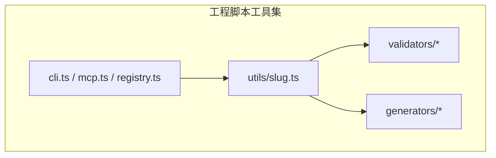
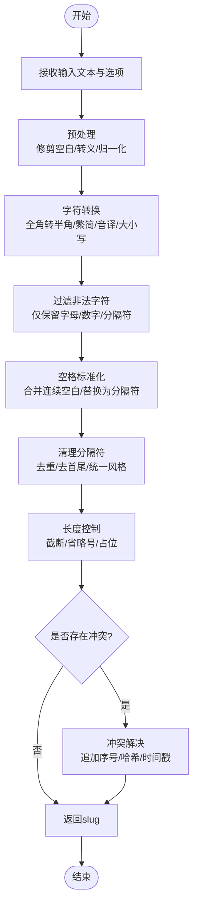
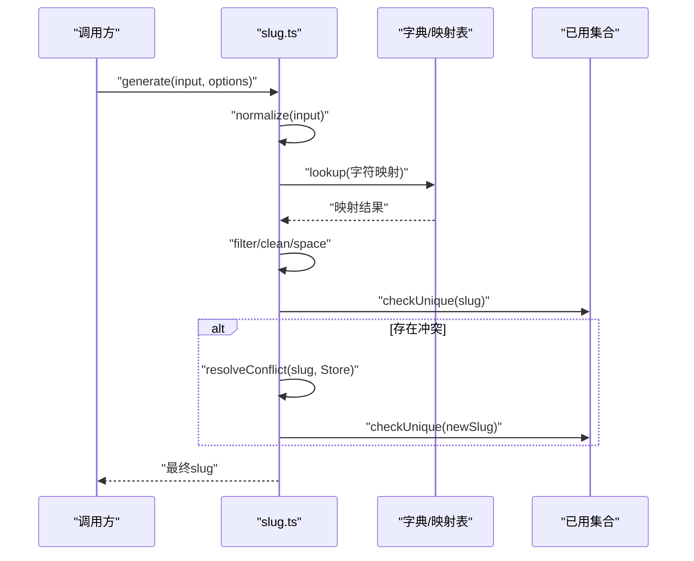
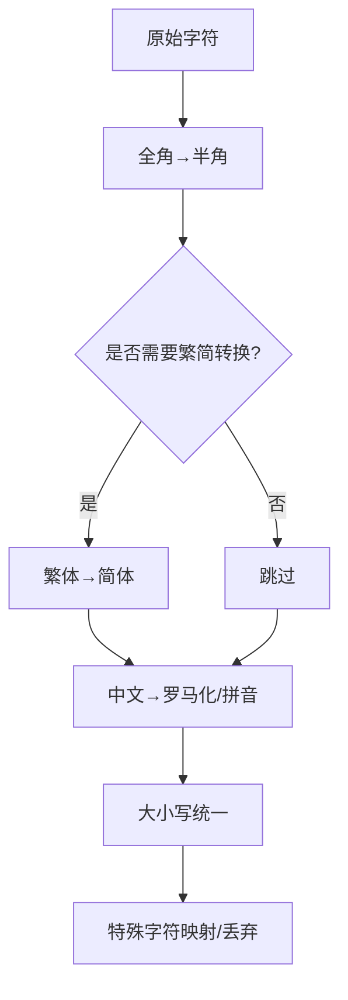
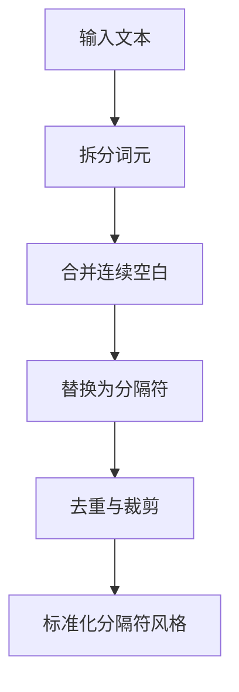
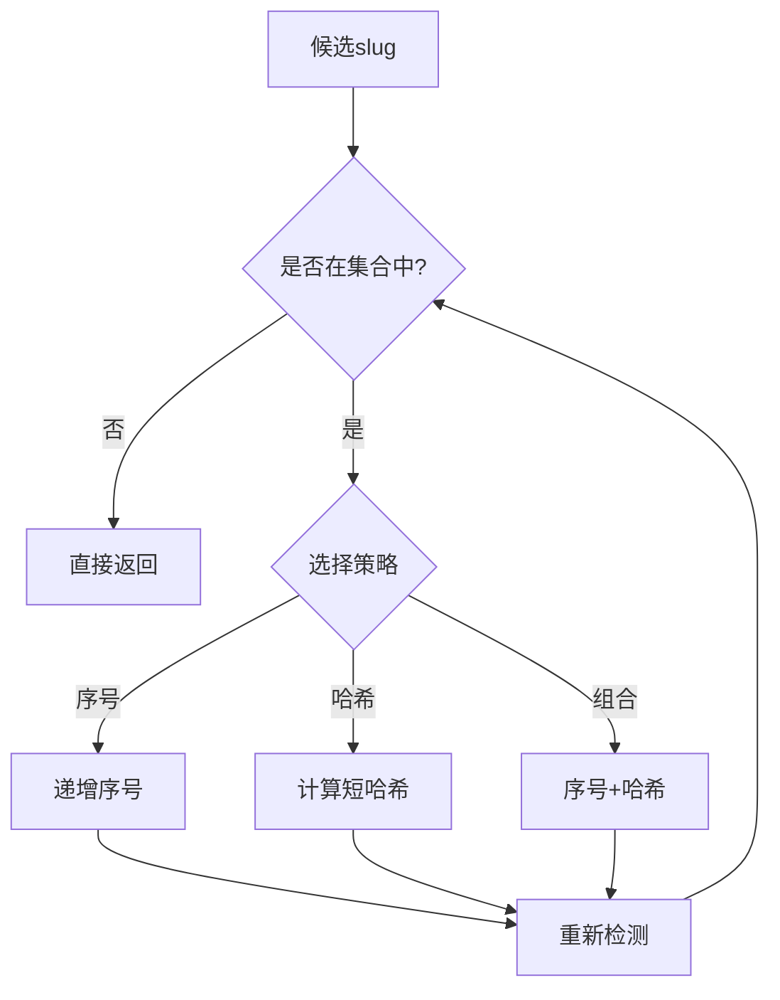
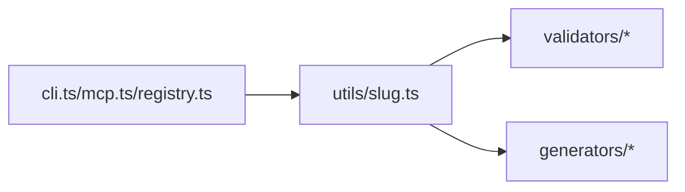

# 名称工具

<cite>
**本文引用的文件**   
- [slug.ts](file://skills/shared/engineering-docs/scripts/src/utils/slug.ts)
</cite>

## 目录
1. [简介](#简介)
2. [项目结构](#项目结构)
3. [核心组件](#核心组件)
4. [架构总览](#架构总览)
5. [详细组件分析](#详细组件分析)
6. [依赖分析](#依赖分析)
7. [性能考虑](#性能考虑)
8. [故障排查指南](#故障排查指南)
9. [结论](#结论)
10. [附录](#附录)

## 简介
本文件为“名称工具”的API文档，聚焦于 slug.ts 模块的名称规范化能力。该模块提供将任意输入文本转换为安全、可读且可复用的标识符（slug）的能力，适用于文档命名、URL生成与文件命名等场景。其核心目标包括：
- 字符转换与特殊字符处理
- 空格标准化与分隔符统一
- 大小写统一
- 多语言环境支持（中文、英文、数字与常见符号）
- 冲突检测与唯一性保障
- 正则表达式规则说明与性能优化建议

## 项目结构
slug.ts 位于工程脚本工具集中，属于通用工具库的一部分，供其他脚本或CLI流程复用。

图表来源
- [slug.ts](file://skills/shared/engineering-docs/scripts/src/utils/slug.ts)

章节来源
- [slug.ts](file://skills/shared/engineering-docs/scripts/src/utils/slug.ts)

## 核心组件
本节概述 slug.ts 提供的关键能力与调用方式（以概念描述为主，不展示具体代码）。

- 主要方法
  - 名称规范化：将输入文本转换为符合规范的slug字符串
  - 可选参数控制：是否保留原始语言字符、是否允许下划线/连字符、长度限制、前缀/后缀注入、去重策略等
  - 冲突检测与解决：在给定上下文集合中确保生成的slug唯一
  - 批量处理：对数组进行映射并保证全局唯一性

- 典型使用场景
  - 文档命名：从标题生成稳定的文件名
  - URL生成：从页面标题生成路径段
  - 文件命名：从用户输入生成安全的文件名片段

- 输出约束
  - 仅包含字母、数字与指定分隔符
  - 去除首尾空白与无效分隔符
  - 统一小写（可按配置调整）
  - 长度上限与截断策略

章节来源
- [slug.ts](file://skills/shared/engineering-docs/scripts/src/utils/slug.ts)

## 架构总览
下图展示了名称规范化的端到端流程，从输入到最终唯一slug的生成。

图表来源
- [slug.ts](file://skills/shared/engineering-docs/scripts/src/utils/slug.ts)

## 详细组件分析

### 名称规范化主流程
- 输入校验
  - 空值与类型检查
  - 最大长度与最小长度边界
- 预处理
  - 去除不可见字符与多余空白
  - 统一Unicode形式（如NFC/NFD归一化）
- 字符转换
  - 全角转半角
  - 繁简转换（可选）
  - 拼音/罗马化（针对中文，可选）
  - 大小写统一（默认小写）
- 过滤与清洗
  - 移除非法字符
  - 合并连续分隔符
  - 去除首尾分隔符
- 长度控制
  - 按字节或字符计数
  - 截断策略与回退方案
- 冲突检测与解决
  - 基于已存在集合的唯一性校验
  - 冲突时追加序号或短哈希
  - 递归重试直至唯一

图表来源
- [slug.ts](file://skills/shared/engineering-docs/scripts/src/utils/slug.ts)

章节来源
- [slug.ts](file://skills/shared/engineering-docs/scripts/src/utils/slug.ts)

### 字符转换与特殊字符处理
- 全角转半角：将全角字母、数字与标点转为对应的半角形式
- 繁简转换：根据配置将繁体中文转为简体
- 中文罗马化：将中文汉字转为拼音或罗马化形式（可配置）
- 特殊字符映射：将常见符号映射为分隔符或直接丢弃
- 大小写统一：默认统一为小写，避免大小写敏感带来的歧义

图表来源
- [slug.ts](file://skills/shared/engineering-docs/scripts/src/utils/slug.ts)

章节来源
- [slug.ts](file://skills/shared/engineering-docs/scripts/src/utils/slug.ts)

### 空格标准化与分隔符统一
- 空白处理：合并连续空白、去除首尾空白
- 分隔符选择：支持连字符“-”或下划线“_”，并可配置
- 分隔符清洗：去除重复与首尾分隔符，保持整洁

图表来源
- [slug.ts](file://skills/shared/engineering-docs/scripts/src/utils/slug.ts)

章节来源
- [slug.ts](file://skills/shared/engineering-docs/scripts/src/utils/slug.ts)

### 冲突检测与解决机制
- 冲突检测：在已有slug集合中进行查找
- 解决策略：
  - 追加序号：如 base-1、base-2
  - 追加短哈希：如 base-a3f9
  - 组合策略：先序号后哈希，保证高并发下的唯一性
- 重试上限：防止无限循环，达到阈值后抛出异常或降级

图表来源
- [slug.ts](file://skills/shared/engineering-docs/scripts/src/utils/slug.ts)

章节来源
- [slug.ts](file://skills/shared/engineering-docs/scripts/src/utils/slug.ts)

### 正则表达式规则说明
- 匹配范围：仅保留字母、数字与指定分隔符
- 空白与换行：匹配所有空白字符并替换为分隔符
- 全角字符：匹配全角字母与数字并转换为半角
- 特殊符号：匹配常见标点与符号并按策略映射或丢弃
- 分隔符去重：匹配连续分隔符并压缩为单个

注意：以上为规则层面的说明，具体实现细节请参考源文件。

章节来源
- [slug.ts](file://skills/shared/engineering-docs/scripts/src/utils/slug.ts)

### 多语言环境支持
- 中文：支持繁简转换与罗马化/拼音映射
- 英文：大小写统一与全角转半角
- 数字：保留阿拉伯数字，必要时进行宽度归一化
- 特殊字符：按策略映射为分隔符或丢弃

章节来源
- [slug.ts](file://skills/shared/engineering-docs/scripts/src/utils/slug.ts)

### 实际使用示例
- 文档命名
  - 输入：产品需求文档 v2.0（修订版）
  - 输出：产品需求文档-v20-修订版（或经罗马化后的对应形式）
- URL生成
  - 输入：关于“人工智能”的最新进展
  - 输出：about-artificial-intelligence-latest-progress
- 文件命名
  - 输入：报告_2024_Q3（内部）
  - 输出：report-2024-q3-internal

提示：上述示例用于演示行为，请结合具体配置与实际实现验证。

章节来源
- [slug.ts](file://skills/shared/engineering-docs/scripts/src/utils/slug.ts)

## 依赖分析
slug.ts 作为工具模块，通常被以下部分引用：
- 验证器：在生成文件名或URL之前进行合法性校验
- 生成器：在模板渲染阶段生成稳定标识符
- CLI/MCP/注册中心：在命令行或远程过程调用中使用

图表来源
- [slug.ts](file://skills/shared/engineering-docs/scripts/src/utils/slug.ts)

章节来源
- [slug.ts](file://skills/shared/engineering-docs/scripts/src/utils/slug.ts)

## 性能考虑
- 预编译正则：将常用正则表达式缓存，避免重复编译开销
- 流式处理：对长文本采用分块处理，降低内存峰值
- 增量去重：在批量生成时维护已用集合，减少重复计算
- 短哈希策略：优先使用短哈希而非长随机串，缩短比较与存储成本
- 并行化：在独立任务间并行生成，但需保证全局唯一性由单例集合协调

[本节为通用性能建议，无需特定文件引用]

## 故障排查指南
- 常见问题
  - 生成结果为空：检查输入是否为纯空白或全部非法字符
  - 长度超限：确认长度限制与截断策略，必要时放宽限制
  - 冲突频繁：调整冲突解决策略，增加序号或哈希长度
  - 乱码或异常字符：确认Unicode归一化与编码设置
- 调试建议
  - 启用中间步骤日志：记录各阶段的输入输出
  - 打印正则匹配命中情况：定位未预期的字符被丢弃
  - 对比不同语言的映射表：确认繁简与罗马化是否正确

章节来源
- [slug.ts](file://skills/shared/engineering-docs/scripts/src/utils/slug.ts)

## 结论
slug.ts 提供了稳健的名称规范化能力，覆盖字符转换、特殊字符处理、空格标准化与大小写统一，并通过冲突检测与解决机制确保唯一性。在多语言环境下具备良好兼容性，适合用于文档命名、URL生成与文件命名等场景。通过合理的正则规则与性能优化技巧，可在保证正确性的同时提升效率。

[本节为总结性内容，无需特定文件引用]

## 附录
- 术语
  - slug：经过规范化处理的标识符字符串
  - 罗马化：将非拉丁文字转换为拉丁字母序列
  - 繁简转换：繁体中文与简体中文之间的相互转换
- 参考
  - 相关工具与脚本入口：参见工程脚本工具集相关文件

[本节为补充信息，无需特定文件引用]