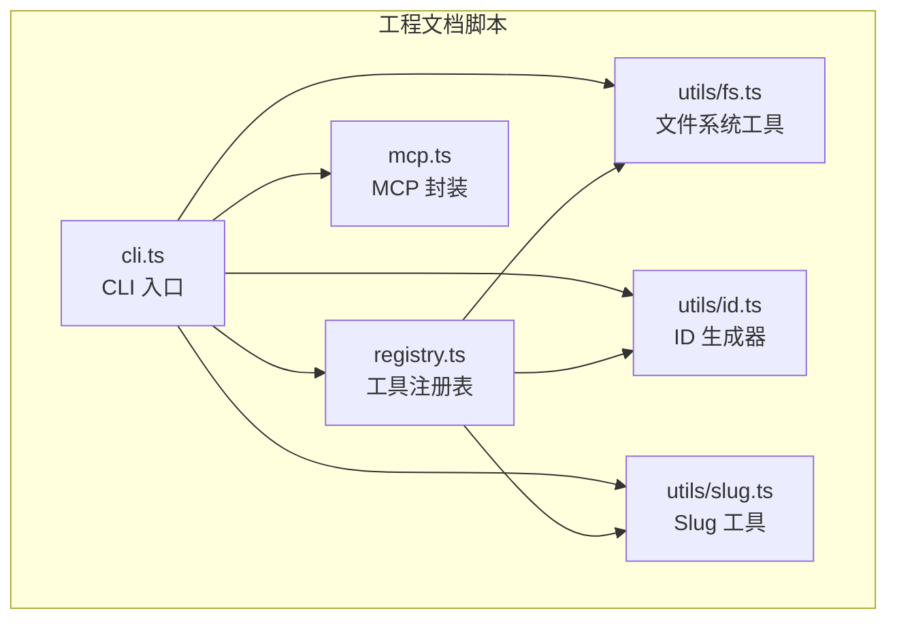
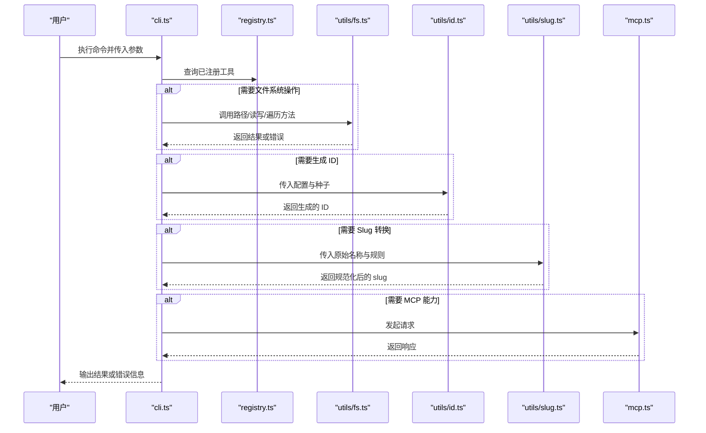
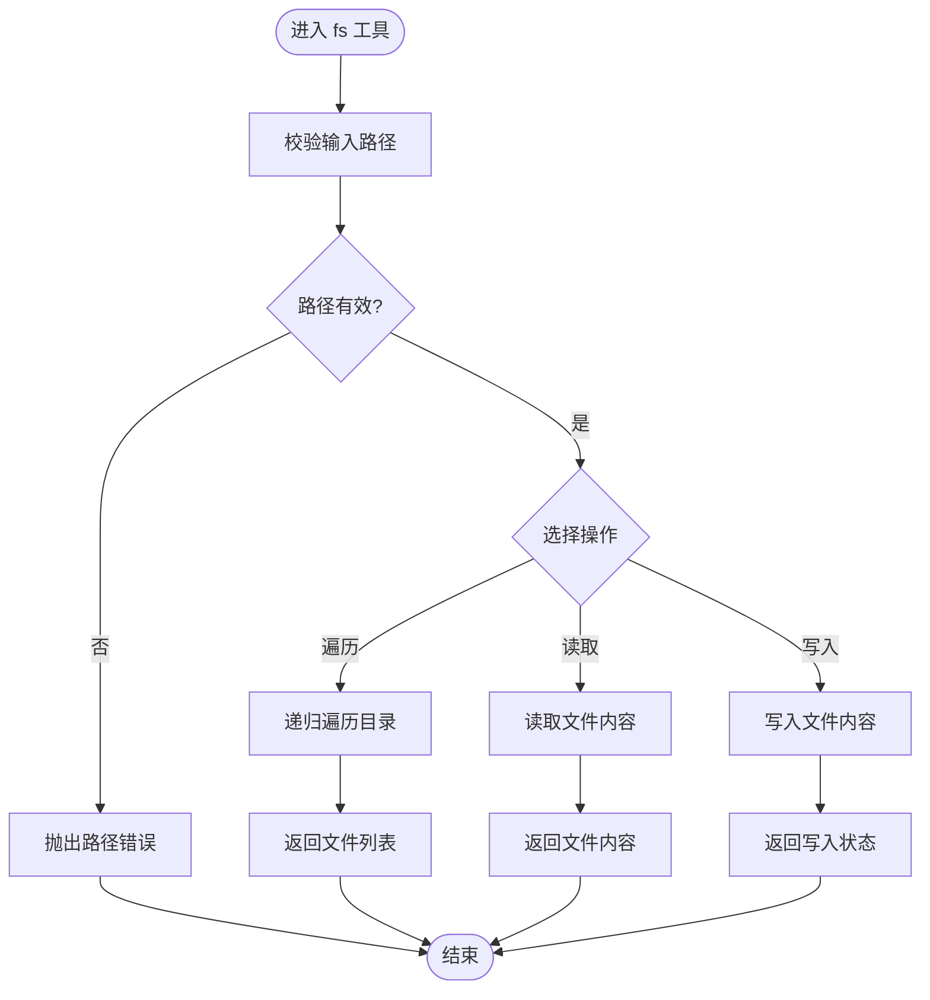
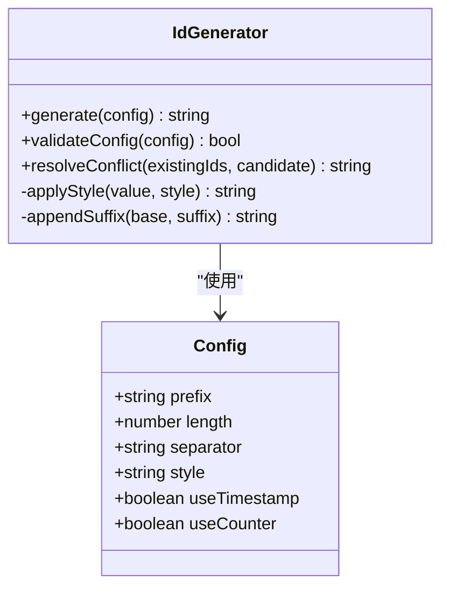
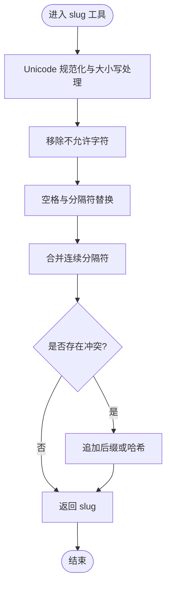
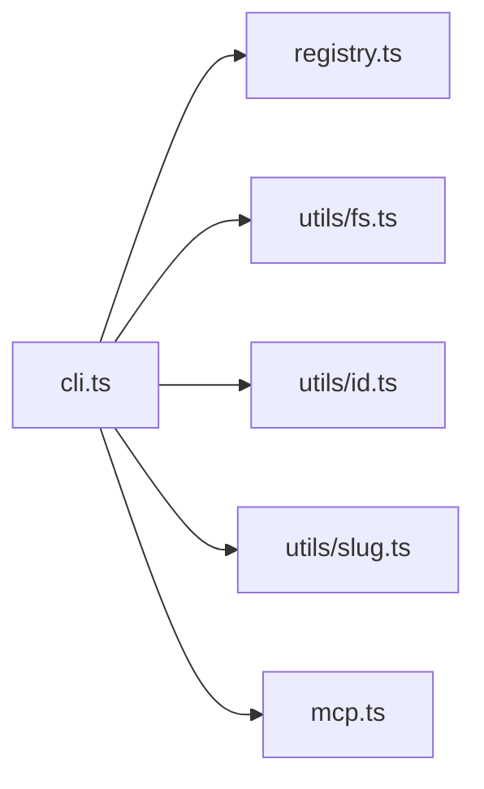

# 工具库集合

<cite>
**本文引用的文件**   
- [fs.ts](file://skills/shared/engineering-docs/scripts/src/utils/fs.ts)
- [id.ts](file://skills/shared/engineering-docs/scripts/src/utils/id.ts)
- [slug.ts](file://skills/shared/engineering-docs/scripts/src/utils/slug.ts)
- [cli.ts](file://skills/shared/engineering-docs/scripts/src/cli.ts)
- [mcp.ts](file://skills/shared/engineering-docs/scripts/src/mcp.ts)
- [registry.ts](file://skills/shared/engineering-docs/scripts/src/registry.ts)
</cite>

## 目录
1. [简介](#简介)
2. [项目结构](#项目结构)
3. [核心组件](#核心组件)
4. [架构总览](#架构总览)
5. [详细组件分析](#详细组件分析)
6. [依赖关系分析](#依赖关系分析)
7. [性能考虑](#性能考虑)
8. [故障排查指南](#故障排查指南)
9. [结论](#结论)
10. [附录：API 参考](#附录api-参考)

## 简介
本仓库包含一组通用工程文档脚本与工具，聚焦于以下能力：
- 文件系统操作工具：路径处理、文件遍历、读写等。
- ID 生成器：支持多种格式与命名约定，提供可配置选项。
- Slug 工具：名称规范化、字符转换、特殊字符处理与冲突解决。
- CLI 入口与注册表：统一命令入口、工具注册与扩展机制。
- MCP 集成：面向模型上下文协议的调用封装（可选）。

这些模块以 TypeScript 实现，位于 scripts 子项目中，便于在 Node.js 环境中复用与扩展。

## 项目结构
工具库主要位于 skills/shared/engineering-docs/scripts/src 目录下，关键文件如下：
- utils/fs.ts：文件系统工具集（路径、遍历、读写）
- utils/id.ts：ID 生成器（算法与配置）
- utils/slug.ts：Slug 工具（名称规范化与冲突处理）
- cli.ts：命令行入口与参数解析
- mcp.ts：MCP 协议相关封装
- registry.ts：工具注册表与扩展点

图表来源
- [cli.ts](file://skills/shared/engineering-docs/scripts/src/cli.ts)
- [registry.ts](file://skills/shared/engineering-docs/scripts/src/registry.ts)
- [mcp.ts](file://skills/shared/engineering-docs/scripts/src/mcp.ts)
- [fs.ts](file://skills/shared/engineering-docs/scripts/src/utils/fs.ts)
- [id.ts](file://skills/shared/engineering-docs/scripts/src/utils/id.ts)
- [slug.ts](file://skills/shared/engineering-docs/scripts/src/utils/slug.ts)

章节来源
- [cli.ts](file://skills/shared/engineering-docs/scripts/src/cli.ts)
- [registry.ts](file://skills/shared/engineering-docs/scripts/src/registry.ts)
- [mcp.ts](file://skills/shared/engineering-docs/scripts/src/mcp.ts)
- [fs.ts](file://skills/shared/engineering-docs/scripts/src/utils/fs.ts)
- [id.ts](file://skills/shared/engineering-docs/scripts/src/utils/id.ts)
- [slug.ts](file://skills/shared/engineering-docs/scripts/src/utils/slug.ts)

## 核心组件
- 文件系统工具（utils/fs.ts）
  - 职责：路径拼接与归一化、目录遍历、文件存在性检查、读取与写入、批量操作。
  - 典型用法：构建目标路径、递归列出文件、安全写入模板输出。
- ID 生成器（utils/id.ts）
  - 职责：按策略生成唯一标识，支持前缀、分隔符、长度、随机源等配置。
  - 典型用法：为文档或任务生成稳定且可读的 ID。
- Slug 工具（utils/slug.ts）
  - 职责：将人类可读的名称转换为 URL 友好的 slug，处理大小写、空格、标点与多语言字符；支持冲突后缀策略。
  - 典型用法：从标题生成文件名或路由段。
- CLI 入口（cli.ts）
  - 职责：解析命令行参数、分发到具体工具、打印结果与错误信息。
- 注册表（registry.ts）
  - 职责：集中注册工具函数、版本信息与元数据，提供扩展点。
- MCP 封装（mcp.ts）
  - 职责：封装与模型上下文协议的交互，供上层工具按需调用。

章节来源
- [fs.ts](file://skills/shared/engineering-docs/scripts/src/utils/fs.ts)
- [id.ts](file://skills/shared/engineering-docs/scripts/src/utils/id.ts)
- [slug.ts](file://skills/shared/engineering-docs/scripts/src/utils/slug.ts)
- [cli.ts](file://skills/shared/engineering-docs/scripts/src/cli.ts)
- [registry.ts](file://skills/shared/engineering-docs/scripts/src/registry.ts)
- [mcp.ts](file://skills/shared/engineering-docs/scripts/src/mcp.ts)

## 架构总览
整体采用“入口 + 注册表 + 工具模块”的分层设计：
- CLI 作为统一入口，负责参数解析与调度。
- 注册表维护工具清单与版本信息，支持新增工具时自动发现。
- 工具模块（fs、id、slug）保持无状态与纯函数风格，便于测试与组合。
- 可选的 MCP 封装用于与外部模型服务交互。

图表来源
- [cli.ts](file://skills/shared/engineering-docs/scripts/src/cli.ts)
- [registry.ts](file://skills/shared/engineering-docs/scripts/src/registry.ts)
- [fs.ts](file://skills/shared/engineering-docs/scripts/src/utils/fs.ts)
- [id.ts](file://skills/shared/engineering-docs/scripts/src/utils/id.ts)
- [slug.ts](file://skills/shared/engineering-docs/scripts/src/utils/slug.ts)
- [mcp.ts](file://skills/shared/engineering-docs/scripts/src/mcp.ts)

## 详细组件分析

### 文件系统工具（utils/fs.ts）
- 功能要点
  - 路径处理：拼接、归一化、相对路径转绝对路径、跨平台兼容。
  - 文件遍历：递归列出目录、过滤匹配模式、忽略隐藏文件。
  - 读写操作：读取文本/二进制、写入文本/JSON、原子写入（临时文件+重命名）、批量复制与删除。
  - 校验与安全：路径穿越防护、权限检查、空值与类型校验。
- 复杂度与性能
  - 遍历时间复杂度 O(n)，n 为目录树节点数；I/O 密集场景建议并行度控制与流式处理。
- 错误处理
  - 对不存在的路径、权限不足、磁盘空间不足等情况进行明确错误分类与提示。
- 使用示例（概念）
  - 输入：目标根目录、匹配模式、是否递归。
  - 输出：匹配文件列表或写入成功标志。

图表来源
- [fs.ts](file://skills/shared/engineering-docs/scripts/src/utils/fs.ts)

章节来源
- [fs.ts](file://skills/shared/engineering-docs/scripts/src/utils/fs.ts)

### ID 生成器（utils/id.ts）
- 算法与配置
  - 支持前缀、分隔符、长度、随机源（伪随机/真随机）、时间戳片段、序号递增等策略。
  - 冲突解决：当检测到重复时，自动追加后缀或回退到更长随机段。
- 命名约定
  - 支持驼峰、短横线、下划线等分隔风格；可配置大小写映射。
- 复杂度与性能
  - 生成时间近似 O(1)，受随机源与字符串处理影响；高并发场景建议预分配缓冲。
- 错误处理
  - 非法长度、无效随机源、不可用系统熵池时的降级策略与异常提示。
- 使用示例（概念）
  - 输入：{ prefix, length, separator, style }。
  - 输出：符合约定的唯一 ID 字符串。

图表来源
- [id.ts](file://skills/shared/engineering-docs/scripts/src/utils/id.ts)

章节来源
- [id.ts](file://skills/shared/engineering-docs/scripts/src/utils/id.ts)

### Slug 工具（utils/slug.ts）
- 功能要点
  - 字符转换：全角转半角、Unicode 规范化、大小写统一。
  - 特殊字符处理：去除标点、替换空格为分隔符、保留允许字符集。
  - 冲突解决：当出现重复 slug 时，追加数字后缀或基于哈希的后缀。
- 算法流程
  - 标准化输入 → 清理与替换 → 分段与合并 → 冲突检测与修正。
- 复杂度与性能
  - 线性时间 O(n)，n 为输入长度；批量处理时可缓存映射表减少重复计算。
- 错误处理
  - 空输入、非法编码、超长输入的处理与降级策略。
- 使用示例（概念）
  - 输入：原始名称、规则对象（含分隔符、保留字符、冲突策略）。
  - 输出：URL 友好的 slug 字符串。

图表来源
- [slug.ts](file://skills/shared/engineering-docs/scripts/src/utils/slug.ts)

章节来源
- [slug.ts](file://skills/shared/engineering-docs/scripts/src/utils/slug.ts)

### CLI 入口（cli.ts）
- 职责
  - 解析命令行参数、加载注册表、分发到对应工具、格式化输出。
- 扩展方式
  - 通过注册表新增工具后，CLI 自动识别新命令与参数。
- 错误处理
  - 参数缺失、类型不匹配、工具未注册时的友好提示。

章节来源
- [cli.ts](file://skills/shared/engineering-docs/scripts/src/cli.ts)

### 注册表（registry.ts）
- 职责
  - 集中管理工具元数据（名称、版本、描述、参数定义）、提供查询与注册接口。
- 扩展机制
  - 新增工具时仅需在注册表中声明，无需修改 CLI 主逻辑。
- 版本兼容性
  - 记录工具版本与变更日志，便于运行时校验与升级提示。

章节来源
- [registry.ts](file://skills/shared/engineering-docs/scripts/src/registry.ts)

### MCP 封装（mcp.ts）
- 职责
  - 封装与模型上下文协议的通信细节，提供统一的调用接口。
- 使用场景
  - 在需要模型辅助的场景中，由上层工具按需调用。

章节来源
- [mcp.ts](file://skills/shared/engineering-docs/scripts/src/mcp.ts)

## 依赖关系分析
- 内部依赖
  - CLI 依赖注册表与工具模块（fs、id、slug），必要时调用 MCP。
  - 注册表仅暴露元数据与查询接口，不直接依赖具体实现。
- 外部依赖
  - Node.js 标准库（fs、path、crypto 等）用于 I/O、路径与随机源。
- 潜在循环依赖
  - 当前分层清晰，未见循环导入；若新增工具需避免反向引用 CLI。

图表来源
- [cli.ts](file://skills/shared/engineering-docs/scripts/src/cli.ts)
- [registry.ts](file://skills/shared/engineering-docs/scripts/src/registry.ts)
- [fs.ts](file://skills/shared/engineering-docs/scripts/src/utils/fs.ts)
- [id.ts](file://skills/shared/engineering-docs/scripts/src/utils/id.ts)
- [slug.ts](file://skills/shared/engineering-docs/scripts/src/utils/slug.ts)
- [mcp.ts](file://skills/shared/engineering-docs/scripts/src/mcp.ts)

章节来源
- [cli.ts](file://skills/shared/engineering-docs/scripts/src/cli.ts)
- [registry.ts](file://skills/shared/engineering-docs/scripts/src/registry.ts)
- [fs.ts](file://skills/shared/engineering-docs/scripts/src/utils/fs.ts)
- [id.ts](file://skills/shared/engineering-docs/scripts/src/utils/id.ts)
- [slug.ts](file://skills/shared/engineering-docs/scripts/src/utils/slug.ts)
- [mcp.ts](file://skills/shared/engineering-docs/scripts/src/mcp.ts)

## 性能考虑
- 文件系统操作
  - 大目录遍历建议使用分页或限制深度；批量写入采用异步与缓冲策略。
- ID 生成
  - 高并发下优先使用线程安全的随机源；避免频繁创建对象，复用配置。
- Slug 转换
  - 批量转换时缓存常见词汇映射；对超长输入进行截断与警告。
- CLI 输出
  - 大量结果输出时使用流式打印，避免一次性构建超大字符串。

## 故障排查指南
- 常见问题
  - 路径不存在或权限不足：检查基础路径与运行环境权限。
  - ID 冲突：调整长度或启用冲突后缀策略。
  - Slug 重复：开启冲突解决或增加前缀区分。
  - 命令未识别：确认工具已在注册表中正确声明。
- 定位步骤
  - 启用详细日志输出，查看错误堆栈与参数校验失败原因。
  - 使用最小复现用例隔离问题，逐步验证各工具模块。

章节来源
- [cli.ts](file://skills/shared/engineering-docs/scripts/src/cli.ts)
- [registry.ts](file://skills/shared/engineering-docs/scripts/src/registry.ts)
- [fs.ts](file://skills/shared/engineering-docs/scripts/src/utils/fs.ts)
- [id.ts](file://skills/shared/engineering-docs/scripts/src/utils/id.ts)
- [slug.ts](file://skills/shared/engineering-docs/scripts/src/utils/slug.ts)

## 结论
该工具库以清晰的模块化设计与可扩展的注册表机制，提供了稳定的文件系统操作、ID 生成与 Slug 规范化能力。通过 CLI 统一入口与可选的 MCP 封装，既满足日常工程文档自动化需求，也具备良好的演进空间。建议在新增工具时遵循现有分层与错误处理规范，确保一致性与可维护性。

## 附录：API 参考

### 文件系统工具（utils/fs.ts）
- 路径处理
  - 方法：路径拼接与归一化
  - 参数：baseDir（字符串）、relativePath（字符串）
  - 返回：规范化后的绝对路径（字符串）
  - 示例：将相对路径拼接至根目录并返回安全路径
- 文件遍历
  - 方法：递归列出目录
  - 参数：root（字符串）、pattern（正则或通配）、options（是否递归、忽略列表）
  - 返回：文件路径数组（字符串[]）
  - 示例：列出所有 .md 文件
- 读写操作
  - 方法：读取文件内容
  - 参数：filePath（字符串）、encoding（可选）
  - 返回：文件内容（字符串或 Buffer）
  - 方法：写入文件内容
  - 参数：filePath（字符串）、content（字符串或 Buffer）、options（原子写入开关）
  - 返回：写入成功标志（布尔）
  - 示例：安全写入 JSON 配置文件

章节来源
- [fs.ts](file://skills/shared/engineering-docs/scripts/src/utils/fs.ts)

### ID 生成器（utils/id.ts）
- 生成 ID
  - 方法：generate
  - 参数：config（对象，包含 prefix、length、separator、style、useTimestamp、useCounter）
  - 返回：ID 字符串
  - 示例：生成带前缀与分隔符的短 ID
- 冲突解决
  - 方法：resolveConflict
  - 参数：existingIds（字符串[]）、candidate（字符串）
  - 返回：去重后的候选 ID（字符串）
  - 示例：为重复 ID 追加数字后缀

章节来源
- [id.ts](file://skills/shared/engineering-docs/scripts/src/utils/id.ts)

### Slug 工具（utils/slug.ts）
- 名称规范化
  - 方法：toSlug
  - 参数：input（字符串）、rules（对象，含分隔符、保留字符、冲突策略）
  - 返回：slug 字符串
  - 示例：从中文标题生成 URL 友好 slug
- 冲突处理
  - 方法：ensureUnique
  - 参数：slug（字符串）、existingSlugs（字符串[]）
  - 返回：唯一 slug（字符串）
  - 示例：为重复 slug 追加哈希后缀

章节来源
- [slug.ts](file://skills/shared/engineering-docs/scripts/src/utils/slug.ts)

### CLI 入口（cli.ts）
- 命令解析
  - 方法：parseArgs
  - 参数：argv（字符串[]）
  - 返回：解析后的参数对象
  - 示例：解析 --prefix、--length、--output 等参数
- 工具分发
  - 方法：dispatch
  - 参数：command（字符串）、args（对象）
  - 返回：执行结果或错误信息
  - 示例：根据命令调用 fs、id、slug 工具

章节来源
- [cli.ts](file://skills/shared/engineering-docs/scripts/src/cli.ts)

### 注册表（registry.ts）
- 工具注册
  - 方法：register
  - 参数：tool（对象，包含 name、version、description、handler）
  - 返回：注册成功标志（布尔）
  - 示例：注册新的文档生成工具
- 工具查询
  - 方法：getTool
  - 参数：name（字符串）
  - 返回：工具元数据或 undefined
  - 示例：获取指定工具的版本与描述

章节来源
- [registry.ts](file://skills/shared/engineering-docs/scripts/src/registry.ts)

### MCP 封装（mcp.ts）
- 调用封装
  - 方法：call
  - 参数：request（对象，包含 method、params）
  - 返回：响应对象
  - 示例：调用模型上下文协议中的某个方法

章节来源
- [mcp.ts](file://skills/shared/engineering-docs/scripts/src/mcp.ts)