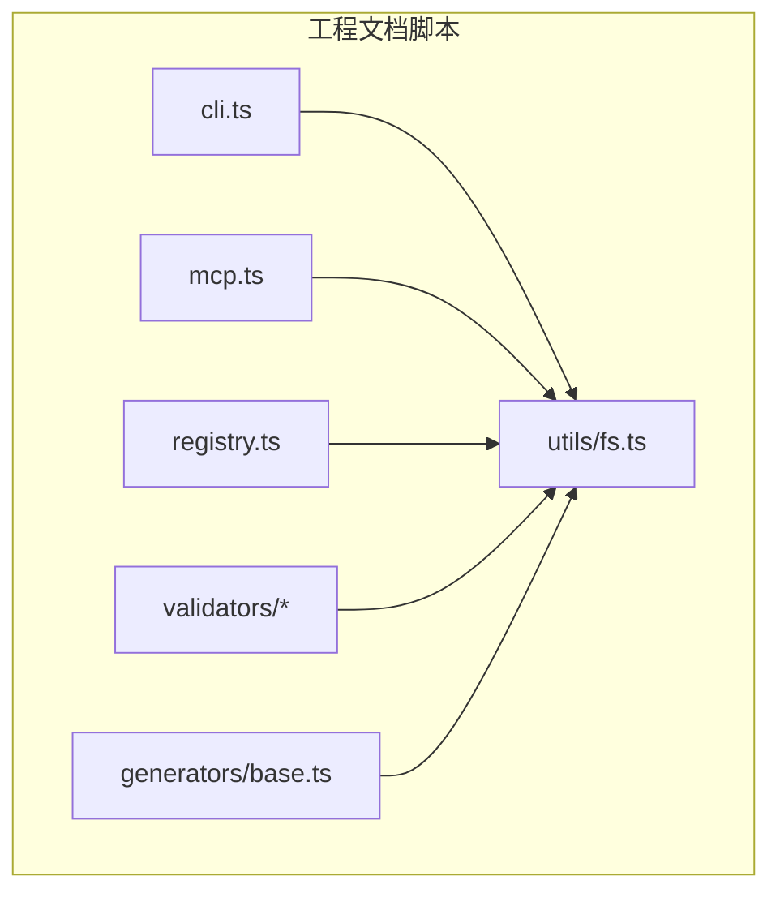
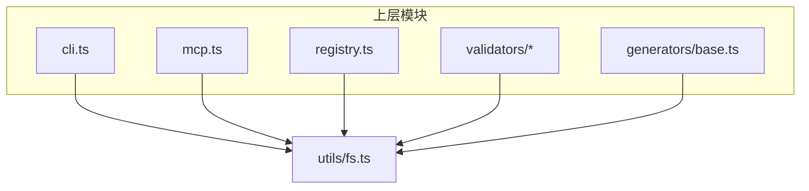
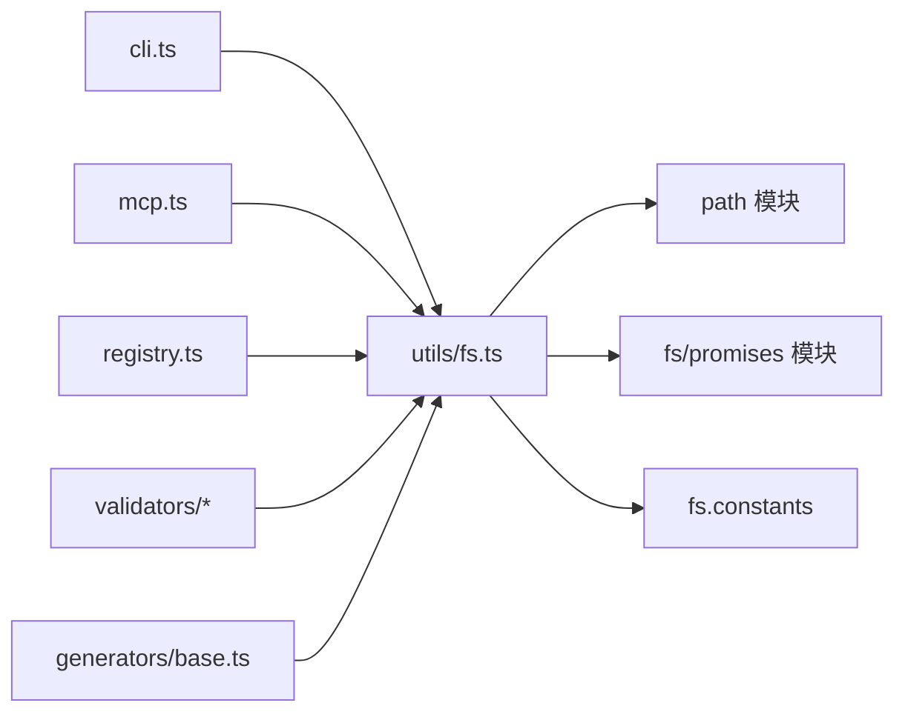

# 文件系统工具

<cite>
**本文引用的文件**   
- [fs.ts](file://skills/shared/engineering-docs/scripts/src/utils/fs.ts)
</cite>

## 目录
1. [简介](#简介)
2. [项目结构](#项目结构)
3. [核心组件](#核心组件)
4. [架构总览](#架构总览)
5. [详细组件分析](#详细组件分析)
6. [依赖分析](#依赖分析)
7. [性能考虑](#性能考虑)
8. [故障排查指南](#故障排查指南)
9. [结论](#结论)
10. [附录](#附录)

## 简介
本文件为工程文档系统中的“文件系统工具”模块提供详细的API说明。该模块聚焦于路径处理、目录遍历、文件读写与权限管理等常用能力，旨在为上层脚本与CLI工具提供稳定、一致且可组合的文件系统操作接口。文档将覆盖函数签名、参数类型、返回值格式、错误处理机制、异步模式与性能优化建议，并给出在工程文档系统中常见使用场景的最佳实践与排障要点。

## 项目结构
该模块位于工程文档脚本子项目的工具层，主要职责是封装底层文件系统操作，向上暴露简洁的API。其位置与上下文如下：
- 模块路径：skills/shared/engineering-docs/scripts/src/utils/fs.ts
- 所属包：engineering-docs/scripts（TypeScript）
- 典型调用方：scripts/src/cli.ts、scripts/src/mcp.ts、scripts/src/registry.ts 等

图表来源
- [fs.ts](file://skills/shared/engineering-docs/scripts/src/utils/fs.ts)

章节来源
- [fs.ts](file://skills/shared/engineering-docs/scripts/src/utils/fs.ts)

## 核心组件
本节概述 fs.ts 提供的核心能力类别与职责边界。为避免泄露实现细节，以下以概念性描述为主，具体函数名与行为请参考“详细组件分析”。

- 路径处理
  - 规范化路径、解析相对/绝对路径、拼接与归一化
  - 安全校验与越界保护（防止路径穿越）
- 目录遍历
  - 递归/非递归列举目录与文件
  - 过滤规则（扩展名、忽略列表）
  - 深度限制与并发控制
- 文件读写
  - 文本与二进制读取/写入
  - 原子写入（临时文件+重命名）
  - 追加与条件写入（存在则跳过或覆盖）
- 元数据与权限
  - 获取/设置文件属性（大小、时间戳、权限位）
  - 检查是否存在、是否可读/可写/可执行
- 辅助能力
  - 批量操作（并行/串行）、重试与退避
  - 日志与诊断信息输出

章节来源
- [fs.ts](file://skills/shared/engineering-docs/scripts/src/utils/fs.ts)

## 架构总览
下图展示了 fs.ts 在工程文档脚本中的角色与交互关系。它作为基础设施层，被 CLI、MCP 服务、注册表与验证器/生成器等模块共同复用。

图表来源
- [fs.ts](file://skills/shared/engineering-docs/scripts/src/utils/fs.ts)

## 详细组件分析

### 路径处理
- 目标
  - 统一路径表示，避免平台差异带来的不一致
  - 提供安全的拼接与归一化，防止路径穿越
- 关键能力
  - 路径规范化：去除冗余分隔符、解析 . 与 ..
  - 相对路径转绝对路径：基于工作目录或指定根目录
  - 路径安全校验：拒绝包含非法字符或越界的输入
- 错误处理
  - 对非法输入抛出明确的参数错误
  - 对无法解析的路径返回结构化错误对象
- 使用示例（概念）
  - 将用户输入的相对路径转换为绝对路径后用于后续读写
  - 在模板生成前对输出路径进行归一化与安全校验

章节来源
- [fs.ts](file://skills/shared/engineering-docs/scripts/src/utils/fs.ts)

### 目录遍历
- 目标
  - 高效枚举目录树，支持过滤与深度限制
- 关键能力
  - 递归/非递归列举：按名称、扩展名、正则匹配过滤
  - 忽略策略：支持忽略列表（如 node_modules、.git）
  - 并发控制：限制同时打开的文件句柄数，避免资源耗尽
- 错误处理
  - 对无权限目录、符号链接循环、IO异常进行捕获与上报
  - 提供部分失败时的继续策略与汇总报告
- 使用示例（概念）
  - 扫描文档目录收集所有 Markdown 文件
  - 仅遍历特定层级，减少 I/O 开销

章节来源
- [fs.ts](file://skills/shared/engineering-docs/scripts/src/utils/fs.ts)

### 文件读写
- 目标
  - 提供一致的文本/二进制读写接口，保证幂等与可靠性
- 关键能力
  - 文本读写：UTF-8 编码默认，支持自定义编码
  - 二进制读写：Buffer/Uint8Array 支持
  - 原子写入：先写临时文件再重命名，降低损坏风险
  - 条件写入：存在时跳过/覆盖；不存在时创建
- 错误处理
  - 区分“文件不存在”、“权限不足”、“磁盘空间不足”等错误
  - 提供重试与回滚策略（例如写入失败清理临时文件）
- 使用示例（概念）
  - 生成 PRD 文档时，确保写入过程不中断且不产生半成品
  - 批量更新索引文件时使用原子写入保障一致性

章节来源
- [fs.ts](file://skills/shared/engineering-docs/scripts/src/utils/fs.ts)

### 元数据与权限
- 目标
  - 查询与调整文件属性，支撑流程中的前置检查与后置修复
- 关键能力
  - 属性查询：大小、修改时间、是否目录、是否符号链接
  - 权限检查：可读/可写/可执行判断
  - 权限设置：按需调整访问控制位（跨平台兼容）
- 错误处理
  - 对不支持的操作返回明确错误码与提示
  - 在权限不足时给出修复建议
- 使用示例（概念）
  - 在发布前检查输出目录是否可写
  - 根据文件类型动态设置可执行标志（脚本类产物）

章节来源
- [fs.ts](file://skills/shared/engineering-docs/scripts/src/utils/fs.ts)

### 批量操作与并发控制
- 目标
  - 在高吞吐场景下平衡速度与稳定性
- 关键能力
  - 并行/串行调度：按任务粒度拆分，支持最大并发度配置
  - 限流与退避：对频繁失败的节点实施指数退避
  - 进度与统计：累计成功/失败计数、耗时统计
- 错误处理
  - 聚合错误：记录每个任务的错误详情
  - 容错策略：跳过失败项或整体失败快速退出
- 使用示例（概念）
  - 批量转换文档格式时，限制并发以避免内存峰值过高
  - 大规模索引构建时，采用分片与重试提升鲁棒性

章节来源
- [fs.ts](file://skills/shared/engineering-docs/scripts/src/utils/fs.ts)

### 异步模式与错误传播
- 设计原则
  - 优先使用 Promise 风格的异步 API，便于组合与取消
  - 统一的错误对象结构，包含错误码、消息与上下文
- 错误传播
  - 上层可选择捕获并降级处理，或向上传播至 CLI/MCP 层
  - 对关键路径（如原子写入）提供强一致性与回滚语义
- 使用示例（概念）
  - 在 MCP 服务中，将文件操作包装为可取消的任务
  - CLI 命令在执行失败时输出结构化错误以便自动化消费

章节来源
- [fs.ts](file://skills/shared/engineering-docs/scripts/src/utils/fs.ts)

## 依赖分析
fs.ts 作为工具层，通常依赖 Node.js 标准库（如 path、fs/promises、fs.constants），并在工程文档脚本中被多个模块复用。

图表来源
- [fs.ts](file://skills/shared/engineering-docs/scripts/src/utils/fs.ts)

章节来源
- [fs.ts](file://skills/shared/engineering-docs/scripts/src/utils/fs.ts)

## 性能考虑
- 控制并发度
  - 合理设置最大并发，避免文件句柄耗尽与内存抖动
- 减少不必要的 I/O
  - 使用过滤与深度限制缩小遍历范围
  - 缓存已解析的路径与元数据，避免重复计算
- 原子写入与缓冲
  - 大文件写入采用流式处理，降低内存占用
  - 原子写入结合小缓冲区，提高吞吐与稳定性
- 错误快速失败与重试
  - 对瞬时错误（如网络挂载延迟）实施有限重试
  - 对不可恢复错误快速失败，缩短整体耗时

[本节为通用指导，无需代码来源]

## 故障排查指南
- 常见问题
  - 路径穿越：确认输入路径经过规范化与安全校验
  - 权限不足：检查目标目录/文件的读写权限与所有者
  - 磁盘空间不足：在写入前检查可用空间或启用自动清理
  - 符号链接循环：在遍历中检测并跳过循环引用
- 定位方法
  - 开启详细日志，记录路径、操作类型与错误码
  - 复现最小用例，隔离问题到具体函数
  - 对比不同平台的差异（Windows/Unix）
- 修复建议
  - 增加前置校验与兜底逻辑
  - 引入重试与回滚机制
  - 对关键路径添加单元测试与集成测试

章节来源
- [fs.ts](file://skills/shared/engineering-docs/scripts/src/utils/fs.ts)

## 结论
fs.ts 为工程文档系统提供了稳健、可扩展的文件系统操作能力。通过统一的路径处理、高效的目录遍历、可靠的读写与完善的错误处理，上层模块可以专注于业务逻辑而无需关心底层细节。建议在项目中遵循本文的最佳实践，并结合实际负载调优并发与缓存策略，以获得更佳的稳定性与性能表现。

[本节为总结性内容，无需代码来源]

## 附录
- 术语
  - 原子写入：先写临时文件再重命名的写入方式，保证结果要么完整要么不存在
  - 路径穿越：利用 .. 等构造访问父目录之外的路径
  - 并发度：同一时刻允许的最大并行任务数
- 参考
  - 相关调用方：cli.ts、mcp.ts、registry.ts、validators/*、generators/base.ts

[本节为补充信息，无需代码来源]