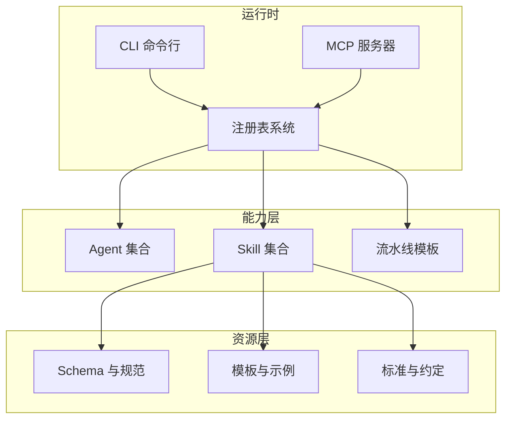
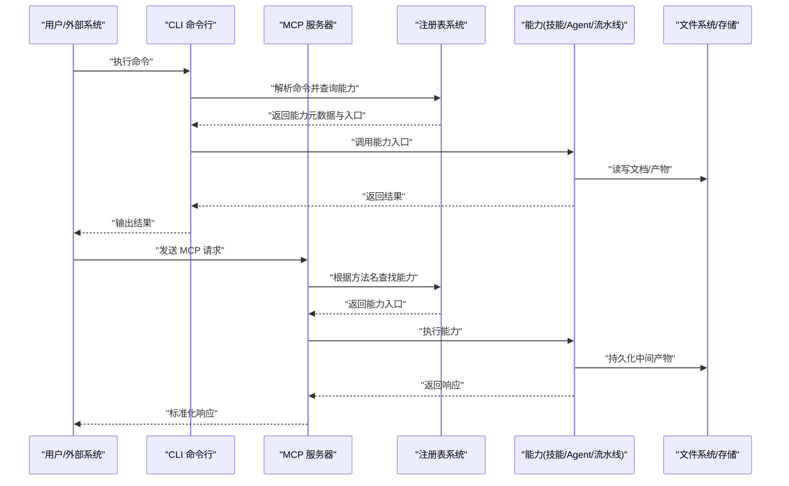
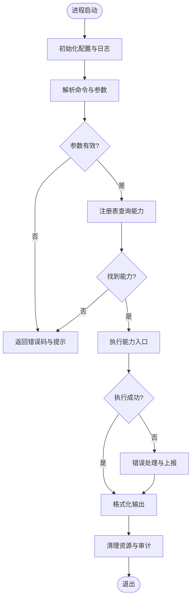
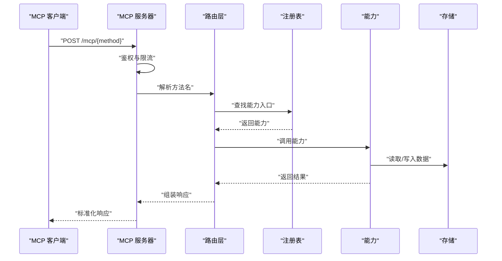
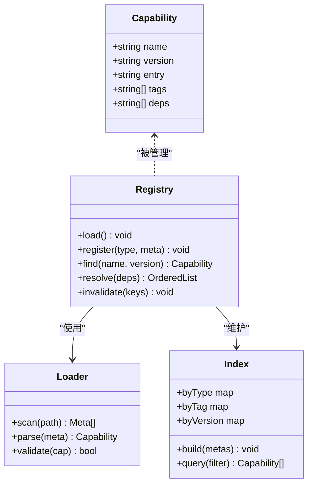
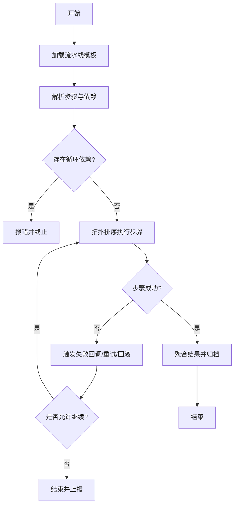
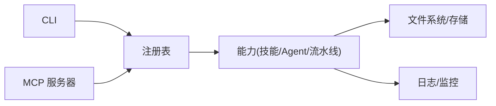

# 工具链架构设计

<cite>
**本文引用的文件**   
- [CLAUDE.MD](file://CLAUDE.MD)
- [AGENT-SKILL-MATRIX.md](file://AGENT-SKILL-MATRIX.md)
- [agents/_index.yml](file://agents/_index.yml)
- [skills/_index.yml](file://skills/_index.yml)
- [pipeline-templates/README.md](file://pipeline-templates/README.md)
- [pipeline-templates/architecture-design.pipeline.json](file://pipeline-templates/architecture-design.pipeline.json)
- [pipeline-templates/code-implementation.pipeline.json](file://pipeline-templates/code-implementation.pipeline.json)
- [pipeline-templates/competitive-radar.pipeline.json](file://pipeline-templates/competitive-radar.pipeline.json)
- [pipeline-templates/feature-writeback.pipeline.json](file://pipeline-templates/feature-writeback.pipeline.json)
- [pipeline-templates/market-to-plan.pipeline.json](file://pipeline-templates/market-to-plan.pipeline.json)
- [pipeline-templates/product-planning.pipeline.json](file://pipeline-templates/product-planning.pipeline.json)
- [pipeline-templates/requirement-authoring.pipeline.json](file://pipeline-templates/requirement-authoring.pipeline.json)
- [pipeline-templates/resume-cr.pipeline.json](file://pipeline-templates/resume-cr.pipeline.json)
- [skills/shared/engineering-docs/scripts/src/cli.ts](file://skills/shared/engineering-docs/scripts/src/cli.ts)
- [skills/shared/engineering-docs/scripts/src/mcp.ts](file://skills/shared/engineering-docs/scripts/src/mcp.ts)
- [skills/shared/engineering-docs/scripts/src/registry.ts](file://skills/shared/engineering-docs/scripts/src/registry.ts)
- [skills/shared/engineering-docs/scripts/package.json](file://skills/shared/engineering-docs/scripts/package.json)
- [dir-graph.yaml](file://dir-graph.yaml)
</cite>

## 目录
1. [简介](#简介)
2. [项目结构](#项目结构)
3. [核心组件](#核心组件)
4. [架构总览](#架构总览)
5. [详细组件分析](#详细组件分析)
6. [依赖分析](#依赖分析)
7. [性能考虑](#性能考虑)
8. [故障排查指南](#故障排查指南)
9. [结论](#结论)
10. [附录](#附录)

## 简介
本文件面向工程文档工具链的架构设计与实现，聚焦以下目标：
- 整体架构与模块化设计模式
- CLI 命令行工具、MCP 服务器接口、注册表系统的职责与交互
- 系统启动流程、依赖注入机制与生命周期管理
- 扩展点与集成模式（Agent、Skill、Pipeline）
- 数据流转与处理逻辑
- 错误处理、日志记录与性能优化策略

该工具链以“可组合的流水线 + 可扩展的 Agent/Skill + 可插拔的 MCP 服务”为核心思想，通过注册表统一发现与编排能力，形成从需求到代码再到写回的闭环。

## 项目结构
仓库采用“领域分层 + 资源驱动”的组织方式：
- agents：Agent 定义与索引，描述角色、能力与协作关系
- skills：按领域划分的技能包，每个技能包含 SKILL.md 说明与可选脚本/模板
- pipeline-templates：流水线模板，声明式地编排任务序列与输入输出
- shared/engineering-docs/scripts：工程文档子项目的源码，提供 CLI、MCP、注册表等核心运行时
- dir-graph.yaml：目录结构与依赖关系的可视化配置

图表来源
- [skills/shared/engineering-docs/scripts/src/cli.ts](file://skills/shared/engineering-docs/scripts/src/cli.ts)
- [skills/shared/engineering-docs/scripts/src/mcp.ts](file://skills/shared/engineering-docs/scripts/src/mcp.ts)
- [skills/shared/engineering-docs/scripts/src/registry.ts](file://skills/shared/engineering-docs/scripts/src/registry.ts)
- [agents/_index.yml](file://agents/_index.yml)
- [skills/_index.yml](file://skills/_index.yml)
- [pipeline-templates/README.md](file://pipeline-templates/README.md)

章节来源
- [CLAUDE.MD](file://CLAUDE.MD)
- [dir-graph.yaml](file://dir-graph.yaml)

## 核心组件
- CLI 命令行工具
  - 负责解析用户命令、参数校验、加载上下文、调用注册表并执行对应能力
  - 作为人类或外部系统的入口点，屏蔽底层复杂性
- MCP 服务器接口
  - 暴露标准化的模型通信协议接口，供 AI 客户端或自动化流程调用
  - 将 MCP 请求路由至注册表，再调度到具体 Skill/Agent/Pipeline
- 注册表系统
  - 集中管理所有可发现的能力（Agent、Skill、Pipeline），提供加载、缓存、版本选择与依赖解析
  - 是系统扩展的核心枢纽，支持热更新与动态装配
- 流水线模板
  - 以声明式 JSON 描述端到端工作流，串联多个步骤，定义输入输出、条件分支与回滚策略
- Agent 与 Skill
  - Agent 代表具备特定角色的智能体；Skill 是可复用的最小能力单元
  - 两者均通过注册表进行发现与编排，支持组合与复用

章节来源
- [skills/shared/engineering-docs/scripts/src/cli.ts](file://skills/shared/engineering-docs/scripts/src/cli.ts)
- [skills/shared/engineering-docs/scripts/src/mcp.ts](file://skills/shared/engineering-docs/scripts/src/mcp.ts)
- [skills/shared/engineering-docs/scripts/src/registry.ts](file://skills/shared/engineering-docs/scripts/src/registry.ts)
- [agents/_index.yml](file://agents/_index.yml)
- [skills/_index.yml](file://skills/_index.yml)
- [pipeline-templates/README.md](file://pipeline-templates/README.md)

## 架构总览
下图展示了 CLI 与 MCP 如何经由注册表访问能力，以及流水线模板在其中的编排作用。

图表来源
- [skills/shared/engineering-docs/scripts/src/cli.ts](file://skills/shared/engineering-docs/scripts/src/cli.ts)
- [skills/shared/engineering-docs/scripts/src/mcp.ts](file://skills/shared/engineering-docs/scripts/src/mcp.ts)
- [skills/shared/engineering-docs/scripts/src/registry.ts](file://skills/shared/engineering-docs/scripts/src/registry.ts)

## 详细组件分析

### CLI 命令行工具
- 职责
  - 解析命令与参数，构建运行上下文
  - 通过注册表发现并加载能力，执行并输出结果
  - 提供错误码与结构化日志，便于诊断
- 关键流程
  - 初始化：加载配置、注册全局钩子、准备日志与指标
  - 路由：根据命令映射到能力入口
  - 执行：调用能力，捕获异常，生成报告
  - 清理：释放资源、关闭连接、写入审计日志
- 扩展点
  - 新增命令：在命令表中注册处理器
  - 自定义输出格式：实现输出适配器
  - 插件钩子：在生命周期中插入前置/后置逻辑

图表来源
- [skills/shared/engineering-docs/scripts/src/cli.ts](file://skills/shared/engineering-docs/scripts/src/cli.ts)

章节来源
- [skills/shared/engineering-docs/scripts/src/cli.ts](file://skills/shared/engineering-docs/scripts/src/cli.ts)

### MCP 服务器接口
- 职责
  - 暴露统一的模型通信协议，接收并分发请求
  - 基于方法名或命名空间路由到注册表，再调度到具体能力
  - 保证请求/响应的序列化、鉴权与限流
- 关键流程
  - 监听：启动 HTTP/WS 监听器
  - 鉴权：验证令牌与权限
  - 路由：解析方法名，查注册表获取能力
  - 执行：调用能力，收集中间状态
  - 响应：标准化响应格式，记录审计日志
- 扩展点
  - 新增方法：在路由表中注册映射
  - 自定义鉴权：实现鉴权中间件
  - 自定义序列化：适配不同传输协议

图表来源
- [skills/shared/engineering-docs/scripts/src/mcp.ts](file://skills/shared/engineering-docs/scripts/src/mcp.ts)
- [skills/shared/engineering-docs/scripts/src/registry.ts](file://skills/shared/engineering-docs/scripts/src/registry.ts)

章节来源
- [skills/shared/engineering-docs/scripts/src/mcp.ts](file://skills/shared/engineering-docs/scripts/src/mcp.ts)

### 注册表系统
- 职责
  - 扫描与加载 Agent、Skill、Pipeline 的元数据
  - 维护能力索引、版本选择与依赖图
  - 提供能力发现、缓存与热更新能力
- 数据结构
  - 能力元数据：名称、版本、入口、依赖、标签
  - 索引表：按类型、标签、版本组织
  - 依赖图：用于拓扑排序与冲突检测
- 关键流程
  - 初始化：扫描目录、解析 YAML/JSON、构建索引
  - 查询：按名称/标签/版本检索能力
  - 解析：计算依赖顺序，检测循环依赖
  - 更新：增量扫描与缓存失效
- 扩展点
  - 新能力类型：注册新的加载器与校验器
  - 新存储后端：实现索引持久化接口
  - 新策略：版本选择、冲突解决、灰度发布

图表来源
- [skills/shared/engineering-docs/scripts/src/registry.ts](file://skills/shared/engineering-docs/scripts/src/registry.ts)

章节来源
- [skills/shared/engineering-docs/scripts/src/registry.ts](file://skills/shared/engineering-docs/scripts/src/registry.ts)

### 流水线模板
- 职责
  - 以声明式 JSON 描述端到端工作流
  - 定义步骤、输入输出、条件分支、重试与回滚
  - 与注册表联动，动态加载步骤实现
- 关键元素
  - 步骤列表：顺序/并行/条件执行
  - 变量与上下文：跨步骤传递数据
  - 钩子：前置/后置、失败回调
- 典型场景
  - 架构设计流水线：需求分析 → 架构草图 → 评审 → 归档
  - 代码实现流水线：任务拆解 → 编码 → 测试 → 提交
  - 竞品雷达流水线：数据采集 → 分析 → 报告生成
  - 特性写回流水线：PRD/SDD → 分支合并 → 追踪写回

图表来源
- [pipeline-templates/README.md](file://pipeline-templates/README.md)
- [pipeline-templates/architecture-design.pipeline.json](file://pipeline-templates/architecture-design.pipeline.json)
- [pipeline-templates/code-implementation.pipeline.json](file://pipeline-templates/code-implementation.pipeline.json)
- [pipeline-templates/competitive-radar.pipeline.json](file://pipeline-templates/competitive-radar.pipeline.json)
- [pipeline-templates/feature-writeback.pipeline.json](file://pipeline-templates/feature-writeback.pipeline.json)
- [pipeline-templates/market-to-plan.pipeline.json](file://pipeline-templates/market-to-plan.pipeline.json)
- [pipeline-templates/product-planning.pipeline.json](file://pipeline-templates/product-planning.pipeline.json)
- [pipeline-templates/requirement-authoring.pipeline.json](file://pipeline-templates/requirement-authoring.pipeline.json)
- [pipeline-templates/resume-cr.pipeline.json](file://pipeline-templates/resume-cr.pipeline.json)

章节来源
- [pipeline-templates/README.md](file://pipeline-templates/README.md)
- [pipeline-templates/architecture-design.pipeline.json](file://pipeline-templates/architecture-design.pipeline.json)
- [pipeline-templates/code-implementation.pipeline.json](file://pipeline-templates/code-implementation.pipeline.json)
- [pipeline-templates/competitive-radar.pipeline.json](file://pipeline-templates/competitive-radar.pipeline.json)
- [pipeline-templates/feature-writeback.pipeline.json](file://pipeline-templates/feature-writeback.pipeline.json)
- [pipeline-templates/market-to-plan.pipeline.json](file://pipeline-templates/market-to-plan.pipeline.json)
- [pipeline-templates/product-planning.pipeline.json](file://pipeline-templates/product-planning.pipeline.json)
- [pipeline-templates/requirement-authoring.pipeline.json](file://pipeline-templates/requirement-authoring.pipeline.json)
- [pipeline-templates/resume-cr.pipeline.json](file://pipeline-templates/resume-cr.pipeline.json)

### Agent 与 Skill 体系
- Agent
  - 角色化智能体，具备特定职责与协作契约
  - 通过索引文件统一管理，支持按标签筛选与组合
- Skill
  - 最小可复用能力单元，包含说明、输入输出、依赖与可选脚本
  - 通过注册表发现，支持版本管理与灰度发布
- 协作模式
  - 单 Agent 调用多 Skill 完成复杂任务
  - 多 Agent 协同，通过流水线编排达成端到端目标

章节来源
- [agents/_index.yml](file://agents/_index.yml)
- [skills/_index.yml](file://skills/_index.yml)
- [AGENT-SKILL-MATRIX.md](file://AGENT-SKILL-MATRIX.md)

## 依赖分析
- 内部依赖
  - CLI 依赖注册表与能力入口
  - MCP 依赖注册表与路由层
  - 注册表依赖加载器与索引
  - 流水线模板依赖注册表与步骤实现
- 外部依赖
  - 文件系统与对象存储
  - 消息总线（可选，用于异步事件）
  - 监控与日志系统
- 耦合与内聚
  - 注册表作为中心枢纽，降低模块间直接耦合
  - 能力实现保持高内聚，仅依赖注册表提供的抽象

图表来源
- [skills/shared/engineering-docs/scripts/src/cli.ts](file://skills/shared/engineering-docs/scripts/src/cli.ts)
- [skills/shared/engineering-docs/scripts/src/mcp.ts](file://skills/shared/engineering-docs/scripts/src/mcp.ts)
- [skills/shared/engineering-docs/scripts/src/registry.ts](file://skills/shared/engineering-docs/scripts/src/registry.ts)

章节来源
- [skills/shared/engineering-docs/scripts/src/cli.ts](file://skills/shared/engineering-docs/scripts/src/cli.ts)
- [skills/shared/engineering-docs/scripts/src/mcp.ts](file://skills/shared/engineering-docs/scripts/src/mcp.ts)
- [skills/shared/engineering-docs/scripts/src/registry.ts](file://skills/shared/engineering-docs/scripts/src/registry.ts)

## 性能考虑
- 注册表缓存
  - 对能力元数据与索引进行内存缓存，减少重复扫描
  - 支持增量更新与失效策略，平衡一致性与性能
- 流水线并行
  - 无依赖的步骤并行执行，缩短端到端耗时
  - 控制并发度，避免资源争用
- 懒加载与按需加载
  - 仅在需要时加载能力实现，降低启动开销
- 批处理与缓冲
  - 批量写入与压缩，减少 I/O 次数
- 监控与度量
  - 采集关键路径耗时、错误率与吞吐，指导优化

[本节为通用建议，不直接分析具体文件]

## 故障排查指南
- 常见问题
  - 能力未找到：检查注册表索引与能力元数据是否正确
  - 循环依赖：查看依赖图，调整步骤顺序或拆分能力
  - 权限不足：确认 MCP 鉴权与文件系统权限
  - 超时与重试：检查网络与外部依赖可用性，调整重试策略
- 诊断手段
  - 启用详细日志，定位错误堆栈与上下文
  - 导出流水线执行轨迹，分析失败步骤
  - 使用健康检查接口，确认服务状态
- 恢复策略
  - 自动重试与退避
  - 失败回调与补偿操作
  - 快照与回滚，确保一致性

章节来源
- [skills/shared/engineering-docs/scripts/src/cli.ts](file://skills/shared/engineering-docs/scripts/src/cli.ts)
- [skills/shared/engineering-docs/scripts/src/mcp.ts](file://skills/shared/engineering-docs/scripts/src/mcp.ts)
- [skills/shared/engineering-docs/scripts/src/registry.ts](file://skills/shared/engineering-docs/scripts/src/registry.ts)

## 结论
本工具链以注册表为中心，结合 CLI 与 MCP 双入口，实现了高度模块化与可扩展的工程文档体系。通过声明式流水线与 Agent/Skill 的组合，能够快速搭建从需求到实现的端到端流程。建议在持续演进中强化监控与可观测性，完善错误恢复与灰度发布能力，进一步提升稳定性与可维护性。

[本节为总结性内容，不直接分析具体文件]

## 附录
- 快速上手
  - 安装依赖：参考子项目 package.json 中的依赖与脚本
  - 启动 CLI：执行主命令，查看帮助与可用命令
  - 启动 MCP：运行服务器，验证健康检查与方法列表
  - 运行流水线：加载模板，传入上下文，观察执行轨迹
- 最佳实践
  - 明确能力边界，保持单一职责
  - 使用 Schema 与模板约束输入输出
  - 为关键路径添加日志与指标
  - 定期审查依赖图，避免过度耦合

章节来源
- [skills/shared/engineering-docs/scripts/package.json](file://skills/shared/engineering-docs/scripts/package.json)