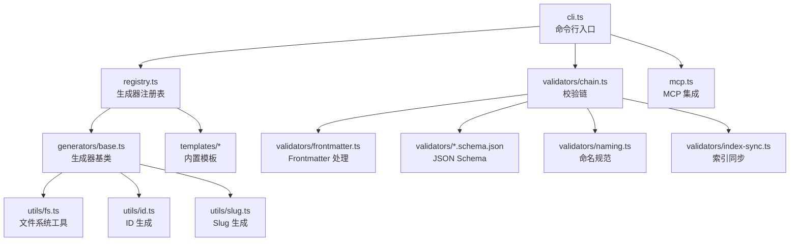
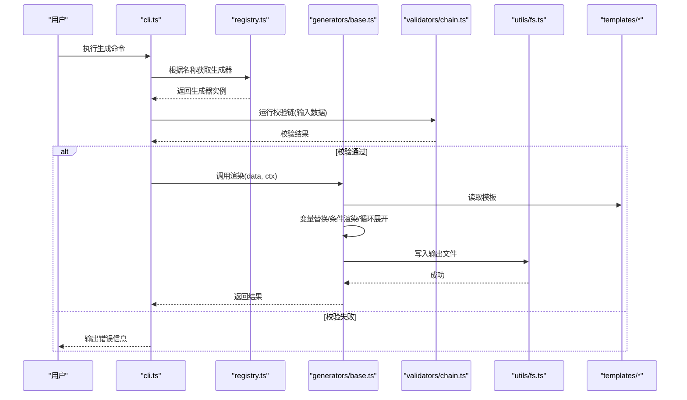
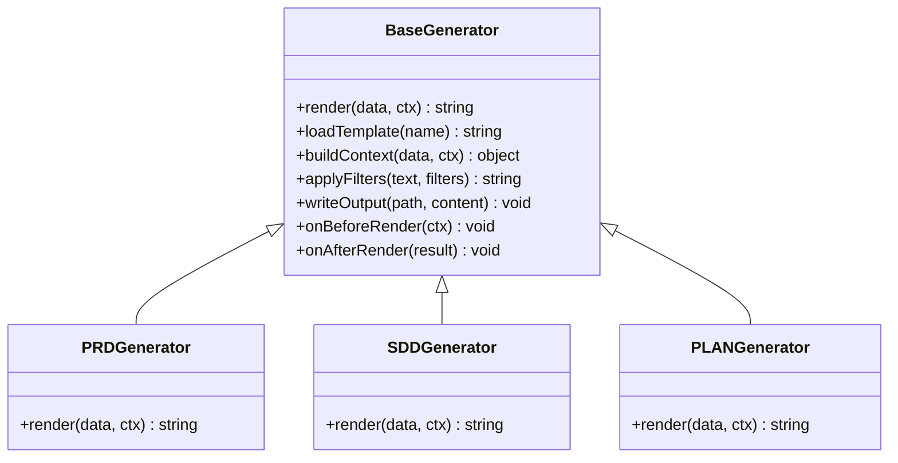
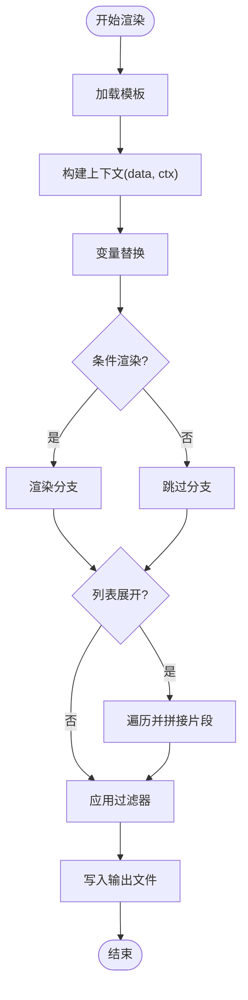
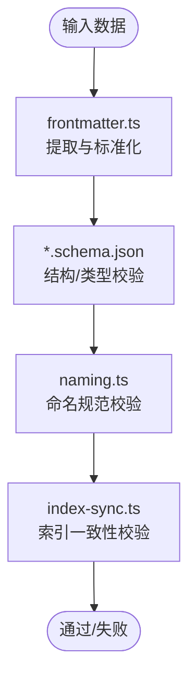
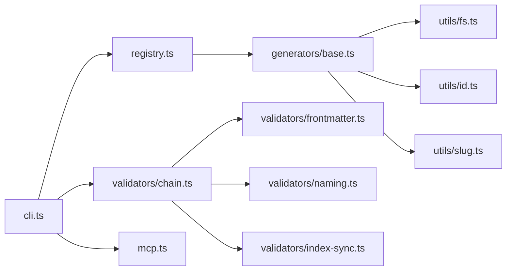

# 生成器框架

<cite>
**本文引用的文件**   
- [base.ts](file://skills/shared/engineering-docs/scripts/src/generators/base.ts)
- [cli.ts](file://skills/shared/engineering-docs/scripts/src/cli.ts)
- [registry.ts](file://skills/shared/engineering-docs/scripts/src/registry.ts)
- [mcp.ts](file://skills/shared/engineering-docs/scripts/src/mcp.ts)
- [fs.ts](file://skills/shared/engineering-docs/scripts/src/utils/fs.ts)
- [id.ts](file://skills/shared/engineering-docs/scripts/src/utils/id.ts)
- [slug.ts](file://skills/shared/engineering-docs/scripts/src/utils/slug.ts)
- [PRD-template.md](file://skills/shared/engineering-docs/templates/PRD-template.md)
- [SDD-template.md](file://skills/shared/engineering-docs/templates/SDD-template.md)
- [PLAN-template.md](file://skills/shared/engineering-docs/templates/PLAN-template.md)
- [MODULE-template.md](file://skills/shared/engineering-docs/templates/MODULE-template.md)
- [TASK-template.md](file://skills/shared/engineering-docs/templates/TASK-template.md)
- [RELEASE-template.md](file://skills/shared/engineering-docs/templates/RELEASE-template.md)
- [FORM-template.md](file://skills/shared/engineering-docs/templates/FORM-template.md)
- [OpenAPI-template.yaml](file://skills/shared/engineering-docs/templates/OpenAPI-template.yaml)
- [form.schema.json](file://skills/shared/engineering-docs/scripts/src/validators/form.schema.json)
- [plan.schema.json](file://skills/shared/engineering-docs/scripts/src/validators/plan.schema.json)
- [prd.schema.json](file://skills/shared/engineering-docs/scripts/src/validators/prd.schema.json)
- [sdd.schema.json](file://skills/shared/engineering-docs/scripts/src/validators/sdd.schema.json)
- [common-defs.schema.json](file://skills/shared/engineering-docs/scripts/src/validators/common-defs.schema.json)
- [module.schema.json](file://skills/shared/engineering-docs/scripts/src/validators/module.schema.json)
- [release.schema.json](file://skills/shared/engineering-docs/scripts/src/validators/release.schema.json)
- [task.schema.json](file://skills/shared/engineering-docs/scripts/src/validators/task.schema.json)
- [frontmatter.ts](file://skills/shared/engineering-docs/scripts/src/validators/frontmatter.ts)
- [chain.ts](file://skills/shared/engineering-docs/scripts/src/validators/chain.ts)
- [naming.ts](file://skills/shared/engineering-docs/scripts/src/validators/naming.ts)
- [index-sync.ts](file://skills/shared/engineering-docs/scripts/src/validators/index-sync.ts)
- [generators.test.ts](file://skills/shared/engineering-docs/scripts/src/__tests__/generators.test.ts)
</cite>

## 目录
1. [简介](#简介)
2. [项目结构](#项目结构)
3. [核心组件](#核心组件)
4. [架构总览](#架构总览)
5. [详细组件分析](#详细组件分析)
6. [依赖关系分析](#依赖关系分析)
7. [性能考虑](#性能考虑)
8. [故障排查指南](#故障排查指南)
9. [结论](#结论)
10. [附录](#附录)

## 简介
本文件面向“工程文档生成器”子系统的开发者与使用者，系统性阐述其架构设计、模板引擎机制、基类继承体系与扩展点、模板渲染与变量替换流程、内置模板类型与用途、自定义模板与生成器的创建方法、最佳实践与性能优化技巧，并给出实际集成示例。该子系统位于 skills/shared/engineering-docs/scripts 目录中，提供命令行入口、注册表、MCP 集成、通用工具函数、校验链以及多种文档模板（PRD、SDD、PLAN、MODULE、TASK、RELEASE、FORM、OpenAPI）。

## 项目结构
工程文档脚本采用分层组织：
- 入口层：CLI 命令解析与调度
- 服务层：注册表与 MCP 集成
- 生成器层：基于基类的模板渲染与输出
- 工具层：文件系统、ID 与 Slug 生成等
- 校验层：Schema 校验、Frontmatter 处理、命名规范、索引同步
- 模板层：Markdown/YAML 模板与 JSON Schema 定义
- 测试层：针对生成器与校验链的单元测试

图表来源
- [cli.ts](file://skills/shared/engineering-docs/scripts/src/cli.ts)
- [registry.ts](file://skills/shared/engineering-docs/scripts/src/registry.ts)
- [base.ts](file://skills/shared/engineering-docs/scripts/src/generators/base.ts)
- [fs.ts](file://skills/shared/engineering-docs/scripts/src/utils/fs.ts)
- [id.ts](file://skills/shared/engineering-docs/scripts/src/utils/id.ts)
- [slug.ts](file://skills/shared/engineering-docs/scripts/src/utils/slug.ts)
- [chain.ts](file://skills/shared/engineering-docs/scripts/src/validators/chain.ts)
- [frontmatter.ts](file://skills/shared/engineering-docs/scripts/src/validators/frontmatter.ts)
- [naming.ts](file://skills/shared/engineering-docs/scripts/src/validators/naming.ts)
- [index-sync.ts](file://skills/shared/engineering-docs/scripts/src/validators/index-sync.ts)
- [mcp.ts](file://skills/shared/engineering-docs/scripts/src/mcp.ts)

章节来源
- [cli.ts](file://skills/shared/engineering-docs/scripts/src/cli.ts)
- [registry.ts](file://skills/shared/engineering-docs/scripts/src/registry.ts)
- [base.ts](file://skills/shared/engineering-docs/scripts/src/generators/base.ts)

## 核心组件
- 生成器基类：封装模板加载、数据绑定、条件渲染、变量替换、输出路径计算、前后置钩子等通用能力，供具体生成器继承复用。
- 注册表：集中管理生成器实例与元信息，支持按名称查找、批量执行、生命周期回调。
- 校验链：在生成前对输入数据进行多阶段校验（Schema、Frontmatter、命名、索引一致性），失败则中止生成。
- 工具库：提供安全的文件读写、ID 生成、Slug 生成等基础能力。
- 模板集合：覆盖 PRD、SDD、PLAN、MODULE、TASK、RELEASE、FORM、OpenAPI 等常用工程文档类型。

章节来源
- [base.ts](file://skills/shared/engineering-docs/scripts/src/generators/base.ts)
- [registry.ts](file://skills/shared/engineering-docs/scripts/src/registry.ts)
- [chain.ts](file://skills/shared/engineering-docs/scripts/src/validators/chain.ts)
- [fs.ts](file://skills/shared/engineering-docs/scripts/src/utils/fs.ts)
- [id.ts](file://skills/shared/engineering-docs/scripts/src/utils/id.ts)
- [slug.ts](file://skills/shared/engineering-docs/scripts/src/utils/slug.ts)

## 架构总览
整体架构围绕“命令驱动 + 注册表分发 + 基类抽象 + 模板渲染 + 校验前置”展开。CLI 接收参数后，通过注册表定位目标生成器；生成器在执行前触发校验链，通过后进入模板渲染阶段；渲染过程中完成变量替换、条件分支与循环展开，最终写入目标文件。

图表来源
- [cli.ts](file://skills/shared/engineering-docs/scripts/src/cli.ts)
- [registry.ts](file://skills/shared/engineering-docs/scripts/src/registry.ts)
- [base.ts](file://skills/shared/engineering-docs/scripts/src/generators/base.ts)
- [chain.ts](file://skills/shared/engineering-docs/scripts/src/validators/chain.ts)
- [fs.ts](file://skills/shared/engineering-docs/scripts/src/utils/fs.ts)
- [PRD-template.md](file://skills/shared/engineering-docs/templates/PRD-template.md)
- [SDD-template.md](file://skills/shared/engineering-docs/templates/SDD-template.md)
- [PLAN-template.md](file://skills/shared/engineering-docs/templates/PLAN-template.md)

## 详细组件分析

### 生成器基类与继承体系
生成器基类提供统一的模板渲染接口与生命周期钩子，子类只需实现最小化逻辑即可复用变量替换、条件渲染、输出路径计算等能力。典型职责包括：
- 模板解析与缓存策略
- 上下文构建（data、ctx）
- 变量替换与表达式求值
- 条件渲染与列表展开
- 输出路径与文件名生成
- 前后置钩子（如日志、埋点、清理）

图表来源
- [base.ts](file://skills/shared/engineering-docs/scripts/src/generators/base.ts)

章节来源
- [base.ts](file://skills/shared/engineering-docs/scripts/src/generators/base.ts)

### 模板引擎机制与变量替换
模板引擎负责将结构化数据注入到模板中，支持：
- 变量替换：以占位符形式引用 data 中的字段
- 条件渲染：根据布尔或存在性判断是否输出某段内容
- 列表展开：遍历数组生成重复片段
- 过滤器：对文本进行格式化、转义、截断等处理
- 嵌套上下文：支持多层级对象访问

图表来源
- [base.ts](file://skills/shared/engineering-docs/scripts/src/generators/base.ts)
- [fs.ts](file://skills/shared/engineering-docs/scripts/src/utils/fs.ts)

章节来源
- [base.ts](file://skills/shared/engineering-docs/scripts/src/generators/base.ts)
- [fs.ts](file://skills/shared/engineering-docs/scripts/src/utils/fs.ts)

### 内置模板类型与用途
- PRD 模板：产品需求文档，用于描述功能背景、目标、范围、验收标准等
- SDD 模板：系统设计文档，用于记录架构决策、模块划分、接口约定等
- PLAN 模板：实施计划，用于规划里程碑、任务分解、资源安排等
- MODULE 模板：模块说明，用于定义模块职责、依赖关系、变更历史等
- TASK 模板：任务卡片，用于跟踪开发任务、状态流转、关联文档等
- RELEASE 模板：发布说明，用于版本变更、兼容性、回滚策略等
- FORM 模板：表单定义，用于描述字段、校验规则、展示布局等
- OpenAPI 模板：接口契约，用于描述 API 端点、请求响应、鉴权方式等

章节来源
- [PRD-template.md](file://skills/shared/engineering-docs/templates/PRD-template.md)
- [SDD-template.md](file://skills/shared/engineering-docs/templates/SDD-template.md)
- [PLAN-template.md](file://skills/shared/engineering-docs/templates/PLAN-template.md)
- [MODULE-template.md](file://skills/shared/engineering-docs/templates/MODULE-template.md)
- [TASK-template.md](file://skills/shared/engineering-docs/templates/TASK-template.md)
- [RELEASE-template.md](file://skills/shared/engineering-docs/templates/RELEASE-template.md)
- [FORM-template.md](file://skills/shared/engineering-docs/templates/FORM-template.md)
- [OpenAPI-template.yaml](file://skills/shared/engineering-docs/templates/OpenAPI-template.yaml)

### 自定义模板与生成器开发
- 模板语法要点
  - 使用占位符引用数据字段
  - 使用条件语句控制段落显示
  - 使用循环语句展开列表项
  - 使用过滤器进行文本处理
- 数据绑定
  - 顶层字段直接引用
  - 嵌套对象通过层级访问
  - 空值与默认值处理
- 条件渲染
  - 布尔开关控制
  - 字段存在性判断
  - 组合条件与优先级
- 创建步骤
  - 新增模板文件至 templates 目录
  - 在生成器基类基础上派生新类，实现 render 方法
  - 在注册表中登记新生成器
  - 编写对应 JSON Schema 与校验规则
  - 补充单元测试验证渲染结果

章节来源
- [base.ts](file://skills/shared/engineering-docs/scripts/src/generators/base.ts)
- [registry.ts](file://skills/shared/engineering-docs/scripts/src/registry.ts)
- [form.schema.json](file://skills/shared/engineering-docs/scripts/src/validators/form.schema.json)
- [plan.schema.json](file://skills/shared/engineering-docs/scripts/src/validators/plan.schema.json)
- [prd.schema.json](file://skills/shared/engineering-docs/scripts/src/validators/prd.schema.json)
- [sdd.schema.json](file://skills/shared/engineering-docs/scripts/src/validators/sdd.schema.json)
- [common-defs.schema.json](file://skills/shared/engineering-docs/scripts/src/validators/common-defs.schema.json)
- [module.schema.json](file://skills/shared/engineering-docs/scripts/src/validators/module.schema.json)
- [release.schema.json](file://skills/shared/engineering-docs/scripts/src/validators/release.schema.json)
- [task.schema.json](file://skills/shared/engineering-docs/scripts/src/validators/task.schema.json)

### 校验链与数据契约
校验链在生成前对输入数据进行多阶段检查，确保模板渲染的数据质量与一致性：
- Schema 校验：依据 JSON Schema 验证结构与类型
- Frontmatter 处理：提取与标准化文档头部信息
- 命名规范：统一文件与目录命名约定
- 索引同步：保证索引文件与实际文档一致

图表来源
- [frontmatter.ts](file://skills/shared/engineering-docs/scripts/src/validators/frontmatter.ts)
- [form.schema.json](file://skills/shared/engineering-docs/scripts/src/validators/form.schema.json)
- [plan.schema.json](file://skills/shared/engineering-docs/scripts/src/validators/plan.schema.json)
- [prd.schema.json](file://skills/shared/engineering-docs/scripts/src/validators/prd.schema.json)
- [sdd.schema.json](file://skills/shared/engineering-docs/scripts/src/validators/sdd.schema.json)
- [common-defs.schema.json](file://skills/shared/engineering-docs/scripts/src/validators/common-defs.schema.json)
- [module.schema.json](file://skills/shared/engineering-docs/scripts/src/validators/module.schema.json)
- [release.schema.json](file://skills/shared/engineering-docs/scripts/src/validators/release.schema.json)
- [task.schema.json](file://skills/shared/engineering-docs/scripts/src/validators/task.schema.json)
- [naming.ts](file://skills/shared/engineering-docs/scripts/src/validators/naming.ts)
- [index-sync.ts](file://skills/shared/engineering-docs/scripts/src/validators/index-sync.ts)

章节来源
- [chain.ts](file://skills/shared/engineering-docs/scripts/src/validators/chain.ts)
- [frontmatter.ts](file://skills/shared/engineering-docs/scripts/src/validators/frontmatter.ts)
- [naming.ts](file://skills/shared/engineering-docs/scripts/src/validators/naming.ts)
- [index-sync.ts](file://skills/shared/engineering-docs/scripts/src/validators/index-sync.ts)

### 集成示例与用例
- 通过 CLI 调用指定生成器，传入数据文件路径与输出目录
- 在注册表中添加新的生成器，使其可被 CLI 发现与执行
- 结合 MCP 集成，在外部系统中触发文档生成任务
- 使用单元测试验证模板渲染结果与边界情况

章节来源
- [cli.ts](file://skills/shared/engineering-docs/scripts/src/cli.ts)
- [registry.ts](file://skills/shared/engineering-docs/scripts/src/registry.ts)
- [mcp.ts](file://skills/shared/engineering-docs/scripts/src/mcp.ts)
- [generators.test.ts](file://skills/shared/engineering-docs/scripts/src/__tests__/generators.test.ts)

## 依赖关系分析
- 低耦合高内聚：生成器基类仅依赖工具库与模板文件，不直接耦合具体业务逻辑
- 注册表解耦：CLI 通过注册表获取生成器，避免硬编码依赖
- 校验前置：校验链在渲染前拦截非法数据，降低运行时异常概率
- 外部集成：MCP 作为可选集成点，不影响核心生成流程

图表来源
- [cli.ts](file://skills/shared/engineering-docs/scripts/src/cli.ts)
- [registry.ts](file://skills/shared/engineering-docs/scripts/src/registry.ts)
- [base.ts](file://skills/shared/engineering-docs/scripts/src/generators/base.ts)
- [fs.ts](file://skills/shared/engineering-docs/scripts/src/utils/fs.ts)
- [id.ts](file://skills/shared/engineering-docs/scripts/src/utils/id.ts)
- [slug.ts](file://skills/shared/engineering-docs/scripts/src/utils/slug.ts)
- [chain.ts](file://skills/shared/engineering-docs/scripts/src/validators/chain.ts)
- [frontmatter.ts](file://skills/shared/engineering-docs/scripts/src/validators/frontmatter.ts)
- [naming.ts](file://skills/shared/engineering-docs/scripts/src/validators/naming.ts)
- [index-sync.ts](file://skills/shared/engineering-docs/scripts/src/validators/index-sync.ts)
- [mcp.ts](file://skills/shared/engineering-docs/scripts/src/mcp.ts)

章节来源
- [cli.ts](file://skills/shared/engineering-docs/scripts/src/cli.ts)
- [registry.ts](file://skills/shared/engineering-docs/scripts/src/registry.ts)
- [base.ts](file://skills/shared/engineering-docs/scripts/src/generators/base.ts)
- [chain.ts](file://skills/shared/engineering-docs/scripts/src/validators/chain.ts)

## 性能考虑
- 模板缓存：对频繁使用的模板进行内存缓存，减少 I/O 开销
- 增量渲染：仅对变更部分重新渲染，避免全量重建
- 并行生成：对独立文档并行渲染，提升吞吐
- 流式写入：大文档分块写入，降低内存峰值
- 校验短路：在校验链早期快速失败，减少无效渲染
- 过滤器优化：避免在循环中重复计算复杂过滤器

[本节为通用指导，无需特定文件来源]

## 故障排查指南
- 常见错误
  - 模板变量缺失：检查数据绑定与上下文构建
  - 条件渲染异常：确认布尔值与存在性判断
  - 列表展开为空：核对数组字段与迭代键名
  - 校验失败：查看 Schema 与命名规范错误详情
- 调试建议
  - 启用详细日志，打印中间上下文
  - 使用最小数据集复现问题
  - 逐步禁用校验环节定位瓶颈
  - 对比基准模板与自定义模板差异

章节来源
- [chain.ts](file://skills/shared/engineering-docs/scripts/src/validators/chain.ts)
- [frontmatter.ts](file://skills/shared/engineering-docs/scripts/src/validators/frontmatter.ts)
- [naming.ts](file://skills/shared/engineering-docs/scripts/src/validators/naming.ts)
- [index-sync.ts](file://skills/shared/engineering-docs/scripts/src/validators/index-sync.ts)
- [base.ts](file://skills/shared/engineering-docs/scripts/src/generators/base.ts)

## 结论
本生成器框架通过清晰的层次划分与可扩展的基类设计，实现了模板渲染与数据校验的解耦。借助注册表与校验链，系统具备良好的可维护性与稳定性。遵循本文的最佳实践与性能优化建议，可高效构建与集成各类工程文档生成器。

[本节为总结性内容，无需特定文件来源]

## 附录
- 术语
  - 生成器：负责将数据渲染为文档的组件
  - 模板：包含占位符与指令的文档骨架
  - 校验链：对输入数据进行多阶段验证的流程
- 参考
  - 模板文件位于 templates 目录
  - 校验 Schema 位于 validators 目录
  - 单元测试位于 __tests__ 目录

[本节为概念性内容，无需特定文件来源]