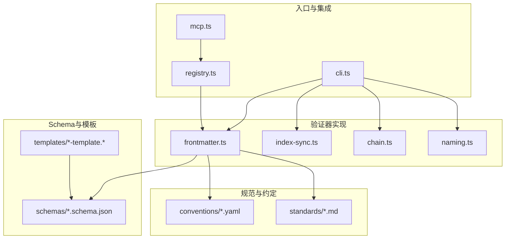
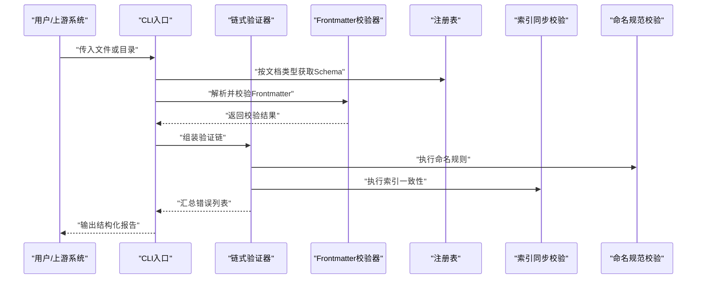
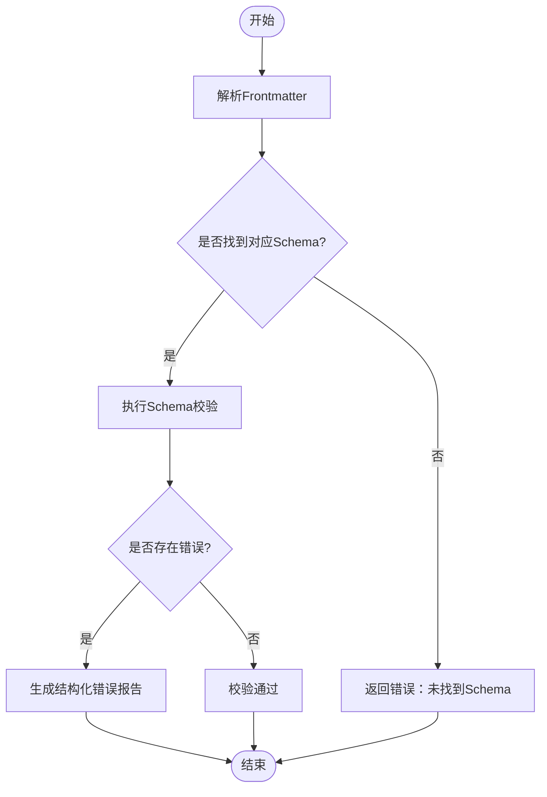
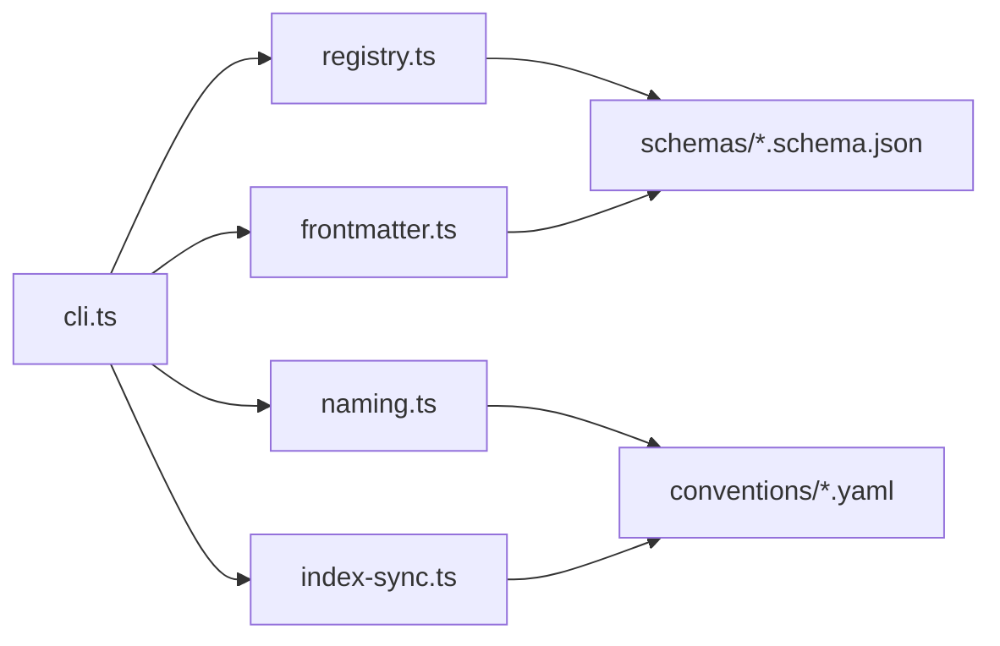

# Frontmatter验证器

<cite>
**本文引用的文件**   
- [frontmatter.ts](file://skills/shared/engineering-docs/scripts/src/validators/frontmatter.ts)
- [index-sync.ts](file://skills/shared/engineering-docs/scripts/src/validators/index-sync.ts)
- [chain.ts](file://skills/shared/engineering-docs/scripts/src/validators/chain.ts)
- [naming.ts](file://skills/shared/engineering-docs/scripts/src/validators/naming.ts)
- [cli.ts](file://skills/shared/engineering-docs/scripts/src/cli.ts)
- [mcp.ts](file://skills/shared/engineering-docs/scripts/src/mcp.ts)
- [registry.ts](file://skills/shared/engineering-docs/scripts/src/registry.ts)
- [common-defs.schema.json](file://skills/shared/engineering-docs/schemas/common-defs.schema.json)
- [prd.schema.json](file://skills/shared/engineering-docs/schemas/prd.schema.json)
- [plan.schema.json](file://skills/shared/engineering-docs/schemas/plan.schema.json)
- [form.schema.json](file://skills/shared/engineering-docs/schemas/form.schema.json)
- [module.schema.json](file://skills/shared/engineering-docs/schemas/module.schema.json)
- [release.schema.json](file://skills/shared/engineering-docs/schemas/release.schema.json)
- [sdd.schema.json](file://skills/shared/engineering-docs/schemas/sdd.schema.json)
- [task.schema.json](file://skills/shared/engineering-docs/schemas/task.schema.json)
- [PRD-template.md](file://skills/shared/engineering-docs/templates/PRD-template.md)
- [PLAN-template.md](file://skills/shared/engineering-docs/templates/PLAN-template.md)
- [FORM-template.md](file://skills/shared/engineering-docs/templates/FORM-template.md)
- [MODULE-template.md](file://skills/shared/engineering-docs/templates/MODULE-template.md)
- [RELEASE-template.md](file://skills/shared/engineering-docs/templates/RELEASE-template.md)
- [SDD-template.md](file://skills/shared/engineering-docs/templates/SDD-template.md)
- [TASK-template.md](file://skills/shared/engineering-docs/templates/TASK-template.md)
- [OpenAPI-template.yaml](file://skills/shared/engineering-docs/templates/OpenAPI-template.yaml)
- [ENGINEERING-STRUCTURE-TEAM.md](file://skills/shared/engineering-docs/standards/ENGINEERING-STRUCTURE-TEAM.md)
- [doc-chain.yaml](file://skills/shared/engineering-docs/conventions/doc-chain.yaml)
- [naming.yaml](file://skills/shared/engineering-docs/conventions/naming.yaml)
- [SKILL.md](file://skills/shared/validate-doc/SKILL.md)
</cite>

## 目录
1. [简介](#简介)
2. [项目结构](#项目结构)
3. [核心组件](#核心组件)
4. [架构总览](#架构总览)
5. [详细组件分析](#详细组件分析)
6. [依赖关系分析](#依赖关系分析)
7. [性能与可扩展性](#性能与可扩展性)
8. [故障排查指南](#故障排查指南)
9. [结论](#结论)
10. [附录](#附录)

## 简介
本文件面向工程文档体系中的Frontmatter（文档头部元数据）验证器，系统性说明其功能、用法与扩展方式。内容覆盖：
- 文档头部元数据的结构定义与必填字段校验
- 数据类型检查与自定义规则配置
- 支持的元数据格式、验证规则与错误消息处理
- 在不同文档类型中的应用示例与配置模板
- 常见问题定位与调试方法

该验证器以JSON Schema为核心约束来源，结合链式验证器与CLI工具，为PRD、PLAN、FORM、MODULE、RELEASE、SDD、TASK等文档类型提供一致的元数据质量保障。

## 项目结构
与Frontmatter验证相关的代码与资源主要分布在以下位置：
- 验证器实现：scripts/src/validators
- CLI入口与MCP集成：scripts/src/cli.ts、scripts/src/mcp.ts
- 注册表与编排：scripts/src/registry.ts、scripts/src/validators/chain.ts
- JSON Schema定义：schemas/*.schema.json
- 文档模板：templates/*-template.*
- 规范与约定：conventions/*.yaml、standards/*.md
- 技能入口：skills/shared/validate-doc/SKILL.md

图表来源
- [frontmatter.ts](file://skills/shared/engineering-docs/scripts/src/validators/frontmatter.ts)
- [index-sync.ts](file://skills/shared/engineering-docs/scripts/src/validators/index-sync.ts)
- [chain.ts](file://skills/shared/engineering-docs/scripts/src/validators/chain.ts)
- [naming.ts](file://skills/shared/engineering-docs/scripts/src/validators/naming.ts)
- [cli.ts](file://skills/shared/engineering-docs/scripts/src/cli.ts)
- [mcp.ts](file://skills/shared/engineering-docs/scripts/src/mcp.ts)
- [registry.ts](file://skills/shared/engineering-docs/scripts/src/registry.ts)
- [common-defs.schema.json](file://skills/shared/engineering-docs/schemas/common-defs.schema.json)
- [prd.schema.json](file://skills/shared/engineering-docs/schemas/prd.schema.json)
- [plan.schema.json](file://skills/shared/engineering-docs/schemas/plan.schema.json)
- [form.schema.json](file://skills/shared/engineering-docs/schemas/form.schema.json)
- [module.schema.json](file://skills/shared/engineering-docs/schemas/module.schema.json)
- [release.schema.json](file://skills/shared/engineering-docs/schemas/release.schema.json)
- [sdd.schema.json](file://skills/shared/engineering-docs/schemas/sdd.schema.json)
- [task.schema.json](file://skills/shared/engineering-docs/schemas/task.schema.json)
- [PRD-template.md](file://skills/shared/engineering-docs/templates/PRD-template.md)
- [PLAN-template.md](file://skills/shared/engineering-docs/templates/PLAN-template.md)
- [FORM-template.md](file://skills/shared/engineering-docs/templates/FORM-template.md)
- [MODULE-template.md](file://skills/shared/engineering-docs/templates/MODULE-template.md)
- [RELEASE-template.md](file://skills/shared/engineering-docs/templates/RELEASE-template.md)
- [SDD-template.md](file://skills/shared/engineering-docs/templates/SDD-template.md)
- [TASK-template.md](file://skills/shared/engineering-docs/templates/TASK-template.md)
- [OpenAPI-template.yaml](file://skills/shared/engineering-docs/templates/OpenAPI-template.yaml)
- [doc-chain.yaml](file://skills/shared/engineering-docs/conventions/doc-chain.yaml)
- [naming.yaml](file://skills/shared/engineering-docs/conventions/naming.yaml)
- [ENGINEERING-STRUCTURE-TEAM.md](file://skills/shared/engineering-docs/standards/ENGINEERING-STRUCTURE-TEAM.md)

章节来源
- [frontmatter.ts](file://skills/shared/engineering-docs/scripts/src/validators/frontmatter.ts)
- [index-sync.ts](file://skills/shared/engineering-docs/scripts/src/validators/index-sync.ts)
- [chain.ts](file://skills/shared/engineering-docs/scripts/src/validators/chain.ts)
- [naming.ts](file://skills/shared/engineering-docs/scripts/src/validators/naming.ts)
- [cli.ts](file://skills/shared/engineering-docs/scripts/src/cli.ts)
- [mcp.ts](file://skills/shared/engineering-docs/scripts/src/mcp.ts)
- [registry.ts](file://skills/shared/engineering-docs/scripts/src/registry.ts)
- [common-defs.schema.json](file://skills/shared/engineering-docs/schemas/common-defs.schema.json)
- [prd.schema.json](file://skills/shared/engineering-docs/schemas/prd.schema.json)
- [plan.schema.json](file://skills/shared/engineering-docs/schemas/plan.schema.json)
- [form.schema.json](file://skills/shared/engineering-docs/schemas/form.schema.json)
- [module.schema.json](file://skills/shared/engineering-docs/schemas/module.schema.json)
- [release.schema.json](file://skills/shared/engineering-docs/schemas/release.schema.json)
- [sdd.schema.json](file://skills/shared/engineering-docs/schemas/sdd.schema.json)
- [task.schema.json](file://skills/shared/engineering-docs/schemas/task.schema.json)
- [PRD-template.md](file://skills/shared/engineering-docs/templates/PRD-template.md)
- [PLAN-template.md](file://skills/shared/engineering-docs/templates/PLAN-template.md)
- [FORM-template.md](file://skills/shared/engineering-docs/templates/FORM-template.md)
- [MODULE-template.md](file://skills/shared/engineering-docs/templates/MODULE-template.md)
- [RELEASE-template.md](file://skills/shared/engineering-docs/templates/RELEASE-template.md)
- [SDD-template.md](file://skills/shared/engineering-docs/templates/SDD-template.md)
- [TASK-template.md](file://skills/shared/engineering-docs/templates/TASK-template.md)
- [OpenAPI-template.yaml](file://skills/shared/engineering-docs/templates/OpenAPI-template.yaml)
- [doc-chain.yaml](file://skills/shared/engineering-docs/conventions/doc-chain.yaml)
- [naming.yaml](file://skills/shared/engineering-docs/conventions/naming.yaml)
- [ENGINEERING-STRUCTURE-TEAM.md](file://skills/shared/engineering-docs/standards/ENGINEERING-STRUCTURE-TEAM.md)

## 核心组件
- frontmatter.ts：负责解析文档的Frontmatter块，基于JSON Schema进行结构与类型校验，并输出结构化错误信息。
- index-sync.ts：用于索引或清单一致性校验，确保文档集合层面的元数据完整性与引用关系正确。
- chain.ts：链式验证器编排，支持将多个验证步骤组合执行，短路失败或累积错误。
- naming.ts：命名规范校验，依据约定文件对文档名、标识符等进行规则匹配。
- cli.ts：命令行入口，提供批量扫描、指定文件校验、输出结果等能力。
- mcp.ts：MCP集成层，暴露验证能力供外部系统调用。
- registry.ts：验证器注册表，集中管理不同文档类型的Schema与规则映射。

章节来源
- [frontmatter.ts](file://skills/shared/engineering-docs/scripts/src/validators/frontmatter.ts)
- [index-sync.ts](file://skills/shared/engineering-docs/scripts/src/validators/index-sync.ts)
- [chain.ts](file://skills/shared/engineering-docs/scripts/src/validators/chain.ts)
- [naming.ts](file://skills/shared/engineering-docs/scripts/src/validators/naming.ts)
- [cli.ts](file://skills/shared/engineering-docs/scripts/src/cli.ts)
- [mcp.ts](file://skills/shared/engineering-docs/scripts/src/mcp.ts)
- [registry.ts](file://skills/shared/engineering-docs/scripts/src/registry.ts)

## 架构总览
Frontmatter验证器的整体流程如下：
- 输入：Markdown/YAML文档及其Frontmatter块
- 解析：提取Frontmatter为结构化对象
- 选择Schema：根据文档类型从注册表中选取对应JSON Schema
- 校验：执行类型与必填字段校验、枚举值校验、跨字段约束等
- 编排：通过链式验证器组合多步校验（如命名、索引同步等）
- 输出：统一的结构化错误报告，便于CLI或MCP消费

图表来源
- [cli.ts](file://skills/shared/engineering-docs/scripts/src/cli.ts)
- [chain.ts](file://skills/shared/engineering-docs/scripts/src/validators/chain.ts)
- [frontmatter.ts](file://skills/shared/engineering-docs/scripts/src/validators/frontmatter.ts)
- [registry.ts](file://skills/shared/engineering-docs/scripts/src/registry.ts)
- [index-sync.ts](file://skills/shared/engineering-docs/scripts/src/validators/index-sync.ts)
- [naming.ts](file://skills/shared/engineering-docs/scripts/src/validators/naming.ts)

## 详细组件分析

### Frontmatter校验器（frontmatter.ts）
职责与行为：
- 解析文档头部的Frontmatter块，将其转换为结构化对象
- 根据文档类型选择对应的JSON Schema进行校验
- 校验必填字段、数据类型、枚举值、长度范围、格式约束等
- 生成统一的错误消息，包含字段路径、期望类型与实际类型等信息

关键流程（概念图）：

图表来源
- [frontmatter.ts](file://skills/shared/engineering-docs/scripts/src/validators/frontmatter.ts)
- [common-defs.schema.json](file://skills/shared/engineering-docs/schemas/common-defs.schema.json)
- [prd.schema.json](file://skills/shared/engineering-docs/schemas/prd.schema.json)
- [plan.schema.json](file://skills/shared/engineering-docs/schemas/plan.schema.json)
- [form.schema.json](file://skills/shared/engineering-docs/schemas/form.schema.json)
- [module.schema.json](file://skills/shared/engineering-docs/schemas/module.schema.json)
- [release.schema.json](file://skills/shared/engineering-docs/schemas/release.schema.json)
- [sdd.schema.json](file://skills/shared/engineering-docs/schemas/sdd.schema.json)
- [task.schema.json](file://skills/shared/engineering-docs/schemas/task.schema.json)

章节来源
- [frontmatter.ts](file://skills/shared/engineering-docs/scripts/src/validators/frontmatter.ts)
- [common-defs.schema.json](file://skills/shared/engineering-docs/schemas/common-defs.schema.json)
- [prd.schema.json](file://skills/shared/engineering-docs/schemas/prd.schema.json)
- [plan.schema.json](file://skills/shared/engineering-docs/schemas/plan.schema.json)
- [form.schema.json](file://skills/shared/engineering-docs/schemas/form.schema.json)
- [module.schema.json](file://skills/shared/engineering-docs/schemas/module.schema.json)
- [release.schema.json](file://skills/shared/engineering-docs/schemas/release.schema.json)
- [sdd.schema.json](file://skills/shared/engineering-docs/schemas/sdd.schema.json)
- [task.schema.json](file://skills/shared/engineering-docs/schemas/task.schema.json)

### 链式验证器（chain.ts）
职责与行为：
- 将多个验证步骤串联执行，支持短路失败或累积错误
- 提供统一的错误聚合与报告机制
- 允许按优先级或条件跳过某些步骤

适用场景：
- 在Frontmatter基础校验通过后，追加命名规范与索引一致性校验
- 在CI流水线中组合多种校验，保证文档质量门禁

章节来源
- [chain.ts](file://skills/shared/engineering-docs/scripts/src/validators/chain.ts)

### 索引同步校验（index-sync.ts）
职责与行为：
- 校验文档集合的索引或清单是否与具体文档一致
- 检测缺失条目、重复条目、引用断裂等问题
- 与Frontmatter校验配合，确保文档间关系完整

章节来源
- [index-sync.ts](file://skills/shared/engineering-docs/scripts/src/validators/index-sync.ts)

### 命名规范校验（naming.ts）
职责与行为：
- 依据约定文件对文档名、标识符、前缀后缀等进行规则匹配
- 支持正则表达式与白名单/黑名单策略
- 与Frontmatter字段联动校验（如ID、版本、状态等）

章节来源
- [naming.ts](file://skills/shared/engineering-docs/scripts/src/validators/naming.ts)
- [naming.yaml](file://skills/shared/engineering-docs/conventions/naming.yaml)

### CLI入口（cli.ts）
职责与行为：
- 接收命令行参数，支持单文件或目录批量校验
- 输出结构化结果（JSON或人类可读文本）
- 可配置是否启用链式验证与特定步骤

章节来源
- [cli.ts](file://skills/shared/engineering-docs/scripts/src/cli.ts)

### MCP集成（mcp.ts）
职责与行为：
- 将验证能力暴露为MCP接口，供外部系统调用
- 支持远程触发校验任务与获取结果

章节来源
- [mcp.ts](file://skills/shared/engineering-docs/scripts/src/mcp.ts)

### 注册表（registry.ts）
职责与行为：
- 维护文档类型到Schema与规则的映射
- 动态加载与更新Schema，支持扩展新文档类型

章节来源
- [registry.ts](file://skills/shared/engineering-docs/scripts/src/registry.ts)

## 依赖关系分析
Frontmatter验证器依赖的核心资源包括：
- JSON Schema：定义各文档类型的元数据结构与约束
- 约定文件：命名与文档链约定，驱动命名与索引校验
- 模板：提供标准Frontmatter样例，辅助开发者快速上手

图表来源
- [registry.ts](file://skills/shared/engineering-docs/scripts/src/registry.ts)
- [frontmatter.ts](file://skills/shared/engineering-docs/scripts/src/validators/frontmatter.ts)
- [naming.ts](file://skills/shared/engineering-docs/scripts/src/validators/naming.ts)
- [index-sync.ts](file://skills/shared/engineering-docs/scripts/src/validators/index-sync.ts)
- [cli.ts](file://skills/shared/engineering-docs/scripts/src/cli.ts)
- [common-defs.schema.json](file://skills/shared/engineering-docs/schemas/common-defs.schema.json)
- [prd.schema.json](file://skills/shared/engineering-docs/schemas/prd.schema.json)
- [plan.schema.json](file://skills/shared/engineering-docs/schemas/plan.schema.json)
- [form.schema.json](file://skills/shared/engineering-docs/schemas/form.schema.json)
- [module.schema.json](file://skills/shared/engineering-docs/schemas/module.schema.json)
- [release.schema.json](file://skills/shared/engineering-docs/schemas/release.schema.json)
- [sdd.schema.json](file://skills/shared/engineering-docs/schemas/sdd.schema.json)
- [task.schema.json](file://skills/shared/engineering-docs/schemas/task.schema.json)
- [doc-chain.yaml](file://skills/shared/engineering-docs/conventions/doc-chain.yaml)
- [naming.yaml](file://skills/shared/engineering-docs/conventions/naming.yaml)

章节来源
- [registry.ts](file://skills/shared/engineering-docs/scripts/src/registry.ts)
- [frontmatter.ts](file://skills/shared/engineering-docs/scripts/src/validators/frontmatter.ts)
- [naming.ts](file://skills/shared/engineering-docs/scripts/src/validators/naming.ts)
- [index-sync.ts](file://skills/shared/engineering-docs/scripts/src/validators/index-sync.ts)
- [cli.ts](file://skills/shared/engineering-docs/scripts/src/cli.ts)
- [common-defs.schema.json](file://skills/shared/engineering-docs/schemas/common-defs.schema.json)
- [prd.schema.json](file://skills/shared/engineering-docs/schemas/prd.schema.json)
- [plan.schema.json](file://skills/shared/engineering-docs/schemas/plan.schema.json)
- [form.schema.json](file://skills/shared/engineering-docs/schemas/form.schema.json)
- [module.schema.json](file://skills/shared/engineering-docs/schemas/module.schema.json)
- [release.schema.json](file://skills/shared/engineering-docs/schemas/release.schema.json)
- [sdd.schema.json](file://skills/shared/engineering-docs/schemas/sdd.schema.json)
- [task.schema.json](file://skills/shared/engineering-docs/schemas/task.schema.json)
- [doc-chain.yaml](file://skills/shared/engineering-docs/conventions/doc-chain.yaml)
- [naming.yaml](file://skills/shared/engineering-docs/conventions/naming.yaml)

## 性能与可扩展性
- 性能特性
  - 基于JSON Schema的校验具备较高效率，适合批量处理
  - 链式验证器支持短路模式，减少不必要的后续步骤开销
- 可扩展性
  - 新增文档类型：在注册表中添加类型到Schema的映射，并在Schema中定义字段约束
  - 自定义规则：通过链式验证器插入新的校验步骤，如业务语义校验
  - 规则来源：命名与文档链约定可通过约定文件灵活调整

[本节为通用指导，不直接分析具体文件]

## 故障排查指南
常见问题与定位方法：
- 未找到Schema
  - 现象：校验失败提示未找到对应文档类型的Schema
  - 排查：确认文档类型是否在注册表中正确映射；检查Schema文件是否存在且路径正确
- 必填字段缺失
  - 现象：错误报告指出某字段为必填但未提供
  - 排查：对照对应Schema的必填字段定义，补充缺失字段
- 数据类型不匹配
  - 现象：错误报告指出字段类型不符合预期
  - 排查：检查Frontmatter中的值类型与Schema定义是否一致（字符串、数字、布尔、枚举等）
- 命名不规范
  - 现象：命名校验失败，提示不符合约定
  - 排查：查看命名约定文件，修正文档名或标识符
- 索引不一致
  - 现象：索引同步校验失败，提示缺失或重复条目
  - 排查：核对索引清单与具体文档的一致性，修复引用关系

章节来源
- [frontmatter.ts](file://skills/shared/engineering-docs/scripts/src/validators/frontmatter.ts)
- [index-sync.ts](file://skills/shared/engineering-docs/scripts/src/validators/index-sync.ts)
- [naming.ts](file://skills/shared/engineering-docs/scripts/src/validators/naming.ts)
- [cli.ts](file://skills/shared/engineering-docs/scripts/src/cli.ts)

## 结论
Frontmatter验证器通过JSON Schema与链式验证器，为工程文档提供了稳定、可扩展的元数据质量保障。借助CLI与MCP集成，可在本地与远端环境中高效使用。建议团队在文档模板与约定文件中明确字段定义与命名规则，以降低维护成本并提升协作效率。

[本节为总结性内容，不直接分析具体文件]

## 附录

### 支持的文档类型与Schema
- PRD：产品需求文档
- PLAN：计划文档
- FORM：表单文档
- MODULE：模块文档
- RELEASE：发布文档
- SDD：系统设计文档
- TASK：任务文档

章节来源
- [prd.schema.json](file://skills/shared/engineering-docs/schemas/prd.schema.json)
- [plan.schema.json](file://skills/shared/engineering-docs/schemas/plan.schema.json)
- [form.schema.json](file://skills/shared/engineering-docs/schemas/form.schema.json)
- [module.schema.json](file://skills/shared/engineering-docs/schemas/module.schema.json)
- [release.schema.json](file://skills/shared/engineering-docs/schemas/release.schema.json)
- [sdd.schema.json](file://skills/shared/engineering-docs/schemas/sdd.schema.json)
- [task.schema.json](file://skills/shared/engineering-docs/schemas/task.schema.json)

### 模板与示例
以下为各文档类型的模板文件，可作为Frontmatter结构的参考起点：
- PRD模板：[PRD-template.md](file://skills/shared/engineering-docs/templates/PRD-template.md)
- PLAN模板：[PLAN-template.md](file://skills/shared/engineering-docs/templates/PLAN-template.md)
- FORM模板：[FORM-template.md](file://skills/shared/engineering-docs/templates/FORM-template.md)
- MODULE模板：[MODULE-template.md](file://skills/shared/engineering-docs/templates/MODULE-template.md)
- RELEASE模板：[RELEASE-template.md](file://skills/shared/engineering-docs/templates/RELEASE-template.md)
- SDD模板：[SDD-template.md](file://skills/shared/engineering-docs/templates/SDD-template.md)
- TASK模板：[TASK-template.md](file://skills/shared/engineering-docs/templates/TASK-template.md)
- OpenAPI模板：[OpenAPI-template.yaml](file://skills/shared/engineering-docs/templates/OpenAPI-template.yaml)

章节来源
- [PRD-template.md](file://skills/shared/engineering-docs/templates/PRD-template.md)
- [PLAN-template.md](file://skills/shared/engineering-docs/templates/PLAN-template.md)
- [FORM-template.md](file://skills/shared/engineering-docs/templates/FORM-template.md)
- [MODULE-template.md](file://skills/shared/engineering-docs/templates/MODULE-template.md)
- [RELEASE-template.md](file://skills/shared/engineering-docs/templates/RELEASE-template.md)
- [SDD-template.md](file://skills/shared/engineering-docs/templates/SDD-template.md)
- [TASK-template.md](file://skills/shared/engineering-docs/templates/TASK-template.md)
- [OpenAPI-template.yaml](file://skills/shared/engineering-docs/templates/OpenAPI-template.yaml)

### 规范与约定
- 命名约定：[naming.yaml](file://skills/shared/engineering-docs/conventions/naming.yaml)
- 文档链约定：[doc-chain.yaml](file://skills/shared/engineering-docs/conventions/doc-chain.yaml)
- 工程结构规范：[ENGINEERING-STRUCTURE-TEAM.md](file://skills/shared/engineering-docs/standards/ENGINEERING-STRUCTURE-TEAM.md)

章节来源
- [naming.yaml](file://skills/shared/engineering-docs/conventions/naming.yaml)
- [doc-chain.yaml](file://skills/shared/engineering-docs/conventions/doc-chain.yaml)
- [ENGINEERING-STRUCTURE-TEAM.md](file://skills/shared/engineering-docs/standards/ENGINEERING-STRUCTURE-TEAM.md)

### 使用示例与配置模板
- 使用CLI进行批量校验：通过命令行传入目标目录，自动扫描并输出结构化报告
- 在CI中集成：将CLI命令加入流水线，作为文档质量门禁
- 通过MCP远程调用：由外部系统触发校验任务并获取结果

章节来源
- [cli.ts](file://skills/shared/engineering-docs/scripts/src/cli.ts)
- [mcp.ts](file://skills/shared/engineering-docs/scripts/src/mcp.ts)
- [SKILL.md](file://skills/shared/validate-doc/SKILL.md)