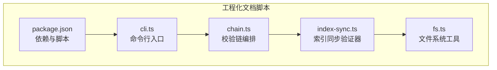
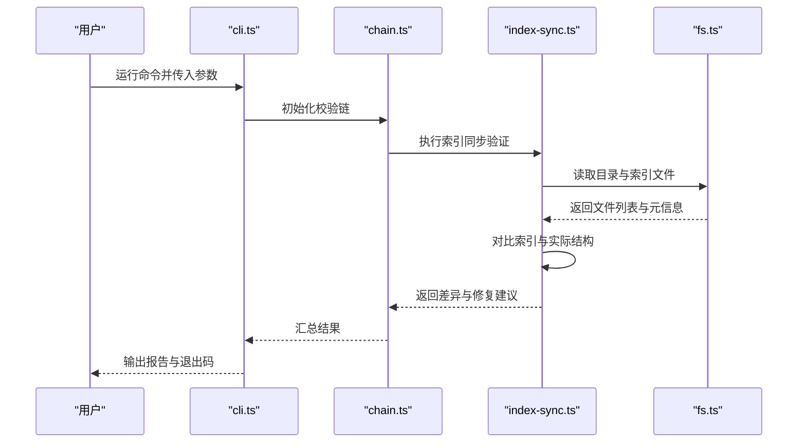
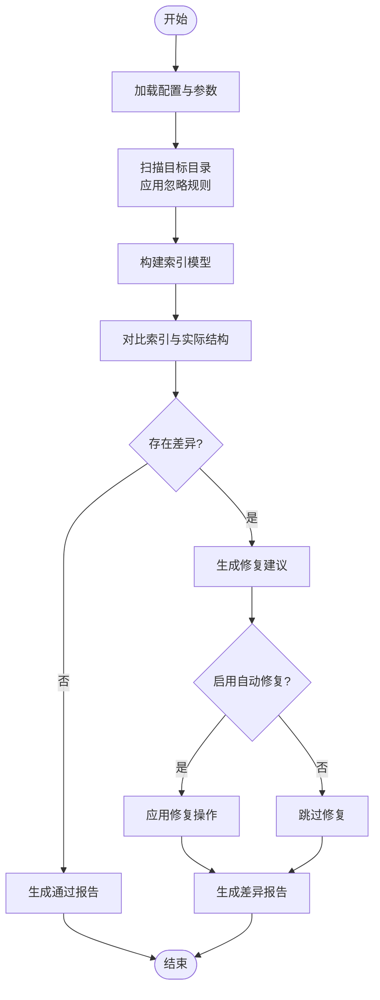
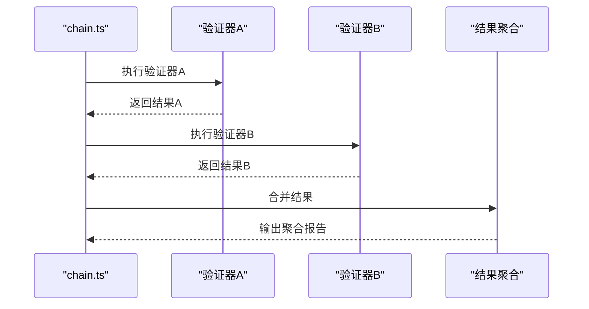
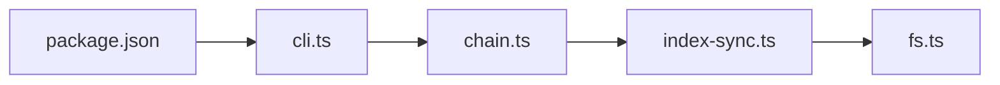

# Index同步验证器

<cite>
**本文引用的文件**   
- [index-sync.ts](file://skills/shared/engineering-docs/scripts/src/validators/index-sync.ts)
- [cli.ts](file://skills/shared/engineering-docs/scripts/src/cli.ts)
- [chain.ts](file://skills/shared/engineering-docs/scripts/src/validators/chain.ts)
- [fs.ts](file://skills/shared/engineering-docs/scripts/src/utils/fs.ts)
- [package.json](file://skills/shared/engineering-docs/scripts/package.json)
</cite>

## 目录
1. [简介](#简介)
2. [项目结构](#项目结构)
3. [核心组件](#核心组件)
4. [架构总览](#架构总览)
5. [详细组件分析](#详细组件分析)
6. [依赖关系分析](#依赖关系分析)
7. [性能考虑](#性能考虑)
8. [故障排查指南](#故障排查指南)
9. [结论](#结论)
10. [附录](#附录)

## 简介
Index同步验证器用于维护大型文档库的索引一致性，确保“索引文件与目录结构”“文件引用”“元数据字段”三者保持一致。它支持：
- 索引文件与目录结构的同步检查（缺失、冗余、未注册）
- 文件引用一致性验证（路径、命名约定、链接有效性）
- 缺失或冗余文件的检测与报告
- 可配置的验证规则与同步策略
- 冲突解决机制与修复建议输出

该工具以命令行形式提供，便于集成到CI/CD流水线中，保障文档工程的质量与可维护性。

## 项目结构
Index同步验证器位于工程化文档脚本子项目中，核心实现集中在 validators 与 utils 目录，CLI入口在 cli.ts，并通过 chain.ts 编排多个校验器。

图表来源
- [cli.ts](file://skills/shared/engineering-docs/scripts/src/cli.ts)
- [chain.ts](file://skills/shared/engineering-docs/scripts/src/validators/chain.ts)
- [index-sync.ts](file://skills/shared/engineering-docs/scripts/src/validators/index-sync.ts)
- [fs.ts](file://skills/shared/engineering-docs/scripts/src/utils/fs.ts)
- [package.json](file://skills/shared/engineering-docs/scripts/package.json)

章节来源
- [cli.ts](file://skills/shared/engineering-docs/scripts/src/cli.ts)
- [chain.ts](file://skills/shared/engineering-docs/scripts/src/validators/chain.ts)
- [index-sync.ts](file://skills/shared/engineering-docs/scripts/src/validators/index-sync.ts)
- [fs.ts](file://skills/shared/engineering-docs/scripts/src/utils/fs.ts)
- [package.json](file://skills/shared/engineering-docs/scripts/package.json)

## 核心组件
- 索引同步验证器（index-sync.ts）
  - 负责扫描目标目录，构建索引模型，对比实际文件结构与索引声明，识别差异并生成修复建议。
  - 支持配置项：根目录、忽略模式、严格模式、是否自动修复等。
- 校验链（chain.ts）
  - 将多个验证器串联执行，统一收集错误与警告，支持短路或继续执行策略。
- 文件系统工具（fs.ts）
  - 提供跨平台的路径解析、递归遍历、相对路径计算、符号链接处理等能力。
- CLI入口（cli.ts）
  - 解析命令行参数，加载配置，调用校验链执行，输出结果与退出码。

章节来源
- [index-sync.ts](file://skills/shared/engineering-docs/scripts/src/validators/index-sync.ts)
- [chain.ts](file://skills/shared/engineering-docs/scripts/src/validators/chain.ts)
- [fs.ts](file://skills/shared/engineering-docs/scripts/src/utils/fs.ts)
- [cli.ts](file://skills/shared/engineering-docs/scripts/src/cli.ts)

## 架构总览
Index同步验证器的整体流程如下：
- CLI接收参数与配置
- 初始化校验链并注入验证器
- 执行索引同步验证器，读取目录结构与索引文件
- 对比差异，生成问题清单与修复建议
- 根据策略决定是否尝试自动修复
- 汇总结果并输出报告，返回退出码

图表来源
- [cli.ts](file://skills/shared/engineering-docs/scripts/src/cli.ts)
- [chain.ts](file://skills/shared/engineering-docs/scripts/src/validators/chain.ts)
- [index-sync.ts](file://skills/shared/engineering-docs/scripts/src/validators/index-sync.ts)
- [fs.ts](file://skills/shared/engineering-docs/scripts/src/utils/fs.ts)

## 详细组件分析

### 索引同步验证器（index-sync.ts）
职责与能力
- 目录扫描与索引建模：基于目标根目录与忽略规则，构建期望的索引结构。
- 差异检测：比较索引声明与实际文件，识别缺失、冗余、未注册的文件。
- 引用一致性：校验文件内部引用路径、命名约定、链接有效性。
- 修复建议：为每个问题生成最小修复步骤，支持自动修复策略。

关键流程（算法流程图）

图表来源
- [index-sync.ts](file://skills/shared/engineering-docs/scripts/src/validators/index-sync.ts)
- [fs.ts](file://skills/shared/engineering-docs/scripts/src/utils/fs.ts)

章节来源
- [index-sync.ts](file://skills/shared/engineering-docs/scripts/src/validators/index-sync.ts)
- [fs.ts](file://skills/shared/engineering-docs/scripts/src/utils/fs.ts)

### 校验链（chain.ts）
职责与能力
- 串联多个验证器，统一收集错误与警告。
- 支持短路策略：当出现严重错误时提前终止后续验证器。
- 聚合报告：合并各验证器结果，输出结构化报告。

交互时序

图表来源
- [chain.ts](file://skills/shared/engineering-docs/scripts/src/validators/chain.ts)

章节来源
- [chain.ts](file://skills/shared/engineering-docs/scripts/src/validators/chain.ts)

### 文件系统工具（fs.ts）
职责与能力
- 递归遍历目录，过滤忽略模式。
- 规范化路径，处理相对路径与符号链接。
- 提供安全的文件读写与元信息获取。

使用要点
- 大目录扫描时建议使用忽略规则减少IO。
- 注意跨平台路径分隔符差异。

章节来源
- [fs.ts](file://skills/shared/engineering-docs/scripts/src/utils/fs.ts)

### CLI入口（cli.ts）
职责与能力
- 解析命令行参数与配置文件。
- 初始化校验链并触发执行。
- 控制输出格式与退出码。

典型用法
- 指定根目录与配置文件路径
- 选择严格模式与是否自动修复
- 输出JSON或人类可读的报告

章节来源
- [cli.ts](file://skills/shared/engineering-docs/scripts/src/cli.ts)

## 依赖关系分析
模块间依赖关系如下：
- CLI依赖校验链
- 校验链依赖索引同步验证器
- 索引同步验证器依赖文件系统工具
- package.json定义脚本与依赖，驱动CLI执行

图表来源
- [package.json](file://skills/shared/engineering-docs/scripts/package.json)
- [cli.ts](file://skills/shared/engineering-docs/scripts/src/cli.ts)
- [chain.ts](file://skills/shared/engineering-docs/scripts/src/validators/chain.ts)
- [index-sync.ts](file://skills/shared/engineering-docs/scripts/src/validators/index-sync.ts)
- [fs.ts](file://skills/shared/engineering-docs/scripts/src/utils/fs.ts)

章节来源
- [package.json](file://skills/shared/engineering-docs/scripts/package.json)
- [cli.ts](file://skills/shared/engineering-docs/scripts/src/cli.ts)
- [chain.ts](file://skills/shared/engineering-docs/scripts/src/validators/chain.ts)
- [index-sync.ts](file://skills/shared/engineering-docs/scripts/src/validators/index-sync.ts)
- [fs.ts](file://skills/shared/engineering-docs/scripts/src/utils/fs.ts)

## 性能考虑
- 目录扫描优化
  - 使用忽略规则减少不必要的遍历。
  - 对超大仓库采用增量扫描策略（仅变更文件）。
- I/O与内存
  - 避免一次性加载全部文件内容，优先读取必要元信息。
  - 流式处理大文件，降低峰值内存占用。
- 并行与并发
  - 在安全范围内并行读取目录与校验引用，提升吞吐。
- 缓存
  - 缓存已解析的索引与路径映射，避免重复计算。

[本节为通用指导，不直接分析具体文件]

## 故障排查指南
常见问题与定位方法
- 无法找到索引文件或根目录
  - 检查CLI参数与配置文件路径是否正确。
  - 确认当前工作目录与目标根目录一致。
- 大量“未注册文件”告警
  - 更新忽略规则或将文件加入索引。
  - 检查命名约定是否符合规范。
- 自动修复失败
  - 查看修复日志，确认权限与路径合法性。
  - 在非严格模式下先预览修复建议，再手动应用。
- 性能问题
  - 增加忽略规则，缩小扫描范围。
  - 启用增量扫描与缓存。

章节来源
- [cli.ts](file://skills/shared/engineering-docs/scripts/src/cli.ts)
- [index-sync.ts](file://skills/shared/engineering-docs/scripts/src/validators/index-sync.ts)
- [chain.ts](file://skills/shared/engineering-docs/scripts/src/validators/chain.ts)
- [fs.ts](file://skills/shared/engineering-docs/scripts/src/utils/fs.ts)

## 结论
Index同步验证器通过系统化的索引与目录结构比对、引用一致性校验以及修复建议输出，帮助团队在大型文档库中维持高质量的一致性。结合校验链与CLI，可以灵活地嵌入到日常开发与CI流程中，持续保障文档工程的健壮性与可维护性。

[本节为总结性内容，不直接分析具体文件]

## 附录
- 配置模板要点
  - 根目录：指定文档库根路径
  - 忽略模式：排除无关目录与临时文件
  - 严格模式：开启后对命名与引用进行更严格的校验
  - 自动修复：谨慎启用，建议先在预览模式下审查修复建议
- 使用示例
  - 基础校验：指定根目录与配置文件，输出报告
  - 严格模式：开启严格模式，强化命名与引用约束
  - 自动修复：启用自动修复并输出修复摘要
- 集成建议
  - 在CI阶段执行校验，失败则阻断合并
  - 定期生成一致性报告，纳入发布说明

[本节为概念性内容，不直接分析具体文件]