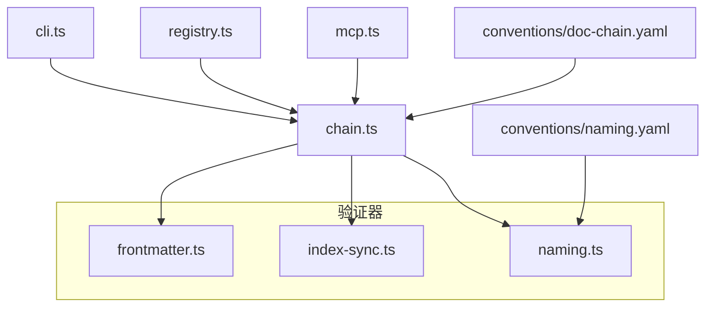
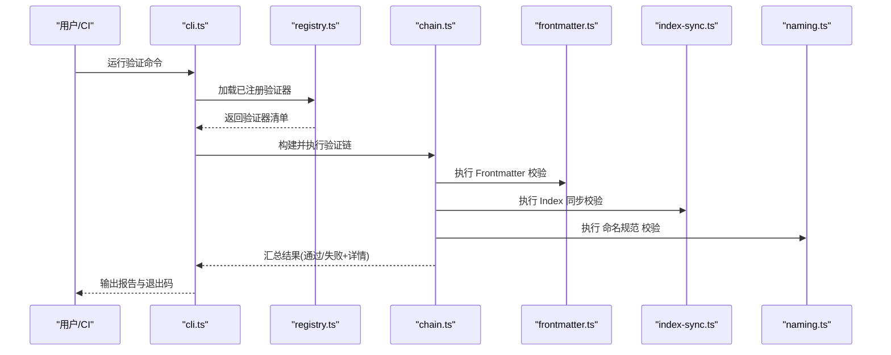
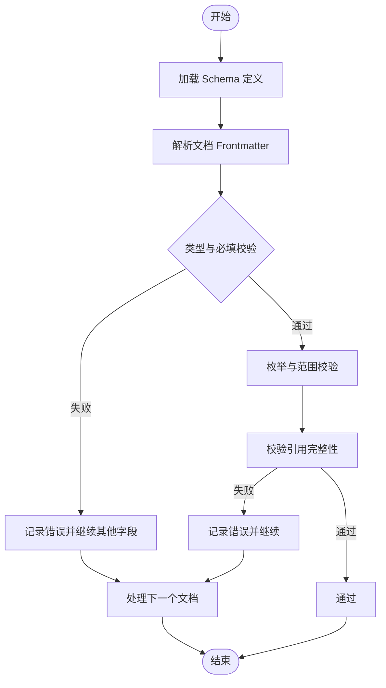
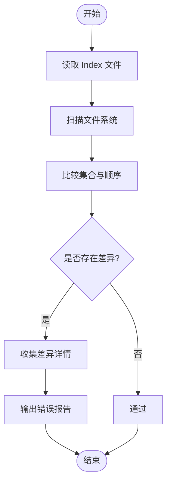
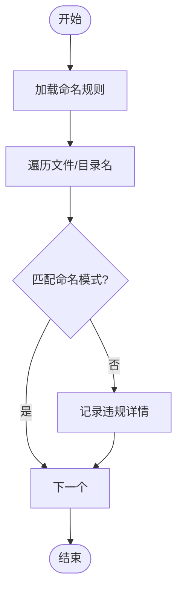
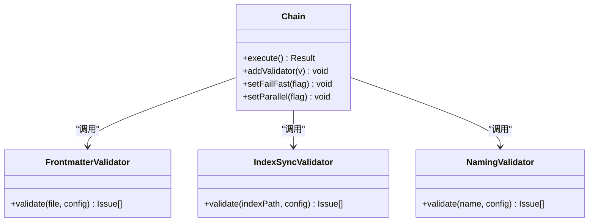
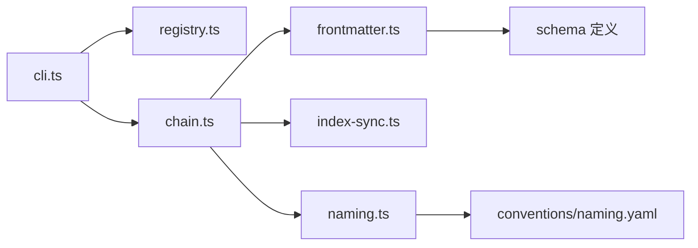

# 内置验证器

<cite>
**本文引用的文件**   
- [frontmatter.ts](file://skills/shared/engineering-docs/scripts/src/validators/frontmatter.ts)
- [index-sync.ts](file://skills/shared/engineering-docs/scripts/src/validators/index-sync.ts)
- [naming.ts](file://skills/shared/engineering-docs/scripts/src/validators/naming.ts)
- [chain.ts](file://skills/shared/engineering-docs/scripts/src/validators/chain.ts)
- [cli.ts](file://skills/shared/engineering-docs/scripts/src/cli.ts)
- [registry.ts](file://skills/shared/engineering-docs/scripts/src/registry.ts)
- [mcp.ts](file://skills/shared/engineering-docs/scripts/src/mcp.ts)
- [validators.test.ts](file://skills/shared/engineering-docs/scripts/src/__tests__/validators.test.ts)
- [doc-chain.yaml](file://skills/shared/engineering-docs/conventions/doc-chain.yaml)
- [naming.yaml](file://skills/shared/engineering-docs/conventions/naming.yaml)
</cite>

## 目录
1. [简介](#简介)
2. [项目结构](#项目结构)
3. [核心组件](#核心组件)
4. [架构总览](#架构总览)
5. [详细组件分析](#详细组件分析)
6. [依赖分析](#依赖分析)
7. [性能考虑](#性能考虑)
8. [故障排查指南](#故障排查指南)
9. [结论](#结论)
10. [附录](#附录)

## 简介
本章节面向文档工程与质量保障团队，系统化介绍仓库中内置的三大验证器：
- Frontmatter 验证器：校验文档头部元数据（字段、类型、必填项等）
- Index 同步验证器：确保索引文件与其子文档集合保持一致
- 命名规范验证器：检查文件命名是否符合约定

同时提供配置选项说明、规则定义、错误消息语义、使用示例与模板、常见问题定位与调试方法。

## 项目结构
验证器位于工程文档脚本模块中，采用“按功能分层 + 可组合链式执行”的组织方式：
- validators：具体验证器实现
- chain：验证器编排与执行
- cli：命令行入口
- registry：验证器注册表
- mcp：MCP 集成入口
- conventions：约定与模式（如命名规则、文档链约束）
- __tests__：单元测试覆盖

图表来源
- [chain.ts](file://skills/shared/engineering-docs/scripts/src/validators/chain.ts)
- [frontmatter.ts](file://skills/shared/engineering-docs/scripts/src/validators/frontmatter.ts)
- [index-sync.ts](file://skills/shared/engineering-docs/scripts/src/validators/index-sync.ts)
- [naming.ts](file://skills/shared/engineering-docs/scripts/src/validators/naming.ts)
- [cli.ts](file://skills/shared/engineering-docs/scripts/src/cli.ts)
- [registry.ts](file://skills/shared/engineering-docs/scripts/src/registry.ts)
- [mcp.ts](file://skills/shared/engineering-docs/scripts/src/mcp.ts)
- [doc-chain.yaml](file://skills/shared/engineering-docs/conventions/doc-chain.yaml)
- [naming.yaml](file://skills/shared/engineering-docs/conventions/naming.yaml)

章节来源
- [chain.ts](file://skills/shared/engineering-docs/scripts/src/validators/chain.ts)
- [cli.ts](file://skills/shared/engineering-docs/scripts/src/cli.ts)
- [registry.ts](file://skills/shared/engineering-docs/scripts/src/registry.ts)
- [mcp.ts](file://skills/shared/engineering-docs/scripts/src/mcp.ts)
- [doc-chain.yaml](file://skills/shared/engineering-docs/conventions/doc-chain.yaml)
- [naming.yaml](file://skills/shared/engineering-docs/conventions/naming.yaml)

## 核心组件
- 前端元数据验证器（Frontmatter）
  - 职责：校验文档 frontmatter 的结构、字段类型、必填项、枚举值、引用一致性等
  - 典型配置项：schema 路径、严格模式开关、忽略列表、自定义校验函数
  - 常见错误：缺失必填字段、类型不匹配、非法枚举值、引用不存在
- 索引同步验证器（Index Sync）
  - 职责：对比 index 文件声明的子文档与实际文件集合，保证一致性与顺序稳定
  - 典型配置项：根目录、递归深度、忽略模式、排序策略
  - 常见错误：文件未登记、重复条目、顺序不一致、死链接
- 命名规范验证器（Naming）
  - 职责：依据命名约定检查文件名、目录名、ID 前缀等
  - 典型配置项：命名规则文件路径、正则表达式、大小写策略、分隔符
  - 常见错误：不符合命名模式、非法字符、缺少必要前缀或后缀

章节来源
- [frontmatter.ts](file://skills/shared/engineering-docs/scripts/src/validators/frontmatter.ts)
- [index-sync.ts](file://skills/shared/engineering-docs/scripts/src/validators/index-sync.ts)
- [naming.ts](file://skills/shared/engineering-docs/scripts/src/validators/naming.ts)

## 架构总览
验证器通过“注册表 + 链式执行”的方式被 CLI 和 MCP 调用，支持多规则并行与失败聚合输出。

图表来源
- [cli.ts](file://skills/shared/engineering-docs/scripts/src/cli.ts)
- [registry.ts](file://skills/shared/engineering-docs/scripts/src/registry.ts)
- [chain.ts](file://skills/shared/engineering-docs/scripts/src/validators/chain.ts)
- [frontmatter.ts](file://skills/shared/engineering-docs/scripts/src/validators/frontmatter.ts)
- [index-sync.ts](file://skills/shared/engineering-docs/scripts/src/validators/index-sync.ts)
- [naming.ts](file://skills/shared/engineering-docs/scripts/src/validators/naming.ts)

## 详细组件分析

### Frontmatter 验证器
- 功能要点
  - 基于 schema 进行结构校验，支持必填、类型、枚举、范围、格式等
  - 支持相对/绝对引用校验，避免文档间断链
  - 支持忽略特定文件或字段，便于渐进式治理
- 关键配置项
  - schemaPath：JSON Schema 或 YAML 定义路径
  - strict：是否开启严格模式（拒绝未知字段）
  - ignorePaths：忽略的文件/目录匹配模式
  - customValidators：自定义校验函数注册点
- 典型错误消息
  - “缺少必填字段”、“字段类型不匹配”、“枚举值不在允许范围内”、“引用目标不存在”
- 使用示例与模板
  - 在 CI 中作为预提交钩子执行
  - 结合文档模板生成默认 frontmatter，减少人工遗漏
- 调试建议
  - 启用详细日志输出，定位具体字段与行号
  - 使用最小复现集快速隔离问题

图表来源
- [frontmatter.ts](file://skills/shared/engineering-docs/scripts/src/validators/frontmatter.ts)

章节来源
- [frontmatter.ts](file://skills/shared/engineering-docs/scripts/src/validators/frontmatter.ts)
- [validators.test.ts](file://skills/shared/engineering-docs/scripts/src/__tests__/validators.test.ts)

### Index 同步验证器
- 功能要点
  - 扫描指定目录，对比 index 文件中的条目与实际文件集合
  - 支持忽略模式、排序策略、去重检测
  - 对缺失、多余、重复、顺序不一致等问题给出明确提示
- 关键配置项
  - rootDir：待扫描根目录
  - recursive：是否递归扫描
  - ignorePatterns：忽略的文件/目录模式
  - sortStrategy：排序策略（字母序/创建时间等）
- 典型错误消息
  - “文件未在索引中声明”、“索引中存在但不存在对应文件”、“重复条目”、“顺序不一致”
- 使用示例与模板
  - 在发布前自动修复索引顺序
  - 与代码生成工具联动，自动生成 index 条目
- 调试建议
  - 打印差异集（diff），快速定位不一致项
  - 逐步缩小扫描范围以加速定位

图表来源
- [index-sync.ts](file://skills/shared/engineering-docs/scripts/src/validators/index-sync.ts)

章节来源
- [index-sync.ts](file://skills/shared/engineering-docs/scripts/src/validators/index-sync.ts)
- [validators.test.ts](file://skills/shared/engineering-docs/scripts/src/__tests__/validators.test.ts)

### 命名规范验证器
- 功能要点
  - 依据命名约定文件（如 naming.yaml）检查文件名、目录名、ID 前缀等
  - 支持正则表达式、大小写策略、分隔符、白名单/黑名单
- 关键配置项
  - rulesFile：命名规则文件路径
  - patterns：各实体的命名模式（正则）
  - casePolicy：大小写策略（kebab-case、PascalCase 等）
  - separators：允许的分隔符集合
- 典型错误消息
  - “不符合命名模式”、“包含非法字符”、“缺少必要前缀/后缀”、“大小写策略不符”
- 使用示例与模板
  - 在 PR 合并前强制检查
  - 配合重构脚本批量修正命名
- 调试建议
  - 打印匹配失败的原始名称与命中规则
  - 使用最小样本快速验证规则变更影响

图表来源
- [naming.ts](file://skills/shared/engineering-docs/scripts/src/validators/naming.ts)
- [naming.yaml](file://skills/shared/engineering-docs/conventions/naming.yaml)

章节来源
- [naming.ts](file://skills/shared/engineering-docs/scripts/src/validators/naming.ts)
- [naming.yaml](file://skills/shared/engineering-docs/conventions/naming.yaml)
- [validators.test.ts](file://skills/shared/engineering-docs/scripts/src/__tests__/validators.test.ts)

### 验证器编排与执行（Chain）
- 功能要点
  - 将多个验证器串联执行，支持短路或全部执行策略
  - 聚合错误信息，统一输出格式
  - 支持跳过部分验证器或仅运行指定验证器
- 关键配置项
  - pipeline：验证器执行顺序
  - failFast：遇到首个失败是否立即停止
  - parallel：是否并行执行（注意副作用）
- 典型错误消息
  - “验证器执行失败”、“某条规则未通过”、“整体状态：失败”
- 使用示例与模板
  - 在 CI 中定义固定流水线，保证质量门禁
  - 本地开发时按需启用轻量级规则
- 调试建议
  - 逐条启用验证器定位瓶颈
  - 输出中间结果辅助定位

图表来源
- [chain.ts](file://skills/shared/engineering-docs/scripts/src/validators/chain.ts)
- [frontmatter.ts](file://skills/shared/engineering-docs/scripts/src/validators/frontmatter.ts)
- [index-sync.ts](file://skills/shared/engineering-docs/scripts/src/validators/index-sync.ts)
- [naming.ts](file://skills/shared/engineering-docs/scripts/src/validators/naming.ts)

章节来源
- [chain.ts](file://skills/shared/engineering-docs/scripts/src/validators/chain.ts)

### CLI 与注册表
- CLI
  - 负责解析参数、选择验证器、设置执行上下文、输出结果
  - 支持 --verbose、--fail-fast、--only 等常用开关
- 注册表
  - 集中管理验证器实例，提供按名称查找与批量执行能力
- MCP 集成
  - 暴露验证能力给外部系统（如 IDE 插件、自动化平台）

章节来源
- [cli.ts](file://skills/shared/engineering-docs/scripts/src/cli.ts)
- [registry.ts](file://skills/shared/engineering-docs/scripts/src/registry.ts)
- [mcp.ts](file://skills/shared/engineering-docs/scripts/src/mcp.ts)

## 依赖分析
- 内部依赖
  - CLI 依赖注册表与链式执行器
  - 链式执行器依赖各验证器实现
  - 命名验证器依赖命名规则文件
  - Frontmatter 验证器依赖 schema 定义
- 外部依赖
  - 文件系统访问、YAML/JSON 解析、正则表达式引擎
- 潜在风险
  - 循环依赖：应确保验证器之间无直接相互调用
  - 大目录扫描：需合理设置忽略模式与递归深度

图表来源
- [cli.ts](file://skills/shared/engineering-docs/scripts/src/cli.ts)
- [registry.ts](file://skills/shared/engineering-docs/scripts/src/registry.ts)
- [chain.ts](file://skills/shared/engineering-docs/scripts/src/validators/chain.ts)
- [frontmatter.ts](file://skills/shared/engineering-docs/scripts/src/validators/frontmatter.ts)
- [index-sync.ts](file://skills/shared/engineering-docs/scripts/src/validators/index-sync.ts)
- [naming.ts](file://skills/shared/engineering-docs/scripts/src/validators/naming.ts)
- [naming.yaml](file://skills/shared/engineering-docs/conventions/naming.yaml)

章节来源
- [cli.ts](file://skills/shared/engineering-docs/scripts/src/cli.ts)
- [registry.ts](file://skills/shared/engineering-docs/scripts/src/registry.ts)
- [chain.ts](file://skills/shared/engineering-docs/scripts/src/validators/chain.ts)
- [naming.yaml](file://skills/shared/engineering-docs/conventions/naming.yaml)

## 性能考虑
- 控制扫描范围：为 Index 与命名验证器配置合理的 ignorePatterns，避免全仓扫描
- 限制递归深度：对大型仓库设置最大递归层级
- 并行执行：在 IO 密集场景下启用并行，但需注意共享资源竞争
- 增量验证：优先对变更文件执行验证，降低 CI 耗时
- 缓存策略：对 schema 与规则文件加载结果做内存缓存

[本节为通用指导，无需源码引用]

## 故障排查指南
- 常见问题
  - Frontmatter 校验失败：检查 schema 版本与字段类型；确认必填项齐全
  - Index 不一致：核对实际文件与 index 条目；修复重复或缺失项
  - 命名不规范：对照命名规则文件，修正大小写与分隔符
- 定位步骤
  - 启用详细日志，查看具体失败文件与行号
  - 使用只运行单个验证器的模式，缩小问题范围
  - 对复杂规则，准备最小复现用例
- 回归测试
  - 参考现有单元测试，补充边界用例
  - 在 CI 中保留历史报告以便对比

章节来源
- [validators.test.ts](file://skills/shared/engineering-docs/scripts/src/__tests__/validators.test.ts)

## 结论
内置验证器通过清晰的分层与可组合的执行模型，为文档工程提供了稳定的质量保障能力。建议在生产环境中将其纳入 CI 流程，并结合团队约定持续演进规则与模板，形成“规则即代码”的治理闭环。

[本节为总结性内容，无需源码引用]

## 附录
- 相关约定文件
  - 文档链约定：用于约束文档间的引用关系与生命周期
  - 命名约定：定义统一的命名模式与风格
- 使用模板
  - 在仓库根目录添加验证器配置文件，定义全局忽略与默认策略
  - 在文档模板中嵌入标准 frontmatter，减少人工维护成本

章节来源
- [doc-chain.yaml](file://skills/shared/engineering-docs/conventions/doc-chain.yaml)
- [naming.yaml](file://skills/shared/engineering-docs/conventions/naming.yaml)