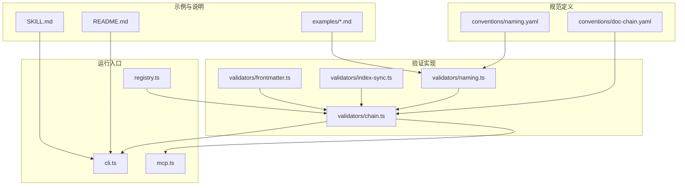
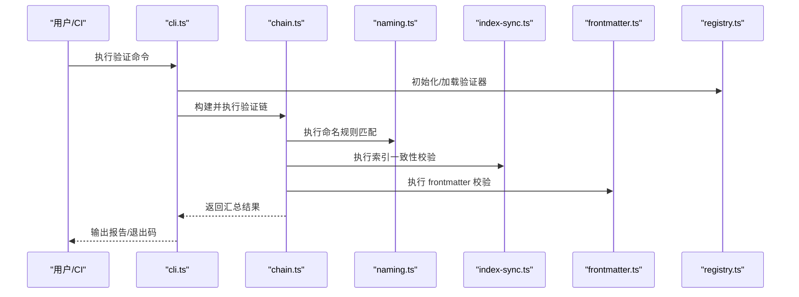
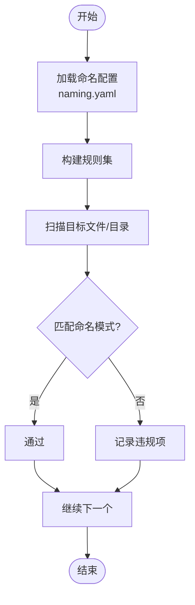
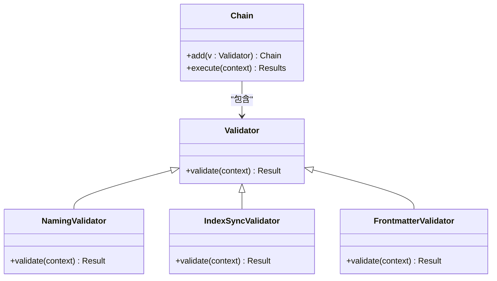
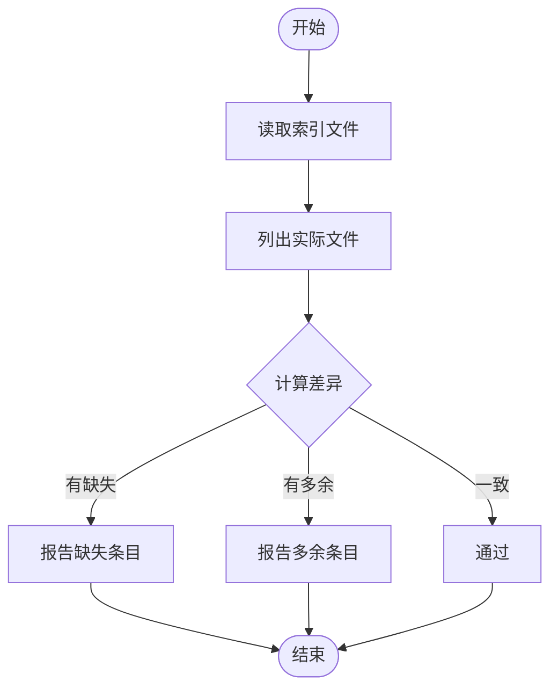
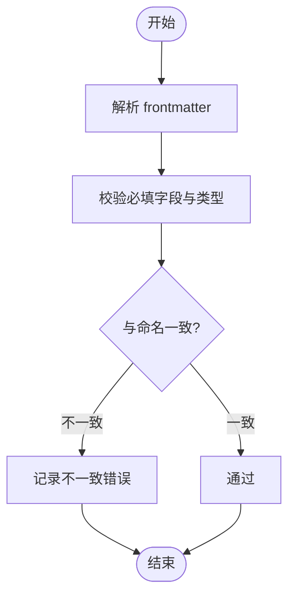
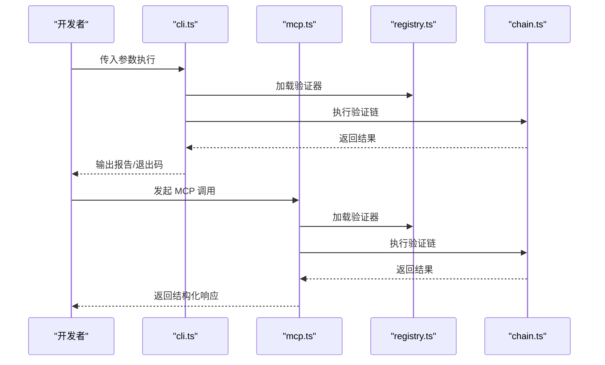
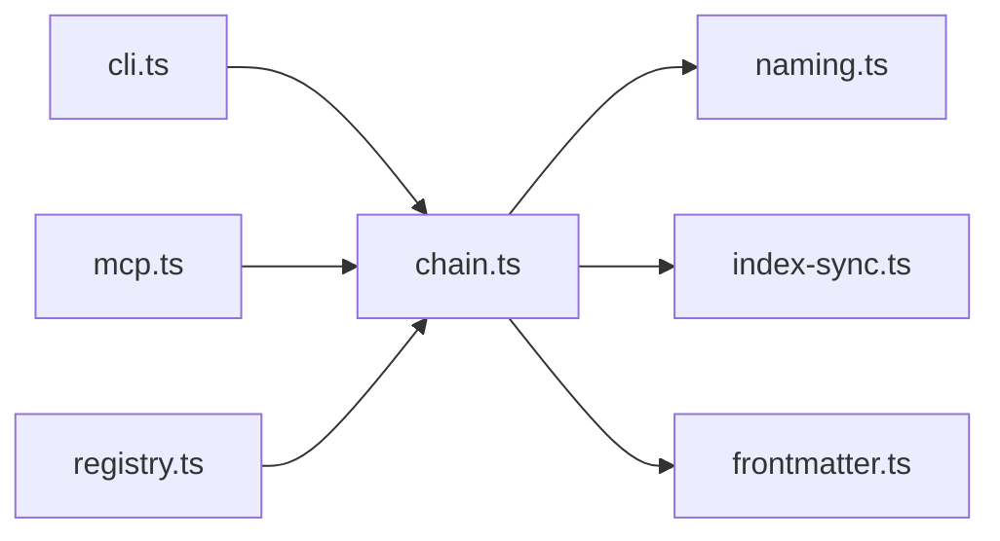

# 命名规范验证器

<cite>
**本文引用的文件**   
- [naming.yaml](file://skills/shared/engineering-docs/conventions/naming.yaml)
- [doc-chain.yaml](file://skills/shared/engineering-docs/conventions/doc-chain.yaml)
- [naming.ts](file://skills/shared/engineering-docs/scripts/src/validators/naming.ts)
- [chain.ts](file://skills/shared/engineering-docs/scripts/src/validators/chain.ts)
- [index-sync.ts](file://skills/shared/engineering-docs/scripts/src/validators/index-sync.ts)
- [frontmatter.ts](file://skills/shared/engineering-docs/scripts/src/validators/frontmatter.ts)
- [cli.ts](file://skills/shared/engineering-docs/scripts/src/cli.ts)
- [mcp.ts](file://skills/shared/engineering-docs/scripts/src/mcp.ts)
- [registry.ts](file://skills/shared/engineering-docs/scripts/src/registry.ts)
- [package.json](file://skills/shared/engineering-docs/scripts/package.json)
- [tsconfig.json](file://skills/shared/engineering-docs/scripts/tsconfig.json)
- [vitest.config.ts](file://skills/shared/engineering-docs/scripts/vitest.config.ts)
- [README.md](file://skills/shared/engineering-docs/README.md)
- [SKILL.md](file://skills/shared/engineering-docs/SKILL.md)
- [PRD-001-sample-login.md](file://skills/shared/engineering-docs/examples/PRD-001-sample-login.md)
- [PLAN-v1.0-001-sample-mvp.md](file://skills/shared/engineering-docs/examples/PLAN-v1.0-001-sample-mvp.md)
</cite>

## 目录
1. [简介](#简介)
2. [项目结构](#项目结构)
3. [核心组件](#核心组件)
4. [架构总览](#架构总览)
5. [详细组件分析](#详细组件分析)
6. [依赖关系分析](#依赖关系分析)
7. [性能与可扩展性](#性能与可扩展性)
8. [故障排查指南](#故障排查指南)
9. [结论](#结论)
10. [附录](#附录)

## 简介
本文件为“命名规范验证器”的完整技术文档，面向工程文档与制品的命名一致性保障。该验证器围绕以下目标工作：
- 文件命名约定检查：确保各类文档、模板、示例等遵循统一的命名模式（如 PRD、PLAN、SDD、TASK 等）。
- 目录结构规范验证：校验关键目录的存在性与层级关系，保证工程文档组织有序。
- 命名模式匹配规则：通过可配置的正则表达式与规则集，对文件名、路径片段进行匹配与断言。
- 自定义正则表达式配置：允许在配置中声明或扩展命名模式，支持团队差异化需求。
- 违规检测机制：提供清晰的错误信息、定位与汇总报告，便于快速修复。

此外，验证器还提供 CLI 与 MCP 集成入口，并内置链式验证编排能力，可将命名规范与其他校验（如 frontmatter、索引同步）组合执行。

## 项目结构
与命名规范验证相关的关键位置如下：
- 规范定义
  - conventions/naming.yaml：命名模式与规则定义
  - conventions/doc-chain.yaml：文档链关系与约束
- 验证实现
  - scripts/src/validators/naming.ts：命名规则解析与匹配逻辑
  - scripts/src/validators/chain.ts：验证链编排与执行
  - scripts/src/validators/index-sync.ts：索引文件一致性校验
  - scripts/src/validators/frontmatter.ts：元数据字段校验（与命名联动）
- 运行入口
  - scripts/src/cli.ts：命令行工具
  - scripts/src/mcp.ts：MCP 协议集成
  - scripts/src/registry.ts：注册表（规则/处理器注册）
- 测试与配置
  - scripts/package.json：脚本包依赖与命令
  - scripts/tsconfig.json：TypeScript 编译配置
  - scripts/vitest.config.ts：单元测试配置
- 示例与说明
  - examples/*.md：示例文档（用于演示命名约定）
  - README.md / SKILL.md：使用说明与技能描述

图表来源
- [naming.yaml:1-200](file://skills/shared/engineering-docs/conventions/naming.yaml#L1-L200)
- [doc-chain.yaml:1-200](file://skills/shared/engineering-docs/conventions/doc-chain.yaml#L1-L200)
- [naming.ts:1-200](file://skills/shared/engineering-docs/scripts/src/validators/naming.ts#L1-L200)
- [chain.ts:1-200](file://skills/shared/engineering-docs/scripts/src/validators/chain.ts#L1-L200)
- [index-sync.ts:1-200](file://skills/shared/engineering-docs/scripts/src/validators/index-sync.ts#L1-L200)
- [frontmatter.ts:1-200](file://skills/shared/engineering-docs/scripts/src/validators/frontmatter.ts#L1-L200)
- [cli.ts:1-200](file://skills/shared/engineering-docs/scripts/src/cli.ts#L1-L200)
- [mcp.ts:1-200](file://skills/shared/engineering-docs/scripts/src/mcp.ts#L1-L200)
- [registry.ts:1-200](file://skills/shared/engineering-docs/scripts/src/registry.ts#L1-L200)
- [README.md:1-200](file://skills/shared/engineering-docs/README.md#L1-L200)
- [SKILL.md:1-200](file://skills/shared/engineering-docs/SKILL.md#L1-L200)

章节来源
- [naming.yaml:1-200](file://skills/shared/engineering-docs/conventions/naming.yaml#L1-L200)
- [doc-chain.yaml:1-200](file://skills/shared/engineering-docs/conventions/doc-chain.yaml#L1-L200)
- [naming.ts:1-200](file://skills/shared/engineering-docs/scripts/src/validators/naming.ts#L1-L200)
- [chain.ts:1-200](file://skills/shared/engineering-docs/scripts/src/validators/chain.ts#L1-L200)
- [index-sync.ts:1-200](file://skills/shared/engineering-docs/scripts/src/validators/index-sync.ts#L1-L200)
- [frontmatter.ts:1-200](file://skills/shared/engineering-docs/scripts/src/validators/frontmatter.ts#L1-L200)
- [cli.ts:1-200](file://skills/shared/engineering-docs/scripts/src/cli.ts#L1-L200)
- [mcp.ts:1-200](file://skills/shared/engineering-docs/scripts/src/mcp.ts#L1-L200)
- [registry.ts:1-200](file://skills/shared/engineering-docs/scripts/src/registry.ts#L1-L200)
- [README.md:1-200](file://skills/shared/engineering-docs/README.md#L1-L200)
- [SKILL.md:1-200](file://skills/shared/engineering-docs/SKILL.md#L1-L200)

## 核心组件
- 命名规则引擎（naming.ts）
  - 负责加载与解析命名模式（来自 naming.yaml），对文件/目录名进行匹配与断言。
  - 支持按类型（如 PRD、PLAN、SDD、TASK 等）区分规则，并提供自定义正则扩展点。
- 验证链（chain.ts）
  - 将多个验证步骤串联执行，包括命名、索引同步、frontmatter 等。
  - 提供顺序控制、短路策略与结果聚合。
- 索引同步校验（index-sync.ts）
  - 校验目录索引文件与实际文件集合的一致性，避免遗漏或冗余。
- Frontmatter 校验（frontmatter.ts）
  - 校验文档头部元数据字段，与命名约定联动（例如 ID、版本、状态等）。
- 运行入口
  - CLI（cli.ts）：提供命令行参数与输出格式。
  - MCP（mcp.ts）：提供 MCP 协议调用方式，便于外部系统集成。
  - 注册表（registry.ts）：集中管理验证器与处理器的注册与发现。

章节来源
- [naming.ts:1-200](file://skills/shared/engineering-docs/scripts/src/validators/naming.ts#L1-L200)
- [chain.ts:1-200](file://skills/shared/engineering-docs/scripts/src/validators/chain.ts#L1-L200)
- [index-sync.ts:1-200](file://skills/shared/engineering-docs/scripts/src/validators/index-sync.ts#L1-L200)
- [frontmatter.ts:1-200](file://skills/shared/engineering-docs/scripts/src/validators/frontmatter.ts#L1-L200)
- [cli.ts:1-200](file://skills/shared/engineering-docs/scripts/src/cli.ts#L1-L200)
- [mcp.ts:1-200](file://skills/shared/engineering-docs/scripts/src/mcp.ts#L1-L200)
- [registry.ts:1-200](file://skills/shared/engineering-docs/scripts/src/registry.ts#L1-L200)

## 架构总览
命名规范验证器采用“配置驱动 + 链式验证”的架构：
- 配置层：naming.yaml 与 doc-chain.yaml 定义命名模式与文档链约束。
- 验证层：naming.ts 解析规则；chain.ts 编排执行；index-sync.ts 与 frontmatter.ts 作为辅助校验。
- 接入层：CLI 与 MCP 提供统一入口；registry.ts 管理验证器生命周期。

图表来源
- [cli.ts:1-200](file://skills/shared/engineering-docs/scripts/src/cli.ts#L1-L200)
- [chain.ts:1-200](file://skills/shared/engineering-docs/scripts/src/validators/chain.ts#L1-L200)
- [naming.ts:1-200](file://skills/shared/engineering-docs/scripts/src/validators/naming.ts#L1-L200)
- [index-sync.ts:1-200](file://skills/shared/engineering-docs/scripts/src/validators/index-sync.ts#L1-L200)
- [frontmatter.ts:1-200](file://skills/shared/engineering-docs/scripts/src/validators/frontmatter.ts#L1-L200)
- [registry.ts:1-200](file://skills/shared/engineering-docs/scripts/src/registry.ts#L1-L200)

## 详细组件分析

### 命名规则引擎（naming.ts）
- 功能要点
  - 从 naming.yaml 加载命名模式与规则，支持按文档类型划分。
  - 对文件/目录名进行正则匹配与断言，生成违规清单。
  - 提供扩展点以注入自定义正则表达式。
- 数据结构与复杂度
  - 规则集通常以映射形式存储，匹配过程为 O(n) 遍历规则，正则匹配开销取决于模式复杂度。
- 优化建议
  - 预编译正则表达式，减少重复编译开销。
  - 对大规模目录扫描时，使用增量扫描与缓存命中。

图表来源
- [naming.ts:1-200](file://skills/shared/engineering-docs/scripts/src/validators/naming.ts#L1-L200)
- [naming.yaml:1-200](file://skills/shared/engineering-docs/conventions/naming.yaml#L1-L200)

章节来源
- [naming.ts:1-200](file://skills/shared/engineering-docs/scripts/src/validators/naming.ts#L1-L200)
- [naming.yaml:1-200](file://skills/shared/engineering-docs/conventions/naming.yaml#L1-L200)

### 验证链（chain.ts）
- 功能要点
  - 将命名、索引同步、frontmatter 等验证步骤串联执行。
  - 支持顺序控制、短路策略与结果聚合。
- 设计模式
  - 责任链模式：每个验证器独立实现，链式组合，易于扩展与维护。
- 错误处理
  - 收集各阶段错误，最终汇总输出；可选择是否因严重错误而提前终止。

图表来源
- [chain.ts:1-200](file://skills/shared/engineering-docs/scripts/src/validators/chain.ts#L1-L200)
- [naming.ts:1-200](file://skills/shared/engineering-docs/scripts/src/validators/naming.ts#L1-L200)
- [index-sync.ts:1-200](file://skills/shared/engineering-docs/scripts/src/validators/index-sync.ts#L1-L200)
- [frontmatter.ts:1-200](file://skills/shared/engineering-docs/scripts/src/validators/frontmatter.ts#L1-L200)

章节来源
- [chain.ts:1-200](file://skills/shared/engineering-docs/scripts/src/validators/chain.ts#L1-L200)

### 索引同步校验（index-sync.ts）
- 功能要点
  - 对比目录索引文件与实际文件集合，检测缺失或多余条目。
  - 与命名规则配合，确保索引中的名称符合命名约定。
- 典型场景
  - 新增文档未更新索引；删除文档后索引仍保留条目。

图表来源
- [index-sync.ts:1-200](file://skills/shared/engineering-docs/scripts/src/validators/index-sync.ts#L1-L200)

章节来源
- [index-sync.ts:1-200](file://skills/shared/engineering-docs/scripts/src/validators/index-sync.ts#L1-L200)

### Frontmatter 校验（frontmatter.ts）
- 功能要点
  - 校验文档头部元数据字段（如 ID、版本、状态等）是否符合约定。
  - 与命名规则联动，确保 ID 与文件名一致或满足映射关系。
- 常见字段
  - id、version、status、title 等（具体以 schema 与命名约定为准）。

图表来源
- [frontmatter.ts:1-200](file://skills/shared/engineering-docs/scripts/src/validators/frontmatter.ts#L1-L200)

章节来源
- [frontmatter.ts:1-200](file://skills/shared/engineering-docs/scripts/src/validators/frontmatter.ts#L1-L200)

### 运行入口与集成（cli.ts、mcp.ts、registry.ts）
- CLI（cli.ts）
  - 提供命令行参数，指定目标目录、配置文件、输出格式等。
  - 返回退出码，便于 CI/CD 集成。
- MCP（mcp.ts）
  - 暴露 MCP 接口，供外部系统调用验证服务。
- 注册表（registry.ts）
  - 统一管理验证器与处理器的注册、发现与生命周期。

图表来源
- [cli.ts:1-200](file://skills/shared/engineering-docs/scripts/src/cli.ts#L1-L200)
- [mcp.ts:1-200](file://skills/shared/engineering-docs/scripts/src/mcp.ts#L1-L200)
- [registry.ts:1-200](file://skills/shared/engineering-docs/scripts/src/registry.ts#L1-L200)
- [chain.ts:1-200](file://skills/shared/engineering-docs/scripts/src/validators/chain.ts#L1-L200)

章节来源
- [cli.ts:1-200](file://skills/shared/engineering-docs/scripts/src/cli.ts#L1-L200)
- [mcp.ts:1-200](file://skills/shared/engineering-docs/scripts/src/mcp.ts#L1-L200)
- [registry.ts:1-200](file://skills/shared/engineering-docs/scripts/src/registry.ts#L1-L200)

## 依赖关系分析
- 内部依赖
  - chain.ts 依赖 naming.ts、index-sync.ts、frontmatter.ts。
  - cli.ts 与 mcp.ts 依赖 registry.ts 与 chain.ts。
- 外部依赖
  - TypeScript 运行时与 Node.js 文件系统 API。
  - 可选：YAML 解析库、正则表达式引擎。
- 潜在循环依赖
  - 当前模块边界清晰，未见直接循环依赖风险。

图表来源
- [chain.ts:1-200](file://skills/shared/engineering-docs/scripts/src/validators/chain.ts#L1-L200)
- [naming.ts:1-200](file://skills/shared/engineering-docs/scripts/src/validators/naming.ts#L1-L200)
- [index-sync.ts:1-200](file://skills/shared/engineering-docs/scripts/src/validators/index-sync.ts#L1-L200)
- [frontmatter.ts:1-200](file://skills/shared/engineering-docs/scripts/src/validators/frontmatter.ts#L1-L200)
- [cli.ts:1-200](file://skills/shared/engineering-docs/scripts/src/cli.ts#L1-L200)
- [mcp.ts:1-200](file://skills/shared/engineering-docs/scripts/src/mcp.ts#L1-L200)
- [registry.ts:1-200](file://skills/shared/engineering-docs/scripts/src/registry.ts#L1-L200)

章节来源
- [chain.ts:1-200](file://skills/shared/engineering-docs/scripts/src/validators/chain.ts#L1-L200)
- [naming.ts:1-200](file://skills/shared/engineering-docs/scripts/src/validators/naming.ts#L1-L200)
- [index-sync.ts:1-200](file://skills/shared/engineering-docs/scripts/src/validators/index-sync.ts#L1-L200)
- [frontmatter.ts:1-200](file://skills/shared/engineering-docs/scripts/src/validators/frontmatter.ts#L1-L200)
- [cli.ts:1-200](file://skills/shared/engineering-docs/scripts/src/cli.ts#L1-L200)
- [mcp.ts:1-200](file://skills/shared/engineering-docs/scripts/src/mcp.ts#L1-L200)
- [registry.ts:1-200](file://skills/shared/engineering-docs/scripts/src/registry.ts#L1-L200)

## 性能与可扩展性
- 性能特性
  - 正则表达式预编译可减少匹配开销。
  - 大目录扫描建议使用增量模式与缓存。
- 可扩展性
  - 通过 registry.ts 注册新的验证器，无需修改现有链。
  - naming.yaml 支持新增命名模式，无需改动代码。
- 建议
  - 在 CI 中启用并行扫描以提升吞吐。
  - 对高频规则建立白名单与例外机制，降低误报。

[本节为通用指导，不直接分析具体文件]

## 故障排查指南
- 常见问题
  - 命名不匹配：检查 naming.yaml 中的模式是否与文件名一致。
  - 索引不同步：运行 index-sync 校验并修正索引文件。
  - frontmatter 不一致：核对文档头部字段与命名约定。
- 调试方法
  - 使用 CLI 的详细日志选项，查看匹配过程与错误堆栈。
  - 针对特定文件或目录缩小范围，逐步定位问题。
  - 在本地先运行 vitest 测试用例，确认规则变更影响。

章节来源
- [cli.ts:1-200](file://skills/shared/engineering-docs/scripts/src/cli.ts#L1-L200)
- [naming.ts:1-200](file://skills/shared/engineering-docs/scripts/src/validators/naming.ts#L1-L200)
- [index-sync.ts:1-200](file://skills/shared/engineering-docs/scripts/src/validators/index-sync.ts#L1-L200)
- [frontmatter.ts:1-200](file://skills/shared/engineering-docs/scripts/src/validators/frontmatter.ts#L1-L200)
- [vitest.config.ts:1-200](file://skills/shared/engineering-docs/scripts/vitest.config.ts#L1-L200)

## 结论
命名规范验证器通过配置驱动的命名模式与链式验证，提供了稳定、可扩展的工程文档一致性保障。借助 CLI 与 MCP 集成，可在本地开发与 CI/CD 流程中无缝落地。建议团队持续维护 naming.yaml 与 doc-chain.yaml，结合示例文档与测试用例，确保规范演进的可控性与可追溯性。

[本节为总结，不直接分析具体文件]

## 附录

### 使用示例与配置模板
- 基本用法
  - 在根目录执行验证命令，默认加载 conventions 下的配置。
  - 指定目标目录与输出格式，便于集成到流水线。
- 配置模板
  - naming.yaml：定义各文档类型的命名模式与正则表达式。
  - doc-chain.yaml：定义文档链关系与约束条件。
- 示例文档
  - examples/PRD-001-sample-login.md：展示 PRD 命名与 frontmatter 约定。
  - examples/PLAN-v1.0-001-sample-mvp.md：展示 PLAN 命名与版本约定。

章节来源
- [README.md:1-200](file://skills/shared/engineering-docs/README.md#L1-L200)
- [SKILL.md:1-200](file://skills/shared/engineering-docs/SKILL.md#L1-L200)
- [PRD-001-sample-login.md:1-200](file://skills/shared/engineering-docs/examples/PRD-001-sample-login.md#L1-L200)
- [PLAN-v1.0-001-sample-mvp.md:1-200](file://skills/shared/engineering-docs/examples/PLAN-v1.0-001-sample-mvp.md#L1-L200)
- [naming.yaml:1-200](file://skills/shared/engineering-docs/conventions/naming.yaml#L1-L200)
- [doc-chain.yaml:1-200](file://skills/shared/engineering-docs/conventions/doc-chain.yaml#L1-L200)

### 安装与运行
- 包管理
  - package.json 定义了脚本命令与依赖，使用 pnpm/npm/yarn 安装依赖。
- 编译与测试
  - tsconfig.json 配置 TypeScript 编译选项。
  - vitest.config.ts 配置单元测试，便于验证规则变更。

章节来源
- [package.json:1-200](file://skills/shared/engineering-docs/scripts/package.json#L1-L200)
- [tsconfig.json:1-200](file://skills/shared/engineering-docs/scripts/tsconfig.json#L1-L200)
- [vitest.config.ts:1-200](file://skills/shared/engineering-docs/scripts/vitest.config.ts#L1-L200)