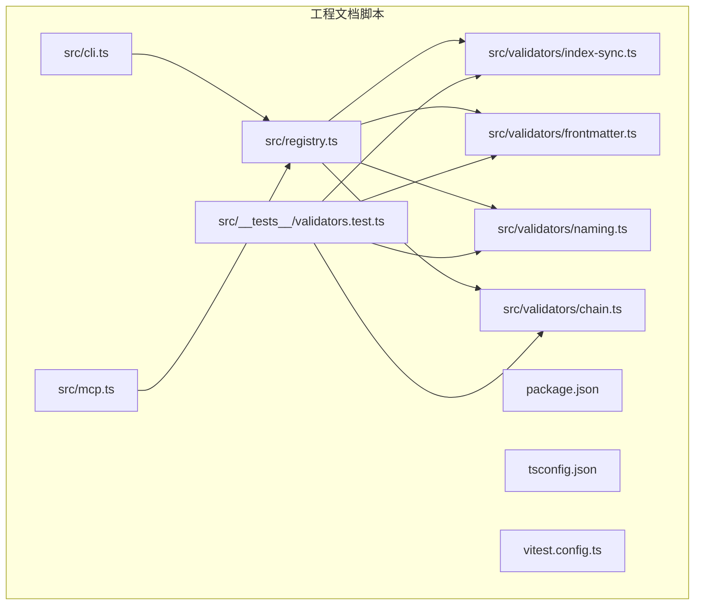
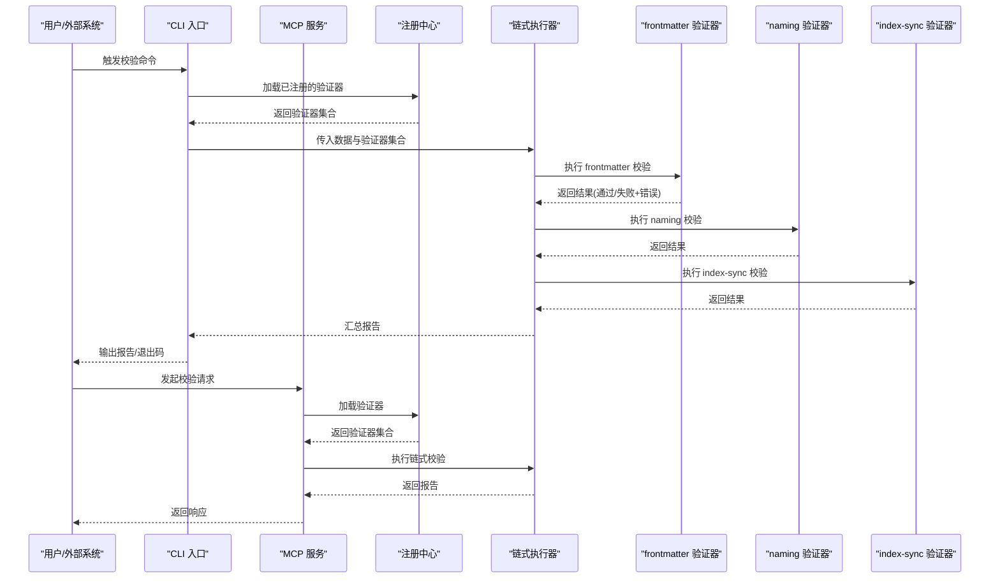
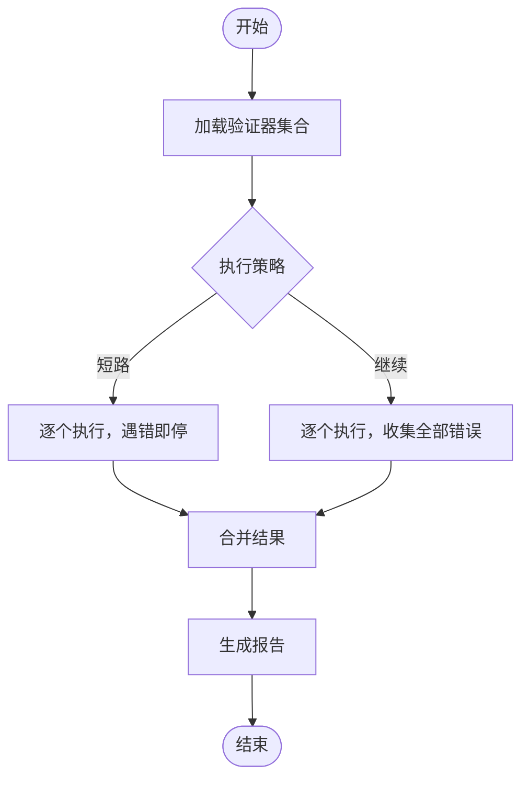
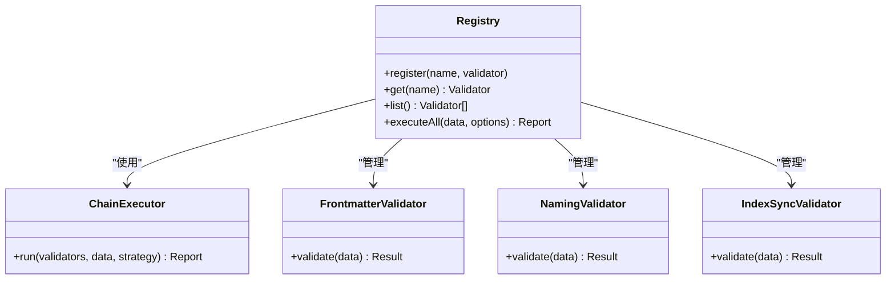
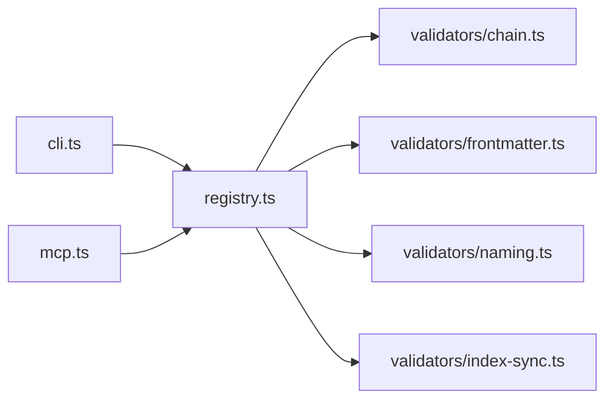

# 自定义验证器开发

<cite>
**本文引用的文件**   
- [validators/index-sync.ts](file://skills/shared/engineering-docs/scripts/src/validators/index-sync.ts)
- [validators/frontmatter.ts](file://skills/shared/engineering-docs/scripts/src/validators/frontmatter.ts)
- [validators/naming.ts](file://skills/shared/engineering-docs/scripts/src/validators/naming.ts)
- [validators/chain.ts](file://skills/shared/engineering-docs/scripts/src/validators/chain.ts)
- [registry.ts](file://skills/shared/engineering-docs/scripts/src/registry.ts)
- [cli.ts](file://skills/shared/engineering-docs/scripts/src/cli.ts)
- [mcp.ts](file://skills/shared/engineering-docs/scripts/src/mcp.ts)
- [package.json](file://skills/shared/engineering-docs/scripts/package.json)
- [tsconfig.json](file://skills/shared/engineering-docs/scripts/tsconfig.json)
- [vitest.config.ts](file://skills/shared/engineering-docs/scripts/vitest.config.ts)
- [validators.test.ts](file://skills/shared/engineering-docs/scripts/src/__tests__/validators.test.ts)
</cite>

## 目录
1. [简介](#简介)
2. [项目结构](#项目结构)
3. [核心组件](#核心组件)
4. [架构总览](#架构总览)
5. [详细组件分析](#详细组件分析)
6. [依赖关系分析](#依赖关系分析)
7. [性能考虑](#性能考虑)
8. [故障排查指南](#故障排查指南)
9. [结论](#结论)
10. [附录](#附录)

## 简介
本指南面向需要扩展或新增文档校验能力的开发者，围绕工程文档脚本中的“验证器”体系，提供从接口约定、实现模式、注册与依赖管理，到测试与调试的完整实践。内容覆盖：
- 验证器接口定义与职责边界
- 错误模型与报告生成规范
- 链式执行与组合策略
- 注册机制与依赖注入
- CLI/MCP 集成入口
- 单元测试与集成测试编写方法
- 最佳实践与常见问题排查

## 项目结构
该仓库包含一个位于 skills/shared/engineering-docs/scripts 的 TypeScript 子项目，负责工程文档的生成、校验与工具链集成。与“自定义验证器”直接相关的代码集中在 src/validators 目录，并通过 registry 进行集中注册，由 cli 和 mcp 作为外部入口调用。

图表来源
- [index-sync.ts:1-200](file://skills/shared/engineering-docs/scripts/src/validators/index-sync.ts#L1-L200)
- [frontmatter.ts:1-200](file://skills/shared/engineering-docs/scripts/src/validators/frontmatter.ts#L1-L200)
- [naming.ts:1-200](file://skills/shared/engineering-docs/scripts/src/validators/naming.ts#L1-L200)
- [chain.ts:1-200](file://skills/shared/engineering-docs/scripts/src/validators/chain.ts#L1-L200)
- [registry.ts:1-200](file://skills/shared/engineering-docs/scripts/src/registry.ts#L1-L200)
- [cli.ts:1-200](file://skills/shared/engineering-docs/scripts/src/cli.ts#L1-L200)
- [mcp.ts:1-200](file://skills/shared/engineering-docs/scripts/src/mcp.ts#L1-L200)
- [package.json:1-200](file://skills/shared/engineering-docs/scripts/package.json#L1-L200)
- [tsconfig.json:1-200](file://skills/shared/engineering-docs/scripts/tsconfig.json#L1-L200)
- [vitest.config.ts:1-200](file://skills/shared/engineering-docs/scripts/vitest.config.ts#L1-L200)
- [validators.test.ts:1-200](file://skills/shared/engineering-docs/scripts/src/__tests__/validators.test.ts#L1-L200)

章节来源
- [package.json:1-200](file://skills/shared/engineering-docs/scripts/package.json#L1-L200)
- [tsconfig.json:1-200](file://skills/shared/engineering-docs/scripts/tsconfig.json#L1-L200)
- [vitest.config.ts:1-200](file://skills/shared/engineering-docs/scripts/vitest.config.ts#L1-L200)

## 核心组件
- 验证器接口与类型
  - 输入：待校验的数据（如文档对象、元数据、命名等）
  - 输出：统一的结果对象，包含通过/失败状态与错误列表
  - 错误模型：结构化错误项，便于聚合与展示
- 内置验证器
  - frontmatter：校验文档前置元数据的结构与取值范围
  - naming：校验文件名/标识符是否符合命名规范
  - index-sync：校验索引与内容的一致性
- 链式执行器
  - 将多个验证器按顺序组合执行，支持短路或继续策略
- 注册中心
  - 集中管理验证器实例，提供按名称查找与批量执行能力
- 运行入口
  - CLI：命令行调用方式
  - MCP：模型上下文协议服务调用方式

章节来源
- [frontmatter.ts:1-200](file://skills/shared/engineering-docs/scripts/src/validators/frontmatter.ts#L1-L200)
- [naming.ts:1-200](file://skills/shared/engineering-docs/scripts/src/validators/naming.ts#L1-L200)
- [index-sync.ts:1-200](file://skills/shared/engineering-docs/scripts/src/validators/index-sync.ts#L1-L200)
- [chain.ts:1-200](file://skills/shared/engineering-docs/scripts/src/validators/chain.ts#L1-L200)
- [registry.ts:1-200](file://skills/shared/engineering-docs/scripts/src/registry.ts#L1-L200)
- [cli.ts:1-200](file://skills/shared/engineering-docs/scripts/src/cli.ts#L1-L200)
- [mcp.ts:1-200](file://skills/shared/engineering-docs/scripts/src/mcp.ts#L1-L200)

## 架构总览
下图展示了从入口到验证器的整体调用路径与数据流向。CLI/MCP 通过注册中心获取并执行一组验证器；每个验证器返回标准化结果，最终汇总为统一的报告。

图表来源
- [cli.ts:1-200](file://skills/shared/engineering-docs/scripts/src/cli.ts#L1-L200)
- [mcp.ts:1-200](file://skills/shared/engineering-docs/scripts/src/mcp.ts#L1-L200)
- [registry.ts:1-200](file://skills/shared/engineering-docs/scripts/src/registry.ts#L1-L200)
- [chain.ts:1-200](file://skills/shared/engineering-docs/scripts/src/validators/chain.ts#L1-L200)
- [frontmatter.ts:1-200](file://skills/shared/engineering-docs/scripts/src/validators/frontmatter.ts#L1-L200)
- [naming.ts:1-200](file://skills/shared/engineering-docs/scripts/src/validators/naming.ts#L1-L200)
- [index-sync.ts:1-200](file://skills/shared/engineering-docs/scripts/src/validators/index-sync.ts#L1-L200)

## 详细组件分析

### 验证器接口与错误模型
- 接口约定
  - 输入参数：以强类型对象形式传递，避免隐式转换
  - 返回值：统一的结果对象，包含是否通过、错误列表、可选的诊断信息
- 错误模型
  - 每条错误包含：位置/上下文、错误码、消息、严重级别
  - 建议对错误进行分类，便于前端渲染与过滤
- 设计要点
  - 无副作用：验证器不应修改输入数据
  - 幂等性：相同输入产生相同输出
  - 可组合：支持与其他验证器串联或并行

章节来源
- [frontmatter.ts:1-200](file://skills/shared/engineering-docs/scripts/src/validators/frontmatter.ts#L1-L200)
- [naming.ts:1-200](file://skills/shared/engineering-docs/scripts/src/validators/naming.ts#L1-L200)
- [index-sync.ts:1-200](file://skills/shared/engineering-docs/scripts/src/validators/index-sync.ts#L1-L200)

### 内置验证器详解

#### frontmatter 验证器
- 职责：校验文档前置元数据的字段存在性、类型与取值范围
- 典型规则：必填字段、枚举值、日期格式、数值区间
- 错误定位：精确到字段路径，便于快速修复

章节来源
- [frontmatter.ts:1-200](file://skills/shared/engineering-docs/scripts/src/validators/frontmatter.ts#L1-L200)

#### naming 验证器
- 职责：校验文件名/标识符是否符合命名规范
- 典型规则：大小写、分隔符、长度限制、保留字检查
- 错误定位：给出期望格式与实际值的对比

章节来源
- [naming.ts:1-200](file://skills/shared/engineering-docs/scripts/src/validators/naming.ts#L1-L200)

#### index-sync 验证器
- 职责：校验索引与内容的一致性，防止遗漏或重复条目
- 典型规则：索引条目与文件存在性、标题一致性、链接有效性
- 错误定位：指出缺失/多余条目及差异详情

章节来源
- [index-sync.ts:1-200](file://skills/shared/engineering-docs/scripts/src/validators/index-sync.ts#L1-L200)

### 链式执行器
- 功能：将多个验证器按序执行，支持短路（遇到第一个失败即停止）或继续（收集全部错误）
- 聚合：合并各验证器结果，生成统一报告
- 配置：可通过选项控制执行策略、并发度、超时等

图表来源
- [chain.ts:1-200](file://skills/shared/engineering-docs/scripts/src/validators/chain.ts#L1-L200)

章节来源
- [chain.ts:1-200](file://skills/shared/engineering-docs/scripts/src/validators/chain.ts#L1-L200)

### 注册中心与依赖管理
- 注册机制
  - 集中注册：所有验证器在启动时向注册中心登记
  - 按名查找：根据名称动态获取验证器实例
  - 版本兼容：支持多版本并存与回退策略
- 依赖注入
  - 验证器之间不直接耦合，通过注册中心或上下文共享必要资源
  - 配置项集中管理，便于环境切换与灰度发布

图表来源
- [registry.ts:1-200](file://skills/shared/engineering-docs/scripts/src/registry.ts#L1-L200)
- [chain.ts:1-200](file://skills/shared/engineering-docs/scripts/src/validators/chain.ts#L1-L200)
- [frontmatter.ts:1-200](file://skills/shared/engineering-docs/scripts/src/validators/frontmatter.ts#L1-L200)
- [naming.ts:1-200](file://skills/shared/engineering-docs/scripts/src/validators/naming.ts#L1-L200)
- [index-sync.ts:1-200](file://skills/shared/engineering-docs/scripts/src/validators/index-sync.ts#L1-L200)

章节来源
- [registry.ts:1-200](file://skills/shared/engineering-docs/scripts/src/registry.ts#L1-L200)

### 运行入口（CLI/MCP）
- CLI
  - 解析命令行参数，选择要执行的验证器集合
  - 输出人类可读的报告与退出码
- MCP
  - 暴露远程调用接口，供外部系统按需触发校验
  - 返回结构化响应，便于自动化处理

章节来源
- [cli.ts:1-200](file://skills/shared/engineering-docs/scripts/src/cli.ts#L1-L200)
- [mcp.ts:1-200](file://skills/shared/engineering-docs/scripts/src/mcp.ts#L1-L200)

## 依赖关系分析
- 内部依赖
  - 入口层（CLI/MCP）依赖注册中心
  - 注册中心依赖具体验证器与链式执行器
  - 验证器之间保持松耦合，通过统一接口交互
- 外部依赖
  - 构建与测试：TypeScript、Vitest
  - 包管理：pnpm/npm
- 潜在风险
  - 循环依赖：确保注册中心仅做装配，不引入业务逻辑
  - 性能瓶颈：大量验证器串行执行时，需评估是否引入并发或缓存

图表来源
- [cli.ts:1-200](file://skills/shared/engineering-docs/scripts/src/cli.ts#L1-L200)
- [mcp.ts:1-200](file://skills/shared/engineering-docs/scripts/src/mcp.ts#L1-L200)
- [registry.ts:1-200](file://skills/shared/engineering-docs/scripts/src/registry.ts#L1-L200)
- [chain.ts:1-200](file://skills/shared/engineering-docs/scripts/src/validators/chain.ts#L1-L200)
- [frontmatter.ts:1-200](file://skills/shared/engineering-docs/scripts/src/validators/frontmatter.ts#L1-L200)
- [naming.ts:1-200](file://skills/shared/engineering-docs/scripts/src/validators/naming.ts#L1-L200)
- [index-sync.ts:1-200](file://skills/shared/engineering-docs/scripts/src/validators/index-sync.ts#L1-L200)

章节来源
- [package.json:1-200](file://skills/shared/engineering-docs/scripts/package.json#L1-L200)
- [tsconfig.json:1-200](file://skills/shared/engineering-docs/scripts/tsconfig.json#L1-L200)

## 性能考虑
- 执行策略
  - 对独立验证器采用并行执行，缩短端到端耗时
  - 对存在顺序依赖的验证器保持串行
- 缓存与增量
  - 对计算密集型规则引入结果缓存（基于输入指纹）
  - 增量校验：仅对变更的文件/字段重新验证
- I/O 优化
  - 批量读取文件，减少磁盘访问次数
  - 流式处理大文档，降低内存峰值

[本节为通用指导，无需源码引用]

## 故障排查指南
- 常见错误
  - 未注册验证器：确认注册流程与名称一致
  - 输入数据结构不符：打印输入快照，核对字段路径
  - 规则过于严格：调整阈值或放宽约束
- 日志与诊断
  - 开启详细日志，记录关键步骤与中间结果
  - 为每条错误附加上下文（文件路径、行号、字段）
- 复现与回归
  - 使用最小化用例复现问题
  - 将问题用例加入测试套件，防止回归

章节来源
- [validators.test.ts:1-200](file://skills/shared/engineering-docs/scripts/src/__tests__/validators.test.ts#L1-L200)

## 结论
通过统一的验证器接口、注册中心与链式执行器，本项目实现了高内聚、低耦合的校验体系。遵循本文的最佳实践，可以快速扩展新的验证器并保持系统的可维护性与可扩展性。建议在团队内推广统一的错误模型与测试模板，提升协作效率与质量稳定性。

[本节为总结性内容，无需源码引用]

## 附录

### 自定义验证器开发清单
- 明确输入/输出契约与错误模型
- 实现单一职责的验证逻辑
- 编写单测覆盖正常与异常分支
- 注册验证器并提供名称与描述
- 在链式执行器中编排执行顺序
- 在 CLI/MCP 中暴露调用入口
- 添加性能基准与回归用例

### 单元测试模板（思路）
- 准备多种输入样例（合法、非法、边界）
- 断言结果的状态、错误数量与关键字段
- 模拟外部依赖（文件系统、网络）以保证隔离性
- 使用快照测试辅助比对复杂输出

章节来源
- [vitest.config.ts:1-200](file://skills/shared/engineering-docs/scripts/vitest.config.ts#L1-L200)
- [validators.test.ts:1-200](file://skills/shared/engineering-docs/scripts/src/__tests__/validators.test.ts#L1-L200)

### 集成测试模板（思路）
- 通过 CLI 或 MCP 发起端到端校验
- 断言退出码与报告摘要
- 验证持久化产物（如有）
- 在不同环境下执行（本地、CI）

章节来源
- [cli.ts:1-200](file://skills/shared/engineering-docs/scripts/src/cli.ts#L1-L200)
- [mcp.ts:1-200](file://skills/shared/engineering-docs/scripts/src/mcp.ts#L1-L200)