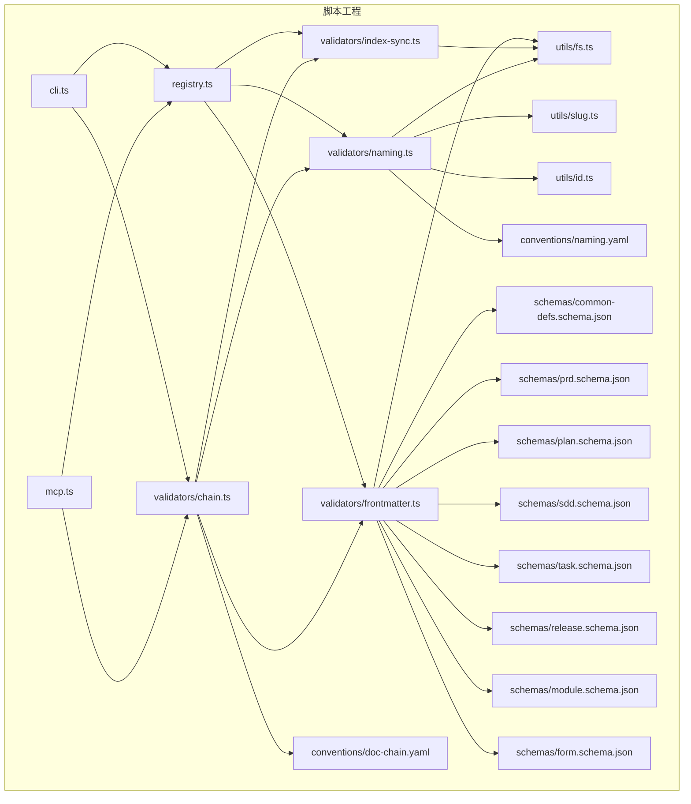
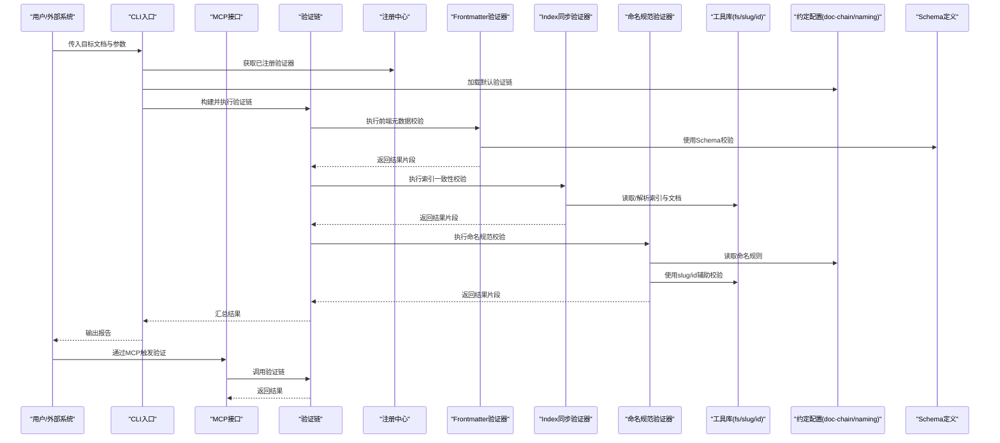
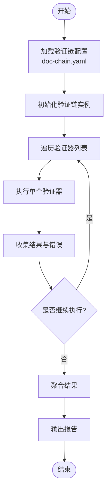
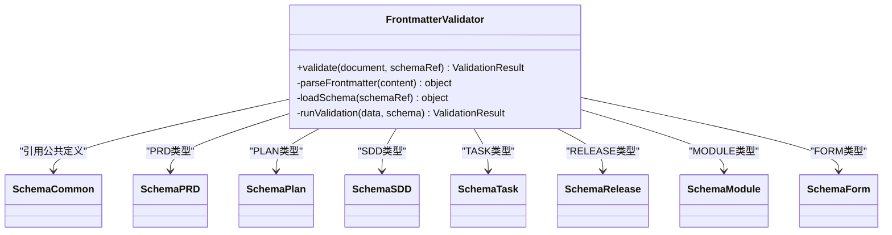
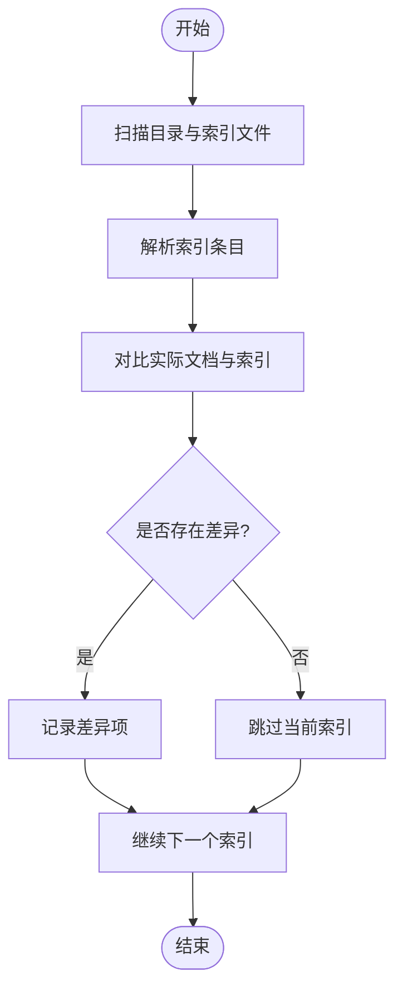
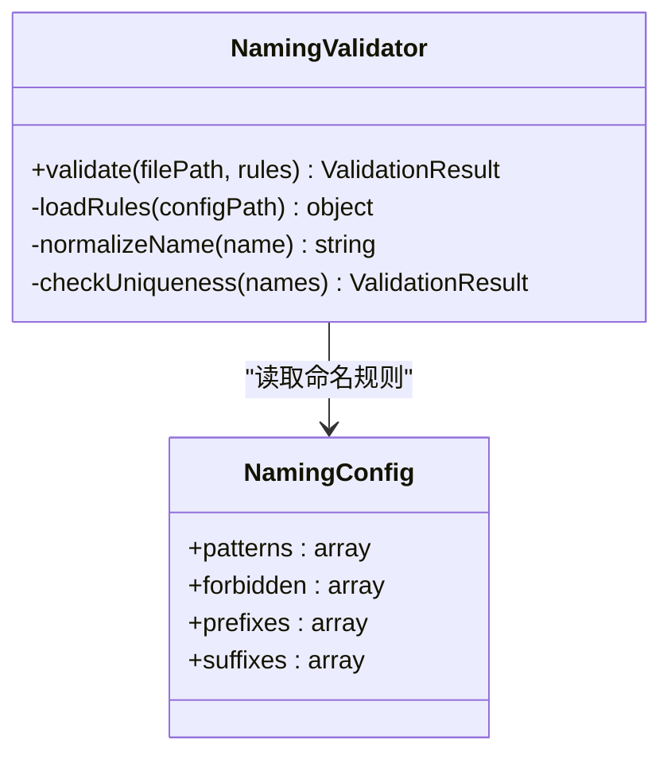
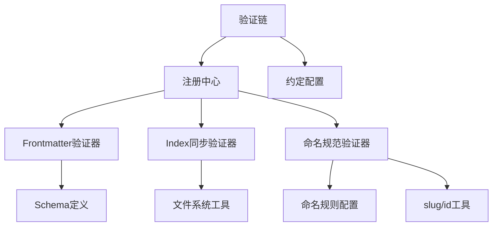

# 验证器系统

<cite>
**本文引用的文件**   
- [chain.ts](file://skills/shared/engineering-docs/scripts/src/validators/chain.ts)
- [frontmatter.ts](file://skills/shared/engineering-docs/scripts/src/validators/frontmatter.ts)
- [index-sync.ts](file://skills/shared/engineering-docs/scripts/src/validators/index-sync.ts)
- [naming.ts](file://skills/shared/engineering-docs/scripts/src/validators/naming.ts)
- [doc-chain.yaml](file://skills/shared/engineering-docs/conventions/doc-chain.yaml)
- [naming.yaml](file://skills/shared/engineering-docs/conventions/naming.yaml)
- [common-defs.schema.json](file://skills/shared/engineering-docs/schemas/common-defs.schema.json)
- [prd.schema.json](file://skills/shared/engineering-docs/schemas/prd.schema.json)
- [plan.schema.json](file://skills/shared/engineering-docs/schemas/plan.schema.json)
- [sdd.schema.json](file://skills/shared/engineering-docs/schemas/sdd.schema.json)
- [task.schema.json](file://skills/shared/engineering-docs/schemas/task.schema.json)
- [release.schema.json](file://skills/shared/engineering-docs/schemas/release.schema.json)
- [module.schema.json](file://skills/shared/engineering-docs/schemas/module.schema.json)
- [form.schema.json](file://skills/shared/engineering-docs/schemas/form.schema.json)
- [cli.ts](file://skills/shared/engineering-docs/scripts/src/cli.ts)
- [registry.ts](file://skills/shared/engineering-docs/scripts/src/registry.ts)
- [mcp.ts](file://skills/shared/engineering-docs/scripts/src/mcp.ts)
- [fs.ts](file://skills/shared/engineering-docs/scripts/src/utils/fs.ts)
- [slug.ts](file://skills/shared/engineering-docs/scripts/src/utils/slug.ts)
- [id.ts](file://skills/shared/engineering-docs/scripts/src/utils/id.ts)
- [package.json](file://skills/shared/engineering-docs/scripts/package.json)
- [tsconfig.json](file://skills/shared/engineering-docs/scripts/tsconfig.json)
- [vitest.config.ts](file://skills/shared/engineering-docs/scripts/vitest.config.ts)
- [chain.test.ts](file://skills/shared/engineering-docs/scripts/src/__tests__/chain.test.ts)
- [validators.test.ts](file://skills/shared/engineering-docs/scripts/src/__tests__/validators.test.ts)
</cite>

## 目录
1. [简介](#简介)
2. [项目结构](#项目结构)
3. [核心组件](#核心组件)
4. [架构总览](#架构总览)
5. [详细组件分析](#详细组件分析)
6. [依赖关系分析](#依赖关系分析)
7. [性能考虑](#性能考虑)
8. [故障排查指南](#故障排查指南)
9. [结论](#结论)
10. [附录](#附录)

## 简介
本文件面向文档验证框架的设计与实现，聚焦于“验证链”的执行机制、错误处理策略、内置验证器（frontmatter、index同步、命名规范）、规则编写方法、自定义验证器开发流程、配置文件Schema定义与最佳实践、验证结果报告格式与调试技巧，以及性能优化建议。该验证系统位于工程化文档工具集中，通过可组合的验证链对文档进行一致性、规范性与完整性校验，并与CLI/MCP集成，便于在本地或远程环境中执行。

## 项目结构
验证相关代码集中于 engineering-docs/scripts 子项目中，采用分层组织：
- validators：内置验证器实现（frontmatter、index-sync、naming）
- utils：通用工具（文件系统、ID生成、Slug处理）
- cli：命令行入口
- registry：验证器注册中心
- mcp：MCP协议集成
- conventions：约定配置（doc-chain、naming）
- schemas：JSON Schema定义（公共定义与各类型文档Schema）
- __tests__：单元测试

图表来源
- [cli.ts](file://skills/shared/engineering-docs/scripts/src/cli.ts)
- [registry.ts](file://skills/shared/engineering-docs/scripts/src/registry.ts)
- [mcp.ts](file://skills/shared/engineering-docs/scripts/src/mcp.ts)
- [chain.ts](file://skills/shared/engineering-docs/scripts/src/validators/chain.ts)
- [frontmatter.ts](file://skills/shared/engineering-docs/scripts/src/validators/frontmatter.ts)
- [index-sync.ts](file://skills/shared/engineering-docs/scripts/src/validators/index-sync.ts)
- [naming.ts](file://skills/shared/engineering-docs/scripts/src/validators/naming.ts)
- [fs.ts](file://skills/shared/engineering-docs/scripts/src/utils/fs.ts)
- [slug.ts](file://skills/shared/engineering-docs/scripts/src/utils/slug.ts)
- [id.ts](file://skills/shared/engineering-docs/scripts/src/utils/id.ts)
- [doc-chain.yaml](file://skills/shared/engineering-docs/conventions/doc-chain.yaml)
- [naming.yaml](file://skills/shared/engineering-docs/conventions/naming.yaml)
- [common-defs.schema.json](file://skills/shared/engineering-docs/schemas/common-defs.schema.json)
- [prd.schema.json](file://skills/shared/engineering-docs/schemas/prd.schema.json)
- [plan.schema.json](file://skills/shared/engineering-docs/schemas/plan.schema.json)
- [sdd.schema.json](file://skills/shared/engineering-docs/schemas/sdd.schema.json)
- [task.schema.json](file://skills/shared/engineering-docs/schemas/task.schema.json)
- [release.schema.json](file://skills/shared/engineering-docs/schemas/release.schema.json)
- [module.schema.json](file://skills/shared/engineering-docs/schemas/module.schema.json)
- [form.schema.json](file://skills/shared/engineering-docs/schemas/form.schema.json)

章节来源
- [package.json](file://skills/shared/engineering-docs/scripts/package.json)
- [tsconfig.json](file://skills/shared/engineering-docs/scripts/tsconfig.json)
- [vitest.config.ts](file://skills/shared/engineering-docs/scripts/vitest.config.ts)

## 核心组件
- 验证链（Chain）：负责按顺序加载并执行多个验证器，聚合结果，支持短路或继续策略，统一错误收集与报告输出。
- 验证器注册中心（Registry）：集中管理验证器的名称到实现的映射，提供动态发现与调用能力。
- 内置验证器：
  - frontmatter：基于JSON Schema对文档头部元数据进行结构与字段校验。
  - index-sync：检查文档与其所在索引的一致性（如条目存在性、链接有效性等）。
  - naming：依据命名约定校验文件名、路径与标识符是否符合规范。
- 工具库：
  - fs：文件读取、遍历、解析等基础能力。
  - slug：用于生成/规范化URL友好标识。
  - id：用于生成/校验唯一标识。
- 约定配置：
  - doc-chain.yaml：定义默认验证链的组合与顺序。
  - naming.yaml：定义命名规范规则。
- 集成层：
  - CLI：提供命令行接口，支持指定目标、链、输出格式等。
  - MCP：提供模型上下文协议接口，便于外部系统调用验证能力。

章节来源
- [chain.ts](file://skills/shared/engineering-docs/scripts/src/validators/chain.ts)
- [registry.ts](file://skills/shared/engineering-docs/scripts/src/registry.ts)
- [frontmatter.ts](file://skills/shared/engineering-docs/scripts/src/validators/frontmatter.ts)
- [index-sync.ts](file://skills/shared/engineering-docs/scripts/src/validators/index-sync.ts)
- [naming.ts](file://skills/shared/engineering-docs/scripts/src/validators/naming.ts)
- [fs.ts](file://skills/shared/engineering-docs/scripts/src/utils/fs.ts)
- [slug.ts](file://skills/shared/engineering-docs/scripts/src/utils/slug.ts)
- [id.ts](file://skills/shared/engineering-docs/scripts/src/utils/id.ts)
- [doc-chain.yaml](file://skills/shared/engineering-docs/conventions/doc-chain.yaml)
- [naming.yaml](file://skills/shared/engineering-docs/conventions/naming.yaml)
- [cli.ts](file://skills/shared/engineering-docs/scripts/src/cli.ts)
- [mcp.ts](file://skills/shared/engineering-docs/scripts/src/mcp.ts)

## 架构总览
验证系统以“验证链”为核心编排单元，将多个验证器串联执行；每个验证器独立关注单一职责，并通过注册中心统一管理。输入为文档集合与配置，输出为结构化验证结果（包含通过/失败项、错误详情、统计信息），并可由CLI或MCP消费。

图表来源
- [cli.ts](file://skills/shared/engineering-docs/scripts/src/cli.ts)
- [mcp.ts](file://skills/shared/engineering-docs/scripts/src/mcp.ts)
- [chain.ts](file://skills/shared/engineering-docs/scripts/src/validators/chain.ts)
- [registry.ts](file://skills/shared/engineering-docs/scripts/src/registry.ts)
- [frontmatter.ts](file://skills/shared/engineering-docs/scripts/src/validators/frontmatter.ts)
- [index-sync.ts](file://skills/shared/engineering-docs/scripts/src/validators/index-sync.ts)
- [naming.ts](file://skills/shared/engineering-docs/scripts/src/validators/naming.ts)
- [fs.ts](file://skills/shared/engineering-docs/scripts/src/utils/fs.ts)
- [slug.ts](file://skills/shared/engineering-docs/scripts/src/utils/slug.ts)
- [id.ts](file://skills/shared/engineering-docs/scripts/src/utils/id.ts)
- [doc-chain.yaml](file://skills/shared/engineering-docs/conventions/doc-chain.yaml)
- [naming.yaml](file://skills/shared/engineering-docs/conventions/naming.yaml)
- [common-defs.schema.json](file://skills/shared/engineering-docs/schemas/common-defs.schema.json)
- [prd.schema.json](file://skills/shared/engineering-docs/schemas/prd.schema.json)
- [plan.schema.json](file://skills/shared/engineering-docs/schemas/plan.schema.json)
- [sdd.schema.json](file://skills/shared/engineering-docs/schemas/sdd.schema.json)
- [task.schema.json](file://skills/shared/engineering-docs/schemas/task.schema.json)
- [release.schema.json](file://skills/shared/engineering-docs/schemas/release.schema.json)
- [module.schema.json](file://skills/shared/engineering-docs/schemas/module.schema.json)
- [form.schema.json](file://skills/shared/engineering-docs/schemas/form.schema.json)

## 详细组件分析

### 验证链（Chain）
- 职责：
  - 根据配置加载验证器列表与执行顺序。
  - 逐个执行验证器，收集结果并聚合。
  - 支持错误策略（如遇到严重错误时是否中断后续验证）。
  - 输出统一的验证结果对象，供CLI/MCP渲染报告。
- 关键行为：
  - 初始化阶段：解析doc-chain.yaml，合并用户覆盖配置。
  - 执行阶段：依次调用各验证器，记录耗时与异常。
  - 聚合阶段：汇总通过/失败计数、错误明细、警告信息。
- 扩展点：
  - 新增验证器后需在注册中心注册，并在链配置中启用。
  - 可通过中间件式逻辑插入日志、指标采集等横切关注点。

图表来源
- [chain.ts](file://skills/shared/engineering-docs/scripts/src/validators/chain.ts)
- [doc-chain.yaml](file://skills/shared/engineering-docs/conventions/doc-chain.yaml)

章节来源
- [chain.ts](file://skills/shared/engineering-docs/scripts/src/validators/chain.ts)
- [doc-chain.yaml](file://skills/shared/engineering-docs/conventions/doc-chain.yaml)

### Frontmatter 验证器
- 职责：
  - 解析文档头部元数据（frontmatter）。
  - 基于JSON Schema进行结构与字段校验。
  - 返回详细的错误定位与修复建议。
- 关键行为：
  - 读取文档内容，提取frontmatter块。
  - 加载对应类型的Schema（如PRD、PLAN、SDD等）。
  - 执行校验并生成错误清单。
- 依赖：
  - JSON Schema定义（公共定义与各类型Schema）。
  - 文件系统工具用于读取文档。

图表来源
- [frontmatter.ts](file://skills/shared/engineering-docs/scripts/src/validators/frontmatter.ts)
- [common-defs.schema.json](file://skills/shared/engineering-docs/schemas/common-defs.schema.json)
- [prd.schema.json](file://skills/shared/engineering-docs/schemas/prd.schema.json)
- [plan.schema.json](file://skills/shared/engineering-docs/schemas/plan.schema.json)
- [sdd.schema.json](file://skills/shared/engineering-docs/schemas/sdd.schema.json)
- [task.schema.json](file://skills/shared/engineering-docs/schemas/task.schema.json)
- [release.schema.json](file://skills/shared/engineering-docs/schemas/release.schema.json)
- [module.schema.json](file://skills/shared/engineering-docs/schemas/module.schema.json)
- [form.schema.json](file://skills/shared/engineering-docs/schemas/form.schema.json)

章节来源
- [frontmatter.ts](file://skills/shared/engineering-docs/scripts/src/validators/frontmatter.ts)
- [common-defs.schema.json](file://skills/shared/engineering-docs/schemas/common-defs.schema.json)
- [prd.schema.json](file://skills/shared/engineering-docs/schemas/prd.schema.json)
- [plan.schema.json](file://skills/shared/engineering-docs/schemas/plan.schema.json)
- [sdd.schema.json](file://skills/shared/engineering-docs/schemas/sdd.schema.json)
- [task.schema.json](file://skills/shared/engineering-docs/schemas/task.schema.json)
- [release.schema.json](file://skills/shared/engineering-docs/schemas/release.schema.json)
- [module.schema.json](file://skills/shared/engineering-docs/schemas/module.schema.json)
- [form.schema.json](file://skills/shared/engineering-docs/schemas/form.schema.json)

### Index 同步验证器
- 职责：
  - 确保文档与其所在索引保持一致（例如索引条目是否存在、链接是否有效、分类是否正确）。
- 关键行为：
  - 扫描目标目录，识别索引文件与文档集合。
  - 对比索引条目与实际文档，标记缺失、多余或不一致项。
  - 输出差异清单与修复建议。
- 依赖：
  - 文件系统工具用于遍历与解析索引。
  - 可选：slug/id工具用于规范化比较。

图表来源
- [index-sync.ts](file://skills/shared/engineering-docs/scripts/src/validators/index-sync.ts)
- [fs.ts](file://skills/shared/engineering-docs/scripts/src/utils/fs.ts)
- [slug.ts](file://skills/shared/engineering-docs/scripts/src/utils/slug.ts)
- [id.ts](file://skills/shared/engineering-docs/scripts/src/utils/id.ts)

章节来源
- [index-sync.ts](file://skills/shared/engineering-docs/scripts/src/validators/index-sync.ts)
- [fs.ts](file://skills/shared/engineering-docs/scripts/src/utils/fs.ts)
- [slug.ts](file://skills/shared/engineering-docs/scripts/src/utils/slug.ts)
- [id.ts](file://skills/shared/engineering-docs/scripts/src/utils/id.ts)

### 命名规范验证器
- 职责：
  - 依据命名约定校验文件名、路径与标识符是否符合规范。
- 关键行为：
  - 读取命名规则配置（naming.yaml）。
  - 对文件路径、前缀、后缀、分隔符等进行匹配与校验。
  - 使用slug/id工具进行规范化与唯一性检查。
- 依赖：
  - 命名约定配置。
  - 文件系统与slug/id工具。

图表来源
- [naming.ts](file://skills/shared/engineering-docs/scripts/src/validators/naming.ts)
- [naming.yaml](file://skills/shared/engineering-docs/conventions/naming.yaml)
- [slug.ts](file://skills/shared/engineering-docs/scripts/src/utils/slug.ts)
- [id.ts](file://skills/shared/engineering-docs/scripts/src/utils/id.ts)

章节来源
- [naming.ts](file://skills/shared/engineering-docs/scripts/src/validators/naming.ts)
- [naming.yaml](file://skills/shared/engineering-docs/conventions/naming.yaml)
- [slug.ts](file://skills/shared/engineering-docs/scripts/src/utils/slug.ts)
- [id.ts](file://skills/shared/engineering-docs/scripts/src/utils/id.ts)

### 验证规则编写方法与自定义验证器开发流程
- 规则编写：
  - 在命名约定或Schema中声明规则，避免硬编码。
  - 使用公共Schema定义复用字段约束，减少重复。
- 自定义验证器步骤：
  - 在validators目录下新建验证器文件，实现统一的验证接口。
  - 在注册中心注册新验证器，暴露名称与实现。
  - 在验证链配置中添加新验证器，设置执行顺序与错误策略。
  - 编写单元测试，覆盖正常与异常路径。
- 最佳实践：
  - 保持验证器无副作用，仅读取输入并返回结果。
  - 错误信息应包含位置、原因与修复建议。
  - 对I/O操作进行缓存与批处理，提升性能。

章节来源
- [registry.ts](file://skills/shared/engineering-docs/scripts/src/registry.ts)
- [chain.ts](file://skills/shared/engineering-docs/scripts/src/validators/chain.ts)
- [common-defs.schema.json](file://skills/shared/engineering-docs/schemas/common-defs.schema.json)

### 验证配置文件与Schema定义
- 验证链配置（doc-chain.yaml）：
  - 定义默认验证器组合与顺序。
  - 支持环境覆盖与条件启用。
- 命名约定（naming.yaml）：
  - 定义前缀、后缀、模式与禁用词。
  - 支持多语言与国际化适配。
- Schema定义：
  - common-defs.schema.json：公共字段与类型定义。
  - prd/plan/sdd/task/release/module/form.schema.json：具体文档类型的结构约束。
- 最佳实践：
  - 将Schema与约定配置纳入版本控制，保证一致性。
  - 使用$ref复用公共定义，降低维护成本。
  - 为复杂字段添加描述与示例，提升可读性。

章节来源
- [doc-chain.yaml](file://skills/shared/engineering-docs/conventions/doc-chain.yaml)
- [naming.yaml](file://skills/shared/engineering-docs/conventions/naming.yaml)
- [common-defs.schema.json](file://skills/shared/engineering-docs/schemas/common-defs.schema.json)
- [prd.schema.json](file://skills/shared/engineering-docs/schemas/prd.schema.json)
- [plan.schema.json](file://skills/shared/engineering-docs/schemas/plan.schema.json)
- [sdd.schema.json](file://skills/shared/engineering-docs/schemas/sdd.schema.json)
- [task.schema.json](file://skills/shared/engineering-docs/schemas/task.schema.json)
- [release.schema.json](file://skills/shared/engineering-docs/schemas/release.schema.json)
- [module.schema.json](file://skills/shared/engineering-docs/schemas/module.schema.json)
- [form.schema.json](file://skills/shared/engineering-docs/schemas/form.schema.json)

### 验证结果报告格式与调试技巧
- 报告格式：
  - 汇总统计：通过/失败数量、耗时、受影响文档数。
  - 错误明细：文件路径、错误类型、消息、建议修复。
  - 警告信息：非阻断性问题提示。
- 调试技巧：
  - 启用详细日志，查看验证链执行顺序与中间状态。
  - 针对特定验证器单独运行，快速定位问题。
  - 使用测试用例复现问题，逐步缩小范围。
  - 结合文件变更历史与索引快照，追踪不一致来源。

章节来源
- [chain.ts](file://skills/shared/engineering-docs/scripts/src/validators/chain.ts)
- [cli.ts](file://skills/shared/engineering-docs/scripts/src/cli.ts)
- [mcp.ts](file://skills/shared/engineering-docs/scripts/src/mcp.ts)

## 依赖关系分析
- 组件耦合：
  - 验证链强依赖注册中心与约定配置。
  - 各验证器弱依赖工具库，职责清晰，易于替换与扩展。
- 外部依赖：
  - JSON Schema校验库（通过Schema文件驱动）。
  - 文件系统访问（Node.js fs或封装工具）。
- 潜在循环依赖：
  - 当前设计避免循环导入，验证器之间不直接互相调用。
- 接口契约：
  - 验证器统一接口：输入文档与配置，输出验证结果。
  - 注册中心契约：名称到实现的映射与生命周期管理。

图表来源
- [chain.ts](file://skills/shared/engineering-docs/scripts/src/validators/chain.ts)
- [registry.ts](file://skills/shared/engineering-docs/scripts/src/registry.ts)
- [frontmatter.ts](file://skills/shared/engineering-docs/scripts/src/validators/frontmatter.ts)
- [index-sync.ts](file://skills/shared/engineering-docs/scripts/src/validators/index-sync.ts)
- [naming.ts](file://skills/shared/engineering-docs/scripts/src/validators/naming.ts)
- [fs.ts](file://skills/shared/engineering-docs/scripts/src/utils/fs.ts)
- [slug.ts](file://skills/shared/engineering-docs/scripts/src/utils/slug.ts)
- [id.ts](file://skills/shared/engineering-docs/scripts/src/utils/id.ts)
- [doc-chain.yaml](file://skills/shared/engineering-docs/conventions/doc-chain.yaml)
- [naming.yaml](file://skills/shared/engineering-docs/conventions/naming.yaml)
- [common-defs.schema.json](file://skills/shared/engineering-docs/schemas/common-defs.schema.json)

章节来源
- [chain.ts](file://skills/shared/engineering-docs/scripts/src/validators/chain.ts)
- [registry.ts](file://skills/shared/engineering-docs/scripts/src/registry.ts)
- [frontmatter.ts](file://skills/shared/engineering-docs/scripts/src/validators/frontmatter.ts)
- [index-sync.ts](file://skills/shared/engineering-docs/scripts/src/validators/index-sync.ts)
- [naming.ts](file://skills/shared/engineering-docs/scripts/src/validators/naming.ts)
- [fs.ts](file://skills/shared/engineering-docs/scripts/src/utils/fs.ts)
- [slug.ts](file://skills/shared/engineering-docs/scripts/src/utils/slug.ts)
- [id.ts](file://skills/shared/engineering-docs/scripts/src/utils/id.ts)
- [doc-chain.yaml](file://skills/shared/engineering-docs/conventions/doc-chain.yaml)
- [naming.yaml](file://skills/shared/engineering-docs/conventions/naming.yaml)
- [common-defs.schema.json](file://skills/shared/engineering-docs/schemas/common-defs.schema.json)

## 性能考虑
- I/O优化：
  - 批量读取与解析文件，减少系统调用次数。
  - 对索引与Schema进行内存缓存，避免重复加载。
- 计算优化：
  - 对命名匹配使用正则预编译与增量更新。
  - 对大规模文档集合采用分片并行处理。
- 资源控制：
  - 限制并发度，防止内存峰值过高。
  - 对长时间运行的任务提供超时与取消机制。
- 监控与度量：
  - 记录每步耗时与错误率，便于瓶颈定位。
  - 输出性能报告，辅助容量规划。

[本节为通用指导，无需列出具体文件来源]

## 故障排查指南
- 常见问题：
  - Schema不匹配：检查字段类型、必填项与枚举值。
  - 索引不一致：核对索引条目与实际文件路径、大小写与分隔符。
  - 命名违规：确认前缀/后缀与模式配置是否与团队约定一致。
- 定位步骤：
  - 使用CLI单独运行某个验证器，观察错误详情。
  - 开启详细日志，查看验证链执行顺序与中间状态。
  - 使用测试用例复现问题，逐步缩小范围。
- 恢复建议：
  - 修正Schema或命名规则后重新运行验证。
  - 重建索引或清理无效条目。
  - 提交修复并提交变更，确保回归测试通过。

章节来源
- [cli.ts](file://skills/shared/engineering-docs/scripts/src/cli.ts)
- [chain.ts](file://skills/shared/engineering-docs/scripts/src/validators/chain.ts)
- [validators.test.ts](file://skills/shared/engineering-docs/scripts/src/__tests__/validators.test.ts)
- [chain.test.ts](file://skills/shared/engineering-docs/scripts/src/__tests__/chain.test.ts)

## 结论
验证器系统通过可组合的验证链与清晰的职责划分，提供了强大的文档一致性、规范性与完整性校验能力。借助JSON Schema与约定配置，系统具备良好的可扩展性与可维护性。配合CLI与MCP集成，可在多种场景下高效执行验证，并提供详尽的报告与调试支持。遵循本文的最佳实践与性能建议，可进一步提升系统的稳定性与效率。

[本节为总结性内容，无需列出具体文件来源]

## 附录
- 单元测试参考：
  - chain.test.ts：验证链执行流程与错误聚合。
  - validators.test.ts：各验证器功能与边界情况。
- 构建与测试：
  - package.json：依赖与脚本命令。
  - tsconfig.json：TypeScript编译配置。
  - vitest.config.ts：测试框架配置。

章节来源
- [chain.test.ts](file://skills/shared/engineering-docs/scripts/src/__tests__/chain.test.ts)
- [validators.test.ts](file://skills/shared/engineering-docs/scripts/src/__tests__/validators.test.ts)
- [package.json](file://skills/shared/engineering-docs/scripts/package.json)
- [tsconfig.json](file://skills/shared/engineering-docs/scripts/tsconfig.json)
- [vitest.config.ts](file://skills/shared/engineering-docs/scripts/vitest.config.ts)