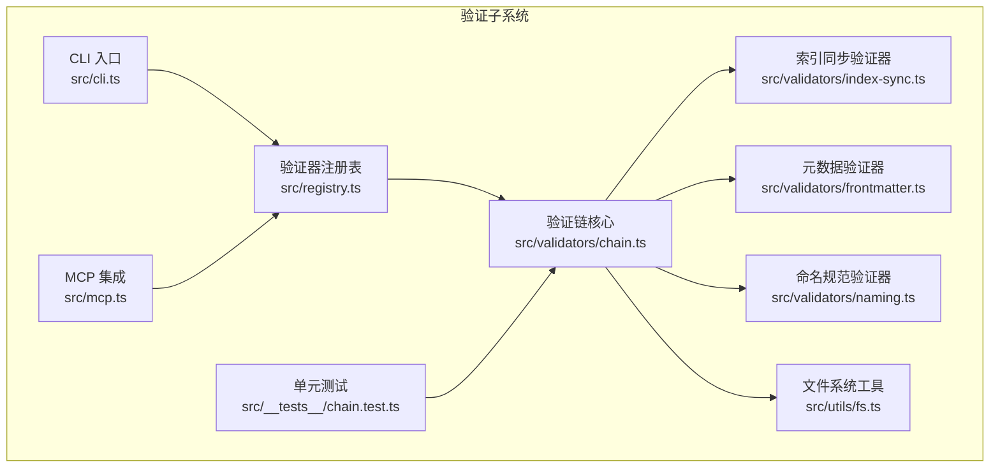
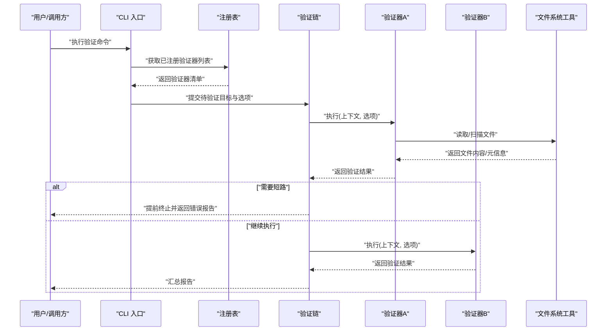
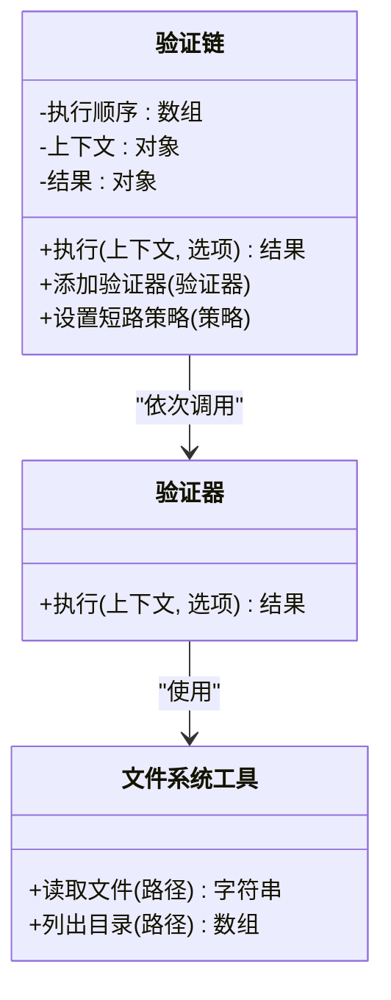
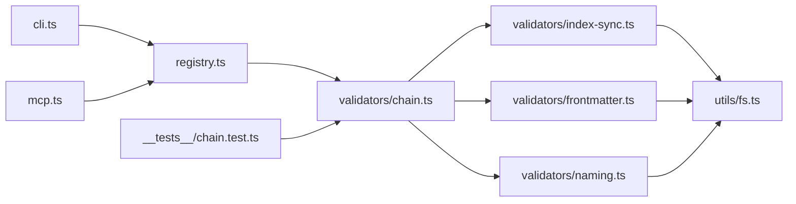
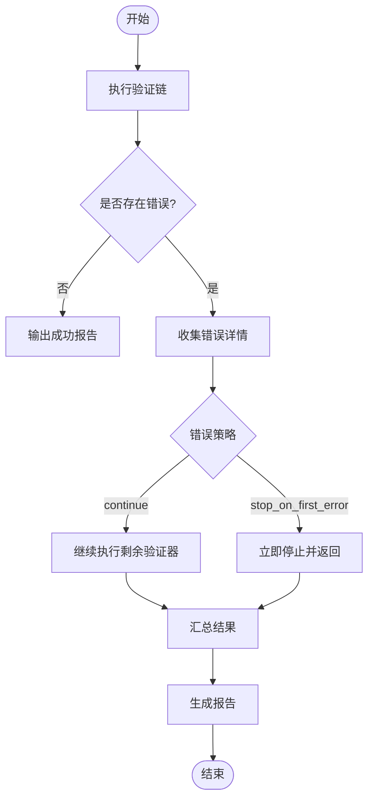

# 验证链机制

<cite>
**本文引用的文件**   
- [chain.ts](file://skills/shared/engineering-docs/scripts/src/validators/chain.ts)
- [index-sync.ts](file://skills/shared/engineering-docs/scripts/src/validators/index-sync.ts)
- [frontmatter.ts](file://skills/shared/engineering-docs/scripts/src/validators/frontmatter.ts)
- [naming.ts](file://skills/shared/engineering-docs/scripts/src/validators/naming.ts)
- [registry.ts](file://skills/shared/engineering-docs/scripts/src/registry.ts)
- [cli.ts](file://skills/shared/engineering-docs/scripts/src/cli.ts)
- [mcp.ts](file://skills/shared/engineering-docs/scripts/src/mcp.ts)
- [doc-chain.yaml](file://skills/shared/engineering-docs/scripts/src/utils/fs.ts)
- [package.json](file://skills/shared/engineering-docs/scripts/package.json)
- [tsconfig.json](file://skills/shared/engineering-docs/scripts/tsconfig.json)
- [vitest.config.ts](file://skills/shared/engineering-docs/scripts/vitest.config.ts)
- [chain.test.ts](file://skills/shared/engineering-docs/scripts/src/__tests__/chain.test.ts)
</cite>

## 目录
1. [简介](#简介)
2. [项目结构](#项目结构)
3. [核心组件](#核心组件)
4. [架构总览](#架构总览)
5. [详细组件分析](#详细组件分析)
6. [依赖关系分析](#依赖关系分析)
7. [性能考虑](#性能考虑)
8. [故障排查指南](#故障排查指南)
9. [结论](#结论)
10. [附录](#附录)

## 简介
本文件围绕“验证链”机制进行系统化说明，覆盖其执行流程、架构设计、验证器注册与加载、执行顺序管理、错误处理与中断策略、规则组合与条件执行、配置示例与最佳实践、性能优化与调试技巧，以及验证结果的数据结构与报告格式。该机制位于工程文档脚本子系统中，通过可插拔的验证器实现多阶段、可组合、可中断的文档校验流水线。

## 项目结构
验证链相关代码集中在 engineering-docs/scripts 目录下，采用分层组织：
- 验证器实现：src/validators/*
- 入口与编排：src/cli.ts、src/mcp.ts
- 注册表：src/registry.ts
- 工具与配置：src/utils/*（含 fs 等）
- 测试：src/__tests__/*
- 构建与运行：package.json、tsconfig.json、vitest.config.ts

图表来源
- [cli.ts](file://skills/shared/engineering-docs/scripts/src/cli.ts)
- [mcp.ts](file://skills/shared/engineering-docs/scripts/src/mcp.ts)
- [registry.ts](file://skills/shared/engineering-docs/scripts/src/registry.ts)
- [chain.ts](file://skills/shared/engineering-docs/scripts/src/validators/chain.ts)
- [index-sync.ts](file://skills/shared/engineering-docs/scripts/src/validators/index-sync.ts)
- [frontmatter.ts](file://skills/shared/engineering-docs/scripts/src/validators/frontmatter.ts)
- [naming.ts](file://skills/shared/engineering-docs/scripts/src/validators/naming.ts)
- [fs.ts](file://skills/shared/engineering-docs/scripts/src/utils/fs.ts)
- [chain.test.ts](file://skills/shared/engineering-docs/scripts/src/__tests__/chain.test.ts)

章节来源
- [package.json](file://skills/shared/engineering-docs/scripts/package.json)
- [tsconfig.json](file://skills/shared/engineering-docs/scripts/tsconfig.json)
- [vitest.config.ts](file://skills/shared/engineering-docs/scripts/vitest.config.ts)

## 核心组件
- 验证器接口与契约：每个验证器以统一函数签名暴露，接收上下文与选项，返回结构化结果。
- 验证链编排器：负责按序加载并执行多个验证器，支持短路、跳过、继续等控制流。
- 注册表：集中管理验证器的名称到实现的映射，提供动态发现与按需加载能力。
- 工具层：提供文件读取、路径解析、模式匹配等基础能力，供验证器复用。
- 入口层：CLI 与 MCP 将外部调用转换为验证链执行请求。

章节来源
- [chain.ts](file://skills/shared/engineering-docs/scripts/src/validators/chain.ts)
- [registry.ts](file://skills/shared/engineering-docs/scripts/src/registry.ts)
- [index-sync.ts](file://skills/shared/engineering-docs/scripts/src/validators/index-sync.ts)
- [frontmatter.ts](file://skills/shared/engineering-docs/scripts/src/validators/frontmatter.ts)
- [naming.ts](file://skills/shared/engineering-docs/scripts/src/validators/naming.ts)
- [cli.ts](file://skills/shared/engineering-docs/scripts/src/cli.ts)
- [mcp.ts](file://skills/shared/engineering-docs/scripts/src/mcp.ts)

## 架构总览
验证链的整体执行流程如下：
- 入口层（CLI/MCP）接收参数，解析目标文档或目录。
- 注册表根据配置或约定加载验证器集合。
- 验证链按顺序执行各验证器，收集结果并处理错误与中断。
- 最终输出统一的验证报告，包含通过/失败状态、错误详情与统计信息。

图表来源
- [cli.ts](file://skills/shared/engineering-docs/scripts/src/cli.ts)
- [registry.ts](file://skills/shared/engineering-docs/scripts/src/registry.ts)
- [chain.ts](file://skills/shared/engineering-docs/scripts/src/validators/chain.ts)
- [index-sync.ts](file://skills/shared/engineering-docs/scripts/src/validators/index-sync.ts)
- [frontmatter.ts](file://skills/shared/engineering-docs/scripts/src/validators/frontmatter.ts)
- [naming.ts](file://skills/shared/engineering-docs/scripts/src/validators/naming.ts)
- [fs.ts](file://skills/shared/engineering-docs/scripts/src/utils/fs.ts)

## 详细组件分析

### 验证链核心（chain.ts）
- 职责：维护验证器执行序列、上下文传递、错误聚合、短路控制与结果汇总。
- 关键行为：
  - 初始化时载入验证器清单，并按优先级排序。
  - 逐个执行验证器，捕获异常并记录为错误项。
  - 支持在特定条件下中断后续验证器（如严重错误）。
  - 生成统一的结果对象，包含通过/失败计数、错误列表与耗时统计。
- 复杂度：时间复杂度近似 O(N)，N 为验证器数量；空间复杂度取决于上下文与结果对象大小。
- 优化点：并行执行无依赖的验证器、惰性加载大验证器、缓存中间结果。

章节来源
- [chain.ts](file://skills/shared/engineering-docs/scripts/src/validators/chain.ts)

#### 类图（概念映射）

图表来源
- [chain.ts](file://skills/shared/engineering-docs/scripts/src/validators/chain.ts)
- [fs.ts](file://skills/shared/engineering-docs/scripts/src/utils/fs.ts)

### 注册表（registry.ts）
- 职责：集中管理验证器名称到实现的映射，提供注册、查询与批量加载能力。
- 关键行为：
  - 启动时自动发现并注册内置验证器。
  - 支持外部扩展注册新验证器。
  - 提供按名称或标签筛选验证器的方法。
- 耦合性：与验证器实现松耦合，仅依赖统一接口。

章节来源
- [registry.ts](file://skills/shared/engineering-docs/scripts/src/registry.ts)

### 索引同步验证器（index-sync.ts）
- 职责：确保文档索引与实际文件一致，检测缺失或冗余条目。
- 输入：目标目录、索引文件路径。
- 输出：差异列表、修复建议。
- 错误处理：对 IO 异常进行包装并上报，不影响其他验证器执行。

章节来源
- [index-sync.ts](file://skills/shared/engineering-docs/scripts/src/validators/index-sync.ts)

### 元数据验证器（frontmatter.ts）
- 职责：校验文档前置元数据的必填字段、类型与取值范围。
- 输入：文档内容与 schema 定义。
- 输出：字段级错误明细与提示。
- 条件执行：可通过选项禁用或指定只检查部分字段。

章节来源
- [frontmatter.ts](file://skills/shared/engineering-docs/scripts/src/validators/frontmatter.ts)

### 命名规范验证器（naming.ts）
- 职责：依据命名约定检查文件名、标题与标识符是否符合规范。
- 输入：文件路径、命名规则集。
- 输出：违规项列表与修正建议。
- 性能：对大量文件采用分批处理与正则预编译。

章节来源
- [naming.ts](file://skills/shared/engineering-docs/scripts/src/validators/naming.ts)

### 入口层（cli.ts、mcp.ts）
- CLI：命令行参数解析、目标选择、输出格式化（文本/JSON）。
- MCP：作为模型协议客户端，将验证请求转发至内部引擎。
- 共同点：将外部调用转换为验证链所需的上下文与选项。

章节来源
- [cli.ts](file://skills/shared/engineering-docs/scripts/src/cli.ts)
- [mcp.ts](file://skills/shared/engineering-docs/scripts/src/mcp.ts)

### 工具层（utils/fs.ts）
- 职责：封装文件读写、目录遍历、路径规范化等通用操作。
- 特点：提供错误包装与日志埋点，便于定位问题。

章节来源
- [fs.ts](file://skills/shared/engineering-docs/scripts/src/utils/fs.ts)

### 配置与规则组合（doc-chain.yaml）
- 用途：声明式配置验证链的执行顺序、启用/禁用验证器、传入选项与条件表达式。
- 典型键：
  - validators：验证器清单与顺序
  - options：全局选项与每个验证器的局部选项
  - conditions：条件表达式，用于决定某验证器是否执行
  - error_policy：错误策略（continue/stop_on_first_error）
- 注意：具体键名与语法以实际配置文件为准。

章节来源
- [doc-chain.yaml](file://skills/shared/engineering-docs/scripts/src/utils/fs.ts)

## 依赖关系分析
- 入口层依赖注册表与验证链。
- 验证链依赖注册表提供的验证器集合与工具层。
- 验证器依赖工具层进行 I/O 与数据处理。
- 测试依赖验证链与具体验证器以实现断言。

图表来源
- [cli.ts](file://skills/shared/engineering-docs/scripts/src/cli.ts)
- [mcp.ts](file://skills/shared/engineering-docs/scripts/src/mcp.ts)
- [registry.ts](file://skills/shared/engineering-docs/scripts/src/registry.ts)
- [chain.ts](file://skills/shared/engineering-docs/scripts/src/validators/chain.ts)
- [index-sync.ts](file://skills/shared/engineering-docs/scripts/src/validators/index-sync.ts)
- [frontmatter.ts](file://skills/shared/engineering-docs/scripts/src/validators/frontmatter.ts)
- [naming.ts](file://skills/shared/engineering-docs/scripts/src/validators/naming.ts)
- [fs.ts](file://skills/shared/engineering-docs/scripts/src/utils/fs.ts)
- [chain.test.ts](file://skills/shared/engineering-docs/scripts/src/__tests__/chain.test.ts)

章节来源
- [package.json](file://skills/shared/engineering-docs/scripts/package.json)
- [tsconfig.json](file://skills/shared/engineering-docs/scripts/tsconfig.json)
- [vitest.config.ts](file://skills/shared/engineering-docs/scripts/vitest.config.ts)

## 性能考虑
- 并行化：对无依赖的验证器并发执行，缩短整体耗时。
- 懒加载：仅在需要时加载大型验证器或重型资源。
- 缓存：对重复读的文件内容或解析结果进行缓存。
- 增量验证：基于变更集仅验证受影响文件。
- 批处理：对大批量文件采用分片与限流，避免内存峰值。
- 正则与模式：预编译正则、减少重复计算。

[本节为通用指导，不直接分析具体文件]

## 故障排查指南
- 常见错误类型：
  - 文件不存在或权限不足：检查路径与权限，确认工作目录。
  - 验证器未注册：确认注册表是否正确发现与加载。
  - 配置错误：核对 doc-chain.yaml 的键名与值域。
  - 条件表达式语法错误：检查条件表达式是否符合预期。
- 诊断步骤：
  - 启用详细日志，查看执行顺序与各验证器耗时。
  - 逐步禁用验证器，定位问题来源。
  - 使用最小复现用例，隔离环境差异。
- 恢复策略：
  - 设置错误策略为 continue，先收集全部错误再统一修复。
  - 对严重错误启用 stop_on_first_error，快速反馈。

章节来源
- [chain.ts](file://skills/shared/engineering-docs/scripts/src/validators/chain.ts)
- [registry.ts](file://skills/shared/engineering-docs/scripts/src/registry.ts)
- [cli.ts](file://skills/shared/engineering-docs/scripts/src/cli.ts)

## 结论
验证链机制通过注册表与编排器实现了高内聚、低耦合的可插拔验证体系。借助声明式配置与条件执行，能够灵活组合多种验证器，满足复杂场景需求。配合合理的错误处理与性能优化策略，可在保证正确性的同时提升执行效率。

[本节为总结性内容，不直接分析具体文件]

## 附录

### 配置示例与最佳实践
- 基本配置：
  - 指定验证器顺序与启用开关。
  - 设置全局选项（如严格模式、忽略列表）。
- 条件执行：
  - 基于文件路径、前缀或标签决定是否执行某验证器。
- 错误策略：
  - 默认 continue，生产环境可改为 stop_on_first_error。
- 性能优化：
  - 开启并行执行与缓存。
  - 对大规模仓库启用增量验证。
- 调试技巧：
  - 使用 verbose 模式输出详细日志。
  - 针对单个验证器单独执行，快速定位问题。

章节来源
- [doc-chain.yaml](file://skills/shared/engineering-docs/scripts/src/utils/fs.ts)
- [chain.ts](file://skills/shared/engineering-docs/scripts/src/validators/chain.ts)

### 验证结果数据结构与报告格式
- 结果对象包含：
  - 总体状态（通过/失败）
  - 各验证器结果（状态、错误列表、耗时）
  - 统计信息（文件数、错误数、警告数）
- 报告格式：
  - 文本：人类可读的错误摘要与建议。
  - JSON：机器可读的结构化数据，便于自动化处理。

章节来源
- [chain.ts](file://skills/shared/engineering-docs/scripts/src/validators/chain.ts)
- [cli.ts](file://skills/shared/engineering-docs/scripts/src/cli.ts)

### 处理验证失败的流程

图表来源
- [chain.ts](file://skills/shared/engineering-docs/scripts/src/validators/chain.ts)
- [cli.ts](file://skills/shared/engineering-docs/scripts/src/cli.ts)

### 单元测试参考
- 测试覆盖：
  - 验证链执行顺序与短路行为。
  - 错误聚合与报告生成。
  - 条件执行与选项注入。
- 运行方式：
  - 使用测试框架执行单测套件。

章节来源
- [chain.test.ts](file://skills/shared/engineering-docs/scripts/src/__tests__/chain.test.ts)
- [vitest.config.ts](file://skills/shared/engineering-docs/scripts/vitest.config.ts)