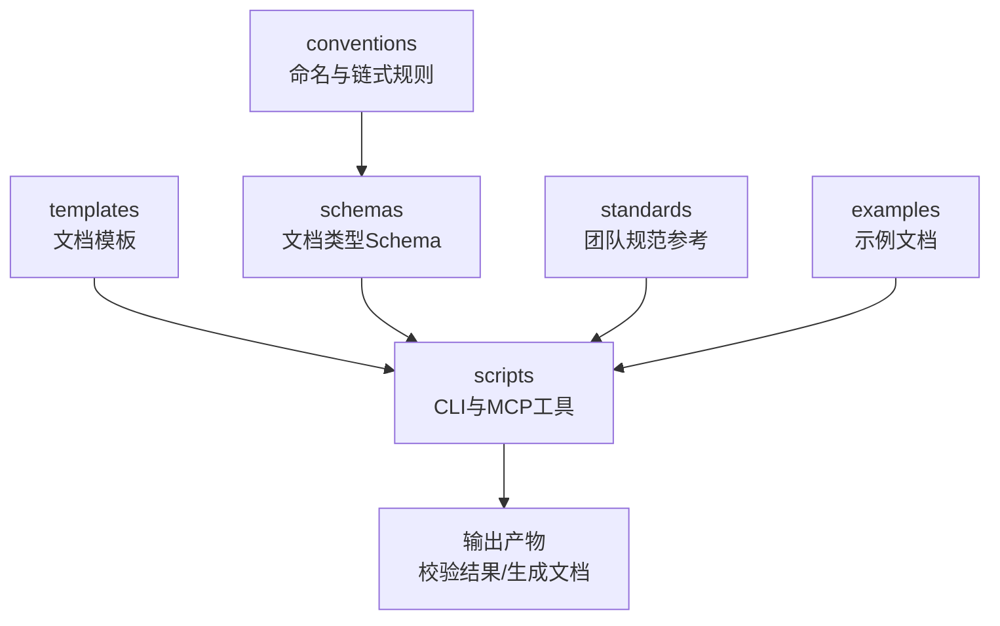
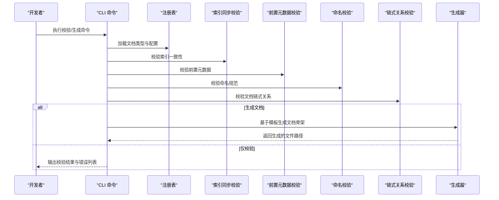
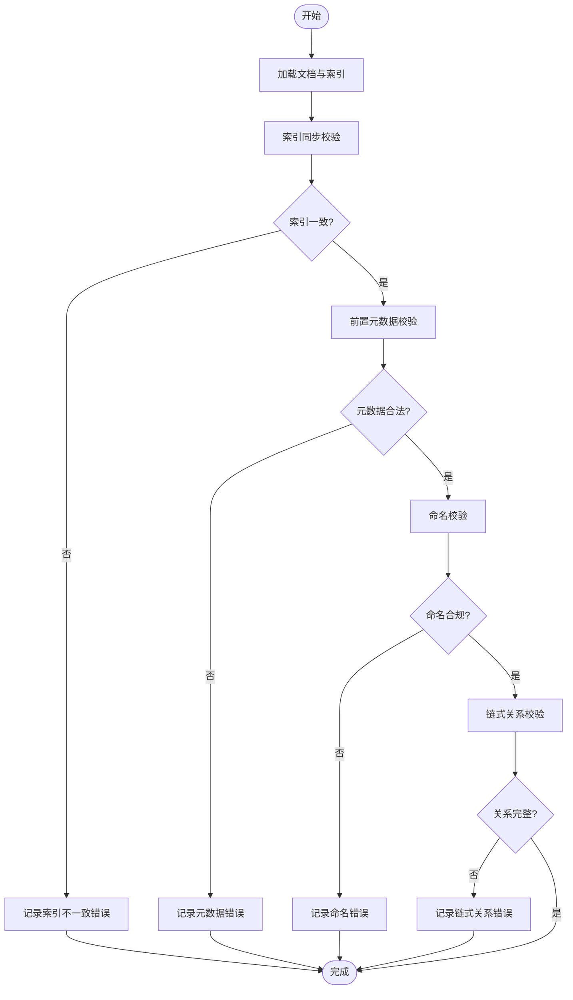
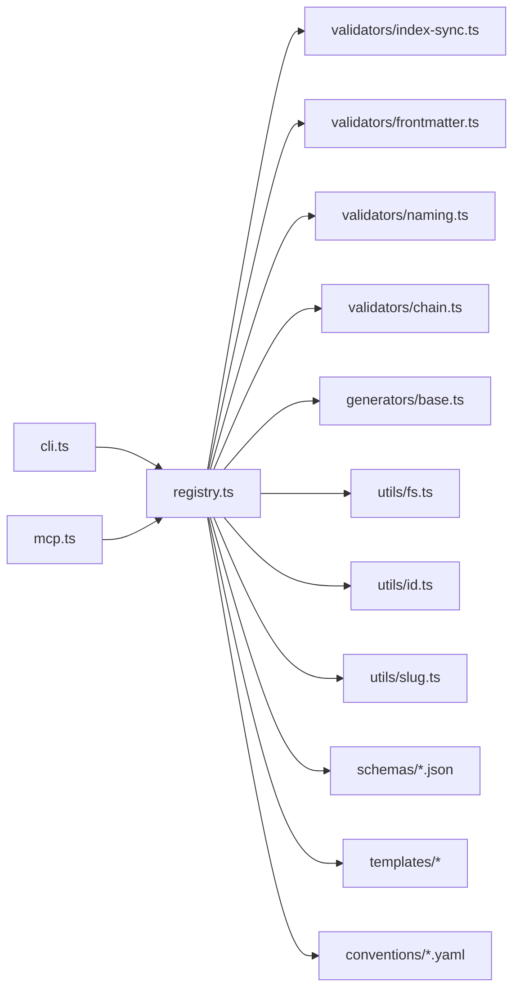

# 工程文档体系

<cite>
**本文引用的文件**   
- [SKILL.md](file://skills/shared/engineering-docs/SKILL.md)
- [doc-chain.yaml](file://skills/shared/engineering-docs/conventions/doc-chain.yaml)
- [naming.yaml](file://skills/shared/engineering-docs/conventions/naming.yaml)
- [PRD-template.md](file://skills/shared/engineering-docs/templates/PRD-template.md)
- [SDD-template.md](file://skills/shared/engineering-docs/templates/SDD-template.md)
- [PLAN-template.md](file://skills/shared/engineering-docs/templates/PLAN-template.md)
- [TASK-template.md](file://skills/shared/engineering-docs/templates/TASK-template.md)
- [RELEASE-template.md](file://skills/shared/engineering-docs/templates/RELEASE-template.md)
- [MODULE-template.md](file://skills/shared/engineering-docs/templates/MODULE-template.md)
- [FORM-template.md](file://skills/shared/engineering-docs/templates/FORM-template.md)
- [OpenAPI-template.yaml](file://skills/shared/engineering-docs/templates/OpenAPI-template.yaml)
- [prd.schema.json](file://skills/shared/engineering-docs/schemas/prd.schema.json)
- [sdd.schema.json](file://skills/shared/engineering-docs/schemas/sdd.schema.json)
- [plan.schema.json](file://skills/shared/engineering-docs/schemas/plan.schema.json)
- [task.schema.json](file://skills/shared/engineering-docs/schemas/task.schema.json)
- [release.schema.json](file://skills/shared/engineering-docs/schemas/release.schema.json)
- [module.schema.json](file://skills/shared/engineering-docs/schemas/module.schema.json)
- [form.schema.json](file://skills/shared/engineering-docs/schemas/form.schema.json)
- [common-defs.schema.json](file://skills/shared/engineering-docs/schemas/common-defs.schema.json)
- [cli.ts](file://skills/shared/engineering-docs/scripts/src/cli.ts)
- [mcp.ts](file://skills/shared/engineering-docs/scripts/src/mcp.ts)
- [registry.ts](file://skills/shared/engineering-docs/scripts/src/registry.ts)
- [validators/index-sync.ts](file://skills/shared/engineering-docs/scripts/src/validators/index-sync.ts)
- [validators/frontmatter.ts](file://skills/shared/engineering-docs/scripts/src/validators/frontmatter.ts)
- [validators/naming.ts](file://skills/shared/engineering-docs/scripts/src/validators/naming.ts)
- [validators/chain.ts](file://skills/shared/engineering-docs/scripts/src/validators/chain.ts)
- [generators/base.ts](file://skills/shared/engineering-docs/scripts/src/generators/base.ts)
- [utils/fs.ts](file://skills/shared/engineering-docs/scripts/src/utils/fs.ts)
- [utils/id.ts](file://skills/shared/engineering-docs/scripts/src/utils/id.ts)
- [utils/slug.ts](file://skills/shared/engineering-docs/scripts/src/utils/slug.ts)
- [package.json](file://skills/shared/engineering-docs/scripts/package.json)
- [tsconfig.json](file://skills/shared/engineering-docs/scripts/tsconfig.json)
- [ENGINEERING-STRUCTURE-TEAM.md](file://skills/shared/engineering-docs/standards/ENGINEERING-STRUCTURE-TEAM.md)
</cite>

## 目录
1. [引言](#引言)
2. [项目结构](#项目结构)
3. [核心组件](#核心组件)
4. [架构总览](#架构总览)
5. [详细组件分析](#详细组件分析)
6. [依赖关系分析](#依赖关系分析)
7. [性能与可扩展性](#性能与可扩展性)
8. [故障排查指南](#故障排查指南)
9. [结论](#结论)
10. [附录](#附录)

## 引言
本文件面向工程团队，系统化阐述统一的工程文档规范、标准与工具链。内容覆盖：
- 统一命名约定与文档链式管理规则
- 文档类型及Schema定义（PRD、技术方案、计划、任务、发布等）
- 模板使用与自定义扩展方法
- 验证工具工作原理与使用方式（CLI与MCP服务器接口）
- 文档生成与管理最佳实践（版本控制、协作流程、质量管理）
- 示例文档与模板说明，以及文档间关联与追溯机制

## 项目结构
该工程文档体系位于 skills/shared/engineering-docs 目录下，采用“规范+模板+Schema+脚本工具”的分层组织方式：
- conventions：命名约定与文档链式管理规则
- schemas：各文档类型的JSON Schema校验定义
- templates：各类文档的Markdown/YAML模板
- scripts：Node.js实现的验证与生成工具（含CLI与MCP服务）
- standards：团队级工程结构与规范参考
- examples：示例文档（可选）

图表来源
- [SKILL.md](file://skills/shared/engineering-docs/SKILL.md)
- [doc-chain.yaml](file://skills/shared/engineering-docs/conventions/doc-chain.yaml)
- [naming.yaml](file://skills/shared/engineering-docs/conventions/naming.yaml)
- [prd.schema.json](file://skills/shared/engineering-docs/schemas/prd.schema.json)
- [cli.ts](file://skills/shared/engineering-docs/scripts/src/cli.ts)

章节来源
- [SKILL.md](file://skills/shared/engineering-docs/SKILL.md)
- [ENGINEERING-STRUCTURE-TEAM.md](file://skills/shared/engineering-docs/standards/ENGINEERING-STRUCTURE-TEAM.md)

## 核心组件
- 规范与约定
  - 命名约定：通过命名规则约束文档文件名、元数据字段与ID格式，确保一致性与可检索性。
  - 文档链式管理：定义文档之间的上下游关系与流转顺序，支持从需求到设计、计划、任务、发布的完整链路。
- 文档类型与Schema
  - PRD、技术方案(SDD)、计划(PLAN)、任务(TASK)、发布(RELEASE)、模块(MODULE)、表单(FORM)等均有对应Schema定义，用于结构化校验与一致性保障。
- 模板
  - 提供标准化模板，包含必要的前置元数据、章节结构与占位符，便于快速创建与统一风格。
- 工具链
  - CLI：提供本地校验、生成、批量处理等命令。
  - MCP服务器：提供远程调用能力，便于集成到工作流或Agent生态。
  - 验证器：包括Frontmatter校验、命名校验、索引同步校验、链式关系校验等。
  - 生成器：基于模板与上下文生成文档骨架。
  - 注册表：集中管理文档类型、Schema与模板映射。
  - 工具库：文件系统、ID生成、Slug处理等通用能力。

章节来源
- [naming.yaml](file://skills/shared/engineering-docs/conventions/naming.yaml)
- [doc-chain.yaml](file://skills/shared/engineering-docs/conventions/doc-chain.yaml)
- [prd.schema.json](file://skills/shared/engineering-docs/schemas/prd.schema.json)
- [sdd.schema.json](file://skills/shared/engineering-docs/schemas/sdd.schema.json)
- [plan.schema.json](file://skills/shared/engineering-docs/schemas/plan.schema.json)
- [task.schema.json](file://skills/shared/engineering-docs/schemas/task.schema.json)
- [release.schema.json](file://skills/shared/engineering-docs/schemas/release.schema.json)
- [module.schema.json](file://skills/shared/engineering-docs/schemas/module.schema.json)
- [form.schema.json](file://skills/shared/engineering-docs/schemas/form.schema.json)
- [common-defs.schema.json](file://skills/shared/engineering-docs/schemas/common-defs.schema.json)
- [PRD-template.md](file://skills/shared/engineering-docs/templates/PRD-template.md)
- [SDD-template.md](file://skills/shared/engineering-docs/templates/SDD-template.md)
- [PLAN-template.md](file://skills/shared/engineering-docs/templates/PLAN-template.md)
- [TASK-template.md](file://skills/shared/engineering-docs/templates/TASK-template.md)
- [RELEASE-template.md](file://skills/shared/engineering-docs/templates/RELEASE-template.md)
- [MODULE-template.md](file://skills/shared/engineering-docs/templates/MODULE-template.md)
- [FORM-template.md](file://skills/shared/engineering-docs/templates/FORM-template.md)
- [OpenAPI-template.yaml](file://skills/shared/engineering-docs/templates/OpenAPI-template.yaml)
- [cli.ts](file://skills/shared/engineering-docs/scripts/src/cli.ts)
- [mcp.ts](file://skills/shared/engineering-docs/scripts/src/mcp.ts)
- [registry.ts](file://skills/shared/engineering-docs/scripts/src/registry.ts)
- [validators/index-sync.ts](file://skills/shared/engineering-docs/scripts/src/validators/index-sync.ts)
- [validators/frontmatter.ts](file://skills/shared/engineering-docs/scripts/src/validators/frontmatter.ts)
- [validators/naming.ts](file://skills/shared/engineering-docs/scripts/src/validators/naming.ts)
- [validators/chain.ts](file://skills/shared/engineering-docs/scripts/src/validators/chain.ts)
- [generators/base.ts](file://skills/shared/engineering-docs/scripts/src/generators/base.ts)
- [utils/fs.ts](file://skills/shared/engineering-docs/scripts/src/utils/fs.ts)
- [utils/id.ts](file://skills/shared/engineering-docs/scripts/src/utils/id.ts)
- [utils/slug.ts](file://skills/shared/engineering-docs/scripts/src/utils/slug.ts)

## 架构总览
整体架构由“规范与模板驱动 + 工具链校验与生成”构成。CLI与MCP作为入口，调用注册表获取文档类型配置，结合Schema与模板进行校验与生成；验证器负责多维度的质量检查；工具库提供底层能力支撑。

```mermaid
graph TB
subgraph "入口"
CLI["CLI 命令行"]
MCP["MCP 服务器接口"]
end
subgraph "核心"
REG["注册表 registry.ts"]
VAL_IDX["索引同步 validators/index-sync.ts"]
VAL_FM["前置元数据 validators/frontmatter.ts"]
VAL_NM["命名 validators/naming.ts"]
VAL_CH["链式关系 validators/chain.ts"]
GEN_BASE["生成器 generators/base.ts"]
UTIL_FS["工具 utils/fs.ts"]
UTIL_ID["工具 utils/id.ts"]
UTIL_SLUG["工具 utils/slug.ts"]
end
subgraph "资产"
CONV_NAM["命名约定 naming.yaml"]
CONV_CHAIN["链式规则 doc-chain.yaml"]
SCHEMA_PRD["Schema prd.schema.json"]
SCHEMA_SDD["Schema sdd.schema.json"]
SCHEMA_PLAN["Schema plan.schema.json"]
SCHEMA_TASK["Schema task.schema.json"]
SCHEMA_RELEASE["Schema release.schema.json"]
SCHEMA_MODULE["Schema module.schema.json"]
SCHEMA_FORM["Schema form.schema.json"]
TPL_PRD["模板 PRD-template.md"]
TPL_SDD["模板 SDD-template.md"]
TPL_PLAN["模板 PLAN-template.md"]
TPL_TASK["模板 TASK-template.md"]
TPL_RELEASE["模板 RELEASE-template.md"]
TPL_MODULE["模板 MODULE-template.md"]
TPL_FORM["模板 FORM-template.md"]
TPL_OPENAPI["模板 OpenAPI-template.yaml"]
end
CLI --> REG
MCP --> REG
REG --> VAL_IDX
REG --> VAL_FM
REG --> VAL_NM
REG --> VAL_CH
REG --> GEN_BASE
REG --> UTIL_FS
REG --> UTIL_ID
REG --> UTIL_SLUG
REG --> CONV_NAM
REG --> CONV_CHAIN
REG --> SCHEMA_PRD
REG --> SCHEMA_SDD
REG --> SCHEMA_PLAN
REG --> SCHEMA_TASK
REG --> SCHEMA_RELEASE
REG --> SCHEMA_MODULE
REG --> SCHEMA_FORM
REG --> TPL_PRD
REG --> TPL_SDD
REG --> TPL_PLAN
REG --> TPL_TASK
REG --> TPL_RELEASE
REG --> TPL_MODULE
REG --> TPL_FORM
REG --> TPL_OPENAPI
```

图表来源
- [cli.ts](file://skills/shared/engineering-docs/scripts/src/cli.ts)
- [mcp.ts](file://skills/shared/engineering-docs/scripts/src/mcp.ts)
- [registry.ts](file://skills/shared/engineering-docs/scripts/src/registry.ts)
- [validators/index-sync.ts](file://skills/shared/engineering-docs/scripts/src/validators/index-sync.ts)
- [validators/frontmatter.ts](file://skills/shared/engineering-docs/scripts/src/validators/frontmatter.ts)
- [validators/naming.ts](file://skills/shared/engineering-docs/scripts/src/validators/naming.ts)
- [validators/chain.ts](file://skills/shared/engineering-docs/scripts/src/validators/chain.ts)
- [generators/base.ts](file://skills/shared/engineering-docs/scripts/src/generators/base.ts)
- [utils/fs.ts](file://skills/shared/engineering-docs/scripts/src/utils/fs.ts)
- [utils/id.ts](file://skills/shared/engineering-docs/scripts/src/utils/id.ts)
- [utils/slug.ts](file://skills/shared/engineering-docs/scripts/src/utils/slug.ts)
- [naming.yaml](file://skills/shared/engineering-docs/conventions/naming.yaml)
- [doc-chain.yaml](file://skills/shared/engineering-docs/conventions/doc-chain.yaml)
- [prd.schema.json](file://skills/shared/engineering-docs/schemas/prd.schema.json)
- [sdd.schema.json](file://skills/shared/engineering-docs/schemas/sdd.schema.json)
- [plan.schema.json](file://skills/shared/engineering-docs/schemas/plan.schema.json)
- [task.schema.json](file://skills/shared/engineering-docs/schemas/task.schema.json)
- [release.schema.json](file://skills/shared/engineering-docs/schemas/release.schema.json)
- [module.schema.json](file://skills/shared/engineering-docs/schemas/module.schema.json)
- [form.schema.json](file://skills/shared/engineering-docs/schemas/form.schema.json)
- [PRD-template.md](file://skills/shared/engineering-docs/templates/PRD-template.md)
- [SDD-template.md](file://skills/shared/engineering-docs/templates/SDD-template.md)
- [PLAN-template.md](file://skills/shared/engineering-docs/templates/PLAN-template.md)
- [TASK-template.md](file://skills/shared/engineering-docs/templates/TASK-template.md)
- [RELEASE-template.md](file://skills/shared/engineering-docs/templates/RELEASE-template.md)
- [MODULE-template.md](file://skills/shared/engineering-docs/templates/MODULE-template.md)
- [FORM-template.md](file://skills/shared/engineering-docs/templates/FORM-template.md)
- [OpenAPI-template.yaml](file://skills/shared/engineering-docs/templates/OpenAPI-template.yaml)

## 详细组件分析

### 规范与约定
- 命名约定
  - 目标：统一文档文件名、ID、Slug与元数据字段命名，提升可读性与自动化处理能力。
  - 要点：前缀与后缀约定、版本号段、唯一标识符格式、大小写与分隔符策略。
- 文档链式管理
  - 目标：明确文档间的上下游关系与流转顺序，形成从需求到设计的可追溯链条。
  - 要点：上游依赖声明、下游产出物、状态推进与准入条件。

章节来源
- [naming.yaml](file://skills/shared/engineering-docs/conventions/naming.yaml)
- [doc-chain.yaml](file://skills/shared/engineering-docs/conventions/doc-chain.yaml)

### 文档类型与Schema
- 文档类型
  - PRD：产品需求文档，描述业务背景、目标、范围、用户故事、验收标准等。
  - SDD：技术方案文档，描述系统架构、模块划分、接口设计、数据模型与非功能要求。
  - PLAN：计划文档，描述里程碑、排期、资源分配与风险应对。
  - TASK：任务文档，描述具体实现任务、子任务、依赖与交付物。
  - RELEASE：发布文档，描述版本范围、变更清单、回滚策略与上线步骤。
  - MODULE：模块文档，描述模块职责、边界、接口与依赖。
  - FORM：表单文档，描述结构化数据采集项与校验规则。
- Schema定义
  - 每个文档类型均提供JSON Schema，用于校验文档结构、必填字段、枚举值与引用关系。
  - common-defs.schema.json提供公共字段复用，减少重复定义。

章节来源
- [prd.schema.json](file://skills/shared/engineering-docs/schemas/prd.schema.json)
- [sdd.schema.json](file://skills/shared/engineering-docs/schemas/sdd.schema.json)
- [plan.schema.json](file://skills/shared/engineering-docs/schemas/plan.schema.json)
- [task.schema.json](file://skills/shared/engineering-docs/schemas/task.schema.json)
- [release.schema.json](file://skills/shared/engineering-docs/schemas/release.schema.json)
- [module.schema.json](file://skills/shared/engineering-docs/schemas/module.schema.json)
- [form.schema.json](file://skills/shared/engineering-docs/schemas/form.schema.json)
- [common-defs.schema.json](file://skills/shared/engineering-docs/schemas/common-defs.schema.json)

### 模板与示例
- 模板
  - 提供PRD、SDD、PLAN、TASK、RELEASE、MODULE、FORM与OpenAPI等模板，包含必要的前置元数据与章节结构。
  - 模板中预留占位符与提示，指导作者填写关键信息。
- 示例
  - 示例文档展示标准结构与写法，帮助新成员快速上手。

章节来源
- [PRD-template.md](file://skills/shared/engineering-docs/templates/PRD-template.md)
- [SDD-template.md](file://skills/shared/engineering-docs/templates/SDD-template.md)
- [PLAN-template.md](file://skills/shared/engineering-docs/templates/PLAN-template.md)
- [TASK-template.md](file://skills/shared/engineering-docs/templates/TASK-template.md)
- [RELEASE-template.md](file://skills/shared/engineering-docs/templates/RELEASE-template.md)
- [MODULE-template.md](file://skills/shared/engineering-docs/templates/MODULE-template.md)
- [FORM-template.md](file://skills/shared/engineering-docs/templates/FORM-template.md)
- [OpenAPI-template.yaml](file://skills/shared/engineering-docs/templates/OpenAPI-template.yaml)

### 工具链：CLI与MCP
- CLI
  - 提供本地命令，支持文档校验、生成、批量处理等操作。
  - 典型用法：指定文档路径或目录，执行命名校验、前置元数据校验、索引同步校验与链式关系校验。
- MCP服务器
  - 提供远程接口，供外部系统或Agent调用，实现跨进程或跨机器的文档管理与校验。
  - 适合集成到CI/CD流水线或团队协作平台。

图表来源
- [cli.ts](file://skills/shared/engineering-docs/scripts/src/cli.ts)
- [registry.ts](file://skills/shared/engineering-docs/scripts/src/registry.ts)
- [validators/index-sync.ts](file://skills/shared/engineering-docs/scripts/src/validators/index-sync.ts)
- [validators/frontmatter.ts](file://skills/shared/engineering-docs/scripts/src/validators/frontmatter.ts)
- [validators/naming.ts](file://skills/shared/engineering-docs/scripts/src/validators/naming.ts)
- [validators/chain.ts](file://skills/shared/engineering-docs/scripts/src/validators/chain.ts)
- [generators/base.ts](file://skills/shared/engineering-docs/scripts/src/generators/base.ts)

章节来源
- [cli.ts](file://skills/shared/engineering-docs/scripts/src/cli.ts)
- [mcp.ts](file://skills/shared/engineering-docs/scripts/src/mcp.ts)
- [registry.ts](file://skills/shared/engineering-docs/scripts/src/registry.ts)

### 验证器详解
- 索引同步校验
  - 目的：确保文档索引与实际文件一致，避免遗漏或冗余。
  - 行为：扫描目录、比对索引条目、报告差异。
- 前置元数据校验
  - 目的：校验文档头部元数据的完整性与合法性。
  - 行为：根据Schema校验必填字段、类型与取值范围。
- 命名校验
  - 目的：确保文件名与ID符合命名约定。
  - 行为：匹配正则表达式、检查前缀/后缀、校验Slug格式。
- 链式关系校验
  - 目的：保证文档上下游关系正确且闭环。
  - 行为：解析依赖图、检测环路与孤立节点、报告缺失依赖。

图表来源
- [validators/index-sync.ts](file://skills/shared/engineering-docs/scripts/src/validators/index-sync.ts)
- [validators/frontmatter.ts](file://skills/shared/engineering-docs/scripts/src/validators/frontmatter.ts)
- [validators/naming.ts](file://skills/shared/engineering-docs/scripts/src/validators/naming.ts)
- [validators/chain.ts](file://skills/shared/engineering-docs/scripts/src/validators/chain.ts)

章节来源
- [validators/index-sync.ts](file://skills/shared/engineering-docs/scripts/src/validators/index-sync.ts)
- [validators/frontmatter.ts](file://skills/shared/engineering-docs/scripts/src/validators/frontmatter.ts)
- [validators/naming.ts](file://skills/shared/engineering-docs/scripts/src/validators/naming.ts)
- [validators/chain.ts](file://skills/shared/engineering-docs/scripts/src/validators/chain.ts)

### 生成器与工具库
- 生成器
  - 基于模板与上下文生成文档骨架，自动填充ID、Slug与基础元数据。
  - 支持批量生成与增量更新。
- 工具库
  - fs：文件系统操作封装，简化读写与遍历。
  - id：唯一标识符生成，遵循命名约定的ID格式。
  - slug：文本转Slug，规范化URL友好字符串。

章节来源
- [generators/base.ts](file://skills/shared/engineering-docs/scripts/src/generators/base.ts)
- [utils/fs.ts](file://skills/shared/engineering-docs/scripts/src/utils/fs.ts)
- [utils/id.ts](file://skills/shared/engineering-docs/scripts/src/utils/id.ts)
- [utils/slug.ts](file://skills/shared/engineering-docs/scripts/src/utils/slug.ts)

### 注册表与配置
- 注册表
  - 集中管理文档类型、Schema路径、模板路径与校验器映射。
  - 提供统一查询接口，降低耦合度并提高可维护性。
- 配置
  - 通过配置文件或环境变量注入路径与开关，适配不同环境。

章节来源
- [registry.ts](file://skills/shared/engineering-docs/scripts/src/registry.ts)
- [package.json](file://skills/shared/engineering-docs/scripts/package.json)
- [tsconfig.json](file://skills/shared/engineering-docs/scripts/tsconfig.json)

## 依赖关系分析
- 内部依赖
  - CLI与MCP依赖注册表；注册表依赖Schema、模板与约定；验证器与生成器依赖工具库。
- 外部依赖
  - Node.js运行时与TypeScript编译配置；JSON Schema校验库（由包管理引入）。
- 潜在循环依赖
  - 注册表应避免直接反向依赖验证器与生成器，保持单向依赖关系。

图表来源
- [cli.ts](file://skills/shared/engineering-docs/scripts/src/cli.ts)
- [mcp.ts](file://skills/shared/engineering-docs/scripts/src/mcp.ts)
- [registry.ts](file://skills/shared/engineering-docs/scripts/src/registry.ts)
- [validators/index-sync.ts](file://skills/shared/engineering-docs/scripts/src/validators/index-sync.ts)
- [validators/frontmatter.ts](file://skills/shared/engineering-docs/scripts/src/validators/frontmatter.ts)
- [validators/naming.ts](file://skills/shared/engineering-docs/scripts/src/validators/naming.ts)
- [validators/chain.ts](file://skills/shared/engineering-docs/scripts/src/validators/chain.ts)
- [generators/base.ts](file://skills/shared/engineering-docs/scripts/src/generators/base.ts)
- [utils/fs.ts](file://skills/shared/engineering-docs/scripts/src/utils/fs.ts)
- [utils/id.ts](file://skills/shared/engineering-docs/scripts/src/utils/id.ts)
- [utils/slug.ts](file://skills/shared/engineering-docs/scripts/src/utils/slug.ts)
- [prd.schema.json](file://skills/shared/engineering-docs/schemas/prd.schema.json)
- [sdd.schema.json](file://skills/shared/engineering-docs/schemas/sdd.schema.json)
- [plan.schema.json](file://skills/shared/engineering-docs/schemas/plan.schema.json)
- [task.schema.json](file://skills/shared/engineering-docs/schemas/task.schema.json)
- [release.schema.json](file://skills/shared/engineering-docs/schemas/release.schema.json)
- [module.schema.json](file://skills/shared/engineering-docs/schemas/module.schema.json)
- [form.schema.json](file://skills/shared/engineering-docs/schemas/form.schema.json)
- [PRD-template.md](file://skills/shared/engineering-docs/templates/PRD-template.md)
- [SDD-template.md](file://skills/shared/engineering-docs/templates/SDD-template.md)
- [PLAN-template.md](file://skills/shared/engineering-docs/templates/PLAN-template.md)
- [TASK-template.md](file://skills/shared/engineering-docs/templates/TASK-template.md)
- [RELEASE-template.md](file://skills/shared/engineering-docs/templates/RELEASE-template.md)
- [MODULE-template.md](file://skills/shared/engineering-docs/templates/MODULE-template.md)
- [FORM-template.md](file://skills/shared/engineering-docs/templates/FORM-template.md)
- [OpenAPI-template.yaml](file://skills/shared/engineering-docs/templates/OpenAPI-template.yaml)
- [naming.yaml](file://skills/shared/engineering-docs/conventions/naming.yaml)
- [doc-chain.yaml](file://skills/shared/engineering-docs/conventions/doc-chain.yaml)

章节来源
- [package.json](file://skills/shared/engineering-docs/scripts/package.json)
- [tsconfig.json](file://skills/shared/engineering-docs/scripts/tsconfig.json)

## 性能与可扩展性
- 性能
  - 批量校验时建议并行处理独立文件，减少I/O等待时间。
  - 缓存已解析的Schema与模板，避免重复加载。
- 可扩展性
  - 新增文档类型时，仅需在注册表中添加映射，并在schemas与templates中补充定义。
  - 新增校验器时，按模块化方式接入注册表，保持低耦合。

[本节为通用指导，不直接分析具体文件]

## 故障排查指南
- 常见错误
  - 索引不一致：检查索引文件与实际文件是否同步，重新生成索引。
  - 前置元数据缺失：根据Schema补齐必填字段，注意类型与枚举值。
  - 命名不规范：对照命名约定修正文件名与ID格式。
  - 链式关系不完整：补全上下游依赖，消除环路或孤立节点。
- 定位方法
  - 使用CLI输出详细错误列表，逐条修复。
  - 逐步禁用校验器以定位问题来源。
  - 查看日志与中间产物，确认文件路径与编码是否正确。

章节来源
- [validators/index-sync.ts](file://skills/shared/engineering-docs/scripts/src/validators/index-sync.ts)
- [validators/frontmatter.ts](file://skills/shared/engineering-docs/scripts/src/validators/frontmatter.ts)
- [validators/naming.ts](file://skills/shared/engineering-docs/scripts/src/validators/naming.ts)
- [validators/chain.ts](file://skills/shared/engineering-docs/scripts/src/validators/chain.ts)

## 结论
本体系通过“规范+模板+Schema+工具链”的组合，实现了工程文档的标准化管理与自动化治理。借助CLI与MCP接口，可在本地与远程环境中高效执行校验与生成任务，配合版本控制与协作流程，持续提升文档质量与可追溯性。

[本节为总结性内容，不直接分析具体文件]

## 附录
- 最佳实践
  - 版本控制：将文档纳入Git仓库，使用分支与标签管理版本，提交信息清晰描述变更范围。
  - 协作流程：评审通过后合并，确保链式关系与命名规范在合并前通过校验。
  - 质量管理：定期运行批量校验，建立CI门禁，阻断不符合规范的提交。
- 示例与模板
  - 参考模板中的结构与占位符，结合示例文档快速创建新文档。
  - 自定义扩展时，优先复用公共字段与通用校验逻辑，保持一致性。

章节来源
- [PRD-template.md](file://skills/shared/engineering-docs/templates/PRD-template.md)
- [SDD-template.md](file://skills/shared/engineering-docs/templates/SDD-template.md)
- [PLAN-template.md](file://skills/shared/engineering-docs/templates/PLAN-template.md)
- [TASK-template.md](file://skills/shared/engineering-docs/templates/TASK-template.md)
- [RELEASE-template.md](file://skills/shared/engineering-docs/templates/RELEASE-template.md)
- [MODULE-template.md](file://skills/shared/engineering-docs/templates/MODULE-template.md)
- [FORM-template.md](file://skills/shared/engineering-docs/templates/FORM-template.md)
- [OpenAPI-template.yaml](file://skills/shared/engineering-docs/templates/OpenAPI-template.yaml)
- [naming.yaml](file://skills/shared/engineering-docs/conventions/naming.yaml)
- [doc-chain.yaml](file://skills/shared/engineering-docs/conventions/doc-chain.yaml)