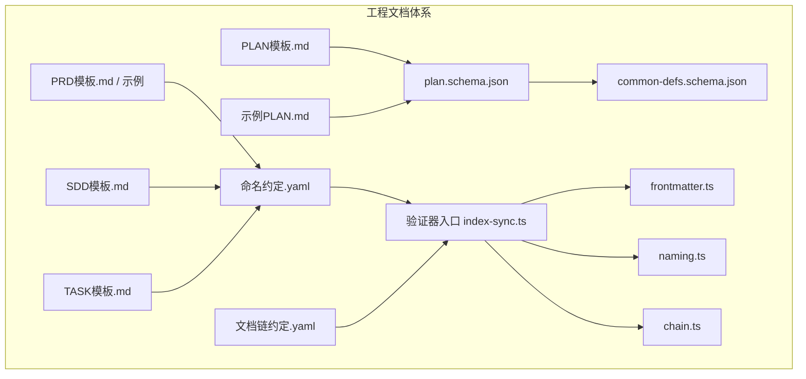
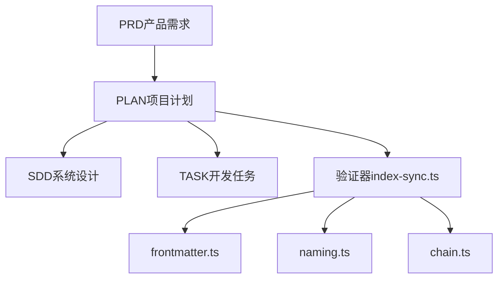
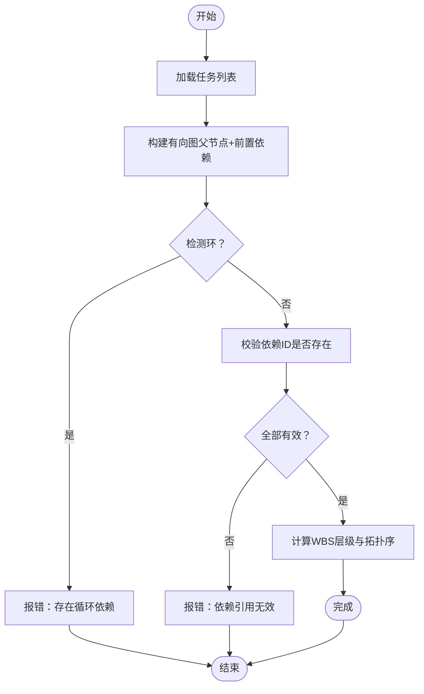
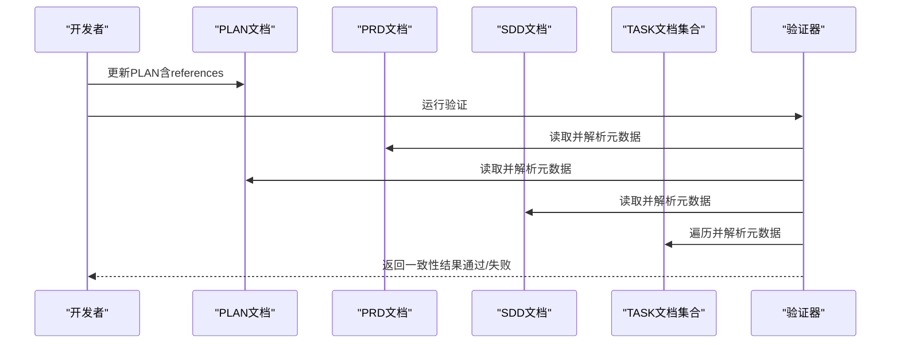
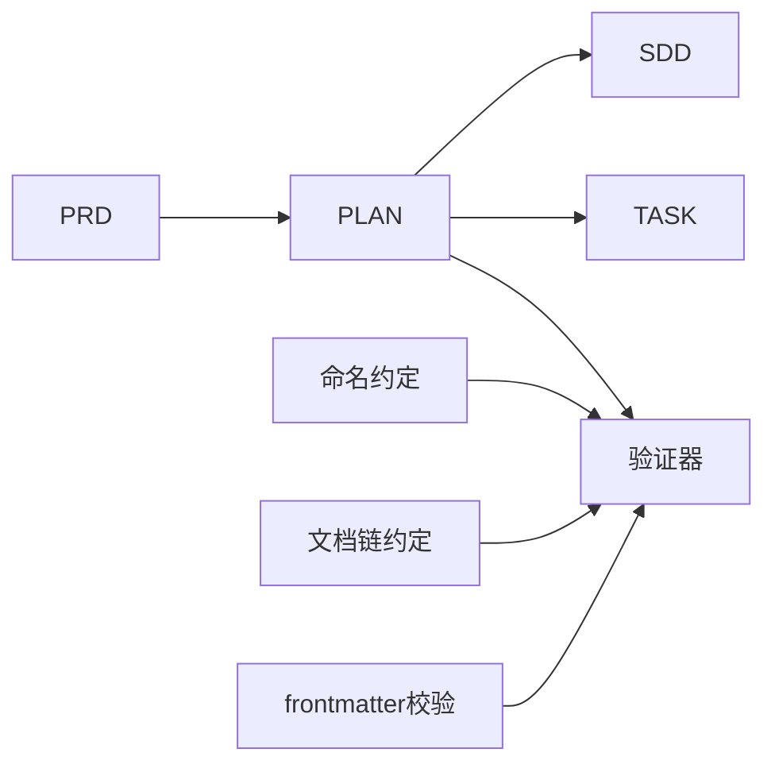

# PLAN文档Schema

<cite>
**本文引用的文件**   
- [plan.schema.json](file://skills/shared/engineering-docs/schemas/plan.schema.json)
- [common-defs.schema.json](file://skills/shared/engineering-docs/schemas/common-defs.schema.json)
- [plan.schema.json](file://skills/shared/engineering-docs/templates/PLAN-template.md)
- [PRD模板](file://skills/shared/engineering-docs/templates/PRD-template.md)
- [SDD模板](file://skills/shared/engineering-docs/templates/SDD-template.md)
- [TASK模板](file://skills/shared/engineering-docs/templates/TASK-template.md)
- [工程文档约定（命名）](file://skills/shared/engineering-docs/conventions/naming.yaml)
- [工程文档约定（文档链）](file://skills/shared/engineering-docs/conventions/doc-chain.yaml)
- [示例：PLAN-v1.0-001-sample-mvp.md](file://skills/shared/engineering-docs/examples/PLAN-v1.0-001-sample-mvp.md)
- [示例：PRD-001-sample-login.md](file://skills/shared/engineering-docs/examples/PRD-001-sample-login.md)
- [验证器入口](file://skills/shared/engineering-docs/scripts/src/validators/index-sync.ts)
- [前端元数据校验](file://skills/shared/engineering-docs/scripts/src/validators/frontmatter.ts)
- [命名校验](file://skills/shared/engineering-docs/scripts/src/validators/naming.ts)
- [文档链校验](file://skills/shared/engineering-docs/scripts/src/validators/chain.ts)
</cite>

## 目录
1. [简介](#简介)
2. [项目结构](#项目结构)
3. [核心组件](#核心组件)
4. [架构总览](#架构总览)
5. [详细组件分析](#详细组件分析)
6. [依赖关系分析](#依赖关系分析)
7. [性能与可扩展性](#性能与可扩展性)
8. [故障排查指南](#故障排查指南)
9. [结论](#结论)
10. [附录](#附录)

## 简介
本技术文档围绕“PLAN（项目计划）”的Schema展开，系统化说明其数据结构、字段语义、约束规则与业务流程。内容覆盖项目目标、里程碑规划、资源分配、时间线管理、风险评估等项目管理要素；并解释任务分解、依赖关系、进度跟踪、变更管理等关键流程在Schema中的表达与校验方式。同时给出与PRD、SDD、TASK等文档的协同关系、数据同步策略、版本管理机制以及生命周期管理与Schema演进指南。

## 项目结构
PLAN Schema及相关工具位于“共享工程文档”子系统中，包含Schema定义、模板、示例、校验脚本与约定规范。整体组织如下：
- Schema定义：plan.schema.json、common-defs.schema.json
- 模板与示例：PLAN模板、示例PLAN、PRD/SDD/TASK模板与示例
- 校验与工具：验证器入口、frontmatter校验、命名校验、文档链校验
- 约定：命名规范、文档链约定

图表来源
- [plan.schema.json](file://skills/shared/engineering-docs/schemas/plan.schema.json)
- [common-defs.schema.json](file://skills/shared/engineering-docs/schemas/common-defs.schema.json)
- [PLAN模板.md](file://skills/shared/engineering-docs/templates/PLAN-template.md)
- [示例PLAN.md](file://skills/shared/engineering-docs/examples/PLAN-v1.0-001-sample-mvp.md)
- [PRD模板.md](file://skills/shared/engineering-docs/templates/PRD-template.md)
- [SDD模板.md](file://skills/shared/engineering-docs/templates/SDD-template.md)
- [TASK模板.md](file://skills/shared/engineering-docs/templates/TASK-template.md)
- [命名约定.yaml](file://skills/shared/engineering-docs/conventions/naming.yaml)
- [文档链约定.yaml](file://skills/shared/engineering-docs/conventions/doc-chain.yaml)
- [验证器入口](file://skills/shared/engineering-docs/scripts/src/validators/index-sync.ts)
- [前端元数据校验](file://skills/shared/engineering-docs/scripts/src/validators/frontmatter.ts)
- [命名校验](file://skills/shared/engineering-docs/scripts/src/validators/naming.ts)
- [文档链校验](file://skills/shared/engineering-docs/scripts/src/validators/chain.ts)

章节来源
- [plan.schema.json](file://skills/shared/engineering-docs/schemas/plan.schema.json)
- [common-defs.schema.json](file://skills/shared/engineering-docs/schemas/common-defs.schema.json)
- [PLAN模板.md](file://skills/shared/engineering-docs/templates/PLAN-template.md)
- [示例PLAN.md](file://skills/shared/engineering-docs/examples/PLAN-v1.0-001-sample-mvp.md)
- [PRD模板.md](file://skills/shared/engineering-docs/templates/PRD-template.md)
- [SDD模板.md](file://skills/shared/engineering-docs/templates/SDD-template.md)
- [TASK模板.md](file://skills/shared/engineering-docs/templates/TASK-template.md)
- [命名约定.yaml](file://skills/shared/engineering-docs/conventions/naming.yaml)
- [文档链约定.yaml](file://skills/shared/engineering-docs/conventions/doc-chain.yaml)
- [验证器入口](file://skills/shared/engineering-docs/scripts/src/validators/index-sync.ts)
- [前端元数据校验](file://skills/shared/engineering-docs/scripts/src/validators/frontmatter.ts)
- [命名校验](file://skills/shared/engineering-docs/scripts/src/validators/naming.ts)
- [文档链校验](file://skills/shared/engineering-docs/scripts/src/validators/chain.ts)

## 核心组件
PLAN Schema的核心由以下部分组成：
- 顶层元数据：标识、版本、状态、创建/更新时间、负责人、关联文档ID等
- 项目目标与范围：业务背景、目标、范围边界、成功指标
- 里程碑与时间线：阶段划分、起止时间、交付物、依赖里程碑
- 任务分解与依赖：WBS层级、任务间依赖、前置条件、验收标准
- 资源与成本：角色/人员、预算、外部依赖
- 风险与问题：风险登记、影响等级、缓解措施、责任人
- 进度与度量：完成度、燃尽/累积统计、基线与偏差
- 变更管理：变更记录、审批流、影响评估
- 文档链与追溯：与PRD、SDD、TASK等的双向链接与一致性校验

上述字段的具体类型、必填项、枚举值、格式与交叉校验规则均在Schema中定义，并通过验证器进行运行时检查。

章节来源
- [plan.schema.json](file://skills/shared/engineering-docs/schemas/plan.schema.json)
- [common-defs.schema.json](file://skills/shared/engineering-docs/schemas/common-defs.schema.json)

## 架构总览
PLAN作为项目级编排文档，处于需求到设计与实现的枢纽位置。它与PRD（产品需求）、SDD（系统设计）、TASK（开发任务）形成闭环，通过统一的ID与文档链约定实现可追溯与一致性校验。

图表来源
- [验证器入口](file://skills/shared/engineering-docs/scripts/src/validators/index-sync.ts)
- [前端元数据校验](file://skills/shared/engineering-docs/scripts/src/validators/frontmatter.ts)
- [命名校验](file://skills/shared/engineering-docs/scripts/src/validators/naming.ts)
- [文档链校验](file://skills/shared/engineering-docs/scripts/src/validators/chain.ts)

## 详细组件分析

### 字段结构与约束（按模块）
- 元数据
  - 字段：id、title、version、status、owner、created_at、updated_at、tags、links等
  - 约束：唯一性、日期格式、枚举值、必填项
- 项目目标与范围
  - 字段：objectives、scope、success_metrics、assumptions、constraints
  - 约束：非空数组/字符串、度量需可量化
- 里程碑与时间线
  - 字段：milestones[]（name、start_date、end_date、deliverables、dependencies、status）
  - 约束：时间区间合法、依赖存在、状态枚举
- 任务分解与依赖
  - 字段：tasks[]（id、title、wbs_level、parent_id、prerequisite_ids、assignee、effort、acceptance_criteria、status、progress_pct）
  - 约束：树形结构无环、依赖引用有效、进度百分比范围
- 资源与成本
  - 字段：resources[]（role、person、budget、external_deps）
  - 约束：角色与人员映射、预算数值型
- 风险与问题
  - 字段：risks[]（id、description、likelihood、impact、mitigation、owner、status）
  - 约束：概率/影响为枚举或数值、状态流转合理
- 进度与度量
  - 字段：baseline、actuals、variance、burndown/burndata
  - 约束：基线与实际对比逻辑一致
- 变更管理
  - 字段：changes[]（change_id、summary、impact_assessment、approval_status、approved_by、effective_date）
  - 约束：审批状态机、生效日期不早于当前
- 文档链与追溯
  - 字段：references.prd_id、references.sdd_id、references.task_ids[]
  - 约束：ID存在性、命名符合约定、链式可达

章节来源
- [plan.schema.json](file://skills/shared/engineering-docs/schemas/plan.schema.json)
- [common-defs.schema.json](file://skills/shared/engineering-docs/schemas/common-defs.schema.json)

### 任务分解与依赖关系（算法流程）
该流程用于确保任务树的完整性与无环依赖。

图表来源
- [验证器入口](file://skills/shared/engineering-docs/scripts/src/validators/index-sync.ts)
- [文档链校验](file://skills/shared/engineering-docs/scripts/src/validators/chain.ts)

### 文档链与一致性校验（序列）
从PRD到PLAN再到SDD/TASK的一致性校验流程如下：

图表来源
- [验证器入口](file://skills/shared/engineering-docs/scripts/src/validators/index-sync.ts)
- [文档链校验](file://skills/shared/engineering-docs/scripts/src/validators/chain.ts)
- [命名约定.yaml](file://skills/shared/engineering-docs/conventions/naming.yaml)
- [文档链约定.yaml](file://skills/shared/engineering-docs/conventions/doc-chain.yaml)

### 版本管理与变更控制
- 版本号策略：采用主.次.修订号（如v1.0.0），重大变更递增主版本，新增能力递增次版本，修复递增修订号
- 变更条目：每次变更记录change_id、摘要、影响评估、审批状态、生效日期
- 基线管理：对里程碑与任务基线快照，实际执行后计算偏差
- 审批流：变更需经指定角色审批后方可生效

章节来源
- [plan.schema.json](file://skills/shared/engineering-docs/schemas/plan.schema.json)

### 与PRD、SDD、TASK的协同关系
- PLAN引用PRD的目标与范围，确保项目目标与产品需求对齐
- PLAN驱动SDD的设计范围与接口契约，保证设计不越界
- PLAN将工作分解为TASK，明确依赖与验收标准，支撑开发与测试
- 通过统一ID与文档链约定，实现跨文档的可追溯与一致性校验

章节来源
- [PLAN模板.md](file://skills/shared/engineering-docs/templates/PLAN-template.md)
- [PRD模板.md](file://skills/shared/engineering-docs/templates/PRD-template.md)
- [SDD模板.md](file://skills/shared/engineering-docs/templates/SDD-template.md)
- [TASK模板.md](file://skills/shared/engineering-docs/templates/TASK-template.md)
- [命名约定.yaml](file://skills/shared/engineering-docs/conventions/naming.yaml)
- [文档链约定.yaml](file://skills/shared/engineering-docs/conventions/doc-chain.yaml)

### 完整示例参考
仓库提供示例PLAN与PRD，可作为编写与校验的参考：
- 示例PLAN：[示例PLAN.md](file://skills/shared/engineering-docs/examples/PLAN-v1.0-001-sample-mvp.md)
- 示例PRD：[示例PRD.md](file://skills/shared/engineering-docs/examples/PRD-001-sample-login.md)

章节来源
- [示例PLAN.md](file://skills/shared/engineering-docs/examples/PLAN-v1.0-001-sample-mvp.md)
- [示例PRD.md](file://skills/shared/engineering-docs/examples/PRD-001-sample-login.md)

## 依赖关系分析
PLAN与其他文档及工具的依赖关系如下：
- 输入依赖：PRD（需求）、SDD（设计）、TASK（任务）
- 输出依赖：里程碑与任务基线、变更与进度报告
- 校验依赖：命名约定、文档链约定、frontmatter元数据、链式可达性

图表来源
- [验证器入口](file://skills/shared/engineering-docs/scripts/src/validators/index-sync.ts)
- [命名约定.yaml](file://skills/shared/engineering-docs/conventions/naming.yaml)
- [文档链约定.yaml](file://skills/shared/engineering-docs/conventions/doc-chain.yaml)
- [前端元数据校验](file://skills/shared/engineering-docs/scripts/src/validators/frontmatter.ts)

章节来源
- [验证器入口](file://skills/shared/engineering-docs/scripts/src/validators/index-sync.ts)
- [命名约定.yaml](file://skills/shared/engineering-docs/conventions/naming.yaml)
- [文档链约定.yaml](file://skills/shared/engineering-docs/conventions/doc-chain.yaml)
- [前端元数据校验](file://skills/shared/engineering-docs/scripts/src/validators/frontmatter.ts)

## 性能与可扩展性
- 校验复杂度：任务依赖检测为O(V+E)，文档链可达性为O(N)
- 可扩展点：
  - 新增字段时扩展plan.schema.json并在验证器中补充校验逻辑
  - 引入新的文档类型时扩展文档链约定与链式校验
  - 增加度量指标时需更新基准与实际对比逻辑

[本节为通用指导，无需特定文件来源]

## 故障排查指南
常见问题与定位方法：
- 命名不符合约定：检查命名规则与ID生成策略
- 文档链断裂：确认references中的ID存在且可达
- 依赖环：检查任务前置依赖是否形成环
- 元数据缺失：核对frontmatter必填字段与格式

建议步骤：
- 运行验证器入口以获取详细错误信息
- 逐一检查frontmatter、命名、链式可达性
- 修正后重新运行验证直至通过

章节来源
- [验证器入口](file://skills/shared/engineering-docs/scripts/src/validators/index-sync.ts)
- [前端元数据校验](file://skills/shared/engineering-docs/scripts/src/validators/frontmatter.ts)
- [命名校验](file://skills/shared/engineering-docs/scripts/src/validators/naming.ts)
- [文档链校验](file://skills/shared/engineering-docs/scripts/src/validators/chain.ts)

## 结论
PLAN Schema为项目计划提供了结构化、可校验、可追溯的数据模型。通过与PRD、SDD、TASK的紧密协同与严格的验证机制，确保项目目标、范围、进度与质量的一致性与可控性。建议在迭代过程中持续完善Schema与校验规则，保持文档体系的健壮性与可演进性。

[本节为总结，无需特定文件来源]

## 附录
- 术语表
  - WBS：工作分解结构
  - 基线：里程碑与任务的初始承诺版本
  - 文档链：跨文档的ID与引用关系集合
- 最佳实践
  - 使用一致的命名与ID策略
  - 在变更前进行影响评估与审批
  - 定期更新进度与度量，保持基线与实际一致
  - 利用示例与模板快速上手

[本节为概念性内容，无需特定文件来源]