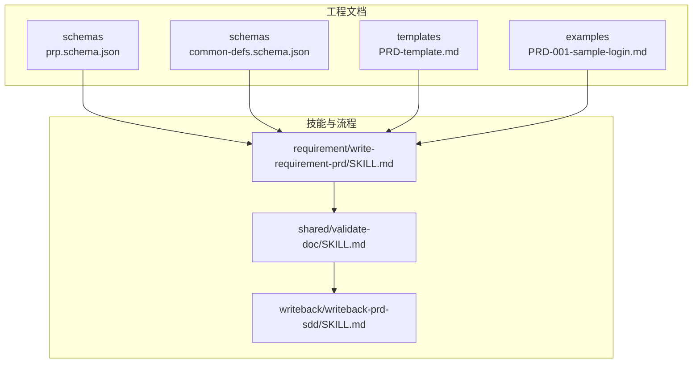
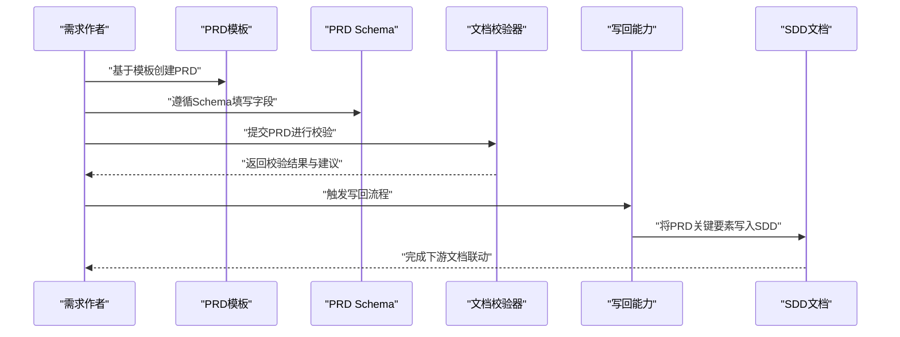
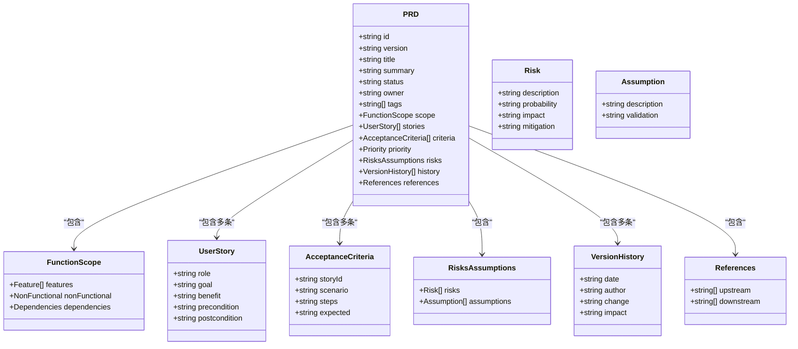
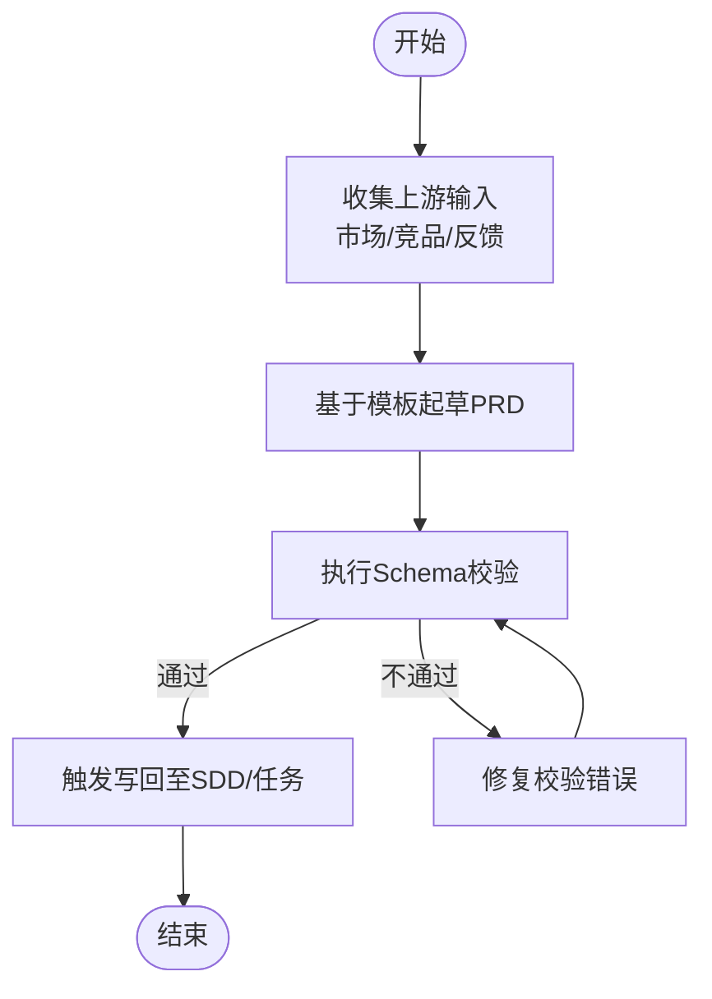
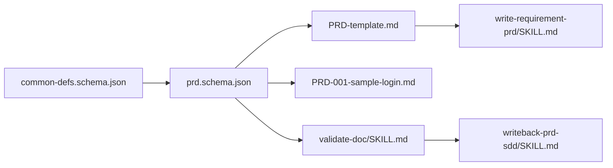

# PRD文档Schema

<cite>
**本文档引用的文件**   
- [prd.schema.json](file://skills/shared/engineering-docs/schemas/prd.schema.json)
- [common-defs.schema.json](file://skills/shared/engineering-docs/schemas/common-defs.schema.json)
- [PRD-template.md](file://skills/shared/engineering-docs/templates/PRD-template.md)
- [PRD-001-sample-login.md](file://skills/shared/engineering-docs/examples/PRD-001-sample-login.md)
- [write-requirement-prd/SKILL.md](file://skills/requirement/write-requirement-prd/SKILL.md)
- [validate-doc/SKILL.md](file://skills/shared/validate-doc/SKILL.md)
- [writeback-prd-sdd/SKILL.md](file://skills/writeback/writeback-prd-sdd/SKILL.md)
</cite>

## 目录
1. [简介](#简介)
2. [项目结构](#项目结构)
3. [核心组件](#核心组件)
4. [架构总览](#架构总览)
5. [详细组件分析](#详细组件分析)
6. [依赖关系分析](#依赖关系分析)
7. [性能与可用性考虑](#性能与可用性考虑)
8. [故障排查指南](#故障排查指南)
9. [结论](#结论)
10. [附录](#附录)

## 简介
本技术文档围绕“产品需求文档（PRD）”的JSON Schema展开，系统化说明PRD的结构定义、字段类型、必填校验规则、嵌套对象与业务约束，并结合模板与示例展示实际用法。同时梳理PRD与其他工程文档（如SDD、任务、计划等）的关联关系与数据流转机制，提供验证错误排查与最佳实践建议，帮助团队在规范、一致、可追溯的前提下高效产出与维护高质量PRD。

## 项目结构
与PRD相关的核心资源分布在以下位置：
- Schema定义：位于工程文档 schemas 目录下，包含PRD主Schema与通用定义。
- 模板与示例：位于 templates 与 examples 目录下，提供标准结构与参考案例。
- 能力与流程：位于 skills 目录下的需求编写、文档校验与写回能力中，覆盖从生成到校验再到跨文档同步的流程。

图表来源
- [prd.schema.json:1-200](file://skills/shared/engineering-docs/schemas/prd.schema.json#L1-L200)
- [common-defs.schema.json:1-200](file://skills/shared/engineering-docs/schemas/common-defs.schema.json#L1-L200)
- [PRD-template.md:1-200](file://skills/shared/engineering-docs/templates/PRD-template.md#L1-L200)
- [PRD-001-sample-login.md:1-200](file://skills/shared/engineering-docs/examples/PRD-001-sample-login.md#L1-L200)
- [write-requirement-prd/SKILL.md:1-200](file://skills/requirement/write-requirement-prd/SKILL.md#L1-L200)
- [validate-doc/SKILL.md:1-200](file://skills/shared/validate-doc/SKILL.md#L1-L200)
- [writeback-prd-sdd/SKILL.md:1-200](file://skills/writeback/writeback-prd-sdd/SKILL.md#L1-L200)

章节来源
- [prd.schema.json:1-200](file://skills/shared/engineering-docs/schemas/prd.schema.json#L1-L200)
- [common-defs.schema.json:1-200](file://skills/shared/engineering-docs/schemas/common-defs.schema.json#L1-L200)
- [PRD-template.md:1-200](file://skills/shared/engineering-docs/templates/PRD-template.md#L1-L200)
- [PRD-001-sample-login.md:1-200](file://skills/shared/engineering-docs/examples/PRD-001-sample-login.md#L1-L200)
- [write-requirement-prd/SKILL.md:1-200](file://skills/requirement/write-requirement-prd/SKILL.md#L1-L200)
- [validate-doc/SKILL.md:1-200](file://skills/shared/validate-doc/SKILL.md#L1-L200)
- [writeback-prd-sdd/SKILL.md:1-200](file://skills/writeback/writeback-prd-sdd/SKILL.md#L1-L200)

## 核心组件
本节聚焦PRD JSON Schema的核心组成与关键约束，涵盖顶层元信息、功能范围、用户故事、验收标准、优先级与风险、版本与变更历史等。

- 顶层元信息
  - 标识与版本：用于唯一标识PRD及其迭代版本，便于追踪与回溯。
  - 标题与摘要：描述PRD主题与目标，辅助检索与评审。
  - 状态与责任人：记录当前阶段与负责人，支撑流程推进。
  - 标签与分类：用于组织与筛选，支持多维度管理。

- 功能范围与边界
  - 功能清单：结构化列出待实现的功能项，通常包含名称、简述、范围与依赖。
  - 非功能要求：性能、安全、可用性等指标与约束。
  - 外部依赖：第三方服务、平台或系统接口约定。

- 用户故事与验收标准
  - 用户故事：以角色-目标-收益的表达方式描述价值点，并附带前置条件与后置结果。
  - 验收标准：对每个用户故事给出可测试的通过条件，确保交付质量。

- 优先级与排期
  - 优先级：采用统一枚举值表达重要程度，影响排期与评审策略。
  - 里程碑与时间窗：可选字段，用于规划节奏与发布窗口。

- 风险与假设
  - 风险登记：识别潜在风险、影响面与缓解措施。
  - 假设与限制：明确前提条件与边界约束，降低歧义。

- 版本与变更历史
  - 变更记录：按时间顺序记录变更内容、原因与影响范围。
  - 审批与评审：记录评审意见与决策结果，形成闭环。

- 关联文档与引用
  - 上游输入：市场洞察、竞品分析、用户反馈等。
  - 下游输出：技术方案设计（SDD）、任务分解、测试用例等。

章节来源
- [prd.schema.json:1-200](file://skills/shared/engineering-docs/schemas/prd.schema.json#L1-L200)
- [common-defs.schema.json:1-200](file://skills/shared/engineering-docs/schemas/common-defs.schema.json#L1-L200)

## 架构总览
下图展示了PRD在整个工程文档体系中的位置与交互关系，包括生成、校验与写回流程。

图表来源
- [PRD-template.md:1-200](file://skills/shared/engineering-docs/templates/PRD-template.md#L1-L200)
- [prd.schema.json:1-200](file://skills/shared/engineering-docs/schemas/prd.schema.json#L1-L200)
- [validate-doc/SKILL.md:1-200](file://skills/shared/validate-doc/SKILL.md#L1-L200)
- [writeback-prd-sdd/SKILL.md:1-200](file://skills/writeback/writeback-prd-sdd/SKILL.md#L1-L200)

## 详细组件分析

### PRD Schema 结构解析
- 顶层对象
  - 必需字段：标识、版本、标题、摘要、状态、责任人、标签、功能范围、用户故事、验收标准、优先级、风险与假设、版本历史、关联文档。
  - 可选字段：扩展元信息、备注、附件链接等。
- 嵌套对象
  - 功能范围：包含功能清单、非功能要求、外部依赖。
  - 用户故事：每条故事包含角色、目标、收益、前置条件、后置结果。
  - 验收标准：与用户故事一一对应，包含场景、步骤、预期结果。
  - 优先级：使用统一枚举值，如高、中、低。
  - 风险与假设：风险条目包含描述、概率、影响、缓解措施；假设条目包含描述与验证方式。
  - 版本历史：每次变更包含日期、作者、变更内容、影响范围。
  - 关联文档：上游输入与下游输出的引用列表。

图表来源
- [prd.schema.json:1-200](file://skills/shared/engineering-docs/schemas/prd.schema.json#L1-L200)
- [common-defs.schema.json:1-200](file://skills/shared/engineering-docs/schemas/common-defs.schema.json#L1-L200)

章节来源
- [prd.schema.json:1-200](file://skills/shared/engineering-docs/schemas/prd.schema.json#L1-L200)
- [common-defs.schema.json:1-200](file://skills/shared/engineering-docs/schemas/common-defs.schema.json#L1-L200)

### 字段类型与必填校验规则
- 字符串字段
  - 标识与版本：建议使用稳定格式（如语义化版本），避免重复与冲突。
  - 标题与摘要：长度限制与字符集约束，保证可读性与检索效率。
  - 状态与责任人：使用预定义枚举或规范化命名，减少歧义。
- 数组字段
  - 标签与分类：限定取值集合，便于聚合与统计。
  - 功能清单与用户故事：每项需满足最小完整性（至少包含必要子字段）。
- 布尔与数值
  - 开关型标志位：用于启用/禁用特性或流程节点。
  - 指标与阈值：用于非功能要求的量化表达。
- 必填项验证
  - 顶层必需字段缺失将导致校验失败。
  - 嵌套对象内关键字段缺失会触发局部错误提示。
  - 枚举值不在允许集合内将被拒绝。

章节来源
- [prd.schema.json:1-200](file://skills/shared/engineering-docs/schemas/prd.schema.json#L1-L200)
- [common-defs.schema.json:1-200](file://skills/shared/engineering-docs/schemas/common-defs.schema.json#L1-L200)

### 业务逻辑约束
- 一致性约束
  - 用户故事与验收标准需保持一对一映射，避免遗漏或错位。
  - 优先级应与排期与资源分配保持一致，避免冲突。
- 完整性约束
  - 功能范围需覆盖所有关键路径与非关键路径。
  - 风险与假设需具备可验证性，并在后续阶段持续更新。
- 演进约束
  - 版本历史需保留变更轨迹，支持回溯与审计。
  - 关联文档需随PRD演进同步更新，保持上下游一致。

章节来源
- [prd.schema.json:1-200](file://skills/shared/engineering-docs/schemas/prd.schema.json#L1-L200)
- [common-defs.schema.json:1-200](file://skills/shared/engineering-docs/schemas/common-defs.schema.json#L1-L200)

### 完整JSON Schema示例与案例
- 完整Schema示例
  - 请参考PRD Schema定义文件获取完整的字段定义、类型与约束。
- 实际案例
  - 参考登录功能的PRD示例，了解真实场景下的字段填充与结构组织。

章节来源
- [prd.schema.json:1-200](file://skills/shared/engineering-docs/schemas/prd.schema.json#L1-L200)
- [PRD-001-sample-login.md:1-200](file://skills/shared/engineering-docs/examples/PRD-001-sample-login.md#L1-L200)

### PRD与其他文档类型的关联关系与数据流转
- 上游输入
  - 市场洞察、竞品分析、用户反馈等作为PRD输入，驱动需求提炼与范围界定。
- 下游输出
  - PRD的关键要素（功能、验收标准、优先级）被写回到SDD与任务分解，形成设计与实施依据。
- 写回流程
  - 通过写回能力将PRD结构化数据抽取并注入下游文档，确保一致性。

图表来源
- [write-requirement-prd/SKILL.md:1-200](file://skills/requirement/write-requirement-prd/SKILL.md#L1-L200)
- [validate-doc/SKILL.md:1-200](file://skills/shared/validate-doc/SKILL.md#L1-L200)
- [writeback-prd-sdd/SKILL.md:1-200](file://skills/writeback/writeback-prd-sdd/SKILL.md#L1-L200)

章节来源
- [write-requirement-prd/SKILL.md:1-200](file://skills/requirement/write-requirement-prd/SKILL.md#L1-L200)
- [validate-doc/SKILL.md:1-200](file://skills/shared/validate-doc/SKILL.md#L1-L200)
- [writeback-prd-sdd/SKILL.md:1-200](file://skills/writeback/writeback-prd-sdd/SKILL.md#L1-L200)

## 依赖关系分析
PRD Schema依赖通用定义（common-defs），并通过模板与示例指导实践，最终由校验与写回能力保障质量与一致性。

图表来源
- [common-defs.schema.json:1-200](file://skills/shared/engineering-docs/schemas/common-defs.schema.json#L1-L200)
- [prd.schema.json:1-200](file://skills/shared/engineering-docs/schemas/prd.schema.json#L1-L200)
- [PRD-template.md:1-200](file://skills/shared/engineering-docs/templates/PRD-template.md#L1-L200)
- [PRD-001-sample-login.md:1-200](file://skills/shared/engineering-docs/examples/PRD-001-sample-login.md#L1-L200)
- [write-requirement-prd/SKILL.md:1-200](file://skills/requirement/write-requirement-prd/SKILL.md#L1-L200)
- [validate-doc/SKILL.md:1-200](file://skills/shared/validate-doc/SKILL.md#L1-L200)
- [writeback-prd-sdd/SKILL.md:1-200](file://skills/writeback/writeback-prd-sdd/SKILL.md#L1-L200)

章节来源
- [common-defs.schema.json:1-200](file://skills/shared/engineering-docs/schemas/common-defs.schema.json#L1-L200)
- [prd.schema.json:1-200](file://skills/shared/engineering-docs/schemas/prd.schema.json#L1-L200)
- [PRD-template.md:1-200](file://skills/shared/engineering-docs/templates/PRD-template.md#L1-L200)
- [PRD-001-sample-login.md:1-200](file://skills/shared/engineering-docs/examples/PRD-001-sample-login.md#L1-L200)
- [write-requirement-prd/SKILL.md:1-200](file://skills/requirement/write-requirement-prd/SKILL.md#L1-L200)
- [validate-doc/SKILL.md:1-200](file://skills/shared/validate-doc/SKILL.md#L1-L200)
- [writeback-prd-sdd/SKILL.md:1-200](file://skills/writeback/writeback-prd-sdd/SKILL.md#L1-L200)

## 性能与可用性考虑
- 校验性能
  - 大型PRD可能包含大量用户故事与验收标准，建议在批量校验时采用增量模式与缓存策略。
- 可用性优化
  - 为常用字段提供默认值与占位符，降低上手成本。
  - 在编辑器中集成实时校验提示，提升编写体验。
- 可扩展性
  - 通过扩展元信息与自定义标签，支持不同团队的差异化需求。

[本节为通用建议，无需特定文件来源]

## 故障排查指南
- 常见校验错误
  - 必填字段缺失：检查顶层与嵌套对象的必需字段是否完整。
  - 枚举值非法：确认优先级、状态等字段取值是否在允许集合内。
  - 类型不匹配：核对字符串、数组、布尔与数值字段的类型是否符合Schema定义。
  - 关联不一致：用户故事与验收标准的映射是否完整且正确。
- 定位与修复
  - 使用校验工具的输出信息快速定位问题字段。
  - 对照模板与示例修正结构与内容。
  - 必要时调整Schema或扩展定义，确保与团队规范一致。

章节来源
- [validate-doc/SKILL.md:1-200](file://skills/shared/validate-doc/SKILL.md#L1-L200)
- [PRD-template.md:1-200](file://skills/shared/engineering-docs/templates/PRD-template.md#L1-L200)
- [PRD-001-sample-login.md:1-200](file://skills/shared/engineering-docs/examples/PRD-001-sample-login.md#L1-L200)

## 结论
PRD JSON Schema为产品需求的结构化表达提供了坚实基础，结合模板、示例与校验、写回能力，能够显著提升需求产出的规范性与可追溯性。建议团队在编写过程中严格遵循Schema约束，持续完善校验规则与最佳实践，确保PRD在不同阶段与不同文档之间保持一致与协同。

[本节为总结性内容，无需特定文件来源]

## 附录
- 术语表
  - PRD：产品需求文档
  - SDD：系统设计文档
  - 用户故事：以角色-目标-收益的方式描述价值的叙述单元
  - 验收标准：用于判定用户故事是否完成的测试条件
- 参考路径
  - Schema定义：见工程文档 schemas 目录
  - 模板与示例：见工程文档 templates 与 examples 目录
  - 能力与流程：见 skills 目录下的相关SKILL文件

[本节为补充信息，无需特定文件来源]