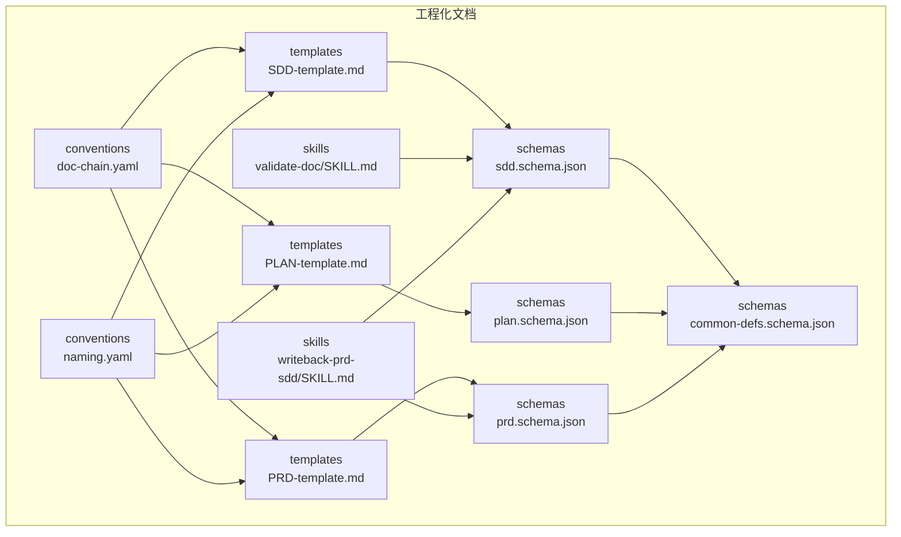
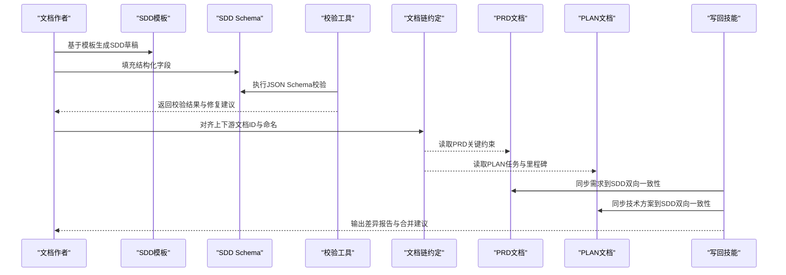
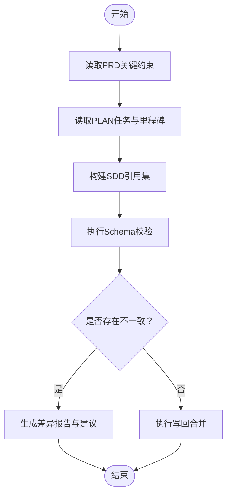
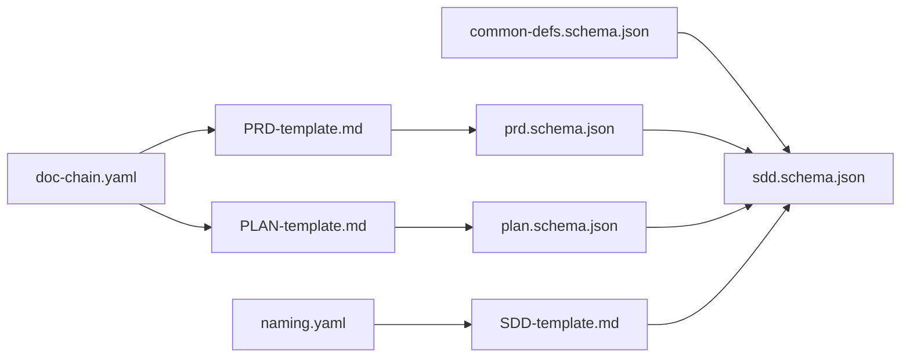

# SDD文档Schema

<cite>
**本文引用的文件**   
- [sdd.schema.json](file://skills/shared/engineering-docs/schemas/sdd.schema.json)
- [common-defs.schema.json](file://skills/shared/engineering-docs/schemas/common-defs.schema.json)
- [plan.schema.json](file://skills/shared/engineering-docs/schemas/plan.schema.json)
- [prd.schema.json](file://skills/shared/engineering-docs/schemas/prd.schema.json)
- [SDD-template.md](file://skills/shared/engineering-docs/templates/SDD-template.md)
- [PRD-template.md](file://skills/shared/engineering-docs/templates/PRD-template.md)
- [PLAN-template.md](file://skills/shared/engineering-docs/templates/PLAN-template.md)
- [doc-chain.yaml](file://skills/shared/engineering-docs/conventions/doc-chain.yaml)
- [naming.yaml](file://skills/shared/engineering-docs/conventions/naming.yaml)
- [writeback-prd-sdd/SKILL.md](file://skills/writeback/writeback-prd-sdd/SKILL.md)
- [validate-doc/SKILL.md](file://skills/shared/validate-doc/SKILL.md)
</cite>

## 目录
1. [简介](#简介)
2. [项目结构](#项目结构)
3. [核心组件](#核心组件)
4. [架构总览](#架构总览)
5. [详细组件分析](#详细组件分析)
6. [依赖关系分析](#依赖关系分析)
7. [性能与一致性考虑](#性能与一致性考虑)
8. [故障排查指南](#故障排查指南)
9. [结论](#结论)
10. [附录](#附录)

## 简介
本技术文档围绕“系统设计文档（SDD）”的Schema定义展开，目标是：
- 明确SDD的结构规范与技术要素（系统架构设计、模块划分、接口定义、数据模型等）
- 解释技术栈选择、组件关系、依赖管理、安全设计等字段的验证规则与约束
- 提供完整的SDD示例结构与JSON Schema校验说明
- 阐述SDD与PRD、PLAN等其他文档的关联关系与数据一致性要求
- 总结常见的设计模式表达方式与Schema扩展指南

## 项目结构
与SDD相关的核心资源位于“工程化文档”能力域中，包括：
- Schema定义：用于结构化校验SDD及其相关文档
- 模板：用于生成标准格式的SDD/PRD/PLAN等文档骨架
- 约定：文档链路与命名规范
- 技能：用于校验与写回的一致性流程

图表来源
- [sdd.schema.json](file://skills/shared/engineering-docs/schemas/sdd.schema.json)
- [common-defs.schema.json](file://skills/shared/engineering-docs/schemas/common-defs.schema.json)
- [plan.schema.json](file://skills/shared/engineering-docs/schemas/plan.schema.json)
- [prd.schema.json](file://skills/shared/engineering-docs/schemas/prd.schema.json)
- [SDD-template.md](file://skills/shared/engineering-docs/templates/SDD-template.md)
- [PRD-template.md](file://skills/shared/engineering-docs/templates/PRD-template.md)
- [PLAN-template.md](file://skills/shared/engineering-docs/templates/PLAN-template.md)
- [doc-chain.yaml](file://skills/shared/engineering-docs/conventions/doc-chain.yaml)
- [naming.yaml](file://skills/shared/engineering-docs/conventions/naming.yaml)
- [validate-doc/SKILL.md](file://skills/shared/validate-doc/SKILL.md)
- [writeback-prd-sdd/SKILL.md](file://skills/writeback/writeback-prd-sdd/SKILL.md)

章节来源
- [sdd.schema.json](file://skills/shared/engineering-docs/schemas/sdd.schema.json)
- [common-defs.schema.json](file://skills/shared/engineering-docs/schemas/common-defs.schema.json)
- [plan.schema.json](file://skills/shared/engineering-docs/schemas/plan.schema.json)
- [prd.schema.json](file://skills/shared/engineering-docs/schemas/prd.schema.json)
- [SDD-template.md](file://skills/shared/engineering-docs/templates/SDD-template.md)
- [PRD-template.md](file://skills/shared/engineering-docs/templates/PRD-template.md)
- [PLAN-template.md](file://skills/shared/engineering-docs/templates/PLAN-template.md)
- [doc-chain.yaml](file://skills/shared/engineering-docs/conventions/doc-chain.yaml)
- [naming.yaml](file://skills/shared/engineering-docs/conventions/naming.yaml)
- [validate-doc/SKILL.md](file://skills/shared/validate-doc/SKILL.md)
- [writeback-prd-sdd/SKILL.md](file://skills/writeback/writeback-prd-sdd/SKILL.md)

## 核心组件
本节聚焦SDD Schema的核心字段族与校验要点。为便于理解，按功能域分组说明：

- 元信息与版本控制
  - 标识符、标题、版本、状态、创建/更新时间戳、作者与维护者
  - 校验要点：必填性、唯一性、时间格式、枚举值范围

- 文档链路与引用
  - 上游/下游文档ID或路径（如PRD、PLAN、CR等）
  - 校验要点：存在性检查、循环引用检测、命名规范匹配

- 系统概览与目标
  - 背景、范围、非目标、成功指标、风险与假设
  - 校验要点：文本长度限制、关键词白名单（可选）

- 技术栈与平台
  - 语言、框架、运行时、数据库、中间件、云厂商与区域
  - 校验要点：枚举白名单、版本语义化、兼容性矩阵

- 架构与模块
  - 架构图描述、模块清单、职责边界、部署拓扑
  - 校验要点：模块ID唯一性、层级深度限制、外部依赖声明

- 接口与集成
  - API清单、协议、鉴权、限流、错误码、契约文件路径
  - 校验要点：OpenAPI路径有效性、鉴权类型枚举、必填字段

- 数据模型
  - 实体、字段、索引、迁移脚本、数据流向
  - 校验要点：主键约束、外键完整性、字段类型映射

- 安全与合规
  - 威胁建模、访问控制、加密策略、审计日志、合规项
  - 校验要点：敏感字段标记、策略枚举、证据附件路径

- 可观测性与运维
  - 监控指标、告警规则、日志级别、容量规划、灾备策略
  - 校验要点：指标命名规范、阈值范围、RTO/RPO合理性

- 变更与发布
  - 里程碑、灰度策略、回滚方案、验收标准
  - 校验要点：日期顺序、阶段覆盖度、回滚路径可达

章节来源
- [sdd.schema.json](file://skills/shared/engineering-docs/schemas/sdd.schema.json)
- [common-defs.schema.json](file://skills/shared/engineering-docs/schemas/common-defs.schema.json)

## 架构总览
下图展示SDD在工程化文档体系中的位置及与其他文档的关系，以及校验与写回流程。

图表来源
- [SDD-template.md](file://skills/shared/engineering-docs/templates/SDD-template.md)
- [sdd.schema.json](file://skills/shared/engineering-docs/schemas/sdd.schema.json)
- [doc-chain.yaml](file://skills/shared/engineering-docs/conventions/doc-chain.yaml)
- [PRD-template.md](file://skills/shared/engineering-docs/templates/PRD-template.md)
- [PLAN-template.md](file://skills/shared/engineering-docs/templates/PLAN-template.md)
- [writeback-prd-sdd/SKILL.md](file://skills/writeback/writeback-prd-sdd/SKILL.md)

## 详细组件分析

### SDD Schema 字段族与约束
- 元信息
  - 字段：id、title、version、status、created_at、updated_at、authors、maintainers
  - 约束：id全局唯一；version遵循语义化版本；status为枚举；时间戳符合ISO 8601
- 文档链路
  - 字段：related_docs[]、references[]
  - 约束：必须指向已存在的PRD/PLAN；禁止循环引用；命名符合约定
- 技术栈
  - 字段：tech_stack{}、platforms[]、dependencies[]
  - 约束：tech_stack.key为白名单枚举；version满足正则；dependencies需声明许可证
- 架构与模块
  - 字段：architecture、modules[]、deployments[]
  - 约束：modules.id唯一；层级depth≤N；external_deps需声明SLA
- 接口与集成
  - 字段：apis[]、auth_type、rate_limit、error_codes、openapi_path
  - 约束：auth_type枚举；openapi_path存在且可解析；error_codes不重复
- 数据模型
  - 字段：entities[]、indexes[]、migrations[]
  - 约束：entities[].primary_key必填；indexes覆盖高频查询；migrations顺序递增
- 安全与合规
  - 字段：threat_model、access_control、encryption、audit、compliance[]
  - 约束：threat_model包含至少一项；encryption算法为白名单；compliance条目需证据路径
- 可观测性与运维
  - 字段：metrics[], alerts[], logging, capacity, disaster_recovery
  - 约束：metrics命名规范；alerts阈值合理；capacity含峰值估算；disaster_recovery含RTO/RPO
- 变更与发布
  - 字段：milestones[], rollout_strategy, rollback_plan, acceptance_criteria[]
  - 约束：milestones.date递增；rollout_strategy覆盖灰度；rollback_plan可执行

章节来源
- [sdd.schema.json](file://skills/shared/engineering-docs/schemas/sdd.schema.json)
- [common-defs.schema.json](file://skills/shared/engineering-docs/schemas/common-defs.schema.json)

### 与PRD/PLAN的关联与一致性
- 关联关系
  - SDD引用PRD的需求条目与验收标准，确保技术实现与业务目标一致
  - SDD引用PLAN的任务分解与里程碑，确保交付节奏可控
- 一致性要求
  - 需求变更需触发SDD更新并重新校验
  - 任务拆分需在SDD中体现对应模块与接口变更
  - 通过写回技能自动比对差异并生成合并建议
- 校验流程
  - 使用校验工具对SDD进行Schema校验
  - 依据文档链约定检查上下游ID与命名
  - 通过写回技能拉取PRD/PLAN最新内容，对比并提示冲突

图表来源
- [doc-chain.yaml](file://skills/shared/engineering-docs/conventions/doc-chain.yaml)
- [writeback-prd-sdd/SKILL.md](file://skills/writeback/writeback-prd-sdd/SKILL.md)
- [validate-doc/SKILL.md](file://skills/shared/validate-doc/SKILL.md)

章节来源
- [doc-chain.yaml](file://skills/shared/engineering-docs/conventions/doc-chain.yaml)
- [writeback-prd-sdd/SKILL.md](file://skills/writeback/writeback-prd-sdd/SKILL.md)
- [validate-doc/SKILL.md](file://skills/shared/validate-doc/SKILL.md)

### 常见设计模式表达与Schema映射
- 分层架构
  - 在modules中定义表现层、业务层、数据层，并在deployments中描述部署单元
- 事件驱动
  - 在interfaces中声明事件总线与消息协议，在data_models中定义事件载荷
- 微服务
  - 在modules中按服务粒度拆分，在dependencies中声明服务间调用与SLA
- 插件化
  - 在tech_stack中声明插件接口与生命周期钩子，在security中定义沙箱策略

章节来源
- [sdd.schema.json](file://skills/shared/engineering-docs/schemas/sdd.schema.json)

### Schema扩展指南
- 新增字段
  - 在common-defs中定义通用类型，在sdd.schema中组合引用
  - 为新增字段添加必填/可选标记与默认值
- 自定义校验
  - 使用条件必填与正则表达式增强约束
  - 引入外部枚举白名单，避免自由文本歧义
- 向后兼容
  - 采用增量扩展策略，保留旧字段并标注弃用计划
  - 提供迁移脚本与版本升级指引

章节来源
- [common-defs.schema.json](file://skills/shared/engineering-docs/schemas/common-defs.schema.json)
- [sdd.schema.json](file://skills/shared/engineering-docs/schemas/sdd.schema.json)

## 依赖关系分析
SDD Schema依赖公共定义与模板约定，并与PRD/PLAN形成强耦合。

图表来源
- [common-defs.schema.json](file://skills/shared/engineering-docs/schemas/common-defs.schema.json)
- [sdd.schema.json](file://skills/shared/engineering-docs/schemas/sdd.schema.json)
- [prd.schema.json](file://skills/shared/engineering-docs/schemas/prd.schema.json)
- [plan.schema.json](file://skills/shared/engineering-docs/schemas/plan.schema.json)
- [SDD-template.md](file://skills/shared/engineering-docs/templates/SDD-template.md)
- [PRD-template.md](file://skills/shared/engineering-docs/templates/PRD-template.md)
- [PLAN-template.md](file://skills/shared/engineering-docs/templates/PLAN-template.md)
- [naming.yaml](file://skills/shared/engineering-docs/conventions/naming.yaml)
- [doc-chain.yaml](file://skills/shared/engineering-docs/conventions/doc-chain.yaml)

章节来源
- [sdd.schema.json](file://skills/shared/engineering-docs/schemas/sdd.schema.json)
- [common-defs.schema.json](file://skills/shared/engineering-docs/schemas/common-defs.schema.json)
- [prd.schema.json](file://skills/shared/engineering-docs/schemas/prd.schema.json)
- [plan.schema.json](file://skills/shared/engineering-docs/schemas/plan.schema.json)
- [SDD-template.md](file://skills/shared/engineering-docs/templates/SDD-template.md)
- [PRD-template.md](file://skills/shared/engineering-docs/templates/PRD-template.md)
- [PLAN-template.md](file://skills/shared/engineering-docs/templates/PLAN-template.md)
- [naming.yaml](file://skills/shared/engineering-docs/conventions/naming.yaml)
- [doc-chain.yaml](file://skills/shared/engineering-docs/conventions/doc-chain.yaml)

## 性能与一致性考虑
- 校验性能
  - 优先使用本地缓存的Schema与枚举白名单，减少网络开销
  - 对大型文档分块校验，提升响应速度
- 一致性保障
  - 在变更频繁期启用增量校验，仅对比受影响字段
  - 通过写回技能定期同步PRD/PLAN，降低人工维护成本
- 可扩展性
  - 将复杂校验逻辑下沉至独立校验器，保持Schema简洁
  - 使用条件必填与自定义函数，平衡灵活性与约束力

[本节为通用指导，无需特定文件来源]

## 故障排查指南
- 校验失败
  - 检查必填字段是否缺失、枚举值是否在白名单内、时间戳格式是否正确
  - 参考校验工具的报错定位具体字段与行号
- 引用失效
  - 确认PRD/PLAN文档ID是否存在且可访问
  - 检查命名规范是否符合约定，避免大小写或分隔符不一致
- 写回冲突
  - 查看差异报告，手动合并冲突段落
  - 必要时回退到上一稳定版本并重新生成

章节来源
- [validate-doc/SKILL.md](file://skills/shared/validate-doc/SKILL.md)
- [writeback-prd-sdd/SKILL.md](file://skills/writeback/writeback-prd-sdd/SKILL.md)

## 结论
SDD Schema通过严格的字段定义与校验规则，确保系统设计文档的结构化与一致性。结合模板、约定与写回技能，可在团队内建立稳定的文档治理机制，提升设计与实现的协同效率。建议在迭代中持续完善枚举白名单与校验规则，以适配不断演进的技术栈与业务需求。

[本节为总结性内容，无需特定文件来源]

## 附录
- 快速上手
  - 基于SDD模板生成初始文档
  - 使用校验工具完成首轮Schema校验
  - 通过写回技能与PRD/PLAN对齐
- 最佳实践
  - 小步快跑：每次变更只修改必要字段
  - 证据先行：安全与合规字段附带证据路径
  - 版本透明：记录变更原因与影响范围

[本节为补充信息，无需特定文件来源]