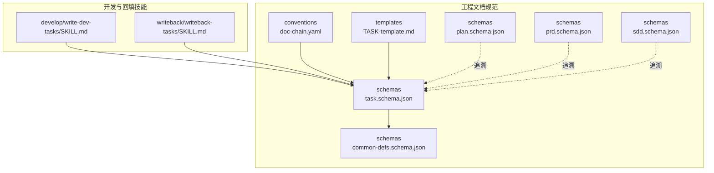
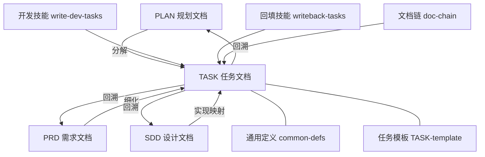
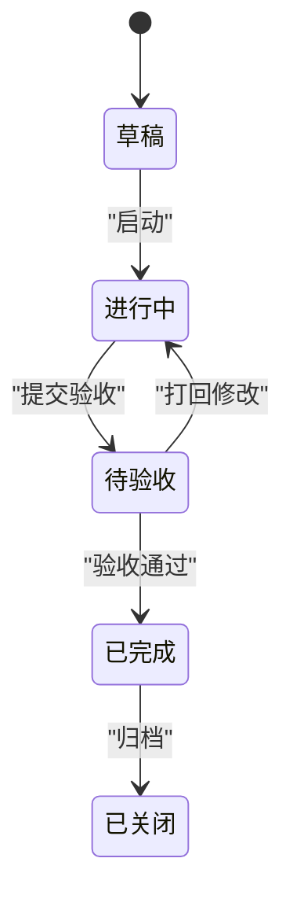
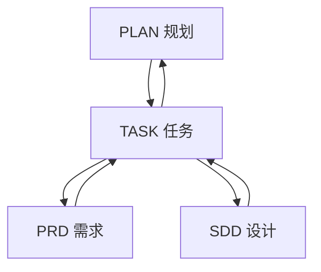
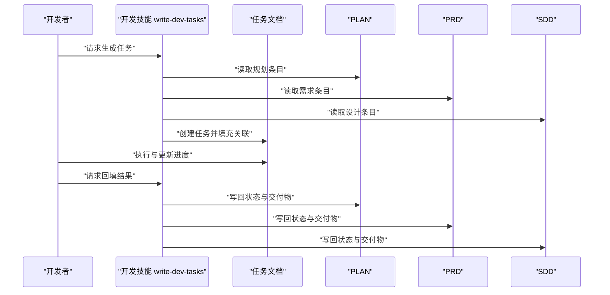
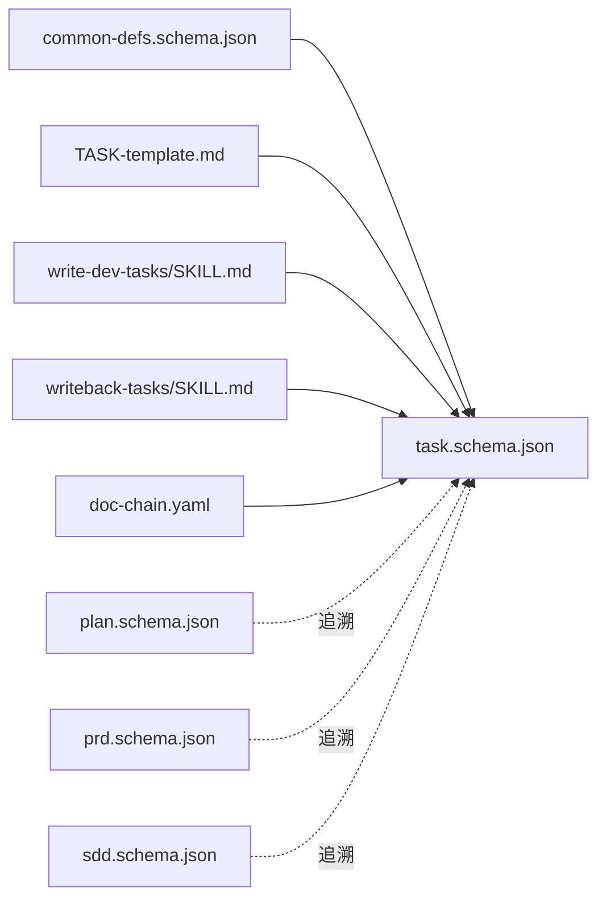

# TASK文档Schema

<cite>
**本文引用的文件**   
- [task.schema.json](file://skills/shared/engineering-docs/schemas/task.schema.json)
- [common-defs.schema.json](file://skills/shared/engineering-docs/schemas/common-defs.schema.json)
- [plan.schema.json](file://skills/shared/engineering-docs/schemas/plan.schema.json)
- [prd.schema.json](file://skills/shared/engineering-docs/schemas/prd.schema.json)
- [sdd.schema.json](file://skills/shared/engineering-docs/schemas/sdd.schema.json)
- [TASK-template.md](file://skills/shared/engineering-docs/templates/TASK-template.md)
- [write-dev-tasks/SKILL.md](file://skills/develop/write-dev-tasks/SKILL.md)
- [writeback-tasks/SKILL.md](file://skills/writeback/writeback-tasks/SKILL.md)
- [doc-chain.yaml](file://skills/shared/engineering-docs/conventions/doc-chain.yaml)
</cite>

## 目录
1. [简介](#简介)
2. [项目结构](#项目结构)
3. [核心组件](#核心组件)
4. [架构总览](#架构总览)
5. [详细组件分析](#详细组件分析)
6. [依赖关系分析](#依赖关系分析)
7. [性能与一致性考虑](#性能与一致性考虑)
8. [故障排查指南](#故障排查指南)
9. [结论](#结论)
10. [附录](#附录)

## 简介
本文件为“任务（TASK）”文档的Schema技术说明，面向产品、研发、质量与项目管理角色，系统化定义任务文档的结构规范、字段约束、状态流转、模板定制与批量操作方式，并阐明与PLAN、PRD、SDD等上层文档的追溯关系与数据一致性保障机制。目标是让团队在创建、维护与验证任务文档时具备统一标准与可执行依据。

## 项目结构
与TASK Schema相关的核心资源分布如下：
- Schema定义：位于工程文档规范的schemas目录下，包含任务Schema与通用定义。
- 模板：位于templates目录，提供可直接复用的任务模板。
- 技能与流程：位于develop与writeback目录，覆盖任务生成、回填与校验能力。
- 约定与追溯：conventions下定义文档链与命名约定，支撑跨文档追溯。

图表来源
- [task.schema.json](file://skills/shared/engineering-docs/schemas/task.schema.json)
- [common-defs.schema.json](file://skills/shared/engineering-docs/schemas/common-defs.schema.json)
- [plan.schema.json](file://skills/shared/engineering-docs/schemas/plan.schema.json)
- [prd.schema.json](file://skills/shared/engineering-docs/schemas/prd.schema.json)
- [sdd.schema.json](file://skills/shared/engineering-docs/schemas/sdd.schema.json)
- [doc-chain.yaml](file://skills/shared/engineering-docs/conventions/doc-chain.yaml)
- [TASK-template.md](file://skills/shared/engineering-docs/templates/TASK-template.md)
- [write-dev-tasks/SKILL.md](file://skills/develop/write-dev-tasks/SKILL.md)
- [writeback-tasks/SKILL.md](file://skills/writeback/writeback-tasks/SKILL.md)

章节来源
- [task.schema.json](file://skills/shared/engineering-docs/schemas/task.schema.json)
- [common-defs.schema.json](file://skills/shared/engineering-docs/schemas/common-defs.schema.json)
- [TASK-template.md](file://skills/shared/engineering-docs/templates/TASK-template.md)
- [write-dev-tasks/SKILL.md](file://skills/develop/write-dev-tasks/SKILL.md)
- [writeback-tasks/SKILL.md](file://skills/writeback/writeback-tasks/SKILL.md)
- [doc-chain.yaml](file://skills/shared/engineering-docs/conventions/doc-chain.yaml)

## 核心组件
- 任务Schema（task.schema.json）：定义任务文档的数据模型、必填字段、枚举值、格式与引用关系。
- 通用定义（common-defs.schema.json）：提供跨文档共享的类型、枚举与约束（如ID、时间戳、状态、优先级等）。
- 任务模板（TASK-template.md）：提供结构化骨架，便于快速创建与标准化填写。
- 开发技能（write-dev-tasks/SKILL.md）：指导如何基于上游文档生成任务清单与步骤。
- 回填技能（writeback-tasks/SKILL.md）：将任务执行结果写回至计划或需求文档，保证双向一致。
- 文档链约定（doc-chain.yaml）：明确PLAN→PRD→SDD→TASK的追溯路径与链接规范。

章节来源
- [task.schema.json](file://skills/shared/engineering-docs/schemas/task.schema.json)
- [common-defs.schema.json](file://skills/shared/engineering-docs/schemas/common-defs.schema.json)
- [TASK-template.md](file://skills/shared/engineering-docs/templates/TASK-template.md)
- [write-dev-tasks/SKILL.md](file://skills/develop/write-dev-tasks/SKILL.md)
- [writeback-tasks/SKILL.md](file://skills/writeback/writeback-tasks/SKILL.md)
- [doc-chain.yaml](file://skills/shared/engineering-docs/conventions/doc-chain.yaml)

## 架构总览
下图展示任务文档与其上下游文档的关系及关键交互点：

图表来源
- [plan.schema.json](file://skills/shared/engineering-docs/schemas/plan.schema.json)
- [prd.schema.json](file://skills/shared/engineering-docs/schemas/prd.schema.json)
- [sdd.schema.json](file://skills/shared/engineering-docs/schemas/sdd.schema.json)
- [task.schema.json](file://skills/shared/engineering-docs/schemas/task.schema.json)
- [common-defs.schema.json](file://skills/shared/engineering-docs/schemas/common-defs.schema.json)
- [TASK-template.md](file://skills/shared/engineering-docs/templates/TASK-template.md)
- [write-dev-tasks/SKILL.md](file://skills/develop/write-dev-tasks/SKILL.md)
- [writeback-tasks/SKILL.md](file://skills/writeback/writeback-tasks/SKILL.md)
- [doc-chain.yaml](file://skills/shared/engineering-docs/conventions/doc-chain.yaml)

## 详细组件分析

### 任务Schema字段与约束
- 标识与元信息
  - 任务ID：全局唯一，遵循命名与版本规则；用于与其他文档建立追溯链接。
  - 标题与描述：简明扼要，描述目标、范围与边界。
  - 标签与分类：支持多标签，便于检索与统计。
- 业务属性
  - 任务类型/分类：如功能、缺陷、优化、技术债等，受枚举约束。
  - 优先级：高/中/低或数值等级，需与团队策略一致。
  - 工作量估算：以人日/工时为单位，支持区间与备注。
  - 依赖关系：前置任务ID列表，形成有向无环图（DAG），避免循环依赖。
  - 关联文档：链接到PLAN、PRD、SDD中的具体条目，确保可追溯。
- 执行与进度
  - 状态：草稿、进行中、待验收、已完成、已关闭等，受状态机约束。
  - 负责人与协作方：责任人、评审人、测试人等。
  - 起止时间：计划开始/结束与实际开始/结束，用于度量与复盘。
  - 进度更新：里程碑、完成百分比、变更记录。
- 验收与交付
  - 验收标准：可量化、可验证的条件集合。
  - 交付物：代码分支、构建产物、文档链接等。
  - 风险与阻塞：记录风险项与阻塞原因，附缓解措施。
- 校验规则
  - 必填性：关键字段不可为空。
  - 格式：日期、时间戳、URL、ID格式校验。
  - 一致性：依赖ID必须存在且不构成环；关联文档ID必须在对应文档中存在。
  - 枚举值：类型、优先级、状态等取值受限。

章节来源
- [task.schema.json](file://skills/shared/engineering-docs/schemas/task.schema.json)
- [common-defs.schema.json](file://skills/shared/engineering-docs/schemas/common-defs.schema.json)

### 任务模板与示例
- 模板结构
  - 使用TASK-template.md作为基础骨架，按模块填充：基本信息、上下文、步骤、技术要求、验收标准、状态与进度、依赖与关联、风险与阻塞。
- 示例要点
  - 示例应体现从PLAN/PRD/SDD到TASK的逐层细化，包含明确的验收条件与可追踪的依赖。
  - 示例需演示状态变更与进度更新的记录方式。

章节来源
- [TASK-template.md](file://skills/shared/engineering-docs/templates/TASK-template.md)

### 任务分类、优先级与依赖
- 分类与优先级
  - 分类用于区分工作性质（功能/缺陷/优化/技术债等），优先级用于排序与排程。
  - 建议结合团队策略配置权重与阈值，并在模板中给出填写指引。
- 依赖关系
  - 通过前置任务ID建立依赖，系统应检测并阻止循环依赖。
  - 依赖变更需同步更新相关任务的计划时间与风险项。

章节来源
- [task.schema.json](file://skills/shared/engineering-docs/schemas/task.schema.json)
- [common-defs.schema.json](file://skills/shared/engineering-docs/schemas/common-defs.schema.json)

### 状态管理与流转
- 状态定义
  - 典型状态包括：草稿、进行中、待验收、已完成、已关闭。
  - 每个状态转换需满足前置条件（如验收标准达成、评审通过）。
- 流转规则
  - 仅允许符合预定义的路径进行状态切换，非法转换将被拒绝。
  - 状态变更需记录操作人、时间与原因。
- 可视化

图表来源
- [task.schema.json](file://skills/shared/engineering-docs/schemas/task.schema.json)
- [common-defs.schema.json](file://skills/shared/engineering-docs/schemas/common-defs.schema.json)

### 与PLAN、PRD、SDD的追溯关系
- 追溯方向
  - PLAN→TASK：计划目标分解为可执行任务。
  - PRD→TASK：需求条目细化为具体实现任务。
  - SDD→TASK：设计决策映射为技术实现任务。
- 一致性保障
  - 通过文档链约定与ID引用，确保任务与上游文档一一对应。
  - 变更影响分析：上游变更触发下游任务评估与调整。
- 可视化

图表来源
- [doc-chain.yaml](file://skills/shared/engineering-docs/conventions/doc-chain.yaml)
- [plan.schema.json](file://skills/shared/engineering-docs/schemas/plan.schema.json)
- [prd.schema.json](file://skills/shared/engineering-docs/schemas/prd.schema.json)
- [sdd.schema.json](file://skills/shared/engineering-docs/schemas/sdd.schema.json)
- [task.schema.json](file://skills/shared/engineering-docs/schemas/task.schema.json)

### 任务生成与回填流程
- 生成流程（基于上游文档）
  - 读取PLAN/PRD/SDD的关键条目。
  - 根据模板与Schema生成任务清单。
  - 自动填充关联ID、依赖与验收标准草案。
- 回填流程（执行结果写回）
  - 将任务状态、进度、交付物写回至上游文档。
  - 校验一致性并生成变更摘要。
- 时序示意

图表来源
- [write-dev-tasks/SKILL.md](file://skills/develop/write-dev-tasks/SKILL.md)
- [writeback-tasks/SKILL.md](file://skills/writeback/writeback-tasks/SKILL.md)
- [task.schema.json](file://skills/shared/engineering-docs/schemas/task.schema.json)

### 批量操作与模板定制
- 批量操作
  - 批量创建：基于模板与输入清单生成多个任务。
  - 批量更新：对一批任务的状态、负责人、截止日期进行统一调整。
  - 批量校验：运行Schema校验与依赖环检测，输出问题清单。
- 模板定制
  - 在模板中扩展自定义字段（如安全要求、合规检查）。
  - 通过通用定义扩展枚举与约束，保持跨文档一致性。
  - 结合文档链约定，确保新增字段不影响追溯链路。

章节来源
- [TASK-template.md](file://skills/shared/engineering-docs/templates/TASK-template.md)
- [common-defs.schema.json](file://skills/shared/engineering-docs/schemas/common-defs.schema.json)
- [doc-chain.yaml](file://skills/shared/engineering-docs/conventions/doc-chain.yaml)

## 依赖关系分析
- 组件耦合
  - 任务Schema依赖通用定义，确保类型与枚举一致。
  - 任务模板依赖Schema，保证生成的文档可被校验。
  - 开发/回填技能依赖Schema与模板，驱动自动化流程。
- 外部依赖
  - 上游文档（PLAN/PRD/SDD）通过ID与链接建立强关联。
  - 文档链约定提供统一的追溯规范。
- 潜在风险
  - 循环依赖：需在创建与更新时进行检测与阻断。
  - 不一致引用：需在上游变更时触发下游评估与修复。

图表来源
- [common-defs.schema.json](file://skills/shared/engineering-docs/schemas/common-defs.schema.json)
- [task.schema.json](file://skills/shared/engineering-docs/schemas/task.schema.json)
- [TASK-template.md](file://skills/shared/engineering-docs/templates/TASK-template.md)
- [write-dev-tasks/SKILL.md](file://skills/develop/write-dev-tasks/SKILL.md)
- [writeback-tasks/SKILL.md](file://skills/writeback/writeback-tasks/SKILL.md)
- [doc-chain.yaml](file://skills/shared/engineering-docs/conventions/doc-chain.yaml)
- [plan.schema.json](file://skills/shared/engineering-docs/schemas/plan.schema.json)
- [prd.schema.json](file://skills/shared/engineering-docs/schemas/prd.schema.json)
- [sdd.schema.json](file://skills/shared/engineering-docs/schemas/sdd.schema.json)

章节来源
- [task.schema.json](file://skills/shared/engineering-docs/schemas/task.schema.json)
- [common-defs.schema.json](file://skills/shared/engineering-docs/schemas/common-defs.schema.json)
- [doc-chain.yaml](file://skills/shared/engineering-docs/conventions/doc-chain.yaml)

## 性能与一致性考虑
- 性能
  - 批量操作应避免全量扫描，采用增量与索引策略提升效率。
  - 依赖环检测可使用拓扑排序算法，复杂度与任务数量线性相关。
- 一致性
  - 引入事务式回填：成功则全部写回，失败则回滚并提示。
  - 变更审计：记录所有状态与字段变更，便于追溯与复盘。
  - 冲突解决：当多人同时编辑同一任务时，采用合并策略与冲突提示。

[本节为通用指导，不直接分析具体文件]

## 故障排查指南
- 常见错误
  - 必填字段缺失：检查Schema必填项与模板占位符是否填写完整。
  - 枚举值非法：核对类型、优先级、状态的取值是否在定义范围内。
  - 依赖环：使用环检测工具定位并移除循环依赖。
  - 引用失效：校验关联文档ID是否存在于对应文档中。
- 诊断步骤
  - 运行Schema校验，获取错误清单。
  - 检查文档链约定，确认追溯链接正确。
  - 查看回填日志，定位写回失败的具体字段与原因。
  - 必要时回退到上一稳定版本并重试。

章节来源
- [task.schema.json](file://skills/shared/engineering-docs/schemas/task.schema.json)
- [common-defs.schema.json](file://skills/shared/engineering-docs/schemas/common-defs.schema.json)
- [doc-chain.yaml](file://skills/shared/engineering-docs/conventions/doc-chain.yaml)

## 结论
本技术文档明确了TASK文档的Schema结构与约束、状态流转机制、与PLAN/PRD/SDD的追溯关系，以及模板定制与批量操作的实践方法。通过统一的规范与自动化技能，团队可实现高质量的任务管理，保障端到端的一致性与可追溯性。

[本节为总结性内容，不直接分析具体文件]

## 附录
- 术语表
  - 任务：最小可执行的工作单元，具有明确的目标、步骤与验收标准。
  - 追溯：通过ID与链接将任务与上游文档建立对应关系。
  - 回填：将任务执行结果写回至上游文档，保持双向一致。
- 参考路径
  - Schema与模板：见“项目结构”部分所列文件路径。
  - 技能与流程：见“详细组件分析”部分所列文件路径。

[本节为补充信息，不直接分析具体文件]