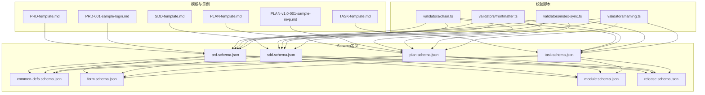
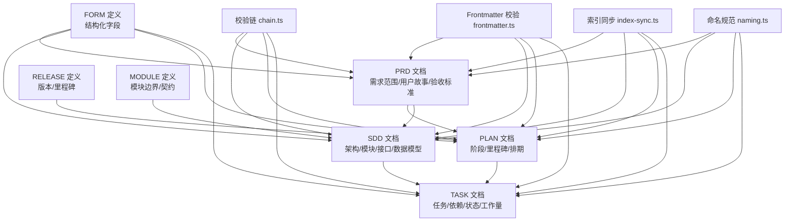
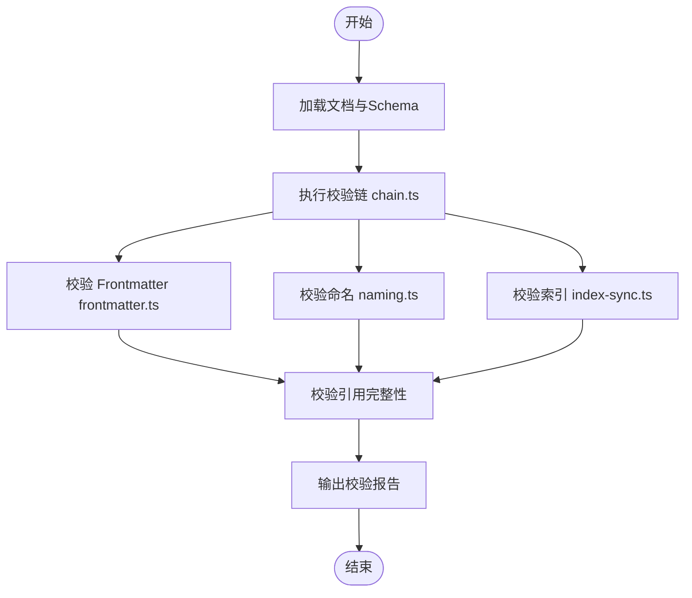

# 业务文档Schema

<cite>
**本文引用的文件**   
- [pr d.schema.json](file://skills/shared/engineering-docs/schemas/prd.schema.json)
- [sdd.schema.json](file://skills/shared/engineering-docs/schemas/sdd.schema.json)
- [plan.schema.json](file://skills/shared/engineering-docs/schemas/plan.schema.json)
- [task.schema.json](file://skills/shared/engineering-docs/schemas/task.schema.json)
- [common-defs.schema.json](file://skills/shared/engineering-docs/schemas/common-defs.schema.json)
- [form.schema.json](file://skills/shared/engineering-docs/schemas/form.schema.json)
- [module.schema.json](file://skills/shared/engineering-docs/schemas/module.schema.json)
- [release.schema.json](file://skills/shared/engineering-docs/schemas/release.schema.json)
- [chain.ts](file://skills/shared/engineering-docs/scripts/src/validators/chain.ts)
- [frontmatter.ts](file://skills/shared/engineering-docs/scripts/src/validators/frontmatter.ts)
- [index-sync.ts](file://skills/shared/engineering-docs/scripts/src/validators/index-sync.ts)
- [naming.ts](file://skills/shared/engineering-docs/scripts/src/validators/naming.ts)
- [PRD模板](file://skills/shared/engineering-docs/templates/PRD-template.md)
- [SDD模板](file://skills/shared/engineering-docs/templates/SDD-template.md)
- [PLAN模板](file://skills/shared/engineering-docs/templates/PLAN-template.md)
- [TASK模板](file://skills/shared/engineering-docs/templates/TASK-template.md)
- [示例 PRD](file://skills/shared/engineering-docs/examples/PRD-001-sample-login.md)
- [示例 PLAN](file://skills/shared/engineering-docs/examples/PLAN-v1.0-001-sample-mvp.md)
</cite>

## 目录
1. [简介](#简介)
2. [项目结构](#项目结构)
3. [核心组件](#核心组件)
4. [架构总览](#架构总览)
5. [详细组件分析](#详细组件分析)
6. [依赖关系分析](#依赖关系分析)
7. [性能与可扩展性](#性能与可扩展性)
8. [故障排查指南](#故障排查指南)
9. [结论](#结论)
10. [附录](#附录)

## 简介
本技术文档面向“业务文档Schema”的规范与实现，覆盖四类核心文档：PRD（产品需求文档）、SDD（系统设计文档）、PLAN（项目计划）和 TASK（任务文档）。文档目标包括：
- 明确每类文档的Schema结构与字段定义
- 说明嵌套结构、关联关系与业务约束
- 提供数据类型、必填项与验证规则
- 给出实际业务场景示例与最佳实践
- 解释文档间的依赖关系与数据流转
- 提供Schema验证错误排查与调试指南

## 项目结构
工程将Schema定义、模板、示例与校验脚本集中管理，便于统一治理与自动化校验。关键路径如下：
- Schema定义：skills/shared/engineering-docs/schemas/*.schema.json
- 模板：skills/shared/engineering-docs/templates/*-template.md
- 示例：skills/shared/engineering-docs/examples/*-sample-*.md
- 校验脚本：skills/shared/engineering-docs/scripts/src/validators/*.ts

图表来源
- [pr d.schema.json](file://skills/shared/engineering-docs/schemas/prd.schema.json)
- [sdd.schema.json](file://skills/shared/engineering-docs/schemas/sdd.schema.json)
- [plan.schema.json](file://skills/shared/engineering-docs/schemas/plan.schema.json)
- [task.schema.json](file://skills/shared/engineering-docs/schemas/task.schema.json)
- [common-defs.schema.json](file://skills/shared/engineering-docs/schemas/common-defs.schema.json)
- [form.schema.json](file://skills/shared/engineering-docs/schemas/form.schema.json)
- [module.schema.json](file://skills/shared/engineering-docs/schemas/module.schema.json)
- [release.schema.json](file://skills/shared/engineering-docs/schemas/release.schema.json)
- [chain.ts](file://skills/shared/engineering-docs/scripts/src/validators/chain.ts)
- [frontmatter.ts](file://skills/shared/engineering-docs/scripts/src/validators/frontmatter.ts)
- [index-sync.ts](file://skills/shared/engineering-docs/scripts/src/validators/index-sync.ts)
- [naming.ts](file://skills/shared/engineering-docs/scripts/src/validators/naming.ts)
- [PRD模板](file://skills/shared/engineering-docs/templates/PRD-template.md)
- [SDD模板](file://skills/shared/engineering-docs/templates/SDD-template.md)
- [PLAN模板](file://skills/shared/engineering-docs/templates/PLAN-template.md)
- [TASK模板](file://skills/shared/engineering-docs/templates/TASK-template.md)
- [示例 PRD](file://skills/shared/engineering-docs/examples/PRD-001-sample-login.md)
- [示例 PLAN](file://skills/shared/engineering-docs/examples/PLAN-v1.0-001-sample-mvp.md)

章节来源
- [pr d.schema.json](file://skills/shared/engineering-docs/schemas/prd.schema.json)
- [sdd.schema.json](file://skills/shared/engineering-docs/schemas/sdd.schema.json)
- [plan.schema.json](file://skills/shared/engineering-docs/schemas/plan.schema.json)
- [task.schema.json](file://skills/shared/engineering-docs/schemas/task.schema.json)
- [common-defs.schema.json](file://skills/shared/engineering-docs/schemas/common-defs.schema.json)
- [form.schema.json](file://skills/shared/engineering-docs/schemas/form.schema.json)
- [module.schema.json](file://skills/shared/engineering-docs/schemas/module.schema.json)
- [release.schema.json](file://skills/shared/engineering-docs/schemas/release.schema.json)
- [chain.ts](file://skills/shared/engineering-docs/scripts/src/validators/chain.ts)
- [frontmatter.ts](file://skills/shared/engineering-docs/scripts/src/validators/frontmatter.ts)
- [index-sync.ts](file://skills/shared/engineering-docs/scripts/src/validators/index-sync.ts)
- [naming.ts](file://skills/shared/engineering-docs/scripts/src/validators/naming.ts)
- [PRD模板](file://skills/shared/engineering-docs/templates/PRD-template.md)
- [SDD模板](file://skills/shared/engineering-docs/templates/SDD-template.md)
- [PLAN模板](file://skills/shared/engineering-docs/templates/PLAN-template.md)
- [TASK模板](file://skills/shared/engineering-docs/templates/TASK-template.md)
- [示例 PRD](file://skills/shared/engineering-docs/examples/PRD-001-sample-login.md)
- [示例 PLAN](file://skills/shared/engineering-docs/examples/PLAN-v1.0-001-sample-mvp.md)

## 核心组件
- 公共定义（common-defs.schema.json）：为所有文档类型共享的基础类型、枚举、ID命名、时间格式等通用约束。
- 表单定义（form.schema.json）：用于结构化输入/输出的表单化字段集合，被PRD/SDD/PLAN/TASK复用。
- 模块定义（module.schema.json）：描述系统或产品的功能模块边界、职责与接口契约，供SDD与PRD引用。
- 发布定义（release.schema.json）：版本发布元数据与里程碑，供PLAN与跨文档追溯使用。
- 文档Schema：
  - PRD（pr d.schema.json）：产品需求范围、用户故事、验收标准、非功能需求、风险与依赖。
  - SDD（sdd.schema.json）：系统架构、模块划分、接口设计、数据模型、部署与非功能指标。
  - PLAN（plan.schema.json）：项目阶段、里程碑、资源与排期、风险与回滚策略。
  - TASK（task.schema.json）：可执行任务粒度、前置依赖、验收条件、工作量与状态流转。

章节来源
- [common-defs.schema.json](file://skills/shared/engineering-docs/schemas/common-defs.schema.json)
- [form.schema.json](file://skills/shared/engineering-docs/schemas/form.schema.json)
- [module.schema.json](file://skills/shared/engineering-docs/schemas/module.schema.json)
- [release.schema.json](file://skills/shared/engineering-docs/schemas/release.schema.json)
- [pr d.schema.json](file://skills/shared/engineering-docs/schemas/prd.schema.json)
- [sdd.schema.json](file://skills/shared/engineering-docs/schemas/sdd.schema.json)
- [plan.schema.json](file://skills/shared/engineering-docs/schemas/plan.schema.json)
- [task.schema.json](file://skills/shared/engineering-docs/schemas/task.schema.json)

## 架构总览
下图展示四类文档之间的依赖与数据流转关系，以及校验器如何参与端到端一致性保障。

图表来源
- [pr d.schema.json](file://skills/shared/engineering-docs/schemas/prd.schema.json)
- [sdd.schema.json](file://skills/shared/engineering-docs/schemas/sdd.schema.json)
- [plan.schema.json](file://skills/shared/engineering-docs/schemas/plan.schema.json)
- [task.schema.json](file://skills/shared/engineering-docs/schemas/task.schema.json)
- [common-defs.schema.json](file://skills/shared/engineering-docs/schemas/common-defs.schema.json)
- [form.schema.json](file://skills/shared/engineering-docs/schemas/form.schema.json)
- [module.schema.json](file://skills/shared/engineering-docs/schemas/module.schema.json)
- [release.schema.json](file://skills/shared/engineering-docs/schemas/release.schema.json)
- [chain.ts](file://skills/shared/engineering-docs/scripts/src/validators/chain.ts)
- [frontmatter.ts](file://skills/shared/engineering-docs/scripts/src/validators/frontmatter.ts)
- [index-sync.ts](file://skills/shared/engineering-docs/scripts/src/validators/index-sync.ts)
- [naming.ts](file://skills/shared/engineering-docs/scripts/src/validators/naming.ts)

## 详细组件分析

### PRD（产品需求文档）Schema
- 核心字段类别
  - 标识与元数据：文档ID、标题、版本、作者、创建/更新时间、标签、状态等
  - 背景与目标：问题陈述、业务目标、成功度量
  - 范围与边界：包含/不包含内容、假设与约束
  - 用户与角色：目标用户画像、角色权限
  - 需求条目：功能需求、非功能需求、用户体验要求
  - 验收标准：用例、测试要点、验收门槛
  - 风险与依赖：外部依赖、风险清单与缓解措施
  - 关联引用：链接到SDD、PLAN、TASK、RELEASE、MODULE等
- 嵌套结构
  - 通过FORM定义的结构化字段组合，支持多段式需求组织
  - 通过MODULE定义进行模块级需求映射
  - 通过RELEASE定义对齐发布节奏
- 关联关系
  - PRD -> SDD：需求到设计的追溯
  - PRD -> PLAN：需求到计划的分解
  - PRD -> TASK：需求到任务的细化
- 业务约束与验证
  - 必填项：文档ID、标题、版本、作者、状态、关联引用等
  - 命名规范：遵循命名约定（见命名校验）
  - 引用完整性：确保关联文档存在且版本一致
  - 时间格式：统一ISO时间格式
- 示例参考
  - 参见示例PRD以了解典型结构与字段填充方式

章节来源
- [pr d.schema.json](file://skills/shared/engineering-docs/schemas/prd.schema.json)
- [form.schema.json](file://skills/shared/engineering-docs/schemas/form.schema.json)
- [module.schema.json](file://skills/shared/engineering-docs/schemas/module.schema.json)
- [release.schema.json](file://skills/shared/engineering-docs/schemas/release.schema.json)
- [common-defs.schema.json](file://skills/shared/engineering-docs/schemas/common-defs.schema.json)
- [PRD模板](file://skills/shared/engineering-docs/templates/PRD-template.md)
- [示例 PRD](file://skills/shared/engineering-docs/examples/PRD-001-sample-login.md)

### SDD（系统设计文档）Schema
- 核心字段类别
  - 标识与元数据：文档ID、标题、版本、作者、创建/更新时间、标签、状态
  - 架构概览：总体架构图、分层与边界
  - 模块设计：模块职责、接口契约、数据模型
  - 非功能设计：性能、可用性、安全性、扩展性
  - 部署与运维：环境、配置、监控与告警
  - 变更与演进：兼容性策略、迁移方案
  - 关联引用：链接到PRD、PLAN、TASK、RELEASE、MODULE等
- 嵌套结构
  - 通过MODULE定义系统化描述模块边界与契约
  - 通过FORM定义结构化记录接口与数据模型
  - 通过RELEASE定义对齐版本演进
- 关联关系
  - SDD <- PRD：承接需求并转化为设计
  - SDD -> TASK：设计到任务的落地
  - SDD -> RELEASE：设计与发布节奏对齐
- 业务约束与验证
  - 必填项：文档ID、标题、版本、作者、状态、模块清单、接口清单
  - 命名规范：模块名、接口名、数据模型名需符合约定
  - 引用完整性：确保模块与接口在MODULE定义中注册
- 示例参考
  - 参见SDD模板了解典型结构与字段填充方式

章节来源
- [sdd.schema.json](file://skills/shared/engineering-docs/schemas/sdd.schema.json)
- [module.schema.json](file://skills/shared/engineering-docs/schemas/module.schema.json)
- [form.schema.json](file://skills/shared/engineering-docs/schemas/form.schema.json)
- [release.schema.json](file://skills/shared/engineering-docs/schemas/release.schema.json)
- [common-defs.schema.json](file://skills/shared/engineering-docs/schemas/common-defs.schema.json)
- [SDD模板](file://skills/shared/engineering-docs/templates/SDD-template.md)

### PLAN（项目计划）Schema
- 核心字段类别
  - 标识与元数据：文档ID、标题、版本、作者、创建/更新时间、标签、状态
  - 范围与目标：项目范围、目标与成功指标
  - 阶段与里程碑：阶段划分、关键里程碑、交付物
  - 资源与排期：人员、工具、时间线
  - 风险与回滚：风险识别、应对策略、回滚预案
  - 关联引用：链接到PRD、SDD、TASK、RELEASE等
- 嵌套结构
  - 通过FORM定义结构化阶段与里程碑条目
  - 通过RELEASE定义版本与里程碑对齐
- 关联关系
  - PLAN <- PRD：从需求分解到计划
  - PLAN <- SDD：依据设计确定实施路径
  - PLAN -> TASK：计划到任务分解
- 业务约束与验证
  - 必填项：文档ID、标题、版本、作者、状态、里程碑清单、资源清单
  - 时间约束：里程碑日期顺序合理、不冲突
  - 引用完整性：确保关联的PRD/SDD/TASK存在且版本匹配
- 示例参考
  - 参见示例PLAN以了解典型结构与字段填充方式

章节来源
- [plan.schema.json](file://skills/shared/engineering-docs/schemas/plan.schema.json)
- [form.schema.json](file://skills/shared/engineering-docs/schemas/form.schema.json)
- [release.schema.json](file://skills/shared/engineering-docs/schemas/release.schema.json)
- [common-defs.schema.json](file://skills/shared/engineering-docs/schemas/common-defs.schema.json)
- [PLAN模板](file://skills/shared/engineering-docs/templates/PLAN-template.md)
- [示例 PLAN](file://skills/shared/engineering-docs/examples/PLAN-v1.0-001-sample-mvp.md)

### TASK（任务文档）Schema
- 核心字段类别
  - 标识与元数据：文档ID、标题、版本、作者、创建/更新时间、标签、状态
  - 任务描述：目标、范围、验收标准
  - 依赖与前置：前置任务、外部依赖
  - 工作量与排期：预估工时、开始/结束时间
  - 关联引用：链接到PRD、SDD、PLAN、RELEASE等
- 嵌套结构
  - 通过FORM定义结构化任务条目与检查点
  - 通过RELEASE定义任务与版本对齐
- 关联关系
  - TASK <- PLAN：从计划分解到具体任务
  - TASK <- SDD：依据设计落实实现细节
  - TASK <- PRD：满足需求验收
- 业务约束与验证
  - 必填项：文档ID、标题、版本、作者、状态、依赖清单、验收标准
  - 依赖闭环：无循环依赖、前置任务已完成
  - 命名规范：任务ID与标题符合约定
- 示例参考
  - 参见TASK模板了解典型结构与字段填充方式

章节来源
- [task.schema.json](file://skills/shared/engineering-docs/schemas/task.schema.json)
- [form.schema.json](file://skills/shared/engineering-docs/schemas/form.schema.json)
- [release.schema.json](file://skills/shared/engineering-docs/schemas/release.schema.json)
- [common-defs.schema.json](file://skills/shared/engineering-docs/schemas/common-defs.schema.json)
- [TASK模板](file://skills/shared/engineering-docs/templates/TASK-template.md)

### 公共定义与复用组件
- common-defs.schema.json
  - 提供统一的ID生成规则、时间格式、枚举值、基础校验规则
- form.schema.json
  - 提供可复用的表单字段类型与校验规则，减少重复定义
- module.schema.json
  - 提供模块边界与契约的标准描述，支撑SDD与PRD的模块化组织
- release.schema.json
  - 提供版本与里程碑的统一描述，支撑PLAN与各文档的版本对齐

章节来源
- [common-defs.schema.json](file://skills/shared/engineering-docs/schemas/common-defs.schema.json)
- [form.schema.json](file://skills/shared/engineering-docs/schemas/form.schema.json)
- [module.schema.json](file://skills/shared/engineering-docs/schemas/module.schema.json)
- [release.schema.json](file://skills/shared/engineering-docs/schemas/release.schema.json)

## 依赖关系分析
- 文档间依赖
  - PRD驱动SDD与PLAN；SDD与PLAN共同驱动TASK
  - RELEASE贯穿各文档，保证版本一致性
  - MODULE作为SDD的核心构件，影响PRD的范围与TASK的实现
- 校验器依赖
  - chain.ts串联多个校验步骤，形成端到端一致性保障
  - frontmatter.ts负责文档头信息校验
  - index-sync.ts确保索引与文档的一致性
  - naming.ts强制执行命名规范

图表来源
- [chain.ts](file://skills/shared/engineering-docs/scripts/src/validators/chain.ts)
- [frontmatter.ts](file://skills/shared/engineering-docs/scripts/src/validators/frontmatter.ts)
- [index-sync.ts](file://skills/shared/engineering-docs/scripts/src/validators/index-sync.ts)
- [naming.ts](file://skills/shared/engineering-docs/scripts/src/validators/naming.ts)

章节来源
- [chain.ts](file://skills/shared/engineering-docs/scripts/src/validators/chain.ts)
- [frontmatter.ts](file://skills/shared/engineering-docs/scripts/src/validators/frontmatter.ts)
- [index-sync.ts](file://skills/shared/engineering-docs/scripts/src/validators/index-sync.ts)
- [naming.ts](file://skills/shared/engineering-docs/scripts/src/validators/naming.ts)

## 性能与可扩展性
- 性能考虑
  - 批量校验：对大量文档采用并行校验以提升吞吐
  - 增量校验：仅对变更文档与受影响依赖进行重校验
  - 缓存机制：对公共定义与命名规则结果进行缓存
- 可扩展性
  - 新增文档类型：基于common-defs与form扩展新Schema，并在chain中注册校验步骤
  - 自定义校验：通过插件化方式扩展命名、引用、时序等业务校验
  - 模板与示例：为新文档类型提供模板与示例，降低上手成本

[本节为通用指导，无需特定文件来源]

## 故障排查指南
- 常见错误类型
  - 必填项缺失：检查文档ID、标题、版本、作者、状态等必填字段
  - 命名不规范：对照命名规范修正ID与标题格式
  - 引用不完整：确保所有关联文档存在且版本匹配
  - 时间格式错误：统一使用ISO时间格式
  - 索引不一致：更新索引以反映最新文档状态
- 定位方法
  - 查看校验链输出：根据chain.ts的错误分类快速定位问题域
  - 检查Frontmatter：确认文档头信息与Schema一致
  - 核对命名规则：使用naming.ts的规则逐项比对
  - 同步索引：运行index-sync.ts修复索引差异
- 调试建议
  - 分步执行：先单独运行frontmatter、naming、index-sync，再整体运行chain
  - 最小集验证：选取最小文档集进行回归验证
  - 日志增强：在关键校验点增加上下文日志，便于追踪

章节来源
- [chain.ts](file://skills/shared/engineering-docs/scripts/src/validators/chain.ts)
- [frontmatter.ts](file://skills/shared/engineering-docs/scripts/src/validators/frontmatter.ts)
- [index-sync.ts](file://skills/shared/engineering-docs/scripts/src/validators/index-sync.ts)
- [naming.ts](file://skills/shared/engineering-docs/scripts/src/validators/naming.ts)

## 结论
本技术文档系统化梳理了PRD、SDD、PLAN、TASK四类业务文档的Schema结构、字段定义、关联关系与验证规则，并通过模板与示例提供了落地指引。借助公共定义与校验链，团队可实现文档的一致性与可追溯性，提升协作效率与质量。

[本节为总结性内容，无需特定文件来源]

## 附录
- 最佳实践
  - 以PRD为起点，逐步分解到SDD、PLAN与TASK，保持单向依赖
  - 使用MODULE与RELEASE统一模块与版本语义
  - 在文档中显式标注关联引用，便于自动化校验与追溯
  - 定期运行校验链，尽早发现并修复问题
- 参考模板与示例
  - PRD模板与示例：参见PRD模板与示例PRD
  - SDD模板：参见SDD模板
  - PLAN模板与示例：参见PLAN模板与示例PLAN
  - TASK模板：参见TASK模板

章节来源
- [PRD模板](file://skills/shared/engineering-docs/templates/PRD-template.md)
- [SDD模板](file://skills/shared/engineering-docs/templates/SDD-template.md)
- [PLAN模板](file://skills/shared/engineering-docs/templates/PLAN-template.md)
- [TASK模板](file://skills/shared/engineering-docs/templates/TASK-template.md)
- [示例 PRD](file://skills/shared/engineering-docs/examples/PRD-001-sample-login.md)
- [示例 PLAN](file://skills/shared/engineering-docs/examples/PLAN-v1.0-001-sample-mvp.md)