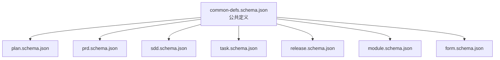
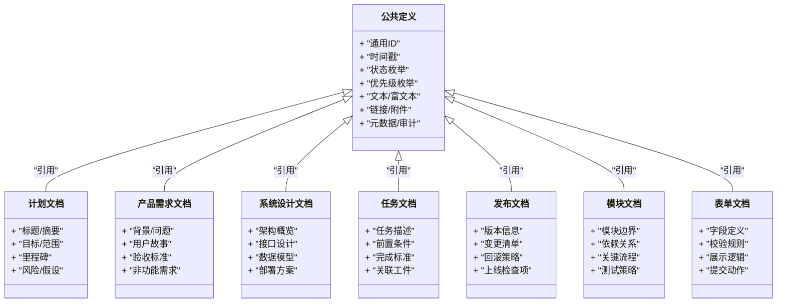
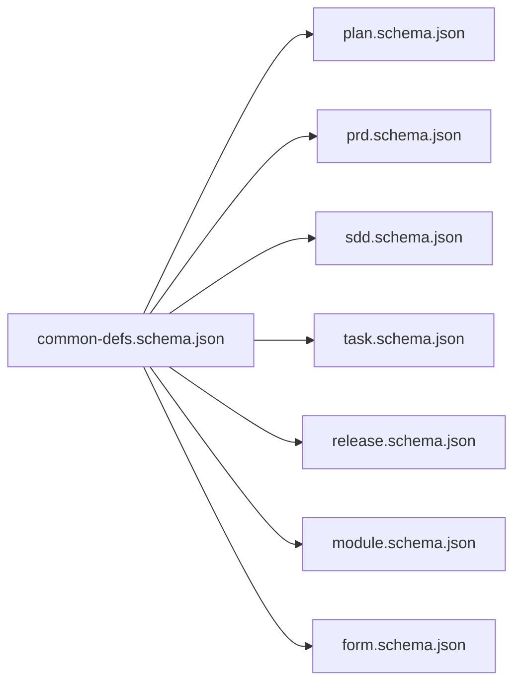

# 公共定义Schema

<cite>
**本文引用的文件**   
- [common-defs.schema.json](file://skills/shared/engineering-docs/schemas/common-defs.schema.json)
- [plan.schema.json](file://skills/shared/engineering-docs/schemas/plan.schema.json)
- [prd.schema.json](file://skills/shared/engineering-docs/schemas/prd.schema.json)
- [sdd.schema.json](file://skills/shared/engineering-docs/schemas/sdd.schema.json)
- [task.schema.json](file://skills/shared/engineering-docs/schemas/task.schema.json)
- [release.schema.json](file://skills/shared/engineering-docs/schemas/release.schema.json)
- [module.schema.json](file://skills/shared/engineering-docs/schemas/module.schema.json)
- [form.schema.json](file://skills/shared/engineering-docs/schemas/form.schema.json)
</cite>

## 目录
1. [简介](#简介)
2. [项目结构](#项目结构)
3. [核心组件](#核心组件)
4. [架构总览](#架构总览)
5. [详细组件分析](#详细组件分析)
6. [依赖关系分析](#依赖关系分析)
7. [性能与一致性考虑](#性能与一致性考虑)
8. [故障排查指南](#故障排查指南)
9. [结论](#结论)
10. [附录](#附录)

## 简介
本技术文档聚焦于工程文档体系中的“公共定义Schema”，即 common-defs.schema.json。该文件集中定义了跨多个文档类型共享的数据模型、枚举值、引用类型以及基础验证规则，例如：
- 通用标识符（ID）生成与约束
- 时间戳格式与时区约定
- 状态与优先级等枚举值
- 文本、富文本、链接、附件等基础字段类型
- 元数据与审计字段（创建/更新时间、作者等）

这些公共定义被 plan、prd、sdd、task、release、module、form 等文档Schema复用，确保全仓库的文档在结构与语义上保持一致，便于工具链校验、渲染与自动化处理。

## 项目结构
工程文档相关的Schema位于 skills/shared/engineering-docs/schemas 目录下，其中 common-defs.schema.json 为所有其他Schema的基础依赖。各业务文档Schema通过 $ref 引用公共定义，形成“单一事实来源”的复用模式。

图表来源
- [common-defs.schema.json](file://skills/shared/engineering-docs/schemas/common-defs.schema.json)
- [plan.schema.json](file://skills/shared/engineering-docs/schemas/plan.schema.json)
- [prd.schema.json](file://skills/shared/engineering-docs/schemas/prd.schema.json)
- [sdd.schema.json](file://skills/shared/engineering-docs/schemas/sdd.schema.json)
- [task.schema.json](file://skills/shared/engineering-docs/schemas/task.schema.json)
- [release.schema.json](file://skills/shared/engineering-docs/schemas/release.schema.json)
- [module.schema.json](file://skills/shared/engineering-docs/schemas/module.schema.json)
- [form.schema.json](file://skills/shared/engineering-docs/schemas/form.schema.json)

章节来源
- [common-defs.schema.json](file://skills/shared/engineering-docs/schemas/common-defs.schema.json)
- [plan.schema.json](file://skills/shared/engineering-docs/schemas/plan.schema.json)
- [prd.schema.json](file://skills/shared/engineering-docs/schemas/prd.schema.json)
- [sdd.schema.json](file://skills/shared/engineering-docs/schemas/sdd.schema.json)
- [task.schema.json](file://skills/shared/engineering-docs/schemas/task.schema.json)
- [release.schema.json](file://skills/shared/engineering-docs/schemas/release.schema.json)
- [module.schema.json](file://skills/shared/engineering-docs/schemas/module.schema.json)
- [form.schema.json](file://skills/shared/engineering-docs/schemas/form.schema.json)

## 核心组件
本节概述公共定义中常见的核心概念与字段族。由于具体键名以实际Schema为准，以下描述基于常见工程文档实践与Schema复用的典型模式进行说明。

- 标识符（ID）
  - 唯一性：全局或领域内唯一
  - 稳定性：不随内容变更而改变
  - 可读性：建议包含可识别前缀或分段信息（如模块/版本/序号）
  - 生成策略：由工具链或命名规范保证，避免手工拼接错误
- 时间戳
  - 统一使用ISO 8601格式（含时区偏移或Z）
  - 区分创建时间与更新时间，便于审计与排序
- 状态与优先级
  - 状态：用于表达文档或任务的生命周期阶段（如草稿、评审中、已发布等）
  - 优先级：用于表达重要程度或排期顺序（如高、中、低）
- 文本与富文本
  - 纯文本：适用于简短描述、标签等
  - 富文本：支持Markdown或结构化片段，用于正文内容
- 链接与附件
  - 链接：URL、相对路径、锚点等
  - 附件：文件路径、哈希、大小、类型等
- 元数据与审计
  - 作者、维护者、版本、变更记录、标签等
  - 标准化字段便于检索、统计与可视化

章节来源
- [common-defs.schema.json](file://skills/shared/engineering-docs/schemas/common-defs.schema.json)

## 架构总览
下图展示了公共定义在各文档Schema中的引用关系与职责边界。

图表来源
- [common-defs.schema.json](file://skills/shared/engineering-docs/schemas/common-defs.schema.json)
- [plan.schema.json](file://skills/shared/engineering-docs/schemas/plan.schema.json)
- [prd.schema.json](file://skills/shared/engineering-docs/schemas/prd.schema.json)
- [sdd.schema.json](file://skills/shared/engineering-docs/schemas/sdd.schema.json)
- [task.schema.json](file://skills/shared/engineering-docs/schemas/task.schema.json)
- [release.schema.json](file://skills/shared/engineering-docs/schemas/release.schema.json)
- [module.schema.json](file://skills/shared/engineering-docs/schemas/module.schema.json)
- [form.schema.json](file://skills/shared/engineering-docs/schemas/form.schema.json)

## 详细组件分析

### 公共数据类型与字段族
- 标识符（ID）
  - 用途：作为文档或实体的稳定主键
  - 约束：唯一、不可变、可读性强
  - 示例用法：在任务、计划、发布等文档中作为主键引用
- 时间戳
  - 用途：记录创建、更新、生效、过期等时间点
  - 约束：ISO 8601；必要时包含时区
  - 示例用法：在审计字段、版本历史中使用
- 状态与优先级
  - 用途：表达生命周期与重要性
  - 约束：限定取值集合，避免自由文本
  - 示例用法：任务状态、需求优先级、发布阶段
- 文本与富文本
  - 用途：承载人类可读的内容
  - 约束：长度限制、字符集、安全过滤（富文本）
  - 示例用法：需求描述、设计说明、任务说明
- 链接与附件
  - 用途：指向外部资源或本地工件
  - 约束：URL合法性、路径存在性、大小限制
  - 示例用法：参考文档、设计图、测试报告
- 元数据与审计
  - 用途：记录作者、版本、变更记录、标签等
  - 约束：必填/可选、格式校验、权限控制
  - 示例用法：文档头部的元信息、变更记录表

章节来源
- [common-defs.schema.json](file://skills/shared/engineering-docs/schemas/common-defs.schema.json)

### 在各文档Schema中的使用示例
- 计划文档（plan.schema.json）
  - 使用公共ID作为计划主键
  - 使用状态表示计划阶段（如规划中、执行中、已完成）
  - 使用优先级对子目标进行排序
  - 使用时间戳记录里程碑日期
- 产品需求文档（prd.schema.json）
  - 使用公共ID作为需求条目主键
  - 使用状态跟踪需求生命周期（如待评审、已批准、已实现）
  - 使用优先级指导迭代排期
  - 使用富文本承载用户故事与验收标准
- 系统设计文档（sdd.schema.json）
  - 使用公共ID标识子系统或接口
  - 使用状态管理设计版本（如草案、评审通过、已归档）
  - 使用链接引用架构图与API契约
- 任务文档（task.schema.json）
  - 使用公共ID作为任务主键
  - 使用状态跟踪开发进度（如进行中、待测试、已关闭）
  - 使用优先级决定工作顺序
  - 使用时间戳记录开始/结束时间
- 发布文档（release.schema.json）
  - 使用公共ID作为发布批次主键
  - 使用状态管理发布阶段（如预发、灰度、全量）
  - 使用时间戳记录发布时间窗口
  - 使用附件上传发布说明与回滚脚本
- 模块文档（module.schema.json）
  - 使用公共ID标识模块
  - 使用状态管理模块成熟度（如实验、稳定、废弃）
  - 使用链接引用代码仓库与测试覆盖率
- 表单文档（form.schema.json）
  - 使用公共ID作为表单定义主键
  - 使用状态管理表单版本（如草稿、已发布、已下线）
  - 使用字段类型映射到公共文本/富文本/链接等类型

章节来源
- [plan.schema.json](file://skills/shared/engineering-docs/schemas/plan.schema.json)
- [prd.schema.json](file://skills/shared/engineering-docs/schemas/prd.schema.json)
- [sdd.schema.json](file://skills/shared/engineering-docs/schemas/sdd.schema.json)
- [task.schema.json](file://skills/shared/engineering-docs/schemas/task.schema.json)
- [release.schema.json](file://skills/shared/engineering-docs/schemas/release.schema.json)
- [module.schema.json](file://skills/shared/engineering-docs/schemas/module.schema.json)
- [form.schema.json](file://skills/shared/engineering-docs/schemas/form.schema.json)

### 扩展与自定义公共定义
当需要满足特定业务需求时，建议遵循以下原则扩展公共定义：
- 新增枚举值
  - 在公共定义中新增枚举成员，并明确其含义与适用场景
  - 在各文档Schema中仅允许使用已定义的枚举值
- 新增字段类型
  - 在公共定义中声明新的基础类型或复合类型
  - 提供默认值、必填性与长度/格式约束
- 新增引用类型
  - 通过$ref引入已有类型组合，保持复用与一致性
- 向后兼容
  - 新增字段默认可选，避免破坏现有文档
  - 对必填字段采用渐进式策略，先软校验再硬校验
- 文档化变更
  - 在变更记录中说明新增/废弃的字段与行为变化
  - 提供迁移指南与示例

章节来源
- [common-defs.schema.json](file://skills/shared/engineering-docs/schemas/common-defs.schema.json)

### 字段类型映射与验证规则说明
以下为常见字段类型的映射与验证要点（具体键名以实际Schema为准）：
- 字符串类
  - 用途：名称、描述、标签
  - 验证：非空、最大长度、正则表达式（如邮箱、URL）
- 数值类
  - 用途：评分、阈值、计数
  - 验证：最小/最大值、整数/小数精度
- 布尔类
  - 用途：开关、标志位
  - 验证：仅允许true/false
- 数组类
  - 用途：标签列表、依赖列表
  - 验证：元素类型、去重、最大长度
- 对象类
  - 用途：结构化配置、嵌套字段
  - 验证：必填子字段、递归约束
- 枚举类
  - 用途：状态、优先级、分类
  - 验证：限定取值集合
- 时间戳类
  - 用途：创建/更新时间、有效期
  - 验证：ISO 8601格式、时区、先后顺序
- 链接/附件类
  - 用途：外部资源、本地工件
  - 验证：URL合法性、路径存在性、大小限制

章节来源
- [common-defs.schema.json](file://skills/shared/engineering-docs/schemas/common-defs.schema.json)

## 依赖关系分析
公共定义是所有文档Schema的共同依赖。下图展示了引用关系与耦合情况。

图表来源
- [common-defs.schema.json](file://skills/shared/engineering-docs/schemas/common-defs.schema.json)
- [plan.schema.json](file://skills/shared/engineering-docs/schemas/plan.schema.json)
- [prd.schema.json](file://skills/shared/engineering-docs/schemas/prd.schema.json)
- [sdd.schema.json](file://skills/shared/engineering-docs/schemas/sdd.schema.json)
- [task.schema.json](file://skills/shared/engineering-docs/schemas/task.schema.json)
- [release.schema.json](file://skills/shared/engineering-docs/schemas/release.schema.json)
- [module.schema.json](file://skills/shared/engineering-docs/schemas/module.schema.json)
- [form.schema.json](file://skills/shared/engineering-docs/schemas/form.schema.json)

章节来源
- [common-defs.schema.json](file://skills/shared/engineering-docs/schemas/common-defs.schema.json)
- [plan.schema.json](file://skills/shared/engineering-docs/schemas/plan.schema.json)
- [prd.schema.json](file://skills/shared/engineering-docs/schemas/prd.schema.json)
- [sdd.schema.json](file://skills/shared/engineering-docs/schemas/sdd.schema.json)
- [task.schema.json](file://skills/shared/engineering-docs/schemas/task.schema.json)
- [release.schema.json](file://skills/shared/engineering-docs/schemas/release.schema.json)
- [module.schema.json](file://skills/shared/engineering-docs/schemas/module.schema.json)
- [form.schema.json](file://skills/shared/engineering-docs/schemas/form.schema.json)

## 性能与一致性考虑
- 校验性能
  - 将高频校验规则下沉至公共定义，减少重复实现
  - 对大型富文本与附件进行分块校验与懒加载
- 一致性保障
  - 通过$ref复用类型，避免多源定义导致的不一致
  - 在CI中加入Schema校验步骤，阻断不合规提交
- 可扩展性
  - 采用增量演进策略，优先新增可选字段
  - 对枚举与类型变更提供迁移脚本与兼容性提示

[本节为通用指导，无需列出具体文件来源]

## 故障排查指南
常见问题与定位思路：
- 校验失败
  - 检查字段是否符合公共定义的类型与约束
  - 确认枚举值是否在允许集合内
  - 核对时间戳是否为ISO 8601格式
- ID冲突或不稳定
  - 确认ID生成策略是否唯一且稳定
  - 避免在内容变更时修改ID
- 链接/附件无效
  - 校验URL合法性与可达性
  - 检查相对路径是否正确
- 富文本渲染异常
  - 检查HTML/Markdown语法与安全过滤
  - 确认富文本字段的最大长度与字符集

章节来源
- [common-defs.schema.json](file://skills/shared/engineering-docs/schemas/common-defs.schema.json)

## 结论
公共定义Schema是工程文档体系的基石。通过统一的ID、时间戳、状态、优先级、文本/富文本、链接/附件与元数据/审计字段，确保了跨文档的一致性与可维护性。建议在扩展时坚持向后兼容与严格校验，并在CI中集成Schema验证，以提升整体质量与协作效率。

[本节为总结性内容，无需列出具体文件来源]

## 附录
- 术语
  - 公共定义：跨多个文档类型共享的数据模型与验证规则
  - 引用类型：通过$ref复用的类型定义
  - 枚举：限定取值集合的字段类型
- 最佳实践
  - 优先复用公共定义，避免重复建模
  - 对新增字段采用可选与渐进式策略
  - 在文档头部保留必要的元数据与审计字段

[本节为补充信息，无需列出具体文件来源]