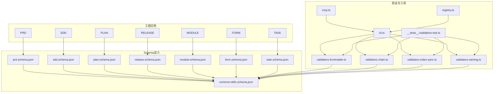
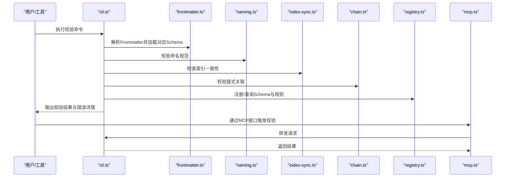
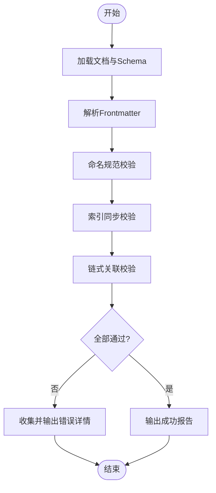
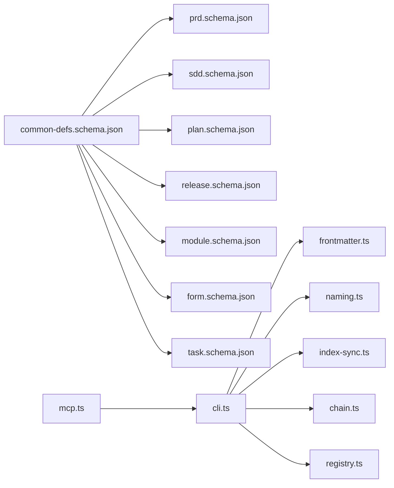

# 文档Schema定义

<cite>
**本文引用的文件**   
- [common-defs.schema.json](file://skills/shared/engineering-docs/schemas/common-defs.schema.json)
- [form.schema.json](file://skills/shared/engineering-docs/schemas/form.schema.json)
- [module.schema.json](file://skills/shared/engineering-docs/schemas/module.schema.json)
- [plan.schema.json](file://skills/shared/engineering-docs/schemas/plan.schema.json)
- [prd.schema.json](file://skills/shared/engineering-docs/schemas/prd.schema.json)
- [release.schema.json](file://skills/shared/engineering-docs/schemas/release.schema.json)
- [sdd.schema.json](file://skills/shared/engineering-docs/schemas/sdd.schema.json)
- [task.schema.json](file://skills/shared/engineering-docs/schemas/task.schema.json)
- [validators.test.ts](file://skills/shared/engineering-docs/scripts/src/__tests__/validators.test.ts)
- [chain.ts](file://skills/shared/engineering-docs/scripts/src/validators/chain.ts)
- [frontmatter.ts](file://skills/shared/engineering-docs/scripts/src/validators/frontmatter.ts)
- [index-sync.ts](file://skills/shared/engineering-docs/scripts/src/validators/index-sync.ts)
- [naming.ts](file://skills/shared/engineering-docs/scripts/src/validators/naming.ts)
- [cli.ts](file://skills/shared/engineering-docs/scripts/src/cli.ts)
- [mcp.ts](file://skills/shared/engineering-docs/scripts/src/mcp.ts)
- [registry.ts](file://skills/shared/engineering-docs/scripts/src/registry.ts)
</cite>

## 目录
1. [简介](#简介)
2. [项目结构](#项目结构)
3. [核心组件](#核心组件)
4. [架构总览](#架构总览)
5. [详细组件分析](#详细组件分析)
6. [依赖关系分析](#依赖关系分析)
7. [性能考虑](#性能考虑)
8. [故障排查指南](#故障排查指南)
9. [结论](#结论)
10. [附录](#附录)

## 简介
本技术文档面向工程文档的Schema定义与验证体系，覆盖公共定义（common-defs）与各文档类型的具体Schema（如PRD、SDD、Plan、Release、Module、Form、Task等）。文档将系统说明：
- JSON Schema结构与字段约束（必填、类型、枚举、格式、范围等）
- 业务逻辑校验规则（命名规范、索引一致性、链式关联等）
- Schema扩展与自定义方法
- 版本管理与向后兼容策略
- 验证工具使用方法与错误排查

## 项目结构
工程文档相关的Schema位于共享技能包下的schemas目录，配套验证脚本位于scripts目录。整体组织如下：
- schemas：各文档类型的JSON Schema定义与公共定义
- scripts：用于生成、校验、注册Schema的工具与测试

图表来源
- [common-defs.schema.json](file://skills/shared/engineering-docs/schemas/common-defs.schema.json)
- [prd.schema.json](file://skills/shared/engineering-docs/schemas/prd.schema.json)
- [sdd.schema.json](file://skills/shared/engineering-docs/schemas/sdd.schema.json)
- [plan.schema.json](file://skills/shared/engineering-docs/schemas/plan.schema.json)
- [release.schema.json](file://skills/shared/engineering-docs/schemas/release.schema.json)
- [module.schema.json](file://skills/shared/engineering-docs/schemas/module.schema.json)
- [form.schema.json](file://skills/shared/engineering-docs/schemas/form.schema.json)
- [task.schema.json](file://skills/shared/engineering-docs/schemas/task.schema.json)
- [frontmatter.ts](file://skills/shared/engineering-docs/scripts/src/validators/frontmatter.ts)
- [chain.ts](file://skills/shared/engineering-docs/scripts/src/validators/chain.ts)
- [index-sync.ts](file://skills/shared/engineering-docs/scripts/src/validators/index-sync.ts)
- [naming.ts](file://skills/shared/engineering-docs/scripts/src/validators/naming.ts)
- [cli.ts](file://skills/shared/engineering-docs/scripts/src/cli.ts)
- [mcp.ts](file://skills/shared/engineering-docs/scripts/src/mcp.ts)
- [registry.ts](file://skills/shared/engineering-docs/scripts/src/registry.ts)
- [validators.test.ts](file://skills/shared/engineering-docs/scripts/src/__tests__/validators.test.ts)

章节来源
- [common-defs.schema.json](file://skills/shared/engineering-docs/schemas/common-defs.schema.json)
- [prd.schema.json](file://skills/shared/engineering-docs/schemas/prd.schema.json)
- [sdd.schema.json](file://skills/shared/engineering-docs/schemas/sdd.schema.json)
- [plan.schema.json](file://skills/shared/engineering-docs/schemas/plan.schema.json)
- [release.schema.json](file://skills/shared/engineering-docs/schemas/release.schema.json)
- [module.schema.json](file://skills/shared/engineering-docs/schemas/module.schema.json)
- [form.schema.json](file://skills/shared/engineering-docs/schemas/form.schema.json)
- [task.schema.json](file://skills/shared/engineering-docs/schemas/task.schema.json)
- [frontmatter.ts](file://skills/shared/engineering-docs/scripts/src/validators/frontmatter.ts)
- [chain.ts](file://skills/shared/engineering-docs/scripts/src/validators/chain.ts)
- [index-sync.ts](file://skills/shared/engineering-docs/scripts/src/validators/index-sync.ts)
- [naming.ts](file://skills/shared/engineering-docs/scripts/src/validators/naming.ts)
- [cli.ts](file://skills/shared/engineering-docs/scripts/src/cli.ts)
- [mcp.ts](file://skills/shared/engineering-docs/scripts/src/mcp.ts)
- [registry.ts](file://skills/shared/engineering-docs/scripts/src/registry.ts)
- [validators.test.ts](file://skills/shared/engineering-docs/scripts/src/__tests__/validators.test.ts)

## 核心组件
- 公共定义（common-defs）：集中管理通用字段、枚举、引用类型与复用片段，供各文档Schema通过$ref或allOf组合使用，确保跨文档一致性与可维护性。
- 文档类型Schema：针对PRD、SDD、Plan、Release、Module、Form、Task等文档类型，定义其元数据、正文结构、关联项与业务约束。
- 验证器：包括Frontmatter解析、命名规范、索引同步、链式关联校验等，配合CLI/MCP/Registry提供统一入口与集成能力。
- 测试套件：对验证器进行用例覆盖，保障规则稳定与回归安全。

章节来源
- [common-defs.schema.json](file://skills/shared/engineering-docs/schemas/common-defs.schema.json)
- [frontmatter.ts](file://skills/shared/engineering-docs/scripts/src/validators/frontmatter.ts)
- [naming.ts](file://skills/shared/engineering-docs/scripts/src/validators/naming.ts)
- [index-sync.ts](file://skills/shared/engineering-docs/scripts/src/validators/index-sync.ts)
- [chain.ts](file://skills/shared/engineering-docs/scripts/src/validators/chain.ts)
- [cli.ts](file://skills/shared/engineering-docs/scripts/src/cli.ts)
- [mcp.ts](file://skills/shared/engineering-docs/scripts/src/mcp.ts)
- [registry.ts](file://skills/shared/engineering-docs/scripts/src/registry.ts)
- [validators.test.ts](file://skills/shared/engineering-docs/scripts/src/__tests__/validators.test.ts)

## 架构总览
下图展示了Schema与验证器的交互关系：文档由前端或工具生成，经CLI调用验证器，按Schema与业务规则进行校验，并通过MCP/Registry对外暴露能力。

图表来源
- [cli.ts](file://skills/shared/engineering-docs/scripts/src/cli.ts)
- [frontmatter.ts](file://skills/shared/engineering-docs/scripts/src/validators/frontmatter.ts)
- [naming.ts](file://skills/shared/engineering-docs/scripts/src/validators/naming.ts)
- [index-sync.ts](file://skills/shared/engineering-docs/scripts/src/validators/index-sync.ts)
- [chain.ts](file://skills/shared/engineering-docs/scripts/src/validators/chain.ts)
- [registry.ts](file://skills/shared/engineering-docs/scripts/src/registry.ts)
- [mcp.ts](file://skills/shared/engineering-docs/scripts/src/mcp.ts)

## 详细组件分析

### 公共定义（common-defs）
- 作用：集中定义通用字段（如标识符、标题、作者、时间戳、状态、标签、版本等）、枚举值、引用模式与复用片段。
- 设计要点：
  - 使用$ref实现跨Schema复用，减少重复定义
  - 通过allOf组合多个片段，支持渐进式扩展
  - 明确必填字段与默认值，保证基础完整性
  - 为关键字段提供格式与长度约束（如ID格式、日期格式、枚举取值）
- 扩展建议：
  - 新增通用字段时优先在common-defs中定义，并在相关文档Schema中引用
  - 保持向后兼容：新增可选字段不破坏旧版；变更必填需升级版本并迁移

章节来源
- [common-defs.schema.json](file://skills/shared/engineering-docs/schemas/common-defs.schema.json)

### PRD Schema（产品需求文档）
- 目标：描述产品需求背景、目标用户、功能范围、验收标准与非功能性要求。
- 关键结构：
  - 元数据：标题、版本、作者、创建/更新时间、状态、标签
  - 需求条目：需求ID、名称、优先级、描述、验收条件、关联任务/模块
  - 非功能：性能、可用性、安全性、兼容性等约束
- 验证规则：
  - 必填字段：标题、版本、作者、至少一条需求条目
  - 类型与格式：日期ISO格式、枚举状态合法、ID唯一且符合命名规范
  - 业务逻辑：需求与任务/模块存在双向关联校验
- 示例数据路径：见模板与示例目录中的PRD样例

章节来源
- [prd.schema.json](file://skills/shared/engineering-docs/schemas/prd.schema.json)
- [frontmatter.ts](file://skills/shared/engineering-docs/scripts/src/validators/frontmatter.ts)
- [naming.ts](file://skills/shared/engineering-docs/scripts/src/validators/naming.ts)
- [chain.ts](file://skills/shared/engineering-docs/scripts/src/validators/chain.ts)

### SDD Schema（系统设计文档）
- 目标：描述系统架构、模块划分、接口设计、数据模型与部署方案。
- 关键结构：
  - 元数据：标题、版本、作者、创建/更新时间、状态、标签
  - 架构视图：上下文图、组件图、数据流图描述
  - 接口定义：API端点、请求/响应结构、错误码
  - 数据模型：实体、关系、约束
  - 非功能：容量、可靠性、可扩展性
- 验证规则：
  - 必填字段：标题、版本、作者、至少一个架构视图或接口定义
  - 类型与格式：接口路径、数据类型、枚举值合法
  - 业务逻辑：接口与数据模型一致性、依赖关系无环
- 示例数据路径：见模板与示例目录中的SDD样例

章节来源
- [sdd.schema.json](file://skills/shared/engineering-docs/schemas/sdd.schema.json)
- [frontmatter.ts](file://skills/shared/engineering-docs/scripts/src/validators/frontmatter.ts)
- [naming.ts](file://skills/shared/engineering-docs/scripts/src/validators/naming.ts)
- [chain.ts](file://skills/shared/engineering-docs/scripts/src/validators/chain.ts)

### Plan Schema（计划文档）
- 目标：规划里程碑、任务分解、资源分配与进度跟踪。
- 关键结构：
  - 元数据：标题、版本、作者、创建/更新时间、状态、标签
  - 里程碑：名称、起止时间、交付物、负责人
  - 任务清单：任务ID、名称、依赖、优先级、状态
- 验证规则：
  - 必填字段：标题、版本、作者、至少一个里程碑或任务
  - 类型与格式：日期区间合法、状态枚举有效
  - 业务逻辑：任务依赖无环、里程碑与任务对齐
- 示例数据路径：见模板与示例目录中的PLAN样例

章节来源
- [plan.schema.json](file://skills/shared/engineering-docs/schemas/plan.schema.json)
- [frontmatter.ts](file://skills/shared/engineering-docs/scripts/src/validators/frontmatter.ts)
- [naming.ts](file://skills/shared/engineering-docs/scripts/src/validators/naming.ts)
- [chain.ts](file://skills/shared/engineering-docs/scripts/src/validators/chain.ts)

### Release Schema（发布文档）
- 目标：记录发布版本信息、变更摘要、回滚策略与上线检查清单。
- 关键结构：
  - 元数据：标题、版本、作者、创建/更新时间、状态、标签
  - 发布信息：版本号、发布日期、环境、影响范围
  - 变更摘要：新增、修复、破坏性变更
  - 风险与回滚：风险评估、回滚步骤、验证用例
- 验证规则：
  - 必填字段：标题、版本、作者、至少一条变更摘要
  - 类型与格式：版本号语义化、日期格式正确
  - 业务逻辑：回滚步骤完整、影响范围与变更匹配
- 示例数据路径：见模板与示例目录中的RELEASE样例

章节来源
- [release.schema.json](file://skills/shared/engineering-docs/schemas/release.schema.json)
- [frontmatter.ts](file://skills/shared/engineering-docs/scripts/src/validators/frontmatter.ts)
- [naming.ts](file://skills/shared/engineering-docs/scripts/src/validators/naming.ts)
- [chain.ts](file://skills/shared/engineering-docs/scripts/src/validators/chain.ts)

### Module Schema（模块文档）
- 目标：描述模块职责、边界、接口、依赖与演进路线。
- 关键结构：
  - 元数据：标题、版本、作者、创建/更新时间、状态、标签
  - 模块定义：名称、描述、职责、边界、外部依赖
  - 接口与契约：对外API、事件、数据交换格式
  - 演进计划：重构、拆分、废弃策略
- 验证规则：
  - 必填字段：标题、版本、作者、至少一个接口或契约定义
  - 类型与格式：接口路径、数据类型、枚举值合法
  - 业务逻辑：依赖关系清晰、无循环依赖
- 示例数据路径：见模板与示例目录中的MODULE样例

章节来源
- [module.schema.json](file://skills/shared/engineering-docs/schemas/module.schema.json)
- [frontmatter.ts](file://skills/shared/engineering-docs/scripts/src/validators/frontmatter.ts)
- [naming.ts](file://skills/shared/engineering-docs/scripts/src/validators/naming.ts)
- [chain.ts](file://skills/shared/engineering-docs/scripts/src/validators/chain.ts)

### Form Schema（表单文档）
- 目标：定义表单结构、字段类型、校验规则与展示布局。
- 关键结构：
  - 元数据：标题、版本、作者、创建/更新时间、状态、标签
  - 字段定义：字段名、类型、必填、默认值、校验规则、帮助文本
  - 布局与分组：分区、顺序、条件显示
- 验证规则：
  - 必填字段：标题、版本、作者、至少一个字段定义
  - 类型与格式：字段类型合法、校验表达式语法正确
  - 业务逻辑：条件显示依赖字段存在、必填字段有默认值提示
- 示例数据路径：见模板与示例目录中的FORM样例

章节来源
- [form.schema.json](file://skills/shared/engineering-docs/schemas/form.schema.json)
- [frontmatter.ts](file://skills/shared/engineering-docs/scripts/src/validators/frontmatter.ts)
- [naming.ts](file://skills/shared/engineering-docs/scripts/src/validators/naming.ts)
- [chain.ts](file://skills/shared/engineering-docs/scripts/src/validators/chain.ts)

### Task Schema（任务文档）
- 目标：记录具体任务信息、依赖关系、进度与验收标准。
- 关键结构：
  - 元数据：标题、版本、作者、创建/更新时间、状态、标签
  - 任务信息：任务ID、名称、描述、优先级、负责人、起止时间
  - 依赖与关联：前置任务、关联需求/模块/接口
  - 验收标准：完成条件、测试用例、评审意见
- 验证规则：
  - 必填字段：标题、版本、作者、至少一条任务信息
  - 类型与格式：日期区间合法、状态枚举有效
  - 业务逻辑：依赖无环、关联对象存在且可追溯
- 示例数据路径：见模板与示例目录中的TASK样例

章节来源
- [task.schema.json](file://skills/shared/engineering-docs/schemas/task.schema.json)
- [frontmatter.ts](file://skills/shared/engineering-docs/scripts/src/validators/frontmatter.ts)
- [naming.ts](file://skills/shared/engineering-docs/scripts/src/validators/naming.ts)
- [chain.ts](file://skills/shared/engineering-docs/scripts/src/validators/chain.ts)

### 验证器与工具
- Frontmatter验证器：负责解析文档头部元数据，提取版本、作者、时间戳等，并与Schema进行一致性校验。
- 命名规范验证器：确保文件名、ID、路径遵循统一的命名约定，避免不一致导致的检索与链接问题。
- 索引同步验证器：检查文档索引与实际内容的一致性，防止遗漏或过期条目。
- 链式关联验证器：校验文档间的引用关系（如PRD到Task、SDD到Module），确保链路完整且无断链。
- CLI：提供命令行入口，聚合上述验证器，输出结构化结果与错误定位。
- MCP：提供远程调用接口，便于IDE或其他系统集成。
- Registry：管理Schema与规则的注册与发现，支持动态加载与版本选择。
- 测试套件：覆盖常见场景与边界条件，保障规则稳定性。

图表来源
- [frontmatter.ts](file://skills/shared/engineering-docs/scripts/src/validators/frontmatter.ts)
- [naming.ts](file://skills/shared/engineering-docs/scripts/src/validators/naming.ts)
- [index-sync.ts](file://skills/shared/engineering-docs/scripts/src/validators/index-sync.ts)
- [chain.ts](file://skills/shared/engineering-docs/scripts/src/validators/chain.ts)
- [cli.ts](file://skills/shared/engineering-docs/scripts/src/cli.ts)

章节来源
- [frontmatter.ts](file://skills/shared/engineering-docs/scripts/src/validators/frontmatter.ts)
- [naming.ts](file://skills/shared/engineering-docs/scripts/src/validators/naming.ts)
- [index-sync.ts](file://skills/shared/engineering-docs/scripts/src/validators/index-sync.ts)
- [chain.ts](file://skills/shared/engineering-docs/scripts/src/validators/chain.ts)
- [cli.ts](file://skills/shared/engineering-docs/scripts/src/cli.ts)
- [mcp.ts](file://skills/shared/engineering-docs/scripts/src/mcp.ts)
- [registry.ts](file://skills/shared/engineering-docs/scripts/src/registry.ts)
- [validators.test.ts](file://skills/shared/engineering-docs/scripts/src/__tests__/validators.test.ts)

## 依赖关系分析
- Schema间依赖：各文档类型Schema均依赖common-defs，通过$ref或allOf复用通用字段与枚举，降低耦合度并提升一致性。
- 验证器依赖：CLI聚合多个验证器，形成分层校验流程；MCP与Registry作为扩展点，提供集成与动态管理能力。
- 潜在循环：应避免在Schema中引入循环引用；链式关联验证器会检测并阻止环状依赖。

图表来源
- [common-defs.schema.json](file://skills/shared/engineering-docs/schemas/common-defs.schema.json)
- [prd.schema.json](file://skills/shared/engineering-docs/schemas/prd.schema.json)
- [sdd.schema.json](file://skills/shared/engineering-docs/schemas/sdd.schema.json)
- [plan.schema.json](file://skills/shared/engineering-docs/schemas/plan.schema.json)
- [release.schema.json](file://skills/shared/engineering-docs/schemas/release.schema.json)
- [module.schema.json](file://skills/shared/engineering-docs/schemas/module.schema.json)
- [form.schema.json](file://skills/shared/engineering-docs/schemas/form.schema.json)
- [task.schema.json](file://skills/shared/engineering-docs/schemas/task.schema.json)
- [cli.ts](file://skills/shared/engineering-docs/scripts/src/cli.ts)
- [frontmatter.ts](file://skills/shared/engineering-docs/scripts/src/validators/frontmatter.ts)
- [naming.ts](file://skills/shared/engineering-docs/scripts/src/validators/naming.ts)
- [index-sync.ts](file://skills/shared/engineering-docs/scripts/src/validators/index-sync.ts)
- [chain.ts](file://skills/shared/engineering-docs/scripts/src/validators/chain.ts)
- [registry.ts](file://skills/shared/engineering-docs/scripts/src/registry.ts)
- [mcp.ts](file://skills/shared/engineering-docs/scripts/src/mcp.ts)

章节来源
- [common-defs.schema.json](file://skills/shared/engineering-docs/schemas/common-defs.schema.json)
- [cli.ts](file://skills/shared/engineering-docs/scripts/src/cli.ts)
- [frontmatter.ts](file://skills/shared/engineering-docs/scripts/src/validators/frontmatter.ts)
- [naming.ts](file://skills/shared/engineering-docs/scripts/src/validators/naming.ts)
- [index-sync.ts](file://skills/shared/engineering-docs/scripts/src/validators/index-sync.ts)
- [chain.ts](file://skills/shared/engineering-docs/scripts/src/validators/chain.ts)
- [registry.ts](file://skills/shared/engineering-docs/scripts/src/registry.ts)
- [mcp.ts](file://skills/shared/engineering-docs/scripts/src/mcp.ts)

## 性能考虑
- Schema复用：通过$ref与allOf减少重复定义，降低解析与校验开销。
- 增量校验：仅对变更文档执行校验，结合索引缓存提升批量处理效率。
- 并行验证：多文档校验可并发执行，注意控制并发度以避免资源争用。
- 错误快速失败：在必要的前置校验失败时尽早返回，减少后续计算成本。

[本节为通用指导，无需特定文件来源]

## 故障排查指南
- 常见错误类型：
  - 必填字段缺失：检查文档元数据与核心条目是否齐全
  - 类型或格式不符：确认日期、ID、枚举值是否符合约定
  - 命名不规范：核对文件名、ID、路径是否符合命名规则
  - 索引不一致：检查索引条目与实际文档是否一一对应
  - 链式关联断裂：确认引用对象存在且可达，避免环状依赖
- 定位方法：
  - 使用CLI输出详细错误位置与上下文
  - 查看测试用例以复现与对比预期行为
  - 通过MCP接口获取结构化错误报告
- 修复建议：
  - 修正字段值或补充缺失字段
  - 调整命名与路径以符合规范
  - 更新索引与引用关系，确保一致性
  - 必要时升级Schema版本并进行迁移

章节来源
- [cli.ts](file://skills/shared/engineering-docs/scripts/src/cli.ts)
- [validators.test.ts](file://skills/shared/engineering-docs/scripts/src/__tests__/validators.test.ts)

## 结论
本技术文档系统化梳理了工程文档的Schema定义与验证体系，明确了公共定义与各文档类型的结构约束、业务规则与扩展方式。通过CLI/MCP/Registry提供的统一入口与集成能力，团队可在保证一致性的同时高效推进文档治理与自动化流程。建议在持续演进中遵循向后兼容原则，完善测试覆盖，并结合CI流水线实现持续校验。

[本节为总结性内容，无需特定文件来源]

## 附录
- Schema扩展与自定义：
  - 在common-defs中新增通用字段或枚举，并在相关文档Schema中引用
  - 使用allOf组合多个片段，支持渐进式增强
  - 新增业务校验逻辑时，优先在验证器中实现，并通过CLI/MCP暴露
- 版本管理与向后兼容：
  - 新增可选字段不影响旧版；变更必填需升级版本并提供迁移指引
  - 保留历史Schema以便兼容旧文档，逐步淘汰过时版本
- 验证工具使用：
  - CLI：本地执行校验，输出结构化结果
  - MCP：远程调用，便于IDE集成
  - Registry：管理Schema与规则，支持动态加载
  - 测试套件：覆盖常见场景，保障稳定性

[本节为通用指导，无需特定文件来源]