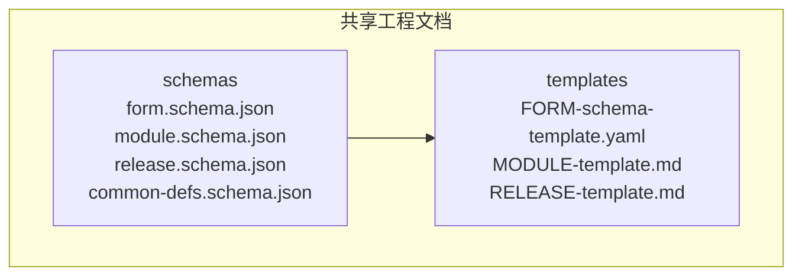
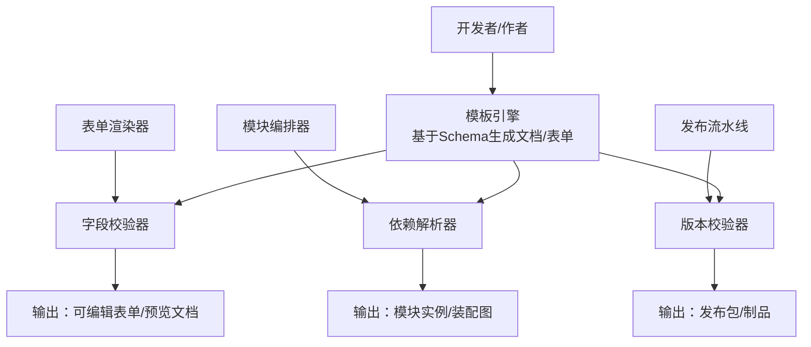
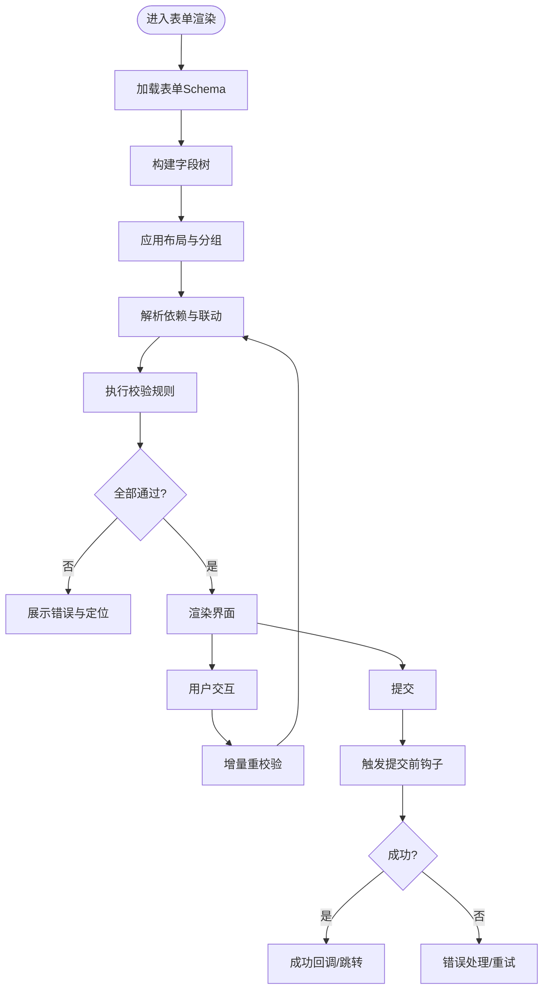
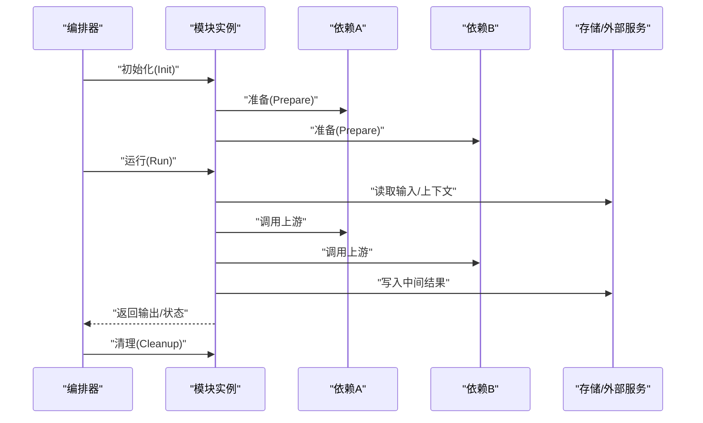
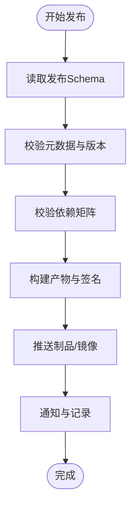
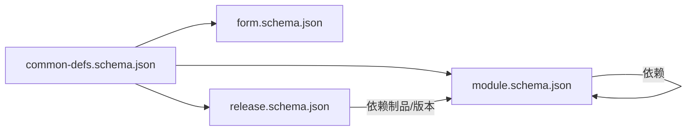

# 表单和模块Schema

<cite>
**本文引用的文件**   
- [form.schema.json](file://skills/shared/engineering-docs/schemas/form.schema.json)
- [module.schema.json](file://skills/shared/engineering-docs/schemas/module.schema.json)
- [release.schema.json](file://skills/shared/engineering-docs/schemas/release.schema.json)
- [common-defs.schema.json](file://skills/shared/engineering-docs/schemas/common-defs.schema.json)
- [FORM-schema-template.yaml](file://skills/shared/engineering-docs/templates/FORM-schema-template.yaml)
- [MODULE-template.md](file://skills/shared/engineering-docs/templates/MODULE-template.md)
- [RELEASE-template.md](file://skills/shared/engineering-docs/templates/RELEASE-template.md)
</cite>

## 目录
1. [简介](#简介)
2. [项目结构](#项目结构)
3. [核心组件](#核心组件)
4. [架构总览](#架构总览)
5. [详细组件分析](#详细组件分析)
6. [依赖关系分析](#依赖关系分析)
7. [性能与可扩展性考虑](#性能与可扩展性考虑)
8. [故障排查指南](#故障排查指南)
9. [结论](#结论)
10. [附录](#附录)

## 简介
本技术文档聚焦于工程文档体系中的三类核心Schema：FORM（表单定义）、MODULE（模块定义）与RELEASE（发布版本）。文档从Schema结构、字段动态配置、验证规则、显示逻辑与交互行为，到模块组织、依赖与生命周期管理，以及发布版本的元数据、版本控制策略与流程集成进行系统化说明。同时提供配置示例路径与实际应用场景，并给出自定义表单组件与模块模板的实践建议。

## 项目结构
与表单和模块Schema相关的核心资源位于“共享工程文档”子工程中，包含Schema定义与模板两类资产：
- Schema定义：用于约束表单、模块与发布版本的JSON Schema
- 模板：用于快速生成符合规范的文档与表单骨架

图表来源
- [form.schema.json](file://skills/shared/engineering-docs/schemas/form.schema.json)
- [module.schema.json](file://skills/shared/engineering-docs/schemas/module.schema.json)
- [release.schema.json](file://skills/shared/engineering-docs/schemas/release.schema.json)
- [common-defs.schema.json](file://skills/shared/engineering-docs/schemas/common-defs.schema.json)
- [FORM-schema-template.yaml](file://skills/shared/engineering-docs/templates/FORM-schema-template.yaml)
- [MODULE-template.md](file://skills/shared/engineering-docs/templates/MODULE-template.md)
- [RELEASE-template.md](file://skills/shared/engineering-docs/templates/RELEASE-template.md)

章节来源
- [form.schema.json](file://skills/shared/engineering-docs/schemas/form.schema.json)
- [module.schema.json](file://skills/shared/engineering-docs/schemas/module.schema.json)
- [release.schema.json](file://skills/shared/engineering-docs/schemas/release.schema.json)
- [common-defs.schema.json](file://skills/shared/engineering-docs/schemas/common-defs.schema.json)
- [FORM-schema-template.yaml](file://skills/shared/engineering-docs/templates/FORM-schema-template.yaml)
- [MODULE-template.md](file://skills/shared/engineering-docs/templates/MODULE-template.md)
- [RELEASE-template.md](file://skills/shared/engineering-docs/templates/RELEASE-template.md)

## 核心组件
本节概述三类Schema的职责与边界：
- FORM（表单定义）：描述表单的字段集合、类型、校验规则、显示与交互行为，支持动态渲染与条件逻辑
- MODULE（模块定义）：描述模块的组织结构、输入输出、依赖关系、生命周期钩子与扩展点
- RELEASE（发布版本）：描述发布包的元数据、版本标识、变更摘要、依赖矩阵与发布流水线集成信息

章节来源
- [form.schema.json](file://skills/shared/engineering-docs/schemas/form.schema.json)
- [module.schema.json](file://skills/shared/engineering-docs/schemas/module.schema.json)
- [release.schema.json](file://skills/shared/engineering-docs/schemas/release.schema.json)

## 架构总览
下图展示了Schema在文档与工具链中的位置与交互关系：Schema作为契约驱动模板生成、表单渲染与发布校验。

[此图为概念性架构图，不直接映射具体源码文件]

## 详细组件分析

### FORM（表单定义）Schema
- 目标与范围
  - 定义表单的结构化描述，包括字段列表、类型、默认值、必填、展示标签、帮助文本、分组、布局等
  - 支持动态配置：条件可见、禁用、只读、联动计算、选项集、枚举、正则表达式等
  - 支持校验规则：内置规则与自定义规则扩展点
  - 支持交互行为：事件触发、副作用、跳转、提示、错误反馈
- 关键字段类别（按职责划分）
  - 基础信息：标题、描述、语言、主题、国际化键
  - 字段定义：字段ID、类型、标签、占位符、默认值、是否必填、排序、分组
  - 显示与布局：列宽、栅格、折叠面板、标签位置、帮助文本、图标
  - 校验规则：最小/最大长度、数值范围、正则、唯一性、跨字段校验
  - 动态逻辑：条件可见、条件禁用、联动公式、选项过滤、异步加载
  - 交互行为：提交前钩子、成功回调、失败处理、埋点上报
  - 扩展能力：自定义组件注册、插件注入、主题变量
- 典型使用场景
  - 需求登记表单、评审意见收集、任务创建向导、配置项批量导入导出
- 配置示例路径
  - 参考模板：[FORM-schema-template.yaml](file://skills/shared/engineering-docs/templates/FORM-schema-template.yaml)
- 与通用定义的关联
  - 复用通用类型、枚举、校验器与UI约定，详见：[common-defs.schema.json](file://skills/shared/engineering-docs/schemas/common-defs.schema.json)

图表来源
- [form.schema.json](file://skills/shared/engineering-docs/schemas/form.schema.json)
- [common-defs.schema.json](file://skills/shared/engineering-docs/schemas/common-defs.schema.json)

章节来源
- [form.schema.json](file://skills/shared/engineering-docs/schemas/form.schema.json)
- [common-defs.schema.json](file://skills/shared/engineering-docs/schemas/common-defs.schema.json)
- [FORM-schema-template.yaml](file://skills/shared/engineering-docs/templates/FORM-schema-template.yaml)

### MODULE（模块定义）Schema
- 目标与范围
  - 描述模块的输入输出接口、内部状态、依赖关系、生命周期钩子与扩展点
  - 支持组合式编排：串行、并行、分支、重试、超时、熔断
  - 支持运行时上下文：环境变量、密钥、参数注入、日志与追踪
- 关键字段类别（按职责划分）
  - 模块元信息：名称、版本、描述、作者、许可证、标签
  - 接口定义：输入参数、输出结果、错误码、幂等性、限流
  - 依赖声明：上游模块、外部服务、配置文件、数据源
  - 生命周期：初始化、准备、运行、清理、销毁、健康检查
  - 编排与容错：重试策略、超时、降级、回滚、补偿
  - 观测性：指标、日志、链路追踪、审计
  - 安全与权限：访问控制、敏感信息保护、签名校验
- 典型使用场景
  - 数据处理管道、文档生成器、质量门禁、自动化脚本封装
- 配置示例路径
  - 参考模板：[MODULE-template.md](file://skills/shared/engineering-docs/templates/MODULE-template.md)
- 与通用定义的关联
  - 复用通用类型、枚举、校验器与UI约定，详见：[common-defs.schema.json](file://skills/shared/engineering-docs/schemas/common-defs.schema.json)

图表来源
- [module.schema.json](file://skills/shared/engineering-docs/schemas/module.schema.json)
- [common-defs.schema.json](file://skills/shared/engineering-docs/schemas/common-defs.schema.json)

章节来源
- [module.schema.json](file://skills/shared/engineering-docs/schemas/module.schema.json)
- [common-defs.schema.json](file://skills/shared/engineering-docs/schemas/common-defs.schema.json)
- [MODULE-template.md](file://skills/shared/engineering-docs/templates/MODULE-template.md)

### RELEASE（发布版本）Schema
- 目标与范围
  - 描述发布包的元数据、版本标识、变更摘要、依赖矩阵、产物清单与发布流水线集成信息
  - 支持语义化版本、分支策略、标签规范、回滚策略与灰度发布
- 关键字段类别（按职责划分）
  - 版本元数据：主版本号、次版本号、修订号、预发布标记、构建号、时间戳
  - 变更摘要：新增、修复、破坏性变更、迁移指引、兼容性矩阵
  - 依赖矩阵：模块版本、第三方库、运行时环境、平台兼容
  - 产物清单：文档、二进制、镜像、安装包、签名与校验和
  - 发布策略：灰度比例、回滚阈值、审批流、通知渠道
  - 流水线集成：触发条件、阶段定义、缓存、缓存失效、缓存命中
- 典型使用场景
  - 版本打包、制品归档、发布审批、上线与回滚
- 配置示例路径
  - 参考模板：[RELEASE-template.md](file://skills/shared/engineering-docs/templates/RELEASE-template.md)
- 与通用定义的关联
  - 复用通用类型、枚举、校验器与UI约定，详见：[common-defs.schema.json](file://skills/shared/engineering-docs/schemas/common-defs.schema.json)

图表来源
- [release.schema.json](file://skills/shared/engineering-docs/schemas/release.schema.json)
- [common-defs.schema.json](file://skills/shared/engineering-docs/schemas/common-defs.schema.json)

章节来源
- [release.schema.json](file://skills/shared/engineering-docs/schemas/release.schema.json)
- [common-defs.schema.json](file://skills/shared/engineering-docs/schemas/common-defs.schema.json)
- [RELEASE-template.md](file://skills/shared/engineering-docs/templates/RELEASE-template.md)

## 依赖关系分析
三类Schema之间存在明确的依赖与复用关系：
- FORM、MODULE、RELEASE均引用通用定义（类型、枚举、校验器、UI约定）
- MODULE可能依赖其他模块或外部服务，形成有向无环图（DAG）
- RELEASE依赖已发布的模块版本与第三方库，形成制品级依赖矩阵

图表来源
- [common-defs.schema.json](file://skills/shared/engineering-docs/schemas/common-defs.schema.json)
- [form.schema.json](file://skills/shared/engineering-docs/schemas/form.schema.json)
- [module.schema.json](file://skills/shared/engineering-docs/schemas/module.schema.json)
- [release.schema.json](file://skills/shared/engineering-docs/schemas/release.schema.json)

章节来源
- [common-defs.schema.json](file://skills/shared/engineering-docs/schemas/common-defs.schema.json)
- [form.schema.json](file://skills/shared/engineering-docs/schemas/form.schema.json)
- [module.schema.json](file://skills/shared/engineering-docs/schemas/module.schema.json)
- [release.schema.json](file://skills/shared/engineering-docs/schemas/release.schema.json)

## 性能与可扩展性考虑
- 表单渲染
  - 按需加载字段与校验规则，避免一次性构建大型字段树
  - 增量重校验与防抖，减少频繁计算
  - 条件可见与联动逻辑采用懒求值与缓存
- 模块编排
  - 并行执行无依赖步骤，限制并发度避免过载
  - 超时与重试策略合理设置，避免雪崩
  - 中间结果落盘与断点续跑，提升稳定性
- 发布流程
  - 产物签名与校验和前置校验，缩短失败窗口
  - 灰度发布与快速回滚，降低风险
  - 缓存命中与增量构建，加速流水线

[本节为通用指导，无需特定文件来源]

## 故障排查指南
- 表单相关
  - 校验失败：检查字段类型、必填、范围与正则；查看错误消息与定位路径
  - 联动异常：确认依赖字段存在且类型匹配；检查条件表达式与选项过滤
  - 渲染空白：核对字段ID唯一性与布局配置；检查国际化键是否存在
- 模块相关
  - 依赖缺失：确认上游模块版本兼容；检查依赖矩阵与运行时环境
  - 生命周期错误：检查初始化与清理顺序；查看健康检查与日志
  - 超时与重试：调整超时阈值与重试次数；关注外部服务可用性
- 发布相关
  - 版本冲突：检查语义化版本与依赖矩阵；确认破坏性变更迁移指引
  - 制品校验失败：核对签名与校验和；检查网络与仓库权限
  - 灰度失败：观察回滚阈值与告警；确认通知渠道与审批流

[本节为通用指导，无需特定文件来源]

## 结论
通过统一的Schema契约，表单、模块与发布版本实现了高内聚、低耦合的可配置化与可编排化。借助通用定义与模板，团队可以快速构建一致的文档与工具链体验，并在动态配置、校验与发布流程中保持高质量与可控性。

[本节为总结性内容，无需特定文件来源]

## 附录
- 配置示例与模板
  - 表单Schema模板：[FORM-schema-template.yaml](file://skills/shared/engineering-docs/templates/FORM-schema-template.yaml)
  - 模块模板：[MODULE-template.md](file://skills/shared/engineering-docs/templates/MODULE-template.md)
  - 发布模板：[RELEASE-template.md](file://skills/shared/engineering-docs/templates/RELEASE-template.md)
- 通用定义
  - 通用类型与校验器：[common-defs.schema.json](file://skills/shared/engineering-docs/schemas/common-defs.schema.json)
- 实际应用场景
  - 表单：需求登记、评审意见、任务创建、配置导入导出
  - 模块：数据处理管道、文档生成、质量门禁、自动化脚本
  - 发布：版本打包、制品归档、灰度发布与回滚

[本节为补充信息，无需特定文件来源]