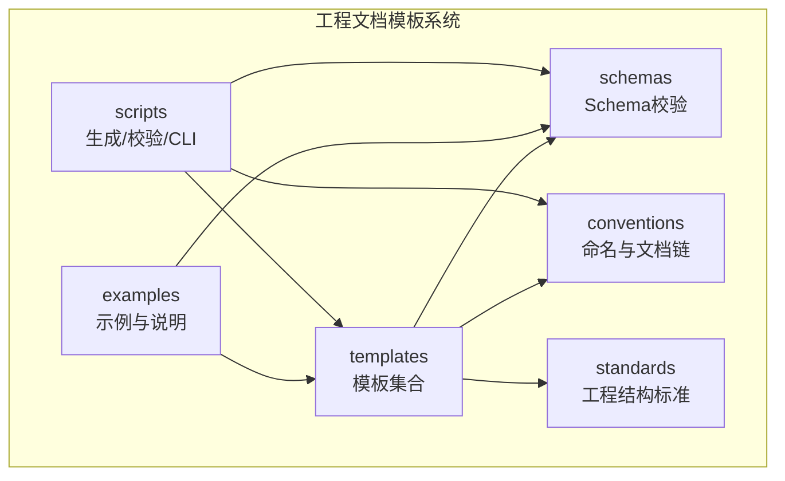
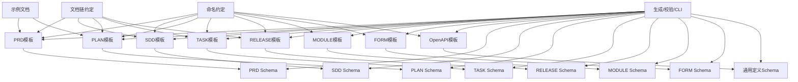
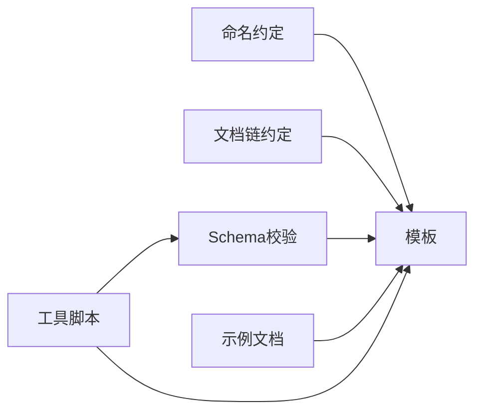

# 文档模板系统

<cite>
**本文引用的文件**   
- [PRD-template.md](file://skills/shared/engineering-docs/templates/PRD-template.md)
- [SDD-template.md](file://skills/shared/engineering-docs/templates/SDD-template.md)
- [PLAN-template.md](file://skills/shared/engineering-docs/templates/PLAN-template.md)
- [TASK-template.md](file://skills/shared/engineering-docs/templates/TASK-template.md)
- [RELEASE-template.md](file://skills/shared/engineering-docs/templates/RELEASE-template.md)
- [MODULE-template.md](file://skills/shared/engineering-docs/templates/MODULE-template.md)
- [FORM-template.md](file://skills/shared/engineering-docs/templates/FORM-template.md)
- [OpenAPI-template.yaml](file://skills/shared/engineering-docs/templates/OpenAPI-template.yaml)
- [form.schema.json](file://skills/shared/engineering-docs/schemas/form.schema.json)
- [prd.schema.json](file://skills/shared/engineering-docs/schemas/prd.schema.json)
- [sdd.schema.json](file://skills/shared/engineering-docs/schemas/sdd.schema.json)
- [plan.schema.json](file://skills/shared/engineering-docs/schemas/plan.schema.json)
- [task.schema.json](file://skills/shared/engineering-docs/schemas/task.schema.json)
- [release.schema.json](file://skills/shared/engineering-docs/schemas/release.schema.json)
- [module.schema.json](file://skills/shared/engineering-docs/schemas/module.schema.json)
- [common-defs.schema.json](file://skills/shared/engineering-docs/schemas/common-defs.schema.json)
- [doc-chain.yaml](file://skills/shared/engineering-docs/conventions/doc-chain.yaml)
- [naming.yaml](file://skills/shared/engineering-docs/conventions/naming.yaml)
- [ENGINEERING-STRUCTURE-TEAM.md](file://skills/shared/engineering-docs/standards/ENGINEERING-STRUCTURE-TEAM.md)
- [SKILL.md](file://skills/shared/engineering-docs/SKILL.md)
- [README.md](file://skills/shared/engineering-docs/examples/README.md)
- [PRD-001-sample-login.md](file://skills/shared/engineering-docs/examples/PRD-001-sample-login.md)
- [PLAN-v1.0-001-sample-mvp.md](file://skills/shared/engineering-docs/examples/PLAN-v1.0-001-sample-mvp.md)
- [writeback-prd-sdd/SKILL.md](file://skills/writeback/writeback-prd-sdd/SKILL.md)
- [writeback-tasks/SKILL.md](file://skills/writeback/writeback-tasks/SKILL.md)
- [writeback-traceability/SKILL.md](file://skills/writeback/writeback-traceability/SKILL.md)
</cite>

## 目录
1. [简介](#简介)
2. [项目结构](#项目结构)
3. [核心组件](#核心组件)
4. [架构总览](#架构总览)
5. [详细组件分析](#详细组件分析)
6. [依赖关系分析](#依赖关系分析)
7. [性能与可维护性考虑](#性能与可维护性考虑)
8. [故障排查指南](#故障排查指南)
9. [结论](#结论)
10. [附录](#附录)

## 简介
本用户指南面向使用“工程文档模板系统”的产品、研发与质量团队，帮助快速上手并高效产出高质量文档。系统提供一套标准化的文档模板（PRD、SDD、PLAN、TASK、RELEASE、MODULE、FORM、OpenAPI），配套JSON Schema校验、命名与文档链约定、示例与最佳实践，以及将文档变更写回代码仓库的自动化能力。

通过本指南，你将了解：
- 各内置模板的结构与填写说明
- 模板变量替换机制与自定义模板开发方法
- 模板继承与组合模式
- 模板版本管理与分发策略
- 基于现有模板创建项目特定变体的步骤
- 常见使用场景与最佳实践

## 项目结构
工程文档模板系统位于 skills/shared/engineering-docs 目录下，围绕“模板 + 校验 + 约定 + 示例 + 工具脚本”组织：
- templates：所有文档模板（Markdown/YAML）
- schemas：对应模板的 JSON Schema 定义，用于结构化校验
- conventions：命名规范与文档链约定
- standards：工程结构与协作标准
- examples：参考样例与使用说明
- scripts：生成器、验证器与CLI工具源码（可选扩展）

图表来源
- [SKILL.md](file://skills/shared/engineering-docs/SKILL.md)
- [README.md](file://skills/shared/engineering-docs/examples/README.md)

章节来源
- [SKILL.md](file://skills/shared/engineering-docs/SKILL.md)
- [README.md](file://skills/shared/engineering-docs/examples/README.md)

## 核心组件
- 模板集合：PRD、SDD、PLAN、TASK、RELEASE、MODULE、FORM、OpenAPI
- 校验体系：每个模板对应一个或多个 JSON Schema，支持字段类型、必填项、枚举值等约束
- 约定体系：命名规则与文档链（上下游关联）
- 示例库：典型文档样例，便于对照与复用
- 工具脚本：生成器、校验器与CLI，辅助批量处理与一致性检查

章节来源
- [PRD-template.md](file://skills/shared/engineering-docs/templates/PRD-template.md)
- [SDD-template.md](file://skills/shared/engineering-docs/templates/SDD-template.md)
- [PLAN-template.md](file://skills/shared/engineering-docs/templates/PLAN-template.md)
- [TASK-template.md](file://skills/shared/engineering-docs/templates/TASK-template.md)
- [RELEASE-template.md](file://skills/shared/engineering-docs/templates/RELEASE-template.md)
- [MODULE-template.md](file://skills/shared/engineering-docs/templates/MODULE-template.md)
- [FORM-template.md](file://skills/shared/engineering-docs/templates/FORM-template.md)
- [OpenAPI-template.yaml](file://skills/shared/engineering-docs/templates/OpenAPI-template.yaml)
- [form.schema.json](file://skills/shared/engineering-docs/schemas/form.schema.json)
- [prd.schema.json](file://skills/shared/engineering-docs/schemas/prd.schema.json)
- [sdd.schema.json](file://skills/shared/engineering-docs/schemas/sdd.schema.json)
- [plan.schema.json](file://skills/shared/engineering-docs/schemas/plan.schema.json)
- [task.schema.json](file://skills/shared/engineering-docs/schemas/task.schema.json)
- [release.schema.json](file://skills/shared/engineering-docs/schemas/release.schema.json)
- [module.schema.json](file://skills/shared/engineering-docs/schemas/module.schema.json)
- [common-defs.schema.json](file://skills/shared/engineering-docs/schemas/common-defs.schema.json)
- [doc-chain.yaml](file://skills/shared/engineering-docs/conventions/doc-chain.yaml)
- [naming.yaml](file://skills/shared/engineering-docs/conventions/naming.yaml)
- [ENGINEERING-STRUCTURE-TEAM.md](file://skills/shared/engineering-docs/standards/ENGINEERING-STRUCTURE-TEAM.md)

## 架构总览
下图展示了模板、Schema、约定与示例之间的依赖关系，以及工具脚本如何参与生成与校验流程。

图表来源
- [PRD-template.md](file://skills/shared/engineering-docs/templates/PRD-template.md)
- [SDD-template.md](file://skills/shared/engineering-docs/templates/SDD-template.md)
- [PLAN-template.md](file://skills/shared/engineering-docs/templates/PLAN-template.md)
- [TASK-template.md](file://skills/shared/engineering-docs/templates/TASK-template.md)
- [RELEASE-template.md](file://skills/shared/engineering-docs/templates/RELEASE-template.md)
- [MODULE-template.md](file://skills/shared/engineering-docs/templates/MODULE-template.md)
- [FORM-template.md](file://skills/shared/engineering-docs/templates/FORM-template.md)
- [OpenAPI-template.yaml](file://skills/shared/engineering-docs/templates/OpenAPI-template.yaml)
- [form.schema.json](file://skills/shared/engineering-docs/schemas/form.schema.json)
- [prd.schema.json](file://skills/shared/engineering-docs/schemas/prd.schema.json)
- [sdd.schema.json](file://skills/shared/engineering-docs/schemas/sdd.schema.json)
- [plan.schema.json](file://skills/shared/engineering-docs/schemas/plan.schema.json)
- [task.schema.json](file://skills/shared/engineering-docs/schemas/task.schema.json)
- [release.schema.json](file://skills/shared/engineering-docs/schemas/release.schema.json)
- [module.schema.json](file://skills/shared/engineering-docs/schemas/module.schema.json)
- [common-defs.schema.json](file://skills/shared/engineering-docs/schemas/common-defs.schema.json)
- [doc-chain.yaml](file://skills/shared/engineering-docs/conventions/doc-chain.yaml)
- [naming.yaml](file://skills/shared/engineering-docs/conventions/naming.yaml)
- [README.md](file://skills/shared/engineering-docs/examples/README.md)

## 详细组件分析

### PRD（产品需求文档）模板
- 用途：描述产品目标、范围、用户故事、验收标准与非功能需求
- 关键字段建议：标题、编号、版本、作者、状态、背景与目标、范围与边界、用户角色与用例、功能需求、非功能需求、依赖与风险、验收标准、变更记录
- 校验要点：必填元数据、字段类型与枚举、引用ID格式
- 与下游文档关系：驱动SDD与PLAN；在文档链中作为上游

章节来源
- [PRD-template.md](file://skills/shared/engineering-docs/templates/PRD-template.md)
- [prd.schema.json](file://skills/shared/engineering-docs/schemas/prd.schema.json)
- [doc-chain.yaml](file://skills/shared/engineering-docs/conventions/doc-chain.yaml)
- [naming.yaml](file://skills/shared/engineering-docs/conventions/naming.yaml)

### SDD（系统设计文档）模板
- 用途：承接PRD，给出总体架构、模块划分、接口设计、数据模型、部署与运维要点
- 关键字段建议：设计目标与约束、架构图与说明、模块职责、接口清单、数据模型、安全与合规、性能与容量、可观测性与排障、变更影响面
- 校验要点：模块与接口ID一致性、依赖声明完整性
- 与上游文档关系：由PRD驱动；为PLAN与TASK提供技术依据

章节来源
- [SDD-template.md](file://skills/shared/engineering-docs/templates/SDD-template.md)
- [sdd.schema.json](file://skills/shared/engineering-docs/schemas/sdd.schema.json)
- [doc-chain.yaml](file://skills/shared/engineering-docs/conventions/doc-chain.yaml)

### PLAN（计划文档）模板
- 用途：规划里程碑、阶段交付物、资源与风险、度量指标
- 关键字段建议：计划周期、阶段划分、关键任务与依赖、资源与预算、风险与应对、度量与复盘
- 校验要点：时间线合理性、依赖闭环、里程碑可度量
- 与上下游关系：承接SDD；分解为TASK；与RELEASE联动

章节来源
- [PLAN-template.md](file://skills/shared/engineering-docs/templates/PLAN-template.md)
- [plan.schema.json](file://skills/shared/engineering-docs/schemas/plan.schema.json)
- [doc-chain.yaml](file://skills/shared/engineering-docs/conventions/doc-chain.yaml)

### TASK（任务文档）模板
- 用途：具体执行单元，明确范围、步骤、验收与回滚方案
- 关键字段建议：任务编号、所属计划/模块、负责人、起止时间、实施步骤、验收标准、回滚与应急、关联文档
- 校验要点：ID唯一性、依赖关系无环、验收标准可验证
- 与上下游关系：来自PLAN分解；支撑RELEASE发布

章节来源
- [TASK-template.md](file://skills/shared/engineering-docs/templates/TASK-template.md)
- [task.schema.json](file://skills/shared/engineering-docs/schemas/task.schema.json)
- [doc-chain.yaml](file://skills/shared/engineering-docs/conventions/doc-chain.yaml)

### RELEASE（发布文档）模板
- 用途：记录发布范围、版本信息、变更摘要、灰度与回滚策略、上线后监控
- 关键字段建议：版本号、发布日期、变更清单、测试与验收结果、灰度策略、回滚预案、问题跟踪
- 校验要点：版本语义化、变更与任务/模块关联完整
- 与上下游关系：汇总TASK完成度；反馈至PLAN复盘

章节来源
- [RELEASE-template.md](file://skills/shared/engineering-docs/templates/RELEASE-template.md)
- [release.schema.json](file://skills/shared/engineering-docs/schemas/release.schema.json)
- [doc-chain.yaml](file://skills/shared/engineering-docs/conventions/doc-chain.yaml)

### MODULE（模块文档）模板
- 用途：描述模块职责、边界、接口契约、依赖与演进路线
- 关键字段建议：模块概述、边界与职责、对外接口、内部结构、依赖管理、演进与废弃策略
- 校验要点：接口ID与SDD一致、依赖声明清晰
- 与上下游关系：被SDD引用；为TASK与RELEASE提供范围

章节来源
- [MODULE-template.md](file://skills/shared/engineering-docs/templates/MODULE-template.md)
- [module.schema.json](file://skills/shared/engineering-docs/schemas/module.schema.json)
- [sdd.schema.json](file://skills/shared/engineering-docs/schemas/sdd.schema.json)

### FORM（表单/配置文档）模板
- 用途：标准化表单或配置项的定义与说明，便于前端渲染与后端校验
- 关键字段建议：表单标识、字段列表、类型与约束、默认值、选项集、国际化键
- 校验要点：字段类型与约束符合Schema、选项集不重复
- 与上下游关系：常被PRD/SDD引用以统一交互与数据口径

章节来源
- [FORM-template.md](file://skills/shared/engineering-docs/templates/FORM-template.md)
- [form.schema.json](file://skills/shared/engineering-docs/schemas/form.schema.json)

### OpenAPI 模板
- 用途：统一接口契约描述，便于前后端联调与自动化生成
- 关键字段建议：服务名、版本、路径、方法、参数、响应、错误码、鉴权
- 校验要点：路径与方法唯一、参数与响应类型一致、错误码规范
- 与上下游关系：被SDD引用；驱动代码生成与测试用例

章节来源
- [OpenAPI-template.yaml](file://skills/shared/engineering-docs/templates/OpenAPI-template.yaml)
- [common-defs.schema.json](file://skills/shared/engineering-docs/schemas/common-defs.schema.json)

### 示例与使用说明
- README：说明如何使用示例文档进行对照学习
- 样例：登录PRD与MVP计划样例，展示字段填写与文档链关联

章节来源
- [README.md](file://skills/shared/engineering-docs/examples/README.md)
- [PRD-001-sample-login.md](file://skills/shared/engineering-docs/examples/PRD-001-sample-login.md)
- [PLAN-v1.0-001-sample-mvp.md](file://skills/shared/engineering-docs/examples/PLAN-v1.0-001-sample-mvp.md)

## 依赖关系分析
- 模板与Schema：每个模板都有对应的JSON Schema，确保字段类型、必填项、枚举值等约束得到强制执行
- 约定与模板：命名约定与文档链约定贯穿所有模板，保证跨文档的一致性与可追溯性
- 示例与模板：示例文档示范了正确填写方式与引用关系
- 工具脚本与模板：生成器与校验器基于模板与Schema工作，实现批量生成与一致性检查

图表来源
- [naming.yaml](file://skills/shared/engineering-docs/conventions/naming.yaml)
- [doc-chain.yaml](file://skills/shared/engineering-docs/conventions/doc-chain.yaml)
- [prd.schema.json](file://skills/shared/engineering-docs/schemas/prd.schema.json)
- [sdd.schema.json](file://skills/shared/engineering-docs/schemas/sdd.schema.json)
- [plan.schema.json](file://skills/shared/engineering-docs/schemas/plan.schema.json)
- [task.schema.json](file://skills/shared/engineering-docs/schemas/task.schema.json)
- [release.schema.json](file://skills/shared/engineering-docs/schemas/release.schema.json)
- [module.schema.json](file://skills/shared/engineering-docs/schemas/module.schema.json)
- [form.schema.json](file://skills/shared/engineering-docs/schemas/form.schema.json)
- [common-defs.schema.json](file://skills/shared/engineering-docs/schemas/common-defs.schema.json)

章节来源
- [naming.yaml](file://skills/shared/engineering-docs/conventions/naming.yaml)
- [doc-chain.yaml](file://skills/shared/engineering-docs/conventions/doc-chain.yaml)
- [prd.schema.json](file://skills/shared/engineering-docs/schemas/prd.schema.json)
- [sdd.schema.json](file://skills/shared/engineering-docs/schemas/sdd.schema.json)
- [plan.schema.json](file://skills/shared/engineering-docs/schemas/plan.schema.json)
- [task.schema.json](file://skills/shared/engineering-docs/schemas/task.schema.json)
- [release.schema.json](file://skills/shared/engineering-docs/schemas/release.schema.json)
- [module.schema.json](file://skills/shared/engineering-docs/schemas/module.schema.json)
- [form.schema.json](file://skills/shared/engineering-docs/schemas/form.schema.json)
- [common-defs.schema.json](file://skills/shared/engineering-docs/schemas/common-defs.schema.json)

## 性能与可维护性考虑
- 模板拆分与复用：将公共段落抽取到共享片段，减少重复与维护成本
- 校验前置：在提交前运行校验，避免无效文档进入流水线
- 版本化与向后兼容：Schema与模板升级时保留旧版兼容层，逐步迁移
- 索引与导航：保持文档链完整，提升检索与定位效率
- 自动化写回：通过写回技能将文档变更同步到代码仓库，降低人工操作误差

[本节为通用指导，无需列出具体文件来源]

## 故障排查指南
常见问题与定位思路：
- 校验失败
  - 现象：字段缺失、类型不符、枚举值非法
  - 排查：对照对应Schema的必填项与类型定义，修正字段值
  - 参考：各模板对应的Schema文件
- 命名不规范
  - 现象：文件名或ID不符合命名约定
  - 排查：根据命名约定调整命名，确保全局唯一
  - 参考：命名约定文件
- 文档链断裂
  - 现象：上下游引用缺失或ID不一致
  - 排查：检查文档链约定中的引用字段，补齐或修正ID
  - 参考：文档链约定文件
- 写回失败
  - 现象：PRD/SDD或任务无法写回到代码仓库
  - 排查：确认权限、路径与模板字段映射是否正确
  - 参考：写回相关技能说明

章节来源
- [prd.schema.json](file://skills/shared/engineering-docs/schemas/prd.schema.json)
- [sdd.schema.json](file://skills/shared/engineering-docs/schemas/sdd.schema.json)
- [plan.schema.json](file://skills/shared/engineering-docs/schemas/plan.schema.json)
- [task.schema.json](file://skills/shared/engineering-docs/schemas/task.schema.json)
- [release.schema.json](file://skills/shared/engineering-docs/schemas/release.schema.json)
- [module.schema.json](file://skills/shared/engineering-docs/schemas/module.schema.json)
- [form.schema.json](file://skills/shared/engineering-docs/schemas/form.schema.json)
- [naming.yaml](file://skills/shared/engineering-docs/conventions/naming.yaml)
- [doc-chain.yaml](file://skills/shared/engineering-docs/conventions/doc-chain.yaml)
- [writeback-prd-sdd/SKILL.md](file://skills/writeback/writeback-prd-sdd/SKILL.md)
- [writeback-tasks/SKILL.md](file://skills/writeback/writeback-tasks/SKILL.md)
- [writeback-traceability/SKILL.md](file://skills/writeback/writeback-traceability/SKILL.md)

## 结论
通过统一的模板、严格的Schema校验、清晰的命名与文档链约定，以及示例与工具脚本的支撑，工程文档模板系统能够显著提升文档质量与团队协作效率。建议在团队内推广最佳实践，持续迭代模板与Schema，并结合自动化写回与CI校验，形成闭环的质量保障体系。

[本节为总结性内容，无需列出具体文件来源]

## 附录

### 模板变量替换机制与自定义模板开发
- 变量替换机制
  - 概念：在模板中使用占位符表示动态字段，由生成器或工具在输出时替换为实际值
  - 适用场景：标题、编号、版本、日期、作者、链接等元数据
  - 建议：在Schema中定义变量的类型与约束，确保替换后的值合法
- 自定义模板开发步骤
  - 复制现有模板作为起点
  - 新增或修改字段，并在对应Schema中定义类型与约束
  - 更新命名与文档链约定（如需）
  - 编写示例文档，验证字段填写与引用关系
  - 使用工具脚本进行生成与校验，确保一致性
- 模板继承与组合模式
  - 继承：从基础模板派生专用模板，覆盖差异部分，复用公共结构
  - 组合：将多个模板片段组合成复合文档，提高复用率
  - 建议：在约定文件中明确继承与组合的规则，避免歧义

章节来源
- [PRD-template.md](file://skills/shared/engineering-docs/templates/PRD-template.md)
- [SDD-template.md](file://skills/shared/engineering-docs/templates/SDD-template.md)
- [PLAN-template.md](file://skills/shared/engineering-docs/templates/PLAN-template.md)
- [TASK-template.md](file://skills/shared/engineering-docs/templates/TASK-template.md)
- [RELEASE-template.md](file://skills/shared/engineering-docs/templates/RELEASE-template.md)
- [MODULE-template.md](file://skills/shared/engineering-docs/templates/MODULE-template.md)
- [FORM-template.md](file://skills/shared/engineering-docs/templates/FORM-template.md)
- [OpenAPI-template.yaml](file://skills/shared/engineering-docs/templates/OpenAPI-template.yaml)
- [form.schema.json](file://skills/shared/engineering-docs/schemas/form.schema.json)
- [prd.schema.json](file://skills/shared/engineering-docs/schemas/prd.schema.json)
- [sdd.schema.json](file://skills/shared/engineering-docs/schemas/sdd.schema.json)
- [plan.schema.json](file://skills/shared/engineering-docs/schemas/plan.schema.json)
- [task.schema.json](file://skills/shared/engineering-docs/schemas/task.schema.json)
- [release.schema.json](file://skills/shared/engineering-docs/schemas/release.schema.json)
- [module.schema.json](file://skills/shared/engineering-docs/schemas/module.schema.json)
- [common-defs.schema.json](file://skills/shared/engineering-docs/schemas/common-defs.schema.json)
- [naming.yaml](file://skills/shared/engineering-docs/conventions/naming.yaml)
- [doc-chain.yaml](file://skills/shared/engineering-docs/conventions/doc-chain.yaml)

### 模板版本管理与分发策略
- 版本管理
  - 为模板与Schema引入版本号，遵循语义化版本原则
  - 变更日志记录破坏性变更与兼容性说明
  - 在文档头部标注模板版本，便于追溯
- 分发策略
  - 集中式仓库：统一维护模板与Schema，团队按需拉取
  - 分支策略：主分支稳定可用，特性分支进行迭代与评审
  - 发布流程：合并前完成校验与示例验证，发布后通知团队并更新指引

章节来源
- [ENGINEERING-STRUCTURE-TEAM.md](file://skills/shared/engineering-docs/standards/ENGINEERING-STRUCTURE-TEAM.md)
- [SKILL.md](file://skills/shared/engineering-docs/SKILL.md)

### 基于现有模板创建项目特定变体
- 选择基线模板：根据项目需求选择最接近的模板（如PRD或SDD）
- 裁剪与扩展：删除无关字段，增加业务特有字段，并在Schema中定义
- 更新约定：必要时调整命名与文档链约定，确保与项目流程一致
- 示例与培训：提供项目专属示例，组织培训与演练
- 自动化集成：将校验与生成纳入CI，确保新变体持续合规

章节来源
- [PRD-template.md](file://skills/shared/engineering-docs/templates/PRD-template.md)
- [SDD-template.md](file://skills/shared/engineering-docs/templates/SDD-template.md)
- [plan.schema.json](file://skills/shared/engineering-docs/schemas/plan.schema.json)
- [prd.schema.json](file://skills/shared/engineering-docs/schemas/prd.schema.json)
- [sdd.schema.json](file://skills/shared/engineering-docs/schemas/sdd.schema.json)
- [naming.yaml](file://skills/shared/engineering-docs/conventions/naming.yaml)
- [doc-chain.yaml](file://skills/shared/engineering-docs/conventions/doc-chain.yaml)

### 常见使用场景示例
- 新产品立项：以PRD为起点，随后产出SDD与PLAN，再分解为TASK，最终汇总为RELEASE
- 功能迭代：在既有PRD基础上增补需求，更新SDD与PLAN，增量生成TASK与RELEASE
- 合规审计：利用文档链与命名约定，快速定位上下游依赖与变更记录

章节来源
- [README.md](file://skills/shared/engineering-docs/examples/README.md)
- [PRD-001-sample-login.md](file://skills/shared/engineering-docs/examples/PRD-001-sample-login.md)
- [PLAN-v1.0-001-sample-mvp.md](file://skills/shared/engineering-docs/examples/PLAN-v1.0-001-sample-mvp.md)
- [doc-chain.yaml](file://skills/shared/engineering-docs/conventions/doc-chain.yaml)
- [naming.yaml](file://skills/shared/engineering-docs/conventions/naming.yaml)